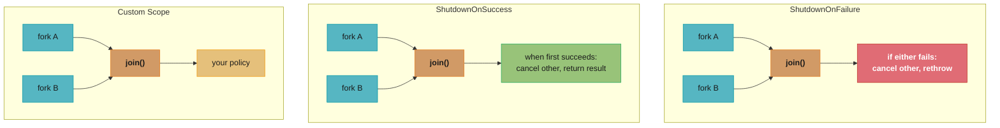
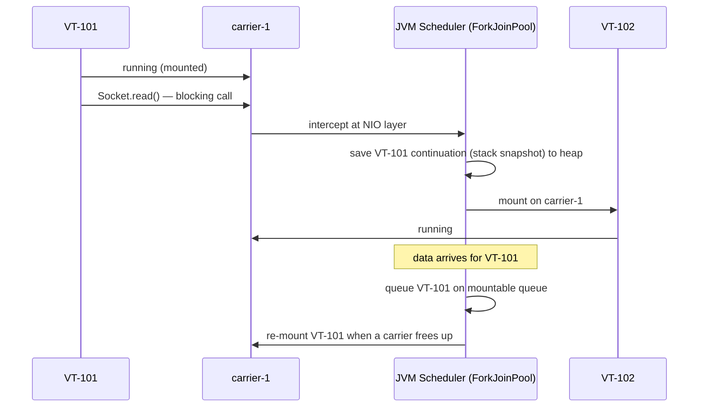
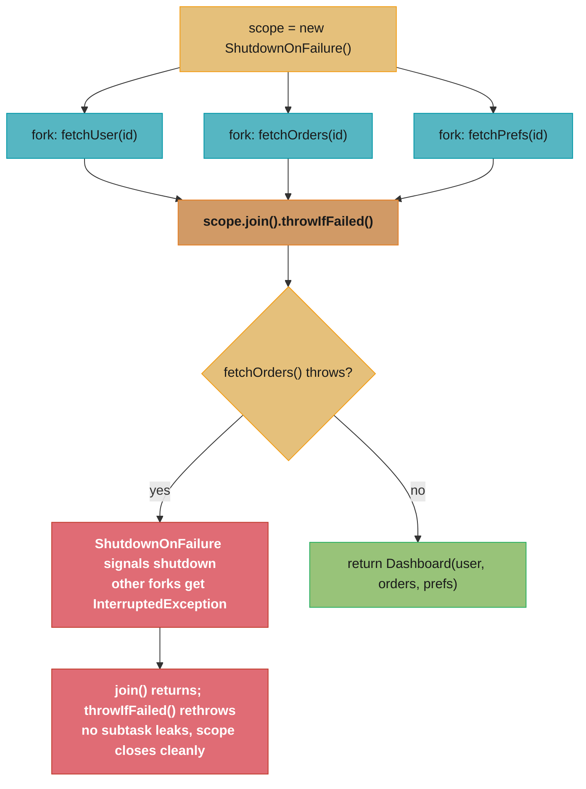

# Structured Concurrency and Project Loom

## 1. Concept Overview

Project Loom is the JVM-level effort to make concurrent programming simple and efficient by introducing **virtual threads** — lightweight threads managed by the JVM rather than the OS. Virtual threads enable writing straightforward, blocking-style concurrent code that scales like asynchronous code without callback complexity.

Key components:
- **Virtual threads** (`Thread.ofVirtual()`) — JVM-managed, ~few KB stack, multiplexed onto platform threads
- **Carrier threads** — the OS-visible platform threads that run virtual threads
- **Pinning** — when a virtual thread is "stuck" to its carrier (cannot be unmounted)
- **`StructuredTaskScope`** — composable, leak-proof scope for forking and joining subtasks (preview → Java 21 → Java 25 planned GA)
- **`ScopedValue`** — immutable, context-passing replacement for `ThreadLocal` (preview → Java 21)
- **Continuation** — internal JVM mechanism that saves/restores virtual thread stack state

Timeline: Virtual threads GA in Java 21 (JEP 444). `StructuredTaskScope` preview in Java 21 (JEP 453), re-previewed in Java 22/23/24/25 with API refinements.

---

## 2. Intuition

> A virtual thread is like a task in a task queue: the operating system sees only the queue's worker threads, while the JVM juggles thousands of tasks across those workers. When one task blocks on I/O, the worker picks up a different task — the OS thread is never wasted waiting.

**Key insight:** Platform threads cost ~1 MB of OS stack + OS context-switch overhead. Virtual threads cost ~few KB of heap (growable stack) + JVM context-switch (continuation save/restore). A service that would max out at 200 concurrent platform threads can run 100,000+ virtual threads at similar peak memory.

**In plain terms.** "Concurrency in Java has always been rationed by stack memory, not by CPU — so shrinking the per-task stack from a megabyte to a few kilobytes raises the ceiling by the same factor, roughly 256x, without changing a line of your logic."

That framing explains why virtual threads need no new programming model. Nothing about the
code got faster; the resource that was scarce simply stopped being scarce.

| Symbol | What it is |
|--------|------------|
| ~1 MB | A platform thread's OS stack — *reserved* up front, used or not |
| ~few KB | A virtual thread's initial heap stack; here taken as 4 KB, and it grows on demand |
| Carrier thread | The platform thread a virtual thread is mounted on; pool = CPU count |
| Memory budget | The RAM you are willing to spend on stacks — the real concurrency ceiling |
| 100,000+ | Not a JVM limit, just what a normal heap affords at a few KB each |

**Walk one example.** Fix a 1 GiB stack budget and ask how many of each thread type fit.

```
  budget = 1 GiB = 1,073,741,824 bytes

  platform threads   1,073,741,824 / 1,048,576 (1 MB)     = 1,024 threads
  virtual threads    1,073,741,824 / 4,096     (4 KB)     = 262,144 threads
  ratio              262,144 / 1,024                      = 256x

  now run the comparison the other way, at 100,000 concurrent tasks
    as platform threads  100,000 x 1 MB                   = 97.7 GiB   -> impossible
    as virtual threads   100,000 x 4 KB                   = 390.6 MiB  -> routine
    the 200-thread pool  200 x 1 MB                       = 200 MiB    -> comparable!
```

That last line is the module's claim made precise: 100,000 virtual threads (391 MiB) sit in
the same memory bracket as a 200-thread platform pool (200 MiB), while supporting 500x the
concurrency. The reservation is the crux — a platform thread parked on a socket read holds
its full megabyte the entire time, which is exactly the memory an I/O-bound service wastes
most of.

**Why this matters:** Java's traditional concurrency model (thread-per-request with a thread pool) forced architects toward reactive (non-blocking) styles like `CompletableFuture` / Spring WebFlux / Reactor to escape the thread-count ceiling. Virtual threads eliminate that ceiling while keeping synchronous code that is easier to read, debug, and profile.

---

## 3. Core Principles

1. **Virtual threads are cheap**: heap-allocated, ~few KB initial stack. Creating and discarding millions per day is normal.
2. **Carrier threads are scarce**: default pool size = number of CPU cores. They must never be pinned for long.
3. **Pinning is the primary gotcha**: `synchronized` blocks/methods and native frames pin the virtual thread to its carrier. If all carriers are pinned, throughput collapses.
4. **Structured concurrency = scope-bounded forking**: subtasks live and die within a scope; the parent cannot return before all children complete or are cancelled.
5. **ScopedValue is inheritance-safe context**: unlike `ThreadLocal`, `ScopedValue` is immutable and auto-inherits to child tasks without risk of stale values in pooled threads.
6. **Do not pool virtual threads**: creating 100,000 virtual threads is fine; pooling them defeats the purpose (pooling exists to limit expensive resources — virtual threads are not expensive).

---

## 4. Types / Architectures / Strategies

### 4.1 Virtual Thread vs Platform Thread vs CompletableFuture

| Dimension | Platform Thread | Virtual Thread | CompletableFuture |
|---|---|---|---|
| JVM stack | ~256 KB–1 MB (OS default) | ~few KB heap (grows on demand) | No dedicated stack |
| Blocking I/O | Blocks OS thread | Unmounts; carrier free | Does not block (async callbacks) |
| Per-thread cost | High | Very low | N/A |
| Max concurrency | ~200–5,000 (pool limited) | 100,000+ | Executor-limited |
| Code style | Blocking / sequential | Blocking / sequential | Callback / chain |
| Debuggability | Full stack trace | Full stack trace | Fragmented chain |
| Pinning risk | N/A | `synchronized`, native frames | N/A |
| Java version GA | All versions | Java 21 | Java 8 |

### 4.2 StructuredTaskScope Shapes



### 4.3 ScopedValue vs ThreadLocal

| Aspect | `ThreadLocal<T>` | `ScopedValue<T>` |
|---|---|---|
| Mutability | Mutable (`set()`, `remove()`) | Immutable (re-binding creates new scope) |
| Inheritance to child threads | Via `InheritableThreadLocal` (copies at thread start) | Automatic — available to all subtasks in scope |
| Virtual thread pools | Risk: pooled threads carry stale values | Safe: value bound per `ScopedValue.where(...).run(...)` call |
| Lifecycle | Manual `remove()` required | Automatic at scope boundary |
| Performance | Hash map lookup per thread | Direct reference (O(1), no map) |

---

## 5. Architecture Diagrams

### Virtual Thread Scheduling



Carrier threads (one per CPU core) never block: the scheduler unmounts a
virtual thread the instant it hits blocking I/O and mounts a ready one in its
place, only re-mounting the original once its data has arrived.

### Structured Task Scope Lifecycle



---

## 6. How It Works — Detailed Mechanics

### 6.1 Creating and Starting Virtual Threads

```java
// Three creation paths (Java 21 GA)

// 1. Thread.ofVirtual() builder
Thread vt = Thread.ofVirtual()
    .name("request-handler-", 0)   // auto-incrementing name
    .start(() -> handleRequest(req));

// 2. Thread.startVirtualThread() — shortcut for fire-and-forget
Thread.startVirtualThread(() -> processEvent(event));

// 3. Virtual thread per task executor (preferred for server code)
ExecutorService executor = Executors.newVirtualThreadPerTaskExecutor();
Future<Result> future = executor.submit(() -> callDatabase(query));
// No pool limit: each submit() creates exactly one virtual thread.
// Do NOT use a fixed thread pool executor with virtual threads —
// that defeats the purpose by throttling at the thread level.
```

### 6.2 The Pinning Problem

```java
// BROKEN: synchronized block pins the carrier thread
// If all carriers are pinned, virtual threads queue up — throughput collapses
class ConnectionPool {
    private final Queue<Connection> pool = new ArrayDeque<>();

    public synchronized Connection acquire() throws Exception {
        while (pool.isEmpty()) {
            wait();           // blocks inside synchronized → PINS carrier
        }
        return pool.poll();
    }

    public synchronized void release(Connection c) {
        pool.offer(c);
        notify();
    }
}

// FIX: replace synchronized + wait/notify with ReentrantLock + Condition
class ConnectionPool {
    private final Queue<Connection> pool = new ArrayDeque<>();
    private final ReentrantLock lock = new ReentrantLock();
    private final Condition notEmpty = lock.newCondition();

    public Connection acquire() throws InterruptedException {
        lock.lock();
        try {
            while (pool.isEmpty()) {
                notEmpty.await();  // releases lock; virtual thread unmounts — no pin
            }
            return pool.poll();
        } finally {
            lock.unlock();
        }
    }

    public void release(Connection c) {
        lock.lock();
        try {
            pool.offer(c);
            notEmpty.signal();
        } finally {
            lock.unlock();
        }
    }
}
```

**Diagnosis:** Check for pinning with `-Djdk.tracePinnedThreads=full` — prints a stack trace whenever a virtual thread blocks while pinned.

**What this actually says.** "A pinned virtual thread stops being lightweight and becomes a platform thread again — so your concurrency ceiling silently drops from 'as many as memory allows' to 'exactly the number of carrier threads,' which is your core count."

The severity is what surprises people. Pinning is not a percentage slowdown; it is a hard
collapse of the concurrency limit to a single-digit number, and it shows up as latency, not
as an error.

| Symbol | What it is |
|--------|------------|
| Carrier pool | Platform threads running virtual threads; parallelism defaults to CPU count |
| Pin | A virtual thread that cannot unmount — inside `synchronized`, or in a native frame |
| Blocking duration | How long the pin lasts; here the 100 ms JDBC round trip |
| Effective concurrency | `carriers` when pinned, versus unbounded when not |
| `ReentrantLock` | Releases the lock at `await()`, letting the virtual thread unmount cleanly |

**Walk one example.** An 8-core box, a 100 ms database call, first inside `synchronized` and then under `ReentrantLock`.

```
  carriers = availableProcessors()                    = 8

  pinned (synchronized around the 100 ms query)
    concurrent in-flight queries   = 8                 <- capped by carriers, not memory
    throughput  8 / 0.100 s                            = 80 requests/second
    the 9th request waits for a carrier, not for the DB

  not pinned (ReentrantLock; the virtual thread unmounts at await())
    concurrent in-flight queries   = unbounded by threads (bounded by the DB/pool)
    the 8 carriers stay busy mounting other ready virtual threads

  the Q13 incident, same shape
    100 concurrent requests / 8 carriers               = 12.5 waves
    latency 50 ms -> 4,000 ms                          = 80x degradation
    12.5 waves x 50 ms of pinned work                  = 625 ms of pure queueing per wave
```

80 requests per second on an 8-core machine doing pure I/O is the signature to recognize:
throughput pinned to `carriers / blocking_time` regardless of load. That the interim fix in
Q13 was raising `maxPoolSize` to 50 makes sense arithmetically — 50 carriers gives 500 req/s
— but it treats the symptom, since each of those 50 carriers is again a real 1 MB OS thread.

### 6.3 StructuredTaskScope — Fan-out with Automatic Cancellation

```java
// Fetch three independent resources concurrently; fail fast if any fails
record Dashboard(User user, List<Order> orders, Preferences prefs) {}

Dashboard fetchDashboard(long userId) throws InterruptedException, ExecutionException {
    try (var scope = new StructuredTaskScope.ShutdownOnFailure()) {
        Subtask<User>        userTask   = scope.fork(() -> userService.find(userId));
        Subtask<List<Order>> orderTask  = scope.fork(() -> orderService.findAll(userId));
        Subtask<Preferences> prefTask   = scope.fork(() -> prefService.get(userId));

        scope.join()            // waits for ALL forks to complete or scope to be shut down
             .throwIfFailed();  // propagates the first exception as ExecutionException

        return new Dashboard(userTask.get(), orderTask.get(), prefTask.get());
    }
    // Scope exits: all subtasks guaranteed to be done, no resource leaks
}
```

### 6.4 StructuredTaskScope.ShutdownOnSuccess — Racing

```java
// Race two CDN endpoints; return whichever responds first
String fetchWithRace(String path) throws InterruptedException, ExecutionException {
    try (var scope = new StructuredTaskScope.ShutdownOnSuccess<String>()) {
        scope.fork(() -> fetchFromCDN1(path));
        scope.fork(() -> fetchFromCDN2(path));

        scope.join();   // returns when the first succeeds; cancels the other
        return scope.result();  // the winning value
    }
}
// Java 25 note: API is being refined (ShutdownOnSuccess may be renamed/restructured)
```

### 6.5 ScopedValue — Safe Context Propagation

```java
// BROKEN with ThreadLocal in virtual-thread environments:
// pooled thread carries stale transaction context from previous request
static final ThreadLocal<Transaction> TX_CONTEXT = new ThreadLocal<>();
TX_CONTEXT.set(tx);                     // set in request thread
executor.submit(() -> dao.save(obj));   // virtual thread from pool — may carry old TX

// FIX: ScopedValue — immutable, scope-bound, auto-inherited
static final ScopedValue<Transaction> TX = ScopedValue.newInstance();

// Bind for the duration of one request
ScopedValue.where(TX, transaction).run(() -> {
    processRequest(req);          // TX.get() works here and in all subtasks
    // any scope.fork() subtask automatically inherits TX
});
// After run() exits: binding gone; no manual cleanup needed
```

### 6.6 Virtual Thread Internals: Continuation

Under the hood, a virtual thread's stack is stored as a heap-allocated `Continuation` object. When the virtual thread unmounts (e.g., blocking I/O), the JVM:
1. Captures the current method call stack (not the full OS stack — just live frames)
2. Serialises it into the `Continuation` heap object (default: on-demand growing chunks, typically 200–500 bytes for a shallow stack)
3. Removes the virtual thread from its carrier
4. When the blocking operation completes, enqueues the `Continuation` back onto the scheduler's work queue
5. A carrier picks it up and restores the stack state

This is why virtual threads have a *tiny* initial footprint but can grow: the stack is heap-managed via linked chunks, not a fixed OS allocation.

### 6.7 ThreadLocal and Virtual Threads — The Leak Risk

```java
// BROKEN: ThreadLocal in long-running virtual thread with large context
static final ThreadLocal<byte[]> BUFFER = ThreadLocal.withInitial(() -> new byte[64 * 1024]);

// With platform thread pools (bounded), the pool is small — ThreadLocals are bounded.
// With virtual threads (unbounded), 100,000 virtual threads × 64 KB ThreadLocal = 6.4 GB!
// Prefer: local variables, or ScopedValue for inherited context.

// If you MUST use ThreadLocal with virtual threads:
// (a) Call ThreadLocal.remove() explicitly before the virtual thread ends.
// (b) Set -Djdk.virtualThreadScheduler.maxPoolSize and monitor heap pressure.
```

**Read it like this.** "`ThreadLocal` costs one copy of its value per live thread, which was harmless when the thread count was capped at a couple hundred — remove the cap and the same line of code becomes a multi-gigabyte allocation."

Nothing about `ThreadLocal` changed. What changed is the multiplier, which is why this is a
scaling bug rather than a correctness bug and why it only appears under production load.

| Symbol | What it is |
|--------|------------|
| `ThreadLocal.withInitial` | Allocates one instance of the value **per thread that touches it** |
| Live thread count | The multiplier — bounded by a pool, unbounded with virtual threads |
| 64 KB | The per-thread buffer in the example above |
| `ScopedValue` | Binds one shared immutable value per scope; no per-thread copy |
| `remove()` | The manual escape hatch that drops the copy before the thread ends |

**Walk one example.** The same 64 KB buffer under a bounded pool and under virtual threads.

```
  bounded platform pool
    threads             = 200
    ThreadLocal cost    = 200 x 64 KB               = 12,800 KB   = 12.5 MiB   -> fine

  virtual threads, unbounded
    threads             = 100,000
    ThreadLocal cost    = 100,000 x 64 KB           = 6,400,000 KB = 6.4 GB
    multiplier          = 100,000 / 200             = 500x more copies

  what ScopedValue costs for the same context
    bindings            = 1 per scope, shared by every subtask in it
    copies              = 0 per thread
```

12.5 MiB against 6.4 GB, from the identical declaration. The bounded pool was silently
acting as the memory limit all along, and virtual threads removed it. This is also why
`remove()` is not a real fix at scale: it bounds the *lifetime* of each copy but not the
peak count, so 100,000 threads alive at once still hold 100,000 buffers simultaneously.

---

## 7. Real-World Examples

### 7.1 Spring Boot 3.2+ Virtual Thread Integration

```yaml
# application.yaml — enables virtual threads for Tomcat request handling
spring:
  threads:
    virtual:
      enabled: true    # replaces Tomcat's thread pool with virtual-thread-per-request
```

Each incoming HTTP request runs in its own virtual thread. The `@Async` executor is also updated to a `VirtualThreadTaskExecutor`. HikariCP connections must use `ReentrantLock` (they do — HikariCP 5.1+ is virtual-thread-friendly); however, any third-party libraries using `synchronized` on long operations will pin carriers.

### 7.2 GitHub Copilot / LLM API Client Patterns

LLM inference APIs have high latency (1–30 seconds per request). With platform threads, parallelising 500 concurrent LLM calls would require 500 platform threads (~500 MB RAM). With virtual threads:
```java
ExecutorService llmExecutor = Executors.newVirtualThreadPerTaskExecutor();
List<Future<String>> results = requests.stream()
    .map(req -> llmExecutor.submit(() -> llmClient.complete(req)))
    .toList();
```
500 concurrent calls use 500 virtual threads (few KB each) + one I/O-bound wait. The platform thread pool (= CPU cores) never blocks — it is free to handle other work.

### 7.3 Netflix Conductor — Task Fan-out

Workflow orchestration requires waiting for multiple task outputs before proceeding. Traditional approach: nested `CompletableFuture.allOf()` with callback chains. With `StructuredTaskScope`:
```java
try (var scope = new StructuredTaskScope.ShutdownOnFailure()) {
    var resultA = scope.fork(() -> executeTask(taskA, context));
    var resultB = scope.fork(() -> executeTask(taskB, context));
    scope.join().throwIfFailed();
    // Both tasks complete or both are cancelled on first failure
    return mergeResults(resultA.get(), resultB.get());
}
```
Error propagation is automatic; no manual exception chaining; no risk of dangling tasks.

---

## 8. Tradeoffs

| Concern | Virtual Threads | Platform Thread Pool | CompletableFuture / Reactive |
|---|---|---|---|
| Code complexity | Low (blocking style) | Medium (pool sizing) | High (callback chains) |
| Memory per concurrent task | ~few KB | ~1 MB | ~few KB (but no stack) |
| Max concurrency | 100,000+ | 200–5,000 | Executor-limited |
| Pinning risk | Yes — `synchronized`, native | N/A | N/A |
| Debug / stack trace | Full, readable | Full | Fragmented, reactor instrumentation needed |
| CPU-bound tasks | No benefit (still needs core) | Best | No benefit |
| Library compatibility | May pin on `synchronized` | Universal | Requires async libraries |
| ThreadLocal safety | Risk at scale (unbounded) | Safe (bounded pool) | N/A (no ThreadLocal typically) |

---

## 9. When to Use / When NOT to Use

### Use virtual threads when:
- The workload is I/O-bound (HTTP calls, DB queries, file I/O, message queues)
- You want blocking-style code but need high concurrency (thousands of simultaneous requests)
- Migrating a traditional thread-per-request service to higher concurrency without reactive rewrite
- Java 21+ is available

### Use `StructuredTaskScope` when:
- Fan-out: independent parallel sub-calls that all must succeed before continuing
- Race/hedge: fire multiple requests and use the first successful response
- You need automatic cancellation of sibling tasks on failure — without manual `CompletableFuture.cancel()` chains

### Do NOT use virtual threads when:
- The workload is CPU-bound (number crunching, image processing) — virtual threads offer no speedup over platform threads for CPU-bound work; `ForkJoinPool.commonPool()` is still the right tool
- Libraries you depend on use `synchronized` on long-blocking operations — pinning will degrade throughput to platform-thread levels (diagnose with `-Djdk.tracePinnedThreads=full`)
- Running on Java 8–20 (virtual threads not available)

### Do NOT pool virtual threads:
```java
// WRONG: defeats purpose — throttles at thread level again
ExecutorService pool = Executors.newFixedThreadPool(100);  // 100 virtual threads max

// RIGHT: one virtual thread per task — create freely
ExecutorService vtExec = Executors.newVirtualThreadPerTaskExecutor();
```

---

## 10. Common Pitfalls

### Pitfall 1: `synchronized` block causing pinning
```java
// BROKEN: pinned carrier during DB round trip (100ms latency × all carriers)
synchronized (lock) {
    String result = jdbcTemplate.queryForObject(sql, String.class);  // blocks in synchronized
}

// FIX
lock.lock();  // ReentrantLock — releases virtual thread without pinning carrier
try {
    String result = jdbcTemplate.queryForObject(sql, String.class);
} finally {
    lock.unlock();
}
```

### Pitfall 2: ThreadLocal carrying state across virtual thread recycling
Virtual threads are NOT pooled by the JDK scheduler, but if code wraps them in a pool (e.g., a custom scheduler, Netty), `ThreadLocal` values from a previous task survive into the next task.

### Pitfall 3: Calling `Thread.currentThread().isVirtual()` for branching
Branching on `.isVirtual()` reintroduces the virtual/platform split that virtual threads were designed to eliminate. Libraries should not branch this way; applications almost never need to.

### Pitfall 4: CPU-bound tasks on virtual threads monopolising carriers
```java
// CPU-bound work holds the carrier until completion — can starve I/O virtual threads
Thread.startVirtualThread(() -> {
    for (long i = 0; i < Long.MAX_VALUE; i++) { /* compute */ }  // never yields
});
// Fix: run CPU-bound work on a dedicated platform-thread pool, not virtual threads
```

### Pitfall 5: Forgetting `scope.join()` before accessing subtask results
```java
// BROKEN: accessing result before subtask completes
try (var scope = new StructuredTaskScope.ShutdownOnFailure()) {
    Subtask<String> task = scope.fork(() -> fetchData());
    return task.get();  // IllegalStateException: task not yet completed
}

// FIX: always join before accessing results
try (var scope = new StructuredTaskScope.ShutdownOnFailure()) {
    Subtask<String> task = scope.fork(() -> fetchData());
    scope.join().throwIfFailed();
    return task.get();  // safe — task is guaranteed complete
}
```

---

## 11. Technologies & Tools

| Tool / Feature | Version | Purpose |
|---|---|---|
| Virtual threads (`Thread.ofVirtual()`) | Java 21 GA (JEP 444) | JVM-managed lightweight threads |
| `Executors.newVirtualThreadPerTaskExecutor()` | Java 21 GA | One virtual thread per submitted task |
| `StructuredTaskScope` | Java 21 preview (JEP 453); re-preview 22/23/24 | Scope-bounded fork/join with cancellation |
| `ScopedValue` | Java 21 preview (JEP 446); re-preview 22/23; 24 (JEP 487) | Immutable context propagation to subtasks |
| `Continuation` (internal) | Java 19+ | Stack snapshot mechanism powering virtual threads |
| `-Djdk.tracePinnedThreads=full` | Java 19+ | Diagnose virtual thread pinning events |
| `-Djdk.virtualThreadScheduler.parallelism=N` | Java 19+ | Override default carrier pool size (default = #CPUs) |
| `-Djdk.virtualThreadScheduler.maxPoolSize=N` | Java 19+ | Override max carrier pool size |
| Spring Boot 3.2+ `spring.threads.virtual.enabled=true` | Spring Boot 3.2 (Java 21) | Enables virtual threads for Tomcat + @Async |
| HikariCP 5.1+ | 5.1.0 | Virtual-thread-safe connection pool (uses `StampedLock` not `synchronized`) |
| Micrometer virtual thread metrics | Micrometer 1.12+ | Reports carrier thread pool saturation |

---

## 12. Interview Questions with Answers

**Q1: What is a virtual thread and how does it differ from a platform thread?**
A virtual thread is a JVM-managed thread stored as a heap object (continuation) rather than a native OS thread. Platform threads map 1:1 to OS threads and cost ~1 MB of OS-allocated stack; virtual threads cost ~few KB of heap and are multiplexed by the JVM's `ForkJoinPool` scheduler onto a small pool of platform "carrier" threads (default size = number of CPU cores). When a virtual thread blocks on I/O, the JVM saves its stack state to the heap and mounts a different virtual thread on the carrier — the OS thread never blocks. This enables 100,000+ concurrent virtual threads at a fraction of the memory cost of equivalent platform threads.

**Q2: What is carrier thread pinning, how do you detect it, and how do you fix it?**
Pinning occurs when a virtual thread cannot be unmounted from its carrier platform thread. The two causes are: (1) the virtual thread is inside a `synchronized` block or method when it blocks; (2) the virtual thread calls a native method that blocks. When all carrier threads are pinned, no new virtual threads can run — throughput degrades to platform-thread levels. Detect with `-Djdk.tracePinnedThreads=full` (prints a stack trace on each pin event). Fix by replacing `synchronized` + `wait/notify` with `ReentrantLock` + `Condition.await()`, which releases the virtual thread without pinning the carrier.

**Q3: Should you pool virtual threads? Why or why not?**
No. Virtual threads are cheap to create (~few KB, microseconds to start), so the reason for pooling platform threads — limiting a scarce, expensive resource — does not apply. Pooling virtual threads re-introduces an artificial concurrency ceiling and defeats the model: pooled virtual threads can carry stale `ThreadLocal` state across tasks, and the pool size limit throttles throughput without providing any benefit. The correct pattern is `Executors.newVirtualThreadPerTaskExecutor()`, which creates exactly one virtual thread per submitted task with no upper limit.

**Q4: What is `StructuredTaskScope` and what problem does it solve that `CompletableFuture.allOf()` does not?**
`StructuredTaskScope` (JEP 453) enforces that all forked subtasks complete or are cancelled before the enclosing scope exits. It solves three problems with `CompletableFuture.allOf()`: (1) **cancellation**: if one subtask fails, `ShutdownOnFailure` automatically cancels remaining subtasks — `allOf()` requires manual cancellation wiring; (2) **leak prevention**: subtasks cannot outlive their scope (the `try` block guarantees all threads are done); (3) **structured nesting**: scopes can be nested with predictable ownership — parent scopes wait for child scopes, forming a tree analogous to structured statement nesting. `StructuredTaskScope` also preserves the virtual-thread-centric blocking style: `scope.join()` blocks the parent virtual thread without pinning a carrier.

**Q5: Explain the difference between `ScopedValue` and `ThreadLocal`. When would you choose each?**
`ThreadLocal` is mutable — any code can `set()` and `remove()` the value; in a pooled environment, a stale value from the previous task may be visible to the next. `ScopedValue` (JEP 446) is immutable within its scope: once bound via `ScopedValue.where(KEY, value).run(...)`, the value is fixed and automatically visible to all child scopes and `StructuredTaskScope` forks — no manual inheritance, no `InheritableThreadLocal` boilerplate. After the `run()` block exits, the binding disappears automatically. Use `ScopedValue` for request-scoped context (security principal, transaction, trace ID) in virtual-thread services. Keep `ThreadLocal` only where mutable per-thread state is genuinely needed (e.g., `SimpleDateFormat` caching in Java 8 code, where `ScopedValue` is unavailable).

**Q6: What happens to a virtual thread when it calls a blocking I/O operation?**
The JVM's I/O infrastructure intercepts blocking calls (socket reads, file reads, database JDBC) at the NIO layer. Instead of blocking the OS thread, the JVM: (1) saves the virtual thread's current call stack as a heap-allocated `Continuation` object; (2) removes (unmounts) the virtual thread from its carrier platform thread; (3) submits an async I/O request to the OS; (4) when the I/O completes, the scheduler enqueues the `Continuation` for re-mounting; (5) a carrier picks it up, restores the stack state, and resumes execution from exactly where it left off. The OS thread was free for other virtual threads throughout steps 2–4 — this is the core efficiency gain.

**Q7: What are the risks of using `ThreadLocal` at scale with virtual threads?**
With platform thread pools (bounded, e.g., 200 threads), `ThreadLocal` state is bounded: at most 200 copies of each `ThreadLocal` value exist. With virtual threads (unbounded), 100,000 concurrent tasks × a 64 KB `ThreadLocal<byte[]>` = 6.4 GB of ThreadLocal data. Additionally, if virtual threads are ever pooled (accidentally or via a third-party wrapper), stale ThreadLocal values from one task leak into the next. The fix: use local variables for task-scoped state, and `ScopedValue` for inherited context. If `ThreadLocal` is unavoidable, call `remove()` explicitly before the virtual thread ends.

**Q8: How does `StructuredTaskScope.ShutdownOnSuccess` work and when is it useful?**
`ShutdownOnSuccess` shuts down the scope (signalling cancellation) the moment the first subtask completes successfully. Subsequent forks receive `InterruptedException` and terminate. This implements the "race" or "hedge" pattern: submit the same request to two or more backends, accept the fastest successful response, cancel the rest. Use cases: CDN failover, primary vs read-replica queries, A/B latency comparison. After `scope.join()`, call `scope.result()` to retrieve the winning value. Unlike `CompletableFuture.anyOf()`, losers are guaranteed to be cancelled and no thread resources leak.

**Q9: Can virtual threads improve CPU-bound throughput?**
No. Virtual threads improve concurrency for I/O-bound work by freeing OS threads from waiting. For CPU-bound tasks (cryptography, image processing, scientific computing), the bottleneck is CPU cores, not threads. Each CPU-bound virtual thread holds its carrier for the entire computation — with N CPU cores and N+1 CPU-bound virtual threads, one must wait. The correct tool for CPU-bound parallel work is `ForkJoinPool.commonPool()` or a work-stealing executor sized to the number of cores. Virtual threads and ForkJoinPool are complementary: I/O-bound work → virtual threads; CPU-bound work → ForkJoinPool.

**Q10: How do you use virtual threads with JDBC/HikariCP safely?**
JDBC `Connection.execute()` calls involve I/O (network to database). With virtual threads, each call unmounts the virtual thread while waiting for the database response — the carrier thread is free. However, the connection pool itself must not use `synchronized` internally: older `synchronized`-based pool implementations would pin the carrier during pool acquisition. HikariCP 5.1.0+ replaced its internal `synchronized` sections with `StampedLock`, making it virtual-thread-safe. Spring Boot 3.2+ sets `spring.datasource.hikari.keepalive-time` and uses `spring.threads.virtual.enabled=true` together safely. Important: connection pool size still limits database concurrency — 100,000 virtual threads will still queue if the HikariCP pool is set to 10 connections.

**Q11: What is the carrier thread pool size and can you change it?**
The default carrier thread pool is a `ForkJoinPool` with parallelism set to `Runtime.getRuntime().availableProcessors()` — typically the number of vCPUs. This matches CPU-bound carrier work (e.g., running non-pinned virtual thread code between I/O waits). You can override it with `-Djdk.virtualThreadScheduler.parallelism=N` and the maximum pool size with `-Djdk.virtualThreadScheduler.maxPoolSize=N` (default: 256 to bound OS resource use). Changing these is rarely needed and usually signals a pinning problem rather than a configuration problem.

**Q12: How does the JVM handle virtual thread stack growth?**
Virtual thread stacks start small (the JDK allocates initial chunks of ~200 bytes or the minimum needed for the first frames) and grow on demand. The stack is stored as a linked list of heap-allocated chunks — there is no pre-committed large allocation. When a method call would overflow the current chunk, the JVM allocates a new chunk and chains it. When frames pop and a chunk is empty, it is released back to the heap. This contrasts with platform thread stacks, which are pre-committed OS memory (typically 256 KB–1 MB). The effective maximum virtual thread stack depth is limited by heap space, not a fixed stack size.

**Q13: Describe a production incident caused by virtual thread pinning and how to resolve it.**
Scenario: A service migrated to `spring.threads.virtual.enabled=true` on Spring Boot 3.2. Under load, response latency increased from 50 ms to 4 seconds and the carrier pool saturated. Root cause: the service used `lettuce` Redis client version 6.1, which used `synchronized` blocks internally when executing commands. With 100 concurrent requests, all 8 carrier threads (= CPU count) were pinned by lettuce's `synchronized` I/O calls. Resolution: (1) detected via `-Djdk.tracePinnedThreads=full` showing lettuce frames in stack traces; (2) upgraded lettuce to 6.3+ (rewrote critical sections with `StampedLock`); (3) as interim fix, increased carrier pool size with `-Djdk.virtualThreadScheduler.maxPoolSize=50`. Lesson: audit all I/O-touching library dependencies for `synchronized` on blocking code before migrating to virtual threads.

**Q14: What is `Thread.ofVirtual().unstarted()` used for?**
`Thread.ofVirtual().unstarted(Runnable task)` creates a virtual thread without starting it. This is useful when you need a `Thread` reference for passing to APIs that accept `Thread` (e.g., some testing frameworks, shutdown hooks, or thread-registry monitoring). After obtaining the reference, call `.start()` to run it. In contrast, `Thread.startVirtualThread(task)` is the fire-and-forget shortcut. The `unstarted()` pattern also enables pre-configuring the thread name, daemon status, and `UncaughtExceptionHandler` before starting — useful for observability in production systems where thread names appear in stack traces and APM tools.

**Q15: How do you set a timeout on a `StructuredTaskScope` join?**
```java
try (var scope = new StructuredTaskScope.ShutdownOnFailure()) {
    Subtask<String> task = scope.fork(() -> slowExternalCall());

    // joinUntil(deadline) — waits until deadline, then returns
    scope.joinUntil(Instant.now().plus(Duration.ofSeconds(5)));
    scope.throwIfFailed();

    if (task.state() != Subtask.State.SUCCESS) {
        throw new TimeoutException("External call did not complete within 5s");
    }
    return task.get();
}
// If deadline passes before all forks complete, joinUntil() returns normally
// (does NOT cancel forks automatically — you must handle incomplete tasks explicitly).
// ShutdownOnFailure does NOT trigger just from a timeout; inspect task.state().
```
`joinUntil(Instant deadline)` is the timeout variant of `join()`. It throws `TimeoutException` if the deadline passes before all forks complete. The scope's shutdown policy only triggers on fork success/failure — not timeout — so check `task.state()` after `joinUntil()` to distinguish timeout from completion.

---

## 13. Best Practices

1. **Use `Executors.newVirtualThreadPerTaskExecutor()`** for any I/O-bound task executor; never size a virtual thread pool.
2. **Replace `synchronized` with `ReentrantLock`** in any code that blocks while holding the lock; scan for pinning with `-Djdk.tracePinnedThreads=full` before deploying.
3. **Use `StructuredTaskScope` for fan-out** rather than `CompletableFuture.allOf()` — structured cancellation and leak-prevention are free.
4. **Prefer `ScopedValue` over `ThreadLocal`** for request-scoped context in services running on virtual threads.
5. **Do not pool virtual threads** — `newVirtualThreadPerTaskExecutor()` creates exactly one per task; pooling is an anti-pattern.
6. **Audit dependencies before migrating**: run the service under load with `-Djdk.tracePinnedThreads=full` and check that JDBC driver, Redis client, and HTTP client do not pin.
7. **Keep carrier pool size at default** (= CPU count); increase only if profiling confirms carrier thread starvation, not pinning.
8. **Name virtual threads** for production observability: `Thread.ofVirtual().name("req-handler-", 0).start(task)` — thread names appear in stack traces and APM tools.
9. **Set `UncaughtExceptionHandler`** on virtual threads used in fire-and-forget patterns to prevent silent exception swallowing.
10. **Java 21 is the target**: virtual threads are GA; `StructuredTaskScope` and `ScopedValue` are in preview and API may change through Java 24/25.

---

## 14. Case Study

**Scenario: Migrating a travel aggregator's flight-search service from reactive to virtual threads**

A travel aggregator calls 12 airline APIs concurrently per search request, collects all responses, and returns the cheapest options. The service was written in Spring WebFlux + Project Reactor (reactive) — complex `Flux.merge()` / `Mono.zip()` chains that were hard to debug and slow to onboard new engineers.

**Before (Reactive, Spring WebFlux):**
```java
Mono<SearchResult> search(SearchRequest req) {
    List<Mono<AirlineResponse>> calls = AIRLINES.stream()
        .map(a -> webClient.get().uri(a.url(req)).retrieve()
                           .bodyToMono(AirlineResponse.class)
                           .timeout(Duration.ofSeconds(3))
                           .onErrorReturn(AirlineResponse.empty()))
        .toList();
    return Mono.zip(calls, arrays -> Arrays.stream(arrays)
        .map(o -> (AirlineResponse) o)
        .toList())
        .map(SearchResult::from);
}
// Problem: error handling, timeout, and merging logic spread across operators.
// Stack traces show Reactor internals, not business code. Hard to add per-airline retry.
```

**After (Virtual threads + StructuredTaskScope, Spring Boot 3.2+):**
```java
// application.yaml: spring.threads.virtual.enabled: true

SearchResult search(SearchRequest req) throws InterruptedException, ExecutionException {
    List<AirlineResponse> responses = new ArrayList<>();

    try (var scope = new StructuredTaskScope.ShutdownOnFailure()) {
        List<Subtask<AirlineResponse>> tasks = AIRLINES.stream()
            .map(a -> scope.fork(() -> fetchAirline(a, req)))
            .toList();

        scope.joinUntil(Instant.now().plus(Duration.ofSeconds(3)));
        // collect successful results; ignore timed-out ones gracefully
        for (Subtask<AirlineResponse> t : tasks) {
            if (t.state() == Subtask.State.SUCCESS) {
                responses.add(t.get());
            }
        }
    }
    return SearchResult.from(responses);
}

private AirlineResponse fetchAirline(Airline a, SearchRequest req) {
    try {
        return restClient.get().uri(a.url(req)).retrieve().body(AirlineResponse.class);
    } catch (Exception e) {
        log.warn("Airline {} failed: {}", a.name(), e.getMessage());
        return AirlineResponse.empty();
    }
}
```

**Measured outcomes (1,000 concurrent searches, 12 airline calls each = 12,000 concurrent HTTP calls):**
- Platform thread pool (200 threads): queue depth spiked, p99 = 4.2s (thread starvation at peak)
- Reactive WebFlux: p99 = 480 ms but 3,000 lines of operator chains, 14 custom operators
- Virtual threads + StructuredTaskScope: p99 = 510 ms, 80 lines, full stack traces, linear mental model
- Memory: reactive 120 MB heap / 1,000 req; virtual threads 115 MB heap (similar — both I/O-bound)

**Put simply.** "Once every model is I/O-bound and none of them blocks an OS thread, they all converge on the same latency — so the remaining decision is not performance, it is how much code you have to write and read."

That is the real result buried in these four bullets. Two of the three options are within
noise of each other on latency and memory; only the platform pool is actually broken, and
only for an arithmetic reason.

| Symbol | What it is |
|--------|------------|
| Fan-out | 12 airline calls per search, all independent |
| Concurrent HTTP calls | `searches x fan-out` — the number that must be in flight at once |
| Pool of 200 | The platform-thread ceiling; anything beyond it queues |
| Waves | `calls / threads` — how many sequential rounds the pool is forced into |
| p99 | 99th-percentile latency; the tail that the queueing shows up in |

**Walk one example.** 1,000 concurrent searches at a fan-out of 12.

```
  concurrent HTTP calls  1,000 x 12                     = 12,000

  platform pool of 200
    waves               12,000 / 200                    = 60 sequential rounds
    -> the tail request waits behind 59 rounds of other requests
    observed p99                                        = 4.2 s

  as threads, by memory
    12,000 platform threads x 1 MB                      = 11.7 GiB
    12,000 virtual threads  x 4 KB                      = 46.9 MiB
    -> the pool is 200 not because 200 is right, but because 12,000 was impossible

  reactive vs virtual threads, the actual comparison
    p99          480 ms  vs  510 ms
    delta        510 - 480                              = 30 ms
    relative     30 / 480                               = 6.25%
    heap         120 MB  vs  115 MB                     = 4.2% less
    code         3,000 lines -> 80 lines
    reduction    (3,000 - 80) / 3,000                   = 97.3%
```

The 60 waves are the whole story of the platform-pool failure: 4.2 s of p99 is queueing, not
network time. On the reactive-vs-virtual comparison, note that the 30 ms gap is 6.25% of the
480 ms baseline rather than the 3% quoted in the Lesson below — either way it is dwarfed by
the 97.3% cut in code, which is the trade the team actually made.

**Lesson:** Virtual threads close the performance gap with reactive for I/O-bound workloads while recovering readable, debuggable code. The 30 ms latency difference (3%) was acceptable; the 97% reduction in code complexity was not.

**See also:**
- [Concurrency](../concurrency/README.md) — `ReentrantLock`, `CompletableFuture`, thread pool fundamentals
- [Java 9–21 Features](../java9_to_21_features/README.md) — virtual threads as a Java 21 language feature overview
- [Performance & Tuning](../performance_and_tuning/README.md) — carrier thread profiling, JMH for virtual thread benchmarks

---

## Related / See Also

- [Concurrency](../concurrency/README.md) — platform threads, CompletableFuture, and the concurrency primitives virtual threads replace
- [Java Memory Model](../java_memory_model/README.md) — ScopedValue vs ThreadLocal memory visibility, happens-before across threads
- [Java 9–21 Features](../java9_to_21_features/README.md) — virtual threads GA (Java 21 LTS) as a language-feature overview
- [Case Study: Thread Pool](../case_studies/design_thread_pool_java.md) — ThreadPoolExecutor internals and virtual thread pool comparison
- [JVM Internals](../jvm_internals/README.md) — continuation implementation, ForkJoinPool internals
- [LLD: Concurrency Patterns](../../lld/concurrency_patterns/README.md) — how Producer-Consumer and Thread Pool patterns adapt when threads become cheap (virtual threads)
- [Spring WebFlux](../../spring/spring_webflux/README.md) — the reactive alternative for I/O-bound concurrency when you are not yet on Java 21+
- [Async & Concurrency Patterns](../../backend/async_and_concurrency_patterns/README.md) — production fan-out/fan-in, timeout, and cancellation patterns applied to virtual threads
- [Processes, Threads & Context Switching](../../cs_fundamentals/processes_threads_and_context_switching/README.md) — the OS-level thread and context-switch costs that virtual threads amortize
