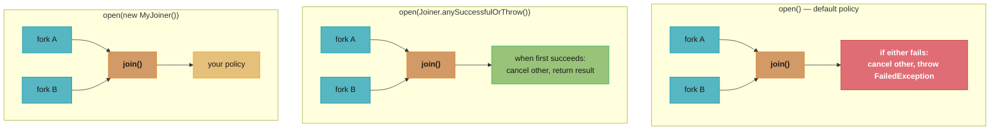
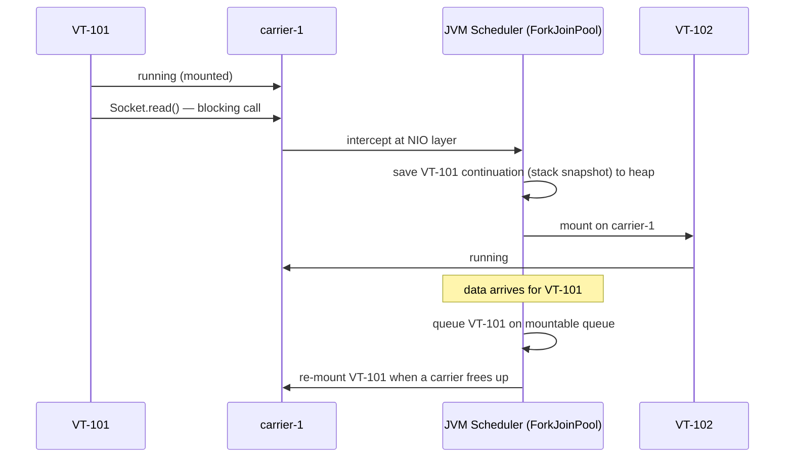
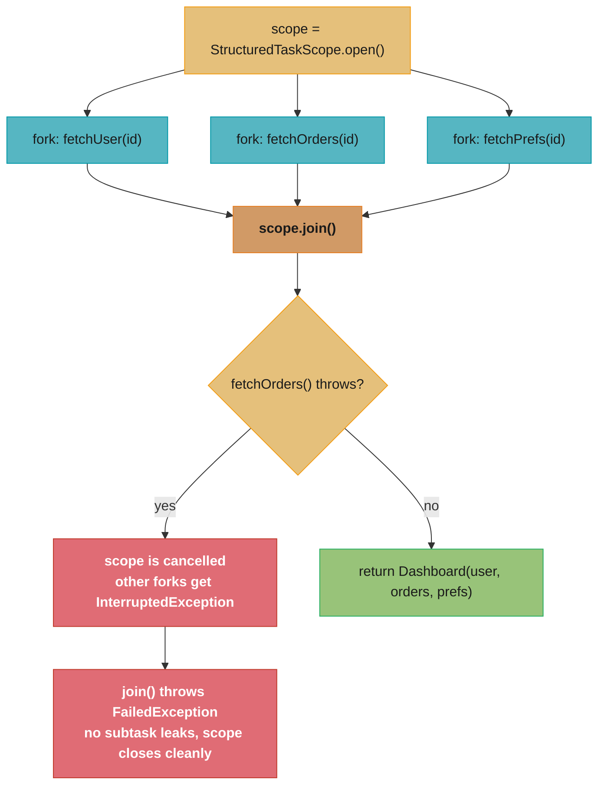

# Structured Concurrency and Project Loom

<!-- study-paths
senior: structured_concurrency_and_loom.md
principal: structured_concurrency_and_loom.md
files this module contributes to each curated path; omit a tier to leave it out
-->
## 1. Concept Overview

Project Loom is the JVM-level effort to make concurrent programming simple and efficient by introducing **virtual threads** — lightweight threads managed by the JVM rather than the OS. Virtual threads enable writing straightforward, blocking-style concurrent code that scales like asynchronous code without callback complexity.

Key components:
- **Virtual threads** (`Thread.ofVirtual()`) — JVM-managed, ~few KB stack, multiplexed onto platform threads
- **Carrier threads** — the OS-visible platform threads that run virtual threads
- **Pinning** — when a virtual thread is "stuck" to its carrier (cannot be unmounted); today this means a native frame on the stack, not `synchronized`
- **`StructuredTaskScope`** — composable, leak-proof scope for forking and joining subtasks (preview; opened with `open()` since Java 25, current shape JEP 525 in Java 26)
- **`ScopedValue`** — immutable, context-passing replacement for `ThreadLocal` (final in Java 25, JEP 506)
- **Continuation** — internal JVM mechanism that saves/restores virtual thread stack state

Timeline: virtual threads GA in Java 21 (JEP 444). JEP 491 (Java 24) made `synchronized` and `Object.wait()` stop pinning, and removed the `jdk.tracePinnedThreads` system property. `ScopedValue` finalised in Java 25 (JEP 506). `StructuredTaskScope` is still a preview API: JEP 505 (Java 25) replaced its public constructors with `open()` factory methods, and JEP 525 (Java 26) is the current shape.

---

## 2. Intuition

> A virtual thread is like a task in a task queue: the operating system sees only the queue's worker threads, while the JVM juggles thousands of tasks across those workers. When one task blocks on I/O, the worker picks up a different task — the OS thread is never wasted waiting.

**Key insight:** Platform threads cost ~1 MB of OS stack + OS context-switch overhead. Virtual threads cost ~few KB of heap (growable stack) + JVM context-switch (continuation save/restore). A service that would max out at 200 concurrent platform threads can run 100,000+ virtual threads at similar peak memory.

```
threads that fit = memory budget / stack size per thread
ratio             = threads that fit (virtual) / threads that fit (platform)
```

**In plain terms.** "Concurrency in Java has always been rationed by stack memory, not by CPU — so shrinking the per-task stack from a megabyte to a few kilobytes raises the ceiling by the same factor, roughly 256x, without changing a line of your logic."

That framing explains why virtual threads need no new programming model. Nothing about the
code got faster; the resource that was scarce simply stopped being scarce.

| Symbol | What it is |
|--------|------------|
| ~1 MB | A platform thread's OS stack — *reserved* up front, used or not |
| ~few KB | A virtual thread's initial heap stack; here taken as 4 KB, and it grows on demand |
| Carrier thread | The platform thread a virtual thread is mounted on; pool = CPU count |
| Memory budget | The RAM you are willing to spend on stacks — the real concurrency ceiling |
| 100,000+ | Not a JVM limit, just what a normal heap affords at a few KB each |

**Walk one example.** Fix a 1 GiB stack budget and ask how many of each thread type fit.

```
  budget = 1 GiB = 1,073,741,824 bytes

  platform threads   1,073,741,824 / 1,048,576 (1 MB)     = 1,024 threads
  virtual threads    1,073,741,824 / 4,096     (4 KB)     = 262,144 threads
  ratio              262,144 / 1,024                      = 256x

  now run the comparison the other way, at 100,000 concurrent tasks
    as platform threads  100,000 x 1 MB                   = 97.7 GiB   -> impossible
    as virtual threads   100,000 x 4 KB                   = 390.6 MiB  -> routine
    the 200-thread pool  200 x 1 MB                       = 200 MiB    -> comparable!
```

That last line is the module's claim made precise: 100,000 virtual threads (391 MiB) sit in
the same memory bracket as a 200-thread platform pool (200 MiB), while supporting 500x the
concurrency. The reservation is the crux — a platform thread parked on a socket read holds
its full megabyte the entire time, which is exactly the memory an I/O-bound service wastes
most of.

**Why this matters:** Java's traditional concurrency model (thread-per-request with a thread pool) forced architects toward reactive (non-blocking) styles like `CompletableFuture` / Spring WebFlux / Reactor to escape the thread-count ceiling. Virtual threads eliminate that ceiling while keeping synchronous code that is easier to read, debug, and profile.

---

## 3. Core Principles

1. **Virtual threads are cheap**: heap-allocated, ~few KB initial stack. Creating and discarding millions per day is normal.
2. **Carrier threads are scarce**: default pool size = number of CPU cores. They must never be pinned for long.
3. **Pinning is the primary gotcha**: a virtual thread that blocks while a **native frame** is on its stack — a JNI method or a Foreign Function & Memory downcall/upcall — cannot unmount. If all carriers are pinned, throughput collapses. `synchronized` and `Object.wait()` stopped pinning in Java 24 (JEP 491).
4. **Structured concurrency = scope-bounded forking**: subtasks live and die within a scope; the parent cannot return before all children complete or are cancelled.
5. **ScopedValue is inheritance-safe context**: unlike `ThreadLocal`, `ScopedValue` is immutable and auto-inherits to child tasks without risk of stale values in pooled threads.
6. **Do not pool virtual threads**: creating 100,000 virtual threads is fine; pooling them defeats the purpose (pooling exists to limit expensive resources — virtual threads are not expensive).

---

## 4. Types / Architectures / Strategies

### 4.1 Virtual Thread vs Platform Thread vs CompletableFuture

| Dimension | Platform Thread | Virtual Thread | CompletableFuture |
|---|---|---|---|
| JVM stack | ~256 KB–1 MB (OS default) | ~few KB heap (grows on demand) | No dedicated stack |
| Blocking I/O | Blocks OS thread | Unmounts; carrier free | Does not block (async callbacks) |
| Per-thread cost | High | Very low | N/A |
| Max concurrency | ~200–5,000 (pool limited) | 100,000+ | Executor-limited |
| Code style | Blocking / sequential | Blocking / sequential | Callback / chain |
| Debuggability | Full stack trace | Full stack trace | Fragmented chain |
| Pinning risk | N/A | Native frames (JNI, FFM) | N/A |
| Java version GA | All versions | Java 21 | Java 8 |

### 4.2 StructuredTaskScope Shapes



### 4.3 ScopedValue vs ThreadLocal

| Aspect | `ThreadLocal<T>` | `ScopedValue<T>` |
|---|---|---|
| Mutability | Mutable (`set()`, `remove()`) | Immutable (re-binding creates new scope) |
| Inheritance to child threads | Via `InheritableThreadLocal` (copies at thread start) | Automatic — available to all subtasks in scope |
| Virtual thread pools | Risk: pooled threads carry stale values | Safe: value bound per `ScopedValue.where(...).run(...)` call |
| Lifecycle | Manual `remove()` required | Automatic at scope boundary |
| Performance | Hash map lookup per thread | Direct reference (O(1), no map) |

---

## 5. Architecture Diagrams

### Virtual Thread Scheduling



Carrier threads (one per CPU core) never block: the scheduler unmounts a
virtual thread the instant it hits blocking I/O and mounts a ready one in its
place, only re-mounting the original once its data has arrived.

### Structured Task Scope Lifecycle



---

## 6. How It Works — Detailed Mechanics

### 6.1 Creating and Starting Virtual Threads

```java
// Three creation paths (Java 21 GA)

// 1. Thread.ofVirtual() builder
Thread vt = Thread.ofVirtual()
    .name("request-handler-", 0)   // auto-incrementing name
    .start(() -> handleRequest(req));

// 2. Thread.startVirtualThread() — shortcut for fire-and-forget
Thread.startVirtualThread(() -> processEvent(event));

// 3. Virtual thread per task executor (preferred for server code)
ExecutorService executor = Executors.newVirtualThreadPerTaskExecutor();
Future<Result> future = executor.submit(() -> callDatabase(query));
// No pool limit: each submit() creates exactly one virtual thread.
// Do NOT use a fixed thread pool executor with virtual threads —
// that defeats the purpose by throttling at the thread level.
```

### 6.2 The Pinning Problem

A virtual thread pins its carrier when it blocks while a **native frame** sits on its stack —
a JNI method, or a Foreign Function & Memory downcall or upcall. `synchronized` and
`Object.wait()` have not pinned since Java 24 (JEP 491); the JVM now tracks monitor ownership
per virtual thread, so a virtual thread unmounts freely inside a monitor.

```java
// BROKEN: the blocking call happens INSIDE a native frame, so the virtual thread
// cannot unmount — the carrier is held for the whole call.
static final MethodHandle NATIVE_QUERY = Linker.nativeLinker().downcallHandle(
        SYMBOLS.find("vendor_blocking_query").orElseThrow(),
        FunctionDescriptor.of(ValueLayout.JAVA_INT, ValueLayout.ADDRESS));

String query(MemorySegment sql) throws Throwable {
    int rc = (int) NATIVE_QUERY.invokeExact(sql);  // blocks in C; carrier is PINNED
    return decode(rc);
}

// FIX: keep native blocking off the carrier pool. Run it on a small, explicitly
// sized platform-thread executor and let the virtual thread block on the Future,
// which is a pure-Java park and unmounts normally.
static final ExecutorService NATIVE_IO =
        Executors.newFixedThreadPool(32, Thread.ofPlatform().name("native-io-", 0).factory());

String query(MemorySegment sql) throws Exception {
    return NATIVE_IO.submit(() -> {
        try {
            int rc = (int) NATIVE_QUERY.invokeExact(sql);
            return decode(rc);
        } catch (Throwable t) {
            throw new IllegalStateException("native query failed", t);
        }
    }).get();   // virtual thread unmounts here — carriers stay free
}
```

**Diagnosis:** the `jdk.VirtualThreadPinned` JFR event is enabled by default with a 20 ms
threshold, and carries the blocking operation, the pinning reason, and the carrier thread —
see §6.8. The old `-Djdk.tracePinnedThreads` system property was removed in Java 24; setting
it on the command line has no effect.

**What this actually says.** "A pinned virtual thread stops being lightweight and becomes a platform thread again — so your concurrency ceiling silently drops from 'as many as memory allows' to 'exactly the number of carrier threads,' which is your core count."

The severity is what surprises people. Pinning is not a percentage slowdown; it is a hard
collapse of the concurrency limit to a single-digit number, and it shows up as latency, not
as an error.

| Symbol | What it is |
|--------|------------|
| Carrier pool | Platform threads running virtual threads; parallelism defaults to CPU count |
| Pin | A virtual thread that cannot unmount — it blocks with a native frame on its stack |
| Blocking duration | How long the pin lasts; here the 100 ms native call |
| Effective concurrency | `carriers` when pinned, versus unbounded when not |
| Offload executor | A sized platform-thread pool that absorbs the native blocking instead |

**Walk one example.** An 8-core box and a 100 ms blocking call, once made directly as a native downcall and once made as a pure-Java blocking call.

```
  carriers = availableProcessors()                    = 8

  pinned (the 100 ms call blocks inside a native frame)
    concurrent in-flight calls     = 8                 <- capped by carriers, not memory
    throughput  8 / 0.100 s                            = 80 requests/second
    the 9th request waits for a carrier, not for the callee

  not pinned (pure-Java blocking; the virtual thread unmounts)
    concurrent in-flight calls     = unbounded by threads (bounded by the callee)
    the 8 carriers stay busy mounting other ready virtual threads

  measured on this 8-core machine, JDK 26, 64 virtual threads x 100 ms
    native downcall  840 ms wall                       = 76 requests/second
    Thread.sleep     105 ms wall                       = 610 requests/second
    ratio                                              = 8.0x
```

80 requests per second on an 8-core machine doing pure I/O is the signature to recognize:
throughput pinned to `carriers / blocking_time` regardless of load. The measured 76 req/s
lands within 5% of that prediction, and the 8.0x gap against the unpinned run is exactly the
carrier count — the number the ceiling collapsed to. Raising
`-Djdk.virtualThreadScheduler.maxPoolSize` treats the symptom: 50 carriers would give
500 req/s, but each of those 50 carriers is again a real 1 MB OS thread.

### 6.3 StructuredTaskScope — Fan-out with Automatic Cancellation

```java
// Fetch three independent resources concurrently; fail fast if any fails.
// StructuredTaskScope is a preview API: compile and run with --enable-preview.
record Dashboard(User user, List<Order> orders, Preferences prefs) {}

Dashboard fetchDashboard(long userId) throws InterruptedException {
    try (var scope = StructuredTaskScope.open()) {   // default policy: all succeed, or any fails
        Subtask<User>        userTask   = scope.fork(() -> userService.find(userId));
        Subtask<List<Order>> orderTask  = scope.fork(() -> orderService.findAll(userId));
        Subtask<Preferences> prefTask   = scope.fork(() -> prefService.get(userId));

        scope.join();   // waits for ALL forks; throws FailedException with the first
                        // failure as its cause, after cancelling the siblings

        return new Dashboard(userTask.get(), orderTask.get(), prefTask.get());
    }
    // Scope exits: all subtasks guaranteed to be done, no resource leaks
}
```

The zero-argument `open()` covers the fan-out case with no joiner at all. Any other policy is
a `Joiner` handed to `open(Joiner)`: `allSuccessfulOrThrow()` (a `List` of results in fork
order), `awaitAllSuccessfulOrThrow()`, `awaitAll()`, `anySuccessfulOrThrow()`, and
`allUntil(Predicate)` for a custom cancellation condition.

### 6.4 Racing with `Joiner.anySuccessfulOrThrow()`

```java
// Race two CDN endpoints; return whichever responds first
String fetchWithRace(String path) throws InterruptedException {
    try (var scope = StructuredTaskScope.open(Joiner.<String>anySuccessfulOrThrow())) {
        scope.fork(() -> fetchFromCDN1(path));
        scope.fork(() -> fetchFromCDN2(path));

        return scope.join();   // first success cancels the loser and is returned;
                               // if every subtask fails, join() throws FailedException
    }
}
```

### 6.5 ScopedValue — Safe Context Propagation

```java
// BROKEN with ThreadLocal in virtual-thread environments:
// pooled thread carries stale transaction context from previous request
static final ThreadLocal<Transaction> TX_CONTEXT = new ThreadLocal<>();
TX_CONTEXT.set(tx);                     // set in request thread
executor.submit(() -> dao.save(obj));   // virtual thread from pool — may carry old TX

// FIX: ScopedValue — immutable, scope-bound, auto-inherited
static final ScopedValue<Transaction> TX = ScopedValue.newInstance();

// Bind for the duration of one request
ScopedValue.where(TX, transaction).run(() -> {
    processRequest(req);          // TX.get() works here and in all subtasks
    // any scope.fork() subtask automatically inherits TX
});
// After run() exits: binding gone; no manual cleanup needed
```

### 6.6 Virtual Thread Internals: Continuation

Under the hood, a virtual thread's stack is stored as a heap-allocated `Continuation` object. When the virtual thread unmounts (e.g., blocking I/O), the JVM:
1. Captures the current method call stack (not the full OS stack — just live frames)
2. Serialises it into heap-allocated stack chunk objects, sized to the frames that are actually live rather than to a pre-committed maximum
3. Removes the virtual thread from its carrier
4. When the blocking operation completes, enqueues the `Continuation` back onto the scheduler's work queue
5. A carrier picks it up and restores the stack state

This is why virtual threads have a *tiny* initial footprint but can grow: the stack is heap-managed via linked chunks, not a fixed OS allocation.

### 6.7 ThreadLocal and Virtual Threads — The Leak Risk

```java
// BROKEN: ThreadLocal in long-running virtual thread with large context
static final ThreadLocal<byte[]> BUFFER = ThreadLocal.withInitial(() -> new byte[64 * 1024]);

// With platform thread pools (bounded), the pool is small — ThreadLocals are bounded.
// With virtual threads (unbounded), 100,000 virtual threads × 64 KB ThreadLocal = 6.4 GB!
// Prefer: local variables, or ScopedValue for inherited context.

// If you MUST use ThreadLocal with virtual threads:
// (a) Call ThreadLocal.remove() explicitly before the virtual thread ends.
// (b) Bound how many virtual threads reach that code at once with a Semaphore (§6.9) —
//     maxPoolSize caps CARRIERS, not virtual threads, so it does nothing for this.
```

**Read it like this.** "`ThreadLocal` costs one copy of its value per live thread, which was harmless when the thread count was capped at a couple hundred — remove the cap and the same line of code becomes a multi-gigabyte allocation."

Nothing about `ThreadLocal` changed. What changed is the multiplier, which is why this is a
scaling bug rather than a correctness bug and why it only appears under production load.

| Symbol | What it is |
|--------|------------|
| `ThreadLocal.withInitial` | Allocates one instance of the value **per thread that touches it** |
| Live thread count | The multiplier — bounded by a pool, unbounded with virtual threads |
| 64 KB | The per-thread buffer in the example above |
| `ScopedValue` | Binds one shared immutable value per scope; no per-thread copy |
| `remove()` | The manual escape hatch that drops the copy before the thread ends |

**Walk one example.** The same 64 KB buffer under a bounded pool and under virtual threads.

```
  bounded platform pool
    threads             = 200
    ThreadLocal cost    = 200 x 64 KB               = 12,800 KB   = 12.5 MiB   -> fine

  virtual threads, unbounded
    threads             = 100,000
    ThreadLocal cost    = 100,000 x 64 KB           = 6,400,000 KB = 6.4 GB
    multiplier          = 100,000 / 200             = 500x more copies

  what ScopedValue costs for the same context
    bindings            = 1 per scope, shared by every subtask in it
    copies              = 0 per thread
```

12.5 MiB against 6.4 GB, from the identical declaration. The bounded pool was silently
acting as the memory limit all along, and virtual threads removed it. This is also why
`remove()` is not a real fix at scale: it bounds the *lifetime* of each copy but not the
peak count, so 100,000 threads alive at once still hold 100,000 buffers simultaneously.

### 6.8 Observing the Scheduler: JFR and `VirtualThreadSchedulerMXBean`

With `jdk.tracePinnedThreads` gone, pinning is a JFR question and carrier saturation is an
MXBean question.

```
$ java -XX:StartFlightRecording=filename=app.jfr,settings=default -jar app.jar
$ jfr print --events jdk.VirtualThreadPinned app.jfr
```

`jdk.VirtualThreadPinned` is enabled by default at a **20 ms** threshold and carries three
fields: `blockingOperation`, `pinnedReason`, and `carrierThread`. It fires when a virtual
thread performs a *blocking Java operation* while pinned — so time spent blocked inside the
native call itself never appears in it. A native library that blocks in C and never re-enters
Java burns carriers while the recording stays empty; that case shows up only as a saturated
scheduler, which is what the MXBean measures.

```java
// jdk.management module; ObjectName "jdk.management:type=VirtualThreadScheduler"
var sched = ManagementFactory.getPlatformMXBean(VirtualThreadSchedulerMXBean.class);

sched.getParallelism();                 // target parallelism, default = availableProcessors()
sched.getPoolSize();                    // platform threads the scheduler has started
sched.getMountedVirtualThreadCount();   // virtual threads currently on a carrier
sched.getQueuedVirtualThreadCount();    // virtual threads waiting for a carrier

sched.setParallelism(16);               // 1..32767; changes target parallelism at runtime
```

The saturation signal is `queuedVirtualThreadCount` staying high while
`mountedVirtualThreadCount` sits at `parallelism`: every carrier is busy and work is backing
up. Micrometer's `micrometer-java21` module (1.14+) publishes exactly these as
`jvm.threads.virtual.pinned` (a timer fed by the JFR event), `jvm.threads.virtual.parallelism`,
`jvm.threads.virtual.pool.size` and `jvm.threads.virtual.live`.

### 6.9 Bounding Concurrency with a `Semaphore`, Not a Pool

"Never pool virtual threads" leaves an obvious question: when a downstream service tolerates
only ten concurrent calls, what enforces the ten? Not a thread pool — restricting concurrency
was only ever a side effect of pooling. Use the construct built for it.

```java
// WRONG: a fixed pool used purely as a concurrency limiter re-introduces the ceiling
ExecutorService limiter = Executors.newFixedThreadPool(10);
Result foo() throws Exception { return limiter.submit(this::callLimitedService).get(); }

// RIGHT: one virtual thread per task, a Semaphore across all of them
static final Semaphore SEM = new Semaphore(10);

Result foo() throws InterruptedException {
    SEM.acquire();
    try {
        return callLimitedService();   // at most 10 in flight, whatever the thread count
    } finally {
        SEM.release();
    }
}
```

The two are structurally the same object: a pool queues *tasks* waiting for a worker, a
semaphore queues *threads* waiting for a permit, and with virtual threads the thread is the
task. The semaphore version keeps the blocking-style call stack and the real stack trace.
A connection pool already is a semaphore — a 10-connection HikariCP pool blocks the eleventh
acquirer — so do not wrap one in another.

---

## 7. Real-World Examples

### 7.1 Spring Boot 3.2+ Virtual Thread Integration

```yaml
# application.yaml — enables virtual threads for Tomcat request handling
spring:
  threads:
    virtual:
      enabled: true    # replaces Tomcat's thread pool with virtual-thread-per-request
```

Each incoming HTTP request runs in its own virtual thread. The `@Async` executor is also updated to a `VirtualThreadTaskExecutor`. The connection pool remains the real concurrency limit: HikariCP's `ConcurrentBag` hands connections off through a `SynchronousQueue` and blocks acquirers past the configured size, so a 10-connection pool still admits ten concurrent queries no matter how many virtual threads are waiting. What does pin is a driver that blocks in native code — a JNI-based client, or one built on the Foreign Function & Memory API.

### 7.2 GitHub Copilot / LLM API Client Patterns

LLM inference APIs have high latency (1–30 seconds per request). With platform threads, parallelising 500 concurrent LLM calls would require 500 platform threads (~500 MB RAM). With virtual threads:
```java
ExecutorService llmExecutor = Executors.newVirtualThreadPerTaskExecutor();
List<Future<String>> results = requests.stream()
    .map(req -> llmExecutor.submit(() -> llmClient.complete(req)))
    .toList();
```
500 concurrent calls use 500 virtual threads (few KB each) + one I/O-bound wait. The platform thread pool (= CPU cores) never blocks — it is free to handle other work.

### 7.3 Workflow Orchestration — Task Fan-out

Workflow engines (Conductor, Temporal, Camunda) must wait for several task outputs before advancing a node. Traditional approach: nested `CompletableFuture.allOf()` with callback chains. With `StructuredTaskScope`:
```java
try (var scope = StructuredTaskScope.open()) {
    var resultA = scope.fork(() -> executeTask(taskA, context));
    var resultB = scope.fork(() -> executeTask(taskB, context));
    scope.join();
    // Both tasks complete, or both are cancelled on the first failure
    return mergeResults(resultA.get(), resultB.get());
}
```
Error propagation is automatic; no manual exception chaining; no risk of dangling tasks.

---

## 8. Tradeoffs

| Concern | Virtual Threads | Platform Thread Pool | CompletableFuture / Reactive |
|---|---|---|---|
| Code complexity | Low (blocking style) | Medium (pool sizing) | High (callback chains) |
| Memory per concurrent task | ~few KB | ~1 MB | ~few KB (but no stack) |
| Max concurrency | 100,000+ | 200–5,000 | Executor-limited |
| Pinning risk | Yes — native frames (JNI, FFM) | N/A | N/A |
| Debug / stack trace | Full, readable | Full | Fragmented, reactor instrumentation needed |
| CPU-bound tasks | No benefit (still needs core) | Best | No benefit |
| Library compatibility | May pin on native transports | Universal | Requires async libraries |
| ThreadLocal safety | Risk at scale (unbounded) | Safe (bounded pool) | N/A (no ThreadLocal typically) |

---

## 9. When to Use / When NOT to Use

### Use virtual threads when:
- The workload is I/O-bound (HTTP calls, DB queries, file I/O, message queues)
- You want blocking-style code but need high concurrency (thousands of simultaneous requests)
- Migrating a traditional thread-per-request service to higher concurrency without reactive rewrite
- Java 21+ is available

### Use `StructuredTaskScope` when:
- Fan-out: independent parallel sub-calls that all must succeed before continuing
- Race/hedge: fire multiple requests and use the first successful response
- You need automatic cancellation of sibling tasks on failure — without manual `CompletableFuture.cancel()` chains

### Do NOT use virtual threads when:
- The workload is CPU-bound (number crunching, image processing) — virtual threads offer no speedup over platform threads for CPU-bound work; `ForkJoinPool.commonPool()` is still the right tool
- Libraries you depend on block inside native code (JNI drivers, FFM downcalls) — pinning will degrade throughput to platform-thread levels (diagnose with the `jdk.VirtualThreadPinned` JFR event and the scheduler MXBean, §6.8)
- Running on Java 8–20 (virtual threads not available)

### Do NOT pool virtual threads:
```java
// WRONG: defeats purpose — throttles at thread level again
ExecutorService pool = Executors.newFixedThreadPool(100);  // 100 virtual threads max

// RIGHT: one virtual thread per task — create freely
ExecutorService vtExec = Executors.newVirtualThreadPerTaskExecutor();
```

---

## 10. Common Pitfalls

### Pitfall 1: a native driver pinning the carrier during a round trip
```java
// BROKEN: the round trip blocks inside a JNI frame, so the carrier is held for 100 ms
byte[] blob = nativeStore.fetch(key);   // JNI method that blocks in C

// FIX: absorb the native blocking on a sized platform-thread executor; the virtual
// thread parks on the Future, which is a pure-Java block and unmounts normally
byte[] blob = NATIVE_IO.submit(() -> nativeStore.fetch(key)).get();
```
Note what is NOT on this list any more: `synchronized`. Since Java 24 (JEP 491) the JVM
tracks monitor ownership per virtual thread, so blocking inside a monitor, contending for
one, and `Object.wait()` all unmount cleanly. Code already migrated to `ReentrantLock` for
pinning reasons does not need to be migrated back.

### Pitfall 2: ThreadLocal carrying state across virtual thread recycling
Virtual threads are NOT pooled by the JDK scheduler, but if code wraps them in a pool (e.g., a custom scheduler, Netty), `ThreadLocal` values from a previous task survive into the next task.

### Pitfall 3: Calling `Thread.currentThread().isVirtual()` for branching
Branching on `.isVirtual()` reintroduces the virtual/platform split that virtual threads were designed to eliminate. Libraries should not branch this way; applications almost never need to.

### Pitfall 4: CPU-bound tasks on virtual threads monopolising carriers
```java
// CPU-bound work holds the carrier until completion — can starve I/O virtual threads
Thread.startVirtualThread(() -> {
    for (long i = 0; i < Long.MAX_VALUE; i++) { /* compute */ }  // never yields
});
// Fix: run CPU-bound work on a dedicated platform-thread pool, not virtual threads
```

### Pitfall 5: Forgetting `scope.join()` before accessing subtask results
```java
// BROKEN: accessing result before subtask completes
try (var scope = StructuredTaskScope.open()) {
    Subtask<String> task = scope.fork(() -> fetchData());
    return task.get();  // IllegalStateException: subtask has not completed
}

// FIX: always join before accessing results
try (var scope = StructuredTaskScope.open()) {
    Subtask<String> task = scope.fork(() -> fetchData());
    scope.join();
    return task.get();  // safe — task is guaranteed complete
}
```

---

## 11. Technologies & Tools

| Tool / Feature | Version | Purpose |
|---|---|---|
| Virtual threads (`Thread.ofVirtual()`) | Java 21 GA (JEP 444) | JVM-managed lightweight threads |
| `Executors.newVirtualThreadPerTaskExecutor()` | Java 21 GA | One virtual thread per submitted task |
| `StructuredTaskScope` | Preview; `open()` factories since Java 25 (JEP 505), current shape Java 26 (JEP 525) | Scope-bounded fork/join with cancellation |
| `ScopedValue` | Java 25 final (JEP 506) | Immutable context propagation to subtasks |
| `Continuation` (internal) | Java 19+ | Stack snapshot mechanism powering virtual threads |
| `jdk.VirtualThreadPinned` JFR event | Java 24+ (JEP 491) | Diagnose pinning; on by default, 20 ms threshold |
| `VirtualThreadSchedulerMXBean` | Java 24+ | Live parallelism, pool size, mounted and queued counts |
| `-Djdk.virtualThreadScheduler.parallelism=N` | Java 19+ | Override default carrier pool size (default = #CPUs) |
| `-Djdk.virtualThreadScheduler.maxPoolSize=N` | Java 19+ | Override max carrier pool size (default 256) |
| `spring.threads.virtual.enabled=true` | Spring Boot 3.2+ (Java 21) | Enables virtual threads for Tomcat + @Async |
| HikariCP | 7.1.0 | Connection pool; blocks acquirers past pool size, acting as the real concurrency limit |
| Micrometer virtual thread metrics | `micrometer-java21` 1.14+ | `jvm.threads.virtual.*` pinned timer plus scheduler gauges |

---

## 12. Interview Questions with Answers

**Q1: What is a virtual thread and how does it differ from a platform thread?**
**Short:** A virtual thread is a JVM-managed continuation on the heap costing a few KB, versus a platform thread's ~1 MB OS-allocated stack.
A virtual thread is a JVM-managed thread stored as a heap object (continuation) rather than a native OS thread. Platform threads map 1:1 to OS threads and cost ~1 MB of OS-allocated stack; virtual threads cost ~few KB of heap and are multiplexed by the JVM's `ForkJoinPool` scheduler onto a small pool of platform "carrier" threads (default size = number of CPU cores). When a virtual thread blocks on I/O, the JVM saves its stack state to the heap and mounts a different virtual thread on the carrier — the OS thread never blocks. This enables 100,000+ concurrent virtual threads at a fraction of the memory cost of equivalent platform threads.

**Q2: What is carrier thread pinning, how do you detect it, and how do you fix it?**
**Short:** Carrier thread pinning happens when a virtual thread cannot unmount because a blocking native frame sits on its stack.
Pinning occurs when a virtual thread cannot unmount from its carrier platform thread because a native frame is on its stack. The cause today is native code: a JNI method, or a Foreign Function & Memory downcall or upcall, that blocks — plus the narrow cases of blocking during class loading or class initialization. When all carriers are pinned, no other virtual thread can run and throughput collapses to `carriers / blocking_time`. Detect it with the `jdk.VirtualThreadPinned` JFR event, enabled by default at a 20 ms threshold, which reports the blocking operation, the pinning reason, and the carrier thread; corroborate with `VirtualThreadSchedulerMXBean.getQueuedVirtualThreadCount()`. Fix it by moving the native blocking call onto a small, explicitly sized platform-thread executor and having the virtual thread park on the resulting `Future`. Note what is no longer a cause: `synchronized` and `Object.wait()` stopped pinning in Java 24 under JEP 491.

**Q3: Should you pool virtual threads? Why or why not?**
**Short:** Virtual threads should never be pooled since they are cheap to create and pooling just reintroduces an artificial concurrency ceiling.
No. Virtual threads are cheap to create (~few KB, microseconds to start), so the reason for pooling platform threads — limiting a scarce, expensive resource — does not apply. Pooling virtual threads re-introduces an artificial concurrency ceiling and defeats the model: pooled virtual threads can carry stale `ThreadLocal` state across tasks, and the pool size limit throttles throughput without providing any benefit. The correct pattern is `Executors.newVirtualThreadPerTaskExecutor()`, which creates exactly one virtual thread per submitted task with no upper limit.

**Q4: What is `StructuredTaskScope` and what problem does it solve that `CompletableFuture.allOf()` does not?**
**Short:** StructuredTaskScope guarantees every forked subtask completes or is cancelled before the enclosing scope exits, unlike allOf().
`StructuredTaskScope` enforces that all forked subtasks complete or are cancelled before the enclosing scope exits. It solves three problems with `CompletableFuture.allOf()`: (1) **cancellation**: if one subtask fails, the default policy of `StructuredTaskScope.open()` cancels the remaining subtasks and makes `join()` throw `FailedException` — `allOf()` requires manual cancellation wiring; (2) **leak prevention**: subtasks cannot outlive their scope (the `try` block guarantees all threads are done); (3) **structured nesting**: scopes can be nested with predictable ownership — parent scopes wait for child scopes, forming a tree analogous to structured statement nesting. `StructuredTaskScope` also preserves the virtual-thread-centric blocking style: `scope.join()` blocks the parent virtual thread without pinning a carrier. It remains a preview API — enable it with `--enable-preview`.

**Q5: Explain the difference between `ScopedValue` and `ThreadLocal`. When would you choose each?**
**Short:** ScopedValue is immutable and automatically inherited by child scopes, while ThreadLocal is mutable and can leak stale values across pooled tasks.
`ThreadLocal` is mutable — any code can `set()` and `remove()` the value; in a pooled environment, a stale value from the previous task may be visible to the next. `ScopedValue`, final since Java 25 (JEP 506), is immutable within its scope: once bound via `ScopedValue.where(KEY, value).run(...)`, the value is fixed and automatically visible to all child scopes and `StructuredTaskScope` forks — no manual inheritance, no `InheritableThreadLocal` boilerplate. Bindings chain, so `where(X, v).where(Y, w).run(...)` binds both in one call. After the `run()` block exits, the binding disappears automatically. Use `ScopedValue` for request-scoped context (security principal, transaction, trace ID) in virtual-thread services. Keep `ThreadLocal` only where a callee genuinely has to write state back to a faraway caller, which is the one shape `ScopedValue` deliberately does not support.

**Q6: What happens to a virtual thread when it calls a blocking I/O operation?**
**Short:** A blocking virtual thread has its stack saved as a heap Continuation and unmounted, leaving its carrier free for other virtual threads.
The JVM's I/O infrastructure intercepts blocking calls (socket reads, file reads, database JDBC) at the NIO layer. Instead of blocking the OS thread, the JVM: (1) saves the virtual thread's current call stack as a heap-allocated `Continuation` object; (2) removes (unmounts) the virtual thread from its carrier platform thread; (3) submits an async I/O request to the OS; (4) when the I/O completes, the scheduler enqueues the `Continuation` for re-mounting; (5) a carrier picks it up, restores the stack state, and resumes execution from exactly where it left off. The OS thread was free for other virtual threads throughout steps 2–4 — this is the core efficiency gain.

**Q7: What are the risks of using `ThreadLocal` at scale with virtual threads?**
**Short:** Unbounded virtual threads each holding a ThreadLocal can multiply memory use far beyond a bounded platform-thread pool's total.
With platform thread pools (bounded, e.g., 200 threads), `ThreadLocal` state is bounded: at most 200 copies of each `ThreadLocal` value exist. With virtual threads (unbounded), 100,000 concurrent tasks × a 64 KB `ThreadLocal<byte[]>` = 6.4 GB of ThreadLocal data. Additionally, if virtual threads are ever pooled (accidentally or via a third-party wrapper), stale ThreadLocal values from one task leak into the next. The fix: use local variables for task-scoped state, and `ScopedValue` for inherited context. If `ThreadLocal` is unavoidable, call `remove()` explicitly before the virtual thread ends.

**Q8: How does `Joiner.anySuccessfulOrThrow()` work and when is it useful?**
**Short:** Joiner.anySuccessfulOrThrow() cancels a scope the instant one subtask succeeds and returns that result, implementing a race pattern.
It cancels the scope the moment the first subtask completes successfully, and `join()` returns that subtask's result directly. The losing forks are interrupted and terminate. This implements the "race" or "hedge" pattern: submit the same request to two or more backends, accept the fastest successful response, cancel the rest. Use cases: CDN failover, primary vs read-replica queries, A/B latency comparison. If every subtask fails, `join()` throws `FailedException` with one of the failures as its cause; if nothing was forked, `NoSuchElementException`. Unlike `CompletableFuture.anyOf()`, losers are guaranteed to be cancelled and no thread resources leak. Because the whole API is still preview, joiner names and signatures move between releases — build against one JDK feature release at a time and re-check the joiners when you upgrade.

**Q9: Can virtual threads improve CPU-bound throughput?**
**Short:** Virtual threads cannot improve CPU-bound throughput, since the bottleneck there is CPU cores rather than threads waiting on I/O.
No. Virtual threads improve concurrency for I/O-bound work by freeing OS threads from waiting. For CPU-bound tasks (cryptography, image processing, scientific computing), the bottleneck is CPU cores, not threads. Each CPU-bound virtual thread holds its carrier for the entire computation — with N CPU cores and N+1 CPU-bound virtual threads, one must wait. The correct tool for CPU-bound parallel work is `ForkJoinPool.commonPool()` or a work-stealing executor sized to the number of cores. Virtual threads and ForkJoinPool are complementary: I/O-bound work → virtual threads; CPU-bound work → ForkJoinPool.

**Q10: How do you use virtual threads with JDBC/HikariCP safely?**
**Short:** Virtual threads work safely with JDBC when a pure-Java driver is used and the connection pool size is the true concurrency limit.
Use a pure-Java JDBC driver and let the connection pool be the concurrency limit. JDBC calls are network I/O, so a pure-Java driver unmounts the virtual thread while it waits and the carrier stays free. HikariCP hands connections off through a `SynchronousQueue` and simply blocks acquirers once the pool is exhausted, which is exactly the semaphore behaviour you want — a 10-connection pool admits ten concurrent queries no matter how many virtual threads are waiting, so do not add another limiter on top of it. Two things still bite: a JNI-based driver blocks in native code and pins its carrier, and the pool size, not the thread count, is what you must size against the database. `spring.threads.virtual.enabled=true` on Spring Boot 3.2+ switches request handling and `@Async` to virtual threads without changing any of this.

**Q11: What is the carrier thread pool size and can you change it?**
**Short:** The default carrier thread pool is a ForkJoinPool sized to the available processor count, tunable via a scheduler parallelism flag.
The default carrier thread pool is a `ForkJoinPool` with parallelism set to `Runtime.getRuntime().availableProcessors()` — typically the number of vCPUs. This matches CPU-bound carrier work (e.g., running non-pinned virtual thread code between I/O waits). You can override it at startup with `-Djdk.virtualThreadScheduler.parallelism=N` and the maximum pool size with `-Djdk.virtualThreadScheduler.maxPoolSize=N` (default: 256, to bound OS resource use). Since Java 24 you can also change target parallelism at runtime through `VirtualThreadSchedulerMXBean.setParallelism(int)`, which accepts 1 to 32,767. Changing any of these is rarely needed and usually signals a pinning problem rather than a configuration problem.

**Q12: How does the JVM handle virtual thread stack growth?**
**Short:** Virtual thread stacks live as growable heap-allocated stack chunks, unlike a platform thread's pre-committed OS stack memory.
Virtual thread stacks live in the garbage-collected heap as stack chunk objects that grow and shrink as the application runs. There is no pre-committed allocation: the chunk holds only the frames that are actually live, and when a call would overflow the current chunk the JVM allocates and chains another. This contrasts with platform thread stacks, which are pre-committed OS memory (typically 256 KB–1 MB). The depth ceiling is the JVM's configured platform-thread stack size rather than free heap, so a virtual thread hits `StackOverflowError` at roughly the same recursion depth as a platform thread — what changes is that the memory is charged only for frames that are live, not reserved up front.

**Q13: Describe a production incident caused by virtual thread pinning and how to resolve it.**
**Short:** A JNI vendor client pinned every carrier thread, flatlining throughput until the native calls moved to a dedicated executor.
The recognisable shape is a service whose throughput flatlines at exactly `carriers / call_duration` after switching to virtual threads. In this illustrative composite, a service moves to virtual-thread-per-request and latency climbs from 50 ms to 4 seconds under 100 concurrent requests on an 8-vCPU box. The culprit is a vendor client whose transport is a JNI shim: every call blocks in native code, so all 8 carriers are pinned, roughly 12.5 waves of requests queue behind them, and throughput sits near 80 requests per second regardless of load. Detection: a JFR recording shows `jdk.VirtualThreadPinned` events with `pinnedReason` naming a native frame, and `VirtualThreadSchedulerMXBean` reports `mountedVirtualThreadCount` pegged at `parallelism` with a growing queue. Resolution: route the native calls through a dedicated, explicitly sized platform-thread executor so the virtual threads park on a `Future` instead of holding carriers. Raising `-Djdk.virtualThreadScheduler.maxPoolSize` restores throughput arithmetically but only by turning carriers back into ordinary 1 MB OS threads, so treat it as a stopgap. Lesson: before migrating, audit every I/O-touching dependency for native transports — that, not `synchronized`, is what still pins on a modern JDK.

**Q14: What is `Thread.ofVirtual().unstarted()` used for?**
**Short:** Thread.ofVirtual().unstarted() creates a virtual thread without starting it, for pre-configuring it before passing it to a Thread-typed API.
`Thread.ofVirtual().unstarted(Runnable task)` creates a virtual thread without starting it. This is useful when you need a `Thread` reference for passing to APIs that accept `Thread` (e.g., some testing frameworks, shutdown hooks, or thread-registry monitoring). After obtaining the reference, call `.start()` to run it. In contrast, `Thread.startVirtualThread(task)` is the fire-and-forget shortcut. The `unstarted()` pattern also enables pre-configuring the thread name, daemon status, and `UncaughtExceptionHandler` before starting — useful for observability in production systems where thread names appear in stack traces and APM tools.

**Q15: How do you set a timeout on a `StructuredTaskScope`?**
**Short:** A StructuredTaskScope timeout is set on the scope's configuration via withTimeout(), not on the join() call itself.
The timeout belongs to the scope's configuration, not to the `join()` call. Open the scope with the three-argument `open(Joiner, UnaryOperator<Configuration>)` and set `withTimeout(Duration)`; the clock starts when the scope is opened, and if it expires before or during `join()` the scope is cancelled — every unfinished subtask is interrupted. What happens next is the joiner's decision, via its `onTimeout()` method. The default is to throw `TimeoutException`, which is what `allSuccessfulOrThrow()`, `awaitAll()` and `anySuccessfulOrThrow()` all do. `allUntil(Predicate)` overrides it to do nothing, so `join()` returns the full subtask list instead and the ones that did not finish are in state `UNAVAILABLE` — this is the shape to use when a partial result is still useful.

```java
List<String> collectWithin(List<Callable<String>> tasks, Duration budget)
        throws InterruptedException {
    List<String> done = new ArrayList<>();
    try (var scope = StructuredTaskScope.open(
            Joiner.<String>allUntil(subtask -> false),      // never cancel early
            cf -> cf.withTimeout(budget))) {
        tasks.forEach(scope::fork);
        for (Subtask<String> t : scope.join()) {            // returns at the deadline
            if (t.state() == Subtask.State.SUCCESS) {
                done.add(t.get());                         // others are UNAVAILABLE/FAILED
            }
        }
    }
    return done;
}
```

**Q16: `jdk.tracePinnedThreads` is gone — how do you diagnose pinning and carrier saturation now?**
**Short:** jdk.VirtualThreadPinned JFR events plus VirtualThreadSchedulerMXBean gauges now diagnose pinning and carrier saturation.
Use the `jdk.VirtualThreadPinned` JFR event for pinning and `VirtualThreadSchedulerMXBean` for saturation. The JFR event is enabled by default at a 20 ms threshold and records `blockingOperation`, `pinnedReason` and `carrierThread`, so `jfr print --events jdk.VirtualThreadPinned app.jfr` names both the culprit and the carrier it held. The event only fires when a virtual thread performs a *blocking Java operation* while pinned, which means a native call that blocks in C and never re-enters Java burns carriers without producing a single event. That gap is what the MXBean covers: `getMountedVirtualThreadCount()` pegged at `getParallelism()` while `getQueuedVirtualThreadCount()` climbs is carrier starvation, whatever the cause. Micrometer's `micrometer-java21` module publishes both as `jvm.threads.virtual.pinned` and `jvm.threads.virtual.*` gauges, so this is dashboard-able without custom JFR parsing.

**Q17: If you must never pool virtual threads, how do you limit concurrency against a downstream service?**
**Short:** A Semaphore sized to the limit throttles concurrency against a downstream service while keeping one virtual thread per task.
Use a `Semaphore` sized to the limit, and keep one virtual thread per task. Restricting concurrency was only ever a side effect of thread pools; pools exist to share scarce resources, and virtual threads are not scarce. `sem.acquire()` before the call and `sem.release()` in a `finally` throttles to exactly N in flight while the calling code keeps its blocking style and its readable stack trace. Structurally the two are the same object — a pool queues tasks waiting for a worker, a semaphore queues threads waiting for a permit, and with virtual threads the thread *is* the task. One corollary saves a common mistake: a connection pool already behaves as a semaphore, since a 10-connection HikariCP pool blocks the eleventh acquirer, so wrapping it in another limiter just adds a second queue.

---

## 13. Best Practices

1. **Use `Executors.newVirtualThreadPerTaskExecutor()`** for any I/O-bound task executor; never size a virtual thread pool.
2. **Choose `synchronized` or `ReentrantLock` on the merits**, not to avoid pinning — JEP 491 removed that reason. Prefer `synchronized` where it suffices; reach for `java.util.concurrent.locks` when you need fairness, timed or interruptible acquisition, or read-write separation.
3. **Use `StructuredTaskScope` for fan-out** rather than `CompletableFuture.allOf()` — structured cancellation and leak-prevention are free.
4. **Prefer `ScopedValue` over `ThreadLocal`** for request-scoped context in services running on virtual threads.
5. **Do not pool virtual threads** — `newVirtualThreadPerTaskExecutor()` creates exactly one per task; pooling is an anti-pattern.
6. **Audit dependencies before migrating**: run the service under load with a default JFR recording, check `jdk.VirtualThreadPinned`, and confirm the JDBC driver, Redis client, and HTTP client are pure Java rather than JNI-backed.
7. **Bound concurrency with a `Semaphore`**, never with a fixed thread pool — and never on top of a connection pool, which already is one.
8. **Keep carrier pool size at default** (= CPU count); increase only if profiling confirms carrier thread starvation, not pinning.
8. **Name virtual threads** for production observability: `Thread.ofVirtual().name("req-handler-", 0).start(task)` — thread names appear in stack traces and APM tools.
9. **Set `UncaughtExceptionHandler`** on virtual threads used in fire-and-forget patterns to prevent silent exception swallowing.
10. **Java 21 is the target**: virtual threads are GA; `StructuredTaskScope` and `ScopedValue` are in preview and API may change through Java 24/25.

---

## 14. Case Study

**Scenario: Migrating a travel aggregator's flight-search service from reactive to virtual threads**

A travel aggregator calls 12 airline APIs concurrently per search request, collects all responses, and returns the cheapest options. The service was written in Spring WebFlux + Project Reactor (reactive) — complex `Flux.merge()` / `Mono.zip()` chains that were hard to debug and slow to onboard new engineers.

**Before (Reactive, Spring WebFlux):**
```java
Mono<SearchResult> search(SearchRequest req) {
    List<Mono<AirlineResponse>> calls = AIRLINES.stream()
        .map(a -> webClient.get().uri(a.url(req)).retrieve()
                           .bodyToMono(AirlineResponse.class)
                           .timeout(Duration.ofSeconds(3))
                           .onErrorReturn(AirlineResponse.empty()))
        .toList();
    return Mono.zip(calls, arrays -> Arrays.stream(arrays)
        .map(o -> (AirlineResponse) o)
        .toList())
        .map(SearchResult::from);
}
// Problem: error handling, timeout, and merging logic spread across operators.
// Stack traces show Reactor internals, not business code. Hard to add per-airline retry.
```

**After (Virtual threads + StructuredTaskScope, Spring Boot 3.2+):**
```java
// application.yaml: spring.threads.virtual.enabled: true

SearchResult search(SearchRequest req) throws InterruptedException {
    List<AirlineResponse> responses = new ArrayList<>();

    // allUntil() never cancels early and its onTimeout() does not throw, so join()
    // returns at the 3s deadline with whatever finished; the rest are UNAVAILABLE.
    try (var scope = StructuredTaskScope.open(
            Joiner.<AirlineResponse>allUntil(subtask -> false),
            cf -> cf.withTimeout(Duration.ofSeconds(3)))) {

        AIRLINES.forEach(a -> scope.fork(() -> fetchAirline(a, req)));

        for (Subtask<AirlineResponse> t : scope.join()) {
            if (t.state() == Subtask.State.SUCCESS) {
                responses.add(t.get());
            }
        }
    }
    return SearchResult.from(responses);
}

private AirlineResponse fetchAirline(Airline a, SearchRequest req) {
    try {
        return restClient.get().uri(a.url(req)).retrieve().body(AirlineResponse.class);
    } catch (Exception e) {
        log.warn("Airline {} failed: {}", a.name(), e.getMessage());
        return AirlineResponse.empty();
    }
}
```

**Illustrative outcomes (1,000 concurrent searches, 12 airline calls each = 12,000 concurrent HTTP calls). These figures are a composite of the pattern, not a published benchmark — reproduce them on your own workload before quoting them:**
- Platform thread pool (200 threads): queue depth spiked, p99 = 4.2s (thread starvation at peak)
- Reactive WebFlux: p99 = 480 ms but 3,000 lines of operator chains, 14 custom operators
- Virtual threads + StructuredTaskScope: p99 = 510 ms, 80 lines, full stack traces, linear mental model
- Memory: reactive 120 MB heap / 1,000 req; virtual threads 115 MB heap (similar — both I/O-bound)

**Put simply.** "Once every model is I/O-bound and none of them blocks an OS thread, they all converge on the same latency — so the remaining decision is not performance, it is how much code you have to write and read."

That is the real result buried in these four bullets. Two of the three options are within
noise of each other on latency and memory; only the platform pool is actually broken, and
only for an arithmetic reason.

| Symbol | What it is |
|--------|------------|
| Fan-out | 12 airline calls per search, all independent |
| Concurrent HTTP calls | `searches x fan-out` — the number that must be in flight at once |
| Pool of 200 | The platform-thread ceiling; anything beyond it queues |
| Waves | `calls / threads` — how many sequential rounds the pool is forced into |
| p99 | 99th-percentile latency; the tail that the queueing shows up in |

**Walk one example.** 1,000 concurrent searches at a fan-out of 12.

```
  concurrent HTTP calls  1,000 x 12                     = 12,000

  platform pool of 200
    waves               12,000 / 200                    = 60 sequential rounds
    -> the tail request waits behind 59 rounds of other requests
    observed p99                                        = 4.2 s

  as threads, by memory
    12,000 platform threads x 1 MB                      = 11.7 GiB
    12,000 virtual threads  x 4 KB                      = 46.9 MiB
    -> the pool is 200 not because 200 is right, but because 12,000 was impossible

  reactive vs virtual threads, the actual comparison
    p99          480 ms  vs  510 ms
    delta        510 - 480                              = 30 ms
    relative     30 / 480                               = 6.25%
    heap         120 MB  vs  115 MB                     = 4.2% less
    code         3,000 lines -> 80 lines
    reduction    (3,000 - 80) / 3,000                   = 97.3%
```

The 60 waves are the whole story of the platform-pool failure: 4.2 s of p99 is queueing, not
network time. On the reactive-vs-virtual comparison, the 30 ms gap is 6.25% of the 480 ms
baseline — dwarfed by the 97.3% cut in code, which is the trade the team actually made.

**Lesson:** Virtual threads close the performance gap with reactive for I/O-bound workloads while recovering readable, debuggable code. The 30 ms latency difference (6.25%) was acceptable; the 97% reduction in code complexity was not.

**See also:**
- [Concurrency](../concurrency/concurrency.md) — `ReentrantLock`, `CompletableFuture`, thread pool fundamentals
- [Java 9–21 Features](../java9_to_21_features/java9_to_21_features.md) — virtual threads as a Java 21 language feature overview
- [Performance & Tuning](../performance_and_tuning/performance_and_tuning.md) — carrier thread profiling, JMH for virtual thread benchmarks

---

## Related / See Also

- [Concurrency](../concurrency/concurrency.md) — platform threads, CompletableFuture, and the concurrency primitives virtual threads replace
- [Java Memory Model](../java_memory_model/java_memory_model.md) — ScopedValue vs ThreadLocal memory visibility, happens-before across threads
- [Java 9–21 Features](../java9_to_21_features/java9_to_21_features.md) — virtual threads GA (Java 21 LTS) as a language-feature overview
- [Case Study: Thread Pool](../case_studies/design_thread_pool_java.md) — ThreadPoolExecutor internals and virtual thread pool comparison
- [JVM Internals](../jvm_internals/jvm_internals.md) — continuation implementation, ForkJoinPool internals
- [LLD: Concurrency Patterns](../../lld/concurrency_patterns/concurrency_patterns.md) — how Producer-Consumer and Thread Pool patterns adapt when threads become cheap (virtual threads)
- [Spring WebFlux](../../spring/spring_webflux/spring_webflux.md) — the reactive alternative for I/O-bound concurrency when you are not yet on Java 21+
- [Async & Concurrency Patterns](../../backend/async_and_concurrency_patterns/async_and_concurrency_patterns.md) — production fan-out/fan-in, timeout, and cancellation patterns applied to virtual threads
- [Processes, Threads & Context Switching](../../cs_fundamentals/processes_threads_and_context_switching/processes_threads_and_context_switching.md) — the OS-level thread and context-switch costs that virtual threads amortize
