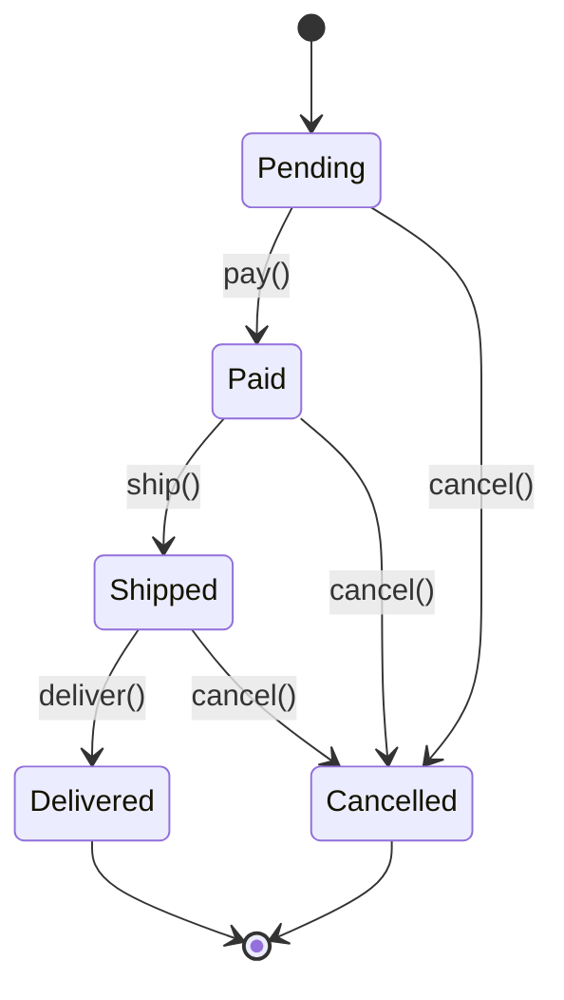
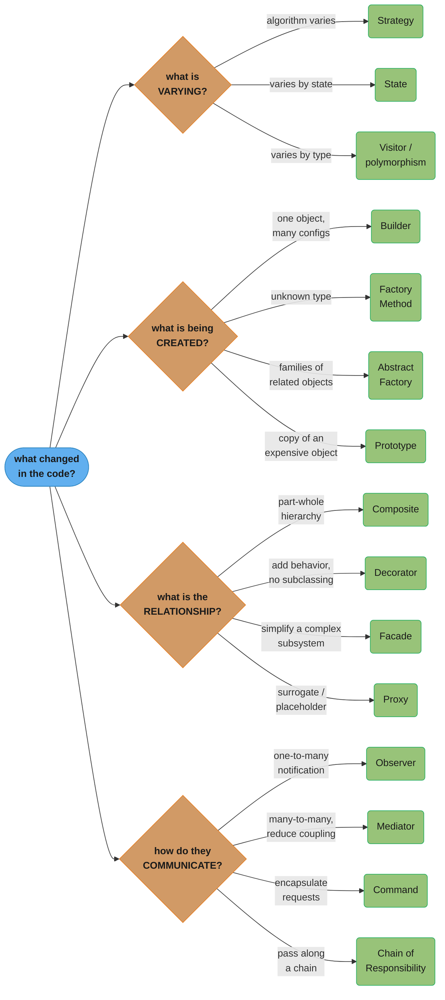

# Refactoring to Patterns

> "Patterns are not about clever code. They are about communicating solutions to recurring problems in a way that other developers will understand."

This guide bridges the gap between messy real-world code and clean pattern-based designs. Learn to recognize code smells that signal a pattern is needed, then refactor safely.

---

## The Golden Rule

**Refactor to patterns, not away from problems.**

Patterns are destinations you arrive at through refactoring, not starting points. Write straightforward code first. When pain appears — duplication, rigidity, fragility — that's when patterns help.

---

## Code Smell → Pattern Mapping

| Code Smell | Description | Pattern(s) to Consider |
|------------|-------------|------------------------|
| Long if-else chain on type | `if (type == A) ... else if (type == B)` | Strategy, State, Factory |
| Same condition repeated in multiple methods | Type-checking scattered everywhere | Polymorphism, Visitor |
| Conditional with state flags | `if (isPaid && !isShipped)` ... | State |
| Hard-coded `new` everywhere | `new MySQLConnection()` in every service | Factory Method, Abstract Factory |
| Objects with many optional fields | 10-parameter constructors or setters | Builder |
| Duplicated algorithm with minor variations | 3 report generators, same skeleton | Template Method, Strategy |
| God class | 2000-line class doing everything | Multiple: SRP + Observer + Facade |
| Tightly coupled collaborators | Class A calls Class B calls Class C | Mediator, Observer, Facade |
| No way to undo | User asks "can we have undo?" | Command + Memento |
| Inheritance explosion | 50 subclasses | Decorator, Strategy |
| Expensive object creation | `new HeavyObject()` called repeatedly | Prototype, Flyweight, Singleton |
| Missing extension points | Every new feature requires modifying existing class | Observer, Strategy, Decorator |

---

## Before/After Refactoring Examples

---

### Example 1: if-else Chain → Strategy

**Smell**: Switch-on-type / long if-else for algorithm selection

**Before** (hard to extend, violates Open/Closed):
```java
public class OrderProcessor {
    public double calculateDiscount(String customerType, double orderAmount) {
        if (customerType.equals("REGULAR")) {
            return orderAmount * 0.0;
        } else if (customerType.equals("PREMIUM")) {
            return orderAmount * 0.10;
        } else if (customerType.equals("VIP")) {
            return orderAmount * 0.20;
        } else if (customerType.equals("EMPLOYEE")) {
            return orderAmount * 0.30;
        } else if (customerType.equals("STUDENT")) {
            if (orderAmount > 100) return 15.0;
            return orderAmount * 0.05;
        }
        return 0.0;
        // Adding a new type requires modifying this method!
    }
}
```

**Smell signals**:
- Adding "SENIOR" discount requires modifying `calculateDiscount()`
- Violates Open/Closed Principle
- Unit tests must cover all branches in one method

**After** (Strategy pattern):
```java
interface DiscountStrategy {
    double calculate(double orderAmount);
}

class RegularDiscount  implements DiscountStrategy { ... return 0; }
class PremiumDiscount  implements DiscountStrategy { ... return amount * 0.10; }
class VIPDiscount      implements DiscountStrategy { ... return amount * 0.20; }
class EmployeeDiscount implements DiscountStrategy { ... return amount * 0.30; }
class StudentDiscount  implements DiscountStrategy {
    public double calculate(double amount) {
        return amount > 100 ? 15.0 : amount * 0.05;
    }
}

public class OrderProcessor {
    private final DiscountStrategy discountStrategy;  // injected

    public double calculateDiscount(double orderAmount) {
        return discountStrategy.calculate(orderAmount);  // no if-else!
    }
}
```

**Refactoring steps**:
1. Create `DiscountStrategy` interface with `calculate(double)` method
2. Extract each `else if` branch into a separate class
3. Replace the field that tracked `customerType` with a `DiscountStrategy` field
4. Remove the if-else method
5. Move strategy selection to a Factory or configuration

**Result**: Adding "SENIOR" → create one class, no existing code changes.

---

### Example 2: Scattered `new` → Factory Method

**Smell**: Hard-coded instantiation scattered throughout the codebase

**Before**:
```java
// In UserService:
DatabaseConnection conn = new MySQLConnection("localhost", 3306, "users");

// In ProductService:
DatabaseConnection conn = new MySQLConnection("localhost", 3306, "products");

// In OrderService:
DatabaseConnection conn = new MySQLConnection("localhost", 3306, "orders");

// Need to switch to PostgreSQL? Find and replace 47 occurrences...
```

**After** (Factory Method):
```java
interface DatabaseConnection { void connect(); void query(String sql); }
class MySQLConnection    implements DatabaseConnection { ... }
class PostgresConnection implements DatabaseConnection { ... }

class ConnectionFactory {
    private static final String DB_TYPE = System.getProperty("db.type", "mysql");

    public static DatabaseConnection create(String schema) {
        return switch (DB_TYPE) {
            case "mysql"    -> new MySQLConnection(getHost(), getPort(), schema);
            case "postgres" -> new PostgresConnection(getHost(), getPort(), schema);
            default -> throw new IllegalArgumentException("Unknown DB type: " + DB_TYPE);
        };
    }
}

// Everywhere:
DatabaseConnection conn = ConnectionFactory.create("users");
// Switch to PostgreSQL: change one property, not 47 files.
```

**Refactoring steps**:
1. Extract `DatabaseConnection` interface with the methods used
2. Create concrete implementations for each DB type
3. Create `ConnectionFactory` with a `create()` method
4. Replace each `new MySQLConnection(...)` with `ConnectionFactory.create(...)`
5. Move DB type selection to configuration

---

### Example 3: Polling → Observer

**Smell**: Service actively checking for changes instead of reacting to them

**Before** (polling — wasteful, high latency):
```java
class OrderStatusChecker {
    public void startPolling() {
        ScheduledExecutorService scheduler = Executors.newSingleThreadScheduledExecutor();
        scheduler.scheduleAtFixedRate(() -> {
            List<Order> orders = orderRepo.findPendingOrders();
            for (Order order : orders) {
                if (order.isPaid()) {
                    emailService.sendConfirmation(order);
                    warehouseService.pickAndPack(order);
                    analyticsService.recordSale(order);
                }
            }
        }, 0, 5, TimeUnit.SECONDS); // check every 5 seconds
    }
}
```

**Smell signals**:
- Artificial 5-second delay before action
- Unnecessary DB load even when nothing changed
- Adding "notify accounting" requires modifying this method

**After** (Observer):
```java
interface OrderObserver {
    void onOrderPaid(Order order);
}

class EmailConfirmationObserver implements OrderObserver {
    @Override public void onOrderPaid(Order order) { emailService.sendConfirmation(order); }
}

class WarehouseObserver implements OrderObserver {
    @Override public void onOrderPaid(Order order) { warehouseService.pickAndPack(order); }
}

class AnalyticsObserver implements OrderObserver {
    @Override public void onOrderPaid(Order order) { analyticsService.recordSale(order); }
}

class Order {
    private final List<OrderObserver> observers = new ArrayList<>();

    public void addObserver(OrderObserver o) { observers.add(o); }

    public void markAsPaid() {
        this.status = OrderStatus.PAID;
        observers.forEach(o -> o.onOrderPaid(this)); // immediate notification
    }
}
```

**Refactoring steps**:
1. Create `OrderObserver` interface with `onOrderPaid(Order)`
2. Extract each action in the polling loop into an Observer implementation
3. Add `addObserver()` / `notifyObservers()` to `Order`
4. Call `markAsPaid()` where payment is confirmed
5. Register observers at startup / configuration time
6. Delete the polling scheduler

---

### Example 4: Mixed Responsibilities → Decorator + SRP

**Smell**: A class doing its core job PLUS cross-cutting concerns (logging, metrics, rate limiting)

**Before**:
```java
class UserService {
    public User getUser(String userId) {
        // Rate limiting logic mixed in
        if (rateLimiter.isExceeded(userId)) throw new TooManyRequestsException();

        // Logging mixed in
        long start = System.currentTimeMillis();
        log.info("getUser called for userId=" + userId);

        // Metrics mixed in
        metrics.increment("getUser.calls");

        // Actual business logic
        User user = userRepository.findById(userId);

        // More logging
        log.info("getUser completed in " + (System.currentTimeMillis()-start) + "ms");
        metrics.record("getUser.latency", System.currentTimeMillis()-start);

        return user;
    }
    // Same pattern repeated in every method!
}
```

**After** (Decorator pattern):
```java
interface UserServiceInterface {
    User getUser(String userId);
    void updateUser(User user);
}

class UserServiceImpl implements UserServiceInterface {
    // ONLY business logic
    @Override
    public User getUser(String userId) {
        return userRepository.findById(userId);
    }
}

class LoggingUserService implements UserServiceInterface {
    private final UserServiceInterface delegate;
    @Override
    public User getUser(String userId) {
        log.info("getUser({})", userId);
        long start = System.currentTimeMillis();
        User result = delegate.getUser(userId);
        log.info("getUser completed in {}ms", System.currentTimeMillis()-start);
        return result;
    }
}

class RateLimitedUserService implements UserServiceInterface {
    private final UserServiceInterface delegate;
    @Override
    public User getUser(String userId) {
        if (rateLimiter.isExceeded(userId)) throw new TooManyRequestsException();
        return delegate.getUser(userId);
    }
}

// Compose at startup:
UserServiceInterface userService =
    new RateLimitedUserService(
        new LoggingUserService(
            new MetricsUserService(
                new UserServiceImpl(repo)
            )
        )
    );
```

**Refactoring steps**:
1. Extract `UserServiceInterface` from `UserService`
2. Create `UserServiceImpl` with ONLY business logic
3. Create `LoggingDecorator`, `MetricsDecorator`, `RateLimitingDecorator`
4. Compose them in configuration / DI setup

---

### Example 5: Flag-Based State → State Pattern

**Smell**: Boolean flags representing mutually exclusive states with nested if-else

**Before**:
```java
class Order {
    private boolean isPending;
    private boolean isPaid;
    private boolean isShipped;
    private boolean isCancelled;
    private boolean isDelivered;

    public void pay() {
        if (!isPending) throw new IllegalStateException("Can only pay pending orders");
        isPending = false;
        isPaid = true;
    }

    public void ship() {
        if (!isPaid) throw new IllegalStateException("Can only ship paid orders");
        if (isCancelled) throw new IllegalStateException("Cannot ship cancelled order");
        isPaid = false;
        isShipped = true;
    }

    public void cancel() {
        if (isDelivered) throw new IllegalStateException("Cannot cancel delivered order");
        if (isCancelled) throw new IllegalStateException("Already cancelled");
        isPending = false; isPaid = false; isShipped = false;
        isCancelled = true;
    }
    // What if someone sets isPaid=true AND isCancelled=true? Invalid state!
}
```

**After** (State pattern):
```java
interface OrderState {
    void pay(Order order);
    void ship(Order order);
    void cancel(Order order);
    void deliver(Order order);
    String getStatus();
}

class PendingState implements OrderState {
    @Override public void pay(Order o)    { o.setState(new PaidState()); }
    @Override public void cancel(Order o) { o.setState(new CancelledState()); }
    @Override public void ship(Order o)   { throw new IllegalStateException("Pay first"); }
    @Override public void deliver(Order o){ throw new IllegalStateException("Not shipped"); }
    @Override public String getStatus()   { return "PENDING"; }
}

class PaidState implements OrderState {
    @Override public void ship(Order o)   { o.setState(new ShippedState()); }
    @Override public void cancel(Order o) { o.setState(new CancelledState()); }
    @Override public void pay(Order o)    { throw new IllegalStateException("Already paid"); }
    @Override public void deliver(Order o){ throw new IllegalStateException("Not shipped"); }
    @Override public String getStatus()   { return "PAID"; }
}

// ... ShippedState, DeliveredState, CancelledState

class Order {
    private OrderState state = new PendingState();

    public void setState(OrderState state) { this.state = state; }
    public void pay()    { state.pay(this); }
    public void ship()   { state.ship(this); }
    public void cancel() { state.cancel(this); }
    public String getStatus() { return state.getStatus(); }
}
```



**Result**: every arrow above is a method that only type-checks from its source state — `pay()` compiles solely from `Pending`, `cancel()` is unreachable once `Delivered` — so the Before code's impossible combination (`isPaid=true` and `isCancelled=true` at once) can no longer be represented.

**Refactoring steps**:
1. Create `OrderState` interface with all operations
2. Create one concrete state class per valid state
3. Each method in a state either handles the transition or throws `IllegalStateException`
4. Remove all boolean flags from `Order`
5. Initialize `Order` with `new PendingState()`

---

## How to Identify the Right Pattern

Ask these questions about the code:

**"What is VARYING?"**
→ If the algorithm varies: **Strategy**
→ If the behavior varies by state: **State**
→ If the behavior varies by type: **Visitor** or **polymorphism**

**"What is being CREATED?"**
→ One object with many configurations: **Builder**
→ Object of unknown type: **Factory Method**
→ Families of related objects: **Abstract Factory**
→ Copy of an expensive object: **Prototype**

**"What is the RELATIONSHIP?"**
→ Part-whole hierarchy: **Composite**
→ Add behavior without subclassing: **Decorator**
→ Simplify a complex subsystem: **Facade**
→ Surrogate/placeholder: **Proxy**

**"How do they COMMUNICATE?"**
→ One-to-many notification: **Observer**
→ Many-to-many (reduce coupling): **Mediator**
→ Encapsulate requests: **Command**
→ Pass along a chain: **Chain of Responsibility**



*A single decision tree distilling the four questions above — trace root to leaf to go from "what's changing in this code" to the specific pattern to reach for.*

---

## Refactoring Safety Rules

1. **Write characterization tests first** — capture the current behavior (even if messy) before refactoring

2. **Small steps** — one refactoring at a time; run tests after each

3. **Don't refactor AND add features** — separate commits; "Boy Scout Rule" (leave it cleaner), not "Renovation Rule" (rewrite everything)

4. **Trust the type system** — let the compiler catch broken references

5. **Commit often** — every green test is a safe checkpoint to roll back to

6. **Measure before and after** — performance-critical refactors need benchmarks
