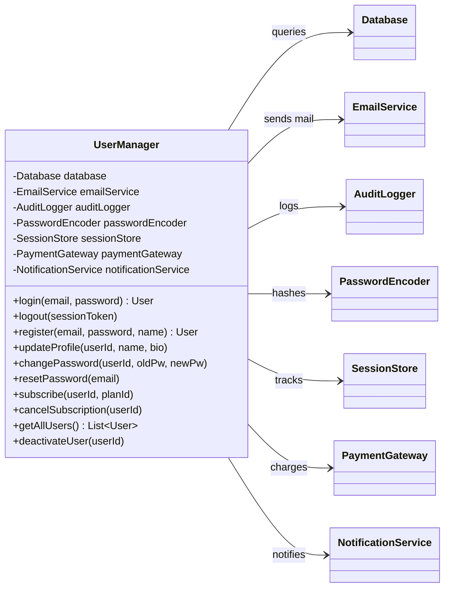
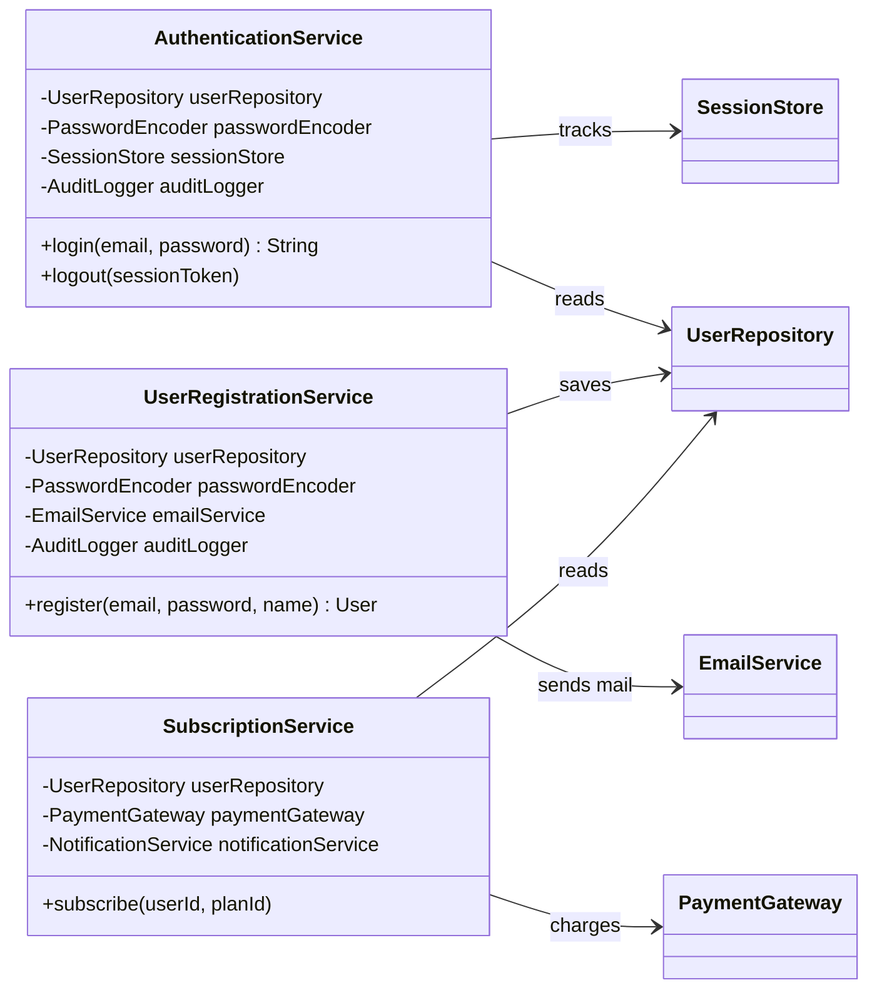

# Anti-Pattern: God Object (God Class)

## What It Is

The God Object anti-pattern occurs when a single class takes on too many responsibilities — it "knows too much" or "does too much." The class becomes the central hub of an application, with most other classes depending on it or delegating work to it.

Named after the concept of an omniscient, omnipotent entity, a God Object accumulates responsibilities over time until it becomes impossible to understand, test, or modify in isolation.

Also known as: Blob, All-Knowing Object, Master Class.

---

## Intuition

> **One-line analogy**: A God Object is like a Swiss Army knife that tries to be a knife, scissors, saw, screwdriver, and GPS simultaneously — none of those functions is as good as a dedicated tool, and the whole thing is unwieldy.

**Mental model**: Classes that accumulate responsibilities over time become impossible to understand, test, or change. When a `Manager` class grows to 2000 lines with 50 methods covering user auth, email sending, database queries, and file uploads — changing user auth requires understanding email code, and fixing a bug might break uploads. Everything depends on this class, creating a coupling nightmare.

**Why it matters**: God Objects are the most common cause of "developer fear" — the fear that touching any part of the codebase will break something unrelated. They make testing nearly impossible (too many dependencies to mock) and onboarding nightmarish (can't understand one piece without understanding the whole).

**Key insight**: God Objects don't start that way — they accumulate over time through "just add it here" shortcuts. The fix is decomposition: identify distinct responsibilities, extract cohesive groups of methods and their related fields into separate classes, then wire them together.

---

## How to Recognize It

**Code smells:**
- Class has hundreds or thousands of lines of code
- Class has more than 10-15 methods
- Class name is vague: `Manager`, `Handler`, `Controller`, `Processor`, `Utils`, `Helper`
- Nearly every other class depends on this one
- The class has fields that are only used by a subset of its methods
- Unit testing this class requires an enormous setup

**Example — The Anti-Pattern:**

```java
// God Object: UserManager does everything related to users
public class UserManager {

    private Database database;
    private EmailService emailService;
    private AuditLogger auditLogger;
    private PasswordEncoder passwordEncoder;
    private SessionStore sessionStore;
    private PaymentGateway paymentGateway;
    private NotificationService notificationService;

    // Authentication
    public User login(String email, String password) {
        User user = database.findByEmail(email);
        if (user == null || !passwordEncoder.matches(password, user.getPasswordHash())) {
            auditLogger.log("Failed login: " + email);
            throw new AuthException("Invalid credentials");
        }
        String sessionToken = UUID.randomUUID().toString();
        sessionStore.put(sessionToken, user.getId());
        auditLogger.log("Login: " + user.getId());
        return user;
    }

    public void logout(String sessionToken) {
        Long userId = sessionStore.remove(sessionToken);
        auditLogger.log("Logout: " + userId);
    }

    // Registration
    public User register(String email, String password, String name) {
        if (database.existsByEmail(email)) {
            throw new ValidationException("Email already in use");
        }
        User user = new User();
        user.setEmail(email);
        user.setName(name);
        user.setPasswordHash(passwordEncoder.encode(password));
        database.save(user);
        emailService.sendWelcomeEmail(user);
        auditLogger.log("Registered: " + email);
        return user;
    }

    // Profile management
    public void updateProfile(Long userId, String name, String bio) {
        User user = database.findById(userId);
        user.setName(name);
        user.setBio(bio);
        database.save(user);
    }

    // Password management
    public void changePassword(Long userId, String oldPw, String newPw) {
        User user = database.findById(userId);
        if (!passwordEncoder.matches(oldPw, user.getPasswordHash())) {
            throw new AuthException("Wrong password");
        }
        user.setPasswordHash(passwordEncoder.encode(newPw));
        database.save(user);
        emailService.sendPasswordChangedEmail(user);
    }

    public void resetPassword(String email) {
        User user = database.findByEmail(email);
        String token = UUID.randomUUID().toString();
        database.saveResetToken(user.getId(), token);
        emailService.sendPasswordResetEmail(user, token);
    }

    // Subscription / payments
    public void subscribe(Long userId, String planId) {
        User user = database.findById(userId);
        paymentGateway.chargeMonthly(user.getPaymentMethodId(), planId);
        user.setPlanId(planId);
        database.save(user);
        notificationService.notify(userId, "Subscription activated");
    }

    public void cancelSubscription(Long userId) {
        User user = database.findById(userId);
        paymentGateway.cancelSubscription(user.getSubscriptionId());
        user.setPlanId(null);
        database.save(user);
    }

    // Admin
    public List<User> getAllUsers() {
        return database.findAll();
    }

    public void deactivateUser(Long userId) {
        User user = database.findById(userId);
        user.setActive(false);
        database.save(user);
        auditLogger.log("Deactivated: " + userId);
    }

    // ... 20 more methods
}
```

This single class is responsible for authentication, session management, registration, profile management, password management, payments, notifications, and admin operations. It has 8 dependencies injected directly.

The class diagram below makes the hub-and-spoke shape concrete: one `UserManager` wired directly to every collaborator it needs, carrying auth, registration, profile, password, payment, and admin logic as its own methods.



---

## Why It Happens

1. **Incremental growth**: The class starts small and reasonable. Features are added one at a time, and it is "easier" to add to the existing class than create a new one.
2. **Lack of up-front design**: No clear responsibility boundaries were established early.
3. **Fear of creating new files**: Some developers avoid creating new classes/files unnecessarily.
4. **Single developer ownership**: One person builds everything and keeps it all in one place for convenience.
5. **Deadline pressure**: "We'll refactor later" never comes.

---

## Why It's Harmful

1. **Violates SRP**: The class has many reasons to change. A payment bug forces changes in the same file as authentication logic.
2. **Tight coupling**: All callers depend on a single type, making substitution or mocking in tests very hard.
3. **Testing nightmare**: Setting up a unit test for `login()` requires mocking 7+ dependencies.
4. **Merge conflicts**: Multiple developers editing the same large file creates constant conflicts.
5. **Cognitive overload**: Nobody can hold the entire class in their head at once.
6. **Impossible to reuse**: The class is too intertwined to extract a subset of its logic.

---

## How to Fix It

Apply the **Single Responsibility Principle**: each class should have one reason to change. Decompose the God Object into focused, cohesive classes.

```java
// Focused service: only handles authentication
public class AuthenticationService {

    private final UserRepository userRepository;
    private final PasswordEncoder passwordEncoder;
    private final SessionStore sessionStore;
    private final AuditLogger auditLogger;

    public AuthenticationService(UserRepository userRepository,
                                  PasswordEncoder passwordEncoder,
                                  SessionStore sessionStore,
                                  AuditLogger auditLogger) {
        this.userRepository = userRepository;
        this.passwordEncoder = passwordEncoder;
        this.sessionStore = sessionStore;
        this.auditLogger = auditLogger;
    }

    public String login(String email, String password) {
        User user = userRepository.findByEmail(email)
            .orElseThrow(() -> new AuthException("Invalid credentials"));

        if (!passwordEncoder.matches(password, user.getPasswordHash())) {
            auditLogger.log("Failed login: " + email);
            throw new AuthException("Invalid credentials");
        }

        String token = UUID.randomUUID().toString();
        sessionStore.put(token, user.getId());
        auditLogger.log("Login: " + user.getId());
        return token;
    }

    public void logout(String sessionToken) {
        Long userId = sessionStore.remove(sessionToken);
        auditLogger.log("Logout: " + userId);
    }
}

// Focused service: only handles user registration
public class UserRegistrationService {

    private final UserRepository userRepository;
    private final PasswordEncoder passwordEncoder;
    private final EmailService emailService;
    private final AuditLogger auditLogger;

    public User register(String email, String password, String name) {
        if (userRepository.existsByEmail(email)) {
            throw new ValidationException("Email already in use");
        }
        User user = User.create(email, name, passwordEncoder.encode(password));
        userRepository.save(user);
        emailService.sendWelcomeEmail(user);
        auditLogger.log("Registered: " + email);
        return user;
    }
}

// Focused service: only handles subscriptions
public class SubscriptionService {

    private final UserRepository userRepository;
    private final PaymentGateway paymentGateway;
    private final NotificationService notificationService;

    public void subscribe(Long userId, String planId) {
        User user = userRepository.findById(userId)
            .orElseThrow(() -> new NotFoundException("User not found"));
        paymentGateway.chargeMonthly(user.getPaymentMethodId(), planId);
        user.setPlanId(planId);
        userRepository.save(user);
        notificationService.notify(userId, "Subscription activated");
    }
}
```

Same collaborators, redistributed: each service now owns a small, focused slice of the dependency graph instead of all of it, so a payment bug can no longer force a change to authentication code.



Each service now:
- Has a single clear responsibility
- Has fewer dependencies
- Can be tested in complete isolation
- Can be modified without affecting unrelated logic

---

## Real-World Examples

- **Legacy monolith controllers**: Spring MVC controllers that contain business logic, DB queries, and email sending all in one method.
- **Android Activity classes**: Android activities that manage UI, network calls, database access, and business rules — a common anti-pattern in early Android development.
- **`ApplicationContext` classes**: A single context object passed everywhere that holds global state and provides utility methods.
- **`Utils` or `Helper` classes**: Static utility classes that grow to contain hundreds of unrelated methods.

---

## Prevention Strategies

1. **Apply SRP from the start**: Before writing a method, ask "does this belong in this class?"
2. **Name classes with precision**: If you can't name a class without using "Manager" or "Handler", it may be doing too much.
3. **Set line-count soft limits**: Classes over 200-300 lines should trigger a review.
4. **Domain-driven decomposition**: Align classes with domain concepts — `AuthenticationService`, `SubscriptionService`, `ProfileService`.
5. **Package by feature, not by layer**: Grouping by feature encourages cohesive, focused classes.
6. **Code reviews**: Reviewers should flag new methods being added to already-large classes.

---

## Cross-Perspective: HLD Connections

**HLD View — Where God Object Appears in Distributed Systems**

- **The monolith anti-pattern** — A monolith is the system-level God Object: one codebase and one deployment unit that handles every concern. It starts manageable and grows until changes in one area routinely break unrelated areas — the same failure mode as a God class, one scale larger.
- **The God service** — In a nominally microservice system, a "God service" emerges when all other services depend on one central service for most operations. It becomes a single point of failure, a deployment bottleneck, and an on-call nightmare.
- **The fat API gateway** — When an API gateway starts containing business logic, data transformation, and orchestration logic beyond routing and auth, it becomes a God Gateway. Changes to any business flow require modifying one central component.
- **Diagnostic signal** — If one service or component is in the critical path of every user request across the system, it is probably a God Object at the HLD level. The fix is the same as at LLD: decompose along single-responsibility boundaries.

---

## Interview Relevance

**Common interview questions:**
- "Walk me through the Single Responsibility Principle with an example." — God Object is the canonical violation.
- "How would you refactor a large class that does too many things?" — Demonstrates decomposition thinking.
- "What is a God Object?" — Direct question in design-focused interviews.
- "Review this code and tell me what's wrong." — God Objects appear frequently in code review interview rounds.

**Key talking points:**
- Name the principle violated: SRP
- Describe the decomposition strategy: identify cohesive groups of methods and fields, extract into dedicated classes
- Mention testability as a concrete consequence — hard to mock 8 dependencies
- Mention merge conflict overhead as a practical team problem
