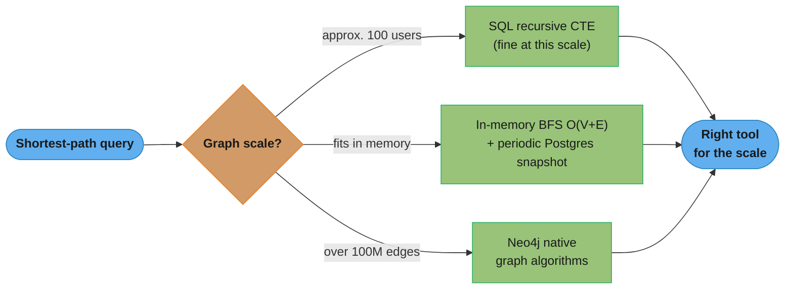
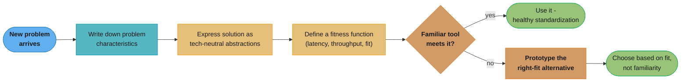

# Anti-Pattern: Golden Hammer

## What It Is

The Golden Hammer anti-pattern occurs when a developer or team over-applies a familiar technology, tool, or technique to every problem, regardless of whether it is the right fit. The name comes from the saying: "If all you have is a hammer, everything looks like a nail."

Also known as: Law of the Instrument, Silver Bullet Syndrome (related), Familiar Technology Bias.

The key distinction from other anti-patterns: this is not about bad code — the hammer itself may be excellent technology. The problem is applying it indiscriminately because it is well-understood, comfortable, or politically convenient.

---

## Intuition

> **One-line analogy**: Golden Hammer is "if all you have is a hammer, everything looks like a nail" — using your favorite tool for every problem regardless of fit.

**Mental model**: A team expert in SQL Server uses it for everything — time series data (wrong tool), full-text search (wrong tool), graph queries (wrong tool). A developer who knows Regex writes a regex for everything, even when simple string operations suffice. The familiarity bias overrides objective fit assessment. The tool may be excellent — the problem is applying it indiscriminately.

**Why it matters**: Every wrong-tool application makes the codebase harder — SQL for time series is 10× slower than InfluxDB; Regex for a simple prefix check is unreadable. Over time, golden hammer applications accumulate into a system that's poorly suited to each of its own use cases.

**Key insight**: The antidote is tool-agnostic problem definition — state the requirement clearly ("store and query 10M sensor readings per second with point-in-time lookups") before choosing a tool. Choose based on fit, not familiarity.

---

## How to Recognize It

**Code and architecture smells:**
- The same technology is used for wildly different problems with poor fit
- Technology is chosen before the problem is fully understood
- Justification for a tool is "we already know how to use it" rather than "it is the right fit"
- Simple problems have disproportionately complex solutions due to the chosen tool
- Edge cases and workarounds multiply because the tool was not designed for this use case

**Common real-world instances:**
- Using a relational database (with complex joins and schemas) for data that is naturally a document or graph
- Using a full messaging queue (Kafka, RabbitMQ) for a problem that a simple cron job would solve
- Using microservices for a two-person team's internal tool
- Writing a custom ORM because the team is "more comfortable" than learning JPA
- Applying design patterns (e.g., Factory, Decorator) to every class whether needed or not

**Example — The Anti-Pattern:**

```java
// Team knows SQL extremely well and applies it to EVERYTHING.
// Problem: finding the shortest path between users in a social network.
// The hammer: relational database with recursive CTEs.

public class SocialNetworkServiceViolation {

    private final JdbcTemplate jdbc;

    public SocialNetworkServiceViolation(JdbcTemplate jdbc) {
        this.jdbc = jdbc;
    }

    // Shoe-horning a graph traversal problem into SQL
    // This query explodes at scale and is extremely hard to maintain
    public List<Long> findShortestPath(long fromUserId, long toUserId) {
        String sql =
            "WITH RECURSIVE path(user_id, path, depth) AS (" +
            "  SELECT ?, CAST(? AS VARCHAR(1000)), 0 " +
            "  UNION ALL " +
            "  SELECT f.friend_id, path || ',' || f.friend_id, depth + 1 " +
            "  FROM friendships f " +
            "  JOIN path p ON f.user_id = p.user_id " +
            "  WHERE depth < 6 AND path NOT LIKE '%' || f.friend_id || '%'" +
            ") " +
            "SELECT path FROM path WHERE user_id = ? ORDER BY depth LIMIT 1";

        // Performs full recursive table scan — catastrophic at 10M+ rows
        // Cycles and fan-out make this O(n^k) where k is max depth
        String pathStr = jdbc.queryForObject(sql, String.class, fromUserId, fromUserId, toUserId);
        return parsePathString(pathStr);
    }

    private List<Long> parsePathString(String path) {
        // ... parse comma-separated IDs
        return new java.util.ArrayList<>();
    }
}

// The right tool for this problem is a graph database (Neo4j)
// or an in-memory BFS algorithm on an adjacency list.
// The SQL solution works for 100 users and falls apart at 1 million.
```

---

## A Second Example: Over-Engineering with Patterns

```java
// Team has just learned the Factory pattern and applies it to everything,
// including simple value construction that needs no polymorphism.

// VIOLATION: Factory for a simple Point object — zero polymorphism needed
interface PointFactory {
    Point createPoint(double x, double y);
}

class CartesianPointFactory implements PointFactory {
    @Override
    public Point createPoint(double x, double y) {
        return new Point(x, y);
    }
}

class PointFactoryProvider {
    private static PointFactory instance = new CartesianPointFactory();

    public static PointFactory getInstance() { return instance; }
    public static void setFactory(PointFactory f) { instance = f; }
}

// Usage — massively over-engineered
Point p = PointFactoryProvider.getInstance().createPoint(3.0, 4.0);

// What it should be:
Point p2 = new Point(3.0, 4.0); // or a static factory method if that is genuinely useful
```

---

## Why It Happens

1. **Expertise bias**: Developers naturally reach for tools they know well. Learning a new tool has upfront cost; using the hammer is faster today even if it costs more tomorrow.
2. **Organizational momentum**: A team that standardized on one technology (e.g., PostgreSQL for everything) resists introducing new tools due to operational and training overhead.
3. **Architecture astronauts**: Excitement about a technology leads to premature adoption ("Let's use Kafka for everything — we'll need it eventually").
4. **Lack of problem analysis**: Teams jump to solutions before deeply understanding the problem characteristics.
5. **Risk aversion**: "No one ever got fired for using Oracle" — the known tool feels safer politically.

---

## Why It's Harmful

1. **Impedance mismatch**: Forcing a problem into the wrong tool creates complexity that fights the tool's grain at every turn.
2. **Performance degradation**: Tools optimized for one problem space perform poorly in another (e.g., relational joins on graph data, key-value store used as a relational system).
3. **Maintenance burden**: Workarounds accumulate. The codebase fills with adapter code to make the hammer fit the screw.
4. **Opportunity cost**: Time spent forcing the wrong tool could have been spent learning the right one.
5. **Architectural rigidity**: Once the wrong tool is deeply embedded, replacing it is a major project.

---

## How to Fix It

The fix is not to throw away the hammer — it is to develop a broader toolkit and apply problem-first thinking.

```java
// PROBLEM: Shortest path in a social network with millions of nodes.
// Right tool: BFS on an adjacency list (or Neo4j for persistent graphs)

public class SocialNetworkService {

    // In-memory adjacency list — loaded once, queried many times
    private final Map<Long, Set<Long>> adjacencyList;

    public SocialNetworkService(Map<Long, Set<Long>> adjacencyList) {
        this.adjacencyList = adjacencyList;
    }

    // BFS: O(V + E) — appropriate for this problem
    public List<Long> findShortestPath(long from, long to) {
        if (from == to) return List.of(from);

        Map<Long, Long> parentMap = new HashMap<>();
        Queue<Long> queue = new LinkedList<>();
        Set<Long> visited = new HashSet<>();

        queue.add(from);
        visited.add(from);
        parentMap.put(from, null);

        while (!queue.isEmpty()) {
            long current = queue.poll();

            Set<Long> neighbors = adjacencyList.getOrDefault(current, Set.of());
            for (long neighbor : neighbors) {
                if (!visited.contains(neighbor)) {
                    visited.add(neighbor);
                    parentMap.put(neighbor, current);
                    queue.add(neighbor);

                    if (neighbor == to) {
                        return reconstructPath(parentMap, from, to);
                    }
                }
            }
        }

        return List.of(); // no path found
    }

    private List<Long> reconstructPath(Map<Long, Long> parentMap, long from, long to) {
        List<Long> path = new ArrayList<>();
        Long current = to;
        while (current != null) {
            path.add(0, current);
            current = parentMap.get(current);
        }
        return path;
    }
}

// For truly large-scale graphs (> 100M edges): use Neo4j's native graph algorithms
// For moderate-scale: in-memory BFS with periodic snapshots to PostgreSQL
// For small-scale: even SQL recursive CTEs are fine
// The right answer depends on the actual scale requirements.
```

The code comment above collapses three different "right answers" into one line each. Making the scale thresholds an explicit checkpoint — instead of a habit — is what stops the SQL hammer from creeping back in as the data grows:



---

## Prevention Strategies

1. **Problem-first thinking:** Write down the problem characteristics (read/write ratio, data model, scale, query patterns) before selecting a technology.

2. **Technology-neutral design phase:** Express the solution in terms of abstractions and data structures before choosing the implementation technology.

3. **Fitness functions:** Define measurable criteria for the right tool — latency, throughput, data model fit — and evaluate candidates against them.

4. **Broaden the team's toolkit deliberately:** Allocate time for engineers to learn adjacent technologies (graph DBs, streaming platforms, cache stores) so the toolbox grows.

5. **Challenge "we already use X":** In architecture reviews, require justification that addresses fit, not just familiarity.

6. **Prototype alternative approaches:** A two-day spike with the right tool often demonstrates it is faster than weeks of fighting the wrong one.

These six strategies form a single feedback loop rather than a checklist: define the problem before the tool, hold the familiar option to a fitness function, and only spend prototyping effort once that check actually fails:



---

## Real-World Examples

| Hammer | Applied Where It Doesn't Fit |
|--------|------------------------------|
| Relational DB (PostgreSQL) | Social graph traversal, time-series data, full-text search, document storage |
| Microservices | A three-developer team building an internal CRUD tool |
| Kafka | A simple background job that runs once an hour |
| Redis | The primary database for a financial application with ACID requirements |
| OOP + design patterns | A short, procedural data transformation script |
| REST API | A real-time bidirectional chat feature (better fit: WebSocket) |

---

## Cross-Perspective: HLD Connections

**HLD View — Where Golden Hammer Appears in Distributed Systems**

- **Kafka for everything** — A team that knows Kafka deeply uses it for a background job that runs once per hour. A cron job with a simple database flag would be simpler, faster to build, and easier to operate. The hammer: Kafka. The screw: scheduled batch processing.
- **Microservices for all team sizes** — A two-person team building an internal tool adopts microservices because "that's how it's done." They spend 60% of their time on service discovery, inter-service auth, and distributed tracing instead of building features. The right tool: a well-structured monolith.
- **Redis as primary database** — A team comfortable with Redis uses it as the source of truth for financial transactions that require ACID guarantees. Redis is an excellent cache and message broker, but its persistence and consistency model is wrong for this use case.
- **NoSQL for relational data** — Using MongoDB or DynamoDB for data with complex relationships and ad-hoc query requirements because "NoSQL scales better." The result: application-level joins, consistency headaches, and 10× the query complexity of a well-indexed relational database.

---

## Interview Relevance

**Common interview questions:**
- "How do you choose between a SQL and NoSQL database?" — Golden Hammer awareness signals you evaluate by problem characteristics.
- "When would you NOT use microservices?" — Shows architectural judgment over fashion.
- "Describe a time you chose a tool that turned out to be the wrong fit." — Golden Hammer experience is a valuable story.

**Key talking points:**
- Problem characteristics drive technology choices, not familiarity or org standards
- The right question is "what are the access patterns and scalability needs?" not "what do we already use?"
- Golden Hammer often masquerades as standardization — distinguish healthy standardization (reduces operational burden) from unhealthy uniformity (wrong tool for the job)
