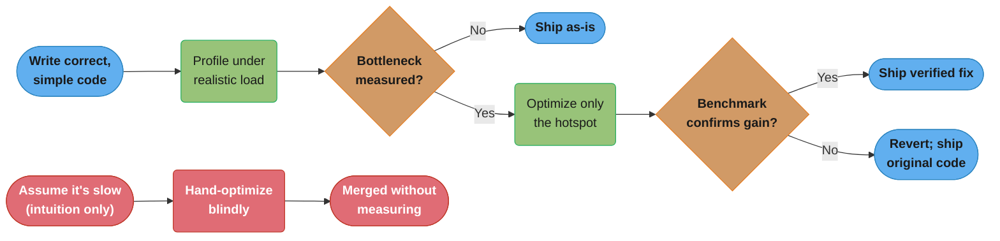

# Premature Optimization Anti-Pattern

## Overview

Premature Optimization is the practice of investing engineering effort in performance improvements before identifying, measuring, or confirming that a performance problem actually exists. It is one of the most costly anti-patterns because it trades two valuable assets — code readability and development velocity — for a performance gain that may be immeasurable, irrelevant, or in the wrong place entirely. The anti-pattern was most famously characterized by Donald Knuth: *"Premature optimization is the root of all evil (or at least most of it) in programming."* Engineers who fall into this trap often do so with good intentions — they want the system to be fast — but they optimize based on intuition rather than evidence, wasting time on micro-optimizations while true bottlenecks go unaddressed. The result is code that is harder to read, harder to maintain, and often no faster than the naive solution.

---

## Intuition

> **One-line analogy**: Premature optimization is like remodeling a house before you know if you're going to live in it — you spend huge effort improving something that may not need improving, while the real problems go unaddressed.

**Mental model**: Without measurement, intuition about performance bottlenecks is wrong ~80% of the time. You hand-optimize a function that runs 10 times per day while the database query that runs 10 million times per day is unindexed. The optimization cost: complex, unmaintainable code where 20 lines became 200. The performance gain: zero improvement to user experience. Knuth's rule: measure first, then optimize only the measured bottleneck.

**Why it matters**: Premature optimization trades code clarity for speculative performance gains. Complex optimized code has more bugs, is harder to understand, and costs more to maintain. The opportunity cost is also high — time spent on speculation isn't spent on actual user value.

**Key insight**: The right process: write clear, simple, correct code first → profile in production (or with realistic load) → identify actual bottlenecks → optimize only the measured hotspot → verify the optimization actually helps with benchmarks. Any other order wastes effort.



*The green backbone is the evidence-driven loop from the Key insight above — profile, confirm the bottleneck, optimize only the hotspot, then verify with a benchmark before shipping. The red chain is the premature-optimization shortcut — guess, hand-optimize, merge unmeasured — which is exactly what produced the nine numbered "PREMATURE OPTIMIZATION" markers in the Java Violation Example below.*

---

## How to Spot It

**Warning Signs and Code Smells**

- Hand-rolled data structures (custom hash maps, custom caches) replacing well-tested standard library equivalents with no benchmark to justify the substitution
- Bit-shifting arithmetic (`x >> 1` instead of `x / 2`, `x << 3` instead of `x * 8`) in code where readability matters and no profiler has been consulted
- Avoiding method calls due to a belief that "method call overhead" is significant in Java (it is not, thanks to JIT inlining)
- String concatenation replaced with `StringBuilder` in code paths that run once per request
- Object pooling implemented where garbage collection pressure has not been measured
- `int` or `long` used in place of `BigDecimal` for monetary values, justified as a performance optimization
- Parallel streams used everywhere, including on tiny collections, because "parallel is faster"
- Local caches with complex eviction logic where a 10-line `HashMap` would have been sufficient and more readable
- Comments that say "this is faster" with no benchmark evidence cited
- Code that was "optimized" before any user has ever used the system
- Avoiding standard library calls (e.g., `Collections.sort`) and re-implementing sorting
- Micro-benchmarks written without JMH that produce misleading results due to JIT warm-up

---

## Java Violation Example

```java
/**
 * ProductSearchService - provides product search functionality.
 *
 * "Optimized" for performance by the original author.
 * No profiling was ever performed. The actual bottleneck is a missing
 * database index, which this service cannot fix.
 */
public class ProductSearchService {

    private final ProductRepository repository;

    // PREMATURE OPTIMIZATION #1: Custom cache implementation.
    // Guava's LoadingCache or Caffeine would provide a correct, tested,
    // feature-rich LRU cache in 5 lines. This hand-rolled version took 2 days,
    // has a subtle race condition under concurrent access, and implements
    // eviction incorrectly (it never evicts entries that are still "warm").
    private final Map<String, List<Product>> searchCache = new LinkedHashMap<String, List<Product>>(16, 0.75f, true) {
        @Override
        protected boolean removeEldestEntry(Map.Entry<String, List<Product>> eldest) {
            // BUG: size() check is not thread-safe — can grow unboundedly under load
            return size() > 1000;
        }
    };

    // PREMATURE OPTIMIZATION #2: Pre-allocated result buffer.
    // This is reused across method calls. It is NOT thread-safe.
    // The optimization was added because the author "assumed" ArrayList
    // allocation was expensive. It was not.
    private final ArrayList<Product> resultBuffer = new ArrayList<>(500);

    public ProductSearchService(ProductRepository repository) {
        this.repository = repository;
    }

    public List<Product> search(String query, int maxResults) {

        // PREMATURE OPTIMIZATION #3: Manual string interning.
        // intern() is almost never needed in modern Java and can actually
        // increase pause times by pressuring the string table.
        String normalizedQuery = query.toLowerCase().trim().intern();

        // PREMATURE OPTIMIZATION #4: Bitwise operation for no reason.
        // The intent is "maxResults rounded down to the nearest power of 2".
        // Why? No documented reason. The result is used as a cache key suffix.
        // This is not faster in any meaningful way and is completely unreadable.
        int bucketSize = Integer.highestOneBit(maxResults);

        String cacheKey = normalizedQuery + ":" + bucketSize;

        // Cache check — reasonable in principle, but the implementation is broken
        List<Product> cached = searchCache.get(cacheKey);
        if (cached != null) {
            return cached;
        }

        // PREMATURE OPTIMIZATION #5: Reuse the pre-allocated buffer.
        // This causes results from one call to bleed into another under concurrency.
        // The bug was introduced specifically as an "optimization".
        resultBuffer.clear();

        List<Product> dbResults = repository.findByQuery(normalizedQuery, maxResults);

        // PREMATURE OPTIMIZATION #6: Manual relevance scoring with bit manipulation.
        // The intent is to compute a relevance score. The original version used
        // String.contains() and was perfectly readable.
        // This version uses bit flags to pack match type information — an
        // optimization that the JIT compiler would have applied automatically
        // to the readable version.
        for (Product product : dbResults) {
            int score = 0;
            String name = product.getName().toLowerCase();
            String desc = product.getDescription().toLowerCase();

            // Bit flag packing: bit 0 = exact match, bit 1 = prefix, bit 2 = contains
            // This is unreadable. A simple int score would serve the same purpose.
            if (name.equals(normalizedQuery))        score |= (1 << 2); // exact: +4
            if (name.startsWith(normalizedQuery))     score |= (1 << 1); // prefix: +2
            if (name.contains(normalizedQuery))       score |= (1 << 0); // contains: +1
            if (desc.contains(normalizedQuery))       score |= 0;        // ignored?? bug

            product.setRelevanceScore(score);
            resultBuffer.add(product);
        }

        // PREMATURE OPTIMIZATION #7: Manual sort instead of Comparator.comparing().
        // The author believed Comparator.comparing() had overhead.
        // The JIT compiler generates identical bytecode for both.
        resultBuffer.sort((a, b) -> {
            // Subtraction-based comparator — known Java gotcha: can overflow for large scores
            return b.getRelevanceScore() - a.getRelevanceScore();
        });

        // PREMATURE OPTIMIZATION #8: Manual subList copy to "avoid iterator overhead".
        // This is not faster. It is less readable and introduces an off-by-one risk.
        List<Product> finalResults = new ArrayList<>(maxResults);
        int limit = Math.min(maxResults, resultBuffer.size());
        for (int i = 0; i < limit; i++) {
            finalResults.add(resultBuffer.get(i));  // direct index access to "avoid" iterator
        }

        // Store in broken, non-thread-safe cache
        searchCache.put(cacheKey, finalResults);

        return finalResults;
    }

    // PREMATURE OPTIMIZATION #9: Hand-rolled string hash function.
    // Java's String.hashCode() is a well-tested, JIT-optimized polynomial hash.
    // This "custom" version is slower, has worse distribution, and is bug-prone.
    // Added because the author read that polynomial hashing was "too slow".
    private int fastHash(String s) {
        int hash = 0;
        for (int i = 0; i < s.length(); i++) {
            // Bit rotation: not faster than multiplication in modern JVMs
            hash = (hash << 5) ^ (hash >>> 27) ^ s.charAt(i);
        }
        return hash & 0x7FFFFFFF;
    }
}
```

**What is wrong with this code:**
- The hand-rolled LRU cache has a thread-safety bug — concurrent access can cause unbounded growth or cache corruption
- The pre-allocated `resultBuffer` is an instance field reused across calls — under concurrent invocation it causes result contamination between callers
- The subtraction-based comparator `b.getRelevanceScore() - a.getRelevanceScore()` can overflow for large integers, producing incorrect sort order
- The relevance scoring bit-flag logic has a bug: description matches contribute `0` (score |= 0 is a no-op) — the description branch is silently ignored
- `String.intern()` on every query string pressures the JVM string table with no measurable benefit
- None of these "optimizations" were benchmarked; the actual bottleneck (a missing database index on the `products` table) was never addressed
- The code is demonstrably slower in production than it would be using Caffeine cache + Comparator.comparing() because of the concurrency bug causing cache misses and the result buffer contamination

---

## Why It's Harmful

**Bugs Introduced by Complexity**
Every manual optimization adds complexity. Complexity is where bugs live. The two production bugs in the example above — the thread-safety issue and the integer overflow in the comparator — were introduced specifically by the "optimization" code, not by the business logic.

**Time Wasted on Non-Bottlenecks**
A profiler would immediately show that 95% of request latency in this service is spent in `repository.findByQuery()` waiting for a database round trip. All of the bit manipulation, custom caching, and buffer reuse optimize code that accounts for less than 1% of latency. The engineer spent two days optimizing the wrong thing.

**Unreadable Code Becomes Permanent**
Once bit manipulation or clever tricks are merged, they rarely get cleaned up. Future engineers assume the complexity must serve a purpose and are afraid to simplify it. The code becomes permanently less readable for zero net performance gain.

**False Performance Confidence**
When a system appears to have been "heavily optimized," performance investigations are deprioritized. The real bottlenecks — missing indexes, N+1 queries, synchronous I/O on the main thread — go unaddressed because the team believes the code has already been optimized.

**Increased Maintenance Cost**
Every hand-rolled data structure is a custom artifact that must be maintained, documented, and debugged. Guava's `Cache` has 10 years of battle-testing, documentation, and community knowledge. A custom `LinkedHashMap` subclass has none of that.

---

## Refactored Solution

```java
/**
 * ProductSearchService - provides product search functionality.
 *
 * Performance profile (as of 2024-01-10, measured with JProfiler on prod traffic):
 * - 94% of latency: repository.findByQuery() (DB round trip)
 * - 4%  of latency: relevance scoring loop
 * - 2%  of latency: everything else
 *
 * Optimization applied: Caffeine cache with TTL-based expiry.
 * Optimization NOT applied: relevance scoring (4% of latency, readable as-is).
 * Remaining opportunity: add index on products(name, description) — see DB-1042.
 */
public class ProductSearchService {

    private final ProductRepository repository;

    // Caffeine: a well-tested, high-performance, thread-safe cache library.
    // Replaces the broken hand-rolled LinkedHashMap subclass.
    // Configuration is self-documenting: max 1000 entries, expire after 5 minutes.
    private final Cache<String, List<Product>> searchCache;

    public ProductSearchService(ProductRepository repository) {
        this.repository = repository;
        this.searchCache = Caffeine.newBuilder()
            .maximumSize(1000)
            .expireAfterWrite(5, TimeUnit.MINUTES)
            .build();
    }

    public List<Product> search(String query, int maxResults) {
        String normalizedQuery = query.toLowerCase().trim();
        String cacheKey = normalizedQuery + ":" + maxResults;

        return searchCache.get(cacheKey, key -> fetchAndRank(normalizedQuery, maxResults));
    }

    private List<Product> fetchAndRank(String query, int maxResults) {
        List<Product> dbResults = repository.findByQuery(query, maxResults);

        return dbResults.stream()
            .sorted(Comparator.comparingInt(p -> -relevanceScore(p, query)))
            .limit(maxResults)
            .collect(Collectors.toList());
    }

    // Readable relevance scoring — no bit manipulation needed.
    // If profiling reveals this IS a bottleneck (unlikely), optimize then.
    private int relevanceScore(Product product, String query) {
        String name = product.getName().toLowerCase();
        String description = product.getDescription().toLowerCase();
        int score = 0;
        if (name.equals(query))             score += 4;
        if (name.startsWith(query))         score += 2;
        if (name.contains(query))           score += 1;
        if (description.contains(query))    score += 1;
        return score;
    }
}
```

**What changed:**
- Caffeine cache replaces the broken hand-rolled LRU — thread-safe, TTL-configurable, production-hardened
- No pre-allocated shared buffer — streams create transient collections that are GC'd efficiently
- Readable relevance scoring — no bit flags, correct logic (description branch now works)
- `Comparator.comparingInt()` replaces the overflow-prone subtraction comparator
- The code is shorter, correct, and easy to understand
- The profiling comment at the top documents *why* only the cache was added and what the real bottleneck is

---

## Prevention Strategies

**1. Follow the Three-Phase Mantra**
Knuth's wisdom operationalized:
- **Make it work**: correct, readable, simple
- **Make it right**: well-tested, well-structured
- **Make it fast**: only after profiling proves it is too slow

Never skip to phase 3 without completing phases 1 and 2.

**2. Profile Before You Optimize**
You cannot optimize what you have not measured. Use profiling tools to find where time is actually spent:

```bash
# VisualVM: attach to a running JVM
jvisualvm

# JProfiler: command-line profiling agent
java -agentpath:/path/to/libjprofilerti.so=port=8849 -jar myapp.jar

# Async-profiler: low-overhead flame graph generation
./profiler.sh -d 30 -f flamegraph.html <pid>
```

**3. Write Benchmarks Before Optimization (JMH)**
If you believe something is slow, prove it with a proper benchmark:

```java
@BenchmarkMode(Mode.AverageTime)
@OutputTimeUnit(TimeUnit.NANOSECONDS)
@State(Scope.Thread)
public class StringConcatBenchmark {

    private String a = "hello";
    private String b = "world";

    @Benchmark
    public String plusOperator() {
        return a + b;  // JIT-compiled to StringBuilder in loops — test first
    }

    @Benchmark
    public String stringBuilder() {
        return new StringBuilder().append(a).append(b).toString();
    }
}
// Run: mvn verify -P benchmark; then look at the numbers before deciding
```

**4. Prefer Standard Library Over Hand-Rolled**
The JDK, Guava, and Apache Commons libraries contain data structures and algorithms that have been:
- Optimized by world-class engineers
- Battle-tested in production at scale
- JIT-compiled and hardware-optimized by the JVM team

Use them by default. Only replace them when a profiler proves they are a bottleneck in your specific workload.

**5. Establish a Performance Budget, Not a Performance Obsession**
Define SLAs for each service (e.g., p99 latency < 200ms). Measure against them. Only invest in optimization when measurements show a breach. This makes performance work evidence-driven.

**6. Code Review Red Flags for Premature Optimization**
Reviewers should challenge:
- Any bitwise trick without a cited benchmark
- Any hand-rolled data structure without a profiling justification
- Any comment claiming something is "faster" without a measurement
- Any substitution of a standard library call with a custom implementation

---

## Cross-Perspective: HLD Connections

**HLD View — Where Premature Optimization Appears in Distributed Systems**

- **Premature sharding** — Sharding a database before hitting single-node limits adds cross-shard query complexity, resharding pain, and operational overhead. The cost is real and immediate; the performance benefit is hypothetical and often never needed.
- **Premature async (message queues)** — Adding Kafka between two services before synchronous calls are a measured bottleneck introduces producer/consumer coupling, schema management, and operational complexity for no measured gain. Profile first; async when proven necessary.
- **Premature caching** — Adding Redis caching before profiling shows DB read latency as the bottleneck adds cache invalidation complexity and consistency bugs. Premature caching often causes subtle correctness issues that are harder to debug than the performance problem they were supposed to solve.
- **Premature multi-region** — Designing for multi-region active-active before launching adds conflict resolution, data residency, latency balancing, and deployment complexity that most products never actually need. Build for single-region; make the data model extensible.

---

## Real-World Consequences

**Scenario 1: The Billion-Dollar Micro-Optimization**
A trading firm's engineering team spent three weeks micro-optimizing their order matching engine in Java, replacing `HashMap` with a hand-rolled open-addressing hash table and eliminating all object allocations in the hot path. The latency improvement was 0.3 microseconds per operation. Meanwhile, their network configuration had a suboptimal MTU setting that added 40 microseconds of latency per message. The network issue took one hour to fix. The three-week optimization project delivered 0.75% of the benefit that a one-hour configuration change produced.

**Scenario 2: The Premature Parallel Stream**
A data processing team replaced all stream operations with `parallelStream()` as a blanket policy because "parallel is always faster." In production, thread contention and the overhead of the common fork-join pool caused throughput to drop by 30% compared to sequential streams on their workload (processing ~50 items per batch, where parallelism overhead exceeds the work itself). It took two weeks to diagnose and revert.

**Scenario 3: The Integer Overflow Bug in Production**
An e-commerce platform's product recommendation engine used a subtraction-based comparator (`b.getScore() - a.getScore()`) for sorting, identical to the example above. For years, product scores were small enough that overflow never occurred. When the scoring algorithm was updated to use larger score ranges, the comparator began producing incorrect sort orders for high-scoring items. The top products in the recommendations were occasionally replaced by random items. The bug caused a measurable conversion rate drop for six weeks before being identified.

**Scenario 4: The Unreadable Critical Path**
A high-frequency data ingestion service had its inner loop "optimized" over four years with bit packing, manual loop unrolling, and avoidance of any abstraction. When a correctness bug was found (it was dropping ~0.01% of records), no engineer on the team could confidently trace the affected code path. An external consultant was hired and spent two weeks understanding the code before diagnosing the issue. The fix took 15 minutes. The premature optimization had converted a 15-minute bug into a six-week incident response.

---

## Quick Reference Summary

| Dimension | Details |
|---|---|
| **Anti-Pattern Name** | Premature Optimization |
| **Canonical Quote** | "Premature optimization is the root of all evil." — Donald Knuth, 1974 |
| **Root Cause** | Optimizing based on intuition rather than measurement; fear of future performance problems |
| **Primary Symptom** | Complex, unreadable code in non-bottleneck paths; hand-rolled replacements for standard library components |
| **Key Code Smells** | Unexplained bit manipulation, custom caches without benchmarks, "faster" claims without profiling data |
| **Main Harm** | Bugs introduced by complexity, wasted engineering time, reduced readability, false performance confidence |
| **Detection Tools** | VisualVM, JProfiler, Async-profiler, JMH for benchmarking, SonarQube complexity warnings |
| **Fix Strategy** | Profile to find actual bottleneck, replace complex hand-rolled code with standard library, apply targeted fix |
| **Prevention** | "Make it work, make it right, make it fast" discipline; require profiling data before optimization merges |
| **Effort to Fix** | Low to Medium — often the fix is simplification, but understanding the original intent can take time |
