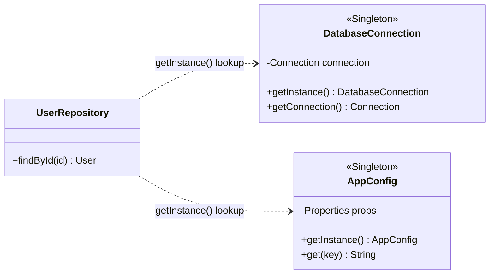
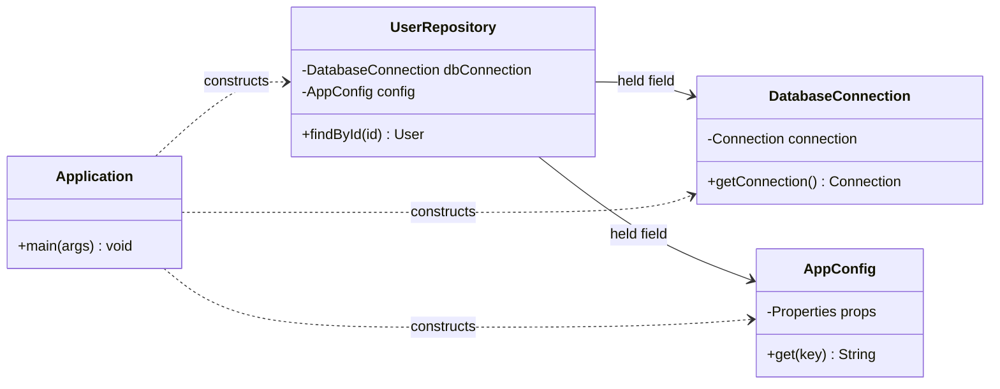

# Anti-Pattern: Singleton Abuse

## What It Is

The Singleton pattern — ensuring a class has only one instance and providing global access to it — is a legitimate creational pattern when used correctly. Singleton Abuse occurs when Singleton is applied to classes that do not genuinely require a single global instance, turning it into a mechanism for managing global mutable state.

The distinction:
- **Legitimate Singleton**: A class that represents a truly unique resource (e.g., a hardware driver, a connection pool manager).
- **Abused Singleton**: A class that is made Singleton purely for convenience — to avoid passing dependencies explicitly.

---

## Intuition

> **One-line analogy**: Singleton Abuse is like making every tool in your workshop a wall-mounted fixture to avoid carrying it — convenient access, but now you can't move the workshop or test anything without the whole building.

**Mental model**: Singleton is convenient — no parameter passing, global access anywhere. But convenience creates hidden dependencies. `UserService.getInstance()` inside a method makes that method impossible to test (can't inject a mock UserService), creates global mutable state (UserService state affects all callers), and makes initialization order fragile. What was "easy to access" becomes "impossible to replace."

**Why it matters**: Singleton abuse is the primary reason Java enterprise code is untestable. Every `getInstance()` call in production code is a testing obstacle. The fix — Dependency Injection — is only slightly more verbose but dramatically more testable and maintainable.

**Key insight**: Legitimate Singleton use cases are narrow: truly unique hardware resources (hardware clock, GPU device), logging (one log file, one writer), connection pool (one pool per application). Everything else should be injected via constructor or DI framework.

---

## How to Recognize It

**Code smells:**
- `getInstance()` calls scattered across the codebase instead of injected dependencies
- Singletons hold mutable state that varies between tests
- Tests must reset Singleton state between runs
- The class has no inherent reason to be unique — it was just "easier"
- Multiple Singletons calling other Singletons (Singleton web)

**Example — The Anti-Pattern:**

```java
// Singleton used to avoid passing dependencies — the abuse
public class DatabaseConnection {

    private static DatabaseConnection instance;
    private Connection connection;

    private DatabaseConnection() {
        // hardcoded config — can't be overridden in tests
        this.connection = DriverManager.getConnection(
            "jdbc:mysql://localhost:3306/prod_db", "root", "password"
        );
    }

    public static DatabaseConnection getInstance() {
        if (instance == null) {
            instance = new DatabaseConnection();
        }
        return instance;
    }

    public Connection getConnection() {
        return connection;
    }
}

// Another Singleton — config that could easily be injected
public class AppConfig {

    private static AppConfig instance;
    private Properties props = new Properties();

    private AppConfig() {
        try {
            props.load(new FileInputStream("config.properties"));
        } catch (IOException e) {
            throw new RuntimeException("Config load failed", e);
        }
    }

    public static AppConfig getInstance() {
        if (instance == null) {
            instance = new AppConfig();
        }
        return instance;
    }

    public String get(String key) {
        return props.getProperty(key);
    }
}

// Consumer: tightly coupled to both singletons
public class UserRepository {

    public User findById(Long id) {
        // Direct call to Singleton — hidden dependency, impossible to test without real DB
        Connection conn = DatabaseConnection.getInstance().getConnection();
        String table = AppConfig.getInstance().get("users.table");

        try (PreparedStatement stmt = conn.prepareStatement(
                "SELECT * FROM " + table + " WHERE id = ?")) {
            stmt.setLong(1, id);
            ResultSet rs = stmt.executeQuery();
            return mapToUser(rs);
        } catch (SQLException e) {
            throw new RuntimeException(e);
        }
    }
}
```

The class diagram makes the hidden coupling concrete: both arrows are dependencies (`..>`), not held associations — `UserRepository` stores no field for either collaborator, so each is fetched fresh via a static `getInstance()` call buried inside `findById()`, invisible from the class's own signature.



**Testing problem:**

```java
// This test always hits the real production database
// There is no way to inject a mock connection
class UserRepositoryTest {

    @Test
    void findById_returnsUser() {
        UserRepository repo = new UserRepository(); // hidden deps — DB, config
        User user = repo.findById(1L);              // hits prod DB or fails
        assertNotNull(user);
    }
}
```

---

## Why It Happens

1. **Laziness / convenience**: It is easier to call `Foo.getInstance()` than to wire dependencies through constructors.
2. **Misunderstanding the pattern**: Developers learn Singleton as a "useful pattern" and apply it broadly without understanding its trade-offs.
3. **Avoiding refactoring**: Adding a constructor parameter means updating all call sites — `getInstance()` avoids that.
4. **Legacy patterns**: Pre-dependency-injection era code (pre-Spring, pre-Guice) relied heavily on Singletons.
5. **No DI framework**: In projects without a DI container, developers reach for Singleton as a substitute.

---

## Why It's Harmful

1. **Hidden dependencies**: A method that calls `Singleton.getInstance()` has an invisible dependency. You cannot tell from its signature what it depends on.
2. **Global mutable state**: Singletons are effectively global variables. Any code anywhere can mutate them, making reasoning about state extremely difficult.
3. **Untestable code**: You cannot substitute a test double (mock) for a Singleton dependency because the dependency is not injected — it is looked up internally.
4. **Initialization order problems**: Singleton A may depend on Singleton B which may not yet be initialized. This creates fragile, order-dependent startup sequences.
5. **Thread safety issues**: The basic `if (instance == null)` check is not thread-safe. Double-checked locking is error-prone.
6. **Tight coupling**: Every consumer is coupled directly to the concrete Singleton class.
7. **Testing interference**: Tests can corrupt shared state, causing order-dependent test failures.

```java
// Thread safety problem: two threads can create two instances
public static DatabaseConnection getInstance() {
    if (instance == null) {                          // Thread A checks — null
        // Thread B also checks here — also null
        instance = new DatabaseConnection();         // Both create instances
    }
    return instance;
}
```

---

## How to Fix It

Replace Singleton lookups with **Dependency Injection**. The class is constructed once by the DI container and injected wherever needed — you get the "one instance" behavior without the global state problem.

```java
// Step 1: Remove the Singleton mechanism entirely
public class DatabaseConnection {

    private final Connection connection;

    // Constructor injection — dependencies are explicit
    public DatabaseConnection(String url, String user, String password) {
        try {
            this.connection = DriverManager.getConnection(url, user, password);
        } catch (SQLException e) {
            throw new RuntimeException("Cannot connect to database", e);
        }
    }

    public Connection getConnection() {
        return connection;
    }
}

// Step 2: Repository receives its dependencies through the constructor
public class UserRepository {

    private final DatabaseConnection dbConnection;
    private final AppConfig config;

    // Dependencies are explicit — visible in the constructor signature
    public UserRepository(DatabaseConnection dbConnection, AppConfig config) {
        this.dbConnection = dbConnection;
        this.config = config;
    }

    public User findById(Long id) {
        Connection conn = dbConnection.getConnection();
        String table = config.get("users.table");
        // ... query logic
    }
}

// Step 3: Wire everything in one place (composition root)
public class Application {

    public static void main(String[] args) {
        AppConfig config = new AppConfig("config.properties");
        DatabaseConnection db = new DatabaseConnection(
            config.get("db.url"), config.get("db.user"), config.get("db.password")
        );
        UserRepository userRepo = new UserRepository(db, config);
        UserService userService = new UserService(userRepo);
        // ... start application
    }
}

// Step 4: Tests can now inject mocks
class UserRepositoryTest {

    @Test
    void findById_returnsUser() {
        DatabaseConnection mockDb = mock(DatabaseConnection.class);
        AppConfig mockConfig = mock(AppConfig.class);
        when(mockConfig.get("users.table")).thenReturn("users");
        when(mockDb.getConnection()).thenReturn(mockConnection());

        UserRepository repo = new UserRepository(mockDb, mockConfig);
        User user = repo.findById(1L);
        assertNotNull(user);
    }
}
```

Both dependency arrows from the diagram above become explicit `-->` associations here: `UserRepository` now stores `DatabaseConnection` and `AppConfig` as constructor-injected fields, and `Application` is the single composition root that constructs every collaborator exactly once.



**When Singleton IS appropriate:**

```java
// Legitimate Singleton: system-wide logger backed by a file handle
// Truly should be one instance — multiple would corrupt the log file
public class ApplicationLogger {

    private static final ApplicationLogger INSTANCE = new ApplicationLogger();
    private final PrintWriter writer;

    private ApplicationLogger() {
        try {
            this.writer = new PrintWriter(new FileWriter("app.log", true));
        } catch (IOException e) {
            throw new RuntimeException(e);
        }
    }

    public static ApplicationLogger getInstance() {
        return INSTANCE;
    }

    public synchronized void log(String message) {
        writer.println(Instant.now() + " " + message);
        writer.flush();
    }
}
```

---

## Real-World Examples

- **Android Application class**: Often abused as a Singleton to hold global state, making Android apps hard to test.
- **Legacy Spring beans**: Before Spring's DI was well-understood, developers made Spring beans Singletons and then also gave them `getInstance()` methods.
- **Game development**: `GameManager`, `AudioManager`, `InputManager` — every system ends up as a Singleton, creating a web of global state.
- **Configuration objects**: `Config.getInstance()` scattered throughout a codebase when the config could simply be injected.

---

## Prevention Strategies

1. **Use a DI framework**: Spring, Guice, Dagger, or CDI manage object lifecycles correctly. A `@Singleton`-scoped bean in Spring is constructed once and injected — no `getInstance()` needed.
2. **Composition root**: Wire all dependencies in one place at startup. Pass dependencies down, never look them up.
3. **Treat global state as a red flag**: Any time you reach for a static field or `getInstance()`, question whether DI would work instead.
4. **Apply the test question**: "Can I test this class without hitting real infrastructure?" If not, you probably have a Singleton abuse.
5. **Code review**: Flag new `getInstance()` call sites in code review.

---

## Cross-Perspective: HLD Connections

**HLD View — Where Singleton Abuse Appears in Distributed Systems**

- **Global state across replicas is catastrophic** — A JVM Singleton only guarantees one instance per process. Across 10 microservice replicas, there are 10 "singletons" with independent state. Any logic that assumes global state via a singleton will produce inconsistent behavior at scale.
- **Shared mutable state requires distributed locks** — If state truly must be globally unique (e.g., a rate limiter counter, a distributed lock), it requires Redis, ZooKeeper, or etcd — not a local Singleton. Misusing Singleton for this leads to race conditions across replicas.
- **Service registries as singletons** — A service registry that becomes a single point of dependency for all other services is Singleton Abuse at the HLD level. If the registry is unavailable, the entire system fails. Mitigation: client-side caching, health checks, and fallback discovery.
- **Static config in distributed systems** — Hard-coding configuration in a static singleton field rather than injecting it via a config service means all replicas must be redeployed for a config change — defeating the purpose of dynamic configuration management.

---

## Interview Relevance

**Common interview questions:**
- "When is Singleton appropriate and when does it become an anti-pattern?" — Core distinction to know.
- "How does Singleton relate to the Dependency Inversion Principle?" — Singleton violates DIP by making consumers depend on a concrete global.
- "What are the problems with Singleton and how would you fix them?" — Expect to walk through thread safety, testability, and hidden dependencies.
- "What is the difference between Singleton and Dependency Injection?" — DI gives you one instance per context, explicitly wired; Singleton gives you one global instance, looked up statically.

**Key talking points:**
- Distinguish legitimate use (truly unique resource) from abuse (convenience)
- Mention all three problems: hidden deps, global mutable state, untestability
- Propose DI as the fix — show you understand composition root and constructor injection
- Thread safety: mention `enum` Singleton or `static final` initialization as thread-safe alternatives if Singleton is truly needed
