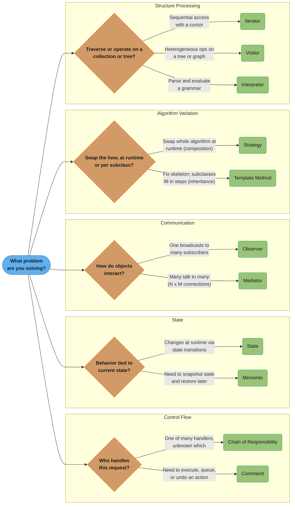
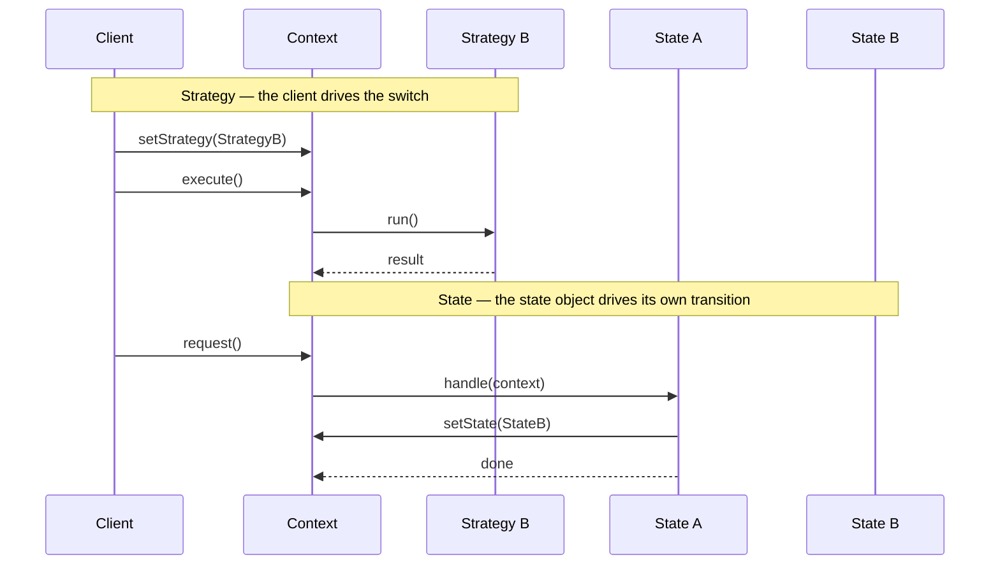
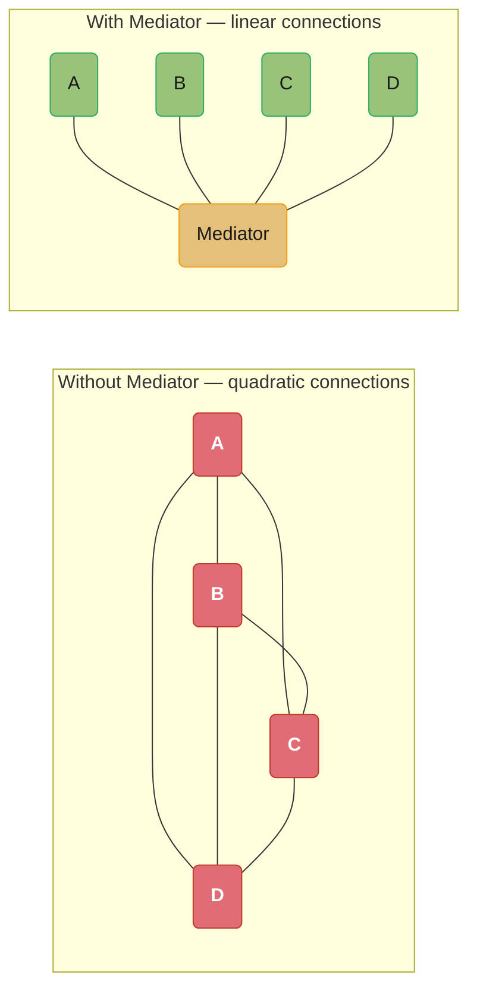

# Behavioral Patterns — Category Index

Behavioral patterns define how objects communicate and distribute responsibility. They focus on algorithms and the assignment of responsibilities between objects. This is the navigation index for all 11 behavioral GoF patterns in this section.

---

## 1. Concept Overview

Behavioral patterns address the question: "How do objects collaborate to accomplish complex tasks without becoming tightly coupled?" They externalize control flow, communication protocols, and algorithmic decisions from call sites into objects that can be composed, swapped, chained, or extended independently.

The 11 GoF behavioral patterns covered here are:

| # | Pattern | Module |
|---|---------|--------|
| 1 | Chain of Responsibility | [chain_of_responsibility/](chain_of_responsibility/) |
| 2 | Command | [command/](command/) |
| 3 | Interpreter | [interpreter/](interpreter/) |
| 4 | Iterator | [iterator/](iterator/) |
| 5 | Mediator | [mediator/](mediator/) |
| 6 | Memento | [memento/](memento/) |
| 7 | Observer | [observer/](observer/) |
| 8 | State | [state/](state/) |
| 9 | Strategy | [strategy/](strategy/) |
| 10 | Template Method | [template_method/](template_method/) |
| 11 | Visitor | [visitor/](visitor/) |

---

## 2. Intuition

**One-line analogy:** Behavioral patterns are the conversation protocols between objects — they define who speaks first, who decides, who listens, and how control flows.

**Mental model:** Most behavioral patterns move a hard-coded decision out of a call site and into an object that can be swapped, chained, or extended. When reading code and feeling the urge to write a large `if/else` or `switch` block, ask: "What decision is being hard-coded here?" That question points directly at which behavioral pattern applies.

**Why this category matters:** Creational patterns solve object construction; structural patterns solve composition. Behavioral patterns solve the hardest problem — runtime collaboration between objects whose identities and counts are not known at compile time.

---

## 3. Patterns at a Glance

| Pattern | Intent | When to Reach for It | Key Pitfall |
|---------|--------|---------------------|-------------|
| [Chain of Responsibility](chain_of_responsibility/) | Pass a request along a handler chain until one handles it | Middleware pipelines; auth/validation/logging layers | Silent drop when no handler matches |
| [Command](command/) | Encapsulate an action, its receiver, and its parameters as an object | Undo/redo; task queuing; deferred execution | Command objects becoming fat with business logic |
| [Interpreter](interpreter/) | Define a grammar and interpret sentences in it | Simple DSLs; expression parsers; SQL WHERE clauses | Performance degrades for complex grammars |
| [Iterator](iterator/) | Provide sequential access to elements without exposing the container | Any traversal abstraction over a collection or cursor | ConcurrentModificationException on structural modification |
| [Mediator](mediator/) | Route communication between objects through a central hub | N objects with M*N connections; chat rooms; UI controllers | Mediator becomes a god object |
| [Memento](memento/) | Capture and restore an object's state without exposing its internals | Undo history; save points; transactional rollback | Deep copy cost on large object graphs |
| [Observer](observer/) | Notify multiple subscribers when a subject's state changes | Domain events; UI data binding; Spring ApplicationEvent | Listener leaks; synchronous I/O in observers |
| [State](state/) | Allow an object to alter its behavior when its internal state changes | Vending machines; order lifecycles; TCP connections | Class explosion for large FSMs |
| [Strategy](strategy/) | Define a family of algorithms and make them interchangeable | Sorting; payment methods; discount rules | Strategy interface leaking implementation details |
| [Template Method](template_method/) | Define an algorithm skeleton in a base class; let subclasses fill in steps | Spring Batch readers/processors; framework hooks | Tight coupling to base class; hard to test |
| [Visitor](visitor/) | Add new operations to an object structure without modifying the elements | AST traversal; type-specific reporting; compiler passes | Breaking change when a new element type is added |

---

## 4. Decision Flowchart

Use this tree when you know what behavior you need but are unsure which pattern applies.

---

## 5. Commonly Confused Pairs

These pairs are structurally similar — the difference is behavioral and conceptual.

| Pair | Look-alike Reason | The Actual Difference |
|------|------------------|-----------------------|
| Strategy vs State | Both hold a reference to a polymorphic interface and delegate to it | Strategy: client picks and holds the strategy; it never changes itself. State: the state object drives its own transitions — the object changes `this.state` without client involvement. |
| Observer vs Mediator | Both decouple communication between objects | Observer is 1-to-many (subject broadcasts; subscribers don't know each other). Mediator is many-to-many (all participants talk through a hub; hub holds the coupling so participants don't). |
| Command vs Strategy | Both wrap behavior in an object | Strategy encapsulates an algorithm for immediate use. Command encapsulates an action for later execution — it carries receiver + parameters and enables undo, queuing, and logging. |
| Template Method vs Strategy | Both vary part of an algorithm | Template Method uses inheritance (hook methods in subclasses). Strategy uses composition (swappable object reference). Prefer Strategy — see Effective Java Item 18. |
| Iterator vs Visitor | Both traverse an object structure | Iterator gives sequential access to elements (homogeneous, cursor-based). Visitor applies type-specific operations to heterogeneous elements using double dispatch. |

The Strategy/State and Observer/Mediator rows are the hardest to internalize from a table alone — their class diagrams are nearly identical, so the diagrams below make the runtime difference concrete.

_Strategy vs State — who drives the switch:_

Only the Client ever calls `setStrategy()` — Strategy B never touches the Context's reference back. With State, the Client just calls `request()`; StateA decides on its own to call `Context.setState(StateB)`, so the transition is invisible to the caller, exactly matching the table row above.

_Observer vs Mediator — connection topology:_

Four participants need six direct connections without a mediator, growing quadratically as more join; with a mediator the same four need only four connections to the hub — the N-squared-to-N reduction the table row describes.

---

## 6. Real-World Pattern Frequency

| Frequency | Patterns | Where You See Them |
|-----------|---------|-------------------|
| Ubiquitous | Observer, Strategy, Iterator | Spring ApplicationEvent, payment gateways, Java collections, lambda-as-strategy |
| Common | Command, Template Method, Chain of Responsibility | Spring Batch, Servlet filter chain, ExecutorService tasks, JdbcTemplate |
| Situational | State, Memento, Mediator | Order/payment FSMs, text editor undo, Spring WebFlux router |
| Specialized | Visitor, Interpreter | Compiler AST passes, query plan trees, simple expression DSLs |

**Java library cross-reference:**

| Pattern | Java / Spring Example |
|---------|----------------------|
| Observer | `java.util.EventListener`, `ApplicationEventPublisher`, `Flow.Subscriber` (reactive) |
| Strategy | `java.util.Comparator`, `AuthenticationProvider` |
| Iterator | `java.util.Iterator`, enhanced `for-each`, `java.util.Spliterator` |
| Command | `java.lang.Runnable`, `java.util.concurrent.Callable`, `java.awt.Action` |
| Template Method | `AbstractList`, `JdbcTemplate`, `Spring Batch ItemReader/ItemProcessor/ItemWriter chain`, `HttpServlet.doGet` |
| Chain of Responsibility | `javax.servlet.Filter`, `javax.servlet.FilterChain`, Spring Security `FilterChainProxy`, `HandlerInterceptor` |
| State | Spring State Machine, `javax.faces.lifecycle.Lifecycle` |
| Memento | `javax.swing.undo.UndoableEdit`, Event Sourcing aggregate snapshots |
| Visitor | `javax.lang.model.element.ElementVisitor`, `ClassFileVisitor` (ASM), JavaParser visitors |
| Mediator | Spring MVC `DispatcherServlet`, `ApplicationContext` as mediator between beans |
| Interpreter | Spring Expression Language (SpEL), OGNL, Thymeleaf expression engine |

---

## 7. Learning Path

Study behavioral patterns in this order. Each entry builds on the previous.

**Phase 1 — Foundation (start here)**

1. [Observer](observer/) — Foundation for all event-driven thinking. Once you understand publish/subscribe, every framework's event system makes sense. Study first.

2. [Strategy](strategy/) — The most practically useful pattern. Appears everywhere as lambdas in Java 8+. Teaches the core idea: extract the varying part into an interface.

3. [Command](command/) — Builds on Strategy by adding history and deferral. Once you see Runnable as a Command, task queues and undo systems become obvious.

**Phase 2 — Control Flow**

4. [Chain of Responsibility](chain_of_responsibility/) — Builds on Command by adding routing. After studying Command, CoR feels like a natural extension: a linked list of commands.

5. [Template Method](template_method/) — Complements Strategy (inheritance vs composition). Study alongside Strategy to understand when each applies.

**Phase 3 — State and Coordination**

6. [State](state/) — FSM thinking. Builds on Strategy structurally; differs in who drives the switch. Study after Strategy so the structural similarity is obvious.

7. [Iterator](iterator/) — Simple and ubiquitous. Java hides this with for-each and Streams, but knowing the underlying protocol matters for custom data structures.

8. [Mediator](mediator/) — Study after Observer. Mediator solves the problem that arises when you have many observers that also need to talk to each other.

**Phase 4 — Advanced**

9. [Memento](memento/) — Simple state capture. Study alongside Command (Command-with-undo is an alternative to Memento for behavioral state).

10. [Visitor](visitor/) — Advanced; requires understanding of type hierarchies and the limits of single dispatch. Study after you are comfortable with polymorphism.

11. [Interpreter](interpreter/) — Most specialized. Only relevant when building DSLs or expression parsers. Study last.

---

## 8. Cross-References

| Pattern | See Also |
|---------|---------|
| Observer | [`../../spring/spring_events_and_scheduling/`](../../spring/spring_events_and_scheduling/) — Spring ApplicationEvent is a managed Observer implementation |
| Chain of Responsibility | [`../../spring/filters_and_interceptors/`](../../spring/filters_and_interceptors/) — Servlet FilterChain is CoR in production |
| Template Method | [`../../spring/spring_batch/`](../../spring/spring_batch/) — ItemReader/Processor/Writer follow Template Method skeleton |
| Strategy | [`../../java/functional_programming/`](../../java/functional_programming/) — lambdas are Strategy objects; Comparator.comparing() is a factory for them |
| State | [`../../hld/microservices/`](../../hld/microservices/) — service lifecycle (starting, running, degraded, stopped) modeled as FSM |
| Command | [`../../java/concurrency/`](../../java/concurrency/) — Runnable is Command; ExecutorService is the task queue that receives Commands |
| Iterator | [`../../java/java_streams/`](../../java/java_streams/) — Stream is a composable, lazy, parallelizable alternative to external Iterator |
| Visitor | [`../pattern_comparisons/`](../pattern_comparisons/) — see Decorator_vs_Proxy.md for intent analysis methodology applicable to Visitor |

---

## 9. Common Interview Problem Mapping

Many LLD interview problems require combining multiple behavioral patterns. This table maps canonical LLD problems to the behavioral patterns they exercise.

| LLD Problem | Primary Behavioral Patterns | Why |
|-------------|----------------------------|-----|
| Design a vending machine | State, Strategy | State drives dispensing lifecycle; Strategy selects payment method |
| Design an elevator system | State, Observer | State tracks floor/direction; Observer notifies waiting passengers |
| Design an ATM | State, Template Method | State drives transaction lifecycle; Template Method defines transaction skeleton |
| Design a chess game | Command, State | Command records moves for undo; State tracks game phase (check, checkmate) |
| Design a parking lot | Strategy, Observer | Strategy for pricing; Observer notifies on space availability change |
| Design a text editor | Command, Memento | Command for each edit operation; Memento for undo history |
| Design a notification system | Observer, Strategy, Chain of Responsibility | Observer for pub/sub; Strategy for channel selection; CoR for routing |
| Design a ride-sharing app | Observer, Strategy | Observer for driver matching events; Strategy for surge pricing |

---

## 12. Interview Q&As

Questions are ordered by interview frequency: gotchas and traps first, then internal mechanics, then edge cases.

---

**Q: Strategy vs State: they look identical structurally — what is the actual difference?**

In Strategy, the client chooses which strategy to use and the strategy object never changes the selection itself. In State, the state object decides its own transitions — the object changes its own `currentState` reference without client involvement. Strategy = external algorithm selection by the caller; State = object's internal lifecycle driven by the state objects themselves. The interview gotcha: drawing a UML of either pattern produces an identical diagram — the difference is only in who holds a reference to the next strategy/state and who has the authority to change it.

---

**Q: Observer vs Mediator: both handle communication between objects — when do you pick each?**

Observer is 1-to-many: a subject broadcasts to all subscribers without knowing who they are. Mediator is many-to-many: all participants communicate through a central hub, and no participant knows about the others. Use Observer for event notification where subscribers react independently (UI refresh, domain events). Use Mediator when N objects all need to communicate with each other — the alternative is N-squared direct connections; Mediator reduces that to N connections to the hub. The failure mode for overusing Observer is N objects each subscribing to each other, which is the symptom that tells you to switch to Mediator.

---

**Q: Command vs Strategy: both encapsulate behavior in an object — what is different?**

Strategy encapsulates an algorithm to be used right now — sort this list using this comparator. Command encapsulates an action to be executed later: it carries the receiver, the action name, and its parameters as a self-contained unit. Command enables undo (store the inverse operation), queuing (pass the Command to an ExecutorService), logging (serialize the Command), and macro recording (replay a sequence of Commands). Strategy has none of these concerns — it is stateless and side-effect-free by contract. If you find yourself needing to store or replay behavior, you need Command, not Strategy.

---

**Q: Template Method vs Strategy: both vary part of an algorithm — which and when?**

Template Method uses inheritance: the abstract base class defines the algorithm skeleton and calls hook methods that subclasses override. Strategy uses composition: the context holds a strategy reference that can be swapped at runtime without changing the context class. Effective Java Item 18 prefers composition (Strategy) over inheritance (Template Method): inheritance creates tight coupling to the base class, makes the subclass fragile when the base changes, and makes unit testing harder because you cannot mock an abstract parent. Prefer Template Method only when the framework forces it (e.g., `HttpServlet`) or when the hook methods form a cohesive algorithm that makes no sense separated from the skeleton.

---

**Q: When does Chain of Responsibility become an antipattern?**

Chain of Responsibility breaks down in three ways. First, silent drops: no default/terminal handler exists, so unmatched requests fall off the end of the chain without error — a bug that is almost impossible to detect in logs. Second, ordering bugs: handlers are assembled in the wrong order (authentication check placed after business logic, or a logging handler placed before auth so it logs unauthenticated requests). Third, dynamic chain construction that makes ordering non-deterministic. Fix: always include a terminal handler that either processes or explicitly rejects; make chain order part of explicit configuration; write an integration test that sends an unrecognized request and asserts on the rejection.

---

**Q: How does Java's Iterator protocol implement the Iterator pattern?**

`java.util.Iterator` with `hasNext()` and `next()` is a textbook Iterator. Java's enhanced for-each desugars to: `Iterator<T> it = collection.iterator(); while (it.hasNext()) { T e = it.next(); ... }`. The pattern separates traversal state from the collection, so you can have multiple concurrent iterators over the same collection, each with its own cursor. The primary pitfall is `ConcurrentModificationException`: if the collection is structurally modified (add/remove) while iterating, the iterator detects the modification via a `modCount` check and throws. Fix: use `Iterator.remove()` (the only safe remove during iteration), copy the collection before iterating, or use a concurrent collection such as `CopyOnWriteArrayList`.

---

**Q: How does Spring ApplicationEvent implement Observer?**

`ApplicationEvent` is the event object (the subject's state change expressed as a value). `ApplicationEventPublisher.publishEvent()` is the notify call. `@EventListener` methods are the observers — Spring registers them via classpath scanning and reflection at startup. Key difference from raw Observer: the publisher does not hold a list of listeners; the `ApplicationContext` acts as the event bus and maintains the registry, so the publisher is decoupled from all subscribers. Async variant: annotate with `@Async @EventListener` to run the listener in a separate thread pool thread, keeping the publisher thread unblocked. Pitfall: without `@Async`, a slow listener blocks the publisher synchronously.

---

**Q: Memento with a large object graph — what breaks?**

Deep copies of complex object graphs are expensive in both memory and CPU. If the graph contains non-serializable fields, open I/O streams, references to external resources, or circular references, `Cloneable` and manual copying both fail silently or incompletely. Storing one Memento per action in a long-lived undo history causes memory bloat proportional to object size times history depth. Fix: snapshot only the relevant state fields rather than the full object; use Command with `undo()` instead (stores the delta — what changed — rather than a full snapshot); or adopt Event Sourcing for the large-scale equivalent, where the current state is always derived by replaying a log of events.

---

**Q: Visitor pattern: why is double-dispatch needed?**

Java uses single dispatch — the method that runs is determined solely by the runtime type of the receiver object, but the overload selected is determined at compile time by the declared type of the argument. In a hierarchy of `Shape`, `Circle`, `Rectangle`, calling `visitor.visit(shape)` where `shape` is declared as `Shape` always calls `visit(Shape)`, even at runtime when `shape` is actually a `Circle`. Double-dispatch solves this: the element calls `accept(visitor)`, and inside `accept()` — where `this` is the concrete type known to the compiler — calls `visitor.visit(this)`. Now the correct overload (`visit(Circle)` or `visit(Rectangle)`) is resolved. Without double-dispatch, the Visitor must use `instanceof` chains, eliminating the type-safety benefit of the pattern.

---

**Q: Which behavioral pattern is most abused in enterprise Java?**

Observer/Listener. The three most common abuses: (1) observers that perform heavy I/O or database calls synchronously, blocking the publisher thread and causing cascading timeouts; (2) memory leaks from listeners that are never unregistered — a static event bus or `EventListenerList` holds a strong reference to the listener object, preventing garbage collection even after the owning component is logically destroyed; (3) observers with shared mutable state that makes execution order matter, violating the contract that observers are independent and order-agnostic. Fixes: use `@Async` or a dedicated executor for I/O listeners; use weak references or explicit `removeListener()` in lifecycle hooks; and enforce that observers share no mutable state.

---

**Q: How does the State pattern handle complex FSMs with many states?**

Each state is a class; transitions are methods on the state class (or the context delegates to the state, which returns the next state object). For 5 to 10 states this is clean and readable. For 50 or more states the class explosion makes the codebase unmanageable — 50 classes, each with transition methods for every possible event. Alternatives: encode the FSM as a state-transition table (a `Map<State, Map<Event, Transition>>` drives the engine); use a library (Spring State Machine for complex hierarchical FSMs, Stateless4j for lightweight ones); or define the FSM in a configuration file and generate the state classes. The State pattern shines when each state has complex behavior with many methods — it is overkill for simple flag-based or two-state logic.

---

**Q: Iterator vs Stream in modern Java — when to use each?**

Iterator is external iteration — the caller drives `hasNext()`/`next()` and controls when to advance. Stream is internal iteration — the stream library drives the pipeline, and the caller provides functions describing what to do at each step. Use Iterator when you need to pause traversal mid-way (lazy producer/consumer handoff, cooperative multitasking, generators), early-exit with complex stateful conditions, or resume iteration across method boundaries. Use Stream for functional pipelines (filter/map/reduce/collect) — it is more composable, concise, and can be parallelized with `parallelStream()`. The key pitfall: a `Stream` is single-use and cannot be reset or restarted after terminal operation; an `Iterator` can be partially consumed, stored, and resumed across calls.

---

**Q: What forces you to choose Visitor over a simple `instanceof` dispatch?**

Three forces: type safety (the compiler enforces that all element types have a corresponding visit method — adding a new element type without updating visitors causes a compile error, which `instanceof` chains never provide); separation of concerns (new operations are added as new Visitor implementations, not as new methods on the element classes — the element classes are closed for modification); and open/closed principle compliance (elements are open for new visitor operations without touching their source). The tradeoff is the opposite of the extensibility axis: adding a new element type requires updating every existing Visitor, while `instanceof` chains only require adding one branch. Choose Visitor when element types are stable but operations change frequently; choose `instanceof` (or sealed classes with pattern matching in Java 17+) when operations are stable but element types change.

---

**Q: When does the Mediator pattern turn into a God Object?**

Mediator reduces N² connections to N, but if the mediator handles too many peers, it centralizes all coordination logic in one class that knows about every participant's behavior — violating SRP. Signs: the mediator has dozens of `if (sender instanceof X)` branches, participants call the mediator for things that don't need coordination, and modifying any participant requires modifying the mediator. Fix: extract sub-mediators by domain boundary; or replace peer-to-peer coordination with domain events (Observer) so the mediator doesn't need to know about every peer.

---

**Q: Why is Interpreter the least-used GoF pattern in production systems?**

Interpreter requires a grammar tree where each node is an object, so parsing a large expression creates a deep object graph — memory-intensive and slow to evaluate. Modern alternatives: use a parsing library (ANTLR, PEG parsers) that produces a compact AST and separates grammar from evaluation; or use an existing expression language (SpEL, JEXL, Aviator) rather than building your own. Interpreter is appropriate only for very small, fixed grammars (e.g., a 5-operator calculator, a simple boolean rule engine) where the simplicity of the implementation outweighs the performance cost.

---

**Q: Memento vs Event Sourcing — same idea, different scale?**

Yes, and understanding the distinction is important. Memento captures and restores the state of a single object at interaction time (undo/redo in a text editor). Event Sourcing captures every state change across an entire system as an append-only event log, from which any past state can be reconstructed. Memento is a local, in-memory pattern; Event Sourcing is a distributed systems architecture. Both share the insight that storing history (rather than current state) enables time-travel. If you need Memento across a distributed system, you're building Event Sourcing.

---
