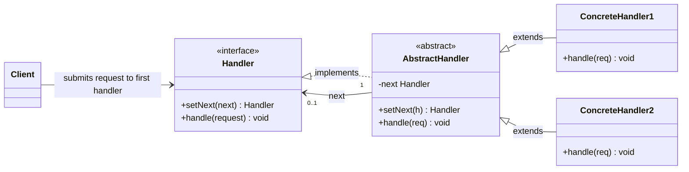
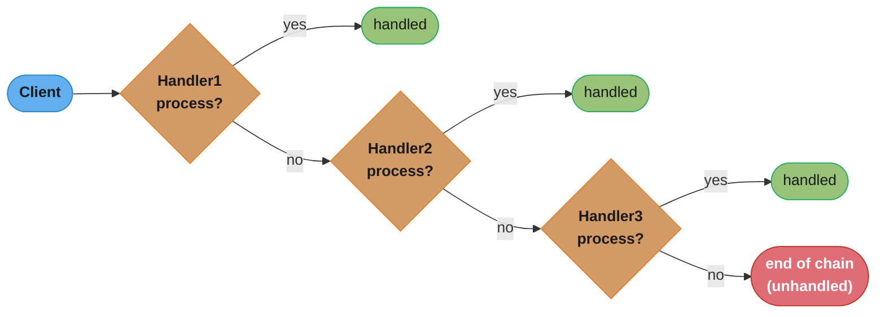
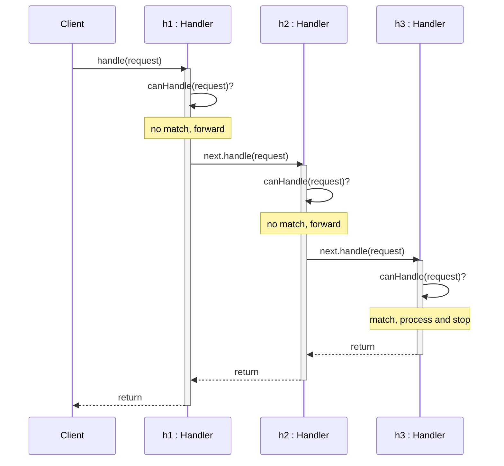
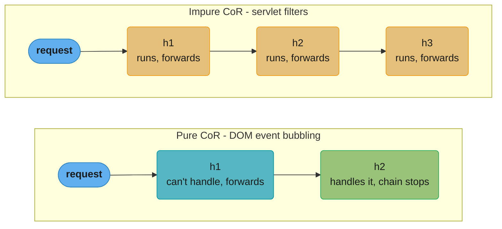

# Chain of Responsibility Pattern

## 1. Pattern Name & Category

**Pattern:** Chain of Responsibility
**Category:** Behavioral (Gang of Four)
**Also Known As:** CoR, Chain of Command

---

## 2. Intent

Pass a request along a chain of handlers, where each handler either processes the request or forwards it to the next handler in the chain.

---

## Intuition

> **One-line analogy**: Chain of Responsibility is like a customer service escalation — your call goes to Level 1 support; if they can't help, it escalates to Level 2; then Level 3. Each level either resolves it or passes it up.

**Mental model**: When a request might be handled by one of several handlers, but you don't know which one at compile time, link handlers in a chain. Each handler checks "can I handle this?" — if yes, processes it; if no, passes to the next handler. The sender just submits to the first handler; it doesn't know who actually handles it. The chain can be configured dynamically and handlers can be added/removed without changing sender or other handlers.

**Why it matters**: Servlet Filters and Spring's interceptor pipeline are Chain of Responsibility. HTTP middleware chains (authentication → rate limiting → logging → routing) process every request through a configurable chain. Event bubbling in the DOM (click event propagates up the element hierarchy) implements CoR.

**Key insight**: Chain of Responsibility and Decorator are structurally similar (both wrap objects in a chain), but their intent differs. CoR stops propagation when a handler handles the request; Decorator always passes through and all decorators execute. CoR is for exclusive "first handler wins"; Decorator is for cumulative "all handlers apply."

---

## 3. Problem Statement

### The Problem
You have a system where a request must be processed by one (or potentially many) of several handlers, but you don't know in advance which handler is responsible. Hardcoding if-else chains or switch statements tightly couples the sender to all possible receivers, makes adding/removing handlers difficult, and violates the Open/Closed Principle.

### Scenario
Consider an HTTP request pipeline in a web application:
- Authentication: Is the user logged in?
- Authorization: Does the user have permission?
- Rate Limiting: Has the user exceeded request limits?
- Validation: Is the request body valid?
- Business Logic: Actual processing

Without CoR, you'd nest all this logic in one massive method. Every time a new concern is added (e.g., CORS, logging, caching), you modify the core handler. This creates a bloated, hard-to-test monolith.

### Another Scenario
A support ticket system:
- Level 1 support handles basic issues
- Level 2 support handles intermediate issues
- Level 3 support handles complex issues
- Manager handles escalated issues

Each level should only deal with what it can handle and pass the rest up the chain.

---

## 4. Solution

The Chain of Responsibility pattern solves this by:
1. Defining a common `Handler` interface with a method to handle requests and a reference to the next handler.
2. Each concrete handler decides: "Can I handle this? If yes, process it. If no, pass it to the next handler."
3. The client assembles the chain and sends a request to the first handler.
4. The chain can be reconfigured at runtime without changing the client or handlers.

This decouples the sender from receivers — the sender only knows about the first handler. Handlers are unaware of each other's existence (only the next one).

---

## 5. UML Structure



*`AbstractHandler` supplies the default forwarding logic (`handle()` calls `next` unless a subclass short-circuits), so `ConcreteHandler1`/`ConcreteHandler2` only implement their own check-and-act step — the shared `next` reference (typed `Handler`) is what links arbitrary instances into a chain at runtime via `setNext()`.*

**Request flow:**


*Each handler is asked in turn whether it can process the request; a "no" forwards to the next link, and falling off the end without a catch-all handler is exactly the "no fallback" pitfall described in Section 13.*

---

## 6. How It Works

**Step-by-step mechanics:**

1. **Define the Handler interface** with `handle(Request)` and `setNext(Handler)` methods.
2. **Create an AbstractHandler** that stores the next handler reference and provides a default `handle()` that simply delegates to the next handler if present.
3. **Implement ConcreteHandlers** that either:
   - Handle the request themselves (and optionally stop the chain), or
   - Call `super.handle(request)` to forward to the next handler.
4. **Client builds the chain** by linking handlers: `h1.setNext(h2).setNext(h3)`.
5. **Client sends a request** to the first handler (`h1.handle(request)`).
6. The request travels down the chain until a handler processes it or the chain ends.

The class diagram in Section 5 shows the static shape, but not the runtime call sequence implied by steps 4-6 — `h1.setNext(h2).setNext(h3)` followed by `h1.handle(request)`:



*Client only ever calls `h1`; each handler decides locally whether to act or forward. `h3` is the one that matches and stops the chain, but because `handle()` is a plain synchronous call, control still unwinds back through `h2` and `h1` — nothing downstream of `h3` is ever invoked, but everything upstream of it still returns.*

**Two variants:**
- **Pure CoR:** Only one handler processes the request (like event bubbling in DOM).
- **Impure CoR:** Multiple handlers can process the same request (like servlet filters — each one runs).



*In pure CoR the chain halts the instant a handler processes the request (a configured `h3` would simply never be invoked); in impure CoR every handler runs and forwards regardless of outcome — this is why servlet `FilterChain` and Spring `HandlerInterceptor` are impure CoR (see the Interview Tips Q&A below).*

---

## 7. Key Components

| Component | Role |
|-----------|------|
| **Handler** | Interface defining `handle()` and `setNext()` |
| **AbstractHandler** | Optional base class implementing chain-linking logic |
| **ConcreteHandler** | Implements actual handling logic; decides to handle or pass |
| **Client** | Assembles the chain and initiates the request |
| **Request** | The object being passed through the chain (may be a simple value or rich object) |

---

## 8. When to Use

- **Multiple handlers for a request** — and you don't know which will handle it at compile time.
- **Processing pipelines** — where each stage independently transforms or validates a request.
- **Decoupling sender from receivers** — when the set of handlers should be configurable.
- **Logging/Auditing middleware** — where every request should pass through logging, then auth, then rate limiting.
- **GUI event handling** — button click bubbles up through panels, windows, application.
- **Approval workflows** — expense approval going through team lead → manager → director.
- **Interceptor chains** — like Java Servlet filters or Spring HandlerInterceptor chains.
- **Command validation** — validating input through a series of validators.

**Concrete examples:**
- Java Servlet FilterChain
- Spring Security filter chain
- Netty ChannelPipeline
- Node.js Express middleware
- Java's logging handlers (Logger → parent Logger)

---

## 9. When NOT to Use

- **Only one possible handler** — use a simple Strategy or direct call instead.
- **Performance-critical tight loops** — chain traversal adds overhead; avoid for hot paths.
- **Guaranteed processing required** — CoR does not guarantee a handler will process the request (the chain might be exhausted). If every request MUST be handled, use a different pattern.
- **Simple conditional logic** — if a plain if-else or switch covers it cleanly, don't over-engineer.
- **When order doesn't matter** — if handlers are independent and order is irrelevant, use Observer/Mediator instead.
- **Deep chains** — very long chains (100+) can make debugging and tracing difficult.

---

## 10. Pros

- **Decouples sender and receiver** — the sender doesn't need to know which handler will process its request.
- **Single Responsibility Principle** — each handler focuses on one specific concern.
- **Open/Closed Principle** — add new handlers without modifying existing ones or the client.
- **Flexible chain configuration** — chains can be assembled, reordered, or swapped at runtime.
- **Reduced if-else complexity** — eliminates deeply nested conditionals.
- **Testability** — each handler is independently testable in isolation.
- **Reusability** — handlers can be reused across different chains.
- **Supports both variants** — can be used for single-handler-processes or all-handlers-process scenarios.

---

## 11. Cons

- **No guarantee of handling** — a request may reach the end of the chain unhandled (must explicitly handle this case).
- **Hard to debug** — tracing which handler processed a request requires logging or debugging through the chain.
- **Runtime assembly complexity** — the client is responsible for building the chain correctly; wrong order causes bugs.
- **Can be slow** — each handler is invoked in sequence; long chains with many checks degrade performance.
- **Breaks single-pass processing** — in pure CoR, once a handler processes the request, subsequent handlers are skipped, which can be unexpected.
- **Difficult to visualize** — the flow is not immediately obvious from reading code; requires understanding chain assembly.
- **Potential for infinite loops** — if handlers are misconfigured and create cycles.

---

## 12. Tradeoffs

| You Gain | You Lose |
|----------|----------|
| Flexibility to reconfigure chains | Predictability of request handling |
| Decoupling between sender/receiver | Guaranteed request processing |
| Clean, single-responsibility handlers | Visibility into which handler fires |
| Easy extension via new handlers | Performance (linear chain traversal) |
| Testable handlers in isolation | Simple code structure (adds abstraction) |

---

## 13. Common Pitfalls

1. **Forgetting to call the next handler** — a concrete handler that doesn't call `super.handle()` silently breaks the chain. Always be deliberate about whether to continue the chain.

2. **Wrong chain order** — authentication must come before authorization. If you assemble the chain incorrectly, security breaks silently.

3. **Mutable request objects** — if handlers mutate the request object, later handlers see modified state. Be explicit about whether modification is intentional.

4. **No fallback/default handler** — chains that exhaust without processing a request return nothing. Always add a catch-all handler at the end.

5. **Leaking chain assembly into business logic** — chain construction should be in a factory or configuration class, not scattered across the codebase.

6. **Overusing CoR for simple cases** — using CoR for a two-handler scenario adds complexity with no benefit.

7. **Circular chain** — if Handler A's next is Handler B and B's next is A, you get an infinite loop. Guard against this.

8. **Thread safety** — if handlers are stateful and shared across threads, ensure proper synchronization.

---

## 14. Real-World Usage

### Production Anchor: Spring Security FilterChainProxy at 50k req/sec

The canonical Java Chain of Responsibility in production is Spring Security's `FilterChainProxy`, which threads every HTTP request through 15+ filters in a strictly-ordered pipeline. A typical chain:

```mermaid
flowchart LR
    classDef io      fill:#61afef,stroke:#2e86c1,color:#1a1a1a,font-weight:bold
    classDef frozen  fill:#c678dd,stroke:#9b59b6,color:#fff
    classDef train   fill:#98c379,stroke:#27ae60,color:#1a1a1a
    classDef mathOp  fill:#d19a66,stroke:#e67e22,color:#1a1a1a,font-weight:bold
    classDef lossN   fill:#e06c75,stroke:#c0392b,color:#fff,font-weight:bold
    classDef req     fill:#56b6c2,stroke:#0097a7,color:#1a1a1a
    classDef base    fill:#e5c07b,stroke:#f39c12,color:#1a1a1a

    REQ([HTTP Request]) --> F1

    subgraph SGA["Context and Headers (1-4)"]
        direction LR
        F1("1 WebAsyncManager<br/>Integration") --> F2("2 SecurityContext<br/>Persistence")
        F2 --> F3("3 HeaderWriter<br/>(X-Frame, HSTS)")
        F3 --> F4("4 CorsFilter")
    end

    subgraph SGB["CSRF / Logout (5-6)"]
        direction LR
        F5("5 CsrfFilter") --> F6("6 LogoutFilter")
    end

    subgraph SGC["Authentication (7-9)"]
        direction LR
        F7("7 UsernamePassword<br/>(form login)") --> F8("8 BasicAuthentication")
        F8 --> F9("9 BearerToken<br/>(JWT)")
    end

    subgraph SGD["Post-Auth Context (10-13)"]
        direction LR
        F10("10 RequestCacheAware") --> F11("11 SecurityContextHolder<br/>AwareRequest")
        F11 --> F12("12 Anonymous<br/>Authentication")
        F12 --> F13("13 SessionManagement")
    end

    subgraph SGE["Authorization Decision (14-15)"]
        direction LR
        F14("14 ExceptionTranslation<br/>(AccessDenied to 403)") --> F15("15 FilterSecurityInterceptor<br/>final authz decision")
    end

    F4 --> F5
    F6 --> F7
    F9 --> F10
    F13 --> F14
    F15 --> CTRL(["@Controller method"])

    class REQ,CTRL io
    class F1,F2,F3,F4 base
    class F5,F6 req
    class F7,F8,F9 mathOp
    class F10,F11,F12,F13 train
    class F14,F15 lossN
```



*Every filter only knows about forwarding to the next link (or short-circuiting by writing a response directly) — the strict left-to-right order shown here is a security invariant, not an implementation detail (see the reordering anti-pattern below).*

Observed numbers at 50k req/sec on a 16-vCPU JVM cluster:
- Full 15-filter traversal overhead: **< 2 ms p99** (most filters are no-ops on cache hit).
- Short-circuit on auth failure at filter 8: returns in **~0.4 ms** without traversing filters 9–15.
- Memory: filter chain is a singleton list; per-request state lives in `SecurityContextHolder` (ThreadLocal).
- Filter ordering bugs accounted for **3 of 7 CVEs** in Spring Security 5.x — ordering is load-bearing.

### Production-grade handler base + chain

```java
public abstract class Handler<C extends Context> {
    private Handler<C> next;
    public final Handler<C> setNext(Handler<C> n) { this.next = n; return n; }

    public final void handle(C ctx) {
        if (canHandle(ctx)) doHandle(ctx);
        if (ctx.isTerminated()) return;             // short-circuit
        if (next != null) next.handle(ctx);
        else terminateWithDefault(ctx);             // every chain has a terminal
    }
    protected abstract boolean canHandle(C ctx);
    protected abstract void doHandle(C ctx);
    protected void terminateWithDefault(C ctx) {
        ctx.respond(404, "no handler matched");
    }
}
```

```java
public final class RateLimitHandler extends Handler<HttpContext> {
    private final TokenBucket bucket;               // 10k tokens, 1k refill/sec
    @Override protected boolean canHandle(HttpContext c) { return true; }
    @Override protected void doHandle(HttpContext c) {
        if (!bucket.tryAcquire(c.clientId())) {
            // CRITICAL: respond BEFORE auth runs to avoid leaking identity
            c.respond(429, Map.of("Retry-After", "1"));
            c.terminate();
        }
    }
}

public final class AuthHandler extends Handler<HttpContext> {
    @Override protected boolean canHandle(HttpContext c) {
        return c.header("Authorization") != null;
    }
    @Override protected void doHandle(HttpContext c) {
        Principal p = jwt.verify(c.header("Authorization"));
        if (p == null) { c.respond(401); c.terminate(); return; }
        c.setPrincipal(p);
    }
}
```

### Famous Java/Spring usages
- `javax.servlet.FilterChain` — JEE servlet filter chain (`doFilter()` continues, no call terminates).
- `org.springframework.security.web.FilterChainProxy` — Spring Security 15+ filter pipeline.
- `org.springframework.web.servlet.HandlerInterceptor` chain — `preHandle/postHandle/afterCompletion` around MVC handlers.
- `org.springframework.web.filter.OncePerRequestFilter` — base for per-request filters.
- `io.netty.channel.ChannelPipeline` — inbound/outbound `ChannelHandler` chain.
- `okhttp3.Interceptor.Chain` — `chain.proceed(request)` continues; returning a `Response` short-circuits.
- `java.util.logging.Logger` parent chain — log records bubble up to parent loggers.
- Common stacks: `LoggingHandler -> AuthHandler -> RateLimitHandler -> BusinessHandler`.

### Anti-pattern 1: Chain with no terminal handler

```java
// BROKEN: request walks the end of the chain; null next, nothing responds.
// Client sees the connection hang until timeout (default 30s).
auth.setNext(authz).setNext(business);              // no fallback after business
business.handle(ctx);                               // if !canHandle, falls off the end
```

```java
// FIX: always terminate with a default/catch-all handler.
auth.setNext(authz).setNext(business).setNext(new NotFoundHandler());

public final class NotFoundHandler extends Handler<HttpContext> {
    @Override protected boolean canHandle(HttpContext c) { return true; }
    @Override protected void doHandle(HttpContext c) { c.respond(404); c.terminate(); }
}
```

### Anti-pattern 2: instanceof checks inside handlers

```java
// BROKEN: the *caller* is choosing the handler by type-checking.
// Adds coupling; every new request subtype edits every handler.
public void doHandle(Request r) {
    if (r instanceof SpecialRequest sr) { handleSpecial(sr); }
    else if (r instanceof OtherRequest or) { handleOther(or); }
    else if (next != null) next.handle(r);
}
```

```java
// FIX: each handler owns its own canHandle(); polymorphism, not instanceof ladders.
public abstract class Handler<C> {
    protected abstract boolean canHandle(C ctx);    // handler decides for itself
    protected abstract void doHandle(C ctx);
}
public final class SpecialHandler extends Handler<Request> {
    @Override protected boolean canHandle(Request r) { return r instanceof SpecialRequest; }
    @Override protected void doHandle(Request r) { /* ... */ }
}
```

### Anti-pattern 3: Re-ordering filters without understanding invariants

```java
// BROKEN: someone "optimised" by moving rate-limit AFTER auth so that
// only authenticated users count toward the quota. Now 429 responses include
// the authenticated principal in the response body / logs / WWW-Authenticate
// header -> identity leak to attackers spraying credentials.
chain = auth.setNext(rateLimit).setNext(business);
```

```java
// FIX: document ordering invariants and assert them in unit tests.
// Rate-limit MUST precede auth so 429s are identity-agnostic.
chain = rateLimit.setNext(auth).setNext(business);

@Test void rateLimitMustPrecedeAuth() {
    var order = chain.toList();
    assertTrue(order.indexOf(rateLimit) < order.indexOf(auth),
        "rate limiter must run before auth (CVE-2022-XXXX class issue)");
}
```

### Migration story

**Move TO Chain of Responsibility when**: you have 4+ cross-cutting concerns layered around request/message processing (logging, auth, rate-limit, validation, business); you want to add/remove concerns without recompiling business handlers; concerns are independently testable. We migrated a custom dispatcher to a chain after the dispatcher's `if/else` ladder hit 14 branches and engineers kept forgetting to add new ones.

**Move AWAY FROM Chain when**: the chain has only 2 nodes (just inline); ordering invariants are non-local and hard to test; the chain is being abused as a workflow engine (use a state machine or a saga instead). Once a chain exceeds ~20 nodes, debugging becomes a stack-walk nightmare — split into named sub-chains or move to a pipeline DAG.

---

## 15. Comparison with Similar Patterns

| Pattern | Key Difference |
|---------|---------------|
| **Decorator** | Also chains objects, but Decorator always calls the next (wrapping behavior), whereas CoR may stop the chain. Decorator focuses on adding behavior, CoR on routing/processing. |
| **Command** | Command encapsulates a request as an object. CoR routes that request through handlers. They are complementary. |
| **Strategy** | Strategy selects one algorithm. CoR may involve multiple handlers, and the selection is dynamic as the request traverses the chain. |
| **Observer** | All observers are notified. CoR stops when a handler processes the request (in pure CoR). |
| **Mediator** | Mediator centralizes communication between objects. CoR distributes responsibility along a linear sequence. |

---

## 16. Interview Tips

**Common interview questions:**

**Q: What is the Chain of Responsibility pattern?**
A: It's a behavioral pattern where a request is passed along a chain of handlers. Each handler decides to process it or pass it to the next. It decouples the sender from receivers.

**Q: How does it differ from a simple if-else chain?**
A: CoR externalizes the decision logic into separate handler objects, enabling runtime reconfiguration, independent testability, and adherence to OCP. A hard-coded if-else cannot be reordered or extended without modification.

**Q: Where have you seen this in production?**
A: Servlet FilterChain, Spring Security, OkHttp interceptors, Netty ChannelPipeline, Express middleware.

**Q: What's the risk of using CoR?**
A: No guarantee a request is handled. Must add a default handler. Chain order must be carefully managed. Debugging traversal is harder than direct dispatch.

**Q: Can multiple handlers process the same request?**
A: Yes — in "impure" CoR (e.g., servlet filters), all handlers execute and each calls the next. In "pure" CoR, the first handler that can process the request stops the chain.

**Q: How is Chain of Responsibility different from Decorator? They both wrap objects in a chain.**
A: CoR's intent is routing — each handler decides whether to process the request and may stop the chain, so not every node necessarily runs. Decorator's intent is cumulative behavior augmentation — every decorator in the stack always delegates to the wrapped object, so all of them run on every call. If you removed a node from the middle of a CoR chain, behavior for some requests would simply not execute at all; removing a Decorator just removes one layer of added behavior while the wrapped call still happens. In practice: a validation chain that short-circuits on the first failing validator is CoR; `BufferedInputStream` wrapping a `FileInputStream` (both always read) is Decorator.

**Q: Is a servlet `FilterChain` or Express.js middleware "really" Chain of Responsibility?**
A: Yes, but it's the impure variant — every middleware/filter runs (unless one explicitly short-circuits), so it behaves more like a pipeline than "first handler wins." The key CoR property that's preserved is that each filter only knows about calling `chain.doFilter()` (the next link), not about the other filters' identities or the full pipeline order. This is why Spring's `HandlerInterceptor` and `OncePerRequestFilter` are described as CoR even though, in normal operation, all of them execute — the pattern is about decoupled sequential delegation, not exclusivity. See also `../../structural/proxy/` for how interceptor-style wrapping relates to Proxy/Decorator at the AOP layer.

**Q: What happens if no handler in the chain can process the request?**
A: Without a terminal handler, the request silently falls off the end of the chain and nothing responds — a classic CoR bug that manifests as a hung client connection or a default 200 with an empty body. The fix is to always terminate the chain with a catch-all/default handler (e.g., a `NotFoundHandler` that responds 404, or a default discount handler that returns "no discount applies"). This must be a deliberate design decision, not an afterthought — code review should treat "what does this chain do when nothing matches" as a required question for every CoR chain.

**Q: How do you decide the order of handlers in a chain — hardcoded vs. configurable?**
A: For small, stable chains (3-5 handlers with well-understood dependencies, like auth before authz), hardcoding the order in a factory method is simplest and makes the invariant visible in one place. For chains that grow over time or are extended by plugins (logging interceptors, feature-flag-gated validators), use a priority-based or config-driven ordering — each handler declares an `order` value (similar to Spring's `@Order` / `Ordered` interface) and the chain is assembled by sorting. The tradeoff is debuggability: hardcoded chains are easy to trace by reading one factory method, while priority-based chains require inspecting each handler's declared priority to understand the effective order, so document the ordering contract explicitly either way.

**Q: How does Chain of Responsibility relate to the Single Responsibility Principle, and what's the performance cost of long chains?**
A: CoR is essentially SRP applied to request processing — each handler owns exactly one concern (auth, rate-limiting, validation), so adding or changing a concern means touching exactly one class instead of a monolithic conditional. The cost is that every request traverses up to N handlers even if only one of them actually does meaningful work, and each hop is a virtual method call plus whatever bookkeeping the handler does (logging, metric increments). For latency-sensitive chains, order handlers so the cheapest/most-likely-to-short-circuit checks (rate limiting, cache hits) run first, and keep chains under roughly 10-15 handlers — beyond that, traversal overhead and debugging cost both grow, and it's often a sign the chain is being used as a workflow engine rather than a request pipeline.

**Follow-up traps:**
- Be ready to draw the UML and explain the setNext() fluent chaining idiom.
- Know the difference between `doFilter` (continues chain) vs. not calling it (stops chain) in servlet context.

---

## Cross-Perspective: HLD Connections

**HLD View — Where Chain of Responsibility Appears in Distributed Systems**

- **HTTP middleware pipeline** — The server-side request pipeline (auth → rate limit → input validation → business logic → response serialization) is Chain of Responsibility. Each middleware decides to process or reject with an error code, or pass to the next handler.
- **WAF / DDoS processing** — Network traffic passes through a chain of filters: IP allowlist → geo-blocking → bot detection → rate limiting → request inspection → forward to origin. Each filter processes or drops; surviving requests reach the origin.
- **Exception handling in distributed systems** — Retry → circuit breaker → fallback → dead-letter queue is a chain: each handler attempts to recover from failure; if it can't, it passes to the next recovery mechanism.
- **IAM authorization** — AWS IAM evaluates policy statements as a chain: explicit Deny → SCPs → resource policies → identity policies → session policies. Each layer gets a chance to deny or allow before the final decision.

---

## 17. Best Practices

1. **Use a fluent `setNext()` that returns the handler** — enables readable chain assembly: `auth.setNext(rateLimit).setNext(validate)`.
2. **Provide an AbstractHandler base class** — eliminates boilerplate chain-linking from every concrete handler.
3. **Always add a default/fallback handler** — handles unprocessed requests with a sensible default (e.g., 404 response, exception).
4. **Keep handlers stateless when possible** — stateless handlers are thread-safe and easier to test.
5. **Separate chain construction from handler logic** — use a factory or builder to assemble chains.
6. **Log at chain boundaries** — log when a handler receives and when it passes a request to simplify debugging.
7. **Document the expected chain order** — the chain order is a critical invariant; document it clearly.
8. **Favor composition over inheritance** — prefer interface-based handlers over deep class hierarchies.
9. **Use immutable request objects** — prevents accidental state corruption as the request traverses handlers.
10. **Test each handler in isolation** with a mock "next" handler to verify both the handle-and-stop and pass-through behaviors.
