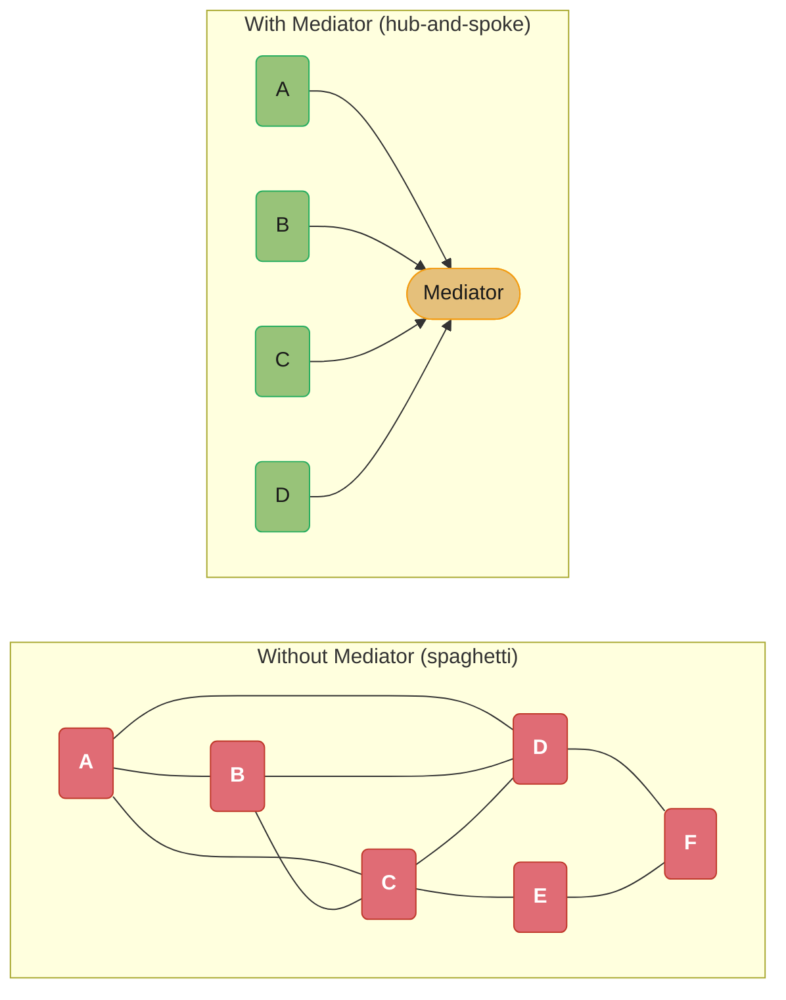
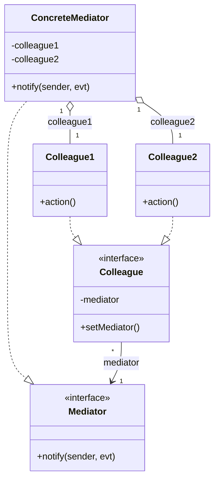
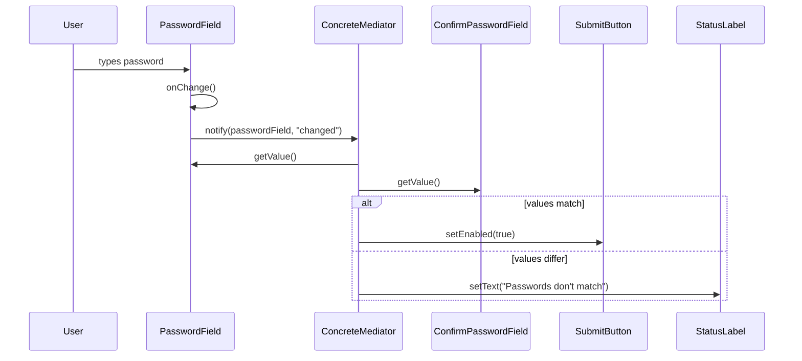
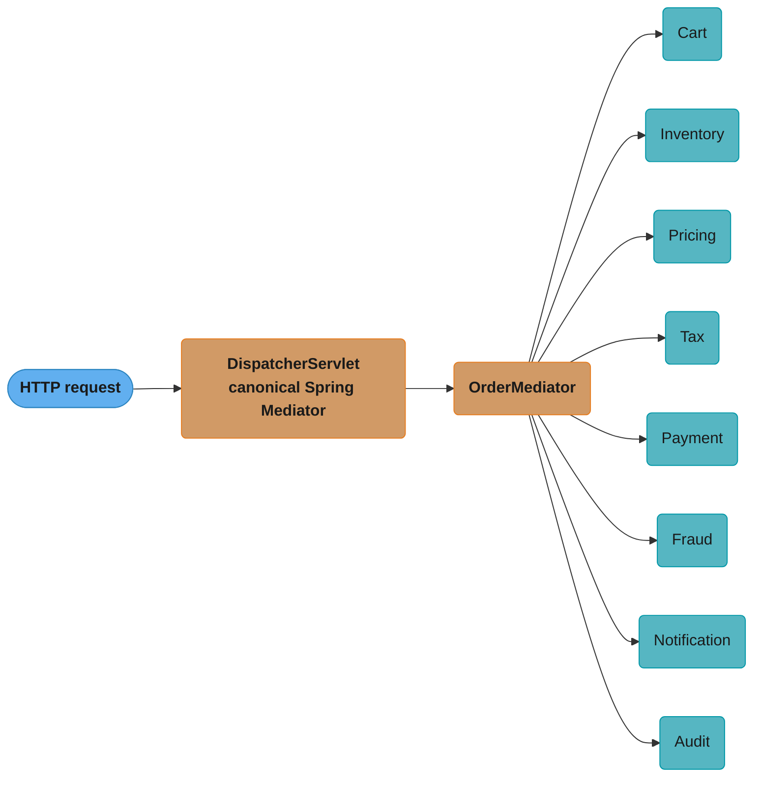
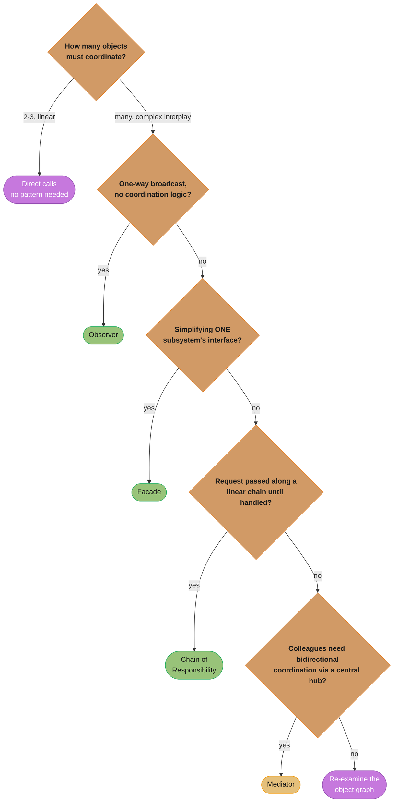

# Mediator Pattern

## 1. Pattern Name & Category

**Pattern:** Mediator
**Category:** Behavioral (Gang of Four)
**Also Known As:** Intermediary, Controller

---

## 2. Intent

Define an object that encapsulates how a set of objects interact, promoting loose coupling by keeping objects from referring to each other explicitly and allowing you to vary their interaction independently.

---

## Intuition

> **One-line analogy**: Mediator is like an air traffic control tower — instead of pilots talking directly to each other (chaos), all communication flows through the tower, which coordinates everyone safely.

**Mental model**: When N components need to communicate with each other, you get N² potential connections — each component knows about all others. A Mediator centralizes communication: components only know about the Mediator, not each other. When Component A wants to interact with B, it tells the Mediator; the Mediator decides what to tell B (and potentially C, D). This reduces N² connections to N connections.

**Why it matters**: Chat room systems (users send to room, room distributes to others), UI dialog boxes (changing one widget affects others through a DialogMediator), event buses (publish/subscribe with central hub) — all use Mediator semantics. MVC's Controller is a Mediator between Model and View.

**Key insight**: The tradeoff: Mediator reduces coupling between components but centralizes complexity in the Mediator itself — the Mediator becomes a god object if not designed carefully. Keep the Mediator focused on coordination logic only, not business logic.

---

## 3. Problem Statement

### The Problem
When many objects communicate directly with each other, the system becomes a tightly coupled mesh. Every object knows about many other objects. Adding a new object means updating all related objects. Changing one interaction means touching many classes. The communication logic is scattered across all participants — there is no single place to understand or modify the overall interaction protocol.

This is the "spaghetti of objects" problem — when your object graph looks like every node is connected to every other node (O(n²) relationships), the system becomes unmanageable.

### Scenario: Air Traffic Control
Without a mediator: each airplane would need to communicate directly with all other planes to avoid collisions, coordinate runways, and sequence landings. An aircraft would need to know the position, speed, and intentions of every other aircraft. Adding a new aircraft type means updating communication protocols in all existing aircraft.

With a mediator (Air Traffic Control tower): each plane only talks to the tower. The tower coordinates all planes. Planes are simple — they send requests and receive instructions. The tower holds all coordination logic. A new aircraft type just learns the tower protocol.

### Scenario: UI Form with Validation
A registration form has: username field, email field, password field, confirm-password field, submit button, and status label. Without a mediator, these components reference each other directly: the submit button knows about all fields and the label; the password field tells the confirm-password field to re-validate when it changes; the status label listens to all fields. This creates tight coupling between UI components.

With a mediator (FormMediator): each component only knows the mediator. "I changed" → mediator. The mediator decides: "Username changed? Check if submit should be enabled. Update status label." All coordination logic lives in one place.

---

## 4. Solution

Introduce a Mediator object that encapsulates all interaction protocols. Components (called "Colleagues") only communicate through the mediator — they never reference each other directly. When a colleague needs to notify others or request coordination, it calls the mediator. The mediator routes, transforms, and coordinates these notifications/requests.

This transforms an O(n²) interconnected graph into a hub-and-spoke topology where each colleague has only one relationship: with the mediator.

---

## 5. UML Structure

Left: without a mediator, colleagues form a dense mesh — every object can reach several others, so the interaction graph grows toward O(n²) edges. Right: every colleague has exactly one relationship — to the hub — collapsing that mesh to O(n) edges (the N²→N reduction from the Intuition section, made visible).



The class shape behind the hub: every `Colleague` implementation holds a reference to the `Mediator` interface and calls it on any state change; `ConcreteMediator` realizes `Mediator` and aggregates the concrete colleagues it coordinates, so colleagues never hold references to each other.



---

## 6. How It Works

1. **Mediator interface** defines `notify(Component sender, String event)` — a generic notification method.
2. **Concrete Mediator** knows about all colleagues; implements the interaction protocol.
3. **Colleague classes** hold a reference to the Mediator. When they perform an action or need to communicate, they call `mediator.notify(this, eventName)`.
4. **The Mediator** receives the notification, determines what happened and who sent it, then tells other colleagues what to do in response.
5. **No direct references** between colleagues — they only know the mediator.

**Event flow example (form validation):**



PasswordField never references ConfirmPasswordField, SubmitButton, or StatusLabel directly — every arrow above passes through the mediator, which is the whole point of the pattern.

---

## 7. Key Components

| Component | Role |
|-----------|------|
| **Mediator** | Interface defining `notify()` or `mediate()` — the coordination contract |
| **ConcreteMediator** | Implements coordination logic; knows all colleagues; routes notifications |
| **Colleague** | Interface/base class for objects that communicate through the mediator |
| **ConcreteColleague** | Performs its own function; notifies mediator on state change; receives instructions from mediator |

---

## 8. When to Use

- **Many-to-many communication** — when a set of objects communicate in complex ways, resulting in tight coupling.
- **Centralizing complex coordination** — when you want all interaction logic in one place for easy modification.
- **Reusable components** — when components should be reusable across contexts but their interactions differ per context.
- **UI component coordination** — form widgets that affect each other's state (enable/disable, show/hide, validate).
- **Chat/messaging systems** — users send messages to the room (mediator), which distributes to other users.
- **Event-driven systems** — a mediator (event bus) routes events between producers and consumers.
- **Workflow orchestration** — a workflow engine (mediator) coordinates the execution of workflow steps.
- **Air traffic control / scheduling** — central coordinator managing competing resource requests.

**Concrete examples:**
- Spring's `ApplicationEventPublisher` — event bus mediating between publishers and listeners.
- Java's `ExecutorService` — mediates between task submitters and worker threads.
- MVC's Controller — mediates between Model and View.
- `java.util.Timer` — mediates between timer tasks and the scheduling mechanism.

---

## 9. When NOT to Use

- **Simple object relationships** — if only 2-3 objects interact linearly, direct communication is cleaner.
- **When the mediator would become a God Object** — if all logic concentrates in the mediator, you've traded distributed coupling for a monolithic class.
- **When colleagues are already decoupled** — if objects interact via well-defined interfaces without direct knowledge, mediator adds overhead.
- **High-performance hot paths** — the mediator indirection adds overhead; avoid for tight loops.
- **When event sourcing/messaging is the real need** — if you need durable, persistent event routing, use a message broker, not an in-memory mediator.

---

## 10. Pros

- **Reduces coupling** — colleagues are only coupled to the mediator interface, not to each other.
- **Centralizes control** — all interaction logic lives in one class, making it easy to understand and modify.
- **Single Responsibility Principle** — colleagues do their job; the mediator handles coordination.
- **Reusability** — colleagues can be reused in different contexts with different mediators.
- **Simplifies object protocols** — replaces complex many-to-many communication with simple notify/respond.
- **Easier to extend** — adding a new colleague only requires updating the mediator, not all existing colleagues.
- **Supports loose coupling in UI** — UI components remain independent of each other.
- **Testability** — colleagues can be tested with a mock mediator; mediator can be tested with mock colleagues.

---

## 11. Cons

- **God Object risk** — the mediator can grow into a monolithic class that knows too much and does too much.
- **Single point of failure** — if the mediator has a bug, all interactions are affected.
- **Hard to extend the mediator** — as new colleagues are added, the mediator's `notify()` method grows with more cases.
- **Performance overhead** — every interaction goes through the mediator; indirect dispatch adds overhead.
- **Complexity shift** — coupling is reduced between colleagues but concentrated in the mediator.
- **Mediator can become hard to test** — if it coordinates many colleagues, unit testing it in isolation becomes complex.
- **Not always obvious** — the flow of control is less visible than direct calls; debugging requires understanding the mediator's routing logic.

---

## 12. Tradeoffs

| You Gain | You Lose |
|----------|----------|
| Loose coupling between colleagues | Potential mediator God Object |
| Centralized interaction protocol | Single point of failure |
| Reusable colleagues | Performance (extra indirection) |
| Easier modification of interactions | Mediator complexity grows with colleagues |
| Clear separation of concerns | Control flow is less obvious |

---

## 13. Common Pitfalls

1. **The Mediator God Object** — the mediator absorbs all logic, growing into a complex unmaintainable class. Counter this by splitting responsibilities across multiple focused mediators.

2. **Colleagues calling each other directly** — defeating the pattern. Enforce the rule: colleagues NEVER hold references to other colleagues.

3. **Overusing the pattern** — applying Mediator to simple two-object interactions adds unnecessary indirection.

4. **Circular notification loops** — colleague A notifies mediator → mediator updates colleague B → B notifies mediator → mediator updates A → infinite loop. Add a "is-notifying" guard or use event sourcing instead.

5. **Type-unsafe event strings** — using string literals for event names (`"changed"`, `"clicked"`) leads to typos and hard-to-refactor code. Use enums or typed event objects.

6. **Not distinguishing Mediator from Observer** — the Mediator coordinates mutual behavior between colleagues. Observer notifies subscribers reactively. They are different — don't conflate them.

7. **Tight coupling to concrete mediator** — colleagues should reference the `Mediator` interface, not `ConcreteMediator`. Otherwise, swapping mediators (for different contexts) requires changing colleagues.

8. **State leakage** — the mediator should not store colleague state. It coordinates; it doesn't own data. Keeping colleague state in the mediator defeats the purpose of having colleagues.

---

## 14. Real-World Usage

### Production Anchor: Checkout Mediator at 10k req/sec

A large e-commerce checkout flow involves 8 collaborating services: cart, inventory, pricing, tax, payment, fraud, notification, audit. Without a mediator, each service ends up calling 3–5 others — yielding ~20 cross-service edges, ~12k LOC of intertwined calls, and one new service requiring touch-ups in 6 existing classes. With an `OrderMediator`, every service only knows the mediator interface; new collaborators plug in via a single registration.

Observed numbers in a Tomcat cluster (200 worker threads, 10k req/sec sustained):
- p50 checkout latency: 38 ms (mediator overhead ~0.4 ms, mostly thread-safe dispatch).
- p99: 180 ms (dominated by payment gateway, not mediator).
- Adding a new fraud-check colleague: 1 class + 1 registration line, zero modifications to existing colleagues.
- Memory: mediator is stateless singleton (~2 KB); state lives in a sharded `ConcurrentHashMap<OrderId, OrderState>`.



Eight colleagues (Cart, Inventory, Pricing, Tax, Payment, Fraud, Notification, Audit) bind to `OrderMediator` with zero peer references — matching the p50 38 ms / mediator-overhead ~0.4 ms numbers above.

### Production-grade colleague + mediator

```java
public interface OrderMediator {
    void publish(OrderEvent event);                 // colleagues notify here
    <T> T request(OrderId id, Query<T> query);      // synchronous lookups
}

public abstract class Colleague {
    protected final OrderMediator mediator;
    protected Colleague(OrderMediator m) { this.mediator = m; }
    public abstract void onEvent(OrderEvent event);
}

public final class InventoryColleague extends Colleague {
    private final InventoryService inv;
    public InventoryColleague(OrderMediator m, InventoryService inv) {
        super(m); this.inv = inv;
    }
    @Override public void onEvent(OrderEvent e) {
        if (e instanceof CartPriced cp) {
            ReservationId rid = inv.reserve(cp.orderId(), cp.lines());
            mediator.publish(new InventoryReserved(cp.orderId(), rid));
        }
    }
}
```

```java
public final class DefaultOrderMediator implements OrderMediator {
    // Stateless dispatch table; thread-safe registration at boot.
    private final Map<Class<? extends OrderEvent>, List<Colleague>> subs =
            new ConcurrentHashMap<>();
    private final OrderStateStore store;            // state lives OUTSIDE mediator

    public void register(Class<? extends OrderEvent> type, Colleague c) {
        subs.computeIfAbsent(type, k -> new CopyOnWriteArrayList<>()).add(c);
    }
    @Override public void publish(OrderEvent e) {
        store.append(e);                            // event sourcing
        var list = subs.getOrDefault(e.getClass(), List.of());
        for (Colleague c : list) c.onEvent(e);      // O(k), k typically < 5
    }
    @Override public <T> T request(OrderId id, Query<T> q) {
        return q.run(store.snapshot(id));           // read-only projection
    }
}
```

### Famous Java/Spring usages
- `org.springframework.web.servlet.DispatcherServlet` — routes between `HandlerMapping`, `HandlerAdapter`, `ViewResolver`, `HandlerExceptionResolver`, `HttpMessageConverter`. None know about each other.
- `org.springframework.context.event.ApplicationEventMulticaster` — mediator behind `ApplicationEventPublisher.publishEvent()`.
- `javax.management.MBeanServer` — JMX mediator between MBeans and remote clients; agents register; clients query by `ObjectName`.
- `java.util.concurrent.Executor` / `ExecutorService` — mediates submitters and worker threads; submitters never touch worker state.
- `java.awt.EventQueue` — Swing AWT event mediator dispatching to components on the EDT.
- Classic GoF `ChatRoom` — users post to room, room delivers to recipients.

### Anti-pattern 1: God Mediator absorbing domain logic

```java
// BROKEN: mediator becomes a 2,000-line god class
public final class OrderMediator {
    public void onCheckout(CheckoutRequest r) {
        if (r.total().compareTo(BigDecimal.valueOf(10_000)) > 0) {     // pricing rule
            fraud.flag(r);
        }
        BigDecimal tax = r.region().equals("CA")                       // tax rule
                ? r.total().multiply(new BigDecimal("0.0725"))
                : BigDecimal.ZERO;
        // ... 1,800 more lines of business logic ...
    }
}
```

```java
// FIX: mediator only ROUTES; domain rules stay in services.
public final class OrderMediator {
    public void publish(OrderEvent e) {
        for (Colleague c : subs.get(e.getClass())) c.onEvent(e);
    }
}
// PricingService owns pricing rules. TaxService owns tax rules. Each emits events.
```

### Anti-pattern 2: Direct service-to-service bypass

```java
// BROKEN: PaymentService reaches across to InventoryService directly.
public final class PaymentService {
    private final InventoryService inventory;       // <-- forbidden peer reference
    public void charge(OrderId id) {
        chargeCard(id);
        inventory.reserve(id);                      // bypasses mediator; no audit, no fraud hook
    }
}
```

```java
// FIX: payment publishes an event; whoever cares (inventory, audit, fraud) subscribes.
public final class PaymentColleague extends Colleague {
    public void charge(OrderId id) {
        PaymentResult r = gateway.charge(id);
        mediator.publish(new PaymentSettled(id, r));   // single channel; pluggable subscribers
    }
}
```

### Anti-pattern 3: Mutable state inside the mediator (race condition)

```java
// BROKEN: shared mutable Map without synchronization. Under 10k req/sec,
// concurrent put()/get() on HashMap can produce infinite loops (pre-Java 8) or
// silently lost updates. Race condition on pendingOrders.containsKey() check.
public final class OrderMediator {
    private final Map<String, Order> pendingOrders = new HashMap<>();
    public void publish(OrderEvent e) {
        if (!pendingOrders.containsKey(e.orderId())) {
            pendingOrders.put(e.orderId(), new Order(e.orderId()));   // TOCTOU race
        }
    }
}
```

```java
// FIX: mediator is stateless; state lives in a thread-safe, externalised store.
public final class OrderMediator {
    private final OrderStateStore store;            // backed by sharded ConcurrentHashMap or Redis
    public void publish(OrderEvent e) {
        store.computeIfAbsent(e.orderId(), Order::new).apply(e);   // atomic per-key
        dispatch(e);
    }
}
```

### Migration story

**Move TO Mediator when**: cross-service calls have grown past ~O(n^2) edges (typically n >= 5 collaborators); onboarding a new service requires touching 3+ existing classes; you want event sourcing or audit hooks for every cross-service interaction. We migrated a checkout flow from direct calls to a mediator after cyclomatic complexity in `CheckoutService` exceeded 80 and a single new "loyalty points" colleague required edits in 7 files.

**Move AWAY FROM Mediator when**: only 2–3 colleagues remain (mediator becomes ceremony); the mediator has degenerated into a god class with domain logic; latency budget is sub-millisecond and dispatch overhead matters (rare — typical hashed dispatch is <1 µs). For a 2-service interaction, prefer a direct method call or a single `ApplicationEvent`.

---

## 15. Comparison with Similar Patterns

| Pattern | Key Difference |
|---------|---------------|
| **Observer** | Observer has a one-to-many notification relationship (publisher → subscribers). Mediator has many-to-many coordination (any colleague can trigger interactions). Mediator IS often implemented using Observer internally. |
| **Facade** | Facade provides a simplified interface to a complex subsystem (one-way simplification). Mediator coordinates BIDIRECTIONAL communication between equals. |
| **Chain of Responsibility** | CoR routes a request linearly through a chain. Mediator routes events between peers with arbitrary logic. |
| **Command** | Command encapsulates an operation. Mediator can use Commands to represent interactions, but they serve different purposes. |
| **Proxy** | Proxy controls access to one object. Mediator coordinates many objects communicating with each other. |

The same table as a decision path — walk it top to bottom to pick between Mediator and its closest lookalikes:



---

## 16. Interview Tips

**Common interview questions:**

**Q: What is the Mediator pattern?**
A: Mediator defines an object that centralizes how a set of objects communicate, preventing them from referring to each other directly. It turns a complex O(n²) coupling into a hub-and-spoke (O(n)) topology.

**Q: How does Mediator differ from Observer?**
A: Observer is one-to-many notification (publisher doesn't know about subscribers). Mediator is many-to-many coordination — any colleague can trigger reactions in any other colleague, and the mediator decides the routing. A Mediator is often implemented with Observer internally.

**Q: What is the risk of the Mediator pattern?**
A: The mediator becomes a God Object — it absorbs too much logic and becomes a single, complex, hard-to-maintain class. You trade distributed coupling for a centralized monolith.

**Q: Where is Mediator used in Spring?**
A: `DispatcherServlet` is a mediator routing HTTP requests to controllers. `ApplicationEventPublisher` is a mediator routing domain events to listeners. Both centralize coordination without components knowing each other.

**Q: What's the difference between Mediator and Facade?**
A: Facade simplifies access to a complex subsystem (one-directional, no coordination between subsystem components). Mediator enables bidirectional communication between peer objects that should not know each other.

**Q: You said Mediator is "often implemented using Observer internally" — what does that look like concretely?**
A: The Mediator interface exposes a coordination contract (`notify(sender, event)` or `publish(event)`), but its internal implementation is frequently a registry of subscribers keyed by event type — exactly the Observer pattern's subject/observer relationship. When `publish(event)` is called, the mediator looks up all colleagues registered for that event type and calls their `onEvent()` callback, which IS Observer's `update()`. The distinction is at the *design intent* level, not the wiring: Observer's contract is "subject doesn't know who's listening, just broadcasts"; Mediator's contract is "colleagues coordinate through a hub that may apply routing logic, transform events, or call back into specific colleagues based on the sender's identity." `DefaultOrderMediator` in this file's production example literally uses a `Map<Class<? extends OrderEvent>, List<Colleague>>` — an Observer-style dispatch table — but the surrounding class is still "the Mediator" because of its coordination role.

**Q: Walk through a chat room example end-to-end — what role does each class play?**
A: `ChatRoom` is the `ConcreteMediator`; `User` is the `Colleague`. Each `User` holds a reference to the `ChatRoom` (not to other users). When Alice sends a message, she calls `chatRoom.sendMessage(this, "hello")`; the `ChatRoom` looks up all *other* registered users and calls `user.receive(sender, message)` on each. Alice never has a reference to Bob or Carol — if Carol joins the room later, Alice's code is completely unaffected because she only ever talked to the mediator. This maps directly onto air traffic control: `Tower` is the mediator, `Aircraft` are colleagues, and `tower.requestLanding(aircraft)` lets the tower sequence multiple landing requests using information no single aircraft has (the full picture of all other aircraft).

**Q: How do you unit-test mediator logic in isolation from real participants?**
A: Test the `ConcreteMediator` by registering mock/stub `Colleague` implementations and asserting on the *routing decisions* — e.g., "when a `PaymentSettled` event is published, exactly the `InventoryColleague` and `AuditColleague` mocks receive `onEvent()`, and `FraudColleague` does not." Conversely, test each `Colleague` by injecting a mock `Mediator` and asserting it calls `mediator.publish(...)` with the expected event when its own method is invoked — the colleague test never needs a real mediator or real peers. This two-sided mocking is one of Mediator's biggest testability wins: without it, testing "does changing the password field disable the submit button" would require instantiating the entire form; with it, you test the `FormMediator`'s routing table once, and each field/button independently.

**Q: At what point does a Mediator become a "God Object," and how do you split it?**
A: The warning signs are: the mediator's `notify()`/`publish()` method has a large branching structure (switch/if-else over event types) that keeps growing as new colleague types are added, the mediator imports business-rule classes (pricing, tax, fraud logic) directly, or a single PR touching "add one new colleague" requires editing the mediator plus 3+ other files. The fix is to split by domain/event-family into multiple focused mediators (e.g., `CheckoutMediator`, `ShippingMediator`, `NotificationMediator`) each owning a smaller dispatch table, optionally composed under a top-level coordinator — or to replace the growing if-else with a registration-based dispatch table (`Map<EventType, List<Colleague>>`) so adding a colleague is a one-line `register()` call rather than a new branch. The litmus test from this file's production anchor: "adding a new fraud-check colleague should be 1 class + 1 registration line, zero modifications to existing colleagues" — if that's not true, the mediator has absorbed too much.

**Q: How exactly is Spring's `ApplicationEventPublisher` a Mediator, and what are its limits?**
A: A bean calls `applicationEventPublisher.publishEvent(new OrderPlacedEvent(orderId))`; Spring's `ApplicationEventMulticaster` (the concrete mediator) looks up all `@EventListener`-annotated methods registered for `OrderPlacedEvent` and invokes each — the publisher never references the listeners, and listeners never reference the publisher or each other, which is the hub-and-spoke topology this pattern provides. It's "lightweight" compared to a hand-rolled `OrderMediator` because Spring handles registration (component scanning + annotation processing) and dispatch (synchronous by default, or async with `@Async` on the listener) for you — you only write the event class and the listener methods. The limits: it's in-process only (doesn't cross JVM/service boundaries — for that you need a real message broker like Kafka or RabbitMQ), synchronous listeners run on the publisher's thread so a slow listener blocks the publisher unless `@Async` is used, and by default a thrown exception in one listener can abort subsequent listeners' invocation depending on the multicaster configuration — so it's best for in-process side effects (cache invalidation, audit logging) rather than critical business logic.

---

## Cross-Perspective: HLD Connections

**HLD View — Where Mediator Appears in Distributed Systems**

- **Message broker** — Kafka, RabbitMQ, and AWS SNS are Mediators at infrastructure scale. Producers and consumers never reference each other directly; all communication flows through the broker, which routes messages based on topics, routing keys, or subscriptions.
- **Event bus** — An internal event bus (Spring's `ApplicationEventPublisher`, Guava `EventBus`) mediates event dispatch within a service: publishers fire events; subscribers handle them without knowing about each other.
- **API gateway as mediator** — When the API gateway does request aggregation (fan-out to multiple services, collect responses, merge), it acts as a Mediator: the client talks to one endpoint; the gateway coordinates the multi-service conversation.
- **Service mesh control plane** — The Istio control plane (Istiod) is a Mediator: it pushes routing rules, policy, and certificates to all sidecar proxies without requiring sidecars to communicate directly with each other.

---

## 17. Best Practices

1. **Keep colleagues dumb** — colleagues should report events and respond to instructions; no coordination logic should live in colleagues.
2. **Use interfaces for the mediator** — colleagues should depend on `Mediator` interface, not `ConcreteMediator`.
3. **Use typed events, not string literals** — define an enum or event object hierarchy to avoid string typos.
4. **Split large mediators** — if the mediator handles too many event types, split into domain-specific mediators.
5. **Avoid circular notification** — guard against loops with an `isNotifying` flag or by designing event flows as a DAG.
6. **The mediator should not own colleague state** — it coordinates; colleagues own their own data.
7. **Consider Observer for simpler notification needs** — if the relationship is truly one-to-many with no coordination needed, Observer is lighter.
8. **Test colleagues with a mock mediator** — inject a stub mediator to verify that colleagues send the right events in the right circumstances.
9. **Log all mediator events in development** — since the mediator is the single point of coordination, logging there provides a complete trace of system interactions.
10. **Use event-driven architecture for distributed systems** — for distributed mediators, use a proper message broker (Kafka, RabbitMQ); the in-memory mediator pattern doesn't cross process boundaries.
