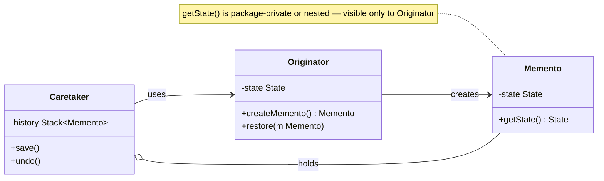
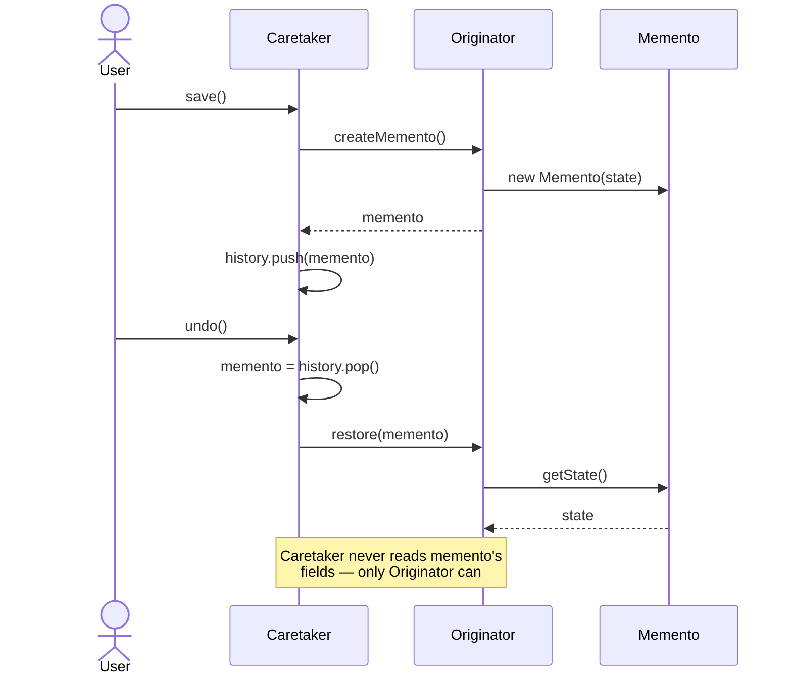
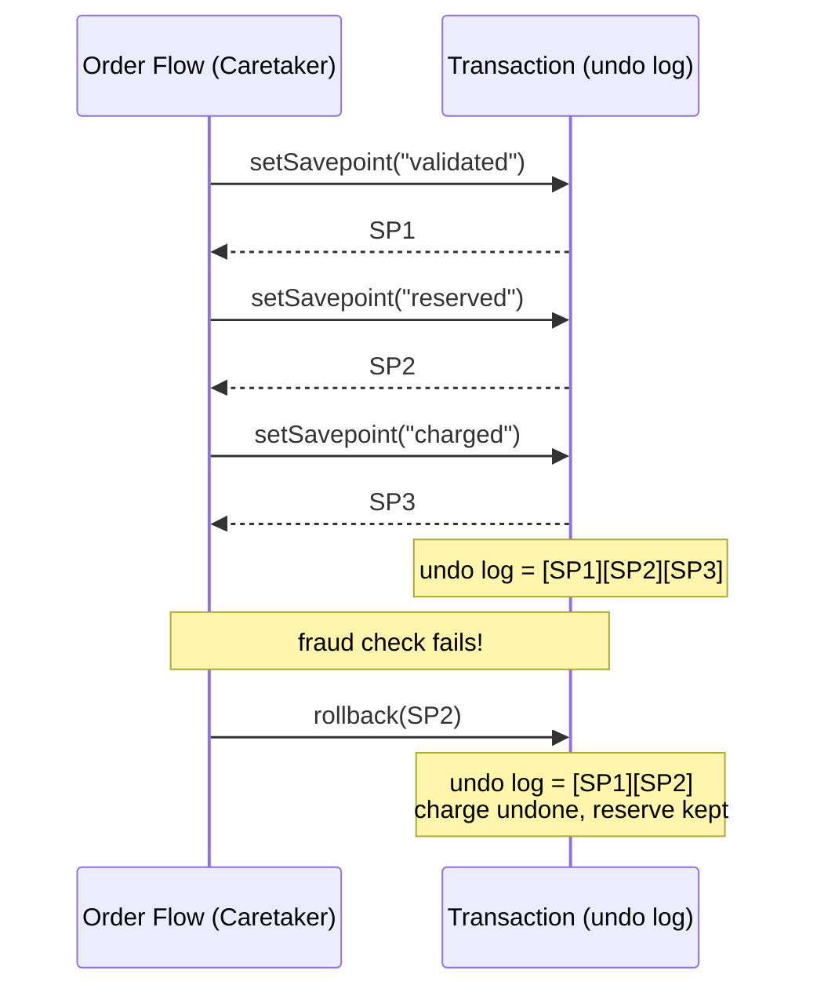

# Memento Pattern

## 1. Pattern Name & Category

**Pattern:** Memento
**Category:** Behavioral
**GoF Classification:** Behavioral Design Pattern (Gang of Four)
**Also Known As:** Token, Snapshot

---

## 2. Intent

Capture and externalize an object's internal state so it can be restored later, without violating encapsulation.

---

## Intuition

> **One-line analogy**: Memento is like a save file in a video game — you capture the game state at a checkpoint, and if things go wrong, you can restore back to that exact moment.

**Mental model**: You want to add undo to an object, but the undo mechanism shouldn't break the object's encapsulation (accessing private fields). Memento creates a snapshot of an object's state that the object itself can restore from. The Originator creates Mementos and restores from them; the Caretaker stores a stack of Mementos but can never read their contents (preserving encapsulation). Undo = pop from stack, call restore.

**Why it matters**: Text editors (Ctrl+Z), graphics applications (history panel), database transactions (savepoints and rollbacks), browser history (back button) — all implement Memento semantics. The pattern cleanly separates "what state to save" (Originator knows its own internals) from "when and how to save it" (Caretaker manages the history).

**Key insight**: Memento's cost is memory — storing N states means N copies of the full object state. Incremental snapshots (store only what changed) are a common optimization but add complexity. The pattern trades memory for the ability to undo arbitrary operations.

---

## 3. Problem Statement

### The Core Problem
You have an object with complex internal state. You need to take a "snapshot" of that state at some point in time and later restore the object back to that snapshot — but you cannot expose the internal state to outside classes, because doing so would break encapsulation and couple external code to implementation details.

### Concrete Scenario
Consider a **text editor**. Users type text, apply formatting, and may want to undo changes. Naively, you might expose the editor's internal state (cursor position, text buffer, formatting metadata) to an external undo manager. But now the undo manager knows everything about the editor's internals — any change to the editor's internal structure requires updating the undo manager too. You've tightly coupled two unrelated classes.

A second scenario: a **game** that needs save points. The game character has dozens of fields: health, inventory, position, level, active quests. You want to save the game state and restore it. Exposing all of those fields externally is messy and breaks the single-responsibility principle.

### What Goes Wrong Without the Pattern
- External classes directly access and store internal fields, breaking encapsulation.
- The "history" object is tightly coupled to the originator's internals.
- Changing the originator's internal structure forces updates everywhere the state is captured.
- No clean contract for what "a saved state" means.

---

## 4. Solution

The Memento pattern introduces three roles:

1. **Originator** — the object whose state needs to be saved. It creates a Memento containing a snapshot of its current state, and it can restore itself from a Memento. Only the Originator knows how to pack/unpack its own state.

2. **Memento** — a value object that stores the snapshot. It has no behavior. Its state is opaque to everyone except the Originator.

3. **Caretaker** — manages the history of Mementos. It holds a stack (or list) of Mementos and asks the Originator to save/restore, but it never inspects the content of a Memento.

This separation preserves encapsulation: the Caretaker holds Mementos but cannot read them; only the Originator can interpret them.

---

## 5. UML Structure



**Key structural insight:** The Memento's state accessor (`getState()`) should only be visible to the Originator. In Java this is typically achieved by making Memento an inner class of Originator, or by using package-private access.

---

## 6. How It Works — Step-by-Step

1. **User triggers a save action** — the Caretaker calls `originator.createMemento()`.
2. **Originator packages its state** — the Originator copies its current internal state into a new Memento object and returns it.
3. **Caretaker stores the Memento** — the Caretaker pushes the Memento onto a stack. It does not look inside.
4. **User triggers undo** — the Caretaker pops the top Memento off the stack and calls `originator.restore(memento)`.
5. **Originator restores state** — the Originator reads the state from the Memento and replaces its own state with it.
6. **Encapsulation preserved** — at no point does the Caretaker access the raw fields of the Originator.

The sequence below traces one save-then-undo cycle end-to-end: notice the Caretaker (steps 1, 3, 4) only ever pushes/pops an opaque `memento` reference, while `getState()` (step 5) is called exclusively by the Originator.



---

## 7. Key Components

| Role | Responsibility |
|---|---|
| **Originator** | Creates Mementos from its own state; restores state from a Memento |
| **Memento** | Stores the snapshot; opaque to everyone except the Originator |
| **Caretaker** | Manages the history of Mementos; never reads Memento internals |

### Optional Variants
- **Wide vs. Narrow Interface:** Originator uses the "wide" interface (reads/writes state); Caretaker uses the "narrow" interface (just holds a reference).
- **Incremental Mementos:** Instead of storing the full state, store only the diff/delta from the previous state.
- **Serialized Mementos:** Serialize the state to JSON/bytes for persistence across sessions.

---

## 8. When to Use

- **Undo/Redo functionality** — text editors, drawing tools, IDEs (most common use case).
- **Transaction rollback** — database-like objects that need to revert to a prior state on failure.
- **Game save points** — capture full game state so the player can resume from a checkpoint.
- **Wizard-style forms** — allow users to go "back" in a multi-step form, restoring previous field values.
- **State machine snapshots** — capture a complex state machine's current configuration for debugging or replay.
- **Optimistic concurrency** — save the state before an operation, restore on conflict.
- **Configuration experiments** — allow users to try a configuration change and roll it back if they don't like it.

---

## 9. When NOT to Use

- **When state is trivially small** — if the Originator has only 1-2 fields, a simple copy constructor or cloning approach is cleaner.
- **When state changes are very frequent** — creating a Memento on every keystroke and storing all of them is wasteful. Use delta/diff storage instead.
- **When the Originator's state references mutable shared objects** — shallow copies of references will corrupt the saved state when those objects change later. Deep-copy semantics are required, which can be expensive.
- **When encapsulation doesn't matter** — if the Originator's state is already public (a plain data class/record), a simple clone is sufficient.
- **When you need a distributed snapshot** — Memento is a single-object pattern; it does not coordinate state across multiple objects. Consider the Saga pattern instead.

---

## 10. Pros

- **Preserves encapsulation** — The Originator's internal state is never exposed to external classes.
- **Simplifies the Originator** — The Originator doesn't need to manage its own history; that responsibility is cleanly delegated to the Caretaker.
- **Clean undo/redo contract** — Provides a well-defined mechanism for history management.
- **Separation of concerns** — State management (Originator), state storage (Memento), and history management (Caretaker) are fully separated.
- **Restorable to any point** — With a stack or list of Mementos, you can restore to any previous state, not just the last one.
- **Testable** — Each component (Originator, Caretaker) can be tested independently.
- **Supports branching history** — With a tree of Mementos, you can implement branching undo trees (like in Vim or Emacs).

---

## 11. Cons

- **Memory overhead** — Storing a full snapshot per save point can be expensive if state is large or snapshots are frequent.
- **Serialization complexity** — If state contains object references, deep copying is required to avoid aliasing bugs.
- **No structural sharing** — Two Mementos for similar states store everything redundantly (no copy-on-write by default).
- **Caretaker lifecycle responsibility** — The Caretaker must manage Memento lifetimes carefully; old Mementos must be discarded to avoid memory leaks.
- **Hidden complexity** — Developers unfamiliar with the pattern may be confused by the "opaque token" idiom.
- **Not thread-safe by default** — Creating a Memento while another thread modifies the Originator requires synchronization.

---

## 12. Tradeoffs

| You Gain | You Lose |
|---|---|
| Encapsulation of internal state | Memory for storing snapshots |
| Clean undo/redo mechanism | Complexity of deep-copy logic |
| Separation of history management | Performance on high-frequency saves |
| Testable, loosely coupled design | Risk of memory leaks from stale Mementos |

---

## 13. Common Pitfalls

1. **Shallow copy trap** — Creating a Memento by copying field references rather than deep-copying mutable objects. If the Originator later mutates those objects, the Memento's "snapshot" changes retroactively.

2. **Memento bloat** — Storing unlimited Mementos without a cap. Always implement a maximum history size (e.g., 50 undo steps) or use a circular buffer.

3. **Breaking encapsulation via reflection** — Making the Memento's state accessible to the Caretaker defeats the entire purpose. Use inner classes or package-private access to enforce the narrow interface.

4. **Mutable Mementos** — A Memento should be immutable after creation. Providing setters on a Memento allows the state to be corrupted.

5. **Forgetting to handle null** — The first call to undo when history is empty must be handled gracefully.

6. **Coupling Memento to Originator version** — If the Originator's internal structure changes (e.g., a field is renamed), old persisted Mementos become unrestorable. This is a versioning problem for serialized Mementos.

---

## 14. Real-World Usage

### Production Anchor: JDBC Savepoints in a multi-step order workflow

The canonical Java Memento in production is JDBC `Connection.setSavepoint()` / `Connection.rollback(Savepoint)`. A multi-step order workflow — validate, reserve inventory, charge payment, create shipment — wraps each step in a savepoint so a failure rolls back only that step, not the entire transaction. The database is the Caretaker; the `Savepoint` handle is the Memento; the transaction's internal undo log is the snapshot.

Illustrative numbers for an order-processing service at 10k attempted orders/day (order-of-magnitude, not a published benchmark):
- Savepoint creation: ~0.2 ms — `setSavepoint()` issues a `SAVEPOINT` statement, so it does cost a round-trip.
- `rollback(Savepoint)` p99: **< 5 ms** for steps touching < 100 rows.
- Full transaction rollback discards the whole write set, so the ~80 ms p99 is the cost of REDOING the earlier steps on retry, not of the rollback itself.
- Without savepoints, a fraud-flag step at the tail forced full rollback + restart, doubling order latency from 220 ms to 510 ms.
- Savepoint-per-step sharply reduced retry storms during a payment-gateway flap, because a failed tail step no longer forced the whole workflow to restart.



*Each `setSavepoint()` call is a Memento checkpoint on the Transaction's undo log; `rollback(SP2)` restores to the "reserved" point, discarding only the failed "charged" step while keeping "reserve inventory" intact.*

### Production-grade Memento (inner-class, encapsulated state)

```java
public final class Order {
    private OrderStatus status;
    private final List<LineItem> items;
    private Money charged;

    public Order() {
        this.status = OrderStatus.DRAFT;
        this.items = new ArrayList<>();
        this.charged = Money.ZERO;
    }

    // Memento as a static inner class — only Order can read its fields.
    public static final class Snapshot {
        private final OrderStatus status;
        private final List<LineItem> items;       // immutable copy of the LIST
        private final Money charged;
        private Snapshot(Order o) {
            this.status  = o.status;
            // List.copyOf is a SHALLOW copy: the list can no longer be structurally
            // changed, but the LineItem elements are shared. That is safe here only
            // because LineItem is immutable; if it were not, copy each element too.
            this.items   = List.copyOf(o.items);
            this.charged = o.charged;             // Money is itself immutable
        }
    }

    public Snapshot snapshot()             { return new Snapshot(this); }
    public void restore(Snapshot s) {
        this.status  = s.status;
        this.items.clear();
        this.items.addAll(s.items);
        this.charged = s.charged;
    }
}
```

```java
public final class OrderWorkflow {
    public void run(Order order, Connection conn) throws SQLException {
        conn.setAutoCommit(false);
        Order.Snapshot domainBefore = order.snapshot();   // in-memory memento, pre-workflow
        try {
            validate(order);
            inventory.reserve(order, conn);
            // Both mementos are taken AFTER the reservation, so rolling back to them
            // undoes the charge and KEEPS the reservation. Taking the savepoint before
            // inventory.reserve() would silently discard the reservation too.
            Savepoint reserved = conn.setSavepoint("RESERVED");   // JDBC memento
            Order.Snapshot afterReserve = order.snapshot();       // in-memory memento
            payment.charge(order, conn);
            if (fraud.flagged(order)) {
                conn.rollback(reserved);       // DB: undo the charge only
                order.restore(afterReserve);   // memory: undo the charge only
                conn.commit();                 // the reservation survives in both layers
                throw new FraudException();    // unchecked -- must NOT hit the catch below,
            }                                  // or conn.rollback() would discard it again
            conn.commit();
        } catch (SQLException e) {
            conn.rollback();                   // infrastructure failure -> abort everything
            order.restore(domainBefore);
            throw e;
        }
    }
}
```

### Famous Java/library usages
- `java.sql.Connection.setSavepoint()` / `rollback(Savepoint)` / `releaseSavepoint(Savepoint)` — JDBC savepoint = Memento.
- `javax.swing.undo.UndoManager` + `UndoableEdit` — Swing undo stack.
- `java.io.BufferedReader.mark(int)` / `reset()` and `java.io.BufferedInputStream.mark(int)` / `reset()` — stream position snapshot for backtracking parsers (`markSupported()` reports whether a given stream offers it).
- `java.nio.ByteBuffer.mark()` / `reset()` — buffer position snapshot.
- `java.util.regex.Matcher` resettable state.
- Git commits — each commit object is a Memento of the full working-tree state; the commit DAG is the Caretaker.
- IntelliJ local history — every save creates a Memento; the IDE is the Caretaker.
- Android `Activity.onSaveInstanceState(Bundle)` — Bundle is the Memento.
- Hibernate session-level dirty checking — original entity snapshot acts as a Memento for diff generation.

### Anti-pattern 1: Shallow copy of mutable state

```java
// BROKEN: snapshot keeps a live reference to the same ArrayList instance.
// Subsequent mutations to order.items also mutate the snapshot. Rollback
// restores nothing — both states point at the SAME list.
public static final class Snapshot {
    private final List<LineItem> items;
    private Snapshot(Order o) { this.items = o.items; }   // <-- alias, not copy
}
```

```java
// FIX: copy the list at snapshot time. List.copyOf gives an immutable copy of the
// LIST (new ArrayList<>(o.items) if you need it mutable) -- both are SHALLOW, so
// they only fix aliasing when the elements themselves are immutable. If LineItem
// is mutable, copy each element: o.items.stream().map(LineItem::copy).toList().
private Snapshot(Order o) { this.items = List.copyOf(o.items); }
```

### Anti-pattern 2: Unbounded memento list -> OOM

```java
// BROKEN: every keystroke pushes a memento; a long editing session in an
// IDE-like app accumulates 200k mementos averaging 8 KB each -> 1.6 GB heap.
// We saw OOMKill at 4-hour mark during user-acceptance testing.
public final class History {
    private final List<Snapshot> stack = new ArrayList<>();
    public void push(Snapshot s) { stack.add(s); }
}
```

```java
// FIX: cap with a ring buffer; optionally compress old snapshots.
public final class History {
    private final Deque<Snapshot> stack = new ArrayDeque<>();
    private final int max;
    public History(int max) { this.max = max; }       // e.g. 100
    public void push(Snapshot s) {
        if (stack.size() == max) stack.removeFirst(); // drop oldest
        stack.addLast(s);
    }
}
// For longer history, store deltas instead of full snapshots beyond N.
```

### Anti-pattern 3: Memento exposing public state

```java
// BROKEN: any caller can mutate or read internals; encapsulation gone.
// Worse: undo no longer represents the historical state if a caller edits it.
public final class Memento {
    public OrderStatus status;                       // public mutable
    public List<LineItem> items;
}
```

```java
// FIX: Memento is a private/package-private inner class of the Originator.
// Only Originator can construct or read fields; outsiders hold an opaque token.
public final class Order {
    public static final class Snapshot {             // opaque to outsiders
        private final OrderStatus status;            // private fields
        private final List<LineItem> items;
        private Snapshot(Order o) { /* ... */ }
    }
    public Snapshot snapshot()         { return new Snapshot(this); }
    public void restore(Snapshot s)    { /* only Order touches s.* */ }
}
```

### Migration story

**Move TO Memento when**: you need undo/redo, transactional rollback at a granularity finer than the database transaction, or checkpoint/restore for long-running computations; state is small enough that snapshots are cheap (< 1 MB); the originator can be cleanly snapshotted without external side effects. We adopted savepoints + in-memory mementos after a fraud-check step at the tail of a 4-step workflow was forcing full-transaction rollback and doubling p99 latency.

**Move AWAY FROM Memento when**: snapshots become so large they dominate heap (consider Command-based undo instead — store the inverse operation, not the whole state); the originator has external side effects that snapshots cannot capture (file I/O, network); you only ever need to rollback the most recent operation (a single field-level backup is simpler). For event-sourced systems, the event log subsumes Memento entirely — replay rather than snapshot.

---

## 15. Comparison with Similar Patterns

| Pattern | Similarity | Key Difference |
|---|---|---|
| **Command** | Both support undo | Command stores the *operation* (and knows how to reverse it); Memento stores the *full state snapshot*. Use Command for fine-grained undo, Memento for coarse-grained state restore. |
| **Prototype** | Both involve copying state | Prototype clones an object for *creation* purposes; Memento clones state for *rollback* purposes. Memento adds the Caretaker role. |
| **Serialization** | Both capture state | Serialization is persistence-focused (disk/network); Memento is typically in-memory and focused on rollback. |
| **State** | Both involve "state" | The State pattern manages *behavioral state transitions*; Memento manages *data state snapshots* for rollback. |

---

## 16. Interview Questions with Answers

**Q: Explain the Memento pattern.**
**Short:** Memento captures and externalizes an object's state for rollback without breaking its encapsulation.
A: Lead with the intent — capturing and externalizing state for rollback without breaking encapsulation. Describe the three roles (Originator, Memento, Caretaker), explain the wide vs. narrow interface insight, and give a concrete example (text editor undo).

**Q: How does Memento preserve encapsulation?**
**Short:** The Memento stores state only the Originator can pack or unpack, often as a private inner class of it.
A: The Memento stores state that only the Originator knows how to pack/unpack. The Caretaker holds Mementos as opaque tokens. In Java, making Memento an inner class of Originator is the cleanest way to enforce this — the inner class can access private fields of the outer class, but no other class can instantiate it.

**Q: What's the difference between Memento and Command for undo?**
**Short:** Command-based undo stores the reverse operation, while Memento-based undo stores a full state snapshot.
A: Command-based undo stores the reverse operation (e.g., "delete this character" undoes "insert this character"). It's memory-efficient but requires implementing an inverse for every command. Memento-based undo stores a full state snapshot — simpler to implement but uses more memory. In practice, most editors use Command for undo since it's more granular.

**Q: What are the memory implications?**
**Short:** Each Memento stores a full state copy, which grows costly for large objects or frequent saves without mitigation.
A: Each Memento stores a full copy of state. For large objects or frequent saves, this is costly. Solutions: limit history depth, use incremental/delta Mementos, or use structural sharing (persistent data structures).

**Q: Where have you seen this pattern in the Java SDK?**
**Short:** javax.swing.undo.UndoManager and Android's onSaveInstanceState both implement the Memento pattern.
A: `javax.swing.undo.UndoManager`, Android's `onSaveInstanceState`, and conceptually in Java serialization.

**Q: How do you control the memory cost of frequent snapshots on large objects?**
**Short:** Cap history with a ring buffer, use periodic full snapshots plus deltas, or share structure via immutable data structures.
A: The naive approach — a full deep copy on every save point — scales linearly with both object size and snapshot frequency, which is exactly the "every keystroke pushes a memento" anti-pattern that caused a 1.6 GB heap and an OOMKill in this file's anti-pattern #2. Three mitigations, in order of increasing complexity: (1) cap history depth with a ring buffer (`Deque` with a fixed max size, evicting the oldest snapshot), (2) store full snapshots only periodically (every Nth change) and *incremental diffs* (deltas) for changes in between — reconstructing an intermediate state means applying the diffs since the last full snapshot, and (3) use persistent/immutable data structures with structural sharing (e.g., an immutable tree where unchanged subtrees are shared by reference between snapshots), so two similar snapshots cost only the size of their differences. The practical guidance: start with a capped ring buffer (it solves 80% of real cases with 5% of the complexity); only build delta-based snapshots if profiling shows full-snapshot memory is actually a problem.

**Q: How does the Originator expose its state to the Memento without breaking encapsulation? Show the Java idiom.**
**Short:** A private static Snapshot class nested inside the Originator can read its private fields, while outside code cannot.
A: The canonical Java idiom is a `private static final class Snapshot` (or `Memento`) nested inside the Originator class. Because a nested class has access to its enclosing class's private members, `Snapshot`'s private constructor can read `Order`'s private fields (`status`, `items`, `charged`) directly when building the snapshot, and `Order.restore(Snapshot s)` can read `s`'s private fields directly to write them back — but no class *outside* `Order` can construct a `Snapshot`, read its fields, or do anything with it except hold the reference and pass it back to `restore()`. This gives the Caretaker a token it can store in a stack/list (it needs the *type* `Order.Snapshot` to declare the variable) without any ability to inspect or tamper with its contents — encapsulation is enforced by Java's access-modifier rules, not by convention.

**Q: How does Memento relate to database transaction rollback / savepoints?**
**Short:** A JDBC Savepoint is literally a database-layer Memento, letting rollback restore a point finer than the whole transaction.
A: A JDBC `Savepoint` (from `Connection.setSavepoint()`) is literally a Memento at the database layer: the `Connection` (Originator) creates an opaque `Savepoint` token, the calling code (Caretaker) holds onto it without inspecting it, and `connection.rollback(savepoint)` restores the transaction's state to that point without undoing everything before it. This file's production anchor shows the pattern combined at two layers — JDBC savepoints for the database's undo log, and an in-memory `Order.Snapshot` for the application object's state — rolled back together so a failed fraud check undoes only the "charge" step while keeping "reserve inventory" intact. The broader principle: whenever you need rollback granularity *finer* than "abort the entire transaction," you're looking for a Memento-shaped solution, whether that's a DB savepoint, an in-memory snapshot, or both in coordination.

**Q: What are the tradeoffs of a serialization-based Memento (Java serialization or JSON)?**
**Short:** Serialized Mementos survive restarts and travel over a network, but risk breaking on schema changes without versioning.
A: Serializing the Originator's state to bytes or JSON gives you a Memento that can survive process restarts, be sent over a network, or be stored in a database/file — useful for game saves, document auto-recovery, or `Activity.onSaveInstanceState(Bundle)` on Android. The cost is versioning: if the Originator's internal structure changes (a field renamed or removed), old serialized Mementos may fail to deserialize or silently populate fields with defaults — this is the same "schema evolution" problem that any persisted format faces, and Java's default serialization is especially brittle here (a missing `serialVersionUID` or a renamed field breaks deserialization). For long-lived persisted Mementos, prefer a versioned format (JSON/Protobuf with explicit schema versioning and migration logic) over raw Java `Serializable`, and write a test that deserializes a Memento captured by an *older* version of the class to catch breakage early.

**Q: What is the "wide vs. narrow interface" distinction in Memento, and why does it matter?**
**Short:** The Originator sees a wide interface into the Memento's fields, while the Caretaker sees only a narrow, opaque token.
A: The Originator sees the Memento through a "wide" interface — it can read and write every field needed to fully capture and restore state, because it created the Memento and knows its internal layout. The Caretaker sees the same object through a "narrow" interface — typically just an opaque marker type (or `Object`) that it can store in a list/stack and hand back, with no accessors exposed. In Java, this distinction is enforced structurally rather than by two separate interfaces: a `private static final class Snapshot` nested in the Originator has a "wide" view from the Originator's perspective (private field access) and a "narrow" view from everyone else's (the type is usable as a reference but its fields are inaccessible). The practical reason this matters: if you instead gave the Caretaker a Memento type with public getters "for convenience," any future refactor of the Originator's internals would ripple out to the Caretaker and any other code that reads those getters — the narrow interface is what makes the Originator's internals truly private and independently refactorable.

**Q: What is the most common bug in a hand-written Memento?**
**Short:** Storing references instead of copies, so the snapshot mutates along with the live object and restore appears to do nothing.
A: Storing references to mutable state rather than copies of it. A memento that keeps the originator's own `List` or `Date` field shares that object, so every later mutation of the live originator is visible through the snapshot, and restoring afterwards puts back exactly the state you were trying to escape — the symptom is an undo button that visibly does nothing. The fix is a defensive copy at capture time (`List.copyOf`, a copy constructor, or a deep clone for nested mutable graphs) and again at restore time, so a second restore from the same memento is not corrupted by edits made after the first. Prefer making the captured fields immutable types outright, which makes the whole question disappear; note that `Object.clone()` does not help here, since it is a shallow copy and copies the same references.

**Q: How do you take a consistent snapshot while another thread is mutating the Originator?**
**Short:** Capture under the same lock that guards mutation, or make the state immutable, otherwise the memento is a torn mix of two versions.
A: Take the snapshot under the same lock that guards every mutation, so no writer can interleave between copying field one and field two — otherwise you get a torn memento holding the new balance and the old transaction list, a state the object was never actually in. Copying field by field without that lock is the classic race, and it is invisible in single-threaded tests. The lock-free alternative is to make the originator's state a single immutable value object swapped atomically through an `AtomicReference`, in which case a snapshot is one volatile read of a consistent value and costs nothing. If the state is too large to copy under a lock without hurting latency, use a persistent (structurally shared) data structure so the copy is O(1), rather than shortening the critical section and accepting torn snapshots.

**Q: What happens to open files, sockets, or listeners when you restore from a Memento?**
**Short:** They are not restored, since a memento holds data and not live resources, so the originator must re-acquire them after a restore.
A: They are not restored, because a memento can only carry data — a file handle, socket, database connection, or registered listener is a live operating-system or framework resource whose identity cannot be recreated from a snapshot. Restoring naively either leaves a dangling reference to a closed handle or, worse, silently reuses an object that other code has since torn down. The workable design is to exclude resources from the captured state entirely, store the information needed to reacquire them (a file path and offset rather than the stream, a connection URL rather than the `Connection`), and give the originator an explicit reattach step that runs after `restore()` sets the data fields. The same rule explains why Android's `onSaveInstanceState` takes a `Bundle` of primitives and parcelables and not arbitrary objects.

**Q: Why not just clone the whole Originator instead of writing a Memento?**
**Short:** Clone returns another fully functional Originator with a wide public interface, whereas a Memento is an opaque token nobody can drive.
A: Because a clone is another live originator: it has the full public API, so any caretaker holding it can call business methods on it, keep it running, or hand it out as if it were the real object, and nothing marks it as "a past state". A memento deliberately exposes no behaviour — the caretaker sees a narrow, opaque type it can only store and hand back — which is what preserves encapsulation and makes the history immutable. There are also mechanical reasons: `Object.clone()` is shallow and awkward with `final` fields, and cloning captures the entire object including resources and identity you do not want duplicated, whereas a memento captures only the fields that define restorable state. Use Prototype when you genuinely want a second working object, and Memento when you want a record of a past one.

**Q: When should you use event sourcing instead of storing Mementos?**
**Short:** Use event sourcing when the sequence of changes is itself valuable; use Mementos when only the ability to return to a past state matters.
A: Use event sourcing when the history of what happened is a business asset — audit, analytics, replaying a bug, deriving new read models retroactively — because an append-only log of events records intent, while a memento records only the outcome and throws away how you got there. Mementos win on read cost, since restoring is one copy rather than a replay of thousands of events, and on simplicity, since there is no projection or schema-evolution machinery. Mature systems use both: the event log is the system of record, and periodic snapshots, which are precisely mementos, bound replay cost so rebuilding an aggregate reads one snapshot plus the events since. Decide by asking whether anyone will ever ask "why is it in this state" — if yes, log the events and use mementos as the snapshot optimisation.

---

## Cross-Perspective: HLD Connections

**HLD View — Where Memento Appears in Distributed Systems**

- **Raft log snapshots** — Raft consensus periodically takes a Memento of the state machine (snapshot of all applied log entries) to prevent log growth. On restart or node join, the snapshot restores state without replaying the full log.
- **Database WAL checkpoints** — Write-ahead logging checkpoints are Mementos: a snapshot of the committed database state at a point in time. Recovery replays WAL entries from the last checkpoint forward, not from the beginning.
- **Saga compensating transactions** — Each saga step stores a Memento of pre-step state. On failure, the Memento enables compensation (rollback) without needing to know the internal implementation of the failed service.
- **Workflow state persistence** — Long-running workflows (Temporal, Step Functions) persist execution state as Mementos between steps. This enables pause-and-resume, crash recovery, and human-in-the-loop approval workflows across days or weeks.

---

## 17. Best Practices

1. **Make Memento immutable** — set all state in the constructor, provide only getters (ideally package-private), no setters.

2. **Use inner class to enforce narrow interface** — declaring Memento as a private static inner class of Originator ensures only the Originator can read its state.

3. **Cap history depth** — use a `Deque` with a max size in the Caretaker to prevent unbounded memory growth.

4. **Deep copy all mutable references** — Collections, arrays, and other mutable objects must be deep-copied, not reference-copied.

5. **Serialize to a versioned format for persistence** — if Mementos need to survive process restarts (game saves, document recovery), write them as JSON or Protobuf with an explicit schema version and a migration path. Reach for raw Java `Serializable` only for a short-lived in-JVM handoff: a renamed field or a missing `serialVersionUID` breaks deserialization of every Memento captured by an older build.

6. **Name Mementos descriptively** — if supporting labeled snapshots ("before bulk edit", "version 2.0"), add a timestamp or label to the Memento.

7. **Log Memento creation in debug mode** — helps diagnose memory issues and understand save frequency.

8. **Test with undo-redo cycles** — ensure that save → modify → restore → modify → restore works correctly, especially with shared references.

---

## 18. Technologies and Tools

| Technology | What it gives you | When to reach for it |
|-----------|-------------------|---------------------|
| Java records (16+) | An immutable snapshot type in one line, with a generated `equals`, `hashCode`, and canonical constructor | The memento itself — a record is exactly a frozen state carrier |
| `javax.swing.undo.UndoManager` + `UndoableEdit` | A complete caretaker: bounded undo/redo stack, significance flags, and edit coalescing | Desktop editors; do not write the stack yourself |
| Apache Commons Lang 3 `SerializationUtils.clone` | Deep copy of a `Serializable` graph in one call | Quick deep snapshots where the object graph is already serializable and performance is not critical |
| Jackson `ObjectMapper` | Snapshot as JSON (`writeValueAsBytes` / `readValue`), which is both a deep copy and a persistable, diffable artifact | Snapshots that must be stored, logged, or shipped over the wire |
| Kryo (`Kryo.copy`) | Fast binary deep copy without requiring `Serializable` | Hot paths where the reflective/JSON round trip is too slow |
| Vavr or Eclipse Collections persistent collections | Structural sharing — a "copy" reuses the unchanged subtree instead of duplicating it | Large states snapshotted often; turns O(n) copies into O(log n) |
| Axon Framework / EventStoreDB | Event sourcing, where the event log is the history and snapshots are the optimization that bounds replay cost | State history is a product requirement, not just an undo button |
| `java.util.concurrent.atomic.AtomicReference` | Atomic swap of an immutable state object, so a restore is one CAS | Concurrent originators — restore without locking |

Memory is the whole tradeoff. A naive memento stack holds one full copy per edit, so a 2 MB document with a 100-step history is 200 MB of retained heap. The two standard fixes are a **bounded stack** (`UndoManager.setLimit`) and **delta mementos** — store the change plus its inverse, and keep a full snapshot only every N steps, which is precisely what event-sourced systems do.
