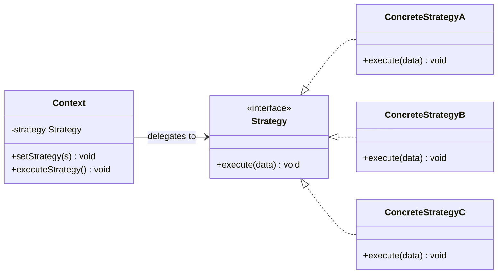
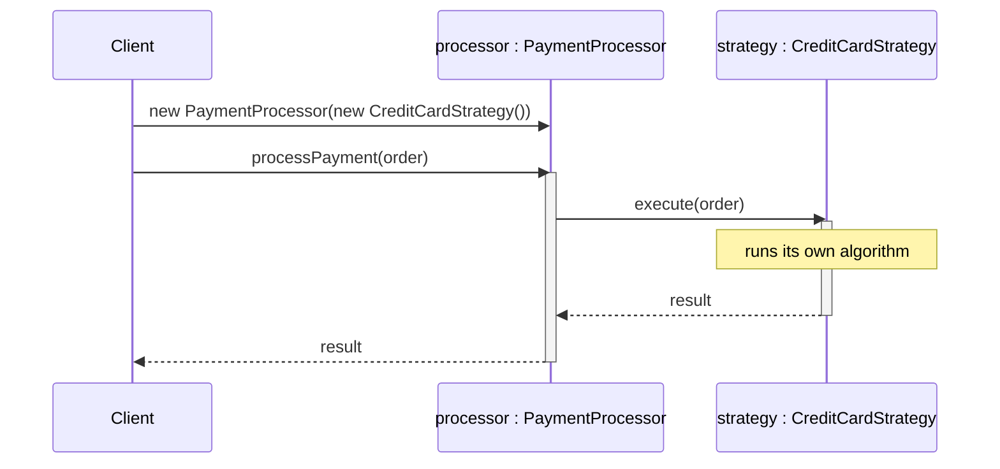
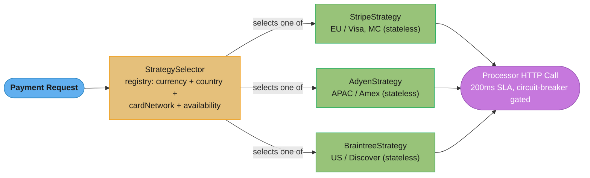

# Strategy Pattern

## 1. Pattern Name & Category

**Pattern:** Strategy
**Category:** Behavioral
**GoF Classification:** Behavioral Design Pattern (Gang of Four)
**Also Known As:** Policy Pattern

---

## 2. Intent

Define a family of algorithms, encapsulate each one, and make them interchangeable. Strategy lets the algorithm vary independently from the clients that use it.

---

## Intuition

> **One-line analogy**: Strategy is like choosing a route on Google Maps — you pick "fastest," "avoid highways," or "walking" and the navigation changes strategy without changing the destination or the app.

**Mental model**: When you have multiple ways to perform the same task (sort algorithms, payment methods, compression formats, route algorithms), instead of a giant if-else/switch in your class, you extract each algorithm into its own Strategy class. The context holds a reference to a Strategy interface and delegates to it. Swap the Strategy object to change behavior at runtime without touching the context class.

**Why it matters**: Strategy is the composition-over-inheritance solution to "behavior variation." It eliminates conditional logic, enables runtime behavior switching, and makes adding new variants easy (just add a new Strategy class). Spring's `AuthenticationProvider`, Comparator implementations, and payment gateway integrations all use Strategy.

**Key insight**: The key difference between Strategy and Template Method: Strategy uses composition (client sets the strategy object), Template Method uses inheritance (subclass overrides the hook). Strategy is more flexible (runtime switching, multiple strategies simultaneously); Template Method is simpler (single inheritance relationship).

---

## 3. Problem Statement

### The Core Problem
You have an operation that can be performed in multiple ways, and you want to switch between these implementations at runtime or configure the behavior without modifying the class that uses it.

### Concrete Scenario
Consider a **payment processing system**. An e-commerce application needs to accept multiple payment methods: credit card, PayPal, UPI, bank transfer, and cryptocurrency. Each payment method has a different processing algorithm, different validation rules, and different external APIs to call.

Without the Strategy pattern:
```java
public void processPayment(String method, double amount) {
    if (method.equals("CREDIT_CARD")) {
        // card validation, charge API call, 3D secure...
    } else if (method.equals("PAYPAL")) {
        // OAuth token, PayPal REST API...
    } else if (method.equals("UPI")) {
        // UPI PIN validation, NPCI API call...
    }
    // adding CRYPTO requires modifying this method
}
```
Adding a new payment method requires modifying a core method, risking regressions. The class violates the Open/Closed Principle. Unit testing credit card logic requires exercising code that also contains PayPal and UPI logic.

### What Goes Wrong Without the Pattern
- Core class becomes a dumping ground for all algorithm variants.
- Each new variant requires modifying (and re-testing) the existing class.
- Cannot select or swap algorithms at runtime cleanly.
- Testing one algorithm variant is coupled to all others.

---

## 4. Solution

Extract each algorithm into its own class that implements a common `Strategy` interface. The `Context` class holds a reference to a `Strategy` object. To use a different algorithm, the client sets a different Strategy on the Context. The Context delegates the algorithmic work to its current Strategy.

---

## 5. UML Structure



*Context holds a reference to the `Strategy` interface only — it never sees `ConcreteStrategyA/B/C` directly, which is what lets the client (or a DI container) swap the concrete algorithm without touching `Context`.*

**Key structural insight:** The Context does not know the concrete type of its Strategy. The client code (or a factory/DI container) selects and injects the appropriate Strategy.

---

## 6. How It Works — Step-by-Step

1. **Client selects a strategy** — based on some condition (user input, configuration, runtime data), the client selects a concrete Strategy.
2. **Client injects strategy into Context** — either via constructor (`new PaymentProcessor(new CreditCardStrategy())`) or via a setter (`processor.setStrategy(new PayPalStrategy())`).
3. **Client calls Context method** — e.g., `processor.processPayment(order)`.
4. **Context delegates to Strategy** — `strategy.execute(order)` is called inside `processPayment()`.
5. **Concrete Strategy executes** — `CreditCardStrategy.execute()` runs its specific algorithm.
6. **Context is agnostic** — Context doesn't care which Strategy is running; it only knows the `Strategy` interface.

**Runtime collaboration:**



*The client picks and injects `CreditCardStrategy` before ever calling `processPayment()` (steps 1–2); from that point on, `PaymentProcessor` (step 3) just forwards to whichever `Strategy` it was given (step 4) and never branches on the concrete type (step 6) — swap in `PayPalStrategy` and this diagram is unchanged except for the participant name.*

---

## 7. Key Components

| Role | Responsibility |
|---|---|
| **Context** | Uses a Strategy; may expose a setter to change strategy at runtime; delegates algorithmic work |
| **Strategy (interface)** | Defines the common contract for all algorithm variants |
| **ConcreteStrategy** | Implements one specific algorithm variant |
| **Client** | Creates the appropriate ConcreteStrategy and injects it into Context |

---

## 8. When to Use

- **Multiple variants of an algorithm** exist and you need to switch between them — sorting algorithms, compression codecs, encryption ciphers.
- **Runtime algorithm selection** — the algorithm to use is determined by user input, configuration, or runtime conditions.
- **Eliminating conditional branching** — large if-else chains based on algorithm type should be refactored to Strategy.
- **Unit testing** — when you need to test the Context independently of specific algorithm implementations by injecting a mock strategy.
- **Plugin architecture** — allow third parties to provide new implementations of a strategy interface without modifying the host application.
- **Behavior parameterization** — Java's `Comparator<T>` is Strategy; you can sort any `List` with any `Comparator`. `Runnable`/`Callable` in Java's concurrency framework are Strategies for tasks.
- **Dependency injection** — most DI frameworks (Spring) inject strategies by default; `@Qualifier` selects a ConcreteStrategy bean.

---

## 9. When NOT to Use

- **Only one algorithm variant** — if there's only one implementation and no plan for extension, the interface is over-engineering.
- **Algorithms share no common interface** — if the algorithms have very different signatures, forcing a common interface leads to an awkward abstraction.
- **Simple functional replacement** — in modern Java, a single-method Strategy interface is a functional interface and can be replaced by a lambda. Use `Function<T,R>`, `Comparator<T>`, etc.
- **Algorithms need access to Context's private state** — strategies are meant to be independent. If they need deep access to Context internals, consider Template Method instead.
- **Client is always the same** — if the same strategy is always used, just call the algorithm directly or use composition without the interface.

---

## 10. Pros

- **Open/Closed Principle** — new algorithm variants can be added without modifying the Context.
- **Eliminates conditional logic** — replaces if-else/switch with polymorphism.
- **Isolates algorithm implementation** — each strategy is self-contained and independently testable.
- **Runtime algorithm swapping** — strategies can be changed at runtime (e.g., switching from fast but memory-hungry sort to slow but memory-efficient sort based on available RAM).
- **Promotes composition over inheritance** — avoids creating a subclass of Context for every algorithm variant.
- **Reusable algorithms** — a ConcreteStrategy can be reused across multiple different Contexts.
- **Simplifies unit testing** — inject a stub/mock strategy into Context for isolated testing.

---

## 11. Cons

- **Client must know all strategies** — the client is responsible for selecting the right strategy, which means it must know what strategies exist and when to use each.
- **Class proliferation** — each algorithm variant becomes a class, which increases the number of classes in the system.
- **Communication overhead** — strategies are passed data from the Context; if they need a lot of context data, the interface can become wide.
- **Overkill for simple cases** — for a simple two-variant switch, a boolean flag or a lambda is cleaner.
- **Shared state between strategy and context** — if strategies need to share mutable state with the Context, the design becomes complicated. Strategies work best when stateless.

---

## 12. Tradeoffs

| You Gain | You Lose |
|---|---|
| Extensibility for new algorithms | Client knowledge of available strategies |
| Clean single-responsibility per algorithm | Additional classes for each variant |
| Runtime algorithm swapping | Simplicity for cases with few variants |
| Testability of Context and strategies | Potential interface-bloat if algorithms differ |

---

## 13. Common Pitfalls

1. **Strategy with too much Context knowledge** — a strategy that calls back into the Context to get data is a sign the interface is wrong. Pass all needed data in the `execute()` call or reconsider the design.

2. **Mutable strategy** — strategies that maintain mutable state can cause bugs when the same strategy instance is shared across multiple contexts or threads. Keep strategies stateless wherever possible.

3. **Ignoring lambda-friendly design** — in Java 8+, a single-abstract-method strategy interface can be used with lambdas. Don't force clients to create anonymous classes when `Comparator.comparing(Person::getName)` is available.

4. **Over-using Strategy when Template Method is better** — if the algorithms share a common skeleton with only specific steps varying, Template Method avoids duplicating the skeleton in each ConcreteStrategy.

5. **Not using dependency injection** — hardcoding strategy selection in the Context defeats the purpose. Use constructor injection or a factory so the strategy is externally configurable.

6. **Data passed to strategy is too wide** — passing the entire Context object to `strategy.execute(context)` gives the strategy access to everything, violating the principle of least privilege. Pass only the data the strategy needs.

---

## 14. Real-World Usage

### Production Scenario: Payment Gateway Routing at Scale (1M transactions/day)

A payment platform routes 1 million transactions per day across three payment processors:
Stripe, Adyen, and Braintree. Routing decisions depend on currency, card network (Visa/MC/Amex),
country of issuance, processor availability (circuit breaker state), and merchant contract tiers.
Over three years the routing logic grew to a 400-line `if-else` chain inside
`PaymentController.processPayment()`. Every new processor integration required two engineers,
a 6-hour deploy cycle (full regression suite), and three hotfixes in the week after launch.

The Strategy pattern extracted each processor into a standalone class implementing
`PaymentStrategy`. A `StrategySelector` registry chose the right strategy at runtime. New
processors became separate Maven modules with no changes to existing code — deploy cycle dropped
from 6 hours to 45 minutes; regression scope narrowed to the new strategy module only.

**Scale numbers:**
- 1,000,000 transactions/day = ~11.6 TPS average, ~80 TPS at peak
- Each strategy selection: < 0.5 ms (hash-map registry lookup, no I/O)
- Stateless strategy objects: zero GC pressure — shared singletons across all threads
- Adding Processor 4: 1 new class, 1 registry entry, 0 changes to existing strategies
- Before Strategy refactor: 6-hour deploy cycle; After: 45-minute deploy cycle



*`StrategySelector` is the single registry-backed decision point: currency, country, card network, and live processor availability route each of the ~80 TPS peak requests to exactly one stateless strategy, which then makes the outbound call under the 200ms, circuit-breaker-gated SLA.*

```java
// Java 17 LTS — Payment strategy interface and registry
// Each strategy is a stateless singleton injected by Spring

public interface PaymentStrategy {
    PaymentResult charge(PaymentRequest request);
    boolean supports(PaymentRequest request);   // guard — tells registry if applicable
}

@Component
public class StripeStrategy implements PaymentStrategy {

    private final StripeClient client;

    public StripeStrategy(StripeClient client) { this.client = client; }

    @Override
    public boolean supports(PaymentRequest req) {
        return Set.of("USD", "EUR", "GBP").contains(req.currency())
            && req.availability().stripe() > 0.95;
    }

    @Override
    public PaymentResult charge(PaymentRequest req) {
        return client.createCharge(req.amountCents(), req.currency(), req.token());
    }
}

@Component
public class AdyenStrategy implements PaymentStrategy {
    // ... similar structure for APAC + Amex routing
    @Override
    public boolean supports(PaymentRequest req) {
        return "SGD".equals(req.currency()) || "JPY".equals(req.currency());
    }
    @Override
    public PaymentResult charge(PaymentRequest req) { /* Adyen API */ return null; }
}

// StrategySelector — the registry; strategies injected as a list by Spring
@Component
public class PaymentStrategySelector {

    private final List<PaymentStrategy> strategies;

    public PaymentStrategySelector(List<PaymentStrategy> strategies) {
        this.strategies = strategies;
    }

    public PaymentStrategy select(PaymentRequest req) {
        return strategies.stream()
            .filter(s -> s.supports(req))
            .findFirst()
            .orElseThrow(() -> new NoSuitableStrategyException(req.currency()));
    }
}

// Payment service — no if-else, no processor knowledge
@Service
public class PaymentService {
    private final PaymentStrategySelector selector;

    public PaymentResult process(PaymentRequest req) {
        PaymentStrategy strategy = selector.select(req);
        return strategy.charge(req);
    }
}
```

### Famous Codebase Usages

- **`java.util.Comparator<T>`**: the canonical Strategy for sort order. `List.sort(comparator)`,
  `TreeMap(comparator)`, `PriorityQueue(comparator)` all accept a Comparator strategy object.
  `Comparator.comparing()` + `thenComparing()` composes strategies with function references.
- **`java.util.concurrent.RejectedExecutionHandler`**: pluggable strategy for how
  `ThreadPoolExecutor` handles tasks submitted when the queue is full. Built-in strategies:
  `AbortPolicy`, `CallerRunsPolicy`, `DiscardPolicy`, `DiscardOldestPolicy`.
- **Spring `PlatformTransactionManager`**: `DataSourceTransactionManager`, `JpaTransactionManager`,
  `KafkaTransactionManager` are interchangeable strategies; `@Transactional` resolves the right one.
- **Spring Security `AuthenticationProvider`**: `DaoAuthenticationProvider`, `LdapAuthenticationProvider`,
  `JwtAuthenticationProvider` are strategies for the `AuthenticationManager.authenticate()` template.
- **Spring MVC `HttpMessageConverter`**: `MappingJackson2HttpMessageConverter`, `StringHttpMessageConverter`,
  `ByteArrayHttpMessageConverter` — Spring selects the right converter strategy based on `Accept` header.
- **Hibernate `IdentifierGenerator`** (`org.hibernate.id`): `SequenceStyleGenerator`, `TableGenerator`,
  `UUIDGenerator` — pluggable strategy for primary key generation.

---

### Anti-Pattern 1: if-else Strategy Selection Violates Open/Closed Principle

```java
// BROKEN — 400-line method after 3 years of processor additions.
// Adding Processor 4 means touching this method, re-testing all branches,
// and owning the regression risk for all 3 existing processors.

public PaymentResult processPayment(PaymentRequest req) {
    if ("USD".equals(req.currency()) && req.cardNetwork() == Visa) {
        if (stripeAvailability > 0.95) {
            return stripeClient.charge(req);
        } else {
            return braintreeClient.charge(req);
        }
    } else if ("EUR".equals(req.currency())) {
        if (adyenAvailability > 0.90) {
            return adyenClient.charge(req);
        } else {
            // fallback...
        }
    }
    // ... 380 more lines
}
```

```java
// FIX — Strategy registry: adding a new processor = 1 new class + 1 Spring @Component.
// Zero changes to PaymentService, zero regression risk for existing strategies.
// Open for extension, closed for modification.

@Component
public class BraintreeStrategy implements PaymentStrategy {
    @Override public boolean supports(PaymentRequest req) { /* new rules */ return false; }
    @Override public PaymentResult charge(PaymentRequest req) { /* Braintree API */ return null; }
}
// Spring auto-discovers @Component; PaymentStrategySelector.strategies list grows automatically.
```

---

### Anti-Pattern 2: Stateful Strategy Shared Across Threads

```java
// BROKEN — strategy holds mutable instance state (lastCurrency).
// Shared singleton across all payment threads; race condition corrupts routing decisions.

@Component  // singleton by default in Spring
public class StripeStrategy implements PaymentStrategy {
    private String lastCurrency;  // MUTABLE INSTANCE FIELD — NOT THREAD-SAFE

    @Override
    public PaymentResult charge(PaymentRequest req) {
        lastCurrency = req.currency();   // Thread A writes "USD"
        // Thread B writes "EUR" here before Thread A reads below
        if (!"USD".equals(lastCurrency)) throw new IllegalStateException("wrong currency");
        return stripeClient.charge(req);
    }
}
```

```java
// FIX — strategies must be stateless. All state lives in the request object or local variables.
// Stateless strategies are safe as Spring singletons shared across 200 Tomcat threads.

@Component
public class StripeStrategy implements PaymentStrategy {
    // NO instance fields except injected collaborators (thread-safe)
    private final StripeClient client;

    public StripeStrategy(StripeClient client) { this.client = client; }

    @Override
    public PaymentResult charge(PaymentRequest req) {
        // All state is in req (method-local) — fully thread-safe
        return client.charge(req.amountCents(), req.currency());
    }
}
```

---

### Anti-Pattern 3: Strategy Selection at the Wrong Layer (Controller)

```java
// BROKEN — Controller makes the routing decision.
// Business logic (processor selection) leaks into the HTTP layer.
// Unit-testing the selection logic requires a full Spring MVC test context.
// A CLI or batch job calling the same logic cannot reuse the selection.

@RestController
public class PaymentController {
    private final StripeStrategy stripe;
    private final AdyenStrategy adyen;

    @PostMapping("/pay")
    public PaymentResult pay(@RequestBody PaymentRequest req) {
        // Strategy selection in the wrong layer
        if ("SGD".equals(req.currency())) return adyen.charge(req);
        return stripe.charge(req);
    }
}
```

```java
// FIX — Controller is a thin adapter; all selection logic in PaymentStrategySelector (service layer).
// StrategySelector is a plain POJO — unit-tested without Spring context.

@RestController
public class PaymentController {
    private final PaymentService paymentService;

    @PostMapping("/pay")
    public PaymentResult pay(@RequestBody PaymentRequest req) {
        return paymentService.process(req);  // controller knows nothing about strategies
    }
}
// PaymentService delegates to PaymentStrategySelector — tested with @MockBean, no HTTP layer.
```

---

### Performance and Correctness Numbers

| Approach | Lines changed per new processor | Deploy cycle | Thread safety | Test scope |
|---|---|---|---|---|
| if-else monolith | 30-80 (touch existing) | 6 hours (full regression) | N/A | All branches |
| Strategy registry | 1 new class | 45 min (module only) | Stateless = safe | New class only |
| Strategy + feature flag | 1 new class + config | 15 min (flag only) | Stateless = safe | Canary traffic |

### Migration Story

**Move TO Strategy when:**
- You have 3 or more variations of the same algorithm and a new variation arrives every few months.
- The selection logic (if-else) and the algorithm implementations are growing together in one class.
- You need to swap algorithms at runtime (A/B testing, feature flags, canary rollouts).

**Move AWAY FROM Strategy when:**
- There is only one algorithm and no realistic chance of variation — the pattern adds indirection
  with no payoff.
- The "strategies" share so much state with Context that extracting them requires passing 15
  parameters — consider Template Method (inheritance) or simply extracting private methods.

---

## 15. Comparison with Similar Patterns

| Pattern | Similarity | Key Difference |
|---|---|---|
| **State** | Both use interchangeable class families; both delegate behavior | State drives its own transitions; Context behavior evolves over time. Strategy is selected by the client and doesn't change itself. State knows about Context; Strategy typically doesn't. |
| **Template Method** | Both define algorithmic variants | Template Method uses inheritance (base class defines skeleton, subclasses fill steps). Strategy uses composition (algorithm is an object injected into Context). Prefer Strategy over Template Method in modern code. |
| **Command** | Both encapsulate behavior as objects | Command encapsulates a full request (with undo, queuing, logging). Strategy encapsulates just the algorithm. Commands are about *what to do*; Strategies are about *how to do it*. |
| **Decorator** | Both add behavior | Decorator wraps an object to add behavior on top. Strategy replaces behavior wholesale. |

---

## 16. Interview Tips

**Q: Explain the Strategy pattern.**
A: Define a family of algorithms (e.g., payment methods, sorting approaches, compression codecs), put each in its own class behind a common interface, and make them interchangeable. The Context holds a reference to a Strategy and delegates the algorithmic work. The client selects which strategy to use. Classic example: `Comparator` in Java's sort.

**Q: What's the difference between Strategy and Template Method?**
A: Template Method uses inheritance — the base class defines the algorithm skeleton and abstract methods for the steps; subclasses fill in the steps. It's a compile-time decision. Strategy uses composition — the algorithm is an object injected into the Context; it's a runtime decision. Effective Java recommends preferring Strategy (composition) over Template Method (inheritance) for algorithm variation.

**Q: Is a lambda a Strategy?**
A: Yes. In Java 8+, any `@FunctionalInterface` is effectively a Strategy interface that can be implemented with a lambda. `Comparator<T>`, `Function<T,R>`, `Predicate<T>` are all single-abstract-method Strategy interfaces. Recognize this connection in interviews — it demonstrates you understand that design patterns are not just about classes.

**Q: How do you select a Strategy at runtime?**
A: Common approaches: (1) Conditional factory method — map an enum/string to a strategy class. (2) Spring DI with `@Qualifier`. (3) Strategy registry — a `Map<String, Strategy>` that maps keys to strategy instances. The registry approach is the most flexible and avoids if-else chains in the factory itself.

**Q: What design principle does Strategy embody?**
A: "Favor composition over inheritance" (GoF principle). Instead of inheriting different behavior through subclasses, you compose behavior by injecting a strategy object. Also: Open/Closed Principle (open for extension via new strategies, closed for modification of Context).

**Q: If the Context's strategy field can be swapped at runtime (`setStrategy()`), is that thread-safe?**
A: Not by default — a plain field can be read by one thread while another thread is mid-write, leading to a torn read or a stale strategy being used after a swap. Declare the field `volatile` (so writes are visible immediately) if strategies are swapped occasionally and read often, or use `AtomicReference<Strategy>` if you need atomic compare-and-swap semantics (e.g., only replace the strategy if it's still the expected one). If the Context is per-request or per-thread (no shared mutable state), this isn't an issue at all — prefer that design when possible.

**Q: Strategy vs. a Map-based dispatch table vs. if-else chains — when is each appropriate?**
A: An if-else (or switch) chain is fine for 2-3 stable, rarely-changing options and keeps everything in one place for a quick read. A `Map<String, Strategy>` (or `Map<Enum, Strategy>`) dispatch table is the Strategy pattern made explicit — it scales to many options, supports runtime registration of new strategies (e.g., plugins), and replaces a long if-else with O(1) lookup, but adds a layer of indirection that can make tracing harder. Plain Strategy (constructor-injected single strategy per Context instance) is best when each Context instance only ever needs one fixed algorithm for its lifetime. Use the registry/map form specifically when the *same* Context needs to choose among many strategies dynamically based on runtime input.

**Q: Are Strategy objects typically stateless, and can they be shared/reused?**
A: Yes — well-designed Strategy implementations are usually stateless (no mutable instance fields), which means a single instance can be safely shared across many Context instances and threads, similar to how a `Comparator` or `Collator` instance is reused across many `sort()` calls. If a strategy needs per-invocation data, pass it as a method parameter rather than storing it on the strategy object — that keeps the strategy reusable and avoids introducing thread-safety concerns. Stateful strategies (rare) must be instantiated per-Context or per-thread.

**Q: What's the performance cost of using Strategy instead of inlining the algorithm?**
A: In practice, negligible for almost all applications — calling `strategy.execute()` is a virtual method call (interface dispatch), and the JIT can often perform devirtualization or inline the call entirely when a call site is monomorphic (only ever sees one concrete implementation at runtime), making it as fast as a direct call. The cost becomes measurable only in extremely hot loops with megamorphic call sites (many different Strategy implementations hitting the same call site), which is rare outside of interpreter/VM-style code. Don't avoid Strategy for "performance" reasons unless profiling shows the dispatch itself is the bottleneck — readability and OCP benefits far outweigh a cost you usually can't even measure.

**Q: How do you unit-test a Context that depends on a Strategy?**
A: Inject a test double — either a hand-written stub Strategy, a lambda implementing the Strategy's functional interface, or a mock from Mockito/EasyMock — so the test can assert the Context calls the strategy correctly without depending on a real algorithm's implementation. Because Strategy is composition-based (the Context holds a reference to the `Strategy` interface, typically via constructor injection), this is straightforward compared to Template Method, where you'd need to subclass the abstract class to override steps. This testability — swap in a fake without subclassing — is one of the practical reasons Effective Java favors composition over inheritance for algorithm variation.

---

## Cross-Perspective: HLD Connections

**HLD View — Where Strategy Appears in Distributed Systems**

- **Load balancing algorithms** — Round-robin, weighted, least-connections, and consistent-hash are Strategy implementations behind a `LoadBalancingStrategy` interface. The load balancer swaps algorithms at runtime via config without restarting.
- **Cache eviction policies** — LRU, LFU, TTL, and ARC eviction algorithms are Strategies in cache implementations (Caffeine, Guava, Redis). Each encapsulates when and what to evict; the cache infrastructure is the context.
- **Sharding strategies** — Hash, range, and directory-based sharding are Strategies in the shard router. Changing the sharding approach means deploying a new strategy, not rewriting the router.
- **Retry and backoff** — Retry strategies (fixed interval, exponential backoff, exponential backoff with jitter) are Strategies in resilience libraries (Resilience4j). Configuring per-service retry behavior is a strategy selection, not code change.

---

## 17. Best Practices

1. **Keep strategies stateless** — stateless strategies are thread-safe and can be shared as singletons (inject them via Spring DI). If a strategy needs state, pass it in the `execute()` call or create a new instance per use.

2. **Use functional interfaces in Java 8+** — if the strategy has a single method, declare it as `@FunctionalInterface` to allow lambda-based strategies.

3. **Build a strategy registry for dynamic selection** — `Map<PaymentMethod, PaymentStrategy> strategies` allows O(1) lookup without conditional chains.

4. **Pass only necessary data to strategies** — design the `execute()` signature to pass exactly what the strategy needs, not the full Context object.

5. **Use constructor injection for mandatory strategies** — if the Context always needs a strategy, inject it via the constructor (not a setter) to enforce that invariant.

6. **Name strategies descriptively** — `CreditCardPaymentStrategy`, `BubbleSortStrategy` — the name should make the concrete algorithm clear.

7. **Use `@Strategy` documentation pattern** — annotate or document the strategy interface clearly: what invariants must all implementations uphold, what the inputs/outputs mean, and what exceptions are allowed.

8. **Consider the Null Object Strategy** — instead of checking `if (strategy != null)` before delegating, provide a default no-op strategy (`NoOpPaymentStrategy`) to avoid null checks.
