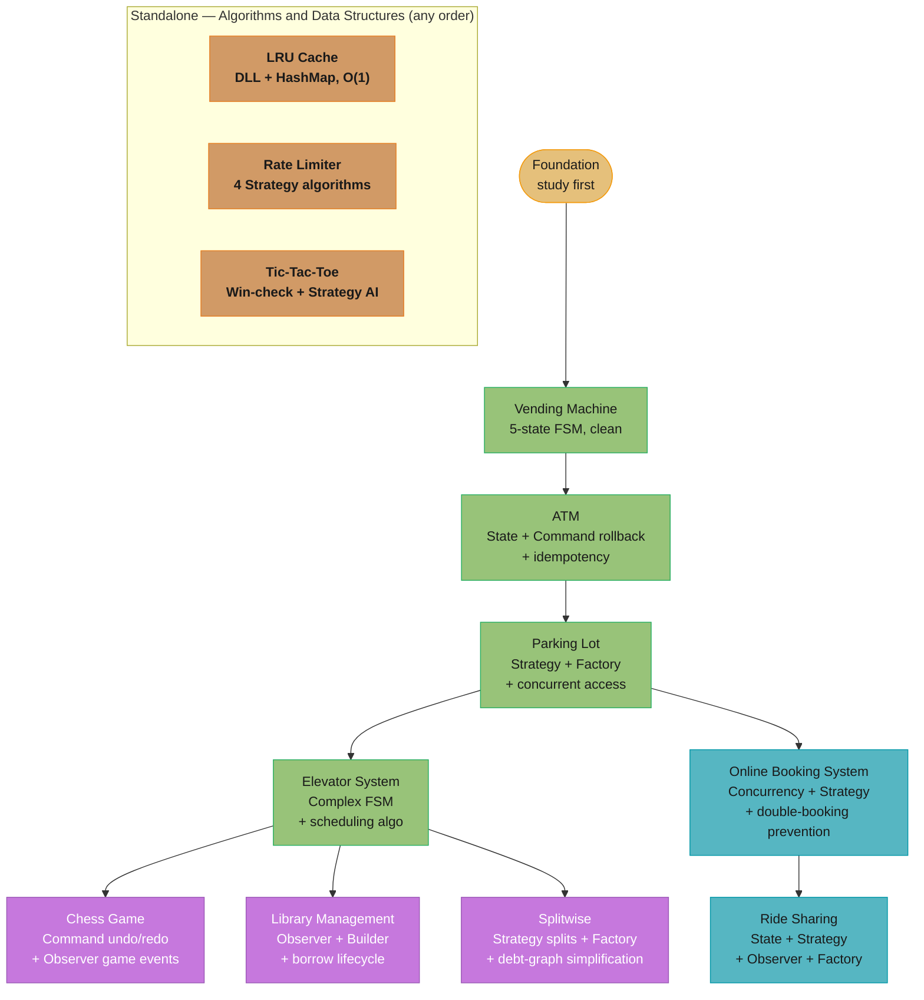
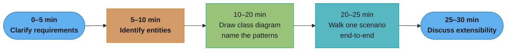

# LLD Case Studies — Learning Path

The twelve problems in `../system_design_problems/` serve as the practical interview case studies
for Low-Level Design. This README provides the learning path, pattern dependency map, and
interview preparation shortcuts.

---

## 1. Quick Start

Read these three first, in order:

| Problem | File | Why First |
|---------|------|-----------|
| Vending Machine | [VendingMachine_README.md](../system_design_problems/VendingMachine_README.md) | Cleanest State pattern implementation — 5 states, tight FSM, easy to draw in 30 min |
| Parking Lot | [ParkingLot_README.md](../system_design_problems/ParkingLot_README.md) | Combines Singleton + Strategy + Observer + Factory; most common LLD interview question |
| ATM | [ATM_README.md](../system_design_problems/ATM_README.md) | State machine + Command with rollback behind a Facade; introduces transaction idempotency concerns |

These three cover State (FSM), Command, Strategy, Factory, Observer, and Singleton — the patterns
that recur across most of the remaining problems. Once you can draw these three designs cold, the
remaining nine become variations on the same modelling moves.

---

## 2. Full Learning Path

Problems grouped by the dominant engineering concern they exercise:

### Group A — State Machines (Start Here)

| Problem | Dominant Concern | File | Core Patterns |
|---------|-----------------|------|--------------|
| Vending Machine | FSM design — 5 states, clean transitions | [VendingMachine_README.md](../system_design_problems/VendingMachine_README.md) | State, Singleton (machine), Flyweight (shared state objects) |
| ATM | FSM + transaction integrity | [ATM_README.md](../system_design_problems/ATM_README.md) | State, Command (execute + rollback), Facade |
| Elevator System | Complex FSM + scheduling algorithm | [ElevatorSystem_README.md](../system_design_problems/ElevatorSystem_README.md) | State, Observer (floor requests), Strategy (SCAN/FCFS) |
| Ride Sharing | Ride lifecycle FSM with rejected-transition handling | [RideSharing_README.md](../system_design_problems/RideSharing_README.md) | State (ride lifecycle), Strategy (fare), Observer (status), Factory (vehicle) |

### Group B — Concurrency + Resource Management

| Problem | Dominant Concern | File | Core Patterns |
|---------|-----------------|------|--------------|
| Parking Lot | Concurrent spot allocation, pricing strategy | [ParkingLot_README.md](../system_design_problems/ParkingLot_README.md) | Singleton (lot), Strategy (pricing), Observer (display boards), Factory (vehicle) |
| Online Booking System | Double-booking prevention, seat reservation | [OnlineBookingSystem_README.md](../system_design_problems/OnlineBookingSystem_README.md) | Strategy (pricing), Observer (notifications), Builder (Movie/Show) |

### Group C — Domain Modeling

| Problem | Dominant Concern | File | Core Patterns |
|---------|-----------------|------|--------------|
| Library Management | Borrow/return lifecycle, overdue notifications | [LibraryManagement_README.md](../system_design_problems/LibraryManagement_README.md) | Builder (Book), Iterator (catalog search), Observer (overdue) |
| Chess Game | Move validation, undo/redo, game phases | [ChessGame_README.md](../system_design_problems/ChessGame_README.md) | Command (move + undo), Observer (game events), Singleton (board) |
| Splitwise | Expense-sharing ledger, debt-graph simplification | [Splitwise_README.md](../system_design_problems/Splitwise_README.md) | Strategy (split type), Factory (split-strategy selection) |

### Group D — Algorithms & Data Structures

| Problem | Dominant Concern | File | Core Patterns |
|---------|-----------------|------|--------------|
| LRU Cache | O(1) get/put via doubly-linked list + HashMap; thread-safe wrapper | [LRUCache_README.md](../system_design_problems/LRUCache_README.md) | Decorator (thread safety), Observer (eviction listener) |
| Rate Limiter | Per-client request throttling; 4 interchangeable algorithms | [RateLimiter_README.md](../system_design_problems/RateLimiter_README.md) | Strategy (algorithm), Factory (algorithm selection) |
| Tic-Tac-Toe | Incremental win detection; pluggable AI move selection | [TicTacToe_README.md](../system_design_problems/TicTacToe_README.md) | Strategy (AI move), State (game state) |

---

## 3. Cross-Cutting Pattern Matrix

Which GoF patterns appear in which problems — use this to decide which problems to study
when preparing for a specific pattern question:

| Pattern | Vending | Parking | Library | Chess | Elevator | ATM | Booking | RideSharing | LRUCache | RateLimiter | TicTacToe | Splitwise |
|---------|---------|---------|---------|-------|----------|-----|---------|-------------|----------|-------------|-----------|-----------|
| State | Primary | Supporting | — | — | Primary | Primary | — | Primary | — | — | Supporting | — |
| Strategy | — | Primary | — | — | Supporting | — | Primary | Primary | — | Primary | Primary | Primary |
| Factory | — | Primary | — | — | — | — | — | Supporting | — | Supporting | — | Supporting |
| Observer | — | Supporting | Primary | Supporting | Supporting | — | Supporting | Supporting | Supporting | — | — | — |
| Command | — | — | — | Primary | — | Supporting | — | — | — | — | — | — |
| Builder | — | — | Supporting | — | — | — | Supporting | — | — | — | — | — |
| Singleton | Supporting | Primary | — | Supporting | — | — | — | — | — | — | — | — |
| Iterator | — | — | Primary | — | — | — | — | — | — | — | — | — |
| Decorator | — | — | — | — | — | — | — | — | Primary | Supporting | — | — |
| Facade | — | — | — | — | — | Supporting | — | — | — | — | — | — |
| Flyweight | Supporting | — | — | — | — | — | — | — | — | — | — | — |

**Legend**: Primary = the pattern is the main architectural decision; Supporting = the pattern
appears as a secondary component.

Two patterns interviewers often expect here appear in **none** of the twelve: **Template Method**
(Tic-Tac-Toe explicitly rejects it — `HumanPlayer` and `AIPlayer` share no multi-step skeleton, so
it would be plain polymorphism wearing a pattern name) and **Composite** (no problem in this set
has a genuine part/whole tree). Splitwise likewise considers Observer and deliberately omits it.
Naming a pattern you did *not* use, and why, is a stronger interview signal than padding the list.

---

## 4. Dependency Map

Conceptual dependencies — study problems lower in the tree first:

**Why this order**: Vending Machine's clean 5-state FSM is the template you'll reuse in every
other state-machine problem. ATM adds the transaction integrity concern. Parking Lot adds Factory
and Strategy. Elevator extends the FSM complexity, and Ride Sharing reuses the same Strategy +
Observer + State combination on a trip lifecycle. Chess, Library, and Splitwise are standalone
domain-modeling problems but assume you can already identify patterns quickly. The Algorithms &
Data Structures group (LRU Cache, Rate Limiter, Tic-Tac-Toe) is independent of the rest — these
lean more on data-structure correctness than on OOP class design, so study them whenever a
"design X" question turns out to really be "implement X efficiently."

---

## 5. Interview Prep Shortcuts

| "Design X" interview question | Best case study to study | Why |
|------------------------------|--------------------------|-----|
| Design a vending machine | Vending Machine | Direct match |
| Design an ATM | ATM | Direct match |
| Design a parking system / lot | Parking Lot | Direct match |
| Design an elevator / lift | Elevator System | Direct match |
| Design a library management system | Library Management | Direct match |
| Design a chess game | Chess Game | Direct match |
| Design a movie / flight / hotel booking | Online Booking System | Pattern is identical |
| Design a traffic light system | Vending Machine | Same state-object FSM structure |
| Design a food delivery order lifecycle | ATM + Booking | State machine + double-allocation |
| Design a ride-sharing app (Uber/Lyft) | Ride Sharing | Direct match — State, Strategy, Observer, Factory |
| Design a bank transaction system | ATM | Transaction integrity, rollback, idempotency |
| Design a document editor with undo | Chess Game | Command pattern undo/redo |
| Design a notification system | Library Management | Observer pattern, overdue/event triggers |
| Design an LRU cache (or LFU variant) | LRU Cache | Direct match — doubly-linked list + HashMap, O(1) |
| Design a rate limiter (class-design angle) | Rate Limiter | Direct match — Strategy across 4 algorithms |
| Design tic-tac-toe / a turn-based board game | Tic-Tac-Toe | Direct match — incremental win-check, pluggable AI |
| Design Splitwise / a bill-splitting app | Splitwise | Direct match — Strategy splits + debt simplification |

### 30-Minute Interview Time Box

Each stage feeds the next inside a strict 30-minute budget — requirements (0–5 min) and entity
identification (5–10 min) exist only to feed the 10-minute class-diagram stage, the interviewer's
primary signal.

The most common failure mode: spending 15+ minutes on requirements and running out of time
for the class diagram. Timebox requirements to 5 minutes maximum.

---

## Cross-References

| LLD Concern | See Also |
|-------------|---------|
| State machine depth | [../behavioral/state/](../behavioral/state/) |
| Command pattern (undo/redo) | [../behavioral/command/](../behavioral/command/) |
| Observer (notifications) | [../behavioral/observer/](../behavioral/observer/) |
| Factory + Strategy combo | [../creational/factory_method/](../creational/factory_method/), [../behavioral/strategy/](../behavioral/strategy/) |
| Concurrency in Parking/Elevator | [../concurrency_patterns/README.md](../concurrency_patterns/README.md) |
| Distributed scale of these problems | [../../hld/microservices/](../../hld/microservices/) |
| Decorator (LRU Cache thread safety) | [../structural/decorator/](../structural/decorator/) |
| Rate limiting at distributed scale | [../../hld/rate_limiting/](../../hld/rate_limiting/) |
