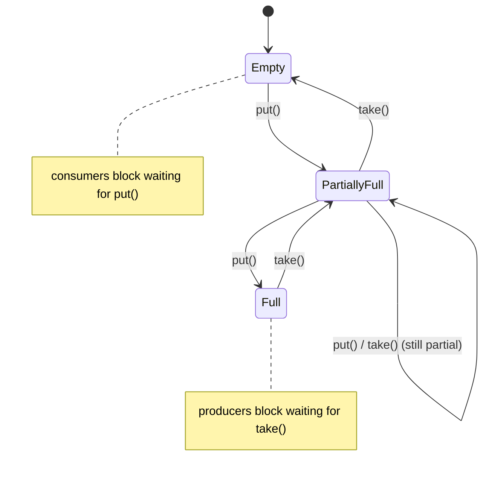
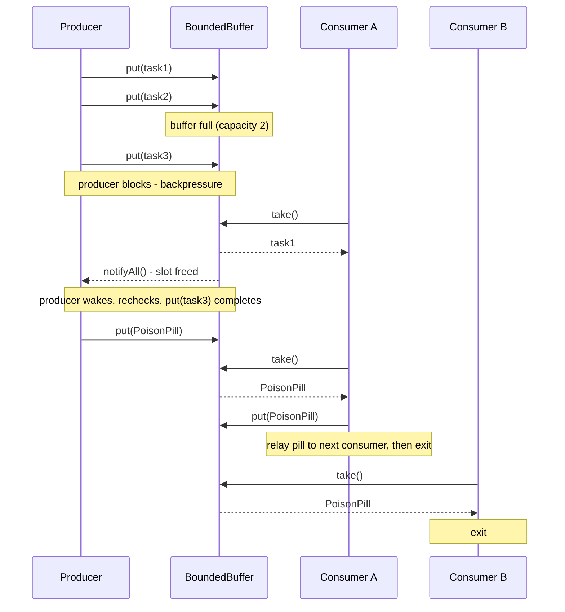

# Producer-Consumer Pattern

## Intuition

> **One-line analogy**: Producer-Consumer is like a bakery conveyor belt — bakers (producers) place loaves at one end at their own pace; packagers (consumers) take them at their own pace — the belt absorbs the difference.

**Mental model**: Without a buffer, producers and consumers must synchronize on every item — one waits for the other constantly. A bounded queue between them lets each run at its natural speed. When the queue fills up, the producer slows down (backpressure). When it empties, consumers wait. The system self-regulates without tight coupling between the two sides.

**Why it matters**: This pattern appears everywhere in production systems — HTTP request queues, Kafka topics, thread pools, async job schedulers. Understanding it deeply means understanding backpressure, queue sizing, and graceful degradation under load.

**Key insight**: The bounded buffer capacity is a tuning dial: small = aggressive backpressure, large = large latency spikes before producers feel the pain. Size it as `max_throughput × max_acceptable_latency`.

---

## Intent

Decouple producers (which generate work items) from consumers (which process them) using a shared bounded buffer. Producers don't wait for consumers; consumers don't poll for work — both run at their natural rates.

## When to Use

- Tasks are generated at a different rate than they're processed
- You need backpressure (slow down producers when consumers are overwhelmed)
- You want to smooth out bursty traffic
- Multiple producers/consumers need to coordinate without tight coupling

---

## Bounded Buffer

The buffer's capacity is critical:
- **Too small**: producers block frequently, reducing throughput
- **Too large**: memory exhaustion; backpressure signal arrives too late
- **Rule of thumb**: queue size = (max throughput) × (max acceptable latency)

**Put simply.** "Make the buffer exactly deep enough that a full queue still drains inside your
latency budget." A queue slot is not free storage — it is a promise of delay, because the item at
the back of a full queue must wait for everything ahead of it to be consumed. Sizing by this rule
means the worst case you can ever observe is the worst case you already agreed to.

| Symbol | What it is |
|--------|-----------|
| `queue size` | Bounded-buffer capacity — the `new ArrayBlockingQueue<>(n)` argument |
| `max throughput` | Sustained consumer drain rate, in items per second (not the producer rate) |
| `max acceptable latency` | Worst-case end-to-end queue delay your SLA permits |

**Walk one example.** A pipeline whose consumers drain 5,000 messages/sec, with a 200ms latency
budget and roughly 2KB per message:

```
given   max throughput = 5000 msg/s
        max latency    = 0.2 s
        message size   = 2 KB = 2048 bytes

size    queue = 5000 x 0.2                     = 1000 slots
memory  worst-case heap = 1000 x 2048 bytes    = 2.05 MB   (bounded, by construction)

what the two bad sizes cost:
        queue = 100000 slots -> drain time = 100000 / 5000 = 20 s     latency blown 100x
                                heap       = 100000 x 2048 = 204.8 MB OOM territory
        queue =     10 slots -> drain time =     10 / 5000 = 0.002 s  producers block constantly
```

Result: 1,000 slots is the largest buffer that still honours the 200ms promise, and it caps
worst-case memory at ~2MB. Note that the drain rate — not the producer rate — is the correct
`max throughput`: a queue sized off producers can never empty if consumers are slower, which is
precisely the unbounded-growth failure the pattern exists to prevent.

The buffer's own fill level *is* the backpressure signal — producers and consumers each block on exactly one edge of it, with no other coordination required:



Producers only stall at `Full`; consumers only stall at `Empty` — this is the "self-regulates" behavior from the Key insight above, driven entirely by the buffer's own capacity check.

---

## Implementation Comparison

| Approach | Pros | Cons | Use When |
|----------|------|------|----------|
| `wait()/notifyAll()` | No dependencies, fine-grained | Error-prone, verbose | Never in production |
| `BlockingQueue` | Clean API, built-in, reliable | Less flexible | Almost always |
| `Disruptor` | Extreme throughput (LMAX) | Complex | Financial trading systems |
| `Kafka` | Durable, distributed, replay | Heavy infrastructure | Cross-service async |

---

## Why `while` and NOT `if` for wait()

```java
// WRONG — vulnerable to spurious wakeups
synchronized void consume() throws InterruptedException {
    if (buffer.isEmpty()) {  // ← if another thread consumed before you wake
        wait();
    }
    // buffer could be empty here! NullPointerException or wrong result
    return buffer.poll();
}

// CORRECT — re-checks condition after wakeup
synchronized void consume() throws InterruptedException {
    while (buffer.isEmpty()) {  // ← always re-check
        wait();
    }
    return buffer.poll();
}
```

Spurious wakeups: JVM/OS can wake threads without `notify()` being called. The JVM specification explicitly allows this.

---

## BlockingQueue Variants

| Class | Bounded | Order | Notes |
|-------|---------|-------|-------|
| `ArrayBlockingQueue` | Yes | FIFO | Fixed array, single lock |
| `LinkedBlockingQueue` | Optional | FIFO | Two locks (head/tail), higher throughput |
| `PriorityBlockingQueue` | No | Priority | Heap-based, natural order |
| `DelayQueue` | No | Delay expiry | Tasks available after delay |
| `SynchronousQueue` | 0 (handoff) | — | Direct producer→consumer handoff |

---

## Poison Pill Shutdown

```java
// Sentinel value signals consumers to stop
queue.put(PoisonPill.INSTANCE);  // producer puts it after last real task

// Consumer:
while (true) {
    Task task = queue.take();
    if (task == PoisonPill.INSTANCE) {
        queue.put(PoisonPill.INSTANCE); // pass it along to other consumers
        break;
    }
    process(task);
}
```

Alternative: `ExecutorService.shutdown()` + `awaitTermination()`.

The full lifecycle — normal blocking handoff, then poison-pill shutdown relayed across a consumer pool — looks like this end to end:



Consumer A never swallows the pill — it re-`put()`s it before exiting, so Consumer B (and any other pool member) also sees it and shuts down cleanly.

---

## Monitoring Metrics

| Metric | What it tells you | Alert threshold |
|--------|-------------------|-----------------|
| Queue depth | Consumer lag | > 80% capacity |
| Producer rate (tasks/sec) | Input load | Sudden spike |
| Consumer rate (tasks/sec) | Processing throughput | Drop below producer rate |
| Task age in queue | Latency | > SLA target |
| Rejected tasks | Queue overflow | > 0 |

---

## Real-World Examples

- **Java Thread Pool**: `ThreadPoolExecutor` internally uses a BlockingQueue for tasks
- **Kafka**: The ultimate producer-consumer at scale — durable, distributed, replayable
- **Android MainThread**: UI events are tasks in a message queue; Looper is the consumer
- **Node.js Event Loop**: Single-threaded consumer for async I/O events
- **Database connection pool**: Connections are "consumers" waiting for queries (tasks)

---

## Cross-Perspective: HLD Connections

**HLD View — Where Producer-Consumer Appears in Distributed Systems**

- **Message queue architecture** — Kafka, RabbitMQ, SQS, and Pub/Sub are Producer-Consumer at infrastructure scale with persistence, replay, and multi-consumer fan-out. The bounded queue becomes a distributed durable log; the backpressure signal is queue depth or consumer lag.
- **Async job processing** — Web tier (producer) drops jobs into a queue; a worker fleet (consumers) processes them asynchronously. This decouples peak request volume from processing throughput and enables independent scaling of web and worker tiers.
- **Stream processing pipelines** — Flink and Kafka Streams chains are cascaded Producer-Consumer stages: each stage consumes from an upstream topic (bounded buffer) and produces to a downstream topic, with backpressure managed by consumer lag monitoring.
- **Connection pool as consumer** — A connection pool is a Producer-Consumer variant: requests (producers) submit work; pooled threads (consumers) process it from a bounded work queue. Queue saturation triggers the rejection handler — the system's backpressure mechanism.

---

## Interview Questions

1. **What is the difference between `notify()` and `notifyAll()`?**
   `notify()` wakes one random waiting thread. `notifyAll()` wakes all. Use `notifyAll()` when multiple threads are waiting on different conditions; `notify()` is only safe when all threads wait on the same condition.

2. **What is a spurious wakeup? How do you handle it?**
   A thread waking from `wait()` without being notified. Handle by always rechecking the condition in a `while` loop.

3. **How do you gracefully shut down a producer-consumer system?**
   Option A: Poison pill — producers send a sentinel task; consumers stop on receiving it.
   Option B: `ExecutorService.shutdown()` then `awaitTermination()`.
   Option C: `volatile boolean running = false` flag checked in consumer loop.

4. **What BlockingQueue would you use for a priority work queue?**
   `PriorityBlockingQueue` — tasks implement `Comparable` or provide a `Comparator`.

5. **How would you implement backpressure?**
   Use a bounded `BlockingQueue`. `put()` blocks the producer thread when full. For async systems, use reactive streams (RxJava, Project Reactor) which have explicit backpressure signals.
