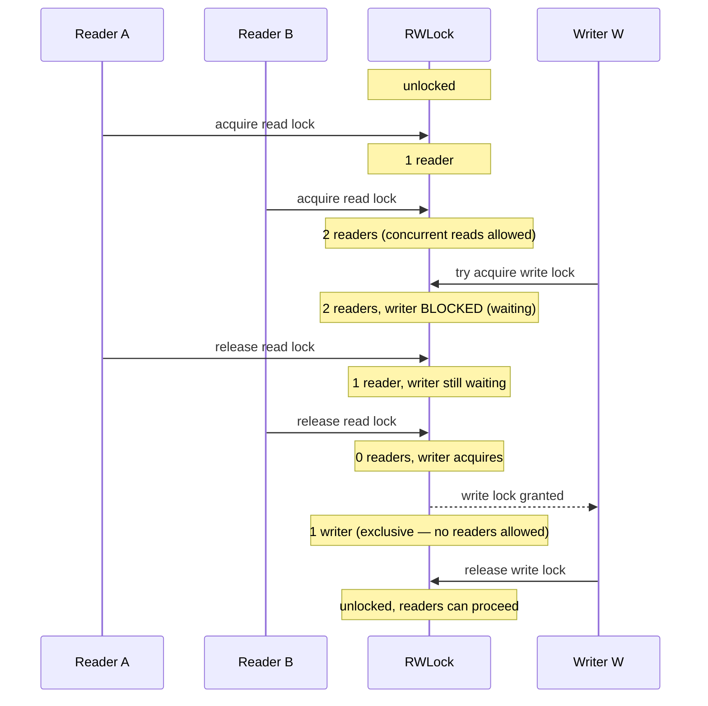
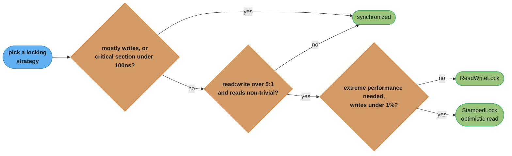
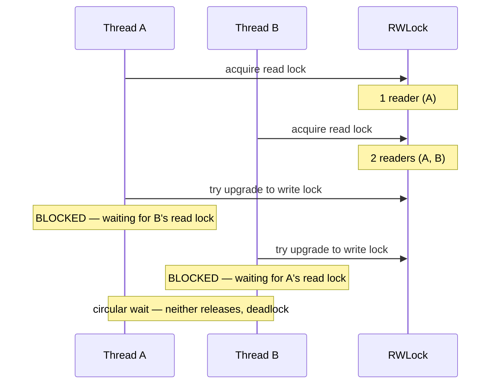

# Read-Write Lock Pattern

## Intuition

> **One-line analogy**: Read-Write Lock is like a library reading room — many people can read the same book simultaneously, but when someone needs to rewrite it, everyone must leave and no one enters until they're done.

**Mental model**: A plain `synchronized` block makes every read wait for every other read, even though reads don't interfere with each other. Read-Write Lock distinguishes between "safe to share" (reads) and "needs isolation" (writes). In a 100:1 read-write ratio system, this can eliminate 99% of locking overhead on the critical path.

**Why it matters**: Configuration stores, in-memory caches, and session registries are read constantly and updated rarely. Using an exclusive lock for everything serializes the system unnecessarily. RWL is the precision tool for this class of problem.

**Key insight**: Watch out for writer starvation in highly read-heavy systems — if reads never stop, writers may wait indefinitely. Java's `ReentrantReadWriteLock` uses a fair mode flag (`true`) to give writers priority after they start waiting.

---

## Intent

Allow multiple concurrent readers OR one exclusive writer, but never both simultaneously. Optimizes for read-heavy workloads where readers don't need to block each other.

## When to Use

- Reads are far more frequent than writes (e.g., 100:1 ratio)
- Read operations are independent (don't mutate shared state)
- Write operations need exclusive access
- Examples: configuration, cache, in-memory indexes, session stores

---

## Lock Semantics



Two readers hold the lock concurrently while the writer blocks; once both readers release, the writer gets exclusive access, and releasing the write lock returns the lock to unlocked for the next reader or writer.

---

## Writer Starvation Problem

In a naive implementation where readers keep arriving, a writer could wait forever.

**Solution**: When a writer is waiting, new readers must also wait.
```java
// ManualReadWriteLock in this example:
while (writers > 0 || writeWaiters > 0) {
    wait();  // new readers wait if a writer is queued
}
```

`ReentrantReadWriteLock(true)` — fair mode — uses FIFO queue to prevent starvation.

---

## Choosing Between Implementations

| | `synchronized` | `ReentrantReadWriteLock` | `StampedLock` |
|---|---|---|---|
| Multiple concurrent readers | No | Yes | Yes |
| Reentrancy | Yes | Yes | No |
| Fair mode | No | Yes | No |
| Condition variables | Yes | Yes | No |
| Optimistic reads | No | No | Yes |
| Lock downgrade (write→read) | No | Yes | Yes |
| Lock upgrade (read→write) | No | No | Partial |
| Performance | Low | Medium | High |
| Complexity | Low | Medium | High |

---

## Lock Downgrade (Write → Read)

`ReentrantReadWriteLock` allows downgrading from write to read lock. This is useful when you write a value and then want to continue reading it without releasing and re-acquiring.

```java
writeLock.lock();
try {
    updateCache(key, value);
    readLock.lock();   // acquire read lock BEFORE releasing write lock
} finally {
    writeLock.unlock(); // release write lock — read lock still held
}
// now only holding read lock — other readers can join
try {
    return cache.get(key);
} finally {
    readLock.unlock();
}
```

**Lock upgrade (read → write) is NOT supported** — it would deadlock if two threads both try to upgrade simultaneously.

---

## StampedLock — Optimistic Read Pattern

```java
StampedLock lock = new StampedLock();

// Optimistic read: no lock acquired
long stamp = lock.tryOptimisticRead();
double x = this.x;  // read without lock
double y = this.y;

if (!lock.validate(stamp)) {
    // Data was modified while we were reading → fall back to real lock
    stamp = lock.readLock();
    try {
        x = this.x;
        y = this.y;
    } finally {
        lock.unlockRead(stamp);
    }
}
// use x, y
```

**When optimistic reads win**: High read:write ratio (99:1), reads are short, contention is low. Under these conditions, most optimistic reads succeed without lock acquisition — ~3x faster than `ReentrantReadWriteLock`.

---

## Performance Guidelines

**Use `ReadWriteLock` when**:
- Read:write ratio > 5:1
- Reads take non-trivial time (> a few microseconds)
- Many threads contend for the resource

**Stick with `synchronized` when**:
- Most operations are writes
- Critical section is very short (< 100ns) — lock overhead dominates
- Simplicity is more important than raw performance

**Use `StampedLock` when**:
- Extreme performance is needed
- You can handle the extra complexity
- Writes are rare (< 1%)

The three bullet lists above collapse into one decision path:



Short or write-heavy critical sections stay with `synchronized`; read-heavy contention (over 5:1) moves to `ReadWriteLock`; rare-write, performance-critical code graduates to `StampedLock`'s optimistic reads.

---

## Common Pitfalls

1. **Forgetting unlock in finally**:
```java
// WRONG — lock may not be released on exception
lock.readLock().lock();
return doSomething(); // what if this throws?

// CORRECT
lock.readLock().lock();
try {
    return doSomething();
} finally {
    lock.readLock().unlock();
}
```

2. **Read lock with write assumption**: Modifying data while holding a read lock is a data race — other readers are also running!

3. **Lock upgrade deadlock**: Thread A holds read lock, tries to upgrade to write lock. Thread B also holds read lock, also tries to upgrade. Neither can proceed — deadlock.

4. **Holding locks across I/O**: Never hold a lock while doing I/O (database call, HTTP request) — too long, too much contention.

The circular wait behind pitfall 3 (lock upgrade deadlock) looks like this:



Each thread holds a read lock the other needs before it can upgrade — a circular wait that neither `ReentrantReadWriteLock` nor manual locking can resolve, which is why lock upgrade is unsupported.

---

## Cross-Perspective: HLD Connections

**HLD View — Where Read-Write Lock Appears in Distributed Systems**

- **Database read replicas** — Read replicas implement Read-Write Lock at the infrastructure level: many replicas serve concurrent reads while a single primary processes writes. The write is propagated to replicas asynchronously — eventually consistent Read-Write Lock with eventual reader synchronization.
- **CQRS** — Command Query Responsibility Segregation is Read-Write Lock as an architectural pattern: the write model (command side) handles mutations with exclusive access semantics; the read model (query side) serves concurrent reads from denormalized projections.
- **Leader-follower replication** — The leader holds the "write lock" at the cluster level; followers are read-only replicas. Raft and Paxos elect exactly one leader — distributed exclusivity for writes with concurrent reads from followers.
- **Distributed caches** — Redis Cluster and Memcached serve many concurrent reads; cache invalidation (write) requires coordination to maintain consistency. The read-write asymmetry justifies a read-optimized topology (many cache nodes) with centralized write coordination.

---

## Interview Questions

1. **What's the difference between ReentrantLock and ReentrantReadWriteLock?**
   `ReentrantLock` is exclusive — only one thread can hold it. `ReentrantReadWriteLock` allows multiple concurrent readers OR one writer. Use RWL when reads dominate.

2. **Why can't you upgrade a read lock to a write lock in ReentrantReadWriteLock?**
   Deadlock: if two threads both try to upgrade, each waits for the other to release their read lock — circular wait.

3. **What is StampedLock and when would you use it?**
   A higher-performance lock (Java 8+) that supports optimistic reads — attempt to read without locking, then validate. Use for read-heavy, performance-critical code where writes are rare.

4. **What is lock downgrade and why is it useful?**
   Acquiring a read lock while holding a write lock, then releasing the write lock. Useful for writing a value and then immediately reading it, without releasing the lock entirely (which would allow another writer to change the value).

5. **How do you prevent writer starvation?**
   Use fair mode (`new ReentrantReadWriteLock(true)`) which uses a FIFO queue. Or manually prioritize writers by making new readers wait when a writer is queued.
