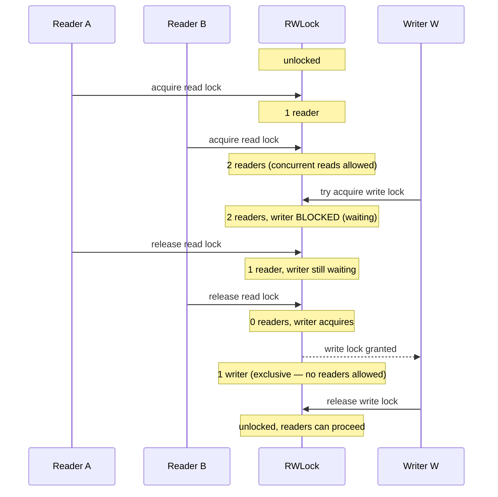
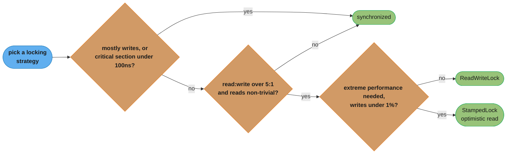
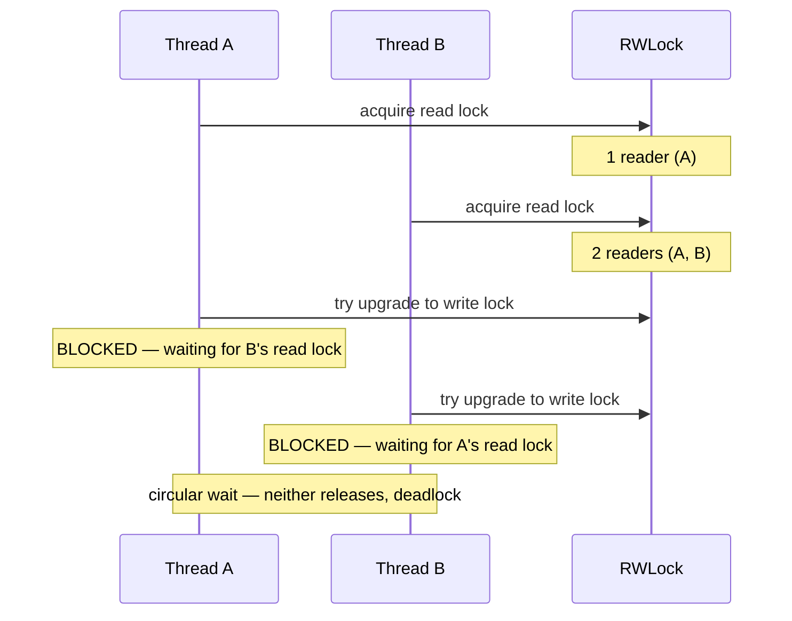

# Read-Write Lock Pattern

## Intuition

> **One-line analogy**: Read-Write Lock is like a library reading room — many people can read the same book simultaneously, but when someone needs to rewrite it, everyone must leave and no one enters until they're done.

**Mental model**: A plain `synchronized` block makes every read wait for every other read, even though reads don't interfere with each other. Read-Write Lock distinguishes between "safe to share" (reads) and "needs isolation" (writes). In a 100:1 read-write ratio system, this can eliminate 99% of locking overhead on the critical path.

**Why it matters**: Configuration stores, in-memory caches, and session registries are read constantly and updated rarely. Using an exclusive lock for everything serializes the system unnecessarily. RWL is the precision tool for this class of problem.

**Key insight**: Watch out for writer starvation in highly read-heavy systems — the `ReentrantReadWriteLock` javadoc warns that the default non-fair mode "may indefinitely postpone one or more reader or writer threads." Constructing it with the fair flag (`new ReentrantReadWriteLock(true)`) switches to an approximately arrival-order policy, under which a new reader blocks if a writer is already queued — which is what rescues the writer.

---

## Intent

Allow multiple concurrent readers OR one exclusive writer, but never both simultaneously. Optimizes for read-heavy workloads where readers don't need to block each other.

## When to Use

- Reads are far more frequent than writes (e.g., 100:1 ratio)
- Read operations are independent (don't mutate shared state)
- Write operations need exclusive access
- Examples: configuration, cache, in-memory indexes, session stores

---

## Lock Semantics


```mermaid
sequenceDiagram
    participant A as Reader A
    participant B as Reader B
    participant L as RWLock
    participant W as Writer W

    Note over L: unlocked
    A->>L: acquire read lock
    Note over L: 1 reader
    B->>L: acquire read lock
    Note over L: 2 readers (concurrent reads allowed)
    W->>L: try acquire write lock
    Note over L: 2 readers, writer BLOCKED (waiting)
    A->>L: release read lock
    Note over L: 1 reader, writer still waiting
    B->>L: release read lock
    Note over L: 0 readers, writer acquires
    L-->>W: write lock granted
    Note over L: 1 writer (exclusive — no readers allowed)
    W->>L: release write lock
    Note over L: unlocked, readers can proceed
```

Two readers hold the lock concurrently while the writer blocks; once both readers release, the writer gets exclusive access, and releasing the write lock returns the lock to unlocked for the next reader or writer.

---

## Writer Starvation Problem

In a naive implementation where readers keep arriving, a writer could wait forever.

**Solution**: When a writer is waiting, new readers must also wait.
```java
// ManualReadWriteLock in this example:
while (writers > 0 || writeWaiters > 0) {
    wait();  // new readers wait if a writer is queued
}
```

`new ReentrantReadWriteLock(true)` — fair mode — is exactly this rule built in. Per the javadoc, fair
mode grants entry using an "approximately arrival-order policy" (not a strict FIFO guarantee): a thread
taking a fair read lock non-reentrantly blocks while a writer is waiting, and will not acquire it until
the oldest waiting writer has acquired and released the write lock. Fair mode normally has lower
throughput than the default non-fair mode — that is the price of the starvation guarantee.

---

## Choosing Between Implementations

| | `synchronized` | `ReentrantReadWriteLock` | `StampedLock` |
|---|---|---|---|
| Multiple concurrent readers | No | Yes | Yes |
| Reentrancy | Yes | Yes | No |
| Fair mode | No | Yes | No |
| Condition variables | Yes | Yes | No |
| Optimistic reads | No | No | Yes |
| Lock downgrade (write→read) | No | Yes | Yes |
| Lock upgrade (read→write) | No | No — javadoc: "not possible" | Partial — `tryConvertToWriteLock()`, best-effort |
| Performance | Low | Medium | High |
| Complexity | Low | Medium | High |

---

## Lock Downgrade (Write → Read)

`ReentrantReadWriteLock` allows downgrading from write to read lock. This is useful when you write a value and then want to continue reading it without releasing and re-acquiring.

```java
writeLock.lock();
try {
    updateCache(key, value);
    readLock.lock();   // acquire read lock BEFORE releasing write lock
} finally {
    writeLock.unlock(); // release write lock — read lock still held
}
// now only holding read lock — other readers can join
try {
    return cache.get(key);
} finally {
    readLock.unlock();
}
```

**Lock upgrade (read → write) is NOT supported.** The javadoc is explicit: "upgrading from a read lock to
the write lock is not possible" and "if a reader tries to acquire the write lock it will never succeed."
A single thread attempting it therefore blocks forever on itself; with two threads both upgrading, it is a
classic circular wait. Downgrade, by contrast, is explicitly sanctioned: "Reentrancy also allows
downgrading from the write lock to a read lock, by acquiring the write lock, then the read lock and then
releasing the write lock."

---

## StampedLock — Optimistic Read Pattern

```java
StampedLock lock = new StampedLock();

// Optimistic read: no lock acquired
long stamp = lock.tryOptimisticRead();
double x = this.x;  // read without lock
double y = this.y;

if (!lock.validate(stamp)) {
    // Data was modified while we were reading → fall back to real lock
    stamp = lock.readLock();
    try {
        x = this.x;
        y = this.y;
    } finally {
        lock.unlockRead(stamp);
    }
}
// use x, y
```

**When optimistic reads win**: High read:write ratio (99:1), reads are short, contention is low. Under these conditions most optimistic reads succeed without acquiring anything; published JMH-style comparisons at ~1% writes put `StampedLock` roughly 3x the throughput of `ReentrantReadWriteLock`. Treat that as an order of magnitude, not a guarantee — the ratio swings with thread count, write share, and critical-section length.

---

## Performance Guidelines

**Use `ReadWriteLock` when**:
- Read:write ratio > 5:1
- Reads take non-trivial time (> a few microseconds)
- Many threads contend for the resource

**Stick with `synchronized` when**:
- Most operations are writes
- Critical section is very short (< 100ns) — lock overhead dominates
- Simplicity is more important than raw performance

**Use `StampedLock` when**:
- Extreme performance is needed
- You can handle the extra complexity
- Writes are rare (< 1%)

The three bullet lists above collapse into one decision path:


```mermaid
flowchart LR
    classDef io      fill:#61afef,stroke:#2e86c1,color:#1a1a1a,font-weight:bold
    classDef frozen  fill:#c678dd,stroke:#9b59b6,color:#fff
    classDef train   fill:#98c379,stroke:#27ae60,color:#1a1a1a
    classDef mathOp  fill:#d19a66,stroke:#e67e22,color:#1a1a1a,font-weight:bold
    classDef lossN   fill:#e06c75,stroke:#c0392b,color:#fff,font-weight:bold
    classDef req     fill:#56b6c2,stroke:#0097a7,color:#1a1a1a
    classDef base    fill:#e5c07b,stroke:#f39c12,color:#1a1a1a

    Start(["pick a locking<br/>strategy"]) --> Q1{"mostly writes, or<br/>critical section under 100ns?"}
    Q1 -->|"yes"| Sync(["synchronized"])
    Q1 -->|"no"| Q2{"read:write over 5:1<br/>and reads non-trivial?"}
    Q2 -->|"no"| Sync
    Q2 -->|"yes"| Q3{"extreme performance needed,<br/>writes under 1%?"}
    Q3 -->|"no"| RWL(["ReadWriteLock"])
    Q3 -->|"yes"| Stamped(["StampedLock<br/>optimistic read"])

    class Start io
    class Q1,Q2,Q3 mathOp
    class Sync,RWL,Stamped train
```

Short or write-heavy critical sections stay with `synchronized`; read-heavy contention (over 5:1) moves to `ReadWriteLock`; rare-write, performance-critical code graduates to `StampedLock`'s optimistic reads.

---

## Common Pitfalls

1. **Forgetting unlock in finally**:
```java
// WRONG — lock may not be released on exception
lock.readLock().lock();
return doSomething(); // what if this throws?

// CORRECT
lock.readLock().lock();
try {
    return doSomething();
} finally {
    lock.readLock().unlock();
}
```

2. **Read lock with write assumption**: Modifying data while holding a read lock is a data race — other readers are also running!

3. **Lock upgrade deadlock**: Even a *single* thread deadlocks — holding the read lock and then calling `writeLock().lock()` blocks forever, because the write lock waits for all readers to drain, including the caller itself. With two threads it becomes a textbook circular wait: A and B each hold a read lock and each wait for the other to release it.

4. **Holding locks across I/O**: Never hold a lock while doing I/O (database call, HTTP request) — too long, too much contention.

The circular wait behind pitfall 3 (lock upgrade deadlock) looks like this:


```mermaid
sequenceDiagram
    participant TA as Thread A
    participant TB as Thread B
    participant L as RWLock

    TA->>L: acquire read lock
    Note over L: 1 reader (A)
    TB->>L: acquire read lock
    Note over L: 2 readers (A, B)
    TA->>L: try upgrade to write lock
    Note over TA: BLOCKED — waiting for B's read lock
    TB->>L: try upgrade to write lock
    Note over TB: BLOCKED — waiting for A's read lock
    Note over TA,TB: circular wait — neither releases, deadlock
```

Each thread holds a read lock the other needs before it can upgrade — a circular wait that neither `ReentrantReadWriteLock` nor manual locking can resolve, which is why lock upgrade is unsupported.

---

## Cross-Perspective: HLD Connections

**HLD View — Where Read-Write Lock Appears in Distributed Systems**

- **Database read replicas** — Read replicas implement Read-Write Lock at the infrastructure level: many replicas serve concurrent reads while a single primary processes writes. The write is propagated to replicas asynchronously — eventually consistent Read-Write Lock with eventual reader synchronization.
- **CQRS** — Command Query Responsibility Segregation is Read-Write Lock as an architectural pattern: the write model (command side) handles mutations with exclusive access semantics; the read model (query side) serves concurrent reads from denormalized projections.
- **Leader-follower replication** — The leader holds the "write lock" at the cluster level; followers are read-only replicas. Raft and Paxos elect exactly one leader — distributed exclusivity for writes with concurrent reads from followers.
- **Distributed caches** — Redis Cluster and Memcached serve many concurrent reads; cache invalidation (write) requires coordination to maintain consistency. The read-write asymmetry justifies a read-optimized topology (many cache nodes) with centralized write coordination.

---

## Interview Questions

**Q: What's the difference between ReentrantLock and ReentrantReadWriteLock?**
**Short:** ReentrantLock is exclusive, while ReentrantReadWriteLock admits many concurrent readers or one writer, so it only pays off when reads dominate.
`ReentrantLock` is exclusive — only one thread can hold it. `ReentrantReadWriteLock` allows multiple concurrent readers OR one writer. Use RWL when reads dominate.

**Q: Why can't you upgrade a read lock to a write lock in ReentrantReadWriteLock?**
**Short:** The write lock waits for every reader to drain, including the upgrading thread itself, so a lone thread blocks on itself and two threads deadlock.
The javadoc states plainly that upgrading is not possible and that "if a reader tries to acquire the write lock it will never succeed" — the write lock waits for every reader to drain, including the thread doing the upgrade, so a lone thread blocks on itself. With two threads it is a circular wait: each waits for the other to release its read lock. The supported direction is downgrade: take the read lock while still holding the write lock, then release the write lock.

**Q: What is StampedLock and when would you use it?**
**Short:** StampedLock adds optimistic reads that acquire no lock at all and are validated afterwards, suiting read-heavy code where writes are rare.
A higher-performance lock (Java 8+) that supports optimistic reads — attempt to read without locking, then validate. Use for read-heavy, performance-critical code where writes are rare.

**Q: What is lock downgrade and why is it useful?**
**Short:** Downgrading acquires the read lock while still holding the write lock and then releases the write lock, so no other writer can intervene in between.
Acquiring a read lock while holding a write lock, then releasing the write lock. Useful for writing a value and then immediately reading it, without releasing the lock entirely (which would allow another writer to change the value).

**Q: How do you prevent writer starvation?**
**Short:** Fair mode grants the lock in approximately arrival order, so a new reader blocks while a writer is already queued, trading throughput for predictability.
Use fair mode (`new ReentrantReadWriteLock(true)`), which grants entry by an approximately arrival-order policy so a new reader blocks while a writer is already queued. Or manually prioritize writers by making new readers wait when a writer is queued. The default non-fair mode has higher throughput but the javadoc explicitly allows it to postpone a reader or writer indefinitely.
