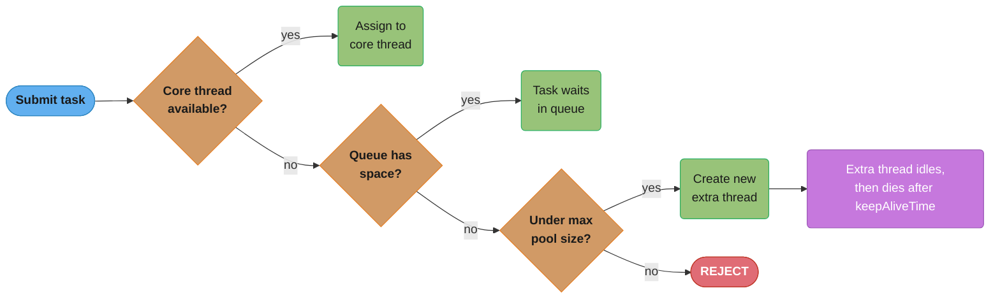
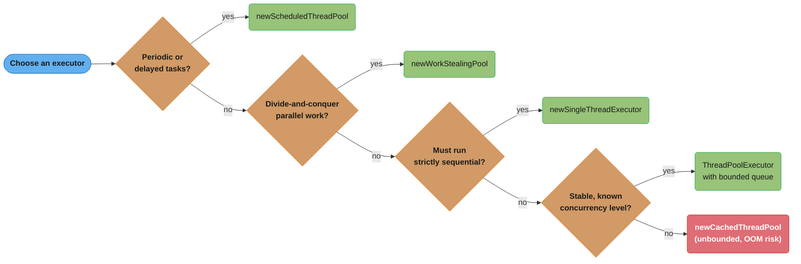
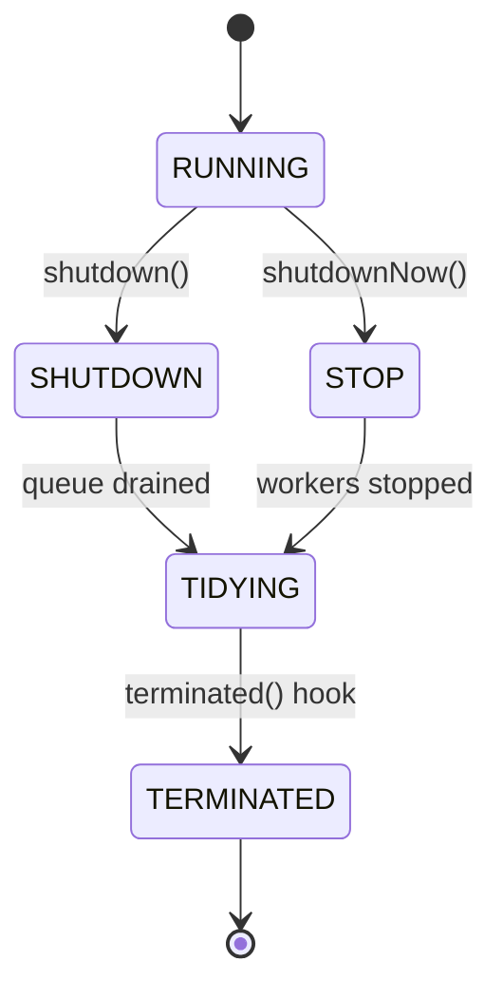

# Thread Pool Pattern

## Intuition

> **One-line analogy**: Thread Pool is like a restaurant kitchen — instead of hiring and firing a cook for every single order, you keep a fixed crew who handle all orders in sequence; new orders queue up when everyone is busy.

**Mental model**: Creating a Java thread costs ~1ms and ~512KB of stack memory. For a service handling 1,000 requests/second, spawning a thread per request means 1,000 thread creations per second and unbounded memory growth under load. A thread pool amortizes creation cost across many tasks, bounds total memory, and provides a queue that applies backpressure when all workers are busy.

**Why it matters**: Thread pools are the standard execution model for every Java server. Understanding `corePoolSize`, `maximumPoolSize`, `keepAliveTime`, queue type, and rejection policies is essential for tuning throughput vs latency vs memory under production load.

**Key insight**: The right pool size depends on whether tasks are CPU-bound (size = CPU cores) or I/O-bound (size = CPU cores × (1 + wait_time/compute_time)). Guessing wrong degrades either throughput or memory — profile before tuning.

---

## Intent

Reuse a fixed set of worker threads to execute many tasks, avoiding the overhead of creating and destroying threads for each task. Decouples task submission from task execution.

## Why Thread Pools?

| Creating new Thread per task | Thread Pool |
|-----------------------------|-------------|
| ~1ms to create + destroy | Thread already exists |
| Unbounded threads → OOM | Bounded thread count |
| No backpressure | Queue provides backpressure |
| No monitoring | Active/completed/queue metrics |
| Hard to shut down cleanly | `shutdown()` + `awaitTermination()` |

---

## ThreadPoolExecutor Parameters

```java
new ThreadPoolExecutor(
    2,              // corePoolSize: threads kept alive even when idle
    8,              // maximumPoolSize: max threads created under load
    30,             // keepAliveTime: how long extra threads survive when idle
    TimeUnit.SECONDS,
    new ArrayBlockingQueue<>(100),  // workQueue: holds tasks when all threads busy
    threadFactory,   // creates new thread objects
    rejectionHandler // what to do when queue is full AND max threads reached
)
```

### Thread lifecycle:



Each submitted task walks this cascade in order — core thread, then queue, then a fresh thread up to `maximumPoolSize`, then rejection — which is exactly the four knobs (`corePoolSize`, `workQueue`, `maximumPoolSize`, `rejectionHandler`) from the constructor above.

---

## Thread Pool Sizing

### CPU-bound tasks:
```
threads = N_CPUs + 1
```
The "+1" ensures a thread is available if another is briefly paused.

### I/O-bound tasks:
```
threads = N_CPUs × (1 + wait_time / compute_time)
```

Example: if a task spends 90% waiting on DB and 10% computing:
```
threads = 8 × (1 + 9) = 80 threads
```

### Little's Law for queue sizing:
```
L = λ × W
```
- L = average items in queue
- λ = average arrival rate (tasks/sec)
- W = average time a task spends in queue

For queue to handle peak: `queueSize ≥ peak_arrival_rate × acceptable_wait_time`

---

## Rejection Policies

| Policy | Behavior | When to Use |
|--------|----------|-------------|
| `AbortPolicy` (default) | Throws `RejectedExecutionException` | Caller must handle |
| `CallerRunsPolicy` | Caller thread runs the task | Natural backpressure |
| `DiscardPolicy` | Silently drops the task | OK to lose tasks |
| `DiscardOldestPolicy` | Drops oldest queued task | Latest tasks matter most |
| Custom | Your logic (circuit breaker, metrics, DLQ) | Production systems |

`CallerRunsPolicy` is powerful — it slows down the task producer naturally, creating implicit backpressure without dropping tasks.

---

## Executor Types

| Factory Method | Threads | Queue | Use Case |
|----------------|---------|-------|----------|
| `newFixedThreadPool(n)` | n fixed | Unbounded | Known stable workload |
| `newCachedThreadPool()` | 0 to ∞ | SynchronousQueue | Short-lived, many tasks |
| `newSingleThreadExecutor()` | 1 | Unbounded | Sequential processing |
| `newScheduledThreadPool(n)` | n | DelayQueue | Periodic/delayed tasks |
| `newWorkStealingPool()` | N_CPUs | ForkJoin | Parallel divide-and-conquer |

**Warning**: `newCachedThreadPool()` and `newFixedThreadPool(n)` with default queue can OOM — the queue is **unbounded**. In production, always use `ThreadPoolExecutor` directly with bounded queue.



Match the task shape to the factory method instead of defaulting to `newFixedThreadPool()` or `newCachedThreadPool()` — both are convenient but hide the unbounded queue that the warning above calls out.

---

## Common Pitfalls

### 1. Thread Pool Induced Deadlock
```java
// Pool has 2 threads. Task A submits Task B and waits for it.
// If both pool threads are running Task A, Task B never starts → deadlock.
Future<?> b = pool.submit(taskB);
b.get(); // blocks thread A — if all threads blocked, Task B can't run
```
Solution: Use a separate pool for dependent tasks, or ForkJoinPool with `join()`.

### 2. ThreadLocal in Thread Pools
```java
// ThreadLocal values persist between tasks on the same thread!
// Task 1 sets user = "Alice"
threadLocal.set("Alice");
// After task 1 completes, the thread goes back to pool
// Task 2 picks up the same thread:
threadLocal.get(); // still "Alice"! Data leak!
```
Solution: Always call `threadLocal.remove()` in a `finally` block.

### 3. Exception Swallowing
```java
// Runnable exceptions are swallowed silently
executor.submit(() -> {
    throw new RuntimeException("I'm lost!"); // nobody sees this
});

// Use Callable or wrap with exception logging
executor.submit(() -> {
    try {
        riskyOperation();
    } catch (Exception e) {
        log.error("Task failed", e); // at least log it
        throw e;
    }
});
```

### 4. Shutdown Not Called
If `shutdown()` is never called, the JVM won't exit (daemon threads would, but pool threads are not daemon by default).



`shutdown()` moves the pool to `SHUTDOWN` and lets already-queued tasks finish before it reaches `TERMINATED`; `shutdownNow()` jumps straight to `STOP`, interrupting running tasks and returning whatever was still queued. Neither transition happens on its own — this is exactly why forgetting to call `shutdown()` leaves a pool (and the JVM) stuck in `RUNNING` forever.

---

## Monitoring ThreadPoolExecutor

```java
ThreadPoolExecutor pool = (ThreadPoolExecutor) executor;
pool.getPoolSize();          // current number of threads
pool.getActiveCount();       // threads currently executing tasks
pool.getQueue().size();      // tasks waiting in queue
pool.getCompletedTaskCount();// total tasks completed
pool.getCorePoolSize();      // core thread count
pool.getMaximumPoolSize();   // max thread count
pool.getLargestPoolSize();   // peak thread count ever
```

Expose these as metrics (Micrometer → Prometheus → Grafana) for production monitoring.

---

## Virtual Threads (Java 21 — Project Loom)

Virtual threads are lightweight threads managed by the JVM, not the OS.

```java
// Before Java 21: pool of platform threads
ExecutorService pool = Executors.newFixedThreadPool(200);

// Java 21: one virtual thread per task — scales to millions
ExecutorService pool = Executors.newVirtualThreadPerTaskExecutor();
```

**Virtual threads change the calculus**:
- I/O-bound tasks: no need to size thread pools — virtual threads are cheap
- CPU-bound tasks: still need bounded pools (one per CPU core)
- No ThreadLocal starvation issues
- Pinning: synchronized blocks + native calls still pin virtual threads to carrier threads

---

## Cross-Perspective: HLD Connections

**HLD View — Where Thread Pool Appears in Distributed Systems**

- **HTTP server thread pools** — Tomcat, Jetty, and gRPC servers each maintain a thread pool for handling concurrent requests. Pool size determines throughput ceiling; queue size determines how many requests wait before being rejected. These are production-critical tuning parameters.
- **Worker fleet as distributed thread pool** — A fleet of worker service instances processing jobs from a message queue is a Thread Pool at infrastructure scale: the instances are the "threads," the queue is the work queue, and auto-scaling is the equivalent of `maximumPoolSize`.
- **Database connection pools** — HikariCP connection pools are Thread Pools for database connections: a fixed set of connections (workers) handles database requests (tasks); callers block when the pool is full — exactly the `corePoolSize` / `workQueue` dynamic.
- **Kubernetes pod scaling** — Horizontal Pod Autoscaler scales the number of pods (threads) based on CPU utilization or queue depth. The pod resource request is the `corePoolSize`; the HPA max replicas is the `maximumPoolSize`; pod startup time is the thread creation overhead.

---

## Interview Questions

1. **What is the difference between `Runnable` and `Callable`?**
   `Runnable.run()` returns void and cannot throw checked exceptions. `Callable.call()` returns a value (`Future<V>`) and can throw checked exceptions.

2. **What happens when a thread pool's queue is full?**
   The rejection handler is invoked. Default `AbortPolicy` throws `RejectedExecutionException`. `CallerRunsPolicy` runs the task on the submitting thread (backpressure).

3. **How do you size a thread pool for a REST service that makes DB calls?**
   I/O-bound formula: `threads = N_CPUs × (1 + DB_wait/compute_time)`. Profile to measure actual wait ratio. Start with `2 × N_CPUs` and tune based on throughput metrics.

4. **What's the difference between `shutdown()` and `shutdownNow()`?**
   `shutdown()`: no new tasks accepted, existing tasks and queue are processed to completion. `shutdownNow()`: attempts to interrupt running tasks, returns queued tasks that were not started.

5. **Why might `Executors.newFixedThreadPool()` cause OOM in production?**
   It uses an unbounded `LinkedBlockingQueue`. If tasks are submitted faster than processed, the queue grows without bound until OOM. Always use `ThreadPoolExecutor` with a bounded queue in production.
