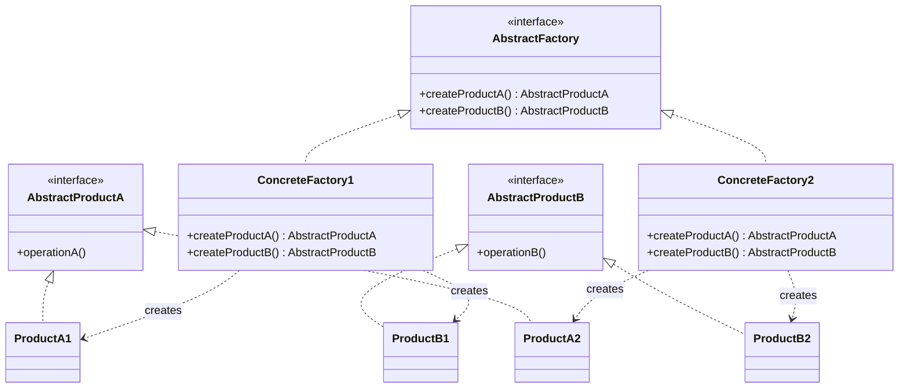
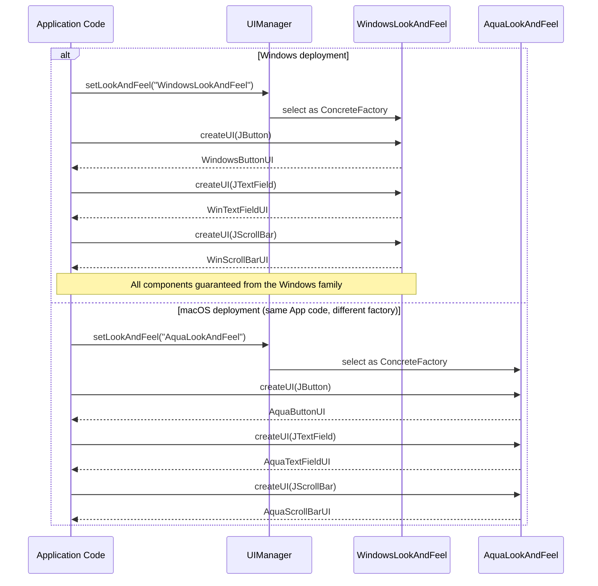

# Abstract Factory Pattern

## 1. Pattern Name & Category

**Name:** Abstract Factory (also called Kit)
**Category:** Creational (GoF)
**GoF Classification:** Gang of Four — Creational Design Pattern
**Book Reference:** "Design Patterns: Elements of Reusable Object-Oriented Software" (Gamma et al., 1994)

---

## 2. Intent

Provide an interface for creating **families of related or dependent objects** without specifying their concrete classes.

---

## Intuition

> **One-line analogy**: Abstract Factory is like IKEA's furniture families — you choose a style (Scandinavian, Modern), and the whole set (table, chair, lamp) is guaranteed to match. You never mix and match incompatible pieces.

**Mental model**: When you need multiple related objects that must work together (Button + TextField + Dialog all need to be Mac-style or Windows-style), creating them individually risks mismatches. Abstract Factory gives you a factory interface where each concrete factory creates a complete, consistent family. Swap the factory, and everything produced by it automatically coheres.

**Why it matters**: Abstract Factory enforces product family consistency at the type system level. It's the pattern behind UI toolkits (swing, JavaFX themes), database drivers (all JDBC objects come from the same DriverManager), and cross-platform abstraction layers.

**Key insight**: The difference from Factory Method: Factory Method creates one product type; Abstract Factory creates a family of related products. If you're only dealing with one product, use Factory Method; use Abstract Factory when product compatibility matters.

---

## 3. Problem Statement

### The Problem
You need to create multiple objects that must be consistent with each other — they belong to the same "family." If you mix objects from different families, the system breaks or produces incorrect results.

### The Scenario
Consider building a cross-platform UI toolkit. Your application renders `Button`, `Checkbox`, and `TextField` components. But:

- On **Windows**, buttons look like Win32 buttons, checkboxes use Windows styling, text fields have Windows borders.
- On **macOS**, buttons use Aqua styling, checkboxes are macOS-styled, text fields have rounded corners.
- On **Linux**, all components use the GTK theme.

The problem: if you accidentally mix a macOS Button with a Windows Checkbox, the UI looks inconsistent or breaks entirely. You need to guarantee that all components come from the same platform family.

A second scenario: a database access layer where `Connection`, `Command`, and `Transaction` objects must all come from the same database driver (MySQL vs. PostgreSQL). Mixing a MySQL Connection with a PostgreSQL Command will fail at runtime.

### What We Need
1. A way to create multiple related objects at once.
2. A guarantee that all created objects belong to the same family.
3. The client code should work with any family without modification.

---

## 4. Solution

The Abstract Factory pattern:
1. Defines an **AbstractFactory interface** with a creation method for each product type.
2. Each **ConcreteFactory** implements the interface and creates a consistent family of products.
3. **AbstractProduct interfaces** define what each product type can do.
4. **ConcreteProducts** implement the AbstractProduct interfaces — one per family.
5. **Client** is initialized with a factory and uses it exclusively — never calls `new`.

Swapping the factory object swaps the entire product family atomically.

---

## 5. UML Structure



ConcreteFactory1 realizes the "Family 1" set (ProductA1 + ProductB1); ConcreteFactory2 realizes the "Family 2" set (ProductA2 + ProductB2) — the dashed `creates` arrows show which concrete products each factory is wired to, and the two families never cross.

**Key relationship:** Products from the same ConcreteFactory are designed to work together.

---

## 6. How It Works — Step by Step

1. **Define product interfaces** for each type of object the system needs (Button, Checkbox, etc.).
2. **Define ConcreteProducts** for each family × product type combination (WindowsButton, MacButton, etc.).
3. **Define the AbstractFactory** interface with one creation method per product type.
4. **Implement ConcreteFactories** — one per family — each creating consistent products.
5. **Client is initialized** with an AbstractFactory (injected, passed via constructor, or selected from config).
6. **Client calls factory.createButton()** — gets back an AbstractButton. It never knows or cares which concrete type it received.
7. **Client can call factory.createCheckbox()** — guaranteed to be from the same family as the button.
8. To switch families, pass a different ConcreteFactory to the client — zero client code changes.

---

## 7. Key Components

| Component | Role |
|-----------|------|
| `AbstractFactory` | Interface declaring creation methods for each product type |
| `ConcreteFactory` | Implements AbstractFactory; creates a consistent family of products |
| `AbstractProduct` | Interface for one type of product |
| `ConcreteProduct` | A specific product belonging to one family |
| `Client` | Uses factories and products exclusively through abstract interfaces |

---

## 8. When to Use

- **Platform-independent code:** UI toolkits, rendering engines, database drivers where components must be consistent.
- **Product families:** When the system must use objects from one of several families and must enforce that they work together.
- **Configuration-driven family selection:** At startup, read config/environment and select the appropriate factory — all downstream code is agnostic.
- **Multiple themes or variants:** Applications with light/dark mode, premium/free tiers, or locale-specific behavior.
- **Testing with test doubles:** Pass a `MockFactory` or `FakeFactory` to inject test doubles for all products at once.
- **Plugin systems:** Third parties implement `AbstractFactory` to provide their product family; the core system accepts any conforming factory.

---

## 9. When NOT to Use

- **When you only have one product type:** Use Factory Method instead — Abstract Factory is overkill for a single object.
- **When families change frequently:** Adding a new product type to the factory requires changing the AbstractFactory interface AND every ConcreteFactory — this is a costly modification.
- **When products don't need to be consistent:** If mixing types from different families is fine, there's no need to enforce family consistency.
- **Simple applications:** The pattern introduces significant structure. For simple apps, direct instantiation or a simple factory is more appropriate.

---

## 10. Pros

- **Family consistency:** Enforces that products from the same factory work together — eliminates incompatibility bugs.
- **Open/Closed Principle:** New families can be added by creating a new ConcreteFactory without changing client code.
- **Swappable families:** Changing the factory object swaps the entire product family atomically.
- **Loose coupling:** Client is decoupled from all concrete product classes.
- **Single Responsibility:** Each ConcreteFactory knows how to create one family; each ConcreteProduct knows its own behavior.
- **Easy testing:** Pass a test factory to inject fakes/mocks for all products simultaneously.

---

## 11. Cons

- **New product types are expensive:** Adding a new product type (e.g., ScrollBar) requires changing the AbstractFactory interface, all ConcreteFactories, and potentially all clients. This is a breaking change.
- **Class explosion:** For N families and M product types, you need N×M concrete product classes plus N concrete factories.
- **Complexity:** Significantly more structure than direct instantiation. Can be over-engineering for simple scenarios.
- **Rigid product type set:** The set of products a factory creates is fixed in the interface — extending it is not open/closed.
- **Potential over-abstraction:** Sometimes developers reach for Abstract Factory when a simpler pattern (Factory Method, Builder) would suffice.

---

## 12. Tradeoffs

| You Gain | You Lose |
|----------|----------|
| Family consistency (objects work together) | Easy extensibility of product types |
| Full client decoupling | Simple structure (class count grows as N×M) |
| Atomic family swap | Flexibility to mix products from different families |
| Testability via factory injection | Low overhead — this is a heavy-weight pattern |
| Open/Closed for new families | Open/Closed for new product types (adding a type breaks all factories) |

**The core tradeoff:** Abstract Factory excels at the "new families" dimension but struggles with the "new product types" dimension. The inverse of Factory Method's tradeoff.

---

## 13. Common Pitfalls

1. **Confusing with Factory Method:** Abstract Factory creates *families of objects*. Factory Method creates *one object* and defers the type to subclasses. Abstract Factory often uses Factory Methods internally.

2. **Adding product types breaks the interface:** When you add a new method to AbstractFactory, every ConcreteFactory must implement it. Plan your product type set carefully upfront.

3. **Using it for a single product:** If you only have one product type, use Factory Method. Abstract Factory's value is in managing multiple related product types.

4. **Putting construction logic in the factory:** Factories should do minimal work — create and return. Complex configuration belongs in a builder or the product's own initialization.

5. **Not making products depend on each other correctly:** The whole point of Abstract Factory is that Family-1 products are designed to work together. If your concrete products don't actually interact, you may not need this pattern.

6. **Ignoring the interface segregation for factories:** If some clients only need some products, consider splitting the AbstractFactory into smaller, focused interfaces.

---

## 14. Real-World Usage

### Production Scenario: Swing LookAndFeel as Cross-Platform UI Abstract Factory

Java Swing's `LookAndFeel` system is the most widely deployed Abstract Factory implementation in
the Java ecosystem. `UIManager.setLookAndFeel()` selects a factory; every subsequent call to
`UIManager.getUI(component)` creates a component renderer from that factory's product family.
At Oracle, Swing rendered tens of thousands of enterprise desktop applications across Windows,
macOS, and Linux with a single codebase. The guarantee: all components rendered in any one JVM
come from the same platform family — no mixing of Windows buttons with macOS scrollbars.

`javax.swing.LookAndFeel` is the AbstractFactory. Its concrete implementations
(`WindowsLookAndFeel`, `MetalLookAndFeel`, `NimbusLookAndFeel`, `AquaLookAndFeel`) each produce
a consistent family of `ComponentUI` objects: `ButtonUI`, `TextFieldUI`, `ScrollBarUI`, etc.



Swapping the `setLookAndFeel()` call is the only change between the two deployments — every subsequent `createUI()` call is guaranteed to return a component from that one family; reaching across families (e.g. an `AquaButtonUI` inside a Windows-family render) risks visual inconsistency and a `ClassCastException`.

### Famous Codebase Usages

| Framework / Library | Abstract Factory | Concrete Factories | Product Families |
|--------------------|-----------------|-------------------|--------------------|
| `javax.swing.LookAndFeel` | `LookAndFeel.getDefaults()` + `UIManager` | `WindowsLookAndFeel`, `NimbusLookAndFeel`, `AquaLookAndFeel`, `MetalLookAndFeel` | `ButtonUI`, `TextFieldUI`, `ScrollBarUI`, `TableUI` |
| JDBC (java.sql) | `java.sql.Driver.connect()` + `Connection` | MySQL Driver, PostgreSQL Driver, Oracle Driver | `Connection`, `Statement`, `PreparedStatement`, `ResultSet` |
| `javax.xml.parsers` | `DocumentBuilderFactory`, `SAXParserFactory` | Xerces, Crimson, JDK built-in | `DocumentBuilder`, `SAXParser`, `Transformer` |
| AWS SDK v2 | `SdkHttpClient` / transport factory | `ApacheHttpClient`, `UrlConnectionHttpClient`, `NettyNioAsyncHttpClient` | HTTP client, request executor, response decoder |
| Spring Framework 6 | `ApplicationContext` creates related bean families | `AnnotationConfigApplicationContext`, `WebApplicationContext`, `ReactiveWebApplicationContext` | `BeanFactory`, `Environment`, `ResourceLoader`, `MessageSource` |

### Production-Grade Code: Cross-Platform Notification System (Java 17 LTS)

```java
// Java 17 LTS — Abstract Factory for cross-platform notification delivery.
// In production at a fintech company: production uses SendGrid (email) + Twilio (SMS);
// staging uses log-based fakes; tests use in-memory captures.
// Switching environments = swapping the factory. Zero client code changes.

// --- Abstract Products ---

public interface EmailSender {
    void send(String to, String subject, String body);
}

public interface SmsSender {
    void send(String phoneNumber, String message);
}

public interface AuditLogger {
    void log(String event, String recipient, boolean success);
}

// --- Abstract Factory ---

public interface NotificationFactory {
    EmailSender createEmailSender();
    SmsSender   createSmsSender();
    AuditLogger createAuditLogger();
}

// --- ConcreteFactory 1: Production (SendGrid + Twilio + CloudWatch) ---

public class ProductionNotificationFactory implements NotificationFactory {
    private final String sendGridApiKey;
    private final String twilioAccountSid;
    private final String twilioAuthToken;

    public ProductionNotificationFactory(String sendGridApiKey,
                                         String twilioAccountSid,
                                         String twilioAuthToken) {
        this.sendGridApiKey    = sendGridApiKey;
        this.twilioAccountSid  = twilioAccountSid;
        this.twilioAuthToken   = twilioAuthToken;
    }

    @Override
    public EmailSender createEmailSender() {
        return new SendGridEmailSender(sendGridApiKey);
        // SendGridEmailSender: HTTP call to https://api.sendgrid.com/v3/mail/send
        // p99 delivery acknowledgement: 120ms; retry on 429/503 with exponential backoff
    }

    @Override
    public SmsSender createSmsSender() {
        return new TwilioSmsSender(twilioAccountSid, twilioAuthToken);
        // TwilioSmsSender: HTTP call to https://api.twilio.com/2010-04-01/Accounts/.../Messages
        // p99: 80ms; cost: $0.0079/SMS
    }

    @Override
    public AuditLogger createAuditLogger() {
        return new CloudWatchAuditLogger("notification-audit");
        // Emits structured JSON to CloudWatch; p99 put-log: 5ms; asynchronous
    }
}

// --- ConcreteFactory 2: In-Memory Test Factory ---

public class InMemoryNotificationFactory implements NotificationFactory {
    // Capture sent notifications for assertion in tests
    private final List<String> emailLog = new ArrayList<>();
    private final List<String> smsLog   = new ArrayList<>();
    private final List<String> auditLog = new ArrayList<>();

    @Override
    public EmailSender createEmailSender() {
        return (to, subject, body) -> emailLog.add("EMAIL to=" + to + " subject=" + subject);
    }

    @Override
    public SmsSender createSmsSender() {
        return (phone, message) -> smsLog.add("SMS to=" + phone + " msg=" + message);
    }

    @Override
    public AuditLogger createAuditLogger() {
        return (event, recipient, success) ->
            auditLog.add("AUDIT event=" + event + " recipient=" + recipient + " ok=" + success);
    }

    // Test assertion helpers
    public List<String> getEmailLog() { return Collections.unmodifiableList(emailLog); }
    public List<String> getSmsLog()   { return Collections.unmodifiableList(smsLog); }
    public List<String> getAuditLog() { return Collections.unmodifiableList(auditLog); }
}

// --- Client: NotificationService — zero coupling to concrete products ---

public class NotificationService {
    private final EmailSender emailSender;
    private final SmsSender   smsSender;
    private final AuditLogger auditLogger;

    // Factory injected at construction; client never calls new SendGridEmailSender()
    public NotificationService(NotificationFactory factory) {
        this.emailSender = factory.createEmailSender();
        this.smsSender   = factory.createSmsSender();
        this.auditLogger = factory.createAuditLogger();
    }

    public void notifyUser(String email, String phone, String subject, String message) {
        try {
            emailSender.send(email, subject, message);
            smsSender.send(phone, message);
            auditLogger.log("USER_NOTIFIED", email, true);
        } catch (Exception e) {
            auditLogger.log("USER_NOTIFIED_FAILED", email, false);
            throw e;
        }
    }
}
```

### Anti-Pattern 1: if-else Chain Instead of Abstract Factory — O(n) Platform Maintenance

```java
// BROKEN: every new platform (Slack, WhatsApp, Discord) requires editing this class.
// Adding Slack notifications = touching OrderService, PaymentService, AuthService...
// This has O(n×m) edit cost where n=platforms, m=services that send notifications.
public class BadNotificationDispatcher {
    public void notify(String platform, String recipient, String message) {
        if ("email".equals(platform)) {
            new SendGridEmailSender(API_KEY).send(recipient, "Notification", message);
        } else if ("sms".equals(platform)) {
            new TwilioSmsSender(SID, TOKEN).send(recipient, message);
        } else if ("slack".equals(platform)) {
            new SlackNotifier(WEBHOOK).post(recipient, message);
            // Adding Slack required editing this class AND creating SlackAuditLogger
            // AND wiring it in every caller that references BadNotificationDispatcher
        }
        // Adding WhatsApp = edit this class again, test all branches again
    }
}
```

```java
// FIX: add a new platform by adding one new ConcreteFactory class — zero edits to existing code.
public class SlackNotificationFactory implements NotificationFactory {
    private final String webhookUrl;
    private final String botToken;

    public SlackNotificationFactory(String webhookUrl, String botToken) {
        this.webhookUrl = webhookUrl;
        this.botToken   = botToken;
    }

    @Override
    public EmailSender createEmailSender() {
        // Slack doesn't do email; log a warning and no-op
        return (to, subject, body) ->
            System.err.println("WARN: email not supported via Slack factory, skipping to=" + to);
    }

    @Override
    public SmsSender createSmsSender() {
        return new SlackSmsBridge(webhookUrl, botToken); // posts to a Slack channel instead
    }

    @Override
    public AuditLogger createAuditLogger() {
        return new SlackAuditLogger(webhookUrl, "#audit-log");
    }
}
// NotificationService, OrderService, PaymentService: UNCHANGED.
```

### Anti-Pattern 2: Mixing Products from Different Families

```java
// BROKEN: mixing AWS and GCP storage objects — their authentication, retry, and
// serialization contracts are incompatible. This causes runtime errors at scale.
public class BrokenStorageClient {
    private final S3Client s3Client;      // AWS family
    private final GcsClient gcsClient;   // GCP family — incompatible auth

    public void upload(byte[] data, String key) {
        // AWS S3 request signed with AWS SigV4, GCS request signed with OAuth2
        // Mixing these in one flow causes 403 Forbidden at runtime on every request
        s3Client.putObject(key, data);   // AWS
        gcsClient.upload(key, data);     // GCP — different auth, different error codes
    }
}
```

```java
// FIX: Abstract Factory ensures all storage objects come from one cloud family.
public interface CloudStorageFactory {
    ObjectStorage createObjectStorage();
    MetadataStore  createMetadataStore();
    AuditSink      createAuditSink();
}

public class AwsStorageFactory implements CloudStorageFactory {
    @Override public ObjectStorage createObjectStorage() { return new S3ObjectStorage(region, bucket); }
    @Override public MetadataStore  createMetadataStore()  { return new DynamoMetadataStore(tableName); }
    @Override public AuditSink      createAuditSink()      { return new CloudTrailAuditSink(); }
}
// All products guaranteed to use SigV4 auth, AWS error codes, us-east-1 region.
```

### Anti-Pattern 3: Adding a New Product Type to the Abstract Factory Interface

```java
// WARNING: adding PushSender to NotificationFactory BREAKS all existing ConcreteFactories.
// Every factory (ProductionNotificationFactory, InMemoryNotificationFactory,
// SlackNotificationFactory) must implement the new method or fail to compile.
// This is the known limitation of Abstract Factory — plan product types upfront.

public interface NotificationFactory {
    EmailSender createEmailSender();
    SmsSender   createSmsSender();
    AuditLogger createAuditLogger();
    PushSender  createPushSender(); // NEW: breaks all 3 existing ConcreteFactories
}
```

```java
// MITIGATION: provide a default method to minimize breakage for factories that
// don't need the new product type (Java 8+ interface default methods).
public interface NotificationFactory {
    EmailSender createEmailSender();
    SmsSender   createSmsSender();
    AuditLogger createAuditLogger();

    // Default no-op push sender — existing factories opt-in by overriding
    default PushSender createPushSender() {
        return (deviceToken, payload) -> { /* no-op */ };
    }
}
// Only factories that support push notifications override createPushSender().
// Existing InMemoryNotificationFactory and SlackNotificationFactory compile unchanged.
```

### AWS SDK v2 Transport Factory: Real-World Abstract Factory

AWS SDK v2 uses an internal `SdkHttpClientFactory` abstraction. `ApacheHttpClient`,
`UrlConnectionHttpClient`, and `NettyNioAsyncHttpClient` are concrete factories. Each produces
a consistent family: HTTP request executor, connection manager, response parser, retry handler.

```java
// Java 17 LTS, AWS SDK v2 (2.x) — selecting the HTTP transport factory
// SdkHttpClient acts as Product; the builder acts as the Abstract Factory
import software.amazon.awssdk.http.apache.ApacheHttpClient;
import software.amazon.awssdk.http.urlconnection.UrlConnectionHttpClient;
import software.amazon.awssdk.services.s3.S3Client;

// Production: Apache HttpClient — connection pooling, keep-alive, retry interceptors
S3Client s3WithApache = S3Client.builder()
    .httpClientBuilder(ApacheHttpClient.builder()
        .maxConnections(200)                   // 200 pooled connections
        .connectionTimeout(Duration.ofSeconds(5))
        .socketTimeout(Duration.ofSeconds(30)))
    .build();

// Lambda / lightweight: UrlConnectionHttpClient — no external deps, lower overhead
S3Client s3WithUrlConn = S3Client.builder()
    .httpClientBuilder(UrlConnectionHttpClient.builder()
        .connectionTimeout(Duration.ofSeconds(3))
        .socketTimeout(Duration.ofSeconds(15)))
    .build();
// Both S3Clients expose identical S3Client interface — caller code is identical.
// Only the transport family differs: Apache vs. JDK URLConnection internals.
```

### Performance Numbers

- Swing LookAndFeel factory resolution: `UIManager.getUI(component)` adds ~5 microseconds per
  component render on first call; subsequent calls hit a `UIDefaults` cache in ~200 nanoseconds.
- AWS SDK v2 ApacheHttpClient at 2,000 S3 requests/sec: connection pool of 200 eliminates
  TCP handshake overhead (each handshake = ~10ms); steady-state p99 < 40ms per request.
- InMemoryNotificationFactory in unit tests: ~10 nanoseconds per send() call vs. ~120ms for
  real SendGrid HTTP call — 12 million times faster, enabling 10,000+ test cases per second.

### Migration Story: When to Adopt Abstract Factory and When to Abandon It

**Adopt Abstract Factory** when:
- Your codebase has 3+ if-else chains checking the same environment/platform variable
  to construct related objects. Each chain is an Abstract Factory waiting to be extracted.
- You need to support multiple cloud providers (AWS, GCP, Azure) or multiple notification
  channels with the guarantee that no family mixing occurs.
- Integration test speed is degraded by real external calls that could be replaced by
  an in-memory ConcreteFactory — test runtime drops from minutes to seconds.

**Abandon or simplify Abstract Factory** when:
- You have only one real ConcreteFactory and the pattern exists "for future extensibility"
  that never materializes. Two years later, the abstraction is overhead with no benefit.
- A Spring Boot 3.x `@Profile`-based configuration swap (`@Profile("prod")` vs
  `@Profile("test")`) achieves the same family switching with zero custom factory code.
- Your product type set grows frequently (new notification channels every month). The
  interface-change cost is too high; consider a plugin registry pattern instead.

---

## 15. Comparison with Similar Patterns

| Pattern | How It Differs from Abstract Factory |
|---------|--------------------------------------|
| **Factory Method** | Creates one object type; uses inheritance. Abstract Factory creates multiple related object types; uses composition. |
| **Builder** | Constructs one complex object step-by-step. Abstract Factory creates multiple different objects in one call per type. |
| **Prototype** | Clones existing objects; doesn't use a factory class hierarchy. |
| **Singleton** | Ensures one instance. Often used to implement the Abstract Factory (factories are often singletons). |
| **Service Locator** | Looks up existing services; Abstract Factory creates new product instances. |

---

## 16. Interview Tips

**Common Interview Questions:**

1. **"When would you choose Abstract Factory over Factory Method?"**
   Answer: When you have multiple related product types that must be created together and must be consistent. Factory Method is for one product type; Abstract Factory is for a whole family. Give the platform UI example.

2. **"What's the biggest limitation of Abstract Factory?"**
   Answer: Adding a new product type to the factory requires changing the abstract interface and all concrete factories — a potentially breaking change. This is why you should plan the product type set carefully.

3. **"How is JDBC related to Abstract Factory?"**
   Answer: Each JDBC driver acts as a concrete factory. `Connection`, `Statement`, and `ResultSet` are product families. `DriverManager.getConnection()` returns a driver-specific Connection, and all subsequent objects created from it are from the same driver family.

4. **"How do you swap families at runtime?"**
   Answer: Since clients depend only on AbstractFactory and AbstractProduct, you simply pass in a different ConcreteFactory. All product creation calls through that factory will return the new family's objects.

5. **"Abstract Factory vs. Factory Method — give me a concrete example where you'd need the former but not the latter."**
   Answer: Use Abstract Factory when creating an object requires *other related objects from the same family* to be consistent; use Factory Method when you're only ever creating one type of object. Concrete example: a cross-platform UI toolkit needs `Button`, `Checkbox`, and `TextField` to all be Windows-styled or all macOS-styled together — a single Factory Method (`createButton()`) on its own can't enforce that the Checkbox and TextField created elsewhere match, so you need an `AbstractFactory` with `createButton()`, `createCheckbox()`, and `createTextField()` all implemented by the same `WindowsFactory` or `MacFactory`. By contrast, a logging framework that only ever needs to produce one `Logger` instance per configuration has no "family" to keep consistent — a single Factory Method on a `LoggerFactory` is sufficient and Abstract Factory would be over-engineering.

6. **"How does Abstract Factory enable swapping entire product families at runtime — walk through the JDBC driver example."**
   Answer: The application code is written entirely against `java.sql.Connection`, `Statement`, `PreparedStatement`, and `ResultSet` — the AbstractProduct interfaces — and never imports `com.mysql.cj.jdbc.*` or `org.postgresql.*` directly. At startup, `DriverManager.getConnection(jdbcUrl, ...)` picks the registered `Driver` (the ConcreteFactory) whose `acceptsURL()` matches the URL scheme, and from that point on every `Statement`, `PreparedStatement`, and `ResultSet` created from that `Connection` belongs to the same driver family — switching from MySQL to PostgreSQL in production is a one-line change to the JDBC URL and driver dependency, with zero changes to DAO or repository code. This is the same mechanism behind Swing's `LookAndFeel`: `UIManager.setLookAndFeel(...)` swaps the entire `ButtonUI`/`TextFieldUI`/`ScrollBarUI` family in one call, and every subsequently rendered component picks up the new family automatically.

7. **"How do you test code that depends on an Abstract Factory?"**
   Answer: Inject a test-double `ConcreteFactory` (e.g., `InMemoryNotificationFactory`) that returns fakes/stubs for every product method — since the client (`NotificationService`) depends only on the `NotificationFactory` interface, constructing it with the in-memory factory in a unit test requires zero mocking framework setup and exercises the exact same code path as production. The key benefit over mocking each product individually with Mockito is that the *whole family* swaps atomically and consistently — you don't risk a test where `EmailSender` is mocked but `AuditLogger` accidentally hits the real CloudWatch client. As a concrete number from the example in this module: `InMemoryNotificationFactory.createEmailSender().send()` runs in ~10 nanoseconds vs. ~120ms for a real SendGrid HTTP call — a 12-million-times speedup that makes 10,000+ test cases per second feasible.

8. **"What is the 'static factory of factories' anti-pattern?"**
   Answer: This is when a class exposes a static method like `FactoryProvider.getFactory(String env)` that internally does an `if-else`/`switch` to `new` up and return the right `ConcreteFactory` — it looks like dependency injection but is actually a hidden global `Service Locator` with the same testability problems as Singleton: callers invoke the static method directly, so the dependency on "which factory" is invisible from constructors and can't be swapped per-test without static-state hacks. The fix is to let a DI container (Spring's `@Profile`-based `@Configuration` classes, or a manually-wired composition root) decide which `ConcreteFactory` implementation to instantiate and inject it as a constructor argument — the selection logic moves from a static method body to bean wiring, which is overridable per test context via `@TestConfiguration` or `@ActiveProfiles`.

9. **"How does Abstract Factory combine with a Dependency Injection container?"**
   Answer: In practice, most DI containers make hand-rolled Abstract Factories partially redundant for the "family selection" use case — Spring's `@Profile("aws")` vs `@Profile("gcp")` `@Configuration` classes, each declaring `@Bean` methods for `ObjectStorage`, `MetadataStore`, and `AuditSink`, achieve the same "swap the whole family by changing one setting" outcome as an `AwsStorageFactory`/`GcpStorageFactory` pair, but with the container doing the wiring instead of application code calling `factory.createX()`. Where Abstract Factory still earns its place alongside DI is when the family must be selected *dynamically at runtime* based on data the container doesn't have at startup (e.g., per-tenant cloud provider in a multi-tenant SaaS) — there, you inject a `Map<String, CloudResourceFactory>` (Spring auto-wires all beans of a type into a map keyed by bean name) and select the factory by tenant ID at request time, combining DI's wiring with Abstract Factory's runtime family-consistency guarantee.

10. **"If you add a new product type (e.g., `ScrollBar`) to an existing Abstract Factory, what breaks, and how do you minimize the blast radius?"**
   Answer: Adding `createScrollBar()` to the `AbstractFactory` interface is a breaking change for every existing `ConcreteFactory` — `WindowsFactory`, `MacFactory`, `InMemoryTestFactory`, and any third-party plugin factories all fail to compile until they implement the new method. The standard mitigation in Java 8+ is a `default` method on the interface that returns a safe no-op or a sensible fallback (e.g., `default ScrollBarUI createScrollBar() { return new NullScrollBarUI(); }`), so existing factories continue to compile unchanged and only opt in to the new product type by overriding the default when ready. The deeper lesson for an interview: this asymmetry — "new families are cheap (add a ConcreteFactory), new product types are expensive (touch every ConcreteFactory)" — should drive your upfront design discussion about which dimension (families vs. product types) is more likely to grow in this particular system.

**Key Phrases:**
- "Family of related objects"
- "Consistency guarantee across product types"
- "Composition over inheritance (vs. Factory Method)"
- "Swap entire product family by swapping the factory"

---

## Cross-Perspective: HLD Connections

**HLD View — Where Abstract Factory Appears in Distributed Systems**

- **Multi-cloud infrastructure** — A `CloudResourceFactory` interface produces families of related resources (`createVM()`, `createStorage()`, `createLoadBalancer()`). `AWSFactory`, `GCPFactory`, `AzureFactory` implement it. Switching clouds means swapping the factory, not the entire codebase.
- **Database driver families** — A `DatabaseFactory` produces a consistent family: `createConnection()`, `createQueryBuilder()`, `createMigrationRunner()`. MySQL and PostgreSQL families implement it, letting the application run on either without per-component conditionals.
- **Notification channel families** — `EmailNotificationFactory` and `SMSNotificationFactory` each produce a `Sender`, `Formatter`, and `Tracker` that are guaranteed to work together. Mixing components across families causes mismatches.
- **Test vs production infrastructure** — A `MockInfraFactory` produces in-memory fakes for all external dependencies in tests; `ProductionInfraFactory` produces real clients. The application code never changes between environments.

---

## 17. Best Practices

1. **Define product interfaces carefully upfront** — the set of product types in AbstractFactory is hard to change later. Spend time on this.

2. **Use composition:** Pass the factory as a constructor argument or inject it — don't use a static/singleton factory if you want testability.

3. **Keep factory methods minimal** — a factory method should return a new (or appropriately shared) product, nothing else.

4. **One ConcreteFactory per family** — resist the temptation to put conditional logic inside a factory. Create separate ConcreteFactories.

5. **Document family constraints** — make it clear in comments/javadoc which products are expected to work together.

6. **Consider making factories singletons** — since factories are stateless in most implementations, a single instance per family is sufficient. Use a DI container for this.

7. **Pair with Abstract Factory in tests** — provide a `FakeFactory` or `MockFactory` that returns in-memory, fast implementations of all products.

8. **Consider the Abstract Factory + Builder combination** — when individual products are complex to construct, have the Abstract Factory return a Builder for each product type.
