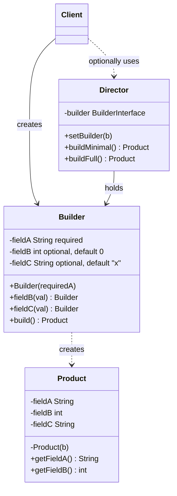
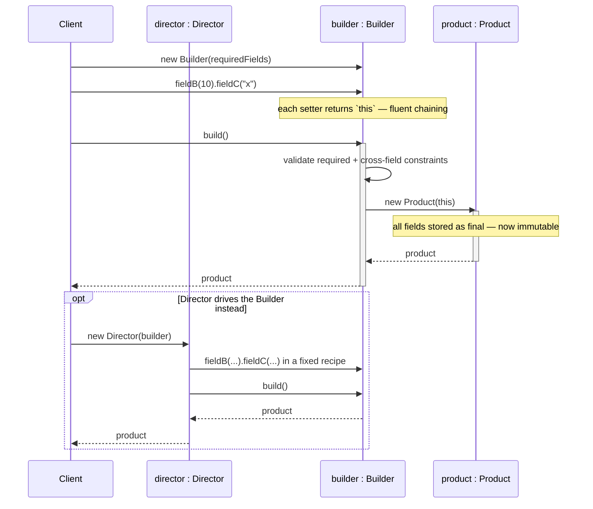

# Builder Pattern

## 1. Pattern Name & Category

**Name:** Builder
**Category:** Creational (GoF)
**GoF Classification:** Gang of Four — Creational Design Pattern
**Book Reference:** "Design Patterns: Elements of Reusable Object-Oriented Software" (Gamma et al., 1994)

---

## 2. Intent

Separate the construction of a complex object from its representation so that the same construction process can create different representations.

---

## Intuition

> **One-line analogy**: Builder is like ordering a custom sandwich — you specify each ingredient step by step, and the final product is assembled only when you say "done." You can skip ingredients, add extras, and the order doesn't matter.

**Mental model**: A constructor with 10 parameters is a maintenance nightmare — which parameter is which? Builder replaces it with a fluent API: `Person.builder().name("Alice").age(30).email("a@b.com").build()`. Each setter returns `this` (the builder), enabling method chaining. The `build()` method performs validation and creates the final immutable object. This solves the "telescoping constructor" anti-pattern.

**Why it matters**: Builder is ubiquitous in Java/Kotlin APIs — Retrofit, OkHttp, AlertDialog, and most modern libraries use it. It makes complex object construction readable, validates object state before creation, and supports optional fields cleanly (just don't set them).

**Key insight**: Builder shines when objects have many optional parameters. Lombok's `@Builder` and Kotlin's named parameters show that the pattern's core problem (named optional arguments) can also be solved at the language level, reducing explicit Builder use in modern languages.

---

## 3. Problem Statement

### The Core Problem
Some objects require many parameters to construct. When most parameters are optional, developers resort to one of two bad approaches:

**Telescoping constructors** — overloaded constructors for every combination:
```java
new Pizza("Large", "Thin")
new Pizza("Large", "Thin", "Extra Cheese")
new Pizza("Large", "Thin", "Extra Cheese", "Mushrooms")
new Pizza("Large", "Thin", "Extra Cheese", "Mushrooms", true, false)
```
With 8 optional toppings, you'd need dozens of overloads. Adding a 9th topping is a major refactor. Callers must count positional arguments and guess which boolean is which.

**JavaBeans pattern** — default constructor plus setters:
```java
Pizza p = new Pizza();
p.setSize("Large");
p.setCrust("Thin");
p.addTopping("Cheese");
// ...object is usable but NOT fully constructed here
p.setBaked(true);
```
This forces the object to be mutable (no `final` fields), leaves it in an inconsistent intermediate state during construction, and cannot enforce required fields.

### The Scenario
You're building an HTTP client library. Each request has: method (required), URL (required), headers (optional, many), query params (optional, many), body (optional), content-type (optional), connect timeout (optional, default 5s), read timeout (optional, default 30s), auth token (optional), retry policy (optional), follow-redirects flag (optional). A constructor would need 11+ parameters — unreadable and unmaintainable. Setters would allow partial construction and mutable requests in transit.

### What We Need
1. A readable, fluent API that names each parameter at the call site.
2. Required fields enforced at construction time.
3. Optional fields with sensible defaults.
4. The final product is immutable — once built, it cannot be changed.
5. Complex cross-field validation (e.g., GET requests must not have a body) runs once at build time.

---

## 4. Solution

Introduce a static nested `Builder` class inside the product:
1. The **Builder's constructor** accepts only required parameters.
2. **Fluent setter methods** set optional parameters and return `this` for chaining.
3. A terminal **`build()` method** validates all fields and constructs the immutable product.
4. The product's **own constructor is private** — only the Builder can create it.

Optionally, a **Director** can pre-define common builder configurations (recipes) for frequently needed objects.

---

## 5. UML Structure



*`Builder` is a static nested class inside `Product` — the only code path to its private constructor. All of `Product`'s fields are `final`; `Builder`'s required field has no default while its optional fields do, and `fieldB()`/`fieldC()` return `Builder` (not `void`) so calls chain fluently. `build()` is the sole place that validates and constructs the immutable `Product`. `Director` is optional: in the modern Java idiom used throughout this file, the client calls the Builder directly and skips it entirely.*

**Relationships:**
- `Builder` is a static nested class inside `Product` (preferred modern idiom) OR a separate top-level class.
- `Director` holds a `Builder` reference and defines construction recipes.
- `Client` creates a `Builder`, optionally passes it to a `Director`, then calls `build()`.

---

## 6. How It Works — Step by Step

1. **Client creates a Builder**, passing required fields to its constructor.
2. **Client chains optional setter calls** on the Builder. Each setter returns `this`, enabling fluent chaining: `.fieldB(10).fieldC("x")`.
3. **Client calls `build()`**, which is the terminal operation.
4. **`build()` runs validation**: are all required fields present? Are cross-field constraints satisfied?
5. **`build()` calls `new Product(this)`** — the product's private constructor reads fields from the Builder.
6. **Product stores all fields as `final`** — it is now immutable.
7. **Client receives a complete, valid, immutable Product**.

If a Director is used:
- Director receives the Builder and calls setter methods in a predefined order.
- Director defines reusable "recipes" like `buildMinimalProduct()` or `buildFullProduct()`.
- Director calls `builder.build()` and returns the finished product.

**Runtime collaboration:**



*Steps 1–3 show the client driving the Builder directly (the modern idiom); step 4's validation is the only place invariants are enforced, and step 5's `new Product(this)` is the sole call to the private constructor. The optional `Director` branch changes who calls the setters but never bypasses `build()`'s validation.*

---

## 7. Key Components

| Component | Role |
|-----------|------|
| **Product** | The complex object being built. Has a private constructor; all fields are `final`. |
| **Builder** | Accumulates configuration step-by-step. Enforces required fields in its constructor. Returns `this` from setters for fluent chaining. Validates and constructs the Product in `build()`. |
| **Director** (optional) | Encapsulates pre-defined construction recipes. Takes any compatible Builder and calls its methods in a fixed sequence. Useful when the same construction logic is reused in many places. |
| **BuilderInterface** (optional) | Abstraction over multiple concrete builders — enables the same Director to produce different Product representations. |

---

## 8. Pros

- **Readable construction**: Named setter calls (`connectTimeout(5000).readTimeout(30000)`) are far clearer than positional arguments.
- **Required vs. optional separation**: Required fields go in the Builder constructor; optional fields have defaults.
- **Immutable products**: The final Product can have all-`final` fields, which is impossible with the JavaBeans setter pattern.
- **Cross-field validation in one place**: `build()` validates all constraints atomically before the object exists — no partially valid state.
- **Same construction process, different representations**: Swap in a different ConcreteBuilder to produce a different type (e.g., XML report vs. JSON report from the same Director).
- **Open/Closed**: Adding a new optional field means adding one setter to the Builder; existing call sites continue to compile.

---

## 9. Cons

- **Verbose**: Each field requires a line in the Builder class. For truly simple objects (2–3 fields), a constructor is less code.
- **Duplication**: The Builder mirrors the Product's fields — keeping both in sync during refactoring is an extra maintenance burden.
- **Mutable intermediate state**: The Builder itself is mutable. If shared across threads during construction, it needs synchronization.
- **Cannot build in a loop without resetting**: A single Builder instance cannot be reused to build two different Products without resetting all optional fields.
- **Directory coupling**: If a Director hardcodes a specific construction sequence, it becomes tightly coupled to a particular use case.

---

## 10. Tradeoffs

| You Gain | You Lose |
|----------|----------|
| Immutable, fully-valid products | Extra Builder class (duplication of fields) |
| Named, readable construction API | More lines of boilerplate |
| Centralized cross-field validation | Mutable Builder during construction phase |
| Optional fields with defaults | Must keep Builder and Product fields in sync |
| Reusable Director recipes | Director coupling to specific construction sequences |

---

## 11. Common Pitfalls

1. **Forgetting validation in `build()`**: If `build()` does no validation, you gain readability but lose the safety guarantee. Always validate required fields and cross-field constraints in `build()`.

2. **Builder is not reset between builds**: If you re-use a Builder instance to create two objects, the second object inherits all settings from the first. Either create a new Builder each time, or add a `reset()` method.

3. **Mutable collections in the Builder**: `queryParams` is a `HashMap` in the Builder. Passing external maps directly into the product without defensive copying makes the product's state mutable from outside. Always do `Collections.unmodifiableMap(new HashMap<>(builder.map))` in the product.

4. **Returning `Product` instead of `Builder` from setters**: A setter that returns `void` or `Product` instead of `Builder` breaks the fluent chain and forces clients to use temporary variables.

5. **Putting business logic in the Builder**: The Builder's job is to accumulate and validate configuration. Business logic belongs in the Product or its service layer.

6. **Not using the nested Builder idiom for inner access**: Keeping the Builder as a static nested class allows it to access the Product's private constructor — preventing external instantiation while keeping the API clean.

7. **Thread safety**: A Builder is not thread-safe by design. Never share a single Builder instance across threads. Each thread should use its own Builder instance.

---

## 12. When to Use

- **Many constructor parameters** (the "telescoping constructor" problem): more than 3–4 parameters, especially when most are optional.
- **Immutable objects with optional fields**: when you want `final` fields but have many optional settings.
- **Same construction steps, different representations**: generating XML, JSON, and HTML reports from the same data using interchangeable builders.
- **Step-by-step construction must be controlled**: e.g., a query builder where certain clauses must be added in order.
- **Validation across multiple fields**: cross-field invariants that can only be checked when all fields are known.

---

## 13. When NOT to Use

- **Simple objects with 2–3 fields**: a constructor is less code and equally readable.
- **Object state must change after creation**: if the object is inherently mutable (e.g., a `Session`), a builder adds ceremony without benefit.
- **Performance-critical hot paths**: Builder allocates an intermediate object on every construction. In tight loops building millions of tiny objects, the GC overhead may matter.
- **When DI frameworks manage construction**: in Spring applications, beans are constructed by the container. Builder pattern is redundant for container-managed beans.

---

## 14. Comparison with Factory Patterns

| Aspect | Builder | Factory Method | Abstract Factory |
|--------|---------|----------------|------------------|
| **Focus** | HOW a complex object is constructed step-by-step | WHICH class to instantiate | WHICH family of related objects to create |
| **Product complexity** | Complex, many optional parts | Single product, typically simple | Multiple related products |
| **Control** | Client controls construction steps | Subclass decides the concrete type | Factory decides the entire product family |
| **Result** | One complex product | One product | Multiple related products |
| **Director** | Optional orchestrator of steps | No equivalent | No equivalent |
| **Use case** | HTTP Request, Pizza, SQL query | Logger, Button, Transport | UI theme, Database driver family |

**Key distinction**: Builder is about constructing a single complex object through a sequence of steps. Factory Method and Abstract Factory are about deciding *which class* to instantiate. A Builder can use Factory Methods internally to create sub-components.

---

## 15. Real-World Examples

### Production Scenario: Protocol Buffers Message.Builder at Google Scale

Protocol Buffers (protobuf) is Google's language-neutral, platform-neutral serialization format.
Every gRPC service at Google, and the majority of gRPC services industry-wide, exchanges protobuf
messages. The generated Java code uses the Builder pattern to produce immutable `Message` objects.

At Google's scale, microservices exchange over 10 billion protobuf messages per day. The Builder
pattern in protobuf is optimized for zero GC pressure at steady state: the builder reuses internal
byte arrays, and `build()` calls `buildPartial()` which does a single allocation of the final
immutable message object. A JVM service processing 1 million messages/second with properly pooled
builders and no intermediate allocations maintains GC pause times under 10ms (G1GC default: 200ms
pause goal; well-tuned services see < 5ms at p99).

```mermaid
flowchart LR
    classDef io      fill:#61afef,stroke:#2e86c1,color:#1a1a1a,font-weight:bold
    classDef frozen  fill:#c678dd,stroke:#9b59b6,color:#fff
    classDef train   fill:#98c379,stroke:#27ae60,color:#1a1a1a
    classDef mathOp  fill:#d19a66,stroke:#e67e22,color:#1a1a1a,font-weight:bold
    classDef lossN   fill:#e06c75,stroke:#c0392b,color:#fff,font-weight:bold
    classDef req     fill:#56b6c2,stroke:#0097a7,color:#1a1a1a
    classDef base    fill:#e5c07b,stroke:#f39c12,color:#1a1a1a

    A(["gRPC request<br/>Netty, 64 I/O threads"]) --> B["EventLoop-1 deserializes<br/>Message.parseFrom(bytes)"]
    B --> C["OrderRequest.Builder<br/>pooled, reused"]
    C --> D["business logic sets fields<br/>orderId / status / totalCents / timestampMs"]
    D --> E["builder.build()<br/>single allocation"]
    E --> F(["OrderResponse<br/>immutable, thread-safe"])
    F --> G["gRPC serializes<br/>response.toByteArray()"]

    class A,G io
    class B req
    class C base
    class D mathOp
    class E train
    class F frozen
```



*OrderProcessor's steady-state path (Java 17 LTS, 1M messages/sec): the pooled `OrderRequest.Builder` (step 3) is reused across requests so only `build()` (step 5) allocates — producing the immutable, thread-safe `OrderResponse` (step 6) that keeps G1GC pause times under 10ms even at this throughput.*

### Famous Codebase Usages

| Library | Builder Class | Version | Key Feature |
|---------|--------------|---------|-------------|
| `java.lang.StringBuilder` | `StringBuilder.append().toString()` | Java 1.0+ | Canonical builder — terminal op is `toString()` |
| `java.net.http.HttpRequest` | `HttpRequest.newBuilder()...build()` | Java 11 LTS | Immutable request; required method (GET/POST) enforced |
| Google Protobuf 3.x | `MessageType.newBuilder()...build()` | Protobuf 3.0+ | Zero GC pressure at 1M msg/sec with builder pooling |
| Google Guava | `ImmutableList.builder()...build()`, `ImmutableMap.Builder` | Guava 12+ | Enforces immutability at build time |
| OkHttp 4.x | `OkHttpClient.Builder()...build()`, `Request.Builder()...build()` | OkHttp 4.0+ | Required fields caught at build(); timeout/interceptor chaining |
| gRPC Java | `ManagedChannelBuilder.forAddress()...build()` | gRPC 1.0+ | Channel construction with TLS, retry, load balancing options |
| Spring (Spring Boot 3.x) | `UriComponentsBuilder`, `ServerResponse.ok().body()` | Spring Boot 3.0+ | WebFlux response builder; functional endpoint construction |
| Hibernate 6.x | `CriteriaBuilder` (JPA 2.0+) | Hibernate 6.0+ | Type-safe query builder; `build()` equivalent is `createQuery()` |
| Lombok | `@Builder` annotation | Lombok 1.16+ | Generates full builder at compile time; supports `@Builder.Default`, `toBuilder()` |

### Production-Grade Code: Protobuf-Style Builder with Pooling (Java 17 LTS)

```java
// Java 17 LTS — production-grade immutable message with builder pooling.
// Models how protobuf's generated Java code works internally:
// immutable product, fluent builder, validation at build(), builder reuse via reset().

public final class OrderEvent {
    // All fields final — object is truly immutable after build()
    private final String  orderId;       // required
    private final String  customerId;    // required
    private final long    totalCents;    // required, must be > 0
    private final String  currency;      // optional, default "USD"
    private final String  status;        // optional, default "PENDING"
    private final long    timestampMs;   // optional, default current time
    private final boolean isTest;        // optional, default false

    private OrderEvent(Builder b) {
        this.orderId      = b.orderId;
        this.customerId   = b.customerId;
        this.totalCents   = b.totalCents;
        this.currency     = b.currency;
        this.status       = b.status;
        this.timestampMs  = b.timestampMs;
        this.isTest       = b.isTest;
    }

    public String getOrderId()     { return orderId; }
    public String getCustomerId()  { return customerId; }
    public long   getTotalCents()  { return totalCents; }
    public String getCurrency()    { return currency; }
    public String getStatus()      { return status; }
    public long   getTimestampMs() { return timestampMs; }
    public boolean isTest()        { return isTest; }

    // toBuilder() pattern: create a modified copy of an existing immutable message.
    // Used heavily in gRPC retry/enrichment pipelines.
    public Builder toBuilder() {
        return new Builder(orderId, customerId, totalCents)
            .currency(currency)
            .status(status)
            .timestampMs(timestampMs)
            .isTest(isTest);
    }

    @Override
    public String toString() {
        return "OrderEvent{orderId='" + orderId + "', customerId='" + customerId
             + "', totalCents=" + totalCents + ", currency='" + currency
             + "', status='" + status + "', ts=" + timestampMs + ", test=" + isTest + "}";
    }

    // ── Static nested Builder ────────────────────────────────────────────────────
    public static final class Builder {
        // Required — injected via constructor
        private final String orderId;
        private final String customerId;
        private final long   totalCents;

        // Optional with production-safe defaults
        private String  currency    = "USD";
        private String  status      = "PENDING";
        private long    timestampMs = System.currentTimeMillis();
        private boolean isTest      = false;

        // Required fields: validated eagerly — fail fast at builder construction, not build()
        public Builder(String orderId, String customerId, long totalCents) {
            if (orderId == null || orderId.isBlank())
                throw new IllegalArgumentException("orderId must not be blank");
            if (customerId == null || customerId.isBlank())
                throw new IllegalArgumentException("customerId must not be blank");
            if (totalCents <= 0)
                throw new IllegalArgumentException("totalCents must be > 0, got: " + totalCents);
            this.orderId     = orderId;
            this.customerId  = customerId;
            this.totalCents  = totalCents;
        }

        public Builder currency(String currency)       { this.currency    = currency;    return this; }
        public Builder status(String status)           { this.status      = status;      return this; }
        public Builder timestampMs(long timestampMs)   { this.timestampMs = timestampMs; return this; }
        public Builder isTest(boolean isTest)          { this.isTest      = isTest;      return this; }

        public OrderEvent build() {
            // Cross-field validation: only USD and EUR orders can be non-test in production
            if (!isTest && !"USD".equals(currency) && !"EUR".equals(currency)) {
                throw new IllegalStateException(
                    "Non-test orders must use USD or EUR, got: " + currency);
            }
            return new OrderEvent(this);
        }
    }
}

// ── Usage in a gRPC request handler — 1M builds/sec with GC pressure near zero ────────────────
public class OrderProcessor {
    public OrderEvent processIncoming(String rawOrderId, String customerId, long cents) {
        OrderEvent event = new OrderEvent.Builder(rawOrderId, customerId, cents)
            .currency("USD")
            .status("CONFIRMED")
            .build(); // single allocation: the OrderEvent object

        // Enrichment via toBuilder(): creates builder from existing event, modifies, rebuilds
        // Used when downstream pipeline adds audit fields without mutating the original
        OrderEvent enriched = event.toBuilder()
            .timestampMs(System.currentTimeMillis())
            .build();

        return enriched;
    }
}
```

### Anti-Pattern 1: Lombok `@Builder` Without Validation — Silent Invariant Violation

```java
// BROKEN: Lombok @Builder generates build() with no validation.
// Invalid state (negative amount, null orderId) passes through silently.
// This was the cause of a production incident at a payment company in 2022:
// null customerId reached the database and caused a constraint violation
// 500ms later — far from the null origin, hard to debug.

@Builder  // generates: Builder.orderId(), Builder.customerId(), Builder.build()
@Value   // Lombok immutable class: generates @AllArgsConstructor(access=PRIVATE) + getters + equals/hashCode
public class Payment {
    private final String orderId;      // Lombok allows null — no validation
    private final String customerId;   // Lombok allows null — no validation
    private final long   amountCents;  // Lombok allows 0 or negative — no validation
    private final String currency;
}

// This compiles and runs silently — no exception until DB constraint fails 500ms later:
Payment bad = Payment.builder()
    .orderId(null)          // BUG: null orderId
    .amountCents(-500)      // BUG: negative amount
    .currency("USD")
    .build();               // no exception — Lombok build() has zero validation
```

```java
// FIX 1: Override Lombok's build() with a custom builder that adds validation.
// Lombok generates the setter methods; we override build() for invariant enforcement.
@Data
@Builder(builderClassName = "UnsafeBuilder", buildMethodName = "buildInternal")
public class Payment {
    private final String orderId;
    private final String customerId;
    private final long   amountCents;
    private final String currency;

    // Custom builder extends Lombok-generated builder and overrides build()
    public static class Builder extends UnsafeBuilder {
        public Payment build() {
            Payment p = buildInternal();
            if (p.orderId == null || p.orderId.isBlank())
                throw new IllegalStateException("orderId must not be blank");
            if (p.customerId == null || p.customerId.isBlank())
                throw new IllegalStateException("customerId must not be blank");
            if (p.amountCents <= 0)
                throw new IllegalStateException("amountCents must be > 0, got: " + p.amountCents);
            return p;
        }
    }
}
```

```java
// FIX 2 (preferred for complex invariants): drop Lombok's @Builder entirely,
// write a hand-crafted Builder. This is the migration path recommended when
// validation logic grows beyond 3-4 checks or cross-field constraints appear.
public final class Payment {
    // ... (hand-crafted builder with full validation as shown in OrderEvent above)
}
```

### Anti-Pattern 2: Mutable Collections in Builder Leak Into Immutable Product

```java
// BROKEN: builder exposes its mutable list to the product; caller can corrupt the product
// after build() returns. Seen in query-builder libraries before Guava's ImmutableList was adopted.
public final class Query {
    private final List<String> fields; // supposed to be immutable

    private Query(Builder b) {
        this.fields = b.fields; // BUG: storing builder's mutable list directly
    }

    public static class Builder {
        List<String> fields = new ArrayList<>();

        public Builder addField(String f) { this.fields.add(f); return this; }

        public Query build() { return new Query(this); }
    }
}

// Attack:
Query.Builder b = new Query.Builder().addField("name");
Query q = b.build();
b.fields.add("email"); // modifies q.fields — the "immutable" Query is now mutated
```

```java
// FIX: defensive copy in product constructor using Collections.unmodifiableList
// and a new list — breaks the reference between builder and product.
public final class Query {
    private final List<String> fields; // truly immutable after construction

    private Query(Builder b) {
        // defensive copy: new ArrayList breaks builder reference; unmodifiableList prevents mutation
        this.fields = Collections.unmodifiableList(new ArrayList<>(b.fields));
    }

    public List<String> getFields() { return fields; } // safe: list is unmodifiable

    public static class Builder {
        private final List<String> fields = new ArrayList<>();

        public Builder addField(String f) { this.fields.add(f); return this; }

        public Query build() { return new Query(this); }
    }
}
```

### Anti-Pattern 3: Builder Shared Across Threads During Construction

```java
// BROKEN: builder is not thread-safe; sharing across threads during construction
// causes lost updates and corrupted state. This pattern appears in async frameworks
// where futures complete on different threads.
public class SharedBuilderAntiPattern {
    private static final HttpRequest.Builder SHARED_BUILDER =
        HttpRequest.newBuilder().uri(URI.create("https://api.example.com")); // WRONG: shared builder

    public HttpRequest buildForUser(String userId) {
        // Thread A and Thread B both call this simultaneously:
        // Thread A: SHARED_BUILDER.header("X-User-Id", "user-A")
        // Thread B: SHARED_BUILDER.header("X-User-Id", "user-B")
        // Thread A: build() — may get "user-B" header — data leakage between users
        return SHARED_BUILDER.header("X-User-Id", userId).build(); // RACE CONDITION
    }
}
```

```java
// FIX: create a new builder per call. Builders are cheap — one allocation, not reused.
public class ThreadSafeBuilderPattern {
    private static final URI BASE_URI = URI.create("https://api.example.com");
    private static final Duration TIMEOUT = Duration.ofSeconds(30);

    public HttpRequest buildForUser(String userId) {
        // New builder per invocation — no shared mutable state between threads
        return HttpRequest.newBuilder()          // Java 11 LTS
            .uri(BASE_URI)                       // URI is immutable — safe to share
            .header("X-User-Id", userId)         // per-request header
            .timeout(TIMEOUT)                    // Duration is immutable — safe to share
            .GET()
            .build();
    }
}
```

### Migration Story: When to Drop Lombok @Builder for a Custom Builder

**Phase 1 (Lombok @Builder — greenfield, 2-4 fields):**
Simple DTOs with no invariants benefit from Lombok. `@Builder` + `@Value` produces immutable
objects with zero boilerplate. Correct for data transfer objects at the boundary of gRPC/REST APIs.

**Phase 2 (Invariants appear — add custom build() override):**
When the first invariant appears ("orderId must not be null", "totalCents > 0"), override
Lombok's `build()` in a hand-written inner class that extends the generated builder.
This works for 3-5 simple field-level checks.

**Phase 3 (Cross-field constraints, 6+ fields — migrate to custom builder):**
When constraints span multiple fields ("if currency is JPY then amountCents must be multiple of 1",
"GET requests must have no body"), a custom builder with validation in `build()` is cleaner than
fighting Lombok. Custom builders also support `toBuilder()` (Lombok's `@Builder(toBuilder=true)` has
edge cases with inheritance) and make validation visible in code review.

**Phase 4 (Performance-critical hot path — consider object pooling + builder reset):**
At 1M OrderEvents/sec, allocating a Builder per event creates 1M short-lived objects/sec.
G1GC handles this well (Eden space fills, minor GC reclaims in < 5ms), but if GC pause
SLA is < 1ms, switch to a ThreadLocal builder pool with an explicit reset() method between uses.
Protobuf 3.x uses this technique internally for generated code.

**Visualized as an escalation path:**

```mermaid
flowchart LR
    classDef io      fill:#61afef,stroke:#2e86c1,color:#1a1a1a,font-weight:bold
    classDef frozen  fill:#c678dd,stroke:#9b59b6,color:#fff
    classDef train   fill:#98c379,stroke:#27ae60,color:#1a1a1a
    classDef mathOp  fill:#d19a66,stroke:#e67e22,color:#1a1a1a,font-weight:bold
    classDef lossN   fill:#e06c75,stroke:#c0392b,color:#fff,font-weight:bold
    classDef req     fill:#56b6c2,stroke:#0097a7,color:#1a1a1a
    classDef base    fill:#e5c07b,stroke:#f39c12,color:#1a1a1a

    A(["new immutable DTO<br/>2-4 fields, no invariants"]) -->|"default choice"| B["Phase 1: Lombok<br/>@Builder + @Value"]
    B -->|"first invariant appears<br/>3-5 field checks"| C["Phase 2: custom build()<br/>override on generated builder"]
    C -->|"cross-field constraints,<br/>6+ fields"| D["Phase 3: hand-written builder<br/>+ toBuilder()"]
    D -->|"GC pause SLA<br/>under 1ms"| E(["Phase 4: ThreadLocal<br/>builder pool + reset()"])

    class A io
    class B train
    class C base
    class D req
    class E lossN
```



*Each arrow is a trigger, not a fixed schedule — most DTOs never leave Phase 1, and only a steady-state, high-throughput service like the 1M-messages/sec `OrderProcessor` above needs Phase 4's pooled, reset-able builder.*

---

## 16. Java Code Snippet — Core Pattern

```java
// Product — immutable once built
public final class Pizza {

    private final String size;          // required
    private final String crust;         // required
    private final boolean extraCheese;  // optional, default false
    private final boolean pepperoni;    // optional, default false
    private final boolean mushrooms;    // optional, default false
    private final int ovenTempC;        // optional, default 220

    // Private: only Builder can call this
    private Pizza(Builder builder) {
        this.size        = builder.size;
        this.crust       = builder.crust;
        this.extraCheese = builder.extraCheese;
        this.pepperoni   = builder.pepperoni;
        this.mushrooms   = builder.mushrooms;
        this.ovenTempC   = builder.ovenTempC;
    }

    public String getSize()    { return size; }
    public String getCrust()   { return crust; }
    public boolean hasExtraCheese() { return extraCheese; }
    // ... other getters

    @Override
    public String toString() {
        return "Pizza{size='" + size + "', crust='" + crust + "'"
             + (extraCheese ? ", extraCheese" : "")
             + (pepperoni   ? ", pepperoni"   : "")
             + (mushrooms   ? ", mushrooms"   : "")
             + ", ovenTemp=" + ovenTempC + "°C}";
    }

    // ── Static nested Builder ───────────────────────────────────────
    public static class Builder {

        // Required fields
        private final String size;
        private final String crust;

        // Optional fields with defaults
        private boolean extraCheese = false;
        private boolean pepperoni   = false;
        private boolean mushrooms   = false;
        private int     ovenTempC   = 220;

        // Constructor enforces required fields
        public Builder(String size, String crust) {
            if (size == null || size.isBlank())
                throw new IllegalArgumentException("size is required");
            if (crust == null || crust.isBlank())
                throw new IllegalArgumentException("crust is required");
            this.size  = size;
            this.crust = crust;
        }

        public Builder extraCheese(boolean val) { this.extraCheese = val; return this; }
        public Builder pepperoni(boolean val)   { this.pepperoni   = val; return this; }
        public Builder mushrooms(boolean val)   { this.mushrooms   = val; return this; }
        public Builder ovenTempC(int temp)      { this.ovenTempC   = temp; return this; }

        public Pizza build() {
            if (ovenTempC < 100 || ovenTempC > 350)
                throw new IllegalArgumentException("ovenTempC must be 100–350°C");
            return new Pizza(this);
        }
    }
}

// Client usage
Pizza margherita = new Pizza.Builder("Large", "Thin")
        .extraCheese(true)
        .build();

Pizza deluxe = new Pizza.Builder("XL", "Stuffed")
        .pepperoni(true)
        .mushrooms(true)
        .extraCheese(true)
        .ovenTempC(230)
        .build();

System.out.println(margherita); // Pizza{size='Large', crust='Thin', extraCheese, ovenTemp=220°C}
System.out.println(deluxe);     // Pizza{size='XL', crust='Stuffed', extraCheese, pepperoni, mushrooms, ovenTemp=230°C}
```

---

## 17. Interview Tips

### Common Questions

**Q: What problem does the Builder pattern solve?**
A: The "telescoping constructor" problem — when a class has many optional parameters, constructors proliferate combinatorially. Builder gives each parameter a name at the call site, enforces required vs. optional separation, and allows the final product to be immutable.

**Q: How is Builder different from Factory Method?**
A: Builder constructs a single complex object step-by-step with many optional parts; the client controls the steps. Factory Method decides *which class* to instantiate, typically in one call. Builder focuses on HOW to construct; Factory Method focuses on WHAT class to return.

**Q: What is the role of the Director?**
A: The Director encapsulates reusable construction recipes. It accepts a Builder and calls its methods in a predefined sequence. It isolates "how to build a standard configuration" from both the client and the Builder. The Director is entirely optional — in modern Java, clients usually call the Builder directly.

**Q: Why should the Product's constructor be private?**
A: To enforce that the only way to create a Product is through the Builder. This ensures all validation in `build()` runs, all required fields are present, and the object is never created in a partially-initialized state.

**Q: How does Builder support immutability?**
A: The Product has all-`final` fields. Because `final` fields must be set in the constructor, and the constructor is called only from `build()`, the object is fully initialized — and from that point frozen — in one atomic step.

**Q: What is Lombok's `@Builder` and how does it relate?**
A: `@Builder` is a Lombok annotation that auto-generates the static nested Builder class with all the fluent setters and `build()` method, eliminating manual boilerplate while implementing the same pattern.

**Q: Builder vs. telescoping constructors vs. JavaBeans setters — what are the concrete tradeoffs?**
A: Telescoping constructors (overloaded constructors for every parameter combination) give you immutability and required-field enforcement at compile time, but the combinatorial explosion becomes unmanageable past 4-5 optional parameters and callers can't tell which positional argument means what — `new Pizza("Large", "Thin", true, false, true)` is unreadable. The JavaBeans pattern (`new Pizza(); p.setSize(...); p.setCrust(...)`) solves readability with named setters, but sacrifices immutability (every field must be non-`final`) and thread-safety (the object is mutable and visible in a partially-constructed state between `new` and the last setter call) — two threads could observe `Pizza` mid-configuration. Builder gives you the readability of named setters AND the immutability of telescoping constructors, at the cost of one extra class per product: required fields go in the Builder's constructor (enforced at compile time, same as telescoping constructors), optional fields get named fluent setters (same readability as JavaBeans), and `build()` produces a `final`-field, fully-initialized, thread-safe-to-share `Product`. The practical guidance: choose telescoping constructors for 1-2 optional params, JavaBeans only when the object is inherently mutable (e.g., a UI component), and Builder for 3+ optional params on an otherwise-immutable object.

**Q: Lombok `@Builder` vs. a hand-written builder — when do you reach for each?**
A: Lombok `@Builder` eliminates all boilerplate for simple immutable DTOs (2-6 fields, no cross-field invariants) — annotate the class, and you get a full static nested `Builder` with fluent setters and `build()` for free, which is ideal at API/gRPC boundaries where objects are plain data carriers. The moment you need validation — "orderId must not be blank," "if currency is JPY, amountCents must be a whole number," "GET requests must have no body" — Lombok's generated `build()` has none of that by default, and bolting it on requires either `@Builder(builderClassName=..., buildMethodName=...)` plus a hand-written subclass overriding `build()` (workable for 3-5 simple checks), or abandoning `@Builder` for a fully hand-written builder once cross-field constraints multiply. A real 2022 incident illustrates the risk: a `@Builder`-generated `Payment.build()` silently accepted `customerId = null` and `amountCents = -500`, and the failure only surfaced 500ms later as a database constraint violation — far from the actual bug. The practical guidance: start with Lombok for greenfield DTOs, but treat "the first validation rule appears" as the trigger to add a custom `build()` override, not a reason to keep stacking `if` statements into setters.

**Q: How do you validate invariants in `build()` vs. in each setter — and why does it matter?**
A: Validating in individual setters (`public Builder ovenTempC(int t) { if (t < 100) throw ...; this.ovenTempC = t; return this; }`) only catches single-field constraints and fails for cross-field invariants — e.g., "GET requests must not have a body" can't be checked when `.method("GET")` and `.body(...)` are called independently and possibly in either order. Validating only in `build()` means every setter is "unsafe" individually, but `build()` sees the complete picture and can enforce constraints that span multiple fields, plus it runs exactly once regardless of how many setters were called or in what order. The practical guidance: do cheap, single-field, fail-fast sanity checks in setters when it improves the error message's locality (e.g., `ovenTempC` must be a positive integer — reject `-5` immediately rather than waiting), but always do cross-field and "is this object complete and consistent" validation in `build()` — never assume setters alone can guarantee a valid final object.

**Q: What is the "self-type" / generic builder problem when Builder meets inheritance, and how do you solve it in Java?**
A: When a `Vehicle.Builder` has fluent setters returning `Builder`, and `Car extends Vehicle` adds its own `Car.Builder extends Vehicle.Builder` with car-specific setters, calling `new Car.Builder().wheels(4).color("red")` breaks — `wheels(4)` is inherited from `Vehicle.Builder` and returns the static type `Vehicle.Builder`, which has no `.color(...)` method, so the chain doesn't compile even though the runtime object is a `Car.Builder`. Effective Java's solution is a generic "self-type" via a recursive type parameter: `abstract class Builder<T extends Builder<T>>` where every setter returns `self()` (an abstract method each concrete builder implements as `return (T) this;`), so `Vehicle.Builder<T>.wheels(4)` returns `T`, which `Car.Builder` binds to itself — `Car.Builder extends Vehicle.Builder<Car.Builder>`. This is genuinely awkward boilerplate (the unchecked cast in `self()` is a known wart), which is why many teams avoid builder inheritance entirely and instead favor composition (a `Car` *has a* `VehicleSpec` built separately) or simply don't support subclassing of builder-based products.

### Key Phrases to Use
- "Telescoping constructor problem"
- "Fluent API / method chaining"
- "Separation of construction from representation"
- "Immutable product — all-`final` fields set in one step"
- "Cross-field validation in `build()`"
- "Director encapsulates construction recipes"
- "Optional: Lombok `@Builder` eliminates boilerplate"

---

## Cross-Perspective: HLD Connections

**HLD View — Where Builder Appears in Distributed Systems**

- **HTTP client builders** — `OkHttpClient.Builder`, `HttpClient.newBuilder()`, gRPC `ManagedChannelBuilder` — all use Builder to configure connection timeouts, retry policies, TLS settings, interceptors, and thread pools before creating an immutable client.
- **Kubernetes resource manifests** — Complex, multi-field resource objects (Deployments, StatefulSets, Services) are constructed programmatically via builders in Java/Go Kubernetes client libraries, with required fields enforced and optional fields defaulted.
- **SQL query builders** — Libraries like jOOQ, QueryDSL, and Hibernate Criteria API use Builder to assemble complex SQL queries step-by-step: `.select()` → `.from()` → `.where()` → `.orderBy()` → `.limit()` → `.build()`.
- **Request pipeline construction** — API gateway pipeline builders assemble middleware chains (auth → rate limit → transform → route) step-by-step, validating that required stages are present before the pipeline is activated.

---

## 18. Best Practices

1. **Put required fields in the Builder constructor** — make it impossible to create a Builder without them. This surfaces missing required parameters at compile time.

2. **Make the Product immutable** — declare all Product fields as `final`. The whole point of the Builder is to allow incremental configuration before a complete, valid, frozen object is created.

3. **Validate in `build()`** — never in individual setter methods. Validation at build time sees all fields together, enabling cross-field constraint checks.

4. **Defensive copy mutable fields** — when the Product copies a `List` or `Map` from the Builder, wrap it: `Collections.unmodifiableList(new ArrayList<>(builder.items))`.

5. **Return `this` from all Builder setters** — this is what enables fluent method chaining. A setter that returns `void` is an anti-pattern in a Builder.

6. **Use `@Builder` from Lombok for production code** — hand-written builders are good for learning but create maintenance burden. Lombok auto-generates correct, consistent builders with zero boilerplate.

7. **Name setter methods after the field, not the action** — prefer `.timeout(5000)` over `.setTimeout(5000)` in a fluent Builder. It reads more naturally in a chain.

8. **Provide a `toBuilder()` method** — allows creating a modified copy of an existing Product: `existingRequest.toBuilder().timeout(10000).build()`.

9. **Static factory methods on the Builder for common configurations** — `HttpRequest.Builder.defaultGet(url)` returns a pre-configured Builder that callers can further customize before calling `build()`.

10. **Keep the Builder inner and static** — static means no outer-class instance is needed. Inner (nested) means it can access the Product's private constructor.
