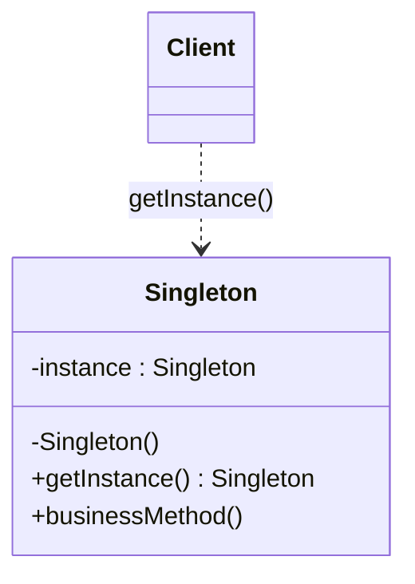
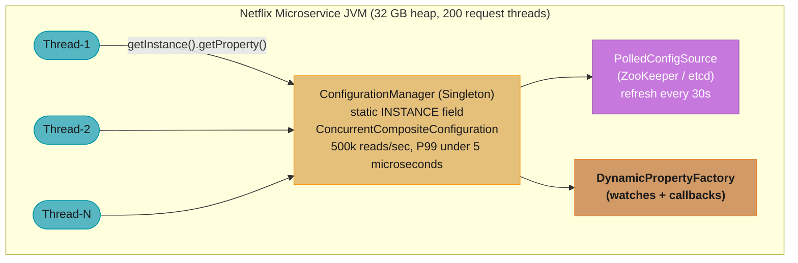
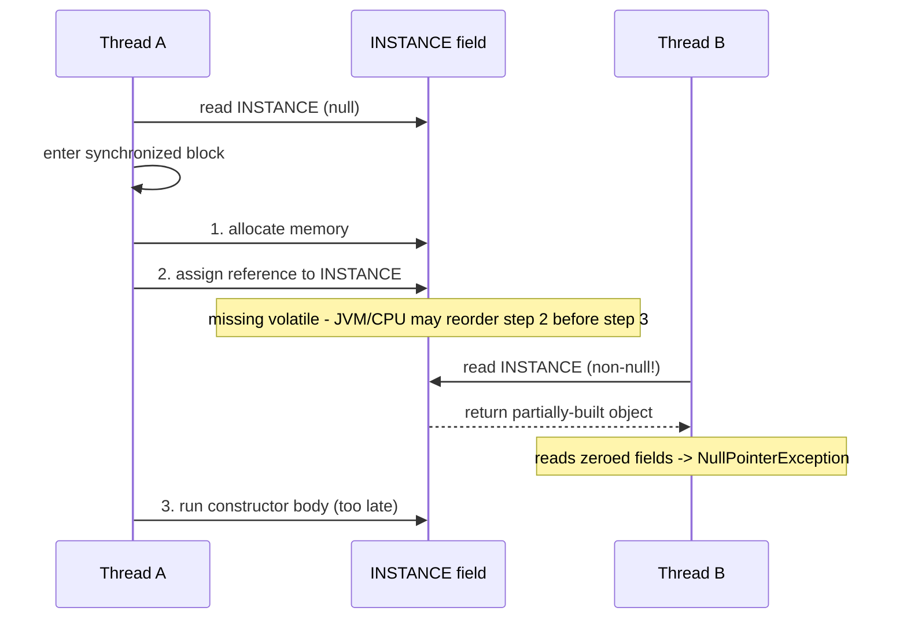
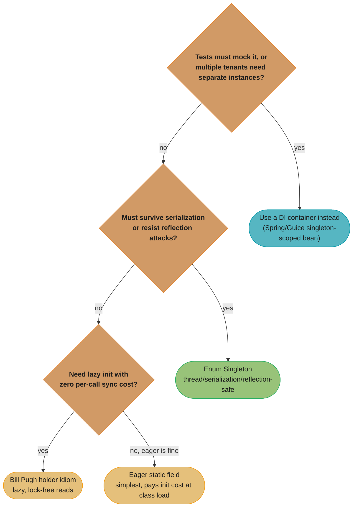

# Singleton Pattern

## 1. Pattern Name & Category

**Name:** Singleton
**Category:** Creational (GoF)
**GoF Classification:** Gang of Four — Creational Design Pattern
**Book Reference:** "Design Patterns: Elements of Reusable Object-Oriented Software" (Gamma et al., 1994)

---

## 2. Intent

Ensure a class has only one instance and provide a global point of access to it.

---

## Intuition

> **One-line analogy**: A Singleton is like the president of a country — there can only be one at a time, and everyone knows how to reach "the president" without needing a personal address.

**Mental model**: Some resources must be shared because creating multiple copies would be wasteful or incorrect — a database connection pool, a logger, a configuration manager. The Singleton ensures the class itself manages "there is only one of me," providing a single global access point without callers needing to know each other.

**Why it matters**: Without Singleton, code relying on shared state either passes the object everywhere (verbose) or creates multiple instances (bugs). The pattern solves the "unique shared resource" problem cleanly at the language level.

**Key insight**: The Singleton's main weakness is hidden global state — it makes code hard to test (can't swap out for a mock) and introduces implicit coupling. Prefer Dependency Injection when testability matters; reserve Singleton for truly global resources like logging.

---

## 3. Problem Statement

### The Problem
Sometimes you need exactly one object of a particular kind in your system — no more, no fewer. Consider these scenarios:

- A **database connection pool** that manages a fixed set of connections. If multiple parts of the application each create their own pool, you waste resources and risk inconsistency.
- A **configuration manager** that reads settings from a file. Multiple instances might read the file at different times and diverge in state.
- A **logging service** that writes to a file. Concurrent instances could corrupt the log file with interleaved writes.
- A **thread pool** or **cache** that must be shared uniformly across the application.

### The Scenario
Imagine you're building an e-commerce application. You have a `DatabaseConnectionPool` class that opens connections to the database. Each instance of this class opens its own set of connections. If the `OrderService`, `InventoryService`, and `UserService` each instantiate their own pool, you now have 3x the expected number of open connections, memory usage, and you've bypassed the pool's limit entirely.

You could pass a single instance around as a constructor argument everywhere (dependency injection), but in deeply nested code, or when dealing with legacy systems, you need a guaranteed single instance with a known access point.

### What We Need
1. The class itself should control that only one instance is ever created.
2. Any caller anywhere in the codebase should get back that same instance.
3. The initialization should be lazy (only when first needed) or eager (at class loading).

---

## 4. Solution

The Singleton pattern solves this with three steps:

1. **Make the constructor private** — prevents external instantiation with `new`.
2. **Hold a static reference** to the single instance inside the class itself.
3. **Expose a static factory method** (e.g., `getInstance()`) that returns the existing instance or creates it on the first call.

This gives the class full control over its lifecycle while providing a well-known global access point.

---

## 5. UML Structure



*The private constructor blocks `new Singleton()`; the static `instance` field and the static `getInstance()` factory method are the only path in, so every `Client` that depends on `Singleton` receives the same object back.*

**Relationships:**
- No inheritance or composition — the Singleton manages itself.
- Clients call `Singleton.getInstance()` instead of `new Singleton()`.

---

## 6. How It Works — Step by Step

1. **First call:** Client calls `Singleton.getInstance()`. The static `instance` field is `null`. The method creates a new `Singleton` object, stores it in `instance`, and returns it.
2. **Subsequent calls:** Client calls `Singleton.getInstance()` again. The static `instance` field is already set. The method returns the existing object — no new object is created.
3. **Thread safety (double-checked locking):** In multithreaded environments, two threads could both see `instance == null` and both create objects. The solution is to `synchronize` the creation block and double-check the null condition after acquiring the lock.
4. **Eager initialization:** Alternatively, initialize the instance at class-load time using a static initializer. The JVM guarantees this is thread-safe.
5. **Bill Pugh / Initialization-on-demand holder:** Uses a nested static class whose static field is initialized only when the holder class is loaded (which happens only when `getInstance()` is called). This is the preferred Java idiom.

---

## 7. Key Components

| Component | Role |
|-----------|------|
| `Singleton` class | The class itself — owns the single instance and controls its lifecycle |
| `private static instance` | The static field holding the one-and-only object |
| `private constructor` | Prevents external `new` calls |
| `getInstance()` | The public static factory method — the global access point |

---

## 8. When to Use

- **Shared resource managers:** Database connection pools, thread pools, socket connection managers.
- **Configuration:** Application-wide settings loaded once from a file or environment.
- **Logging:** A single logger that routes all application log entries to the same output.
- **Caches:** An in-memory cache that must be consistent across all callers.
- **Service locators:** A registry that maps interface types to their implementations.
- **Hardware access:** A class wrapping a serial port, GPU, or printer spooler — only one process should control it.
- **Event buses / message brokers:** A central pub-sub hub inside an application.

---

## 9. When NOT to Use

- **Unit testability is important:** Singletons are notoriously hard to mock. If you need to test classes in isolation, the Singleton's global state bleeds across tests.
- **The "single instance" rule is artificial:** If the constraint isn't intrinsic to the domain (e.g., you just want to reuse an object for performance), use a factory or dependency injection instead.
- **Multithreaded correctness is difficult to guarantee:** Naive implementations are not thread-safe. If you can't apply double-checked locking or static initialization correctly, avoid it.
- **Distributed systems:** In a cluster, each JVM/process has its own Singleton — it's not actually a global singleton across nodes. Use a distributed cache or coordination service instead.
- **When the class has mutable state:** Singletons with mutable state are a form of shared global mutable state — a well-known source of subtle bugs.

---

## 10. Pros

- **Controlled instantiation:** Guarantees exactly one instance — enforced by the class itself, not by convention.
- **Global access:** Provides a well-known access point. No need to thread the object through every method signature.
- **Lazy initialization:** The object is created only when first needed, saving resources if it's never used.
- **Memory efficiency:** A single instance means a single allocation. Useful for heavyweight objects like connection pools.
- **Consistent state:** All callers share the same object, ensuring a consistent view of state (e.g., all callers read the same configuration).
- **Easy to implement:** A few lines of code achieve the pattern.

---

## 11. Cons

- **Global state:** Essentially a global variable in disguise. Global mutable state is a root cause of many hard-to-trace bugs.
- **Tight coupling:** Classes that call `Singleton.getInstance()` are directly coupled to the Singleton class, making them hard to change independently.
- **Testability:** Cannot be easily mocked or replaced in unit tests. Tests can pollute each other through shared singleton state.
- **Hides dependencies:** When a class uses a Singleton internally, the dependency is invisible from the constructor signature, making the API misleading.
- **Concurrency pitfalls:** Naive implementations are not thread-safe. Double-checked locking is subtle and easy to get wrong in languages without proper memory models.
- **Violates Single Responsibility Principle:** The class manages both its business logic and its own lifecycle.
- **Difficult to subclass:** Because the constructor is private and the class controls its own instantiation, inheritance is effectively blocked.

---

## 12. Tradeoffs

| You Gain | You Lose |
|----------|----------|
| Guaranteed single instance | Testability (hard to mock/reset) |
| Global access point | Dependency transparency |
| Lazy initialization | Easy subclassing |
| Consistent shared state | Freedom from global state issues |
| Simple resource management | Flexibility to have multiple instances later |

**The core tradeoff:** Singletons trade testability and flexibility for convenience and control. In production code with dependency injection frameworks (Spring, Guice), the DI container manages lifecycle, so explicit Singletons are rarely needed.

---

## 13. Common Pitfalls

1. **Not handling thread safety:** The simplest Singleton is not thread-safe. Two threads can simultaneously pass the `null` check and create two instances. Always use double-checked locking, static initialization, or an enum.

2. **Double-checked locking without `volatile`:** Before Java 5, double-checked locking was broken. You must declare the `instance` field as `volatile` to prevent the JVM from reordering instructions.

3. **Serialization breaks Singleton:** If the Singleton implements `Serializable`, deserialization creates a new instance, defeating the pattern. You must implement `readResolve()` to return the existing instance.

4. **Reflection breaks Singleton:** Using `java.lang.reflect`, any code can call the private constructor and create a second instance. Defend by throwing an exception inside the constructor if the instance already exists.

5. **Class loader issues:** In complex environments (OSGi, web containers), multiple class loaders can each load the Singleton class independently, creating multiple instances. Scope the Singleton to the right class loader.

6. **Treating Singleton as a substitute for dependency injection:** Singletons hide dependencies. Prefer injecting a single-scoped bean via a DI container over a static Singleton.

7. **Holding long-lived state in tests:** Tests sharing a Singleton's state will interfere with each other. Always reset or stub the Singleton in tests.

---

## 14. Real-World Usage

### Production Scenario: Netflix Archaius Config Registry at 500k Reads/sec

Netflix Archaius is a distributed configuration management library used across Netflix's microservice fleet.
Every microservice — encoding workers, streaming edge nodes, recommendation engines — reads feature flags,
timeouts, and A/B experiment assignments from a central config registry. At peak, the Archaius
`ConfigurationManager` singleton serves over 500,000 property reads per second per JVM, with a p99 latency
under 5 microseconds. Creating a new registry per caller would: (a) reload the full property graph from
remote config sources (etcd/ZooKeeper) on every call — each taking 50–200ms, and (b) diverge in-flight
reads if updates arrive between constructions.

The Archaius `ConfigurationManager` is one of the most referenced production Singleton implementations
in the Java ecosystem. It uses the class-level static instance pattern, backed by `AbstractConfiguration`
from Apache Commons Configuration.



*Every HTTP-handling thread calls the same `ConfigurationManager` singleton instance (gold) rather than constructing its own — the shared object fans out to the remote poller (purple, external ZooKeeper/etcd) and the callback-driven property factory (orange), sustaining 500k reads/sec at p99 under 5 microseconds instead of N per-thread copies.*

### Famous Codebase Usages

| Framework / Library | Class / Method | Version |
|--------------------|---------------|---------|
| `java.lang.Runtime` | `Runtime.getRuntime()` — static inner holder initializes once at class load | Java 1.0+ |
| `java.util.logging.LogManager` | `LogManager.getLogManager()` — singleton log manager, loggers cached by name | Java 1.4+ |
| `java.awt.Desktop` | `Desktop.getDesktop()` — singleton desktop bridge, throws if no desktop | Java 6+ |
| Hibernate 6.x | `SessionFactory` — one per persistence unit; `EntityManagerFactory` wraps it | Hibernate 6.0+ |
| Spring Framework 6 | All `@Bean` methods with default scope are singleton-scoped — managed by `DefaultListableBeanFactory` | Spring 6.0+ (Spring Boot 3.0+) |
| Netflix Archaius 2 | `ConfigurationManager.getInstance()` — static synchronized lazy init | Archaius 0.7+ |
| HikariCP 5.x | `HikariDataSource` — intended as a singleton; pool of 10 connections by default, shared across all threads | HikariCP 5.0+ |
| SLF4J / Logback | `LoggerFactory.getLogger()` returns cached `Logger` singletons keyed by name — effectively per-name singletons | SLF4J 2.0+ |

### Anti-Pattern 1: DCL Without `volatile` — The Classic Production Bug

The double-checked locking (DCL) pattern is broken without `volatile`. This was a real source of
JVM-level memory visibility bugs before Java 5.

```java
// BROKEN: DCL without volatile (pre-Java 5 or with missing volatile)
// Seen in production codebases as late as 2015 in legacy banking systems.
public class ConfigRegistry {
    // BUG: without volatile, JVM may reorder:
    //   1. Allocate memory for ConfigRegistry
    //   2. Assign reference to INSTANCE  <-- another thread sees non-null here
    //   3. Execute ConfigRegistry constructor  <-- but object is not yet initialized!
    private static ConfigRegistry INSTANCE; // MISSING volatile

    private final Map<String, String> properties;

    private ConfigRegistry() {
        this.properties = loadFromRemote(); // may take 200ms
    }

    public static ConfigRegistry getInstance() {
        if (INSTANCE == null) {              // Thread A: sees null, enters
            synchronized (ConfigRegistry.class) {
                if (INSTANCE == null) {
                    INSTANCE = new ConfigRegistry(); // Thread A: partially constructed
                    // Thread B: passes first null check, sees non-null INSTANCE
                    // Thread B: uses partially constructed object -> NullPointerException
                }
            }
        }
        return INSTANCE;
    }
}
```



*Without `volatile`, the JVM/CPU may reorder step 2 (publishing the reference) ahead of step 3 (running the constructor). Thread B's null-check then sees a non-null `INSTANCE` whose fields are still zeroed, reading a half-built object — the exact race the interview answer below asks you to draw out step by step.*

```java
// FIX: add volatile to INSTANCE — required since Java 5 (Java Memory Model update)
// volatile prevents the JVM from reordering the assignment before full construction.
public class ConfigRegistry {
    private static volatile ConfigRegistry INSTANCE; // volatile guarantees visibility

    private final Map<String, String> properties;

    private ConfigRegistry() {
        this.properties = loadFromRemote();
    }

    public static ConfigRegistry getInstance() {
        if (INSTANCE == null) {
            synchronized (ConfigRegistry.class) {
                if (INSTANCE == null) {
                    INSTANCE = new ConfigRegistry(); // safe: constructor completes before assign
                }
            }
        }
        return INSTANCE;
    }

    private static Map<String, String> loadFromRemote() {
        // Simulates 200ms remote load; only called once
        return Collections.unmodifiableMap(new HashMap<>());
    }
}
```

### Anti-Pattern 2: Serialization Breaks Singleton

```java
// BROKEN: Singleton implements Serializable but missing readResolve()
// Deserialization creates a second instance — seen in distributed caches that
// serialize session objects to Redis and back.
public class TokenCache implements Serializable {
    private static final TokenCache INSTANCE = new TokenCache();
    public static TokenCache getInstance() { return INSTANCE; }

    // Deserializing this object produces a NEW TokenCache — singleton violated.
    // Two microservice nodes could end up with divergent caches after failover.
}
```

```java
// FIX: implement readResolve() to enforce singleton contract during deserialization
public class TokenCache implements Serializable {
    private static final long serialVersionUID = 1L;
    private static final TokenCache INSTANCE = new TokenCache();

    private TokenCache() {}
    public static TokenCache getInstance() { return INSTANCE; }

    // Called by ObjectInputStream after deserialization; return the existing instance.
    protected Object readResolve() {
        return INSTANCE;
    }
}
```

### Anti-Pattern 3: Reflection Breaks Singleton

```java
// BROKEN: no reflection guard — attacker/test can create a second instance
public class ApiKeyStore {
    private static final ApiKeyStore INSTANCE = new ApiKeyStore();
    private ApiKeyStore() {} // private but reflection can bypass this
}

// Attack:
Constructor<ApiKeyStore> c = ApiKeyStore.class.getDeclaredConstructor();
c.setAccessible(true);
ApiKeyStore second = c.newInstance(); // singleton violated
```

### Production-Safe Alternative: Enum Singleton (Java 5+, Java 17 LTS recommended)

Effective Java Item 3: "Use enum to implement Singleton." The JVM guarantees enum values are
instantiated exactly once per classloader, handles serialization natively (no `readResolve()`
needed), and is immune to reflection attacks.

```java
// Java 17 LTS — production-grade Singleton for shared config registry
// Enum singleton: thread-safe, serialization-safe, reflection-safe, zero boilerplate.
public enum ArchaiusConfigRegistry {
    INSTANCE;

    // Simulates Archaius ConcurrentCompositeConfiguration
    private final ConcurrentHashMap<String, String> properties = new ConcurrentHashMap<>();
    private final AtomicLong readCount = new AtomicLong(0);

    // Called once by the JVM during enum class initialization
    ArchaiusConfigRegistry() {
        loadFromRemoteSources();
    }

    private void loadFromRemoteSources() {
        // Load from ZooKeeper/etcd — runs once, no locking needed
        properties.put("streaming.maxBitrate", "8000");
        properties.put("ab.experiment.v2", "true");
        properties.put("timeout.upstream.ms", "200");
    }

    public String getProperty(String key) {
        readCount.incrementAndGet(); // metrics: track 500k/sec reads
        return properties.getOrDefault(key, "");
    }

    public String getProperty(String key, String defaultValue) {
        readCount.incrementAndGet();
        return properties.getOrDefault(key, defaultValue);
    }

    // Atomic update — called when ZooKeeper watcher fires
    public void updateProperty(String key, String value) {
        properties.put(key, value);
    }

    public long getTotalReads() {
        return readCount.get();
    }
}

// Usage — same instance returned on all 200 threads, zero locking on reads
public class StreamingEdgeService {
    public int getMaxBitrate() {
        // p99 < 5 microseconds: ConcurrentHashMap.get() with no lock contention
        String val = ArchaiusConfigRegistry.INSTANCE.getProperty("streaming.maxBitrate", "4000");
        return Integer.parseInt(val);
    }
}
```

### Performance and Correctness Numbers

| Approach | Read latency (p99) | Thread safety | Serialization safe | Reflection safe |
|---|---|---|---|---|
| Eager static field | ~1 ns (field access) | Yes | No (needs readResolve) | No |
| Bill Pugh holder idiom | ~2 ns (class load once) | Yes | No (needs readResolve) | No |
| DCL + `volatile` | ~3–5 ns (volatile read) | Yes | No (needs readResolve) | No |
| `synchronized getInstance()` | ~50–200 ns (lock on every call) | Yes | No | No |
| Enum Singleton | ~1 ns (field access) | Yes | Yes (built-in) | Yes (JVM blocks) |

ConcurrentHashMap reads at 500k/sec on a 32-core JVM: total CPU overhead under 0.5% per core.
Lock contention with `synchronized getInstance()` at 500k/sec would saturate one core entirely.

### Migration Story: When to Move TO Enum Singleton, and When to Move AWAY

**Move TO Enum Singleton** when:
- You have a static field Singleton that is also `Serializable` (distributed cache, session object).
- The class is tested and reflection attacks are a security concern.
- You are upgrading a legacy pre-Java 5 DCL-without-volatile to Java 17+ code.

**Move AWAY from Singleton** (toward DI) when:
- Unit tests need to swap the instance with a mock. A Singleton cannot be replaced by a test double
  without reflection hacks or test-specific static setters.
- The application has multiple logical "tenants" (multi-tenant SaaS) that need independent instances.
- The team migrates to Spring Boot 3.x where the container manages singleton scope via
  `@Bean` or `@Component`, making hand-rolled Singletons redundant and harder to manage.



*Reading the migration criteria above as a single decision: testability/multi-tenancy needs route to a DI container, serialization/reflection risk routes to the Enum form, and the remaining lazy-vs-eager choice picks between the holder idiom and a plain static field — the same ordering the "thread-safe Singleton" interview answer walks through.*

---

## 15. Comparison with Similar Patterns

| Pattern | How It Differs from Singleton |
|---------|-------------------------------|
| **Monostate** | Multiple instances exist, but all share the same static state. Avoids the private-constructor trick but achieves similar behavior. |
| **Factory Method** | Controls which type of object is created; does not constrain to one instance. |
| **Prototype** | Creates new instances by cloning; opposite of Singleton's "one only" constraint. |
| **Flyweight** | Shares instances to save memory, but can have many shared instances keyed by data; Singleton has exactly one. |
| **Service Locator** | Often implemented as a Singleton but provides a registry of services rather than a single service. |

---

## 16. Interview Tips

**Common Interview Questions:**

1. **"What is the Singleton pattern and when would you use it?"**
   Answer: State the intent (one instance, global access), give a concrete example (connection pool, config), and immediately mention the trade-off (testability, global state). Show you know when NOT to use it.

2. **"How do you make a Singleton thread-safe in Java?"**
   Answer: Mention four approaches in order of preference:
   - Enum-based Singleton (best — JVM guarantees thread safety, handles serialization)
   - Initialization-on-demand holder (lazy + thread-safe + no synchronization overhead)
   - `synchronized getInstance()` (simple, but locks on every call)
   - Double-checked locking with `volatile` (good performance, but subtle)

3. **"How does an Enum Singleton work?"**
   Answer: Java guarantees each enum value is instantiated once by the classloader. It's serialization-safe and reflection-safe out of the box.

4. **"Can you break a Singleton?"**
   Answer: Yes — via reflection (calling private constructor), serialization (deserializing creates a new instance), or multiple class loaders. Explain the defenses.

5. **"What's wrong with Singletons?"**
   Answer: Global state, hidden dependencies, testability issues, SRP violation. Mention that modern apps use DI containers instead.

6. **"Walk through why DCL without `volatile` is broken — what exactly can go wrong at the bytecode/JMM level?"**
   Answer: `new ConfigRegistry()` compiles to three JVM steps — allocate memory, run the constructor, assign the reference to `INSTANCE` — and without `volatile`, the JMM allows the compiler or CPU to reorder steps 2 and 3. A second thread can then see a non-null `INSTANCE` whose constructor hasn't finished running, and read default-valued (zeroed) fields, causing subtle `NullPointerException`s or garbage values that appear only under load. `volatile` (Java 5+) inserts a store-store/load-load barrier via the updated Java Memory Model, forbidding this reordering. In an interview, draw the three-step breakdown explicitly — it's the detail that separates "I memorized the fix" from "I understand the JMM."

7. **"Is a Spring `@Component`/`@Bean` with default scope the same as a GoF Singleton?"**
   Answer: No — they solve a related but distinct problem. A GoF Singleton is *self-enforcing*: the class itself guarantees only one instance can ever exist (private constructor, static field), even against `new` calls anywhere in the codebase. A Spring singleton-scoped bean is *container-enforced*: Spring's `DefaultListableBeanFactory` caches one instance per bean definition per `ApplicationContext`, but nothing stops you from calling `new MyService()` directly and getting a second, un-managed instance. The practical guidance: in DI-based applications, rely on the container's singleton scope and avoid the GoF private-constructor pattern — it actively fights the framework's ability to create test doubles or multiple contexts (e.g., parallel test contexts each need their own bean instance).

8. **"How would you unit-test a class that depends on a classic `getInstance()` Singleton?"**
   Answer: Directly, you mostly can't — the dependency is hard-coded and invisible from the constructor, so standard mocking (Mockito `@Mock` + constructor injection) has nothing to inject into. Workarounds include: making the Singleton implement an interface and adding a package-private setter/reset method for tests (`ConfigRegistry.setInstanceForTesting(mock)`), using `PowerMock` or similar bytecode-manipulation tools to mock static methods (heavyweight, often a code smell), or — the durable fix — refactoring to inject the dependency via constructor and letting a DI container supply the singleton-scoped instance in production while tests supply a mock. The practical guidance: treat "this class is hard to test" as a signal to refactor toward DI rather than reach for a static-mocking framework.

9. **"What happens to a Singleton in an application server with multiple class loaders (e.g., Tomcat, OSGi)?"**
   Answer: Each class loader that loads the Singleton's `.class` file creates an independent `Class` object, and therefore an independent static `INSTANCE` field — so you can end up with multiple "singletons," one per class loader, silently violating the "exactly one instance" guarantee. This commonly bites when a JAR containing the Singleton is bundled inside multiple WARs deployed to the same Tomcat instance, or when an OSGi bundle is reloaded and re-instantiates its singletons. The fix is architectural: place shared Singleton classes in a parent/shared class loader (e.g., Tomcat's `common` or `shared` lib directory) so all child class loaders delegate to the same loaded class, or avoid the assumption entirely and use an external shared store (Redis, a database row) for state that must truly be process-wide.

10. **"Walk through the Bill Pugh holder idiom — why is it thread-safe without any explicit synchronization?"**
   Answer: The idiom declares a `private static class Holder { static final Singleton INSTANCE = new Singleton(); }` and has `getInstance()` return `Holder.INSTANCE`. The JVM specification guarantees that a class is initialized — and its static fields assigned — only on first active use, and that class initialization is implicitly synchronized and happens-before any subsequent access (JLS §12.4). So `Holder` is not loaded (and `INSTANCE` is not created) until the first call to `getInstance()`, giving lazy initialization, but every subsequent read of `Holder.INSTANCE` is a plain field access with no lock — giving the same near-zero overhead as eager initialization. This is why it's the preferred idiom over `synchronized getInstance()` or DCL: it gets laziness, thread safety, and zero per-call synchronization cost simultaneously, with no `volatile` needed.

**Key Phrases to Use:**
- "Lazy vs. eager initialization"
- "Thread safety — double-checked locking, `volatile`"
- "Enum Singleton is the safest in Java"
- "Bill Pugh / Initialization-on-demand holder idiom"

---

## Cross-Perspective: HLD Connections

**HLD View — Where Singleton Appears in Distributed Systems**

- **Connection pools** — Every microservice has a singleton database connection pool (HikariCP, c3p0). Creating a new pool per request would exhaust DB connections; the singleton lifecycle matches the service lifetime.
- **API gateway rate-limiter registry** — The per-client token bucket store is a singleton: one shared structure tracks quotas across all request-handling threads. Backed by Redis in distributed deployments.
- **Config managers** — Distributed config clients (Consul, etcd client, Spring Cloud Config) are singletons that hold the live config snapshot and propagate changes to all in-process consumers.
- **Distributed caveat** — A JVM Singleton only guarantees one instance per process. Across N microservice replicas, there are N singletons. State that must be globally unique requires distributed coordination (ZooKeeper, Redis locks), not a local Singleton.

---

## 17. Best Practices

1. **Prefer enum-based Singleton in Java** — it's the simplest, safest (thread-safe, serialization-safe, reflection-safe) implementation.

2. **Use the Initialization-on-demand holder idiom** for lazy initialization without synchronization overhead:
   ```java
   private static class Holder {
       static final Singleton INSTANCE = new Singleton();
   }
   public static Singleton getInstance() { return Holder.INSTANCE; }
   ```

3. **Declare `instance` as `volatile`** if using double-checked locking — required since Java 5 for correct memory visibility.

4. **Implement `readResolve()`** if the Singleton is serializable — return the existing instance to prevent deserialization from creating a second object.

5. **Prefer dependency injection over static access** — let a DI container (Spring, Guice) manage the singleton scope. Your classes declare `@Autowired` dependencies instead of calling `getInstance()`.

6. **Document clearly that the class is a Singleton** — future maintainers need to understand lifecycle assumptions.

7. **Reset the Singleton in tests** using a package-private or reflection-based reset method — or better, inject the instance so it can be mocked.

8. **Do not use Singleton for objects with complex initialization that can fail** — failure inside a static initializer causes `ExceptionInInitializerError`, which is hard to recover from.
