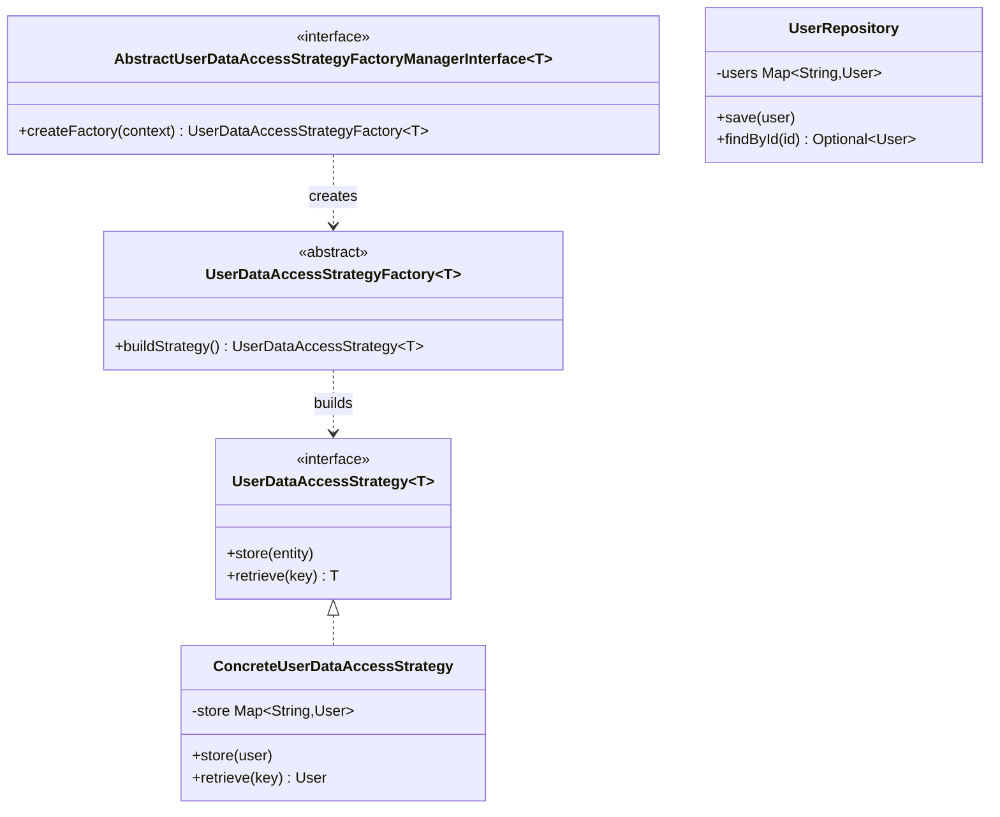
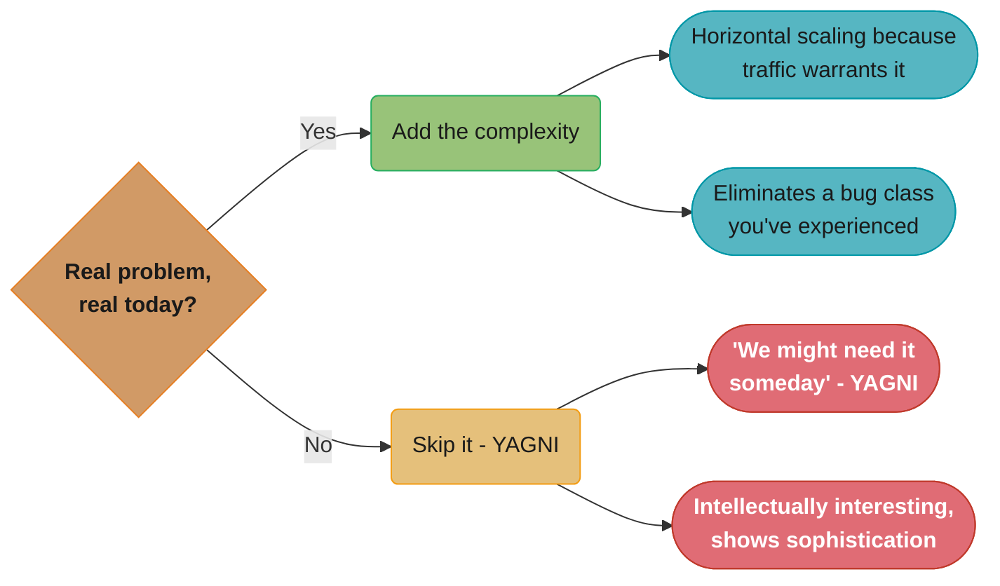

# KISS — Keep It Simple, Stupid

## Origins

Coined by **Kelly Johnson**, lead engineer at Lockheed's Skunk Works (advanced development division), in the 1960s. His design principle for the U-2 and SR-71 aircraft:

> "A jet aircraft ought to be repairable by an average mechanic in the field with these tools."

The insight: a system that cannot be understood and maintained by a typical practitioner under real-world conditions is a poorly designed system — regardless of how technically sophisticated it is.

---

## Intuition

> **One-line analogy**: KISS is like the field mechanic's rule — design a jet that a mechanic can fix in the field with basic tools, not one that requires a PhD and a factory to maintain.

**Mental model**: Complexity is the enemy of reliability and maintainability. Every abstraction, pattern, and framework you add is complexity someone must understand, debug, and maintain. KISS asks: "Is this complexity solving a real, current problem?" If the answer is no, remove it. The simplest code that correctly solves the problem is the best code.

**Why it matters**: Complex code has more failure modes, is harder to debug under production pressure, and takes longer for new team members to understand. Simple code is faster to test, easier to modify, and more resilient to bugs. The correlation between code complexity and bug density is well-established empirically.

**Key insight**: Simplicity is not the same as naivety. A simple, well-named function that does one clear thing is sophisticated. A "clever" 3-line function that uses bit manipulation instead of a clear conditional is complex, not simple. Prefer clarity over cleverness; the next reader might be you at 2 AM debugging a production incident.

---

## Definition

Systems work best when kept simple. Unnecessary complexity should be avoided. Complexity that does not serve a genuine requirement is a liability, not an asset.

KISS does not mean "write dumb code." It means: **find the appropriate level of abstraction for the problem at hand**. Not simpler than necessary, not more complex than necessary.

---

## Motivation

- Complexity is the root cause of most software bugs.
- Complex code takes longer to read, understand, review, and debug.
- Every layer of abstraction or indirection is cognitive overhead for the next developer.
- Simpler systems are easier to test, monitor, and operate.
- Over-engineered systems have high maintenance costs even when they "work."

---

## Java Violation Example

A simple requirement: store a user's name and retrieve it. Over-engineered with 5 design patterns:

```java
// AbstractUserDataAccessStrategyFactoryManagerInterface.java
public interface AbstractUserDataAccessStrategyFactoryManagerInterface<T> {
    UserDataAccessStrategyFactory<T> createFactory(UserDataAccessContext context);
}

// UserDataAccessStrategyFactory.java
public abstract class UserDataAccessStrategyFactory<T> {
    public abstract UserDataAccessStrategy<T> buildStrategy();
}

// UserDataAccessStrategy.java
public interface UserDataAccessStrategy<T> {
    void store(T entity);
    T retrieve(String key);
}

// ConcreteUserDataAccessStrategy.java
public class ConcreteUserDataAccessStrategy implements UserDataAccessStrategy<User> {
    private final Map<String, User> store = new HashMap<>();
    public void store(User user) { store.put(user.getId(), user); }
    public User retrieve(String key) { return store.get(key); }
}

// ... plus 3 more Factory and Manager classes to wire it together
```

To understand what this does, a developer must navigate 6+ classes for what is fundamentally: **a map with put and get**.

---

## Compliant Example

```java
// UserRepository.java
public class UserRepository {
    private final Map<String, User> users = new HashMap<>();

    public void save(User user) {
        users.put(user.getId(), user);
    }

    public Optional<User> findById(String id) {
        return Optional.ofNullable(users.get(id));
    }
}
```

Same behavior. One class. Immediately understandable. Easy to test. Easy to replace when requirements change.



*Three dependency/realization arrows chain four classes — the interface, its abstract factory, the strategy interface, and `ConcreteUserDataAccessStrategy` — before the three more Factory/Manager classes the code comment mentions even join the picture; `UserRepository` sits alone, with no arrows, because there is nothing left to indirect through.*

---

## Simple is NOT Simplistic

There is a difference between:

- **Simplistic:** ignoring real complexity, hacking something together that will break under real conditions.
- **Simple:** understanding the problem deeply enough to find the most direct, clear solution.

True simplicity is hard. It requires understanding both the problem and the solution space well enough to strip away everything unnecessary while keeping everything essential.

As **Einstein** (attributed) put it: "Everything should be made as simple as possible, but not simpler."

---

## Complexity Types

Understanding what kind of complexity you're dealing with guides the response:

| Type | Description | Response |
|------|-------------|----------|
| **Essential complexity** | Inherent in the problem domain. You cannot eliminate it. | Manage it — good abstractions, clear naming, documentation. |
| **Accidental complexity** | Self-inflicted by the solution. Not required by the problem. | Eliminate it ruthlessly. |

Examples:
- A distributed system has essential complexity (network failures, consistency).
- Using an enterprise service bus to coordinate two services in the same process is accidental complexity.

---

## When to Add Complexity

Add complexity only when driven by **genuine, current requirements**, not hypothetical future needs:

- **Yes:** the problem requires it (e.g., horizontal scaling is needed because traffic warrants it).
- **No:** "we might need it someday" (see YAGNI).
- **Yes:** a proven pattern eliminates a class of bugs you have actually experienced.
- **No:** a pattern was used because it's intellectually interesting or shows technical sophistication.

The question to ask: **"What real problem does this complexity solve, and is that problem real today?"**



*Every yes/no example above collapses to the same gate: does a real, current requirement justify this, or is it a hypothetical "someday" or self-indulgent "interesting" add — the same test YAGNI applies to features.*

---

## Measuring Complexity

Useful metrics as signals (not absolute rules):

- **Cyclomatic complexity:** number of independent paths through a function. High values (>10) indicate hard-to-test, hard-to-understand code.
- **Lines of code (LOC):** not a perfect metric, but functions exceeding ~30 lines or classes exceeding ~300 lines often violate SRP and KISS together.
- **Number of dependencies:** a class with 10 injected dependencies is doing too much.
- **Depth of inheritance hierarchy:** beyond 3 levels, inheritance becomes hard to reason about.
- **Number of layers / indirection:** each additional layer requires context-switching.

---

## Real-World Examples

- **Unix philosophy:** "Do one thing and do it well." Each tool is simple; power comes from composition.
- **REST over SOAP:** REST won adoption partly because it was dramatically simpler to understand and implement.
- **SQLite:** intentionally simple, embedded, no server — handles the vast majority of use cases for data storage with minimal complexity.
- **Go language design:** deliberately excludes features (no generics for years, no inheritance) to keep the language simple and programs readable by any Go developer.

---

## Related Principles

- **YAGNI:** Don't add functionality until it's needed — the temporal application of KISS.
- **Rule of Three (DRY):** Don't abstract until you have three instances — prevents premature abstraction complexity.
- **Single Responsibility Principle:** Each class does one thing — limits the complexity of any individual unit.

---

## Cross-Perspective: HLD Connections

**HLD View — Where KISS Appears in Distributed Systems**

- **REST over GraphQL for simple APIs** — GraphQL adds schema, resolver, and query complexity that is often unnecessary for straightforward CRUD APIs. REST with well-named endpoints is simpler to understand, cache, and debug.
- **Read-aside caching over complex invalidation** — Cache-aside (check cache → miss → load from DB → populate cache) is simpler and more debuggable than elaborate write-through or cache invalidation schemes. Start simple; add complexity only when measured latency requires it.
- **Stateless services** — Stateless services are simpler to scale (just add replicas), deploy (any request can go to any instance), and debug (no session affinity issues). Stateful services add significant distributed coordination complexity.
- **Synchronous over async for simple workflows** — Direct service calls are simpler than message queues for low-volume, low-latency workflows. Introduce async messaging when decoupling or throughput requirements justify the added operational complexity.

---

## Quick Summary

| Aspect | Summary |
|--------|---------|
| Core idea | Avoid unnecessary complexity; find the appropriate level of abstraction |
| Not the same as | Simplistic or naive — simple requires deep understanding |
| Complexity types | Essential (unavoidable) vs accidental (self-inflicted) |
| Key question | "What real problem today does this complexity solve?" |
| Measuring it | Cyclomatic complexity, dependencies, indirection layers |
| Related | YAGNI, Rule of Three, SRP |
