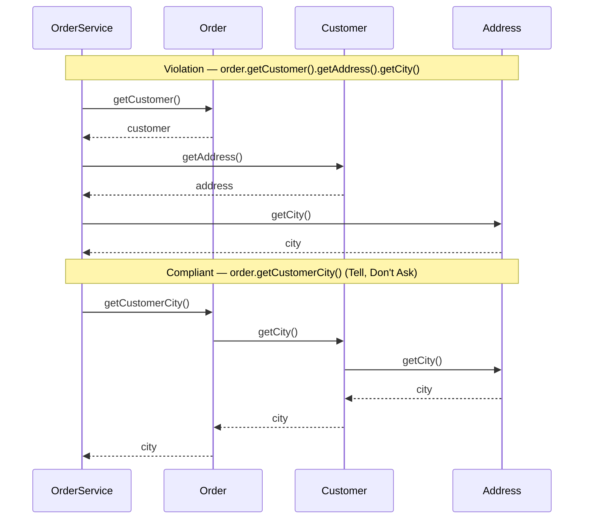
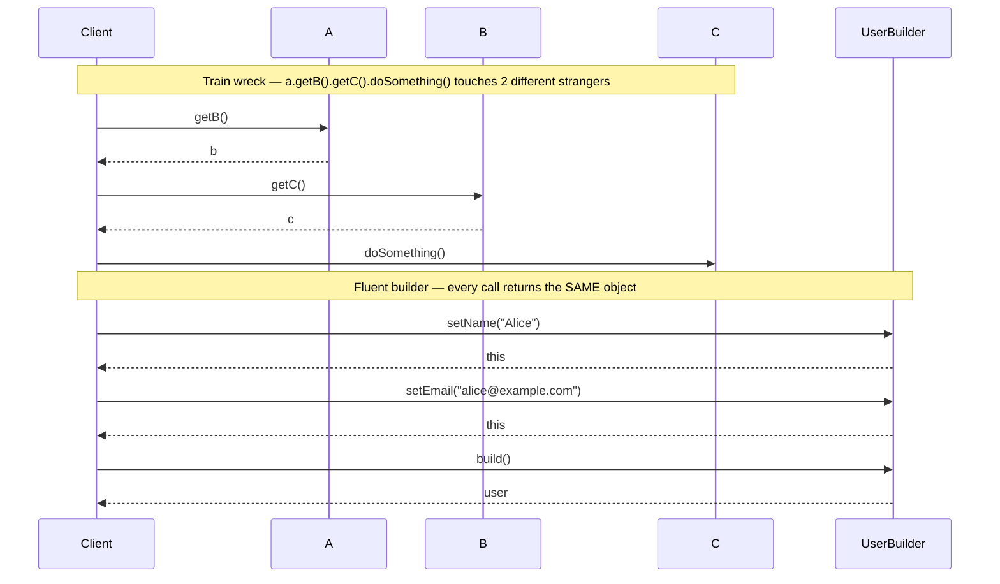

# Law of Demeter (Principle of Least Knowledge)

## Origins

Formulated at **Northeastern University in 1987** during the Demeter project (a software development project studying adaptive programming). Authors: **Ian Holland**, Karl Lieberherr, and colleagues.

The name "Demeter" comes from the Greek goddess of agriculture — the project was named after her, and the principle took the project's name.

---

## Intuition

> **One-line analogy**: Law of Demeter says "talk to your friends, not strangers" — if you need something from a stranger, ask your friend who knows them to get it for you.

**Mental model**: `customer.getWallet().getCard().charge(amount)` violates Demeter — you're navigating three levels of relationships to reach `Card`. This creates tight coupling: if Wallet changes how it stores cards, your code breaks even though you were dealing with a Customer. Demeter says: add `customer.charge(amount)` — Customer knows about Wallet; you don't need to. Chain of dots is a code smell.

**Why it matters**: Violating Demeter creates "train wreck" code with long dot chains, making every object aware of the internals of objects it doesn't directly own. Changes deep in the chain ripple outward unexpectedly. Systems with Demeter violations are hard to test (you need to mock the entire chain) and hard to refactor.

**Key insight**: The "one dot" guideline is a heuristic — `object.field.method()` is often a violation; `stream.filter().map().collect()` is not (fluent builders chain the same object type). The real test: "Am I reaching through an object to its internal structure?" If yes, encapsulate that operation in the intermediate object.

---

## Definition

An object should only call methods on its **immediate friends** — objects it has a direct relationship with. Specifically, a method `M` on object `O` may only call methods on:

1. `O` itself (`this`)
2. Objects passed as parameters to `M`
3. Objects that `O` creates or instantiates
4. `O`'s direct component objects (fields of `O`)
5. Global objects accessible to `O` (use with care)

**What it forbids:** navigating through a chain of objects to call a method on a distant object — an object that `O` only knows about indirectly.

The informal statement: **"Only talk to your immediate friends. Don't talk to strangers."**

---

## Motivation

When an object reaches deeply into another object's structure, it:
- Becomes tightly coupled to the internal structure of that other object.
- Must change whenever the intermediate structure changes — even if the ultimate behavior needed is the same.
- Reveals that responsibility is misplaced: the asking object is doing work that one of the intermediate objects should own.

---

## The "Train Wreck" Violation

The classic smell: a long chain of method calls, each accessing the innards of the previous result:

```java
// Each dot is a potential Law of Demeter violation if it's accessing state of a "stranger"
double amount = customer.getWallet().getMoney().getAmount();
```

This line says: "I need an amount. I'll ask the customer for its wallet. Then ask the wallet for its money. Then ask the money for its amount."

The calling code now knows:
- That `Customer` has a `Wallet`.
- That `Wallet` has a `Money` object.
- That `Money` has an `amount` field.

This is far more knowledge than the calling code should have. It is coupled to three layers of internal structure.

---

## Java Violation Example

An order processing service reaching through the object graph to get a city name:

```java
public class OrderService {

    public String getShippingLabel(Order order) {
        // Violation: reaching through Customer -> Address -> city
        String city = order.getCustomer().getAddress().getCity();
        return "Ship to: " + city;
    }
}
```

**The problem:** `OrderService` must know that `Order` has a `Customer`, that `Customer` has an `Address`, and that `Address` has a `city` field. If `Address` is refactored to have a `Location` object containing the city, `OrderService` breaks — even though the behavior it needs (get the city for an order) hasn't changed.

---

## Compliant Example

Apply the principle **"Tell, Don't Ask"** — instead of asking an object for its internals to do work, tell it to do the work:

```java
// Order.java — knows its customer
public class Order {
    private Customer customer;

    // Delegate method: hides internal structure
    public String getCustomerCity() {
        return customer.getCity();
    }
}

// Customer.java — knows its address
public class Customer {
    private Address address;

    // Delegate method: hides internal structure
    public String getCity() {
        return address.getCity();
    }
}

// OrderService.java — only talks to Order (its immediate friend)
public class OrderService {
    public String getShippingLabel(Order order) {
        String city = order.getCustomerCity(); // One dot — immediate friend only
        return "Ship to: " + city;
    }
}
```

Now `OrderService` only knows about `Order`. The internal structure of `Customer` and `Address` can change freely without affecting `OrderService`.



Same four classes, same ultimate call to `Address.getCity()` — but in the violation `OrderService` is the direct caller of all three hops (two of them strangers), while in the compliant version `OrderService` calls only its immediate friend `Order`, which delegates one hop at a time down the chain it already owns.

---

## Consequences of Violations

| Consequence | Description |
|-------------|-------------|
| **Tight coupling** | The calling class is coupled to every intermediate class in the chain. |
| **Brittle code** | Refactoring any intermediate class breaks all callers that traverse through it. |
| **Hard to test** | To test the calling class in isolation, you must set up a deep object graph of mocks and stubs. |
| **Misplaced responsibility** | The calling class is doing navigation work that intermediate objects should own. |
| **Violated encapsulation** | Internal structure is exposed through the public API of each intermediate class. |

---

## Tell, Don't Ask

The Law of Demeter is closely related to the **Tell, Don't Ask** principle:

- **Ask (violation):** "Give me your internals so I can do something with them."
- **Tell (compliant):** "Do this thing with your internals and give me the result."

```java
// Ask (violation): get internals, do work outside
if (order.getCustomer().getMembershipLevel() == PREMIUM) {
    applyPremiumDiscount(order);
}

// Tell (compliant): push the decision into the object that has the knowledge
order.applyApplicableDiscounts(discountEngine);
// or
if (order.isEligibleForPremiumDiscount()) {
    applyPremiumDiscount(order);
}
```

---

## When to Relax the Law

The Law of Demeter applies to **method chains that navigate through object state**. It does NOT apply to all chains. There are legitimate cases for chaining:

### Fluent Builders

```java
// Builder chains are not LoD violations — each call returns the SAME builder
User user = new UserBuilder()
    .setName("Alice")
    .setEmail("alice@example.com")
    .setAge(30)
    .build();
```

Each call returns `this` (the builder). You are not traversing through different objects.

### Stream / Functional Pipelines

```java
// Stream chains are not LoD violations — they are transformations on a pipeline
List<String> names = users.stream()
    .filter(u -> u.isActive())
    .map(User::getName)
    .sorted()
    .collect(Collectors.toList());
```

This is a data pipeline, not navigation through an object graph to extract hidden state.

**The distinction:** the Law of Demeter targets chains that **access state through multiple layers of object ownership**. Builders and streams are operating on a single logical thing (the builder, the stream) throughout the chain.



The train-wreck chain lands on three different objects (`A`, `B`, `C`); the builder chain calls the same `UserBuilder` instance every time because each setter returns `this` — no stranger's internals are ever touched, which is why fluent builders (and `stream.filter().map().collect()`) are exempt from the Law of Demeter.

---

## How to Detect Violations

Look for:
- Multiple consecutive dots where each dot accesses a different domain object.
- Code that must create elaborate mock chains to write unit tests.
- Cascade changes: a refactoring of a low-level class requires changes in high-level classes that "shouldn't care."
- Methods whose names describe what they're navigating to, not what they're doing: `getCustomerAddressCity()` suggests the caller is doing too much navigation.

---

## Real-World Examples

- **Java Collections API:** `Map.Entry` exposes both key and value directly — you don't navigate `map.getEntrySet().getEntry(key).getValue()`. The API is flat.
- **JPA/Hibernate:** lazy-loading violations often manifest as LoD violations — services reach through entity relationships in ways that cause N+1 query problems.
- **Domain-Driven Design:** aggregate boundaries enforce the Law of Demeter. You interact with an aggregate through its root; you don't reach into child entities directly from outside the aggregate.

---

## Related Concepts

- **Tell, Don't Ask:** The behavioral complement to LoD. Push logic into the object that has the data.
- **Information Expert (GRASP):** Assign responsibility to the class that has the information needed to fulfill it — the same insight from the GRASP pattern language.
- **Encapsulation:** LoD is a practical enforcement of encapsulation at the object graph level.
- **Demeter Principle violations and testing:** if setting up a test requires deep nested mock chains, the Law of Demeter is being violated in the production code.

---

## Cross-Perspective: HLD Connections

**HLD View — Where Law of Demeter Appears in Distributed Systems**

- **Direct service dependencies only** — A service should call only its immediate dependencies, not chain through multiple services (A → B → C → D). Deep call chains increase latency, create distributed transaction complexity, and propagate failures across the chain.
- **API gateway as the single contact point** — Clients talk to the gateway; the gateway talks to downstream services. Clients don't need to know which downstream services exist or how to call them — LoD applied to the client-service boundary.
- **Event-driven decoupling** — Publishing events avoids reaching through a service's dependencies: Order Service publishes `OrderPlaced`; Inventory Service reacts. Order Service never calls Inventory Service directly — reducing coupling between distant parts of the system.
- **Aggregate boundaries in DDD** — Domain-Driven Design aggregates enforce LoD: external code can only call the aggregate root, not reach into child entities directly. This maps to service API design: expose only the root resource's endpoints, not internal sub-resources.

---

## Quick Summary

| Aspect | Summary |
|--------|---------|
| Core idea | Only talk to your immediate friends; don't navigate through object graphs |
| Allowed calls | self, parameters, objects you created, your direct fields |
| Classic violation | `a.getB().getC().doSomething()` — train wreck |
| Fix | Add delegate methods; tell don't ask |
| Consequences of violation | Tight coupling, brittle code, hard to test |
| Legitimate chaining | Fluent builders, stream/functional pipelines |
| Detection | Multiple domain-crossing dots, complex mock setups in tests |
