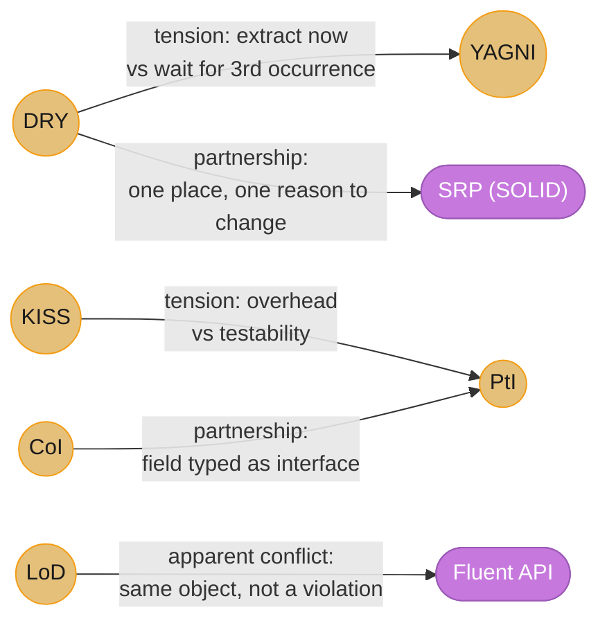
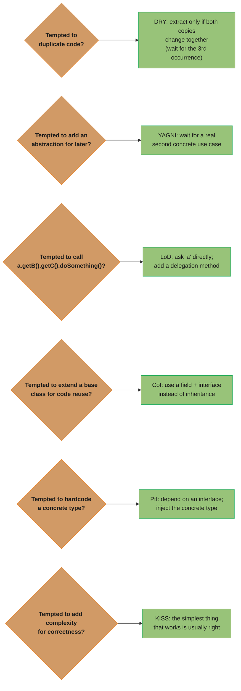
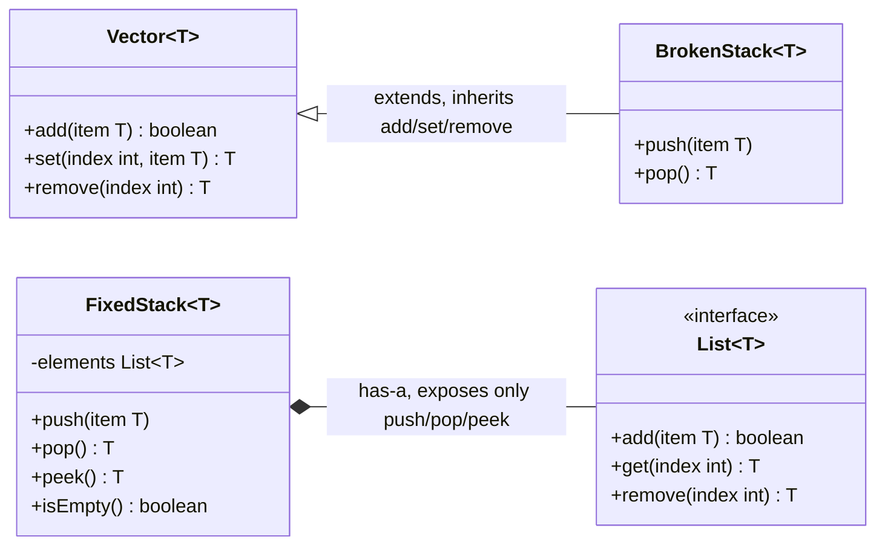

# Design Principles

General-purpose design principles that apply across all layers of software — not tied to a specific pattern or framework.

---

## 1. Concept Overview

| Principle | Abbreviation | Core Rule | File |
|-----------|-------------|-----------|------|
| Don't Repeat Yourself | DRY | Every piece of knowledge has one authoritative representation | [DRY.md](DRY.md) |
| Keep It Simple, Stupid | KISS | Favor the simplest solution that works | [KISS.md](KISS.md) |
| You Aren't Gonna Need It | YAGNI | Don't build for hypothetical future requirements | [YAGNI.md](YAGNI.md) |
| Law of Demeter | LoD | Only talk to your immediate friends | [LawOfDemeter.md](LawOfDemeter.md) |
| Composition over Inheritance | CoI | Prefer has-a relationships over is-a for code reuse | [Composition_over_Inheritance.md](Composition_over_Inheritance.md) |
| Program to Interface | PtI | Depend on abstractions, not concretions | [ProgramToInterface.md](ProgramToInterface.md) |

---

## 2. Intuition

Design principles are the building codes of software: DRY says don't wire the same circuit twice; KISS says use a light switch, not a home automation system; YAGNI says don't install an elevator in a one-story building; LoD says don't reach through a wall to flip someone else's switch.

---

## 3. Principle Interaction Map

Understanding where principles reinforce each other — and where they create tension — is the mark of senior engineering judgment.



Gold nodes are the six principles from this page; purple nodes are the outside concepts they interact with (a fluent builder, and SOLID's SRP). Edge labels name the relationship — tension, apparent conflict, or partnership — matching the prose below.

**Tensions:**

DRY vs YAGNI — DRY pushes you to extract shared logic immediately; YAGNI says wait for the third occurrence. Extracting prematurely (DRY) creates a shared abstraction that couples two pieces of code that may evolve independently. YAGNI wins at the first duplication; DRY wins at the third.

KISS vs Program-to-Interface — Abstractions add cognitive overhead (every interface a new developer must understand is a cost). PtI makes code testable and extensible. Resolution: PtI is justified when there is a realistic second implementation or when test doubles are needed; otherwise KISS wins.

**Apparent conflict:**

Law of Demeter vs Fluent API — `builder.setA().setB().setC()` looks like chaining through objects, but each call returns `this` — the same object — so LoD is not violated. LoD is about reaching through different objects; fluent builders stay on one object.

**Partnerships:**

Composition-over-Inheritance + Program-to-Interface — natural partners. CoI says "use a has-a relationship for code reuse"; PtI says "the thing you have should be an interface, not a concrete class." Together they produce the canonical flexible design unit: a field typed as an interface, injected at construction.

DRY + SOLID SRP — together prevent the "one class does everything" problem. SRP ensures each class has one reason to change; DRY ensures that one responsibility lives in exactly one place. Violating either produces the same smell: a change to one business rule ripples across many files.

---

## 4. Decision Guide

When principles compete, use this guide to decide which one governs:



Six independent temptation-to-principle lookups, not a sequential flow: each diamond names the situation, each box names the resolving principle and its concrete fix.

---

## 5. Relationship to SOLID

These principles are the informal precursors to SOLID. Understanding the mapping reveals why SOLID is not arbitrary.

| Design Principle | SOLID Equivalent |
|-----------------|-----------------|
| DRY | SRP — one place for each responsibility prevents the duplication that arises when responsibilities leak across classes |
| Program to Interface | DIP — Dependency Inversion Principle is the formal statement of PtI: high-level modules must not depend on low-level modules; both depend on abstractions |
| Composition over Inheritance | OCP + LSP — CoI enables extension without modification (OCP); it also sidesteps LSP violations that arise when a subclass cannot fully substitute for its parent |
| Law of Demeter | ISP — narrow interfaces reduce the depth of coupling; if an interface is narrow, callers cannot reach through it to transitive dependencies |
| KISS | All of SOLID — overly complex patterns (deep inheritance trees, unnecessary factories, chain-of-responsibility where a simple if-statement would do) violate KISS without producing SOLID benefits |

---

## 6. Principle Violations by Severity

Not all violations are equal. This table helps triage which violations to fix first in a code review.

| Principle | Low-Severity Violation | High-Severity Violation |
|-----------|----------------------|------------------------|
| DRY | Two utility methods with identical formatting logic | Business rule (discount calculation) duplicated across service and DB trigger — they drift independently |
| KISS | A factory where a simple `new` call would do | A microservice architecture for a 200-request-per-day internal tool |
| YAGNI | An unused config flag | A full plugin framework built for a single hard-coded use case |
| LoD | One extra `.get()` in a utility method | `controller.getService().getRepository().getDb().query()` in every controller method |
| CoI | A small convenience subclass with no behavioral override | A 6-level inheritance hierarchy where leaf classes break LSP |
| PtI | A concrete type used in a private method | A concrete `MySQLDatabase` reference in a public API contract |

---

## 7. Quick-Reference Summary

```
Principle   Core Question to Ask
----------  -------------------------------------------------------
DRY         "If this rule changed, how many files would I touch?"
KISS        "Is there a simpler solution that solves the current problem?"
YAGNI       "Do I have a concrete use case for this right now?"
LoD         "Am I reaching through an object I didn't directly receive?"
CoI         "Am I inheriting methods I don't want callers to call?"
PtI         "Would I ever inject a different implementation here?"
```

When two principles conflict, the tiebreaker is usually: **reversibility**. Choose whichever option is easier to change later. Simple and concrete (KISS/YAGNI) is usually more reversible than a premature abstraction — because you can always extract an abstraction when you have a second use case, but you can't easily dismantle a load-bearing wrong abstraction.

---

## 8. Cross-References

| Principle | See Also |
|-----------|---------|
| DRY | `../anti_patterns/Copy_Paste_Programming.md` — DRY violation is the canonical copy-paste anti-pattern |
| Program to Interface | `../solid_principles/README.md` — DIP is the SOLID formalization of PtI |
| Composition over Inheritance | `../structural/decorator/` — Decorator is the canonical pattern built on CoI |
| Law of Demeter | `../behavioral/mediator/` — Mediator addresses systemic LoD violations by centralizing cross-object communication |
| YAGNI / KISS | `../../java/design_patterns_in_java/` — patterns applied only where they solve a real problem |

---

## 9. Code Examples — Broken Then Fixed

### DRY Violation — Duplicated Discount Logic

```java
// BROKEN: discount logic duplicated in two places
public class OrderService {
    public double calculateTotal(Order order) {
        double discount = 0;
        if (order.getCustomer().isPremium()) {
            discount = order.getSubtotal() * 0.10;
        }
        return order.getSubtotal() - discount;
    }
}

public class InvoiceService {
    public double calculateInvoiceTotal(Order order) {
        double discount = 0;
        if (order.getCustomer().isPremium()) {
            discount = order.getSubtotal() * 0.10; // copied — will drift
        }
        return order.getSubtotal() - discount;
    }
}

// FIXED: single source of truth
public class DiscountPolicy {
    public double apply(Order order) {
        if (order.getCustomer().isPremium()) {
            return order.getSubtotal() * 0.10;
        }
        return 0;
    }
}
```

### Law of Demeter Violation — Train Wreck

```java
// BROKEN: caller depends on Address and City internals
String city = user.getAddress().getCity().getName();

// FIXED: User owns the navigation; caller is decoupled
public class User {
    public String getCityName() {
        return address.getCityName(); // address delegates further
    }
}

String city = user.getCityName();
```

### Composition over Inheritance — Stack Example



BrokenStack inherits Vector's entire public surface (solid triangle), so callers can still call `add(0, item)` and bypass stack discipline. FixedStack instead composes a `List` (filled diamond) and exposes only the four stack-safe operations the code below implements.

```java
// BROKEN: Stack inherits add(), set(), remove() from Vector
public class Stack<T> extends Vector<T> {
    public void push(T item) { add(item); }
    public T pop() { return remove(size() - 1); }
    // callers can still call stack.add(0, item) -- bypasses stack discipline
}

// FIXED: Stack has-a Vector; only exposes stack operations
public class Stack<T> {
    private final List<T> elements = new ArrayList<>();

    public void push(T item) { elements.add(item); }
    public T pop() {
        if (elements.isEmpty()) throw new EmptyStackException();
        return elements.remove(elements.size() - 1);
    }
    public T peek() {
        if (elements.isEmpty()) throw new EmptyStackException();
        return elements.get(elements.size() - 1);
    }
    public boolean isEmpty() { return elements.isEmpty(); }
}
```

---

## 11. Technologies and Tools

| Tool / Technique | Principle Enforced |
|-----------------|-------------------|
| SonarQube duplicate code detection | DRY |
| Dependency injection frameworks (Spring, Guice) | PtI, LoD |
| Abstract base classes vs interfaces (Java) | PtI, CoI |
| Checkstyle / SpotBugs | KISS (cyclomatic complexity), LoD |
| IntelliJ IDEA "Replace inheritance with delegation" refactoring | CoI |
| Feature flags / trunk-based development | YAGNI (ship what exists; add features when needed) |
| Architecture fitness functions (ArchUnit) | LoD (no cross-layer train wrecks), PtI (no concrete dependencies across layers) |

---

## 12. Interview Q&As

Q&As ordered by interview frequency: gotchas and traps first, internals second, edge cases last.

---

**Q: DRY says "don't repeat yourself" — when is duplication actually acceptable?**

When two pieces of code happen to look the same but represent different concepts that will evolve independently — forcing them into one abstraction creates unwanted coupling. The Rule of Three: wait for the third occurrence before abstracting. Example: two HTTP error handlers may look identical today but handle different business contexts; abstracting too early means every future change must accommodate both. DRY is about knowledge, not text — the test is "if the rule changes, how many places must I update?"

---

**Q: What is the Law of Demeter violation in `user.getAddress().getCity().getName()`?**

Each `.get()` call adds a dependency to an object you didn't directly receive. If `Address` changes to store `city` differently, `User`'s callers break even though `User` didn't change. Fix: add `user.getCityName()` — delegate the traversal to `User`, which owns the navigation path. Benefit: callers are decoupled from `Address` and `City` internals. In practice, LoD violations are detected by "train wreck" chains and are the root cause of "fragile code that breaks in unexpected places."

---

**Q: YAGNI vs forward compatibility — how do you know what NOT to build?**

Build what solves the current known requirement. Don't build generalization, configurability, or extensibility points until a second concrete use case arrives. The cost of premature abstraction is high: the wrong abstraction is worse than duplication — you can remove duplication; you can't easily remove a load-bearing wrong abstraction. Exception: genuinely irreversible decisions (public API contracts, database schema) — there, some forward-thinking is justified because the cost of changing later is extreme.

---

**Q: Composition over Inheritance: give a concrete Java example where inheritance breaks and composition fixes it.**

`Stack extends Vector` in Java is the canonical failure. `Stack` inherits all of `Vector`'s mutation methods (`add()`, `set()`, `remove()`) even though a stack should only expose `push()`/`pop()`/`peek()`. Callers can bypass the stack discipline via inherited Vector methods. Fix: `Stack` should have a `Vector` field (`has-a`) and only expose stack-appropriate operations, delegating to the field internally. Effective Java Item 18: prefer composition over inheritance when a subclass would inherit methods it shouldn't expose.

---

**Q: Program to Interface: when does coding to an interface actually hurt?**

When the interface has exactly one implementation and no conceivable second implementation in any realistic future — the interface adds indirection without value. Example: `UserRepositoryInterface` with only `JpaUserRepository` as the implementation, in a codebase that will never use anything other than JPA. Fix: code directly to the concrete class until a second implementation emerges. The test: "Would I ever inject a different implementation in production or in tests?" If yes (test doubles count), the interface is justified.

---

**Q: KISS vs abstraction: how do you argue for simplicity when stakeholders want "extensible architecture"?**

Frame simplicity as reversibility: "a simple implementation is easy to extend when the requirement arrives; a complex premature architecture is hard to change because it's load-bearing." Measure complexity in cognitive overhead: every abstraction a new developer must understand before making a change is a cost. Ask: "what is the current business case for this abstraction?" If the answer is hypothetical ("we might need it"), KISS wins. If the answer is concrete ("we need to swap this implementation in 3 months"), PtI wins.

---

**Q: How do DRY violations compound over time in a codebase?**

Each copy drifts independently: a bug fixed in one copy isn't fixed in the others. After 18 months, you have 5 slightly different versions of the same logic, each with its own bugs. The team doesn't know which is canonical. Adding a feature requires updating all 5 — but developers only find 3. This is "shotgun surgery" (Martin Fowler): a single change requires edits in many places. DRY violations are detected by asking "if this rule changed, how many files would I need to touch?"

---

**Q: Law of Demeter in Spring: why is `applicationContext.getBean(MyService.class)` everywhere a violation?**

It's service-locator pattern: every class that calls `getBean()` depends on the entire ApplicationContext (a global registry). The dependencies are hidden — you can't see from the constructor what a class needs. Fix: constructor injection. The class declares its dependencies explicitly; Spring injects them. `getBean()` is legitimate only in framework code or in cases where the dependency cannot be known at startup (e.g., a factory that creates instances with runtime-determined types).

---

**Q: Composition over Inheritance and the "fragile base class" problem.**

When a base class is modified, subclasses break even though they didn't change — because they inherited implementation details that the base class author didn't intend to expose. `super.method()` calls mean subclasses are coupled to the order of operations in the base class. Composition avoids this: the component (the "has-a") has no access to the outer class's internals; the outer class calls the component's public API only. Changes to the component are encapsulated.

---

**Q: DRY applied to configuration and data — not just code.**

DRY applies to knowledge, not just code. A database schema that stores the same customer address in three tables violates DRY (update one, get inconsistency). A configuration file that hard-codes port 8080 in 12 places violates DRY. A validation rule that exists in the UI, the service layer, AND the database trigger violates DRY. The fix: single source of truth. For config: a single constants class or environment variable. For validation: server-side as the authoritative source; client-side as a UX convenience only.

---
