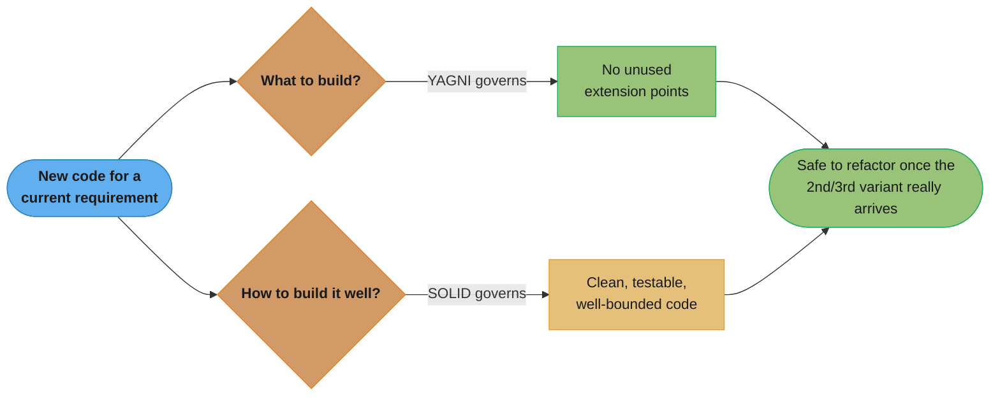

# YAGNI — You Aren't Gonna Need It

## Origins

YAGNI comes from **Extreme Programming (XP)**, articulated by **Ron Jeffries** (one of XP's founders) and popularized by **Kent Beck** in "Extreme Programming Explained" (1999).

The principle emerged as a direct response to the observation that software developers consistently over-build — implementing features and abstractions based on speculation about future needs that often never materialize.

Ron Jeffries' formulation:
> "Always implement things when you actually need them, never when you just foresee that you need them."

---

## Intuition

> **One-line analogy**: YAGNI is like packing for a trip — bring what you need for the actual trip, not everything you might possibly need if unpredictable things happen.

**Mental model**: Engineers naturally over-engineer — "we'll probably need a plugin system," "let's make this configurable," "what if we need this later?" YAGNI says: don't build it until you actually need it. Speculative features are built based on incomplete knowledge of future requirements. They add complexity now, may never be used, and often get in the way when the actual requirement arrives (which is usually different from what was imagined).

**Why it matters**: Unneeded features cost maintenance time even when unused — they must be tested, documented, understood, and updated alongside features people actually use. The cost of speculative features compounds over time.

**Key insight**: YAGNI doesn't mean "never design for extensibility." It means: make today's requirements work cleanly (which naturally produces extensible design via SOLID), but don't implement tomorrow's speculative requirements today. If tomorrow's requirement actually arrives, implement it then — you'll know more about it when it's real.

---

## Definition

Do not add functionality, abstraction, or infrastructure until it is needed by a **current, real requirement**. Features implemented speculatively:

1. May never be needed.
2. Are built based on incomplete knowledge of what will actually be needed.
3. Cost maintenance time even while unused.
4. Make the system harder to understand right now.
5. Often need to be redesigned when the real requirement finally arrives (because it differs from the speculation).

---

## Motivation

Studies and practitioner experience consistently show:
- A large percentage of features in software systems are rarely or never used.
- Every line of code is a liability — it must be read, understood, tested, debugged, and maintained.
- Premature abstractions lock in design decisions before the full picture is known, making the eventual real requirement harder to implement, not easier.

---

## Java Violation Examples

### Example 1: Over-abstracted Infrastructure

```java
// For a "Hello World" web app that just needs to return a greeting:

public interface AbstractStrategyFactoryFacadeManagerInterface<T, R> {
    StrategyFactory<T, R> createStrategyFactory(ExecutionContext<T> context);
}

public abstract class AbstractStrategyFactoryFacadeManager<T, R>
        implements AbstractStrategyFactoryFacadeManagerInterface<T, R> {
    protected abstract StrategyFactory<T, R> buildFactory();
    // ... 200 more lines
}

public class GreetingStrategyFactoryFacadeManager
        extends AbstractStrategyFactoryFacadeManager<GreetingRequest, GreetingResponse> {
    // ... all of this to return "Hello, World!"
}
```

The developer imagined the system might need pluggable greeting strategies, configurable factories, and extensible response types — none of which were requirements.

### Example 2: Configuration Premature Generalization

```java
// The requirement: read application config from a JSON file.

// YAGNI violation — built for JSON, XML, YAML, TOML, and environment variables "just in case":
public interface ConfigurationReader {
    Map<String, Object> read(InputStream source);
}

public class JsonConfigurationReader implements ConfigurationReader { ... }
public class XmlConfigurationReader implements ConfigurationReader { ... }
public class YamlConfigurationReader implements ConfigurationReader { ... }
public class TomlConfigurationReader implements ConfigurationReader { ... }
public class EnvVarConfigurationReader implements ConfigurationReader { ... }

public class ConfigurationReaderFactory {
    public static ConfigurationReader forFormat(String format) { ... }
}
```

Three months later: only JSON is ever used. The XML, YAML, TOML, and env var implementations are dead code that must be maintained and tested — or rot unnoticed.

---

## Compliant Example

```java
// Requirement: read config from a JSON file.

public class AppConfig {
    private final Map<String, Object> properties;

    public AppConfig(Path configFile) throws IOException {
        String json = Files.readString(configFile);
        this.properties = new ObjectMapper().readValue(json, Map.class);
    }

    public String get(String key) {
        return (String) properties.get(key);
    }
}
```

Simple. Does what's needed. If YAML support is needed later, add it then — with full knowledge of the actual requirement.

---

## The Real Costs of Premature Features

| Cost | Description |
|------|-------------|
| **Maintenance cost** | Every unused code path must still be tested, understood, and updated when surrounding code changes. |
| **Opportunity cost** | Developer time spent on speculative features is time not spent on features users actually need. |
| **Wrong abstractions** | Built without a real use case, premature abstractions almost always need to be redesigned when the real case arrives. The redesign is harder than starting fresh because the wrong abstraction is entangled with the rest of the system. |
| **Cognitive load** | Other developers reading the code must understand unused code paths, increasing the mental overhead of working in the codebase. |
| **Increased risk** | More code = more potential bugs, more surface area for security vulnerabilities. |

---

## YAGNI vs SOLID: The Tension and the Balance

These principles can appear to conflict:

- **YAGNI** says: don't add an abstraction until you need it. A concrete class is fine for now.
- **SOLID** (specifically OCP and DIP) says: depend on abstractions, design for extension without modification.

**The resolution:**

YAGNI and SOLID operate at different scopes:

- YAGNI governs **what to build**: don't build features or abstractions before they are needed by a real requirement.
- SOLID governs **how to build it well**: once you're building something, structure it with good principles so it can be changed safely later.

Practical balance:
1. When writing new code for a current requirement, don't add unused extension points (YAGNI).
2. When the second or third variant of something arrives, refactor to a clean abstraction (DRY's Rule of Three + SOLID).
3. Trust that good code — well-tested, well-named, with clear boundaries — can be refactored when the real requirement appears.



*YAGNI and SOLID answer two different questions about the same new code — what to build (nothing speculative) and how to build it well (clean, testable boundaries) — and together they are what makes refactoring safe and cheap once the Rule of Three actually fires.*

The key: **SOLID enables safe refactoring later; YAGNI says don't refactor before the need exists**.

---

## How to Practice YAGNI

**Defer decisions:**
- Treat architectural and design decisions as things to be deferred until the last responsible moment — when you have maximum information.
- "What if we need X?" is a question, not a requirement. Requirements come from users and product decisions, not developer imagination.

**Trust refactoring:**
- YAGNI is only safe in a codebase with good test coverage and clean code. If refactoring is expensive (no tests, high coupling), teams compensate by over-building upfront. The solution is better tests and cleaner code, not more speculation.
- A well-factored codebase makes adding the real feature later cheap.

**Use TDD:**
- Test-Driven Development naturally enforces YAGNI. You write a test for a current requirement, then write the minimum code to pass it. There is no mechanism for writing speculative production code.

**Recognize the signals:**
- "We might need..."
- "Just in case..."
- "Someday we could..."
- "What if the requirements change to..."

These are YAGNI warning phrases. They indicate speculation, not requirement.

---

## Real-World Examples

- **Twitter's early architecture:** Started with a simple Rails monolith. Did not design for 100M users from day one. When scale requirements became real, they were solved with actual data (not speculation).
- **SQLite vs PostgreSQL decision:** Many apps start with SQLite (simple, embedded) and migrate to PostgreSQL when real scale requirements appear — rather than building for distributed scale from day one.
- **Amazon's microservices:** Amazon did not start with microservices. They evolved from a monolith as specific scaling and team autonomy requirements became real.

---

## Related Principles

- **KISS:** YAGNI is KISS applied to feature scope — don't add complexity (features) before needed.
- **Premature Optimization:** "Premature optimization is the root of all evil" (Knuth) — the same principle applied to performance. Don't optimize until you have measured a real bottleneck.
- **Rule of Three (DRY):** Abstract on the third occurrence — don't abstract on the first.

---

## Cross-Perspective: HLD Connections

**HLD View — Where YAGNI Appears in Distributed Systems**

- **Don't shard prematurely** — Sharding adds cross-shard query complexity, resharding pain, and operational overhead. Don't add it before a single-node database is actually at capacity. Premature sharding is YAGNI at infrastructure scale.
- **Don't add a message queue speculatively** — Message queues are powerful but add producer/consumer coupling, schema management, and operational overhead. Add one when synchronous calls are measured to be a bottleneck — not because "we might need async someday."
- **Don't design for multi-region before launch** — Multi-region adds latency management, data residency, conflict resolution, and deployment complexity. Most products never need it. Build for single-region; design the data model to be extendable, but don't implement multi-region upfront.
- **Simple HTTP before gRPC** — gRPC offers performance advantages but adds tooling, protobuf schema management, and observability complexity. For internal services with moderate traffic, REST is simpler and sufficient until measured evidence says otherwise.

---

## Quick Summary

| Aspect | Summary |
|--------|---------|
| Core idea | Don't implement until there is a real, current requirement |
| Not the same as | Ignoring good design — design well for what you're building now |
| Key costs | Maintenance, opportunity cost, wrong abstractions, cognitive load |
| YAGNI vs SOLID | YAGNI: what to build. SOLID: how to build it well. Trust refactoring. |
| How to practice | Defer decisions, trust refactoring, use TDD |
| Warning phrases | "We might need...", "Just in case...", "Someday..." |
