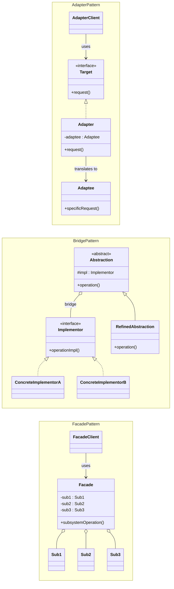
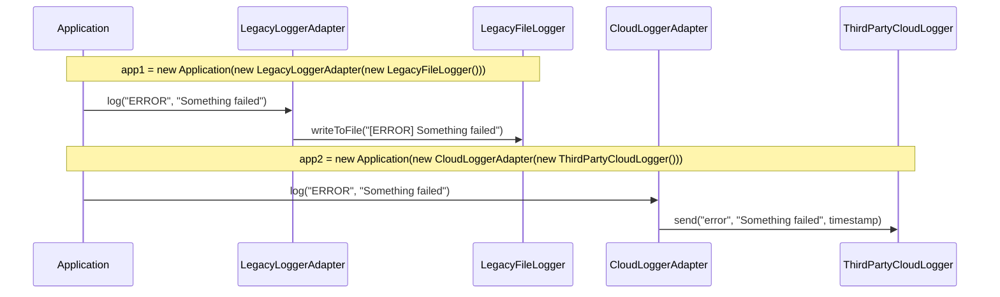
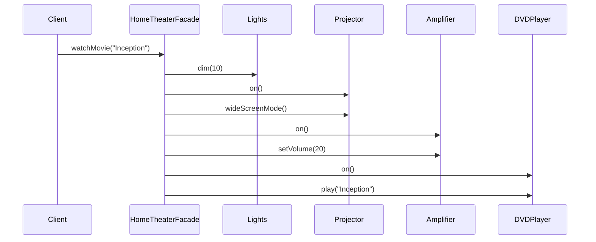
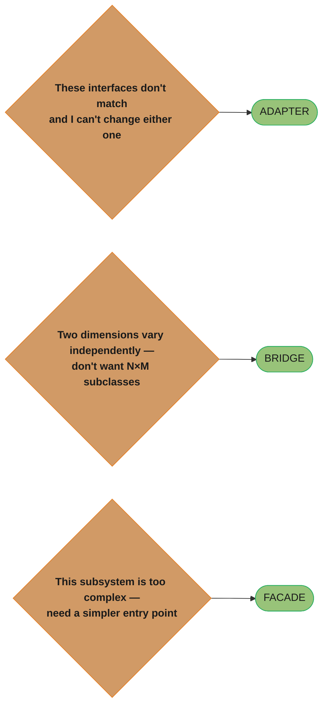

# Adapter vs Bridge vs Facade

## Overview

All three patterns involve wrapping or composing other objects, but they serve fundamentally different purposes at different points in the software lifecycle.

---

## Intuition

> **One-line analogy**: Adapter is a travel plug converter (retrofitting incompatible things); Bridge is a modular power strip (abstraction and plug type evolve independently); Facade is a power strip with an on/off switch for the whole room (simplified control over complexity).

**Mental model**: Adapter fixes incompatibility after the fact — you have an existing class with the wrong interface. Bridge is planned from the start — you know both abstraction and implementation will vary independently, so you separate them by design. Facade makes a complex subsystem simple — no incompatibility is being fixed, just complexity is being hidden.

**Why it matters**: All three involve wrapping, but at different lifecycle points and for different reasons. Using Adapter when you should use Bridge leads to an explosion of adapter subclasses; using Facade when you should use Adapter fails to actually fix the interface mismatch.

**Key insight**: Adapter = fix existing incompatibility (retrofitting). Bridge = plan for independent variation (forward-looking). Facade = simplify complexity for a specific client (usability).

---

## Side-by-Side UML



Three different shapes for the same "wrap something" idea. Adapter converts one incompatible interface after the fact (`Adapter` translates `Target.request()` into `Adaptee.specificRequest()`). Bridge plans for independent variation upfront — `Abstraction` and `Implementor` are two hierarchies joined by a swappable, shared reference (the "bridge"). Facade exposes one simplified entry point (`subsystemOperation()`) over several subsystem classes that remain independently usable (aggregation, not ownership — see the "Subsystem still accessible?" row below).

---

## Key Differences Table

| Dimension | Adapter | Bridge | Facade |
|-----------|---------|--------|--------|
| **Intent** | Make incompatible interfaces work together | Separate abstraction from implementation | Simplify a complex subsystem |
| **Timing** | Applied AFTER the fact (retrofit) | Designed UPFRONT | Applied to existing subsystem |
| **Number of objects wrapped** | One incompatible object | One implementation hierarchy | Multiple subsystem objects |
| **Interface direction** | Converts old interface to expected | Defines two parallel hierarchies | Creates a new simplified interface |
| **Hides complexity?** | No — exposes same complexity | No — exposes two dimensions | Yes — hides subsystem detail |
| **Subsystem still accessible?** | N/A | N/A | Yes — Facade doesn't lock out direct access |
| **Inheritance vs composition** | Either (class adapter or object adapter) | Composition | Composition |
| **Changes original interface** | Yes (translates it) | No — defines new parallel hierarchy | Provides additional simpler interface |

---

## Common Confusion Points

1. **Adapter vs Facade**: Adapter adapts ONE object to an interface. Facade simplifies access to MANY objects. Adapter translates; Facade unifies.
2. **Adapter vs Bridge timing**: The most important distinction. Adapter is a retrofit — you apply it when two things weren't designed to work together. Bridge is designed upfront to allow independent variation of two dimensions.
3. **Bridge vs Strategy**: Bridge separates an abstraction hierarchy from an implementation hierarchy (structural). Strategy swaps algorithms at runtime (behavioral). Bridge is about decomposing structure; Strategy is about selecting behavior.
4. **Facade as a wrapper**: Facade is not just "wrapping" — it is a simplification layer. The subsystem objects still exist independently and can be used without the Facade.

---

## When to Use Which

### Use Adapter when:
- You want to use an existing class but its interface doesn't match what you need
- You have a legacy component you cannot modify
- You are integrating third-party libraries with different interfaces
- You want to create a reusable class that works with classes that don't have compatible interfaces

### Use Bridge when:
- You anticipate that both an abstraction and its implementation will need to vary independently
- You want to avoid a permanent binding between abstraction and implementation
- Changes in implementation should not impact the client code
- You want to avoid an explosion of subclasses from combining two dimensions

### Use Facade when:
- You want to provide a simple interface to a complex subsystem
- There are many dependencies between clients and implementation classes
- You want to layer your subsystems (each layer has a facade for the one below it)
- You want to reduce coupling between clients and subsystem internals

---

## Code Examples

### Adapter — Plugging in a legacy logger

```java
// What our system expects
interface Logger {
    void log(String level, String message);
}

// Legacy logger we cannot modify (wrong interface)
class LegacyFileLogger {
    public void writeToFile(String content) {
        System.out.println("[FILE] " + content);
    }
}

// Third-party logger (also wrong interface)
class ThirdPartyCloudLogger {
    public void send(String severity, String msg, long timestamp) {
        System.out.println("[CLOUD:" + severity + "] " + msg);
    }
}

// Adapter for legacy logger
class LegacyLoggerAdapter implements Logger {
    private final LegacyFileLogger legacyLogger;

    public LegacyLoggerAdapter(LegacyFileLogger legacy) {
        this.legacyLogger = legacy;
    }

    @Override
    public void log(String level, String message) {
        // Translate from expected interface to legacy interface
        legacyLogger.writeToFile("[" + level + "] " + message);
    }
}

// Adapter for third-party logger
class CloudLoggerAdapter implements Logger {
    private final ThirdPartyCloudLogger cloudLogger;

    public CloudLoggerAdapter(ThirdPartyCloudLogger cloud) {
        this.cloudLogger = cloud;
    }

    @Override
    public void log(String level, String message) {
        cloudLogger.send(level.toLowerCase(), message, System.currentTimeMillis());
    }
}

// Application uses only the Logger interface — doesn't know about adapters
class Application {
    private final Logger logger;

    public Application(Logger logger) { this.logger = logger; }

    public void doWork() {
        logger.log("INFO",  "Starting work...");
        logger.log("ERROR", "Something failed");
    }
}

// Wire-up
Application app1 = new Application(new LegacyLoggerAdapter(new LegacyFileLogger()));
Application app2 = new Application(new CloudLoggerAdapter(new ThirdPartyCloudLogger()));
```



`Application` calls the exact same `Logger.log(level, message)` method in both wire-ups — only the adapter changes. `LegacyLoggerAdapter` translates that call into `writeToFile(...)`; `CloudLoggerAdapter` translates the identical call into `send(...)`. `Application` never sees `LegacyFileLogger` or `ThirdPartyCloudLogger` directly.

---

### Bridge — Shapes with rendering implementations

```java
// Implementation hierarchy (varies independently)
interface Renderer {
    void renderCircle(double radius);
    void renderRectangle(double w, double h);
}

class VectorRenderer implements Renderer {
    public void renderCircle(double r)          { System.out.println("SVG Circle r=" + r); }
    public void renderRectangle(double w, double h) { System.out.println("SVG Rect " + w + "x" + h); }
}

class RasterRenderer implements Renderer {
    public void renderCircle(double r)          { System.out.println("Raster Circle r=" + r); }
    public void renderRectangle(double w, double h) { System.out.println("Raster Rect " + w + "x" + h); }
}

// Abstraction hierarchy (varies independently)
abstract class Shape {
    protected Renderer renderer;   // bridge

    public Shape(Renderer renderer) { this.renderer = renderer; }

    public abstract void draw();
    public abstract void resize(double factor);
}

class Circle extends Shape {
    private double radius;

    public Circle(Renderer renderer, double radius) {
        super(renderer);
        this.radius = radius;
    }

    @Override
    public void draw()               { renderer.renderCircle(radius); }

    @Override
    public void resize(double factor) { radius *= factor; }
}

class Rectangle extends Shape {
    private double width, height;

    public Rectangle(Renderer renderer, double w, double h) {
        super(renderer);
        this.width  = w;
        this.height = h;
    }

    @Override
    public void draw()               { renderer.renderRectangle(width, height); }

    @Override
    public void resize(double factor) { width *= factor; height *= factor; }
}

// Without Bridge: 2 shapes * 2 renderers = 4 subclasses
// With Bridge: 2 + 2 = 4 classes (grows linearly not exponentially)
Shape c1 = new Circle(new VectorRenderer(), 5.0);
Shape c2 = new Circle(new RasterRenderer(), 5.0);
Shape r1 = new Rectangle(new VectorRenderer(), 4.0, 3.0);

c1.draw(); // SVG Circle r=5.0
c2.draw(); // Raster Circle r=5.0
r1.draw(); // SVG Rect 4.0x3.0
```

---

### Facade — Home theater system

```java
// Complex subsystem with many interdependent components
class Amplifier {
    public void on()                   { System.out.println("Amp on"); }
    public void setVolume(int level)   { System.out.println("Volume: " + level); }
    public void off()                  { System.out.println("Amp off"); }
}

class DVDPlayer {
    public void on()                   { System.out.println("DVD on"); }
    public void play(String movie)     { System.out.println("Playing: " + movie); }
    public void stop()                 { System.out.println("DVD stop"); }
    public void off()                  { System.out.println("DVD off"); }
}

class Projector {
    public void on()                   { System.out.println("Projector on"); }
    public void wideScreenMode()       { System.out.println("Widescreen mode"); }
    public void off()                  { System.out.println("Projector off"); }
}

class Lights {
    public void dim(int level)         { System.out.println("Lights dim to " + level + "%"); }
    public void on()                   { System.out.println("Lights on"); }
}

// Facade — provides simple interface to the complex subsystem
class HomeTheaterFacade {
    private final Amplifier amp;
    private final DVDPlayer dvd;
    private final Projector projector;
    private final Lights lights;

    public HomeTheaterFacade(Amplifier amp, DVDPlayer dvd,
                             Projector projector, Lights lights) {
        this.amp       = amp;
        this.dvd       = dvd;
        this.projector = projector;
        this.lights    = lights;
    }

    public void watchMovie(String movie) {
        System.out.println("--- Get ready to watch a movie ---");
        lights.dim(10);
        projector.on();
        projector.wideScreenMode();
        amp.on();
        amp.setVolume(20);
        dvd.on();
        dvd.play(movie);
    }

    public void endMovie() {
        System.out.println("--- Shutting down theater ---");
        dvd.stop();
        dvd.off();
        amp.off();
        projector.off();
        lights.on();
    }
}

// Client uses simple facade instead of managing 4 objects
HomeTheaterFacade theater = new HomeTheaterFacade(
    new Amplifier(), new DVDPlayer(), new Projector(), new Lights()
);
theater.watchMovie("Inception");
theater.endMovie();
// Subsystem objects still available for advanced users who need direct access
```



One `watchMovie("Inception")` call fans out to seven calls across four subsystem objects, in an order `Client` never has to know. `Client` still could call `Amplifier`, `Projector`, `DVDPlayer`, or `Lights` directly — the Facade doesn't lock out direct access — it just means most callers never need to.

---

## Interview Answer Templates

**Q: What is the difference between Adapter and Facade?**

> Adapter converts the interface of a single object so it matches what the client expects — it's a translator between two incompatible interfaces. Facade provides a simplified, unified interface to a whole subsystem made of multiple objects — it's a simplification layer. Adapter is about interface compatibility; Facade is about reducing complexity.

**Q: How does Bridge differ from Adapter?**

> The fundamental difference is intent and timing. Adapter is a retrofit — you apply it when two things weren't originally designed to work together. Bridge is designed upfront when you anticipate two independent dimensions of variation (e.g., shapes and rendering strategies). Adapter solves a compatibility problem after the fact. Bridge prevents a class explosion problem before it occurs.

**Q: Can Adapter and Facade be used together?**

> Yes, commonly. A Facade might use Adapter internally to integrate third-party subsystems that have incompatible interfaces into the simplified facade interface.

---

## Summary



Each problem statement maps to exactly one pattern. If a real design seems to need more than one of these three for the very same problem, revisit the Key Differences table above — genuine three-way overlap is rare.
