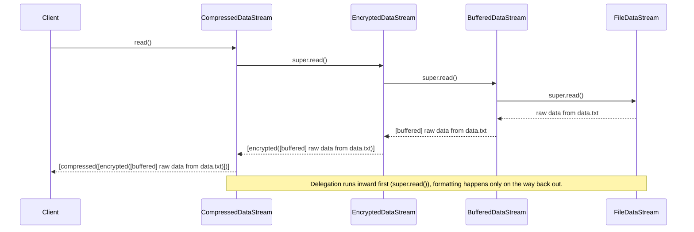
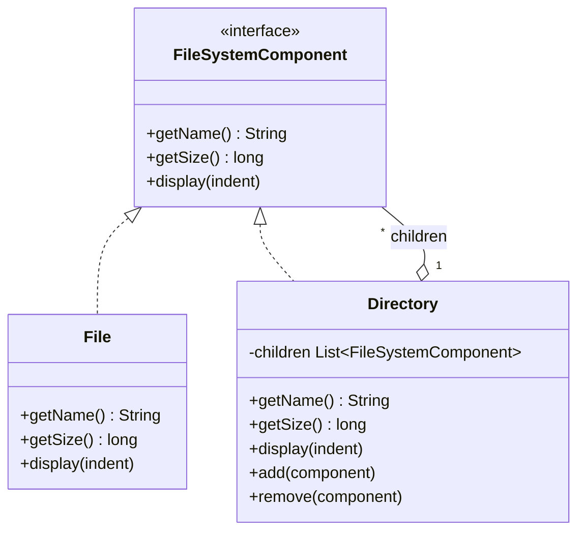
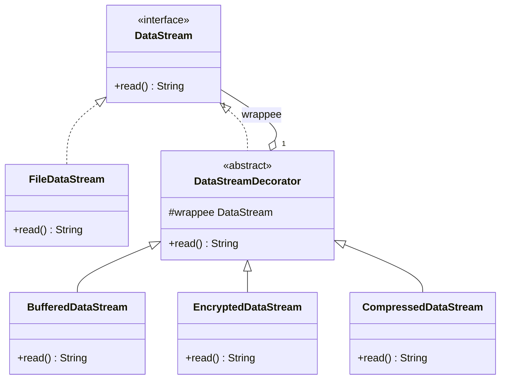
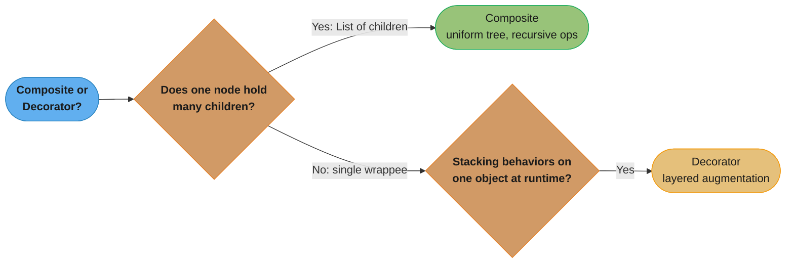

# Composite vs Decorator Pattern

## Quick Summary

- **Composite**: Builds a tree of objects — treats individual items and groups uniformly (part-whole hierarchy).
- **Decorator**: Wraps an object to add behavior dynamically — extends responsibility without subclassing.

---

## Intuition

> **One-line analogy**: Composite is a company org chart (managers and employees treated the same way through one interface); Decorator is a gift wrap station (each layer adds something, but you're still wrapping the same gift).

**Mental model**: Composite builds a *tree* — nodes and leaves both implement the same interface, so `calculateCost()` on a folder recursively sums its files. Decorator builds a *chain* — each wrapper adds behavior and delegates to the next, with exactly one leaf at the center. The structural difference: Composite nodes have *multiple* children; Decorator wrappers have exactly *one* wrapped component.

**Why it matters**: Both use the same interface-wrapping trick. The confusion arises because Decorator could be misread as a two-node tree. The key: if you need arbitrary tree depth with multiple children, use Composite. If you need layered augmentation of a single object, use Decorator.

**Key insight**: Children count is the structural tell — Composite: `List<Component> children`. Decorator: `Component wrappee`. If you're adding capabilities to one thing, Decorator. If you're building a hierarchy of things, Composite.

---

## Side-by-Side Comparison

| Aspect             | Composite                                          | Decorator                                          |
|--------------------|----------------------------------------------------|----------------------------------------------------|
| **Intent**         | Compose objects into tree structures to represent part-whole hierarchies | Attach additional responsibilities to an object dynamically |
| **Structure**      | Component interface; Leaf and Composite both implement it; Composite holds children | Component interface; ConcreteComponent and Decorator both implement it; Decorator wraps a Component |
| **Key Difference** | About STRUCTURE — modeling a hierarchy of objects  | About BEHAVIOR — augmenting a single object's capabilities |
| **Use When**       | You need to treat a single object and a group of objects the same way | You need to add/remove behaviors at runtime without changing the class |

---

## Java Code Examples

### Composite Pattern — File System

```java
import java.util.ArrayList;
import java.util.List;

// Component interface — uniform interface for files and directories
public interface FileSystemComponent {
    String getName();
    long getSize();
    void display(String indent);
}

// Leaf — cannot contain children
public class File implements FileSystemComponent {
    private final String name;
    private final long size;

    public File(String name, long size) {
        this.name = name;
        this.size = size;
    }

    @Override
    public String getName() { return name; }

    @Override
    public long getSize() { return size; }

    @Override
    public void display(String indent) {
        System.out.println(indent + "File: " + name + " (" + size + " bytes)");
    }
}

// Composite — contains children (files or subdirectories)
public class Directory implements FileSystemComponent {
    private final String name;
    private final List<FileSystemComponent> children = new ArrayList<>();

    public Directory(String name) {
        this.name = name;
    }

    public void add(FileSystemComponent component) {
        children.add(component);
    }

    public void remove(FileSystemComponent component) {
        children.remove(component);
    }

    @Override
    public String getName() { return name; }

    @Override
    public long getSize() {
        // Recursively sum children — works uniformly for files and subdirs
        return children.stream().mapToLong(FileSystemComponent::getSize).sum();
    }

    @Override
    public void display(String indent) {
        System.out.println(indent + "Directory: " + name + "/");
        for (FileSystemComponent child : children) {
            child.display(indent + "  ");
        }
    }
}

// Client
public class CompositeDemo {
    public static void main(String[] args) {
        File readme = new File("README.md", 1024);
        File main   = new File("Main.java", 2048);
        File util   = new File("Utils.java", 512);

        Directory src = new Directory("src");
        src.add(main);
        src.add(util);

        Directory project = new Directory("project");
        project.add(readme);
        project.add(src);

        project.display("");
        System.out.println("Total size: " + project.getSize() + " bytes");
        // Client treats File and Directory identically via FileSystemComponent
    }
}
```

**Output:**
```
Directory: project/
  File: README.md (1024 bytes)
  Directory: src/
    File: Main.java (2048 bytes)
    File: Utils.java (512 bytes)
Total size: 3584 bytes
```

---

### Decorator Pattern — InputStream Style I/O

```java
// Component interface
public interface DataStream {
    String read();
}

// Concrete Component — the base object being decorated
public class FileDataStream implements DataStream {
    private final String filename;

    public FileDataStream(String filename) {
        this.filename = filename;
    }

    @Override
    public String read() {
        return "raw data from " + filename;
    }
}

// Abstract Decorator — wraps a DataStream and delegates to it
public abstract class DataStreamDecorator implements DataStream {
    protected final DataStream wrappee;

    public DataStreamDecorator(DataStream wrappee) {
        this.wrappee = wrappee;
    }

    @Override
    public String read() {
        return wrappee.read();  // delegate by default
    }
}

// Concrete Decorator 1: adds buffering
public class BufferedDataStream extends DataStreamDecorator {

    public BufferedDataStream(DataStream wrappee) {
        super(wrappee);
    }

    @Override
    public String read() {
        return "[buffered] " + super.read();
    }
}

// Concrete Decorator 2: adds encryption
public class EncryptedDataStream extends DataStreamDecorator {

    public EncryptedDataStream(DataStream wrappee) {
        super(wrappee);
    }

    @Override
    public String read() {
        String data = super.read();
        return "[encrypted(" + data + ")]";
    }
}

// Concrete Decorator 3: adds compression
public class CompressedDataStream extends DataStreamDecorator {

    public CompressedDataStream(DataStream wrappee) {
        super(wrappee);
    }

    @Override
    public String read() {
        String data = super.read();
        return "[compressed(" + data + ")]";
    }
}

// Client
public class DecoratorDemo {
    public static void main(String[] args) {
        // Stack decorators like Java's InputStream wrappers
        DataStream stream = new FileDataStream("data.txt");
        stream = new BufferedDataStream(stream);
        stream = new EncryptedDataStream(stream);
        stream = new CompressedDataStream(stream);

        System.out.println(stream.read());
        // Output: [compressed([encrypted([buffered] raw data from data.txt)])]
    }
}
```

**Runtime call chain**: the demo nests four objects, but `read()` doesn't evaluate outside-in — each decorator's `super.read()` first delegates to the object it wraps, and only formats the string on the way back out, which is why `FileDataStream` supplies the raw data first and `CompressedDataStream` is the last to wrap it.



---

## Key Structural Differences — ASCII Class Diagrams

### Composite



`File` and `Directory` both realize `FileSystemComponent`; `Directory` aggregates a list of `FileSystemComponent` — which can itself include more `Directory` nodes — so `getSize()` recurses through the whole subtree via one polymorphic call.

### Decorator



`FileDataStream` and the abstract `DataStreamDecorator` both realize `DataStream`; `DataStreamDecorator` aggregates exactly one wrapped `DataStream` (`wrappee`), and `BufferedDataStream`, `EncryptedDataStream`, and `CompressedDataStream` each extend it to layer one behavior around `read()`.

**Key structural tell:**
- Composite holds a *collection* of the same component type (children list).
- Decorator holds a *single* reference to one component (its wrappee).

---

## Decision Guide

Use **Composite** when:
- You are modeling a part-whole hierarchy (trees, org charts, menus, UI component trees)
- Clients should treat leaf nodes and containers identically
- You need recursive operations (calculate total size, render all children, find all nodes)
- The structure is primarily about *containment*

Use **Decorator** when:
- You need to add responsibilities to individual objects, not to a class
- You want combinations of behaviors that would create an explosion of subclasses if done via inheritance
- Behaviors should be stackable and removable at runtime
- The structure is primarily about *augmenting* a single object

Both checklists collapse into one branching question:



---

## Common Confusion Points

1. **Both wrap a component** — The difference is purpose: Composite wraps *many* to model a tree; Decorator wraps *one* to add behavior.

2. **Composite's `add()`/`remove()` are not in the component interface** (typically) — Leaf nodes do not have children. Type safety vs. transparency is a design tension in Composite.

3. **Decorator chain order matters** — Wrapping `Encrypted(Buffered(File))` is different from `Buffered(Encrypted(File))`. The innermost decorator executes first during delegation.

4. **Composite is structural, Decorator is behavioral** — Gang of Four classification makes this explicit. Composite answers "what is the shape of the object graph?" Decorator answers "what can this object do?"

5. **Decorator is not subclassing** — Even though it implements the same interface as the component, it does so by delegation, not by inheritance of behavior.

---

## Real-World Examples

| Composite | Decorator |
|-----------|-----------|
| `java.awt.Container` (contains `Component` children) | `java.io.BufferedInputStream` wrapping `FileInputStream` |
| HTML/XML DOM tree (element contains child elements) | `java.io.GZIPOutputStream` wrapping `FileOutputStream` |
| GUI widget trees (panel contains buttons, labels) | Spring `HttpServletRequestWrapper` |
| Organization charts (department contains employees or sub-departments) | Java logging handlers with formatters |
| Menu systems (menu contains menu items or sub-menus) | HTTP middleware chains (authentication → rate-limiting → logging) |

---

## Can They Work Together?

Yes — Decorator can be applied to nodes in a Composite tree:

```java
// A logged directory that reports every access
public class LoggedDirectory extends DataStreamDecorator {

    private final String dirName;

    public LoggedDirectory(DataStream wrappee, String dirName) {
        super(wrappee);
        this.dirName = dirName;
    }

    @Override
    public String read() {
        System.out.println("[LOG] Accessing: " + dirName);
        return super.read();
    }
}

// Usage: wrap a specific node in the Composite tree with a Decorator
FileSystemComponent sensitiveDir = new Directory("confidential");
// ... add files ...
// Now decorate just this node with logging behavior
// (shown conceptually — adapt interfaces as needed)
```

A concrete real-world example: `java.io` uses Composite-style recursive reading and Decorator-style wrapping (`BufferedReader` → `InputStreamReader` → `FileInputStream`) in the same pipeline.
