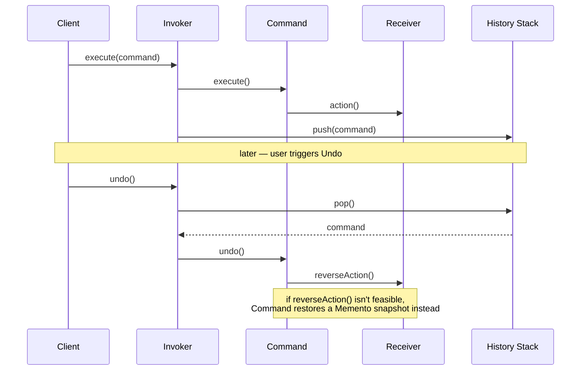
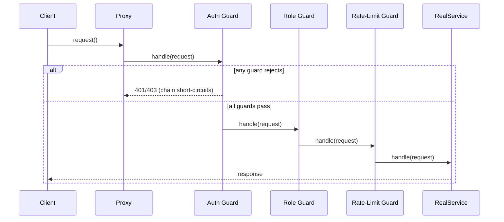

# Design Pattern Decision Flowchart

A comprehensive guide to choosing the right design pattern for your problem.

---

## Intuition

> **One-line analogy**: The pattern decision flowchart is like a field guide for identifying plants — you answer a series of distinguishing questions and converge on the right species.

**Mental model**: Before reaching for a pattern name, answer three questions: (1) What's my primary concern — creation, structure, or behavior? (2) Who varies — the object being created, how objects are composed, or how objects communicate? (3) What changes at runtime vs compile time? These three dimensions map cleanly to the 23 GoF patterns. The flowchart makes implicit pattern-selection reasoning explicit.

**Why it matters**: Pattern application without a decision framework leads to Golden Hammer — using the patterns you know regardless of fit. The flowchart builds the habit of starting from the problem, not the solution.

**Key insight**: If two patterns seem equally applicable, pick the simpler one. Patterns are tools, not goals. The code that works and is readable beats the code that's theoretically "correct."

---

## 1. Pattern Selection Decision Tree

```mermaid
flowchart LR
    classDef io      fill:#61afef,stroke:#2e86c1,color:#1a1a1a,font-weight:bold
    classDef frozen  fill:#c678dd,stroke:#9b59b6,color:#fff
    classDef train   fill:#98c379,stroke:#27ae60,color:#1a1a1a
    classDef mathOp  fill:#d19a66,stroke:#e67e22,color:#1a1a1a,font-weight:bold
    classDef lossN   fill:#e06c75,stroke:#c0392b,color:#fff,font-weight:bold
    classDef req     fill:#56b6c2,stroke:#0097a7,color:#1a1a1a
    classDef base    fill:#e5c07b,stroke:#f39c12,color:#1a1a1a

    Root(["What is your<br/>primary concern?"])
    Root --> Creation
    Root --> Structure
    Root --> Behavior

    subgraph Creation["OBJECT CREATION"]
        direction LR
        C1{"Need only ONE instance<br/>across the application?"} --> CP1(["Singleton"])
        C2{"Create objects, defer exact<br/>class to subclasses?"} --> CP2(["Factory Method"])
        C3{"Create FAMILIES of related<br/>objects, no concrete classes?"} --> CP3(["Abstract Factory"])
        C4{"Build COMPLEX objects step<br/>by step, many optional parts?"} --> CP4(["Builder"])
        C5{"Create a new object by<br/>COPYING an existing one?"} --> CP5(["Prototype"])
    end

    subgraph Structure["OBJECT STRUCTURE"]
        direction LR
        S1{"Make an INCOMPATIBLE<br/>interface work with yours?"} --> SP1(["Adapter"])
        S2{"Separate ABSTRACTION from<br/>IMPLEMENTATION, vary both?"} --> SP2(["Bridge"])
        S3{"Treat individual objects and<br/>GROUPS uniformly (tree)?"} --> SP3(["Composite"])
        S4{"ADD RESPONSIBILITIES to an<br/>object dynamically, no subclass?"} --> SP4(["Decorator"])
        S5{"Provide a SIMPLIFIED interface<br/>to a complex subsystem?"} --> SP5(["Facade"])
        S6{"Share many FINE-GRAINED<br/>objects to save memory?"} --> SP6(["Flyweight"])
        S7{"CONTROL ACCESS to an object<br/>(lazy, security, remote)?"} --> SP7(["Proxy"])
    end

    subgraph Behavior["OBJECT BEHAVIOR"]
        direction LR
        B1{"Pass a request along a CHAIN<br/>of handlers until handled?"} --> BP1(["Chain of Responsibility"])
        B2{"ENCAPSULATE a request as an<br/>object (queue, log, undo)?"} --> BP2(["Command"])
        B3{"Define a GRAMMAR and<br/>interpret sentences in it?"} --> BP3(["Interpreter"])
        B4{"ACCESS elements SEQUENTIALLY<br/>without exposing internals?"} --> BP4(["Iterator"])
        B5{"Reduce DEPENDENCIES between<br/>many communicating objects?"} --> BP5(["Mediator"])
        B6{"CAPTURE and RESTORE state<br/>without breaking encapsulation?"} --> BP6(["Memento"])
        B7{"NOTIFY multiple objects when<br/>one object changes state?"} --> BP7(["Observer"])
        B8{"Let an object ALTER behavior<br/>when INTERNAL STATE changes?"} --> BP8(["State"])
        B9{"Define a FAMILY OF ALGORITHMS,<br/>make them interchangeable?"} --> BP9(["Strategy"])
        B10{"Fix an algorithm's SKELETON,<br/>subclasses fill in steps?"} --> BP10(["Template Method"])
        B11{"Perform an OPERATION on elements<br/>without changing their classes?"} --> BP11(["Visitor"])
    end

    class Root io
    class C1,C2,C3,C4,C5,S1,S2,S3,S4,S5,S6,S7,B1,B2,B3,B4,B5,B6,B7,B8,B9,B10,B11 mathOp
    class CP1,CP2,CP3,CP4,CP5,SP1,SP2,SP3,SP4,SP5,SP6,SP7,BP1,BP2,BP3,BP4,BP5,BP6,BP7,BP8,BP9,BP10,BP11 train
```

The tree mirrors the file's own structure: pick a concern (creation, structure, or behavior — blue root, gold clusters), then follow the first orange question that fits — the green leaf is your starting pattern. If two leaves seem equally applicable, prefer the simpler pattern (see Intuition above).

---

## 2. Problem-to-Pattern Mapping Table

| Problem Statement | Recommended Pattern | Why |
|---|---|---|
| "I need only one instance of a class (e.g., config, logger)" | Singleton | Guarantees a single global instance and provides a global access point |
| "I need to create objects but don't know the exact class at compile time" | Factory Method | Defers instantiation to subclasses; decouples creation from usage |
| "I need to create families of related objects that must work together" | Abstract Factory | Ensures product compatibility across a family without coupling to concrete classes |
| "I need to construct a complex object with many optional fields or steps" | Builder | Separates construction from representation; avoids telescoping constructors |
| "I need a new object that is a copy of an existing one with slight modifications" | Prototype | Cloning is cheaper than re-instantiation; useful when class is unknown at runtime |
| "I need to use a third-party class but its interface doesn't match mine" | Adapter | Wraps an incompatible interface so it looks like the expected one |
| "I need my abstraction and implementation to evolve independently" | Bridge | Decouples hierarchy; avoids O(m*n) subclass explosion |
| "I need to work with tree structures and treat leaves and composites uniformly" | Composite | Allows recursive composition; client code works with any node the same way |
| "I need to add features to an object at runtime without modifying its class" | Decorator | Wraps objects in layers; respects Open/Closed Principle |
| "I need to hide the complexity of a subsystem behind a simple interface" | Facade | Reduces coupling between client and subsystem; simplifies API surface |
| "I need to support a huge number of similar objects efficiently in memory" | Flyweight | Shares intrinsic state; stores extrinsic state outside the object |
| "I need to control access to an object (security, caching, lazy init, remote)" | Proxy | Intercepts calls; adds a layer between client and real subject |
| "I need multiple handlers to process a request without the sender knowing which one" | Chain of Responsibility | Decouples sender from receiver; allows dynamic handler chains |
| "I need to parameterize, queue, log, or undo operations" | Command | Encapsulates requests as objects; supports undoable operations |
| "I need to parse and evaluate sentences in a simple language or grammar" | Interpreter | Defines grammar as a class hierarchy; each class interprets one rule |
| "I need to traverse a collection without knowing its internal structure" | Iterator | Provides a uniform traversal interface; hides the collection's implementation |
| "I need to coordinate multiple objects that would otherwise be tightly coupled" | Mediator | Centralizes communication; reduces many-to-many dependencies to one-to-many |
| "I need to save and restore an object's state (undo, snapshots)" | Memento | Captures internal state externally without violating encapsulation |
| "I need multiple objects to react when another object changes" | Observer | Establishes a one-to-many dependency; decouples publishers from subscribers |
| "I need an object to behave differently based on its current state" | State | Replaces conditional logic with polymorphic state objects |
| "I need to swap algorithms or behaviors at runtime" | Strategy | Encapsulates algorithms behind an interface; interchangeable at runtime |
| "I need an algorithm with fixed steps but some steps should be overridable by subclasses" | Template Method | Defines skeleton in base class; lets subclasses override specific steps |
| "I need to add a new operation to a class hierarchy without modifying the classes" | Visitor | Separates algorithm from object structure; easy to add new operations |

---

## 3. Common Design Scenarios

### Undo/Redo Functionality
- **Patterns:** Command + Memento
- **Command** encapsulates each operation as an object with `execute()` and `undo()` methods.
- **Memento** captures the full state snapshot before an operation if fine-grained undo is not feasible.
- Keep a history stack (list of Commands); pop to undo, re-execute to redo.

The Invoker never inspects a Command's internals — it just pushes onto the history stack on `execute()` and pops + calls `undo()` on undo, which is why Command composes so cleanly with Memento for undo/redo.

### Plugin Architecture
- **Patterns:** Strategy + Factory Method (or Abstract Factory)
- **Strategy** defines the plugin interface; each plugin is a concrete strategy.
- **Factory Method** (or a registry map) instantiates the correct plugin by name/type at runtime.
- Optionally wrap with **Decorator** for cross-cutting concerns like logging or metrics.

### Event System
- **Patterns:** Observer + Command
- **Observer** handles the pub/sub wiring: subjects notify registered listeners.
- **Command** wraps each event payload so it can be serialized, queued, replayed, or logged.
- Combine with **Mediator** to avoid direct coupling between producers and consumers.

### Permission / Authorization System
- **Patterns:** Proxy + Chain of Responsibility
- **Proxy** intercepts every call to the real service and delegates to the auth layer.
- **Chain of Responsibility** passes the request through a series of guards (auth check, role check, rate limit) before reaching the real handler.

Proxy is the single entry point that intercepts every call; internally it delegates into a Chain of Responsibility of guards, any one of which can short-circuit with a rejection before the request ever reaches RealService.

### UI Component Tree
- **Patterns:** Composite + Decorator
- **Composite** models the component hierarchy: containers hold children, leaves are primitives; both implement the same `render()` interface.
- **Decorator** layers behavior (borders, scroll bars, shadows) onto any component without subclassing.

### Application Configuration
- **Patterns:** Singleton + Builder
- **Singleton** ensures there is one config object application-wide.
- **Builder** constructs the config from multiple sources (env vars, files, CLI args) in a controlled, step-by-step manner.

### Logging / Monitoring
- **Patterns:** Proxy + Observer
- **Proxy** wraps service calls to intercept and log entry/exit automatically.
- **Observer** publishes log/metric events to multiple sinks (file, stdout, monitoring dashboard) without coupling the source to any sink.

### State Machines
- **Patterns:** State + Command
- **State** represents each machine state as a class; transitions are polymorphic method calls.
- **Command** encapsulates each transition/action so it can be queued, logged, or replayed.

---

## 4. Pattern Combinations Matrix

| Pattern | Works Well With | Notes |
|---|---|---|
| Singleton | Builder, Facade, Proxy | Builder constructs the singleton; Facade or Proxy often implemented as singletons |
| Factory Method | Template Method, Prototype, Abstract Factory | Factory Method uses Template Method internally; can return Prototypes |
| Abstract Factory | Factory Method, Singleton, Builder | Abstract Factory is often a Singleton; uses Factory Methods internally |
| Builder | Composite, Strategy, Prototype | Builder assembles Composites; Strategy selects the build algorithm |
| Prototype | Factory Method, Composite, Memento | Prototype clones complex Composites; Memento stores prototype snapshots |
| Adapter | Facade, Decorator, Proxy | Adapter + Facade simplifies legacy integration; Adapter vs Proxy differs in intent |
| Bridge | Abstract Factory, Strategy | Bridge's implementation side is often injected via Factory; Strategy is a degenerate Bridge |
| Composite | Visitor, Iterator, Decorator | Visitor operates over Composite trees; Iterator traverses them; Decorator wraps leaf nodes |
| Decorator | Strategy, Composite, Chain of Responsibility | Decorator wraps; Strategy replaces — often interchangeable; Chain is a linear Decorator |
| Facade | Singleton, Mediator, Abstract Factory | Facade is often a Singleton; both Facade and Mediator simplify interactions |
| Flyweight | Composite, Factory Method | Factory ensures Flyweights are shared; Flyweight is often used as Composite leaves |
| Proxy | Decorator, Chain of Responsibility, Observer | Proxy and Decorator have similar structure but different intent |
| Chain of Responsibility | Command, Composite | Each handler is a Command; chain can be built as a Composite |
| Command | Memento, Observer, Chain of Responsibility | Command + Memento = undo/redo; Command + Observer = event bus |
| Interpreter | Composite, Visitor, Iterator | AST is a Composite; Visitor interprets it; Iterator traverses tokens |
| Iterator | Composite, Factory Method, Visitor | Iterator traverses Composites; Factory creates the right Iterator |
| Mediator | Observer, Command, Facade | Mediator uses Observer to wire components; resembles a bi-directional Facade |
| Memento | Command, State, Prototype | Command uses Memento for undo; State saves snapshots via Memento |
| Observer | Command, Mediator, Strategy | Observer notifies; Command carries the notification payload |
| State | Command, Strategy, Singleton | Each State can be a Singleton; Strategy vs State differs in who drives change |
| Strategy | Template Method, Bridge, Factory Method | Strategy replaces conditional logic; Template Method uses inheritance instead |
| Template Method | Factory Method, Strategy | Factory Method is a specialization of Template Method for object creation |
| Visitor | Composite, Iterator, Strategy | Visitor + Composite is the canonical double-dispatch over a tree |

---

## 5. Anti-Pattern Warnings

### Singleton Overuse
- **Misuse:** Using Singleton as a global variable bag for everything.
- **Problem:** Hidden dependencies, tight coupling, untestable code, concurrency issues.
- **Instead:** Use Dependency Injection. Pass dependencies explicitly; let a DI container manage lifetimes.

### Factory for Simple Objects
- **Misuse:** Creating a Factory class for objects that only have one implementation and never change.
- **Problem:** Unnecessary indirection; adds complexity with no benefit.
- **Instead:** Use a simple constructor or a static factory method on the class itself.

### Decorator Hell
- **Misuse:** Stacking so many Decorators that the call stack becomes impossible to debug.
- **Problem:** Hard to trace which Decorator is active; ordering bugs are subtle.
- **Instead:** Limit Decorator depth; consider a Pipeline/Chain of Responsibility with explicit ordering.

### God Mediator
- **Misuse:** Putting all business logic inside the Mediator, making it a God Object.
- **Problem:** The Mediator becomes the bottleneck and violates SRP.
- **Instead:** Keep the Mediator thin — only coordination logic; push business logic into the components.

### Strategy When Template Method Is Enough
- **Misuse:** Using Strategy (object composition) when only one or two steps vary and subclassing is simpler.
- **Problem:** Forces the caller to instantiate and inject a strategy object unnecessarily.
- **Instead:** Use Template Method when the algorithm skeleton is fixed and variation is limited to a few hook methods.

### Observer Without Back-Pressure
- **Misuse:** Allowing slow observers to be notified synchronously without any throttling or async handling.
- **Problem:** One slow subscriber blocks all others; event queues grow unbounded.
- **Instead:** Use an async event bus, apply back-pressure strategies, or a dead-letter queue for failed deliveries.

### Composite With Mixed Types
- **Misuse:** Forcing very different objects into a Composite just because they are in a tree.
- **Problem:** The common interface becomes bloated with methods that only make sense for some nodes.
- **Instead:** Use a narrower interface; push type-specific operations to subclasses; consider the Visitor pattern for type-specific operations.

### Proxy as a Decorator
- **Misuse:** Adding behavior via a Proxy when a Decorator is the correct abstraction.
- **Problem:** Proxy is intended for access control / indirection, not feature layering — confuses intent.
- **Instead:** Use Decorator for behavior addition; reserve Proxy for access control, caching, remote access.

### Command Without Undo Design
- **Misuse:** Using Command purely for queueing without designing `undo()` from the start, then retrofitting it.
- **Problem:** State needed for undo is already discarded by execution time.
- **Instead:** Design `execute()` and `undo()` together from day one; capture pre-state in the Command before executing.

---

## 6. Quick Reference Card

| # | Pattern | Category | Intent (one line) | Key Participants |
|---|---|---|---|---|
| 1 | Singleton | Creational | Ensure one instance; provide global access | Singleton class |
| 2 | Factory Method | Creational | Let subclasses decide which class to instantiate | Creator, ConcreteCreator, Product |
| 3 | Abstract Factory | Creational | Create families of related objects | AbstractFactory, ConcreteFactory, AbstractProduct |
| 4 | Builder | Creational | Construct complex objects step by step | Builder, ConcreteBuilder, Director, Product |
| 5 | Prototype | Creational | Clone existing objects instead of constructing | Prototype, ConcretePrototype |
| 6 | Adapter | Structural | Convert one interface into another expected by clients | Target, Adapter, Adaptee |
| 7 | Bridge | Structural | Decouple abstraction from implementation | Abstraction, Implementor, RefinedAbstraction |
| 8 | Composite | Structural | Compose objects into tree structures; treat uniformly | Component, Leaf, Composite |
| 9 | Decorator | Structural | Attach responsibilities dynamically | Component, Decorator, ConcreteDecorator |
| 10 | Facade | Structural | Provide a simplified interface to a subsystem | Facade, Subsystem classes |
| 11 | Flyweight | Structural | Share fine-grained objects to reduce memory | Flyweight, FlyweightFactory, Context |
| 12 | Proxy | Structural | Provide a surrogate to control object access | Subject, Proxy, RealSubject |
| 13 | Chain of Responsibility | Behavioral | Pass request along a handler chain | Handler, ConcreteHandler, Client |
| 14 | Command | Behavioral | Encapsulate a request as an object | Command, ConcreteCommand, Invoker, Receiver |
| 15 | Interpreter | Behavioral | Define a grammar and interpret sentences | AbstractExpression, TerminalExpression, Context |
| 16 | Iterator | Behavioral | Sequential access to collection elements | Iterator, ConcreteIterator, Aggregate |
| 17 | Mediator | Behavioral | Centralize complex communications | Mediator, ConcreteMediator, Colleague |
| 18 | Memento | Behavioral | Capture and restore object state | Originator, Memento, Caretaker |
| 19 | Observer | Behavioral | Notify dependents of state changes | Subject, Observer, ConcreteObserver |
| 20 | State | Behavioral | Alter behavior when internal state changes | Context, State, ConcreteState |
| 21 | Strategy | Behavioral | Define interchangeable algorithms | Context, Strategy, ConcreteStrategy |
| 22 | Template Method | Behavioral | Define algorithm skeleton; defer steps to subclasses | AbstractClass, ConcreteClass |
| 23 | Visitor | Behavioral | Add operations to objects without changing their classes | Visitor, ConcreteVisitor, Element, ObjectStructure |
