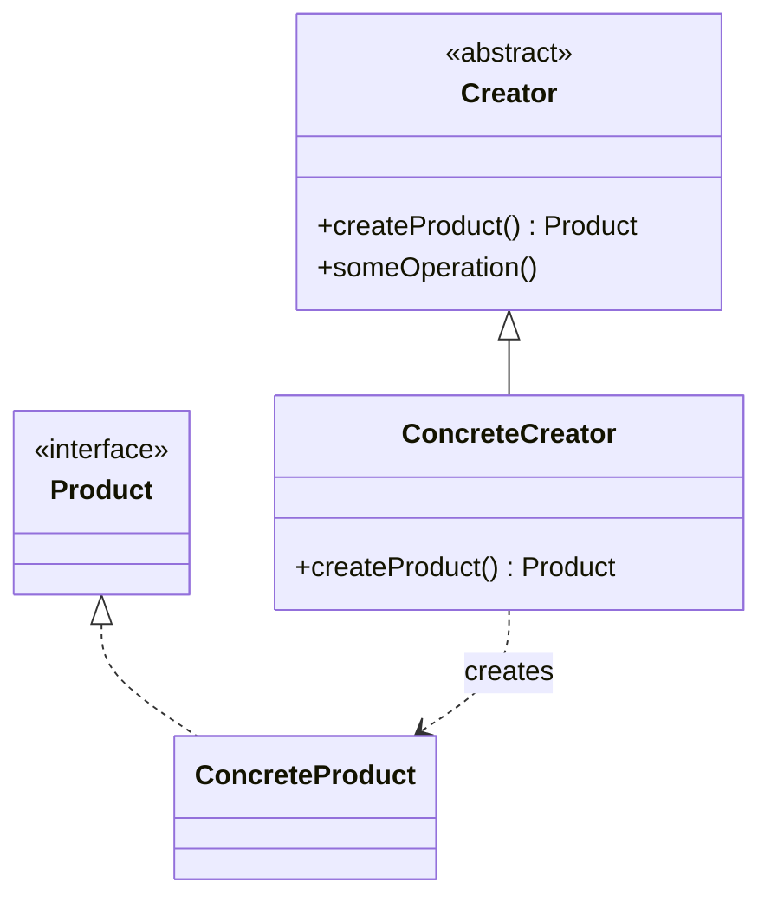
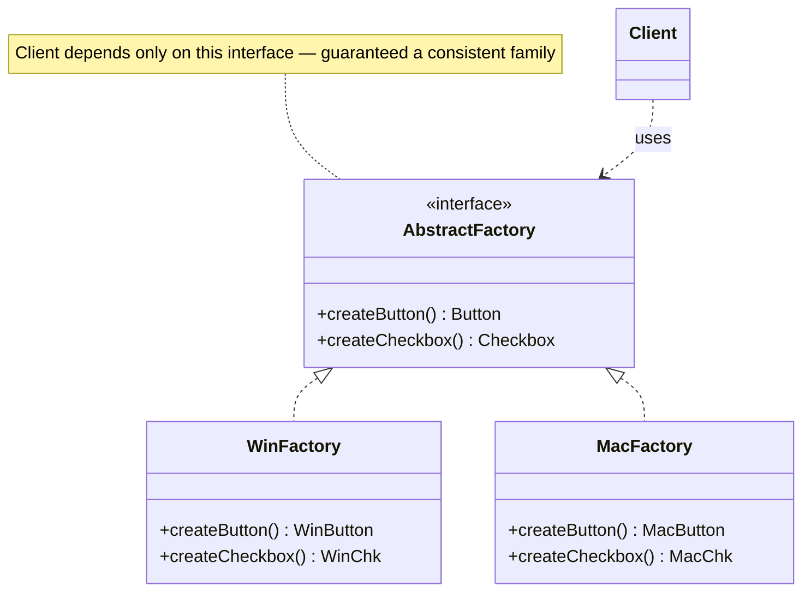
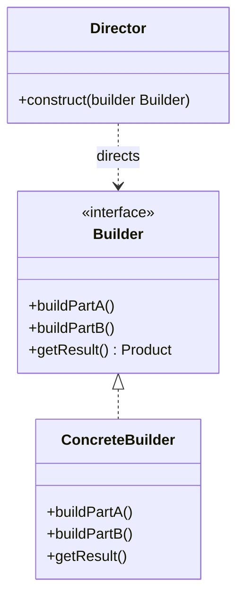
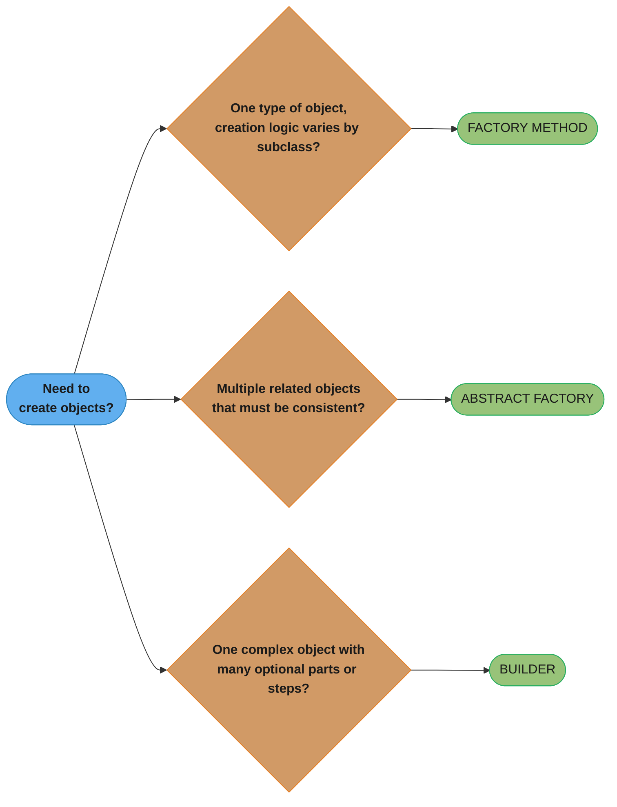

# Factory Method vs Abstract Factory vs Builder

## Overview

All three are creational patterns that hide object construction from the client. They differ in **complexity**, **what they create**, and **how much the client participates in construction**.

---

## Intuition

> **One-line analogy**: Factory Method is a cookie cutter (one type at a time); Abstract Factory is a matching cookie-cutter set (coordinated family); Builder is a recipe (step-by-step construction of one complex thing).

**Mental model**: Factory Method hides which concrete class is created — subclasses decide. Abstract Factory hides which *family* of related objects is created — you get a complete, consistent set (WinButton + WinCheckbox, not WinButton + MacCheckbox). Builder separates the construction *process* from the representation — the same director can build a simple house or a mansion by using a different builder. Builder's hallmark is the optional step-by-step configuration that culminates in a `build()` call.

**Why it matters**: These three are the most frequently confused creational patterns. Choosing wrong leads to either over-engineering (Abstract Factory when Factory Method suffices) or under-engineering (Factory Method when you need coordinated families).

**Key insight**: If you need one object → Factory Method. If you need a family of related objects → Abstract Factory. If you need one complex object with many optional parts → Builder.

---

## Side-by-Side UML

Three independent class hierarchies — read left to right as Factory Method → Abstract Factory → Builder, then compare against the table below.

**Factory Method** — `ConcreteCreator` overrides `createProduct()` to decide the concrete type; the inherited `someOperation()` never changes.



**Abstract Factory** — one factory interface produces an entire family of related products; swapping `WinFactory` for `MacFactory` swaps the whole family at once.



**Builder** — the optional `Director` drives a `Builder` through the same step sequence to assemble a product incrementally, ending in `getResult()`.



---

## Key Differences Table

| Dimension | Factory Method | Abstract Factory | Builder |
|-----------|---------------|------------------|---------|
| **Creates** | One product type | Families of related products | One complex product |
| **Mechanism** | Inheritance (subclass overrides) | Composition (factory object injected) | Step-by-step method calls |
| **Product complexity** | Simple, single type | Multiple related types | Complex, optional parts |
| **Consistency guarantee** | None | Products from same family fit together | N/A |
| **Director** | None | None | Optional Director class |
| **Client involvement** | Calls factory method | Gets products from factory | Calls build steps or uses Director |
| **Extensibility** | Add new subclass | Add new factory implementation | Add new builder implementation |
| **Typical use** | Framework hooks for subclasses | UI toolkits, platform-specific families | Reports, queries, HTTP requests |

---

## Common Confusion Points

1. **Factory Method vs Abstract Factory scope**: Factory Method creates *one* product via a subclass. Abstract Factory creates *multiple* related products via an injected factory object.
2. **Abstract Factory is often a collection of Factory Methods**: An AbstractFactory implementation internally uses Factory Methods to create each product type.
3. **Builder vs Telescoping Constructor**: Builder solves the same problem as telescoping constructors (`new Pizza(size, cheese, peppers, olives, ...)`) but far more readably.
4. **Builder's Director is optional**: You can call builder methods directly from the client. The Director just encapsulates common recipes.
5. **Factory vs Builder for complex objects**: Factory (any variant) creates the whole object in one call. Builder builds it incrementally across multiple calls.

---

## When to Use Which

### Use Factory Method when:
- A framework needs to define the creation interface but let subclasses decide which class to instantiate
- You don't know upfront what class needs to be created
- You want subclasses to control the types of objects created

### Use Abstract Factory when:
- You need to create families of related or dependent objects that must be used together
- You want the system to be independent of how its products are created
- You need to swap out an entire product family (e.g., Windows UI vs Mac UI)

### Use Builder when:
- An object has many optional configuration parameters
- You need to create different representations of the same construction process
- The construction process needs to be separated from the final representation
- You want to build objects step-by-step, possibly with validation between steps

---

## Code Examples

### Factory Method

```java
// Framework defines the hook
abstract class Dialog {
    // Template Method using Factory Method
    public void render() {
        Button btn = createButton();   // factory method call
        btn.render();
    }

    // Factory Method — subclasses override this
    protected abstract Button createButton();
}

interface Button {
    void render();
    void onClick(Runnable f);
}

// Windows-specific Dialog
class WindowsDialog extends Dialog {
    @Override
    protected Button createButton() {
        return new WindowsButton();
    }
}

class WebDialog extends Dialog {
    @Override
    protected Button createButton() {
        return new HtmlButton();
    }
}

class WindowsButton implements Button {
    public void render()            { System.out.println("Windows Button"); }
    public void onClick(Runnable f) { f.run(); }
}

class HtmlButton implements Button {
    public void render()            { System.out.println("<button>"); }
    public void onClick(Runnable f) { f.run(); }
}

// Client just picks the right Dialog subclass
Dialog dialog = new WindowsDialog();
dialog.render();
```

---

### Abstract Factory

```java
// Family of related products
interface Button    { void render(); }
interface Checkbox  { void render(); }

// Factory interface — creates a consistent family
interface GUIFactory {
    Button   createButton();
    Checkbox createCheckbox();
}

// Windows family
class WinButton   implements Button   { public void render() { System.out.println("Win Button");   } }
class WinCheckbox implements Checkbox { public void render() { System.out.println("Win Checkbox"); } }

class WindowsFactory implements GUIFactory {
    public Button   createButton()   { return new WinButton();   }
    public Checkbox createCheckbox() { return new WinCheckbox(); }
}

// Mac family
class MacButton   implements Button   { public void render() { System.out.println("Mac Button");   } }
class MacCheckbox implements Checkbox { public void render() { System.out.println("Mac Checkbox"); } }

class MacFactory implements GUIFactory {
    public Button   createButton()   { return new MacButton();   }
    public Checkbox createCheckbox() { return new MacCheckbox(); }
}

// Application uses only the factory interface — never concrete classes
class Application {
    private Button   button;
    private Checkbox checkbox;

    public Application(GUIFactory factory) {
        this.button   = factory.createButton();
        this.checkbox = factory.createCheckbox();
    }

    public void render() {
        button.render();
        checkbox.render();
    }
}

// Swap entire family by changing one line
GUIFactory factory = System.getProperty("os").equals("Windows")
    ? new WindowsFactory()
    : new MacFactory();
Application app = new Application(factory);
app.render();
```

---

### Builder

```java
// Complex product with many optional parts
class Pizza {
    private final String size;           // required
    private final String crust;          // required
    private final boolean cheese;        // optional
    private final boolean pepperoni;     // optional
    private final boolean mushrooms;     // optional
    private final String sauce;          // optional

    private Pizza(Builder builder) {
        this.size       = builder.size;
        this.crust      = builder.crust;
        this.cheese     = builder.cheese;
        this.pepperoni  = builder.pepperoni;
        this.mushrooms  = builder.mushrooms;
        this.sauce      = builder.sauce;
    }

    @Override
    public String toString() {
        return size + " pizza, " + crust + " crust" +
               (cheese     ? ", cheese"     : "") +
               (pepperoni  ? ", pepperoni"  : "") +
               (mushrooms  ? ", mushrooms"  : "") +
               (sauce != null ? ", " + sauce + " sauce" : "");
    }

    // Static inner Builder
    public static class Builder {
        private final String size;
        private final String crust;
        private boolean cheese    = false;
        private boolean pepperoni = false;
        private boolean mushrooms = false;
        private String  sauce     = null;

        public Builder(String size, String crust) {
            this.size  = size;
            this.crust = crust;
        }

        public Builder cheese()           { this.cheese    = true;  return this; }
        public Builder pepperoni()        { this.pepperoni = true;  return this; }
        public Builder mushrooms()        { this.mushrooms = true;  return this; }
        public Builder sauce(String s)    { this.sauce     = s;     return this; }

        public Pizza build() { return new Pizza(this); }
    }
}

// With Director encapsulating common recipes
class PizzaDirector {
    public Pizza margherita(Pizza.Builder builder) {
        return builder.cheese().sauce("tomato").build();
    }

    public Pizza meatLover(Pizza.Builder builder) {
        return builder.cheese().pepperoni().sauce("bbq").build();
    }
}

// Usage
Pizza custom = new Pizza.Builder("large", "thin")
    .cheese()
    .mushrooms()
    .sauce("pesto")
    .build();

PizzaDirector director = new PizzaDirector();
Pizza margherita = director.margherita(new Pizza.Builder("medium", "thick"));

System.out.println(custom);
System.out.println(margherita);
```

---

## Interview Answer Templates

**Q: When would you choose Builder over Factory?**

> Use Factory (any variant) when you need a single-step creation of an object and the client doesn't need to configure individual parts. Use Builder when the object has many optional parameters, when construction is multi-step, or when you want to prevent invalid intermediate states. The rule of thumb: if a constructor would need more than 3-4 parameters, consider Builder.

**Q: What is the difference between Factory Method and Abstract Factory?**

> Factory Method is class-based: a single method in a base class is overridden by subclasses to produce one type of product. Abstract Factory is object-based: an entire factory object is injected, and it creates multiple related products that belong to the same family. Abstract Factory is essentially a collection of Factory Methods behind an interface.

**Q: Why is Abstract Factory useful?**

> It guarantees consistency across related products. If you ask a Windows factory for a button and a checkbox, you're guaranteed to get Windows-style versions of both — they'll look and feel consistent. Without it, you might accidentally mix a Mac button with a Windows checkbox.

---

## Summary Decision Tree

Answer one question about what you're creating and the branch below names the pattern to reach for.


