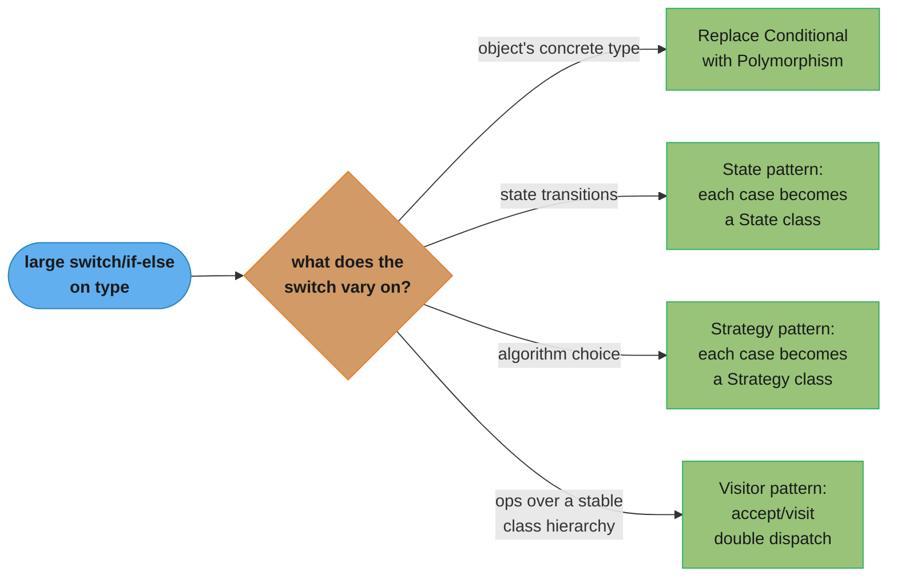
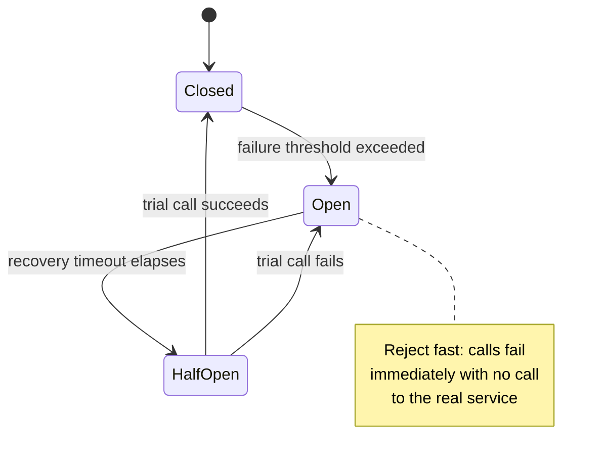

# Design Pattern Interview Questions

50+ design pattern interview questions organized by difficulty, with detailed answer outlines.
Calibrated to the level expected at Google, Amazon, Meta, and similar companies.

---

## Intuition

> **One-line analogy**: Design pattern interview questions are a proxy for systems thinking — interviewers aren't testing memorization, they're probing whether you can recognize problems and reason about tradeoffs.

**Mental model**: The best design pattern interviews follow a pattern of their own: name the pattern → explain the problem it solves → describe its structure → give a real-world example → discuss tradeoffs. Candidates who jump straight to code without grounding in "why this pattern here?" signal rote memorization. Candidates who explain the problem first signal genuine understanding.

**Why it matters**: Design pattern questions appear at every level, from "what is a Singleton?" (L4) to "design a system using multiple patterns and explain each tradeoff" (L6+). Calibrating your answer depth to the level signals maturity.

**Key insight**: When asked about a pattern, always anchor to a concrete real-world example from your own experience or from well-known systems (Java I/O = Decorator, Spring = Proxy, Kafka = Observer). Abstract explanations are forgettable; concrete examples stick.

---

## Table of Contents
1. [Easy Questions (15)](#interview-questions-with-answers)
2. [Medium Questions (20)](#medium-questions)
3. [Hard Questions (15+)](#hard-questions)
4. [Behavioral Questions (5)](#behavioral-questions)

---

## Interview Questions with Answers

### Easy Questions

_These test whether you know what patterns are, what problems they solve, and can recognize them in code or real life._

---

**Q: What is the Singleton pattern? How do you make it thread-safe?**

Singleton ensures that a class has only one instance and provides a global access point to it. Naive implementation: lazy initialization with a private constructor and a static `getInstance()` method — not thread-safe. Thread-safe approach 1: synchronize the entire `getInstance()` method (simple but slow — every call acquires a lock). Thread-safe approach 2: double-checked locking with `volatile` keyword (fast in the common case; the `volatile` prevents instruction reordering). Thread-safe approach 3: Initialization-on-demand holder (Bill Pugh idiom) — a private static inner class holds the instance; JVM class loading guarantees thread safety with zero synchronization overhead. Thread-safe approach 4: Enum singleton — the simplest, handles serialization and reflection attacks automatically.

Follow-up: What are the downsides of Singleton? How do you test code that uses a Singleton?

---

**Q: What is the Factory Method pattern? When would you use it?**

Factory Method defines an interface for creating an object but lets subclasses decide which class to instantiate. Defers instantiation to subclasses; the creator does not need to know the concrete class. Use it when: the exact type of object to create is not known until runtime, or when subclasses should control which objects are created. Real-world example: `LoggerFactory.getLogger()` in SLF4J, JDBC's `DriverManager.getConnection()`. Compared to `new`: Factory Method decouples the client from the concrete product class.

Follow-up: What is the difference between Factory Method and Abstract Factory?

---

**Q: What is the Observer pattern? Give a real-world example.**

Defines a one-to-many dependency: when one object (Subject/Publisher) changes state, all its dependents (Observers/Subscribers) are notified automatically. Key participants: Subject (maintains a list of observers, notifies them), Observer (defines an update interface), ConcreteObserver (reacts to updates). Real-world examples: event listeners in UI frameworks (button click handlers), stock price feeds, social media follow/notify systems, reactive streams (RxJava). Push vs pull model: Subject can push data to observers, or observers can pull data from the subject after being notified.

Follow-up: What are the downsides? (Memory leaks from unregistered observers, notification storms, unpredictable ordering.)

---

**Q: What is the Strategy pattern? How is it different from inheritance?**

Strategy defines a family of algorithms, encapsulates each one, and makes them interchangeable at runtime. Key participants: Context (uses a Strategy), Strategy interface, ConcreteStrategy implementations. With inheritance: you subclass to change behavior, but you cannot change it at runtime; leads to class explosion. With Strategy: behavior is composed in, not inherited; the context holds a reference to the strategy and can swap it at runtime. Follows Open/Closed Principle: add new strategies without touching the context. Real-world examples: sorting algorithms, payment methods (credit card, PayPal, crypto), compression algorithms.

Follow-up: When would you prefer Template Method over Strategy?

---

**Q: What is the Decorator pattern? Give an example.**

Attaches additional responsibilities to an object dynamically; an alternative to subclassing for extending functionality. All decorators implement the same interface as the component they wrap — client code is transparent to decoration. Wrapping can be stacked: each decorator calls the wrapped component's method and adds behavior before/after. Real-world example: Java I/O streams — `BufferedInputStream` wraps `FileInputStream`; `GZIPInputStream` wraps `BufferedInputStream`. Avoids class explosion: instead of creating `BufferedEncryptedCompressedStream`, you compose three decorators.

Follow-up: What is the difference between Decorator and Proxy?

---

**Q: What is the Builder pattern? When should you use it over a constructor?**

Builder separates the construction of a complex object from its representation, allowing the same process to create different representations. Use when: an object has many optional parameters, when construction involves multiple steps, or when you need to enforce a valid final state. Avoids "telescoping constructors" (many overloaded constructors with different parameter combinations). Fluent Builder (method chaining) is common in modern Java: `new Pizza.Builder().size(LARGE).cheese().pepperoni().build()`. Director (optional): encapsulates a construction sequence; useful when the sequence is reused.

Follow-up: What is the difference between Builder and Abstract Factory?

---

**Q: What is the Adapter pattern? When would you use it?**

Converts the interface of a class into another interface that clients expect. Lets incompatible classes work together. Two forms: Class Adapter (uses multiple inheritance, available in C++) and Object Adapter (wraps an instance, preferred in Java). Use when: integrating a third-party library, working with legacy code, or when two independently developed classes need to cooperate. Real-world examples: power plug adapters, Java's `Arrays.asList()` (adapts array to List), `InputStreamReader` (adapts byte stream to character stream).

Follow-up: What is the difference between Adapter and Facade?

---

**Q: What is the Command pattern? What problems does it solve?**

Encapsulates a request as an object, thereby letting you parameterize clients with different requests, queue requests, log them, and support undoable operations. Key participants: Command (interface with `execute()`), ConcreteCommand, Invoker (triggers the command), Receiver (does the actual work). Problems it solves: undo/redo, macro recording, request queuing, transactional behavior, audit logging. Real-world examples: menu actions in IDEs, database transaction scripts, job queues, GUI button callbacks.

Follow-up: How do you implement undo using the Command pattern?

---

**Q: What is the Proxy pattern? Name three types.**

Provides a surrogate or placeholder for another object to control access to it. Virtual Proxy: delays expensive object creation until it is actually needed (lazy initialization). Protection Proxy: controls access based on permissions (authorization checks before delegating). Remote Proxy: represents an object in a different address space (e.g., RMI stub, gRPC stub). Caching Proxy: caches results of expensive operations. Logging / Monitoring Proxy: intercepts calls to add logging, metrics.

Follow-up: What is the structural difference between Proxy and Decorator? (Same structure, different intent: Proxy controls access; Decorator adds behavior.)

---

**Q: What is the Composite pattern? Give a real-world example.**

Composes objects into tree structures to represent part-whole hierarchies. Lets clients treat individual objects and compositions uniformly. Key participants: Component (common interface), Leaf (no children), Composite (holds children, delegates to them). Real-world examples: file system (file = Leaf, directory = Composite), UI component trees, HTML/XML DOM, organizational charts. Client code can call `render()` on any node — it does not need to know if it is a leaf or a container.

Follow-up: What is the danger of adding child-management methods (add/remove) to the Component interface?

---

**Q: What is the Chain of Responsibility pattern?**

Avoids coupling the sender of a request to its receiver by giving more than one object a chance to handle the request. Handlers are linked in a chain; each handler either processes the request or passes it to the next handler. Use when: more than one object may handle a request, and the handler is not known a priori; when you want to issue requests to one of several objects without specifying the receiver explicitly. Real-world examples: HTTP middleware/filter chains (servlet filters, Express.js middleware), logging level handlers, approval workflows.

Follow-up: What happens if no handler in the chain processes the request?

---

**Q: What is the Template Method pattern? How does it relate to inheritance?**

Defines the skeleton of an algorithm in a base class, deferring some steps to subclasses. Subclasses can override specific steps without changing the algorithm's structure. Uses inheritance (not composition) — this is its main trade-off. "Hollywood Principle": don't call us, we'll call you — the base class calls the subclass's overridden steps. Real-world examples: `java.util.AbstractList` (requires subclasses to implement `get()` and `size()`), game loop frameworks, data mining pipelines.

Follow-up: What is the difference between Template Method and Strategy? (Template Method uses inheritance; Strategy uses composition. Strategy can switch algorithms at runtime; Template Method cannot.)

---

**Q: What is the State pattern?**

Allows an object to alter its behavior when its internal state changes. The object will appear to change its class. Instead of large conditionals (if/switch on state), each state is encapsulated in its own class. The context delegates to the current state object. State objects may transition the context to a new state. Real-world examples: traffic light controller, vending machine, TCP connection states (CLOSED, LISTEN, ESTABLISHED), order status lifecycle.

Follow-up: What is the difference between State and Strategy? (State transitions happen internally as part of behavior; Strategy is set externally by the client. State objects often know about each other; Strategy objects do not.)

---

**Q: What is the Facade pattern?**

Provides a simplified, unified interface to a set of interfaces in a subsystem. Defines a higher-level interface that makes the subsystem easier to use. Does not prevent clients from using subsystem classes directly if they need to. Real-world examples: a `HomeTheaterFacade` that orchestrates `Amplifier`, `DVDPlayer`, `Projector` with a single `watchMovie()` call; Spring's `JdbcTemplate`; a service layer that wraps repositories and domain logic.

Follow-up: What is the difference between Facade and Adapter? (Adapter makes existing interfaces compatible; Facade defines a new, simpler interface for a complex subsystem.)

---

**Q: What is the Memento pattern?**

Without violating encapsulation, captures and externalizes an object's internal state so that the object can be restored to this state later. Key participants: Originator (the object whose state is saved), Memento (stores the state snapshot), Caretaker (holds mementos; does not inspect or modify them). Real-world examples: undo/redo in text editors, game save/load, database transaction rollback. Encapsulation: the Caretaker never sees the contents of the Memento — only the Originator can read/write it.

Follow-up: How do you handle memory if you have thousands of undo levels? (Limit history depth; use incremental/delta mementos.)

---

### Medium Questions

_These test design decisions, tradeoffs, pattern selection in context, and ability to write real code._

---

**Q: How would you implement a thread-safe Singleton in Java? Compare double-checked locking vs. the Holder idiom.**

Two idiomatic thread-safe approaches exist: double-checked locking with a `volatile` field, and the initialization-on-demand Holder idiom (generally preferred). Double-checked locking:

```java
public class Singleton {
    private static volatile Singleton instance;
    private Singleton() {}
    public static Singleton getInstance() {
        if (instance == null) {
            synchronized (Singleton.class) {
                if (instance == null) instance = new Singleton();
            }
        }
        return instance;
    }
}
```

`volatile` prevents the JVM from partially constructing the object and publishing a reference to it before construction is complete (instruction reordering). The outer null check avoids locking on every call. Initialization-on-demand Holder idiom:

```java
public class Singleton {
    private Singleton() {}
    private static class Holder {
        static final Singleton INSTANCE = new Singleton();
    }
    public static Singleton getInstance() { return Holder.INSTANCE; }
}
```

JVM guarantees class initialization is thread-safe. Lazy loading happens because `Holder` is not loaded until `getInstance()` is first called. No explicit synchronization needed. Holder idiom is preferred: simpler, guaranteed correct by the JVM spec, no `volatile` overhead. Enum singleton is the simplest of all and handles serialization automatically.

Follow-up: How would you handle serialization (readResolve) and reflection attacks on a non-enum Singleton?

---

**Q: Design a notification system using Observer. How would you handle slow observers?**

Basic design: `EventBus` or `Subject` maintains a `List<Observer>`; calls `notify()` on each for each event. Problem: slow observer blocks the event loop; fast observers must wait. Solution 1: Asynchronous notification — dispatch each observer's `update()` call on a thread pool (`ExecutorService`). Observers run concurrently, but you lose ordering guarantees. Solution 2: Event queue per observer — each observer has an inbox queue; a dedicated thread drains it. Provides back-pressure by bounding queue size (drop or block on overflow). Solution 3: Reactive streams (Project Reactor, RxJava) — built-in back-pressure, error handling, and threading. Dead-letter queue for observers that throw exceptions — log and continue notifying others. Consider weak references for observers to prevent memory leaks if observers forget to unregister.

Follow-up: How do you ensure ordering guarantees with async notifications?

---

**Q: When would you use Builder over a Constructor or Factory?**

Constructor: fine for objects with few, required parameters and no complex validation. Static factory method: good for objects with few parameters; can cache instances and have descriptive names, but still suffers from many parameters. Builder: use when there are 4+ parameters, many of which are optional; when construction involves validation across multiple fields; when you need immutable objects with many fields; when construction order matters. Builder vs Factory: Factory returns an existing type hierarchy (polymorphism); Builder constructs one complex object step by step. They are orthogonal: a Factory can use a Builder internally. Immutability benefit: `build()` validates and returns an immutable Product; the Builder itself is mutable during construction.

Follow-up: How does the Builder pattern enable immutable objects?

---

**Q: How does the Decorator pattern avoid class explosion?**

Scenario: a `TextEditor` needs combinations of: line numbers, syntax highlighting, spell-check, auto-complete. Subclassing every combination = 2^4 = 16 classes. With Decorator: define `EditorFeature` interface, each feature is a decorator. Client composes: `new AutoComplete(new SpellCheck(new SyntaxHighlight(new LineNumbers(new PlainEditor()))))`. n features = n classes + composition; subclassing = 2^n classes. Adding a new feature = one new Decorator class, no changes to existing code (Open/Closed Principle). Each Decorator is independently testable.

Follow-up: What is the cost of deep Decorator stacks? (Deep call stacks, tricky debugging, ordering bugs.)

---

**Q: Explain the Composite pattern with a real file system example.**

`FileSystemItem` (Component) interface: `getName()`, `getSize()`, `print(String indent)`. `File` (Leaf): implements all methods directly; `getSize()` returns file size. `Directory` (Composite): holds a list of `FileSystemItem` children; `getSize()` sums children's sizes recursively; `print()` prints self and delegates to children. Client code: calls `item.print("")` on the root — does not need to know if it is a File or Directory. Key insight: recursive composition. Operations that make sense on a leaf also make sense on a directory (total size, search, permissions). Design decision: should `add()`/`remove()` be on the Component interface or only on Composite? Adding to Component breaks type safety for Leaf; keeping on Composite requires downcasting. GoF calls this the "transparency vs safety" tradeoff.

Follow-up: How would you implement a `find(String name)` across the entire file system tree using Composite?

---

**Q: How does the Bridge pattern prevent class explosion?**

Problem: `Shape` hierarchy (Circle, Square) crossed with `Renderer` hierarchy (VectorRenderer, RasterRenderer) = 2x2 = 4 classes now, but scales as O(m*n). Bridge: separate `Shape` (Abstraction) from `Renderer` (Implementor). Shape holds a reference to a Renderer. `Circle.draw()` delegates to `renderer.renderCircle(radius)`. Adding a new Shape: one new Abstraction subclass. Adding a new Renderer: one new Implementor. Total = O(m+n). Composition over inheritance: at runtime, inject any Renderer into any Shape. Use when both dimensions are expected to vary independently.

Follow-up: What is the difference between Bridge and Adapter? (Adapter is a retrofit solution for incompatible interfaces that already exist; Bridge is a proactive design decision to separate abstraction from implementation.)

---

**Q: Explain how you would implement undo/redo using Command + Memento.**

Command-based undo: each Command stores enough state to reverse itself. `execute()` performs the action; `undo()` reverses it. Keep a history stack; push on execute, pop on undo; maintain a redo stack. Works well when operations have clean inverses (e.g., set value, add item). Memento-based undo: Originator saves its full state to a Memento before each change; Caretaker maintains the Memento stack. Works when the inverse operation is complex or when full state snapshot is simpler. Combined approach: Command captures before/after Memento; `undo()` restores the before-Memento. Composite Command (Macro): a Command that contains a list of sub-commands; undo reverses them in reverse order. Memory optimization: limit history depth; use delta mementos rather than full snapshots.

Follow-up: How would you handle undo in a collaborative editor where multiple users make changes concurrently?

---

**Q: What is the difference between Proxy and Decorator? Give a concrete code-level example.**

Structural similarity: both wrap an object implementing the same interface and delegate calls. Intent difference: Proxy: controls access (lazy loading, auth, remote, caching). Often manages the lifecycle of the real subject. Decorator: adds behavior (logging, transformation, enrichment). The real subject is always provided from outside. Proxy example: `LazyImageProxy` does not load the real `Image` until `display()` is called for the first time. Decorator example: `BorderDecorator(ScrollDecorator(TextView()))` adds border and scroll bar behavior. Key distinction: a Proxy often creates/controls the real subject; a Decorator always receives the wrapped object from the caller. In Spring: `@Transactional` uses a Proxy (controls transaction lifecycle); logging wrappers are Decorators.

Follow-up: Can a class be both a Proxy and a Decorator? (Yes — a caching proxy adds new behavior AND controls access.)

---

**Q: When would you use Mediator vs Observer?**

Observer: best for one-to-many broadcast where the subject does not need to know observer details. Loose coupling between publisher and subscribers. Mediator: best for many-to-many communication where objects need to coordinate with each other but should not reference each other directly. Centralized control. Practical distinction: in a chat room, Observer = users subscribe to a broadcast channel; Mediator = all UI components (text box, send button, user list) communicate through a `ChatMediator` that orchestrates interaction. Observer scales well when all observers react independently. Mediator is better when the interaction logic is complex and involves multiple back-and-forth calls. Anti-pattern risk: Mediator can become a God Object if it accumulates too much logic.

Follow-up: How would you test a Mediator with many colleagues?

---

**Q: Explain the Flyweight pattern. When is it applicable?**

Flyweight shares as much state as possible with similar objects to reduce memory usage when a large number of fine-grained objects are needed. Intrinsic state: shared, context-independent (e.g., glyph shape, font type). Stored in the Flyweight. Extrinsic state: context-dependent (e.g., position, color). Passed in by the client at call time. FlyweightFactory: maintains a pool/cache; returns an existing Flyweight if one matches, or creates a new one. Applicable when: thousands or millions of similar objects are needed, most of their state can be shared, and the extrinsic state is small and can be computed or passed by clients. Real-world examples: character glyphs in a text editor, particle systems in game engines, shared string pool (Java `String.intern()`).

Follow-up: What is the trade-off of Flyweight? (Complexity: client must manage extrinsic state; objects are no longer self-contained.)

---

**Q: How does the Visitor pattern allow adding new operations without modifying classes?**

Visitor uses double dispatch: the element's `accept(Visitor v)` method calls `v.visit(this)`, routing to the correct overload based on the runtime type of both the element and the visitor. To add a new operation: create a new ConcreteVisitor class implementing all `visit()` overloads. No changes to element classes. Trade-off: adding a new element type requires updating all Visitors (the inverse problem). Visitor is best when the element hierarchy is stable but operations vary. Real-world examples: compilers (AST traversal for type-checking, optimization, code generation), XML/JSON serializers, tax calculation over an order hierarchy.

Follow-up: What is the "double dispatch" problem and why does Java not support it natively?

---

**Q: How would you refactor a class with large switch/if-else blocks based on type into a proper pattern?**

Identify what varies: if the switch is on an object's type, use polymorphism (replace conditional with polymorphism refactoring). If the switch is on state transitions: use the State pattern — each case becomes a State class. If the switch selects an algorithm: use the Strategy pattern — each case becomes a Strategy class. If the switch dispatches operations over a class hierarchy: use the Visitor pattern. Steps: (1) identify each case as a concept; (2) create an interface; (3) move each case to a concrete class; (4) use a Factory to instantiate the right concrete class based on the original switch key; (5) delete the switch. The branch you take depends entirely on what the switch varies on — worth drawing as an explicit decision tree:



*Same symptom (a type-keyed switch), four different fixes — the correct one depends on what varies, not on the fact that something varies.*

Follow-up: What SOLID principle does this refactoring enforce? (Open/Closed Principle and Single Responsibility Principle.)

---

**Q: How would you use the Chain of Responsibility to implement an HTTP middleware pipeline?**

Each middleware is a handler: it processes the request and either produces a response or calls `next.handle(request)` to pass it down the chain. Examples: authentication middleware checks the token; if valid, passes to authorization; then to rate limiter; then to the business logic handler. Configuration: chain is assembled at startup; each handler only knows about the next one. Short-circuit: a handler can produce a response without calling next (e.g., auth failure returns 401 immediately). This is exactly how Express.js middleware, Java Servlet Filters, and ASP.NET Core middleware pipelines work.

Follow-up: How do you handle response post-processing in a middleware chain (e.g., adding response headers after the business logic runs)?

---

**Q: When should you use Abstract Factory vs Factory Method?**

Factory Method: defines one method for creating one product; subclasses override it. One level of abstraction. Abstract Factory: defines an interface with multiple factory methods for creating a family of related products. Ensures product compatibility. Rule of thumb: if you need one type of product and want subclasses to decide the implementation, use Factory Method. If you need multiple related products that must be used together (a product family), use Abstract Factory. Example: a UI toolkit — `WindowsFactory` creates `WindowsButton` + `WindowsTextBox`; `MacFactory` creates `MacButton` + `MacTextBox`. Mixing them would look wrong. Abstract Factory ensures you always get a consistent set. Abstract Factory is often implemented using multiple Factory Methods.

Follow-up: How would you add a new product type to an Abstract Factory? (Add a new factory method to the interface — this forces updates to all ConcreteFactory implementations, which is a known drawback.)

---

**Q: How do you implement an event bus using Observer + Command?**

Event bus has `subscribe(eventType, handler)` and `publish(event)` methods. Under the hood: a `Map<EventType, List<Observer>>` stores subscriptions. Each event is a Command object (or data object): it carries all payload needed for handlers. `publish()` looks up subscribers for the event type and calls each observer's `onEvent(command)` method. Async: dispatch each subscriber call to a thread pool; use a blocking queue as an event queue with a consumer thread. Dead-letter queue: failed handler invocations are captured and can be retried or logged. Type-safe: use generics to make `subscribe(Class<T> type, Consumer<T> handler)` type-safe at compile time.

Follow-up: How would you implement event ordering guarantees in an async event bus?

---

**Q: How would you design a logging framework using design patterns?**

Logger: Singleton or accessed via a static factory (`LoggerFactory.getLogger()`). Log level filtering: Chain of Responsibility — each handler checks if the level is sufficient before processing. Appenders (output sinks): Strategy — different strategies for writing to file, console, network, database; swappable at runtime. Formatters: Strategy — format the log message as plain text, JSON, or XML. Log enrichment (MDC, thread name, timestamp): Decorator — wrap the base logger with enrichment decorators. Observer: the Logger is a Subject; multiple Appenders are Observers subscribed to log events.

Follow-up: How would you make the logging framework asynchronous without losing messages?

---

**Q: Explain Iterator pattern. What is the difference between internal and external iteration?**

Iterator provides a way to access elements of an aggregate object sequentially without exposing its underlying representation. External iteration: the client controls the iteration loop (`while (it.hasNext()) { process(it.next()); }`). The client drives. Internal iteration: the aggregate drives; the client passes a function/callback (`forEach(Consumer c)`). The collection controls when to call the callback. Java examples: `Iterator<T>` (external), `Iterable.forEach()` / streams (internal). Benefits of external: fine-grained control (pause, resume, break early). Benefits of internal: cleaner code, easier to parallelize. Modern Java prefers internal iteration (streams) for most use cases.

Follow-up: How would you implement a lazy iterator that generates values on demand (e.g., Fibonacci sequence)?

---

**Q: How does the Template Method pattern relate to the Hollywood Principle?**

Hollywood Principle: "Don't call us, we'll call you." High-level components call low-level components, not the other way around. Template Method: the abstract base class defines the algorithm skeleton and calls the `hook()` / `primitiveOperation()` methods. Subclasses implement the hooks but do not call the base class explicitly. This inverts the dependency: subclasses do not control when their methods are called; the framework (base class) does. Prevents dependency rot: subclasses cannot accidentally call base class methods out of sequence. Examples: `HttpServlet` (framework calls `doGet()`/`doPost()` — you implement them); `JUnit` lifecycle hooks (`setUp()`, `tearDown()`).

Follow-up: What is the risk of Template Method in deep inheritance hierarchies?

---

**Q: What is the Interpreter pattern? Where is it used in practice?**

Given a language, define a representation for its grammar along with an interpreter that uses the representation to interpret sentences in the language. Each grammar rule is a class. The AST is typically a Composite of expression nodes. Client builds the AST and calls `interpret(context)` on the root. Practical uses: regular expression engines, SQL parsers, expression evaluators (Spring EL, JEXL), rule engines, template engines. Drawback: complex grammars lead to many classes; performance is poor for heavy use. For complex languages, use a proper parser generator (ANTLR, JavaCC).

Follow-up: How would you implement a simple arithmetic expression evaluator using Interpreter?

---

**Q: How do you implement the Prototype pattern? When is `clone()` insufficient?**

Prototype specifies the kinds of objects to create using a prototype instance, and creates new objects by copying this prototype. Java: implement `Cloneable` and override `clone()`. Alternatively, use a copy constructor. Shallow copy: the cloned object shares references to nested objects — changes to nested objects affect both copies. Deep copy: recursively clone all nested objects. Required when the object graph has mutable references. `clone()` is insufficient when: objects have circular references; objects contain non-clonable fields (e.g., locks, streams); you need to control which fields are copied. Alternative: serialize/deserialize for deep copy (if all fields are serializable); copy constructors; manual deep copy method. Use Prototype when creating an object is expensive (e.g., database query results) and a modified copy is needed.

Follow-up: How does Prototype differ from just using a copy constructor?

---

### Hard Questions

_These test system design thinking, pattern combinations, architectural decisions, and the ability to reason about trade-offs under real constraints._

---

**Q: Design a plugin architecture for a text editor. Which patterns would you use and why?**

Core requirements: plugins can be loaded/unloaded at runtime; plugins can add commands, menu items, syntax highlighters, auto-completers. Strategy: each plugin capability (syntax highlight, autocomplete, linting) is a strategy interface. Plugins provide concrete implementations. Factory Method / Registry: a `PluginRegistry` maps plugin IDs to factories. At load time, the plugin registers its factories. The editor asks the registry for implementations. Observer / Event Bus: plugins subscribe to editor events (file open, keystroke, save). The editor publishes events; plugins react without tight coupling. Command: plugin-contributed actions are Commands. The editor's command dispatcher (Invoker) can trigger them, enabling undo/redo for plugin actions. Facade: expose a stable `EditorAPI` facade to plugins. Plugins do not depend on internal editor classes; they depend only on the facade. This insulates the core from plugin code and vice versa. Decorator: plugins can wrap the editor's existing services (e.g., wrapping the save service with auto-format). Composite: menu items from multiple plugins are combined into a Composite menu tree.

Follow-up: How do you handle plugin versioning and API compatibility? How do you isolate a buggy plugin from crashing the editor?

---

**Q: How would you implement undo/redo with branching history (like git)?**

Linear undo/redo: two stacks (history and redo). On new action: push to history, clear redo stack. Undo: pop history, push to redo. Redo: pop redo, push to history. Branching history: instead of a stack, use a tree of Commands. Each node is a Command; children are subsequent actions. Current position is a pointer into the tree. When you undo and then perform a new action: create a new branch at the current node rather than discarding the redo branch. Memento stores the state at each node for fast restoration. Commands store only the delta for space efficiency. UI consideration: display a history tree (like VS Code's timeline or Emacs undo-tree). Patterns: Command (each action), Memento (state snapshots at branch points), Composite (group of commands as a macro), Iterator (traverse history).

Follow-up: How do you handle collaborative editing with multiple users, each having their own undo history?

---

**Q: Design an event-driven order processing system (e-commerce). Which patterns ensure reliability and extensibility?**

Order lifecycle: Placed → PaymentPending → Paid → Fulfillment → Shipped → Delivered (or Cancelled/Refunded at various stages). State pattern: `Order` delegates to its current `OrderState` object. Each state handles valid transitions and rejects invalid ones. Command pattern: each order action (`PlaceOrderCommand`, `CancelOrderCommand`, `RefundCommand`) is a Command. Enables audit log, replay, and undo. Observer / Event Bus: state transitions publish domain events (`OrderPlaced`, `OrderShipped`). Downstream services (inventory, notification, billing) subscribe asynchronously — decouples them from the order service. Strategy: payment processing is a Strategy — CreditCard, PayPal, Crypto each implement `PaymentStrategy`. Chain of Responsibility: order validation pipeline — stock check, fraud check, address validation — each as a handler. Memento: capture order snapshots for audit trail and for rollback if a downstream failure requires compensation.

Follow-up: How do you handle distributed failures (e.g., payment succeeds but inventory service is down)? (Saga pattern, idempotent commands, outbox pattern.)

---

**Q: How would you refactor a God Object (a 5000-line class) into well-designed classes using patterns?**

Step 1: Identify responsibilities. List every distinct concept the class handles (e.g., UserService with auth, profile, notifications, billing). Step 2: Apply Single Responsibility Principle — extract each responsibility into its own class. Step 3: For the remaining orchestration: use Mediator or Facade to coordinate extracted services, preserving the old class's public API as a thin facade. Step 4: For conditional blocks on type/state: apply Strategy (swappable algorithms) or State (state machine) to replace switch/if-else. Step 5: For cross-cutting concerns (logging, caching, auth checks): apply Proxy or Decorator rather than scattering the logic. Step 6: For object creation logic: extract into Factory or Builder. Step 7: Write regression tests before refactoring; use the Strangler Fig pattern to incrementally replace pieces.

Follow-up: How do you refactor without breaking existing clients? (Preserve the public API of the God Object as a Facade while delegating to the new classes.)

---

**Q: Design a rate limiter using design patterns. Explain your choices.**

Core algorithms: Token Bucket, Leaky Bucket, Fixed Window Counter, Sliding Window Log. Strategy: each algorithm is a concrete RateLimitStrategy. The rate limiter context holds the strategy and delegates `allow(request)` to it. Swappable at runtime or per-route. Proxy: the rate limiter wraps the actual request handler. Client calls the Proxy; the Proxy checks the rate limit and either delegates to the real handler or rejects with 429. Chain of Responsibility: if multiple rate limit rules apply (per IP, per user, per API key), each is a handler in the chain. A request must pass all handlers. Singleton: the rate limit state (token counts, window counters) must be shared. In a single process, a Singleton manages state. In a distributed system, state lives in Redis. Observer: publish `RateLimitExceeded` events for monitoring and alerting. Builder: build the rate limiter configuration fluently: `RateLimiter.builder().algorithm(TokenBucket).limit(100).windowSeconds(60).build()`.

Follow-up: How does your design change in a distributed environment with multiple API gateway instances?

---

**Q: Design a caching layer using design patterns.**

Proxy (Cache Proxy): wraps the real data source. `get(key)` checks cache first; on miss, fetches from real source, stores in cache, returns result. Strategy: cache eviction policy (LRU, LFU, FIFO, TTL-based) is a Strategy. Swappable without changing cache infrastructure. Decorator: layer multiple caches (L1 in-memory → L2 Redis → L3 database). Each layer is a Decorator wrapping the next. Observer: on cache invalidation events, all replica caches (observers) evict the stale entry. Factory: create the appropriate cache type (local, distributed, read-through, write-through) based on configuration. Singleton: the cache instance should be shared application-wide (one connection pool to Redis). Template Method: define the cache-aside algorithm skeleton in an abstract base class; subclasses implement `fetchFromSource()`.

Follow-up: How do you handle cache stampede (thundering herd) when a popular cache entry expires?

---

**Q: Design a notification service that supports email, SMS, push, and Slack. How do you handle retries and routing?**

Strategy: each notification channel (`EmailSender`, `SmsSender`, `PushSender`, `SlackSender`) is a concrete NotificationStrategy. Factory / Abstract Factory: a `NotificationFactory` returns the correct sender based on channel type. Command: each notification request is a `SendNotificationCommand`. Enables queuing, retry, and audit logging. Chain of Responsibility: routing pipeline — preference check (does user prefer email?), DND check (quiet hours), rate limit check, then dispatch. Observer: track delivery status; `DeliveryStatusObserver` updates user preferences or alerts on failure. Decorator: add cross-cutting concerns — retry logic, logging, metrics — as decorators around any sender. Template Method: `AbstractNotificationSender` defines the skeleton: validate → format → send → record. Subclasses implement `format()` and `send()`. Retry: exponential backoff with jitter; dead-letter queue after max retries.

Follow-up: How do you ensure exactly-once delivery semantics?

---

**Q: How would you implement a connection pool using design patterns?**

Object Pool (a variant of Flyweight/Singleton): maintains a pool of reusable connection objects. Clients borrow and return connections. Singleton: the pool itself is a Singleton — one pool per database per application. Proxy: clients do not use the real connection directly; they use a `PooledConnection` Proxy that wraps a real connection and returns it to the pool on `close()` instead of actually closing it. Factory Method: `getConnection()` is a factory method — returns a pooled connection; manages creation of new connections if pool is exhausted. Observer: monitor pool health — notify admins when pool utilization exceeds 80%, or when connections are failing. Strategy: pool eviction / sizing strategy — min/max pool size, idle timeout, connection validation — swappable. Builder: `ConnectionPool.builder().url(...).minSize(5).maxSize(50).idleTimeout(30, SECONDS).build()`.

Follow-up: How do you handle connection validation (detecting stale/dead connections) without impacting throughput?

---

**Q: Design a workflow engine (like a simplified Apache Airflow). Which patterns apply?**

Composite: a workflow is a Composite of Tasks. Tasks can be individual (Leaf) or sub-workflows (Composite). All implement `execute()`. Command: each Task is a Command with `execute()`. Enables scheduling, retries, and audit. Chain of Responsibility: task lifecycle hooks (pre-execute checks, post-execute notifications, failure handlers) form a chain. State: each task has states (PENDING → RUNNING → SUCCESS / FAILED / SKIPPED). State pattern models valid transitions. Observer: task completion events notify downstream tasks (triggering dependencies) and monitoring systems. Strategy: execution strategy — sequential, parallel, conditional branching — selectable per workflow. Mediator: the Scheduler/Orchestrator acts as Mediator — it knows the dependency graph and coordinates task execution without tasks knowing about each other. Builder: workflow definition DSL uses a Builder to assemble the task graph.

Follow-up: How would you handle task retries with exponential backoff and partial workflow recovery after a failure?

---

**Q: How would you design a dependency injection container from scratch?**

Registry: `Map<Class<?>, Supplier<?>>` maps types to their factories. `bind(Interface.class, ConcreteClass::new)`. Factory Method: `resolve(Class<T> type)` is a factory method that looks up the registered factory and calls it. Singleton scope: wrap the factory with memoization — first call constructs, subsequent calls return cached instance. Prototype scope: factory is called fresh each time. Decorator: scope management, lifecycle hooks (post-construct, pre-destroy), and AOP proxying are Decorators applied to the resolved instance. Composite: container hierarchies (parent/child contexts, like Spring's `ApplicationContext`). Child delegates to parent for unresolved bindings. Builder: container configuration uses a fluent builder: `Container.builder().singleton(DataSource.class, ...).prototype(UserRepository.class, ...).build()`. Reflection / Proxy: for @Autowired injection, use reflection to inspect constructor parameters; for AOP, generate a Proxy around the resolved bean.

Follow-up: How do you detect circular dependencies at container startup rather than at runtime?

---

**Q: Design a chess game. Walk through the patterns you would use.**

Board: `Board` holds an 8x8 grid of `Square` objects, each optionally containing a `Piece`. Composite: not strictly needed, but the board can be thought of as a Composite of Rows of Squares. State: `GameState` (WHITE_TURN, BLACK_TURN, CHECK, CHECKMATE, STALEMATE, DRAW). State pattern governs which actions are legal. Strategy: `MoveStrategy` per piece type (PawnMoveStrategy, KnightMoveStrategy, etc.) encapsulates legal move generation. Command: each move is a `MoveCommand(piece, from, to)` with `execute()` and `undo()`. History of commands = move history. Enables PGN export and undo. Memento: capture board state (alternative to Command-based undo; useful for full board snapshots at each ply). Observer: `GameEventObserver` notifies UI, AI engine, clock, and move logger on each state change. Factory: `PieceFactory.create(PieceType, Color)` creates the right Piece subclass. Visitor: `LegalMoveGenerator` is a Visitor that traverses all pieces on the board and collects their legal moves.

Follow-up: How would you add a chess AI (minimax) without changing the core game classes?

---

**Q: How would you implement a distributed pub/sub system using design patterns? What are the scaling challenges?**

Local: Observer pattern with an in-memory event bus (Map of topic → subscriber list). Distributed: the Subject is now a broker (Kafka, RabbitMQ). Producers publish to topics; consumers subscribe. Command: messages are Commands (serialized, versioned, idempotent). Proxy: each producer/consumer interacts with a local client library that proxies to the remote broker. Handles reconnection, serialization, acknowledgment. Strategy: message routing strategy (round-robin, key-based, broadcast). Serialization strategy (JSON, Avro, Protobuf). Observer at the consumer side: each consumer group is a Subscriber; the local dispatcher notifies registered handlers per message type. Chain of Responsibility: message processing pipeline (deserialize → validate → deduplicate → route to handler). Scaling challenges: ordering (partition by key), exactly-once semantics, back-pressure, consumer lag, rebalancing on consumer failure.

Follow-up: How do you ensure message ordering in a distributed system with multiple partitions?

---

**Q: Design a URL shortener (like bit.ly) using design patterns.**

Strategy: URL shortening algorithm — Base62 counter encoding, MD5 hash, random token. Swappable strategies. Factory: `ShortCodeGeneratorFactory` returns the right strategy based on configuration. Proxy (Cache Proxy): `UrlLookupProxy` checks an in-memory or Redis cache before hitting the database. `redirect(shortCode)` → cache hit → return long URL. Singleton: cache client, DB connection pool. Observer: track redirect events; analytics observers record click count, referrer, geolocation without coupling to the redirect path. Builder: `ShortUrl.builder().longUrl(...).customAlias(...).expiresAt(...).build()`. Decorator: add rate limiting, authentication, and analytics tracking as Decorator layers on the redirect service. Chain of Responsibility: redirect request pipeline — validate short code → check expiry → check geo-restrictions → increment counter → return redirect.

Follow-up: How would you design the system to handle 10 million redirects per day? Where does each pattern fit in the scaled architecture?

---

**Q: How would you implement a circuit breaker pattern using design patterns?**

Circuit Breaker is itself a resilience pattern; at the GoF level it combines State, Proxy, Observer, Strategy, Decorator, and Template Method. State: three states — CLOSED (normal), OPEN (failing, reject fast), HALF-OPEN (testing recovery). State pattern models transitions. Proxy: the circuit breaker wraps the real service call. Client calls the Proxy; the Proxy checks state before delegating. Observer: publish state change events (`CircuitOpened`, `CircuitClosed`, `CircuitHalfOpen`) to monitoring systems. Strategy: failure counting strategy (count-based threshold, percentage-based, time-window-based). Recovery strategy (how long to wait before HALF-OPEN). Decorator: apply the circuit breaker as a Decorator on any service interface without modifying the service. Template Method: define the request execution skeleton in the base circuit breaker: check state → attempt call → handle success/failure. Subclasses customize threshold behavior. The state names above hide the actual transition triggers — drawing them out is what makes the State-pattern mapping click:



*Closed and Open are the steady states; HalfOpen is the probe the Proxy uses to test recovery before committing back to Closed — exactly the 'testing recovery' bullet above, made concrete.*

Follow-up: How would you combine circuit breaker with retry and timeout to build a resilience pipeline? (Hint: Chain of Responsibility with each resilience concern as a handler.)

---

**Q: You are asked to add a new feature to an existing system, but doing so requires modifying 15 existing classes. How do you approach this? Which patterns help?**

First, this is a sign of a SOLID violation — likely Open/Closed or Single Responsibility. Visitor pattern: if the change is a new operation across a stable class hierarchy, add a new Visitor. Zero changes to the 15 classes. Decorator: if the change is adding behavior, wrap affected classes with Decorators instead of modifying them. Mediator: if the 15 classes are communicating and the new feature adds a new communication channel, introduce a Mediator to centralize. Extension Object (a less-known pattern): attach new interfaces/behaviors to objects at runtime via a capability registry — objects can expose additional interfaces without being modified. Practical approach: use the Strangler Fig pattern — introduce an abstraction layer, route affected calls through it, implement new behavior in the new layer. Always ask: can I invert the dependency? Can the new feature subscribe to existing events instead of being pushed into existing classes?

Follow-up: How do you communicate the need for this refactoring to stakeholders who want the feature shipped in one sprint?

---

## Behavioral Questions

_These assess how you think about patterns in practice, not just theory._

---

### B1. Tell me about a time you applied a design pattern to solve a real problem. Walk me through your decision process.

**How to answer:**
- Structure: Situation → Problem → Pattern considered → Why this pattern → Implementation → Outcome.
- Mention the alternatives you considered and why you rejected them.
- Be concrete: name the specific classes you created, the interface you defined, and how it changed the code.
- Mention the trade-offs: what did the pattern make harder? What would you do differently?
- Good patterns to discuss: Strategy (replacing conditionals), Observer (decoupling event handling), Builder (replacing telescoping constructors), Command (enabling undo or audit log).

---

### B2. How do you decide which design pattern to use when solving a problem?

**How to answer:**
- Start from the problem, not the pattern: identify what is varying, what is coupled too tightly, what needs to be extended.
- Ask: Is this about object creation? → Creational. Object relationships? → Structural. Object behavior? → Behavioral.
- Recognize pattern signatures: large switch on type → Strategy/State/Visitor. Multiple notification recipients → Observer. Wrapping without subclassing → Decorator. Many related objects created together → Abstract Factory.
- Check if a simpler solution (plain OOP, a lambda, a data structure) is sufficient before reaching for a pattern.
- Mention that patterns are a vocabulary, not a checklist — you use them when they make the design clearer and more maintainable, not to show off.

---

### B3. Have you ever introduced a design pattern that made things worse? What did you learn?

**How to answer:**
- Honesty is valued here. Common examples: over-engineering with Abstract Factory when a simple Factory Method was enough; Singleton that made unit testing impossible; Decorator stack that was impossible to debug.
- Demonstrate pattern: identify the problem → root cause → what you changed → what you learned.
- Key insight: patterns add indirection and complexity. They are worth it only when the flexibility they provide is actually needed.
- Lesson: "You Aren't Gonna Need It" (YAGNI) applies to patterns too. Prefer the simplest design that works today and refactor when the need for a pattern becomes clear.

---

### B4. How do you explain design patterns to a junior engineer who has never heard of them?

**How to answer:**
- Use a real-world analogy first: Singleton = a company's CEO (only one); Observer = a magazine subscription (publisher notifies all subscribers); Strategy = choosing a route on Google Maps (same destination, different algorithms).
- Then connect to code: show a simple before/after — code with a switch statement vs code with Strategy.
- Emphasize: patterns are named solutions to recurring problems. They give us a shared vocabulary — when you say "use Observer here," everyone on the team immediately understands the structure without reading 200 lines of code.
- Caution: patterns can be misapplied. The goal is always readable, maintainable code — not pattern count.

---

### B5. How do you balance using design patterns with keeping the codebase simple (YAGNI / KISS)?

**How to answer:**
- Acknowledge the tension: patterns add abstraction and indirection; abstraction has a cost in readability and onboarding.
- Rule of three: before introducing a pattern, wait until you see the same problem arise at least twice. The third occurrence justifies the abstraction.
- Refactor toward patterns: start with the simplest solution (hardcoded, direct, concrete). When requirements force a change, refactor to the appropriate pattern at that moment — not speculatively.
- Team context matters: a pattern is only useful if the whole team understands it. An exotic pattern used by one person creates tribal knowledge and bus-factor risk.
- Concrete example: started with a simple `if channel == "email"` block; when the second channel was added, refactored to Strategy; when a third was added, introduced a registry-based Factory. Each step was justified by actual need.

---

## Appendix: Pattern Cheat Sheet

| Pattern | One-line purpose | "Use when you see..." |
|---|---|---|
| Singleton | One instance | Global shared state, config, logger |
| Factory Method | Defer instantiation | `new ConcreteClass()` scattered in client code |
| Abstract Factory | Product families | Objects that must be used together consistently |
| Builder | Step-by-step construction | Telescoping constructors, optional parameters |
| Prototype | Clone to create | Expensive creation, unknown type at runtime |
| Adapter | Interface mismatch | Third-party library doesn't fit your interface |
| Bridge | Vary both abstraction and impl | Multiplying subclass hierarchies |
| Composite | Tree of uniform nodes | Hierarchical structures (files, UI, org charts) |
| Decorator | Dynamic feature addition | Subclass explosion for feature combinations |
| Facade | Simplify a subsystem | Complex API that most clients use simply |
| Flyweight | Memory-efficient many objects | Thousands of similar objects |
| Proxy | Controlled access | Lazy load, auth, caching, remote object |
| Chain of Responsibility | Pass request along handlers | Multiple potential handlers, handler unknown a priori |
| Command | Request as object | Undo/redo, queuing, logging operations |
| Interpreter | Evaluate a language | Custom expression language, rule engine |
| Iterator | Traverse a collection | Access elements without exposing structure |
| Mediator | Centralize communication | Many-to-many dependencies between components |
| Memento | Save and restore state | Undo, snapshots, game save |
| Observer | Notify on change | One-to-many event propagation |
| State | Behavior depends on state | Complex conditionals on object state |
| Strategy | Interchangeable algorithms | Switch/if on algorithm choice |
| Template Method | Fixed skeleton, variable steps | Algorithm with hook points for subclasses |
| Visitor | New operation on stable hierarchy | Adding behavior to class hierarchy without modifying it |
