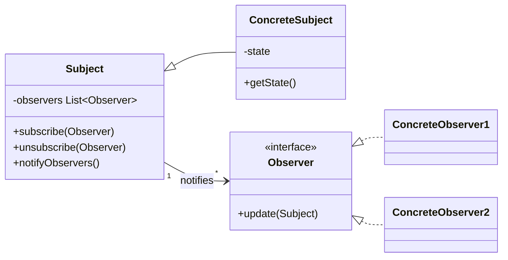
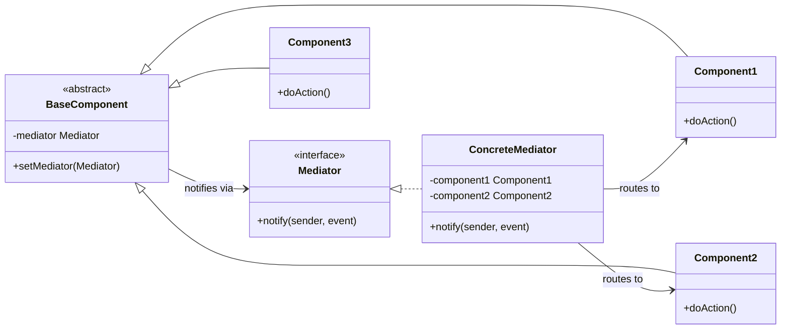
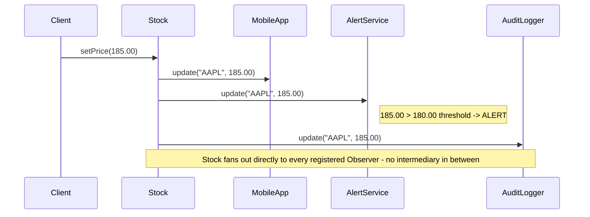
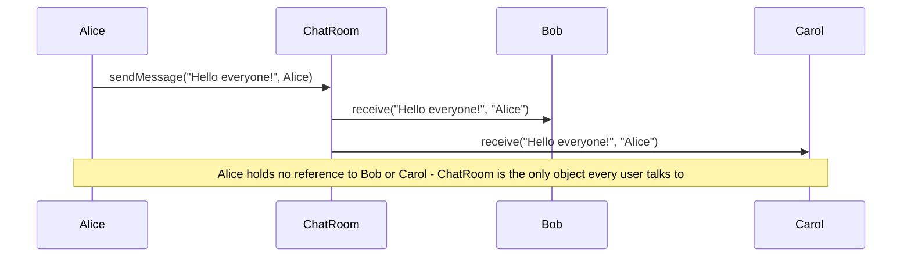

# Observer vs Mediator

## Overview

Both Observer and Mediator address communication between multiple objects. Observer creates a direct publish-subscribe relationship between objects. Mediator introduces a central hub to eliminate direct dependencies between objects.

---

## Intuition

> **One-line analogy**: Observer is a newsletter subscription (publisher sends, subscribers receive directly); Mediator is an air traffic control tower (no plane talks directly to another — all communication routes through the center).

**Mental model**: Observer allows objects to react to events in another object without tight coupling — but each observer still knows about the subject. Mediator goes further: it eliminates direct knowledge between peer objects entirely. In a chat room (Mediator), users don't send messages directly to each other; they send to the chat room, which routes to the right recipients. This prevents an O(n²) mesh of connections from forming as the number of participants grows.

**Why it matters**: Observer is simpler and the right choice for one-to-many event broadcasting. Mediator is right when many objects need to coordinate and direct references between them would create a tangled web.

**Key insight**: If observers know who they're observing, use Observer. If you want to eliminate all direct references between collaborating objects, use Mediator — at the cost of the mediator becoming a bottleneck if not designed carefully.

---

## Side-by-Side UML

Both patterns replace scattered peer-to-peer wiring with one clear point of contact, but the class shapes differ: Observer's Subject depends only on the Observer interface, while Mediator's components depend only on the Mediator interface and never see each other.

**Observer**



Subject owns the observer list, and `notifyObservers()` loops straight over it calling `update(this)` on every registered Observer — each observer is one hop from the subject.

**Mediator**



Every component's `doAction()` calls `mediator.notify(this, "event")` and knows nothing else; only ConcreteMediator holds references to the components and decides how to route between them.

---

## Key Differences Table

| Dimension | Observer | Mediator |
|-----------|----------|----------|
| **Communication topology** | One-to-many (subject to observers) | Many-to-many (all-to-all via hub) |
| **Coupling** | Observers know the Subject interface | Components only know the Mediator interface |
| **Central coordinator** | None — subject notifies directly | Yes — Mediator contains all routing logic |
| **Who knows what** | Observers depend on Subject for data | Components are fully decoupled from each other |
| **Event routing** | Fixed — subject notifies all subscribers | Dynamic — mediator routes based on sender/event |
| **Complexity growth** | Linear — add more observers | Mediator can become god object if complex |
| **Direction** | Primarily one-way: Subject -> Observers | Bidirectional: any component can trigger anything |
| **Typical scale** | Many independent listeners | Many interdependent components |

---

## Common Confusion Points

1. **Both handle events, but the topology differs**: Observer is a star from the subject outward. Mediator is a hub where all spokes connect to the center, and nothing connects directly to another spoke.
2. **Mediator can use Observer internally**: A common implementation has components fire events that the mediator subscribes to.
3. **Observer can lead to update storms**: Observers can themselves be subjects, causing cascading updates. Mediator avoids this by centralizing all logic.
4. **Mediator can become a God Object**: If the mediator knows too much about components' internals, it becomes a maintenance burden. Keep components responsible for their own state.
5. **Event bus vs Observer**: A global event bus is a special case of Mediator, not Observer — it decouples publishers from subscribers completely.

---

## When to Use Which

### Use Observer when:
- One object's state change should trigger updates in multiple independent objects
- The subject doesn't need to know who or how many observers it has
- You want a clean event-driven architecture where listeners are added/removed freely
- Typical: UI event listeners, data binding, event sourcing

### Use Mediator when:
- A set of objects communicate in complex, many-to-many ways that are hard to follow
- Reusing an object is difficult because it refers to many others
- You want to customize behavior distributed across several classes without lots of subclassing
- Typical: Chat rooms (users don't message each other directly), air traffic control, UI dialog coordination

---

## Code Examples

### Observer — Stock price notifications

```java
import java.util.ArrayList;
import java.util.List;

// Subject interface
interface StockSubject {
    void addObserver(StockObserver o);
    void removeObserver(StockObserver o);
    void notifyObservers();
}

// Observer interface
interface StockObserver {
    void update(String stockSymbol, double price);
}

// Concrete Subject
class Stock implements StockSubject {
    private final String symbol;
    private double price;
    private final List<StockObserver> observers = new ArrayList<>();

    public Stock(String symbol, double price) {
        this.symbol = symbol;
        this.price  = price;
    }

    @Override
    public void addObserver(StockObserver o)    { observers.add(o); }

    @Override
    public void removeObserver(StockObserver o) { observers.remove(o); }

    @Override
    public void notifyObservers() {
        for (StockObserver o : observers) {
            o.update(symbol, price);
        }
    }

    public void setPrice(double newPrice) {
        this.price = newPrice;
        notifyObservers();  // push notification on change
    }
}

// Concrete Observers — independent, don't know about each other
class MobileApp implements StockObserver {
    private final String userId;

    public MobileApp(String userId) { this.userId = userId; }

    @Override
    public void update(String symbol, double price) {
        System.out.println("[Mobile:" + userId + "] " + symbol + " = $" + price);
    }
}

class AlertService implements StockObserver {
    private final double threshold;

    public AlertService(double threshold) { this.threshold = threshold; }

    @Override
    public void update(String symbol, double price) {
        if (price > threshold) {
            System.out.println("[ALERT] " + symbol + " exceeded threshold! $" + price);
        }
    }
}

class AuditLogger implements StockObserver {
    @Override
    public void update(String symbol, double price) {
        System.out.println("[AUDIT] " + symbol + " price changed to $" + price);
    }
}

// Usage
Stock apple = new Stock("AAPL", 150.00);
apple.addObserver(new MobileApp("user_123"));
apple.addObserver(new MobileApp("user_456"));
apple.addObserver(new AlertService(180.00));
apple.addObserver(new AuditLogger());

apple.setPrice(175.00);
// [Mobile:user_123] AAPL = $175.0
// [Mobile:user_456] AAPL = $175.0
// [AUDIT] AAPL price changed to $175.0

apple.setPrice(185.00);
// [Mobile:user_123] AAPL = $185.0
// [Mobile:user_456] AAPL = $185.0
// [ALERT] AAPL exceeded threshold! $185.0
// [AUDIT] AAPL price changed to $185.0
```



Stock (the Subject) walks its observer list inside `notifyObservers()` and pushes `update()` straight to MobileApp, AlertService, and AuditLogger — each is one hop from the subject, the direct star topology from the Key Differences Table above.

---

### Mediator — Chat room (users don't message each other directly)

```java
// Mediator interface
interface ChatMediator {
    void sendMessage(String message, User sender);
    void addUser(User user);
}

// Abstract colleague
abstract class User {
    protected final ChatMediator mediator;
    protected final String name;

    public User(ChatMediator mediator, String name) {
        this.mediator = mediator;
        this.name     = name;
    }

    public String getName() { return name; }

    public abstract void send(String message);
    public abstract void receive(String message, String from);
}

// Concrete Mediator — contains all routing logic
class ChatRoom implements ChatMediator {
    private final List<User> users = new ArrayList<>();

    @Override
    public void addUser(User user) { users.add(user); }

    @Override
    public void sendMessage(String message, User sender) {
        // Route to all users except the sender
        for (User user : users) {
            if (!user.equals(sender)) {
                user.receive(message, sender.getName());
            }
        }
    }
}

// Concrete Colleagues — only know about the mediator
class ChatUser extends User {
    public ChatUser(ChatMediator mediator, String name) {
        super(mediator, name);
        mediator.addUser(this);
    }

    @Override
    public void send(String message) {
        System.out.println(name + " sends: " + message);
        mediator.sendMessage(message, this);
    }

    @Override
    public void receive(String message, String from) {
        System.out.println(name + " received from " + from + ": " + message);
    }
}

// Usage — users don't have direct references to each other
ChatMediator room = new ChatRoom();
User alice = new ChatUser(room, "Alice");
User bob   = new ChatUser(room, "Bob");
User carol = new ChatUser(room, "Carol");

alice.send("Hello everyone!");
// Alice sends: Hello everyone!
// Bob received from Alice: Hello everyone!
// Carol received from Alice: Hello everyone!

bob.send("Hey Alice!");
// Bob sends: Hey Alice!
// Alice received from Bob: Hey Alice!
// Carol received from Bob: Hey Alice!
```



Alice never calls Bob or Carol directly; every message passes through ChatRoom (the Mediator), which is what keeps adding a fourth user a one-line change instead of the N*(N-1) direct-connection mesh described above.

---

### Mediator — UI Dialog coordination

```java
// Dialog acts as mediator between UI components
interface DialogMediator {
    void componentChanged(String componentId);
}

class LoginDialog implements DialogMediator {
    private TextField usernameField;
    private TextField passwordField;
    private CheckBox rememberMe;
    private Button   loginButton;

    public void setComponents(TextField username, TextField password,
                               CheckBox remember, Button login) {
        this.usernameField = username;
        this.passwordField = password;
        this.rememberMe    = remember;
        this.loginButton   = login;
    }

    @Override
    public void componentChanged(String componentId) {
        // Centralized logic: login button only enabled when both fields have text
        if (componentId.equals("username") || componentId.equals("password")) {
            loginButton.setEnabled(
                !usernameField.getText().isEmpty() &&
                !passwordField.getText().isEmpty()
            );
        }
        if (componentId.equals("rememberMe")) {
            // Adjust session timeout based on checkbox state
            System.out.println("Remember me: " + rememberMe.isChecked());
        }
    }
}

// Simplified UI components that notify mediator on change
class TextField {
    private final DialogMediator mediator;
    private final String id;
    private String text = "";

    public TextField(DialogMediator mediator, String id) {
        this.mediator = mediator;
        this.id       = id;
    }

    public void setText(String text) {
        this.text = text;
        mediator.componentChanged(id);   // notify mediator, not other components
    }

    public String getText() { return text; }
}

class CheckBox {
    private final DialogMediator mediator;
    private final String id;
    private boolean checked = false;

    public CheckBox(DialogMediator mediator, String id) {
        this.mediator = mediator;
        this.id       = id;
    }

    public void setChecked(boolean checked) {
        this.checked = checked;
        mediator.componentChanged(id);
    }

    public boolean isChecked() { return checked; }
}

class Button {
    private boolean enabled = false;

    public void setEnabled(boolean enabled) {
        this.enabled = enabled;
        System.out.println("Login button enabled: " + enabled);
    }
}
```

---

## Interview Answer Template

**Q: When would you use Mediator over Observer?**

> Observer works well for one-to-many relationships where one subject pushes updates to independent subscribers. Mediator works well for many-to-many relationships where multiple objects need to coordinate with each other, and you want to prevent the N*(N-1) direct connections that would otherwise form.
>
> The diagnostic question: "How many objects need to communicate with how many?" If it's one object broadcasting to many listeners, use Observer. If it's many objects that need to react to each other in complex ways, use Mediator to put all the routing logic in one place.
>
> A chat room is the classic example: if users had direct references to each other, adding one user would require updating all others. The mediator (chat room) absorbs all that complexity.

---

## Real-World Mapping

| System | Pattern | Why |
|--------|---------|-----|
| Event bus (Guava, Spring) | Mediator-like | Fully decouples publishers and subscribers |
| UI data binding | Observer | View observes ViewModel state |
| React useState + useEffect | Observer | Component re-renders when state changes |
| Air traffic control | Mediator | Planes don't communicate directly |
| Kafka topic | Observer | Producers push, consumers subscribe |
| MVC Controller | Mediator | Coordinates View and Model interactions |
