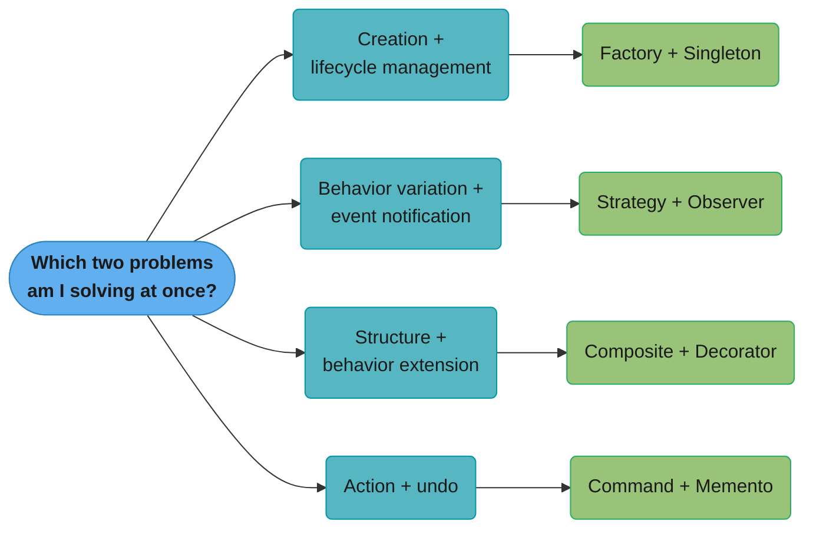
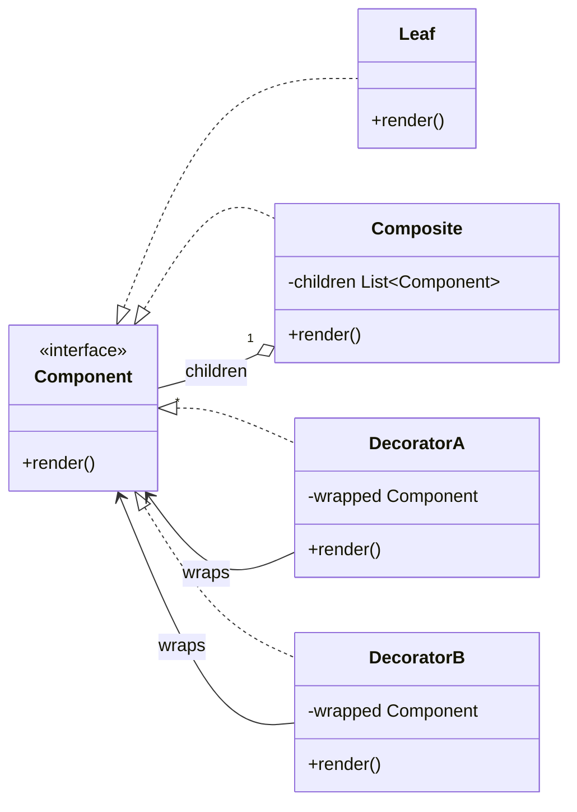
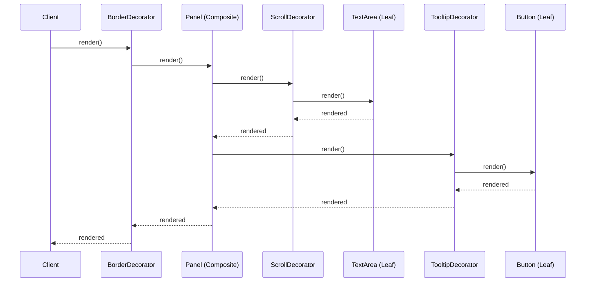

# Pattern Combinations Guide

Design patterns rarely appear in isolation. Real systems use them together — some combinations are so common they're practically standard idioms. This guide documents the most powerful pattern pairs, how they interact, and warns about combinations that cause problems.

---

## Intuition

> **One-line analogy**: Pattern combinations are like chord progressions in music — individual notes (patterns) are useful, but the real craft is knowing which ones harmonize and which ones clash.

**Mental model**: Real systems solve multiple problems simultaneously: create objects (Factory), ensure one instance (Singleton), react to changes (Observer), vary behavior (Strategy). The combinations are not accidental — they emerge naturally from design requirements. Factory + Singleton ensures one factory manages all objects. Strategy + Observer lets behavior changes trigger notifications. Command + Memento gives you a full undo/redo stack.

**Why it matters**: Knowing individual patterns is necessary but not sufficient. Understanding which patterns naturally combine — and why — separates engineers who can design from engineers who can only implement.

**Key insight**: Problematic combinations (Singleton + Strategy, deep Decorator chains) arise when one pattern's characteristic (global state, wrapping depth) conflicts with another's requirements. Learn the warning signs alongside the winning combinations.

---

## Why Patterns Combine

Each pattern solves one specific problem. Real systems have multiple problems:
- **Creation** + **lifecycle management** → Factory + Singleton
- **Behavior variation** + **event notification** → Strategy + Observer
- **Structure** + **behavior extension** → Composite + Decorator
- **Action** + **undo** → Command + Memento



*Each branch pairs two simultaneous concerns with the combination that resolves both at once — these four pairings recur constantly in production code, and each gets its own worked example below.*

---

## Classic Combinations

### 1. Factory + Singleton
**How they combine**: A Singleton factory creates and manages object instances.

**Use case**: Spring IoC container, JDBC `DriverManager`, logging frameworks

```java
// The factory itself is a Singleton
public class ConnectionFactory {
    private static final ConnectionFactory INSTANCE = new ConnectionFactory();
    private ConnectionFactory() {}
    public static ConnectionFactory getInstance() { return INSTANCE; }

    // Factory creates the right implementation
    public DatabaseConnection create(DatabaseType type) {
        return switch (type) {
            case MYSQL    -> new MySQLConnection(config);
            case POSTGRES -> new PostgresConnection(config);
        };
    }
}
// Usage:
DatabaseConnection conn = ConnectionFactory.getInstance().create(DatabaseType.MYSQL);
```

**Why they work together**: Factory handles object creation logic; Singleton ensures one consistent factory.

---

### 2. Observer + Strategy
**How they combine**: Events from Observer trigger different algorithms via Strategy.

**Use case**: Event-driven pricing, rule engines, UI event handlers with pluggable behavior

```java
interface PriceChangeListener {
    void onPriceChange(Stock stock, double newPrice);
}

class AlertTrigger implements PriceChangeListener {
    private final AlertStrategy alertStrategy; // Strategy

    public AlertTrigger(AlertStrategy strategy) { this.alertStrategy = strategy; }

    @Override
    public void onPriceChange(Stock stock, double newPrice) {
        // Strategy decides HOW to alert
        alertStrategy.sendAlert(stock, newPrice);
    }
}

// Registering:
stockMarket.addListener(new AlertTrigger(new EmailAlertStrategy()));
stockMarket.addListener(new AlertTrigger(new SMSAlertStrategy()));
```

**Why they work together**: Observer decouples event source from handlers; Strategy decouples the algorithm from the handler.

---

### 3. Decorator + Composite
**How they combine**: Decorators add behavior to individual components; Composite organizes them into trees. Both share the same Component interface.

**Use case**: UI component trees (Java Swing, HTML DOM), middleware pipelines



*Leaf and Composite both realize `Component`, so a caller never needs to know which one it holds; Composite aggregates any number of `Component` children while `DecoratorA`/`DecoratorB` each wrap a single `Component` instance — the shared interface is what lets trees and wrappers nest inside each other freely.*

```java
// A tree of components, each individually decorated
Component root = new BorderDecorator(
    new Panel(List.of(
        new ScrollDecorator(new TextArea("content")),
        new TooltipDecorator(new Button("Submit"))
    ))
);
root.render();
```



*A single `root.render()` call cascades through the decorator (`BorderDecorator` forwards to its wrapped `Panel`), then fans out across the composite's children — two of which are themselves decorated (`ScrollDecorator`, `TooltipDecorator`) — before the results bubble back up the same chain.*

**Why they work together**: Both use the same Component interface. You can decorate leaves, composites, or even other decorators.

---

### 4. Command + Memento
**How they combine**: Command executes the action; Memento captures state before execution, enabling undo.

**Use case**: Text editors, Photoshop history, git commits, database transactions

```java
class TextEditor {
    private StringBuilder text = new StringBuilder();
    private final Deque<Memento> history = new ArrayDeque<>();

    public void executeCommand(Command cmd) {
        history.push(new Memento(text.toString())); // save state BEFORE
        cmd.execute(this);                           // apply change
    }

    public void undo() {
        if (!history.isEmpty()) {
            Memento prev = history.pop();
            text = new StringBuilder(prev.getState()); // restore
        }
    }
}

class TypeCommand implements Command {
    private final String text;
    TypeCommand(String text) { this.text = text; }

    @Override
    public void execute(TextEditor editor) {
        editor.getText().append(text);
    }
}
```

**Why they work together**: Command is about *what action*; Memento is about *state before the action*. They're complementary — one for action, one for rollback.

---

### 5. Command + Chain of Responsibility
**How they combine**: CoR determines which handler should process a request; Command encapsulates the request for execution.

**Use case**: Middleware pipelines, servlet filters, authorization + action execution

```java
// Chain determines if/how to handle; Command is the payload
interface Handler {
    boolean handle(Command cmd);
}

class AuthHandler implements Handler {
    private Handler next;

    @Override
    public boolean handle(Command cmd) {
        if (!isAuthenticated()) return false;       // reject
        return next == null || next.handle(cmd);    // pass forward
    }
}

class RateLimitHandler implements Handler { ... }
class LoggingHandler implements Handler { ... }

class ExecutionHandler implements Handler {
    @Override
    public boolean handle(Command cmd) {
        cmd.execute();  // finally execute the Command
        return true;
    }
}
```

**Why they work together**: CoR for routing/filtering; Command for encapsulating the work.

---

### 6. Factory + Strategy
**How they combine**: Factory creates the right Strategy based on configuration or context.

**Use case**: Payment processors, compression algorithms, authentication methods

```java
class PaymentStrategyFactory {
    public static PaymentStrategy create(String method) {
        return switch (method) {
            case "CREDIT_CARD" -> new CreditCardStrategy();
            case "PAYPAL"      -> new PayPalStrategy();
            case "CRYPTO"      -> new CryptoStrategy();
            default -> throw new IllegalArgumentException("Unknown method: " + method);
        };
    }
}

// Clean usage:
PaymentStrategy strategy = PaymentStrategyFactory.create(user.getPreferredPayment());
order.checkout(strategy);
```

**Why they work together**: Factory hides the Strategy selection logic; client just uses the Strategy.

---

### 7. Builder + Factory
**How they combine**: Factory decides which Builder to use; Builder handles complex construction.

**Use case**: Document generation (PDF vs Word vs HTML), vehicle assembly

```java
interface DocumentBuilder {
    DocumentBuilder setTitle(String t);
    DocumentBuilder addSection(String content);
    Document build();
}

class DocumentFactory {
    public static DocumentBuilder createBuilder(DocumentType type) {
        return switch (type) {
            case PDF  -> new PDFDocumentBuilder();
            case WORD -> new WordDocumentBuilder();
            case HTML -> new HTMLDocumentBuilder();
        };
    }
}

// Usage:
Document doc = DocumentFactory.createBuilder(DocumentType.PDF)
    .setTitle("Annual Report")
    .addSection("Executive Summary")
    .build();
```

---

### 8. State + Command
**How they combine**: Current State determines which Commands are valid. Commands trigger State transitions.

**Use case**: ATM, vending machine, workflow engines

```java
interface ATMState {
    void process(Command cmd); // State validates and executes Commands
}

class PINVerifiedState implements ATMState {
    @Override
    public void process(Command cmd) {
        if (cmd instanceof WithdrawalCommand || cmd instanceof BalanceCommand) {
            cmd.execute();
        } else {
            throw new InvalidOperationException("Not valid in this state");
        }
    }
}
```

**Why they work together**: State provides context validation; Command provides the action to execute.

---

### 9. Proxy + Observer
**How they combine**: Proxy intercepts method calls and fires Observer notifications as a side effect.

**Use case**: Audit logging, metrics collection, reactive programming (Spring Data JPA, Hibernate)

```java
class AuditingProxy<T> implements InvocationHandler {
    private final T target;
    private final List<AuditObserver> observers;

    @Override
    public Object invoke(Object proxy, Method method, Object[] args) throws Throwable {
        long start = System.currentTimeMillis();
        Object result = method.invoke(target, args);
        long elapsed = System.currentTimeMillis() - start;

        // Notify observers without changing target
        AuditEvent event = new AuditEvent(method.getName(), args, elapsed);
        observers.forEach(o -> o.onEvent(event));

        return result;
    }
}
```

**Why they work together**: Proxy is transparent to clients; Observer is transparent to the target. Neither the client nor the target needs to know about auditing.

---

### 10. Prototype + Factory
**How they combine**: Factory uses cloning (Prototype) instead of `new` to create objects.

**Use case**: Game enemies, document templates, configuration presets

```java
class EnemyFactory {
    private final Map<String, Enemy> prototypes = new HashMap<>();

    public void registerPrototype(String type, Enemy enemy) {
        prototypes.put(type, enemy);
    }

    public Enemy create(String type) {
        Enemy prototype = prototypes.get(type);
        return prototype.clone(); // Prototype pattern
    }
}

// Register once:
factory.registerPrototype("GOBLIN", new Goblin(health=50, damage=10, speed=FAST));
factory.registerPrototype("TROLL",  new Troll(health=200, damage=40, speed=SLOW));

// Create many — no expensive re-initialization:
for (int i = 0; i < 100; i++) {
    Enemy e = factory.create("GOBLIN"); // fast clone
    level.spawn(e);
}
```

---

## Real-World System Pattern Maps

### Spring Framework
```
ApplicationContext (Bean Factory)    → Factory Method + Singleton
AOP (aspect weaving)                 → Proxy
JdbcTemplate                         → Template Method
ApplicationEventPublisher            → Observer
@Autowired constructor injection     → Dependency Injection (enabled by Strategy + Factory)
```

### Java I/O
```
InputStream/OutputStream hierarchy   → Decorator
InputStreamReader                    → Adapter
Scanner                              → Iterator
BufferedReader(new FileReader(...))  → Decorator wrapping Adapter
```

### Android Framework
```
AlertDialog.Builder          → Builder
LiveData / RxJava            → Observer
Intent/Handler               → Command
RecyclerView.Adapter         → Adapter
Fragment                     → Composite (contains views)
```

---

## Anti-Combinations (Patterns That Clash)

### Singleton + Dependency Injection
Singletons are hard to mock, hard to replace, and couple code to a concrete class. DI frameworks (Spring, Guice) provide managed singletons that ARE injectable and mockable. Avoid hand-rolled Singletons when using a DI framework.

### Decorator vs Deep Inheritance
Don't use inheritance hierarchies when Decorator would work. `BorderedScrollableResizablePanel extends ScrollablePanel extends BorderedPanel extends Panel` → use Decorator instead.

### Observer Everywhere (Event Spaghetti)
Overusing Observer creates invisible coupling. When everything publishes and subscribes to events, tracing execution flow becomes nearly impossible. Use direct method calls when the relationship is clear and stable; use Observer for genuinely loose coupling across module boundaries.

### Factory + Abstract Factory + Builder Together
Mixing all creation patterns for one object adds confusion. Pick the simplest that solves the problem: Builder if it has many optional fields; Factory if you need polymorphism; Abstract Factory only if you need whole families of related objects.

---

## Pattern Combinations Matrix

|   | Singleton | Factory | Builder | Prototype | Observer | Strategy | Command | State | Decorator | Proxy |
|---|:---------:|:-------:|:-------:|:---------:|:--------:|:--------:|:-------:|:-----:|:---------:|:-----:|
| **Singleton** | — | ✓✓ | | | | | | | | |
| **Factory** | ✓✓ | — | ✓✓ | ✓✓ | | ✓✓ | | | | |
| **Observer** | | | | | — | ✓✓ | ✓✓ | | | ✓✓ |
| **Strategy** | | ✓✓ | | | ✓✓ | — | ✓ | ✓ | | |
| **Command** | | | | | ✓✓ | ✓ | — | ✓✓ | | |
| **State** | | | | | | ✓ | ✓✓ | — | | |
| **Decorator** | | | | | | | | | — | |
| **Composite** | | | | | | | | | ✓✓ | |

✓✓ = very common combination | ✓ = occasional combination
