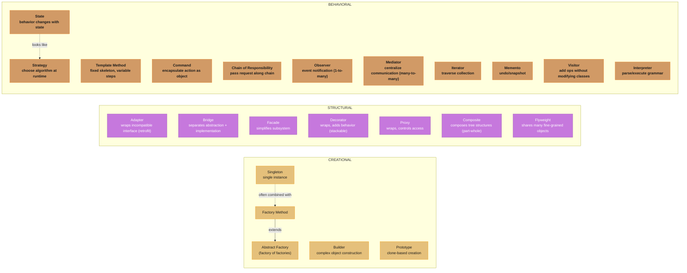
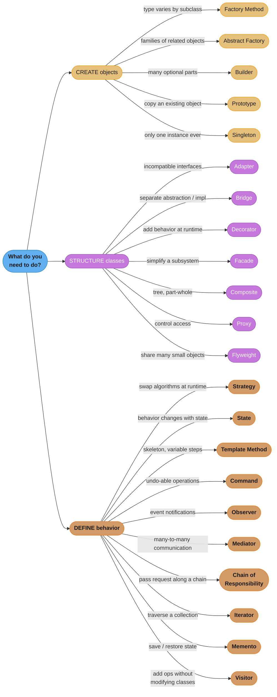

# Design Pattern Comparisons - Master Reference

This directory contains deep-dive comparisons of commonly confused GoF design patterns. Each file provides side-by-side analysis, code examples, and interview guidance.

---

## Intuition

> **One-line analogy**: Pattern comparisons are like knowing not just the tools in your toolbox but which job each one was designed for — a screwdriver and a drill both turn things, but they're not interchangeable.

**Mental model**: Many GoF patterns look structurally identical (Strategy and State both delegate to an interface; Decorator and Proxy both wrap an object). The confusion clears when you ask "what problem is this solving?" — Strategy swaps algorithms; State encodes lifecycle. Decorator adds behavior; Proxy controls access. The distinction always lives in intent, not structure.

**Why it matters**: Interviewers often deliberately present confusable patterns. Knowing their structural similarity AND the intent difference is the sign of genuine understanding versus memorization.

**Key insight**: When stuck between two patterns, ask: "Who controls the switch?" and "What changes over the object's lifetime?" The answers usually disambiguate immediately.

---

## Master Comparison Matrix - All 23 GoF Patterns

| Pattern | Category | Intent | Scope | Key Mechanism |
|---------|----------|--------|-------|---------------|
| Abstract Factory | Creational | Create families of related objects | Object | Delegates to factory objects |
| Builder | Creational | Construct complex objects step by step | Object | Separates construction from representation |
| Factory Method | Creational | Define interface for object creation | Class | Subclasses decide which class to instantiate |
| Prototype | Creational | Clone existing objects | Object | Copies an existing object |
| Singleton | Creational | Ensure only one instance exists | Object | Controls instance creation |
| Adapter | Structural | Convert interface to another | Class/Object | Wraps an object/class with a new interface |
| Bridge | Structural | Separate abstraction from implementation | Object | Composition over inheritance |
| Composite | Structural | Tree structure of objects | Object | Recursive composition |
| Decorator | Structural | Add responsibilities dynamically | Object | Wraps object, adds behavior |
| Facade | Structural | Simplified interface to subsystem | Object | Delegates to subsystem objects |
| Flyweight | Structural | Share fine-grained objects | Object | Shared state between many small objects |
| Proxy | Structural | Surrogate or placeholder | Object | Wraps object, controls access |
| Chain of Responsibility | Behavioral | Pass request along handler chain | Object | Linked list of handlers |
| Command | Behavioral | Encapsulate request as object | Object | Encapsulates action + receiver |
| Interpreter | Behavioral | Language grammar interpretation | Class | Composite of terminal/nonterminal expressions |
| Iterator | Behavioral | Sequential access to collection | Object | Cursor over aggregate |
| Mediator | Behavioral | Centralize object communication | Object | Central hub coordinates colleagues |
| Memento | Behavioral | Capture and restore object state | Object | Originator/Caretaker/Memento trio |
| Observer | Behavioral | Notify dependents of state change | Object | Subject notifies list of observers |
| State | Behavioral | Alter behavior when state changes | Object | Delegates to current state object |
| Strategy | Behavioral | Encapsulate interchangeable algorithms | Object | Delegates to strategy object |
| Template Method | Behavioral | Define algorithm skeleton in base class | Class | Inheritance, hook methods |
| Visitor | Behavioral | Add operations without changing classes | Object | Double dispatch |

---

## Pattern Relationship Map

*Patterns cluster by GoF category — gold for Creational, purple for Structural, orange for Behavioral. The two dashed edges are the classic look-alike traps: Singleton is frequently paired with Factory Method, and State's structure is often confused with Strategy's — exactly the pairs the comparison table below digs into.*

---

## Commonly Confused Pairs (Files in this directory)

| File | Patterns Compared | Core Confusion |
|------|-------------------|----------------|
| [Strategy_vs_State.md](Strategy_vs_State.md) | Strategy vs State | Both delegate to an object; differ in *who* drives change |
| [Factory_vs_AbstractFactory_vs_Builder.md](Factory_vs_AbstractFactory_vs_Builder.md) | Factory Method vs Abstract Factory vs Builder | All create objects; differ in complexity and structure |
| [Adapter_vs_Bridge_vs_Facade.md](Adapter_vs_Bridge_vs_Facade.md) | Adapter vs Bridge vs Facade | All wrap; differ in intent and timing |
| [Decorator_vs_Proxy.md](Decorator_vs_Proxy.md) | Decorator vs Proxy | Both wrap objects; differ in purpose |
| [Observer_vs_Mediator.md](Observer_vs_Mediator.md) | Observer vs Mediator | Both handle communication; differ in topology |
| [Command_vs_Strategy.md](Command_vs_Strategy.md) | Command vs Strategy | Both encapsulate behavior; differ in purpose |
| [Template_vs_Strategy.md](Template_vs_Strategy.md) | Template Method vs Strategy | Both vary steps; inheritance vs composition |
| [Composite_vs_Decorator.md](Composite_vs_Decorator.md) | Composite vs Decorator | Both use recursive composition |
| [ChainOfResponsibility_vs_Command.md](ChainOfResponsibility_vs_Command.md) | Chain of Responsibility vs Command | Both handle requests |

---

## Quick Selection Guide

*Triage first by job type (colors matching the relationship map above), then follow the branch whose condition matches your situation to the recommended pattern. The checklists below spell out the same 22 rules in prose — use whichever you scan faster.*

### "I need to CREATE objects"
- Single object, type varies by subclass -> **Factory Method**
- Families of related objects -> **Abstract Factory**
- Complex object with many optional parts -> **Builder**
- Copy an existing object -> **Prototype**
- Only one instance ever -> **Singleton**

### "I need to STRUCTURE classes/objects"
- Make incompatible interfaces work together -> **Adapter**
- Separate abstraction from implementation -> **Bridge**
- Add behavior dynamically at runtime -> **Decorator**
- Simplify a complex subsystem -> **Facade**
- Tree structure (part-whole) -> **Composite**
- Control access to an object -> **Proxy**
- Share many small objects -> **Flyweight**

### "I need to define BEHAVIOR / communication"
- Swap algorithms at runtime -> **Strategy**
- Behavior changes with object state -> **State**
- Skeleton algorithm with variable steps -> **Template Method**
- Undo-able operations -> **Command**
- Event notifications -> **Observer**
- Decouple many-to-many communication -> **Mediator**
- Pass request along a chain -> **Chain of Responsibility**
- Traverse a collection -> **Iterator**
- Save and restore state -> **Memento**
- Add operations to class hierarchy without modifying it -> **Visitor**

---

## Pattern Frequency in Real Systems

| Frequency | Patterns |
|-----------|----------|
| Very Common | Singleton, Factory Method, Observer, Strategy, Decorator, Facade |
| Common | Builder, Adapter, Proxy, Command, Iterator, Template Method |
| Moderate | Abstract Factory, Composite, State, Chain of Responsibility, Mediator |
| Less Common | Bridge, Flyweight, Prototype, Memento, Visitor, Interpreter |

---

## Files in This Directory

- [README.md](README.md) — This file (master matrix + quick guide)
- [Strategy_vs_State.md](Strategy_vs_State.md)
- [Factory_vs_AbstractFactory_vs_Builder.md](Factory_vs_AbstractFactory_vs_Builder.md)
- [Adapter_vs_Bridge_vs_Facade.md](Adapter_vs_Bridge_vs_Facade.md)
- [Decorator_vs_Proxy.md](Decorator_vs_Proxy.md)
- [Observer_vs_Mediator.md](Observer_vs_Mediator.md)
- [Command_vs_Strategy.md](Command_vs_Strategy.md)
- [Template_vs_Strategy.md](Template_vs_Strategy.md)
- [Composite_vs_Decorator.md](Composite_vs_Decorator.md)
- [ChainOfResponsibility_vs_Command.md](ChainOfResponsibility_vs_Command.md)
- [DecisionFlowchart.md](DecisionFlowchart.md)
- [InterviewQuestions.md](InterviewQuestions.md)
