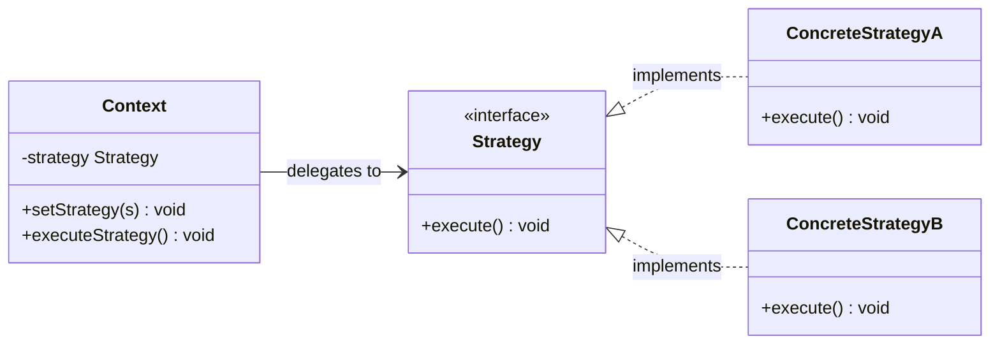
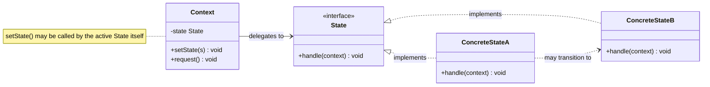
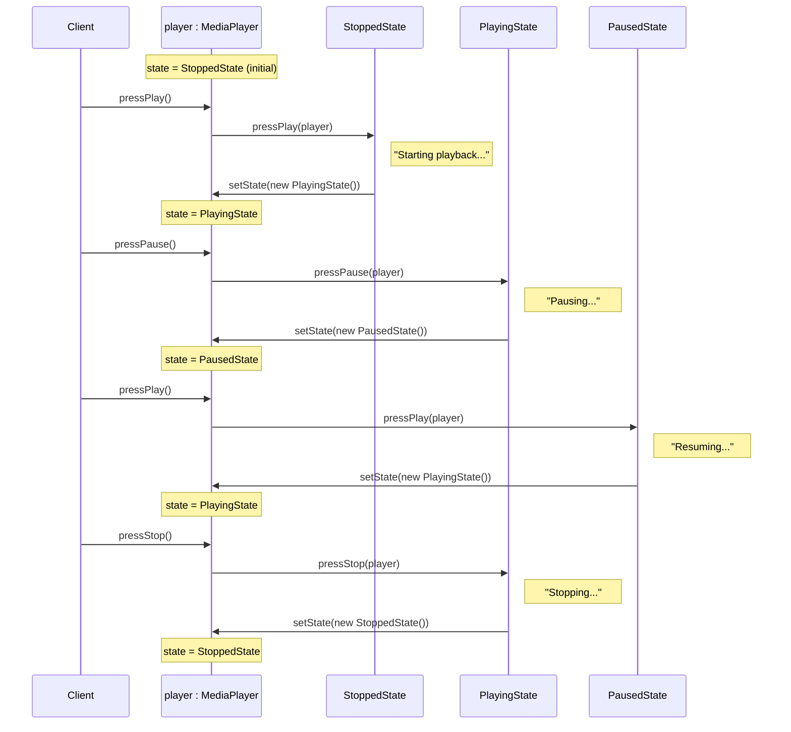
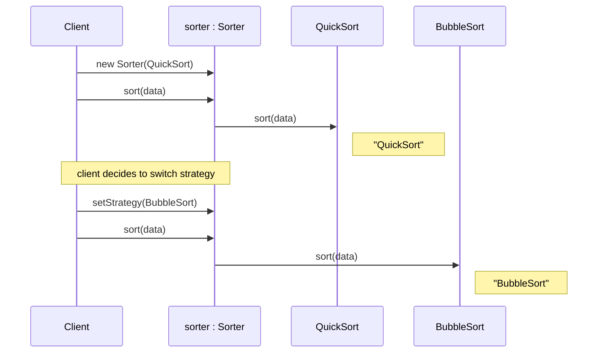

# Strategy vs State Pattern

## Overview

Both patterns delegate behavior to a separate object and look nearly identical in their class diagrams. The key difference lies in **who controls transitions** and **what the pattern is trying to solve**.

---

## Intuition

> **One-line analogy**: Strategy vs State is like a car's driving mode (Sport/Eco/Normal — you choose) vs a traffic light's phase (Red/Yellow/Green — it progresses on its own schedule).

**Mental model**: Both delegate to an interface. Strategy is chosen externally — the client or context picks the algorithm and it stays until changed. State transitions internally — the state object itself (or the context) decides when to move to the next state based on what happens. If your vending machine's "idle" state transitions to "has money" after `insertCoin()`, that's State. If your sorter switches between `QuickSort` and `MergeSort` based on input size, that's Strategy.

**Why it matters**: This is the most common pattern confusion in interviews. Getting it right demonstrates you understand intent, not just structure.

**Key insight**: Ask "who decides to switch?" — if it's the client/user, it's Strategy. If the pattern itself governs transitions based on events, it's State.

---

## Side-by-Side UML

Both patterns produce almost the same shape — a `Context` holding a reference to an interface, with concrete implementations behind it. The diagrams below are structural near-twins; each is captioned with the one difference that actually matters.

### Strategy



*`Context` only ever holds the `Strategy` interface; `setStrategy()` is an external call the client makes, and `ConcreteStrategyA`/`ConcreteStrategyB` never reference each other.*

### State



*The one structural tell versus Strategy: the dashed `ConcreteStateA ..> ConcreteStateB` arrow. A state implementation can construct a sibling state and hand it back to `Context.setState()` — strategies never do this to each other.*

---

## Key Differences Table

| Dimension | Strategy | State |
|-----------|----------|-------|
| **Primary intent** | Choose algorithm at runtime | Change behavior as internal state changes |
| **Who drives the switch** | Client / external code | State objects themselves OR Context |
| **States aware of each other** | No — strategies are independent | Yes — states often trigger transitions to other states |
| **Context awareness** | Strategy usually doesn't hold a Context reference | State usually receives Context to trigger transitions |
| **Number of "states"** | Typically few, user-controlled | Can be many; transitions form a state machine |
| **Pattern models** | "How to do something" | "What phase the object is in" |
| **Replaceability** | Strategies are freely interchangeable | States follow a defined lifecycle/graph |
| **Client knowledge** | Client knows and chooses the strategy | Client usually doesn't manage state transitions |

---

## Common Confusion Points

1. **They look identical in code** — Both have a context with a reference to an interface, and concrete implementations. The structural difference is nearly zero.
2. **State can look like Strategy with extra steps** — If you don't need auto-transitions, a State object behaves exactly like a Strategy.
3. **The key tell**: Does the encapsulated object know about *other* objects of the same type and switch between them? If yes, it's State. If no, it's Strategy.
4. **Mutability**: In Strategy, the context's algorithm field is set by the client and rarely changes mid-operation. In State, transitions happen continuously as the system runs.

---

## When to Use Which

### Use Strategy when:
- You have multiple algorithms for the same task and want to swap them (sort algorithms, compression codecs, payment methods)
- The client knows which algorithm to use and selects it explicitly
- Algorithms are completely independent of each other
- You want to eliminate conditional branches that select algorithm behavior

### Use State when:
- An object must change its behavior based on its internal state (e.g., a vending machine, traffic light, order lifecycle)
- You have state-specific behavior spread across many if/else or switch statements
- State transitions happen automatically based on events or internal logic
- The object passes through a defined lifecycle with predictable transitions

---

## Same Problem Solved Both Ways

### Problem: A media player that can Play, Pause, and Stop

---

### Solution with Strategy (wrong fit — included for comparison)

```java
// Strategy approach — client controls which "mode" is active
interface PlayerStrategy {
    void pressPlay();
    void pressPause();
}

class PlayingStrategy implements PlayerStrategy {
    public void pressPlay()  { System.out.println("Already playing"); }
    public void pressPause() { System.out.println("Pausing..."); }
}

class PausedStrategy implements PlayerStrategy {
    public void pressPlay()  { System.out.println("Resuming..."); }
    public void pressPause() { System.out.println("Already paused"); }
}

class MediaPlayer {
    private PlayerStrategy strategy;

    public void setStrategy(PlayerStrategy s) { this.strategy = s; }
    public void pressPlay()  { strategy.pressPlay(); }
    public void pressPause() { strategy.pressPause(); }
}

// Client is responsible for managing the switch — awkward
MediaPlayer player = new MediaPlayer();
player.setStrategy(new PausedStrategy());
player.pressPlay();
player.setStrategy(new PlayingStrategy()); // client must do this manually
```

---

### Solution with State (correct fit)

```java
// State approach — transitions happen automatically inside state objects
interface PlayerState {
    void pressPlay(MediaPlayer player);
    void pressPause(MediaPlayer player);
    void pressStop(MediaPlayer player);
}

class MediaPlayer {
    private PlayerState state;

    public MediaPlayer() { this.state = new StoppedState(); }

    public void setState(PlayerState state) { this.state = state; }

    public void pressPlay()  { state.pressPlay(this); }
    public void pressPause() { state.pressPause(this); }
    public void pressStop()  { state.pressStop(this); }
}

class PlayingState implements PlayerState {
    public void pressPlay(MediaPlayer p)  {
        System.out.println("Already playing");
    }
    public void pressPause(MediaPlayer p) {
        System.out.println("Pausing...");
        p.setState(new PausedState());   // auto-transition
    }
    public void pressStop(MediaPlayer p) {
        System.out.println("Stopping...");
        p.setState(new StoppedState());  // auto-transition
    }
}

class PausedState implements PlayerState {
    public void pressPlay(MediaPlayer p)  {
        System.out.println("Resuming...");
        p.setState(new PlayingState());  // auto-transition
    }
    public void pressPause(MediaPlayer p) {
        System.out.println("Already paused");
    }
    public void pressStop(MediaPlayer p) {
        System.out.println("Stopping...");
        p.setState(new StoppedState());
    }
}

class StoppedState implements PlayerState {
    public void pressPlay(MediaPlayer p)  {
        System.out.println("Starting playback...");
        p.setState(new PlayingState());
    }
    public void pressPause(MediaPlayer p) {
        System.out.println("Nothing to pause");
    }
    public void pressStop(MediaPlayer p) {
        System.out.println("Already stopped");
    }
}

// Usage — client just fires events, state machine handles transitions
MediaPlayer player = new MediaPlayer();
player.pressPlay();   // Starting playback...
player.pressPause();  // Pausing...
player.pressPlay();   // Resuming...
player.pressStop();   // Stopping...
```

Here's that trace playing out at runtime — the client only ever fires `pressPlay()`/`pressPause()`/`pressStop()`; each state object decides for itself which state comes next:



*The state object swaps itself out mid-call (`ST->>P: setState(new PlayingState())`) — this self-directed transition is exactly what Strategy's client-driven `setStrategy()` never does.*

---

### Strategy in its natural habitat: Sorting

```java
interface SortStrategy {
    void sort(int[] data);
}

class QuickSort implements SortStrategy {
    public void sort(int[] data) { System.out.println("QuickSort"); }
}

class MergeSort implements SortStrategy {
    public void sort(int[] data) { System.out.println("MergeSort"); }
}

class BubbleSort implements SortStrategy {
    public void sort(int[] data) { System.out.println("BubbleSort"); }
}

class Sorter {
    private SortStrategy strategy;

    public Sorter(SortStrategy strategy) { this.strategy = strategy; }

    public void setStrategy(SortStrategy s) { this.strategy = s; }

    public void sort(int[] data) { strategy.sort(data); }
}

// Client explicitly chooses the algorithm
Sorter sorter = new Sorter(new QuickSort());
sorter.sort(new int[]{3,1,2});

// Switch strategy for small datasets
sorter.setStrategy(new BubbleSort());
sorter.sort(new int[]{3,1});
```

This is the mirror image of the State trace above — the client, never the strategy, drives every switch:



*`QuickSort` and `BubbleSort` never call back into `Sorter` — the client calls `setStrategy()` explicitly whenever it wants a different algorithm, matching the "who decides to switch?" test from the Key Insight above.*

---

## Interview Answer Template

**Q: What is the difference between Strategy and State?**

> Both Strategy and State encapsulate behavior in a separate object and allow a context to delegate work to that object. The structural difference is minimal, but the intent is fundamentally different.
>
> Strategy is about **choosing an algorithm** — the client selects which concrete strategy to use, and the strategies are completely independent of each other. Think of payment methods: the user picks PayPal or credit card, and those options don't know about each other.
>
> State is about **modeling a lifecycle** — the object itself drives transitions between states, and state objects often know about other states. Think of a vending machine: it moves through Idle, HasMoney, Dispensing, and OutOfStock states automatically as events occur.
>
> The diagnostic question: "Does the encapsulated object trigger transitions to a sibling object?" If yes, it's State. If not, it's Strategy.

---

## Real-World Examples

| Pattern | Example |
|---------|---------|
| Strategy | Compression algorithm (zip, gzip, bzip2), Sort algorithm, Payment gateway |
| State | Order lifecycle (Placed > Shipped > Delivered > Returned), TCP connection, Vending machine, Traffic light |
| Both misidentified | UI rendering mode — looks like State but is actually Strategy if transitions are client-driven |
