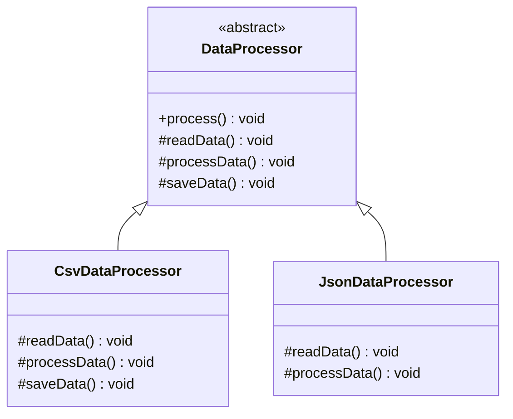
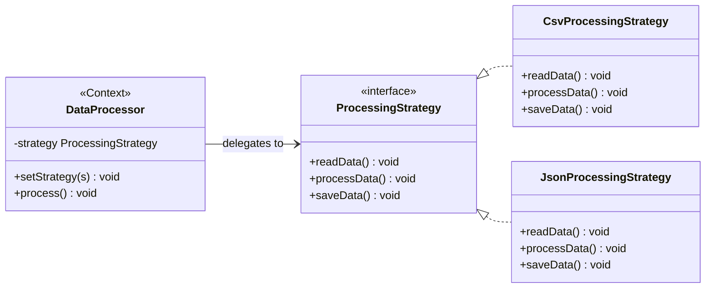
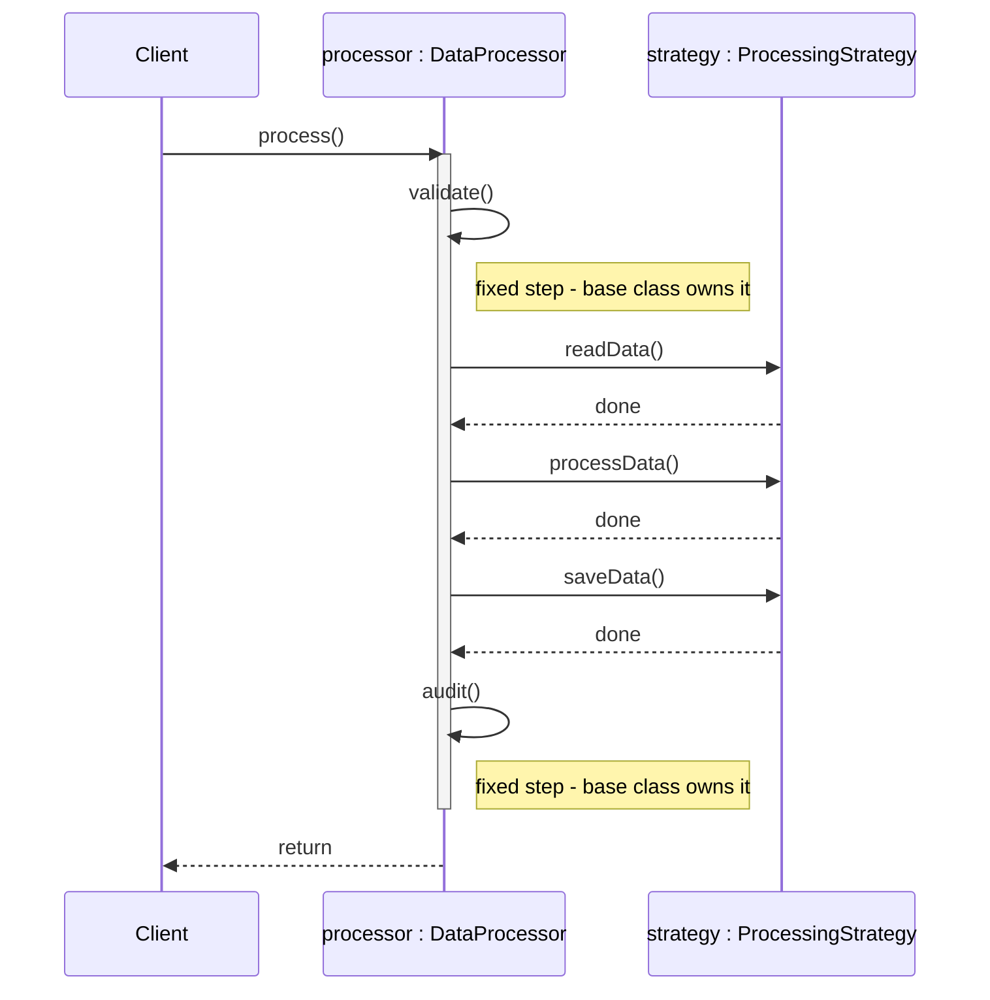

# Template Method vs Strategy Pattern

## Quick Summary

- **Template Method**: Defines the *skeleton* of an algorithm in a base class; subclasses override specific steps (uses inheritance).
- **Strategy**: Defines a *family of algorithms*; the client injects the desired implementation (uses composition).

---

## Intuition

> **One-line analogy**: Template Method is a franchise recipe (the headquarters defines the process; franchisees fill in local ingredients); Strategy is a plugin slot (you swap the entire cooking approach at runtime).

**Mental model**: Template Method fixes the *structure* of an algorithm in a base class and lets subclasses override specific steps — using inheritance. The "template" (order of steps) never changes; only the details do. Strategy replaces the entire algorithm via composition — the context holds a reference and you swap it at runtime, no subclassing needed. Template Method is compile-time extension; Strategy is runtime extension.

**Why it matters**: Template Method is simpler when the algorithm structure is fixed and variation is limited to a few well-defined hooks. Strategy is more flexible (no inheritance tax) but requires an explicit interface and more indirection.

**Key insight**: "Prefer composition over inheritance" usually points you toward Strategy. Use Template Method when the algorithm skeleton must be enforced and subclass override is the natural extension mechanism (e.g., `AbstractList` in Java).

---

## Side-by-Side Comparison

| Aspect             | Template Method                                   | Strategy                                           |
|--------------------|---------------------------------------------------|----------------------------------------------------|
| **Intent**         | Fix the algorithm structure; let subclasses fill in steps | Define interchangeable algorithms; inject at runtime |
| **Structure**      | Abstract base class with a final template method  | Context class holds a Strategy interface reference |
| **Key Difference** | Inheritance — subclass IS-A variant               | Composition — context HAS-A strategy              |
| **Use When**       | The overall algorithm steps are fixed but individual steps vary | The entire algorithm (or large part of it) varies and must be swappable |

---

## Java Code Examples

### Template Method Pattern — Data Processor with Fixed Pipeline

```java
// Abstract class defines the algorithm skeleton
public abstract class DataProcessor {

    // Template method — final to prevent overriding the skeleton
    public final void process() {
        readData();
        processData();
        saveData();
        System.out.println("--- Pipeline complete ---");
    }

    // Steps subclasses MUST implement
    protected abstract void readData();
    protected abstract void processData();

    // Hook — subclasses MAY override (default behavior provided)
    protected void saveData() {
        System.out.println("Saving data to default storage");
    }
}

// Concrete implementation 1: CSV pipeline
public class CsvDataProcessor extends DataProcessor {

    @Override
    protected void readData() {
        System.out.println("Reading data from CSV file");
    }

    @Override
    protected void processData() {
        System.out.println("Parsing and transforming CSV rows");
    }

    @Override
    protected void saveData() {
        System.out.println("Writing processed rows to database");
    }
}

// Concrete implementation 2: JSON pipeline
public class JsonDataProcessor extends DataProcessor {

    @Override
    protected void readData() {
        System.out.println("Reading data from JSON API endpoint");
    }

    @Override
    protected void processData() {
        System.out.println("Deserializing JSON and applying business rules");
    }
    // Uses default saveData() — saves to default storage
}

// Client
public class TemplateMethodDemo {
    public static void main(String[] args) {
        DataProcessor csv = new CsvDataProcessor();
        csv.process();

        System.out.println();

        DataProcessor json = new JsonDataProcessor();
        json.process();
    }
}
```

**Output:**
```
Reading data from CSV file
Parsing and transforming CSV rows
Writing processed rows to database
--- Pipeline complete ---

Reading data from JSON API endpoint
Deserializing JSON and applying business rules
Saving data to default storage
--- Pipeline complete ---
```

---

### Strategy Pattern — Data Processor with Injected Algorithm

```java
// Strategy interface — the full processing algorithm is abstracted
public interface ProcessingStrategy {
    void readData();
    void processData();
    void saveData();
}

// Concrete Strategy 1: CSV
public class CsvProcessingStrategy implements ProcessingStrategy {
    @Override
    public void readData()    { System.out.println("Reading from CSV file"); }
    @Override
    public void processData() { System.out.println("Transforming CSV rows"); }
    @Override
    public void saveData()    { System.out.println("Saving CSV result to DB"); }
}

// Concrete Strategy 2: JSON
public class JsonProcessingStrategy implements ProcessingStrategy {
    @Override
    public void readData()    { System.out.println("Reading from JSON API"); }
    @Override
    public void processData() { System.out.println("Deserializing JSON objects"); }
    @Override
    public void saveData()    { System.out.println("Saving JSON result to DB"); }
}

// Context — NOT a base class; it delegates entirely to the strategy
public class DataProcessor {
    private ProcessingStrategy strategy;

    public DataProcessor(ProcessingStrategy strategy) {
        this.strategy = strategy;
    }

    // Swap strategy at runtime — impossible with Template Method
    public void setStrategy(ProcessingStrategy strategy) {
        this.strategy = strategy;
    }

    public void process() {
        strategy.readData();
        strategy.processData();
        strategy.saveData();
        System.out.println("--- Pipeline complete ---");
    }
}

// Client
public class StrategyDemo {
    public static void main(String[] args) {
        DataProcessor processor = new DataProcessor(new CsvProcessingStrategy());
        processor.process();

        System.out.println();

        // Switch strategy at runtime — no subclassing needed
        processor.setStrategy(new JsonProcessingStrategy());
        processor.process();
    }
}
```

---

## Key Structural Differences — ASCII Class Diagrams

### Template Method (Inheritance)



*`process()` is `final` — the skeleton that always calls `readData → processData → saveData`. `readData()`/`processData()` are abstract primitive operations every subclass must supply; `saveData()` is a hook with a default body, so `JsonDataProcessor` inherits it unchanged instead of overriding it.*

### Strategy (Composition)



*`DataProcessor` (the Context) holds a `ProcessingStrategy` reference and delegates every step to it — unlike Template Method, there is no shared base implementation, so `setStrategy()` lets the client swap in `JsonProcessingStrategy` at runtime without subclassing.*

---

## The "Favor Composition Over Inheritance" Tradeoff

| Factor                          | Template Method          | Strategy                    |
|---------------------------------|--------------------------|-----------------------------|
| Code reuse                      | Easy — inherit base class| Requires more boilerplate   |
| Runtime switching               | Not possible             | Yes — call `setStrategy()`  |
| Adding a new variant            | New subclass             | New class implementing interface |
| Testing algorithm in isolation  | Hard — tied to base class| Easy — inject a mock strategy|
| Multiple inheritance concerns   | Yes (Java single inherit)| None                        |
| Algorithm structure flexibility | Fixed by base class      | Each strategy owns its own flow |

**Rule of thumb**: If the algorithm *structure* (the sequence of steps) is invariant and only the *details* of steps vary, use Template Method. If the entire algorithm — or even the structure — may vary between clients, prefer Strategy.

---

## Decision Guide

Use **Template Method** when:
- You have an invariant algorithm skeleton with well-defined extension points
- Code reuse across variants is high and inheritance is acceptable
- You want to enforce a specific pipeline order (e.g., lifecycle methods)
- The number of variants is small and known at compile time

Use **Strategy** when:
- Algorithms need to be swapped at runtime
- You want to avoid a deep inheritance hierarchy
- Each variant may have a completely different internal structure
- You are writing a library/framework and want clients to inject behavior
- You need to unit test algorithms independently

---

## Common Confusion Points

1. **Both solve the same surface problem** (varying behavior) but with different mechanisms. The interview signal is: does the algorithm *structure* change, or just the *steps*?

2. **Hooks in Template Method** — A hook is an optional step in the base class with a default (possibly empty) implementation. Subclasses override only if needed. This is more nuanced than pure abstract methods.

3. **Strategy does not share code** — Unlike Template Method, there is no shared base implementation. If strategies share code, you may need an abstract base strategy class or a utility class.

4. **Template Method creates tight coupling to the base class** — Changes to the abstract class can ripple into all subclasses. Strategy's Context is only coupled to the interface.

---

## Real-World Examples

| Template Method | Strategy |
|-----------------|----------|
| `javax.servlet.HttpServlet` (`doGet`, `doPost` override) | `java.util.Comparator` |
| `Spring JdbcTemplate` (callback hooks) | `java.util.Collections.sort()` accepting a `Comparator` |
| `AbstractList` in Java Collections Framework | `LayoutManager` in Java AWT/Swing |
| JUnit `setUp` / `tearDown` test lifecycle | Payment gateway selection (Stripe, PayPal, Braintree) |
| Android `Activity` lifecycle callbacks | Compression strategy (gzip, deflate, brotli) |

---

## Can They Work Together?

Yes — a Template Method in the base class can delegate individual steps to Strategy objects:

```java
public abstract class DataProcessor {

    private final ProcessingStrategy strategy;

    public DataProcessor(ProcessingStrategy strategy) {
        this.strategy = strategy;
    }

    // Template method: fixed pipeline
    public final void process() {
        validate();              // fixed step in base class
        strategy.readData();     // delegated to strategy
        strategy.processData();  // delegated to strategy
        strategy.saveData();     // delegated to strategy
        audit();                 // fixed step in base class
    }

    private void validate() { System.out.println("Validating configuration"); }
    private void audit()    { System.out.println("Writing audit log entry"); }
}
```

Reading the hybrid as a runtime sequence makes the alternation between fixed and delegated steps explicit — `validate()` and `audit()` never move, while the three middle steps bind to whichever strategy was injected:



*`validate()` and `audit()` are invariant — implemented once in the base class — while `readData()`/`processData()`/`saveData()` are delegated to whichever `ProcessingStrategy` was injected at construction; swap in a different strategy and this diagram is unchanged except for what `S` binds to.*

This hybrid keeps the pipeline structure locked (Template Method) while making each step independently replaceable (Strategy) — the best of both worlds.
