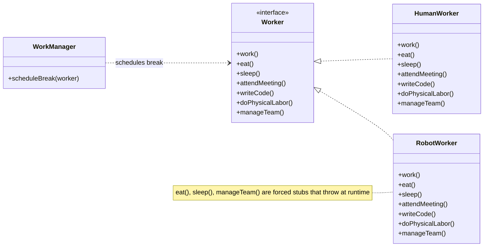
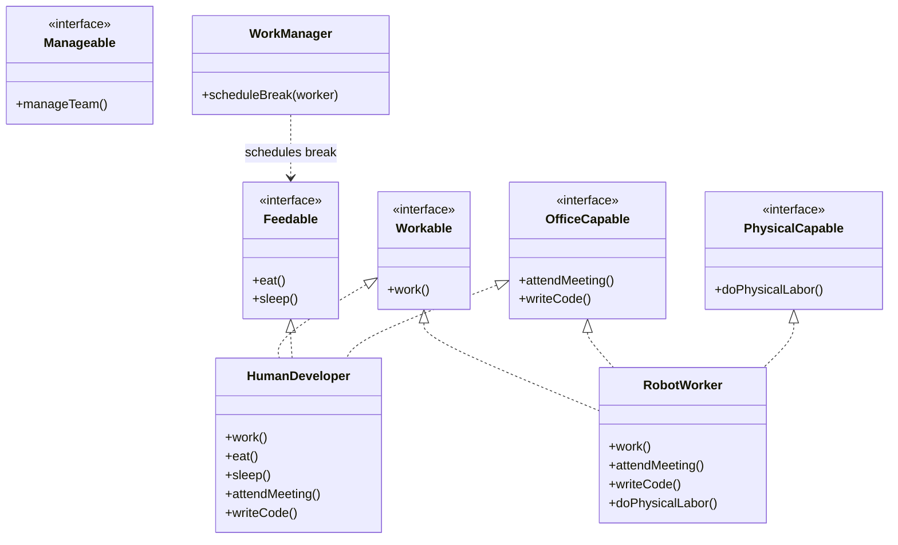

# Interface Segregation Principle (ISP)

**Part of the SOLID series** | [Back to Overview](README.md)

---

## Definition and Intent

> "No client should be forced to depend on methods it does not use."
> — Robert C. Martin

Equivalently: **prefer small, role-specific interfaces over large, general-purpose ones.** A "fat" interface that combines unrelated operations forces every implementor to deal with responsibilities it does not care about.

**Intent:** Keep interfaces narrow and cohesive so that implementing classes only depend on the methods relevant to their role. This reduces coupling, makes implementations focused, and prevents accidental breakage when an unrelated part of a fat interface changes.

ISP is essentially **SRP applied to interfaces.** Just as SRP says a class should have one reason to change, ISP says an interface should serve one actor/client — not many.

---

## Intuition

> **One-line analogy**: ISP is like specialized job roles — don't hire a contractor and force them to sign contracts covering plumbing, electrical, and carpentry. Give them only the agreement relevant to their work.

**Mental model**: A "fat" interface like `Worker` with methods `code()`, `design()`, `test()`, `deploy()` forces every implementation (backend dev, designer, QA) to implement methods irrelevant to them. When `deploy()` changes, the designer's class breaks. ISP says: split into `Coder`, `Designer`, `Tester`, `Deployer` — classes implement only the interfaces they actually use.

**Why it matters**: Fat interfaces create unnecessary coupling — a class that implements irrelevant methods must change when those methods change, even if the class doesn't use them. ISP keeps classes focused and decoupled. It's SRP applied to interfaces: one interface, one client type.

**Key insight**: The right granularity isn't one method per interface (too fine) or everything in one interface (too coarse). Group methods that "change together for the same reason" — the same actor principle from SRP applies to interface design.

---

## The Cost of Fat Interfaces

When an interface has too many methods, several things go wrong:

1. **Forced stub/dummy implementations:** Implementors write empty or exception-throwing bodies for methods they do not need.
2. **Tight coupling across unrelated clients:** A change to a method used only by client A requires recompiling all clients of the interface, including B, C, and D.
3. **Testing difficulty:** Mocking a 15-method interface to test one method is overhead that discourages good test coverage.
4. **Bloated concrete classes:** Implementations accumulate dead code for methods that are never called by any real client.

---

## Problem It Solves

### Violation Example

```java
// BAD: A fat Worker interface that serves multiple very different actors
public interface Worker {
    void work();
    void eat();
    void sleep();
    void attendMeeting();
    void writeCode();
    void doPhysicalLabor();
    void manageTeam();
}

// HumanWorker can implement all of these
public class HumanWorker implements Worker {
    @Override public void work() { System.out.println("Human working"); }
    @Override public void eat() { System.out.println("Human eating"); }
    @Override public void sleep() { System.out.println("Human sleeping"); }
    @Override public void attendMeeting() { System.out.println("In meeting"); }
    @Override public void writeCode() { System.out.println("Writing code"); }
    @Override public void doPhysicalLabor() { System.out.println("Physical labor"); }
    @Override public void manageTeam() { System.out.println("Managing team"); }
}

// RobotWorker is forced to implement eat/sleep even though robots don't eat or sleep
public class RobotWorker implements Worker {
    @Override public void work() { System.out.println("Robot working"); }

    @Override
    public void eat() {
        // Forced stub — robots don't eat
        throw new UnsupportedOperationException("Robots don't eat!");
    }

    @Override
    public void sleep() {
        // Forced stub — robots don't sleep
        throw new UnsupportedOperationException("Robots don't sleep!");
    }

    @Override public void attendMeeting() { System.out.println("Robot in meeting (streaming)"); }
    @Override public void writeCode() { System.out.println("Robot writing code"); }
    @Override public void doPhysicalLabor() { System.out.println("Robot doing labor"); }

    @Override
    public void manageTeam() {
        throw new UnsupportedOperationException("Robots don't manage teams!");
    }
}

// The caller breaks at runtime — it assumed all Workers can eat
public class WorkManager {
    public void scheduleBreak(Worker worker) {
        worker.eat(); // Crashes if worker is a RobotWorker
    }
}
```

**What goes wrong:**
- `RobotWorker` is forced to implement `eat()` and `sleep()` — it has no logical implementation
- This is also an LSP violation: `Worker`'s contract says all workers can eat, but `RobotWorker` breaks that
- If the `eat()` signature changes, `RobotWorker` is affected even though it never eats
- Testing `RobotWorker.work()` requires satisfying the entire `Worker` interface (12+ methods in a real-world analog)



**Class diagram — the violation.** `Worker` bundles seven unrelated methods behind one fat interface, so `RobotWorker` is forced to realize all seven even though it cannot meaningfully eat, sleep, or manage a team — the three flagged methods only exist to throw `UnsupportedOperationException`.

### Solution: Refactored Code (ISP Compliant)

```java
// GOOD: Split into role-specific interfaces

// For all workers — the minimal shared contract
public interface Workable {
    void work();
}

// Only for workers who need to eat and rest
public interface Feedable {
    void eat();
    void sleep();
}

// Only for office/knowledge workers
public interface OfficeCapable {
    void attendMeeting();
    void writeCode();
}

// Only for physical workers
public interface PhysicalCapable {
    void doPhysicalLabor();
}

// Only for leaders
public interface Manageable {
    void manageTeam();
}

// Human developer: implements the interfaces relevant to their role
public class HumanDeveloper implements Workable, Feedable, OfficeCapable {
    @Override public void work() { System.out.println("Human working"); }
    @Override public void eat() { System.out.println("Human eating"); }
    @Override public void sleep() { System.out.println("Human sleeping"); }
    @Override public void attendMeeting() { System.out.println("In meeting"); }
    @Override public void writeCode() { System.out.println("Writing code"); }
}

// Robot: only implements what it actually does
public class RobotWorker implements Workable, OfficeCapable, PhysicalCapable {
    @Override public void work() { System.out.println("Robot working"); }
    @Override public void attendMeeting() { System.out.println("Robot joining meeting"); }
    @Override public void writeCode() { System.out.println("Robot writing code"); }
    @Override public void doPhysicalLabor() { System.out.println("Robot doing labor"); }
    // No eat(), sleep(), manageTeam() — no stubs needed
}

// WorkManager only cares about Feedable workers — no robot accidents
public class WorkManager {
    public void scheduleBreak(Feedable worker) {
        worker.eat(); // Type-safe: only Feedable workers can be passed here
    }
}
```



**Class diagram — the ISP-compliant fix.** Five narrow interfaces replace the one fat `Worker` interface; `HumanDeveloper` and `RobotWorker` each realize only the roles they actually fulfill (no `Manageable`, and `RobotWorker` skips `Feedable` entirely), and `WorkManager` now depends on `Feedable` directly instead of the whole `Worker` contract.

---

## A Realistic Enterprise Example: Printer

```java
// VIOLATION: One interface forces all printers to implement all features
public interface MultifunctionPrinter {
    void print(Document d);
    void scan(Document d);
    void fax(Document d);
    void staple(Document d);
    void printDuplex(Document d);
}

// Old laser printer can only print — forced to stub everything else
public class BasicLaserPrinter implements MultifunctionPrinter {
    @Override public void print(Document d) { System.out.println("Printing..."); }

    @Override
    public void scan(Document d) {
        throw new UnsupportedOperationException("No scanner attached");
    }
    @Override
    public void fax(Document d) {
        throw new UnsupportedOperationException("No fax modem");
    }
    @Override
    public void staple(Document d) {
        throw new UnsupportedOperationException("No stapler");
    }
    @Override
    public void printDuplex(Document d) {
        throw new UnsupportedOperationException("Single-sided only");
    }
}

// ISP-COMPLIANT SOLUTION:
public interface Printer {
    void print(Document d);
}

public interface Scanner {
    void scan(Document d);
}

public interface Fax {
    void fax(Document d);
}

public interface DuplexPrinter extends Printer {
    void printDuplex(Document d);
}

// Basic printer only implements Printer
public class BasicLaserPrinter implements Printer {
    @Override
    public void print(Document d) { System.out.println("Basic printing..."); }
}

// Advanced MFC printer implements everything it supports
public class OfficeMFCPrinter implements Printer, Scanner, Fax, DuplexPrinter {
    @Override public void print(Document d) { System.out.println("MFC printing..."); }
    @Override public void scan(Document d) { System.out.println("MFC scanning..."); }
    @Override public void fax(Document d) { System.out.println("MFC faxing..."); }
    @Override public void printDuplex(Document d) { System.out.println("MFC duplex..."); }
}
```

---

## ISP and Spring / Dependency Injection

ISP is particularly powerful with DI containers. Clients declare only the interface they need, and the container injects the correct implementation:

```java
// Client only needs to read users
public class UserReportService {
    private final UserReader userReader; // Narrow interface

    public UserReportService(UserReader userReader) {
        this.userReader = userReader;
    }

    public Report generateReport() {
        List<User> users = userReader.findAll();
        // ...
    }
}

// Separate interface for writes
public interface UserReader {
    User findById(long id);
    List<User> findAll();
}

public interface UserWriter {
    void save(User user);
    void delete(long id);
}

// Repository implements both — but clients only see what they need
public class UserRepositoryImpl implements UserReader, UserWriter {
    @Override public User findById(long id) { /* DB query */ return null; }
    @Override public List<User> findAll() { /* DB query */ return null; }
    @Override public void save(User user) { /* DB insert/update */ }
    @Override public void delete(long id) { /* DB delete */ }
}
```

`UserReportService` can be tested by mocking just `UserReader` — two methods instead of four. This is ISP making tests simpler.

---

## Real-World Analogies

**Job descriptions:** A company does not put one job ad for "developer, designer, accountant, HR manager." Each role has its own job description — its own interface. Combining them forces every hire to be a polymath, which is rarely practical.

**TV remote vs universal remote:** A basic TV remote has power, volume, channel. A universal remote has 50+ buttons — most of which you never use for your TV. ISP says: give clients the remote they need, not the universal remote.

**Restaurant menu:** A children's menu is a subset of the full menu. The kitchen (implementor) prepares all dishes, but children (clients) only see what is relevant to them. ISP creates targeted menus.

---

## Common Violations in Enterprise Code

1. **Repository interfaces with too many methods:**
   ```java
   public interface UserRepository {
       User findById(long id);
       List<User> findAll();
       void save(User user);
       void delete(long id);
       List<User> findByDepartment(String dept);
       List<User> findInactiveUsers();
       void bulkDelete(List<Long> ids);
       // ... 15 more methods
   }
   ```

2. **Service interfaces that bundle read/write/admin operations:**
   ```java
   public interface OrderService {
       Order getOrder(long id);
       List<Order> getAllOrders();
       void createOrder(Order order);
       void cancelOrder(long id);
       void generateOrderReport();   // Only used by admin panel
       void purgeExpiredOrders();    // Only used by batch jobs
   }
   ```

3. **Lifecycle interfaces with optional methods:**
   ```java
   public interface Lifecycle {
       void start();
       void stop();
       void restart(); // Not all components support restart
       void pause();   // Not all components support pause
       void resume();  // Not all components support resume
   }
   ```

---

## Code Smell Indicators

- Interface with more than 5-7 methods serving multiple distinct use cases
- Implementations with several `UnsupportedOperationException` or empty method bodies
- Mocking a large interface in tests requires filling in 10+ do-nothing stubs
- Two different clients use the same interface but share only 1-2 methods in common
- Interface changes frequently because different clients keep adding their requirements to it

---

## ISP vs SRP

| Dimension | SRP | ISP |
|---|---|---|
| Applied to | Classes | Interfaces |
| Core question | "Who drives changes to this class?" | "Who uses this interface?" |
| Symptom of violation | Class with multiple unrelated responsibilities | Interface with methods not all clients use |
| Fix | Extract into multiple classes | Extract into multiple interfaces |
| Relationship | ISP is SRP for interfaces | SRP is the more general principle |

---

## Pros and Cons

### Pros
- Implementations are focused — no dead code, no forced stubs
- Clients depend only on what they use — changes to unused methods do not affect them
- Mocking/stubbing is simpler in tests — narrow interfaces are faster to mock
- Parallel compilation: unrelated clients recompile independently
- Encourages thinking about roles rather than capabilities

### Cons
- More interfaces to maintain — naming and organizing them requires discipline
- With multiple interface inheritance in Java, class signatures can become verbose
- Over-segregation leads to interface explosion — one-method interfaces everywhere is noise
- Without good package organization, navigating many small interfaces is harder

---

## Tradeoffs: When Is It OK to Bend the Rule?

- **Small, stable interfaces:** If an interface has 4-5 methods that truly go together and are always used together by every client, splitting it adds ceremony with no benefit.
- **CRUD repositories:** A `UserRepository` with `create/read/update/delete` is often acceptable even when some callers only read — the coupling is minimal and well-understood.
- **Framework-mandated interfaces:** Some frameworks (e.g., Spring Data) define interfaces you implement wholesale. Splitting them is not practical.
- **Early design:** Build the fat interface first (YAGNI), then split when you observe that clients only need subsets.

---

## Relationship to Other Principles

| Principle | Relationship |
|---|---|
| SRP | ISP is SRP applied to interfaces — same concept, different target |
| OCP | Narrow interfaces are easier to extend without modification |
| LSP | Narrow interfaces reduce the chance of forced `UnsupportedOperationException` stubs — LSP violations |
| DIP | DIP says depend on abstractions; ISP ensures those abstractions are narrow enough to be truly useful |

---

## Cross-Perspective: HLD Connections

**HLD View — Where ISP Appears in Distributed Systems**

- **gRPC service definitions** — Protobuf service definitions follow ISP: each service defines only the RPCs it exposes. A monolithic `.proto` file with every operation in one service is ISP violation — clients must depend on operations they never call.
- **BFF (Backend for Frontend)** — BFF services expose tailored APIs per client type (mobile, web, partner API). Each client gets only the operations and data shapes it needs — ISP applied to API surface design.
- **Read/write interface separation** — Exposing separate read and write interfaces (endpoints, services, or database connections) follows ISP: read-heavy clients depend only on the read interface; write-heavy clients depend only on the write interface.
- **Event schema granularity** — Publishing fine-grained events (`OrderShipped`, `OrderCancelled`) rather than a single fat `OrderEvent` with a `type` field follows ISP: consumers subscribe only to the event types they care about, avoiding unnecessary deserialization of irrelevant payloads.

---

## Interview Questions and Answers

**Q: What is the Interface Segregation Principle?**

A: ISP states that no client should be forced to depend on methods it does not use. It means interfaces should be narrow and cohesive — tailored to the needs of specific client roles rather than designed as broad contracts that bundle unrelated operations.

---

**Q: What is a "fat interface" and why is it a problem?**

A: A fat interface has too many methods serving too many different clients. It forces implementors to write stub or exception-throwing implementations for methods they do not support, and it forces clients to depend on methods they never call. When one part of the interface changes, all clients are affected — even those that had nothing to do with the change.

---

**Q: How do you decide when an interface is too big?**

A: Ask: "Is there any implementor that legitimately cannot implement some of these methods?" and "Is there any client that never calls some of these methods?" If yes to either, the interface is a candidate for splitting. Also look at test complexity — if mocking the interface requires 10+ stub methods to test a single path, it is too big.

---

**Q: Is ISP the same as SRP?**

A: They are related but distinct. SRP applies to classes and says a class should have one reason to change. ISP applies to interfaces and says no client should depend on methods it does not use. Both push toward cohesion and reduced coupling. ISP can be thought of as SRP for interfaces.

---

**Q: How does ISP relate to the Dependency Inversion Principle?**

A: DIP says depend on abstractions, not concretions. ISP ensures those abstractions are narrow and focused. If the abstraction is a fat interface, DIP-compliant code still ends up coupled to operations it does not need. ISP makes DIP's abstractions genuinely useful.

---

**Interview Tip:** Always illustrate ISP with two examples — one structural (the `Worker`/`Robot` or `Printer`/`Fax` example) and one from enterprise Java (a large repository or service interface). Mention that ISP violations often produce LSP violations in the form of `UnsupportedOperationException` — connecting two principles in one answer signals depth.
