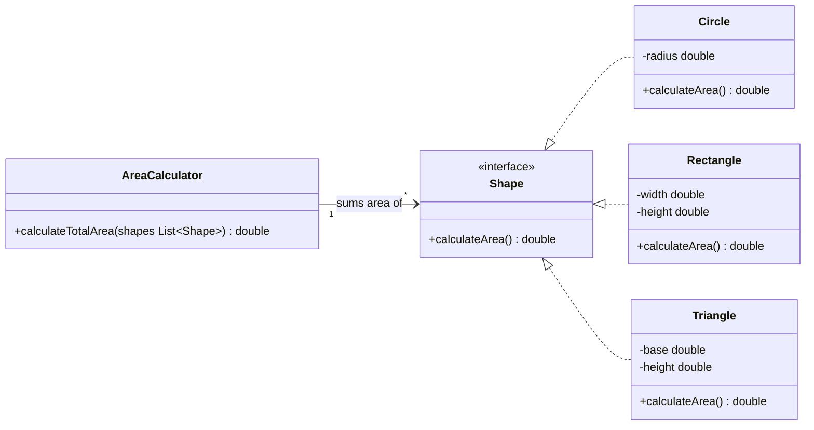
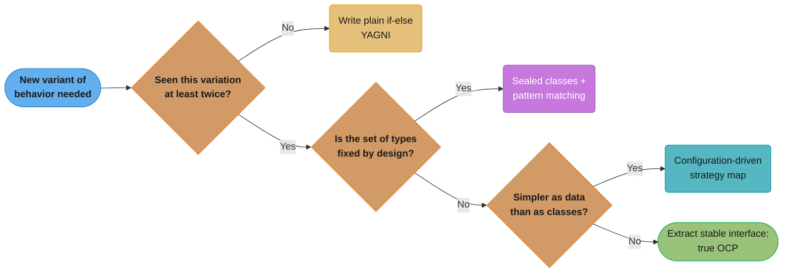

# Open/Closed Principle (OCP)

**Part of the SOLID series** | [Back to Overview](README.md)

---

## Definition and Intent

> "Software entities (classes, modules, functions) should be open for extension, but closed for modification."
> — Bertrand Meyer (1988), popularized by Robert C. Martin

**Open for extension:** You can add new behavior to the entity.
**Closed for modification:** Adding new behavior does not require changing the entity's existing, tested source code.

**Intent:** Protect stable, tested code from the ripple effects of new requirements. When you follow OCP, adding a new feature means writing new code, not editing old code. This dramatically reduces regression risk.

The mechanism: define stable abstractions and let new behavior be introduced as new implementations of those abstractions.

---

## Intuition

> **One-line analogy**: OCP is like a power strip — you add new devices by plugging into an existing outlet (extension), never by opening up the strip and rewiring it (modification).

**Mental model**: When new requirements arrive, if you must edit existing, tested code — every change risks breaking what already works. OCP solves this by designing classes around stable abstractions. New behaviors are added as new implementations of those abstractions. The existing code is "closed" (don't touch it); the abstraction point is "open" (add new implementations freely). Strategy, Decorator, and Factory Method patterns are OCP in action.

**Why it matters**: Every time you edit existing code, you risk regressions. OCP-compliant design minimizes edits to working code, making systems safer to extend. Test coverage becomes more tractable — new code gets new tests; existing code's tests still pass unchanged.

**Key insight**: OCP is achieved through abstraction, not through never-changing code. The key is to identify the right abstraction points early — where do you expect variation? Abstract those; keep the stable core closed. Abstracting too early (YAGNI violation) is as bad as not abstracting at all.

---

## Historical Context

Meyer's original OCP (1988) referred to **implementation inheritance** as the extension mechanism — subclass to extend. Martin's modern OCP (1996+) uses **polymorphism and interfaces** as the primary mechanism. Modern Java OCP almost always means: depend on interfaces, add new implementations, never touch the interface or its callers.

---

## Problem It Solves

### Violation Example

```java
// BAD: Every new shape requires modifying AreaCalculator
// This class will never be "done" — it grows forever
public class AreaCalculator {

    public double calculateArea(Object shape) {
        if (shape instanceof Circle) {
            Circle c = (Circle) shape;
            return Math.PI * c.getRadius() * c.getRadius();
        } else if (shape instanceof Rectangle) {
            Rectangle r = (Rectangle) shape;
            return r.getWidth() * r.getHeight();
        } else if (shape instanceof Triangle) {
            // Added when Triangle was introduced — touched existing class
            Triangle t = (Triangle) shape;
            return 0.5 * t.getBase() * t.getHeight();
        }
        // Tomorrow: add Hexagon, Pentagon, etc. — always modify this class
        throw new IllegalArgumentException("Unknown shape: " + shape.getClass());
    }
}

class Circle {
    private double radius;
    public Circle(double radius) { this.radius = radius; }
    public double getRadius() { return radius; }
}

class Rectangle {
    private double width, height;
    public Rectangle(double w, double h) { this.width = w; this.height = h; }
    public double getWidth() { return width; }
    public double getHeight() { return height; }
}
```

**What goes wrong:**
- Every new shape requires opening `AreaCalculator` and modifying it
- The risk of breaking `Circle` area calculation when adding `Triangle` is real
- `instanceof` chains are a well-known OCP violation smell
- The class accumulates dead code for deprecated shapes — it never shrinks
- Unit tests for existing shapes must be re-run every time a new shape is added

### Solution: Refactored Code (OCP Compliant)

```java
// GOOD: AreaCalculator is closed for modification, open for extension via the Shape interface

// The stable abstraction
public interface Shape {
    double calculateArea();
}

// Each new shape is a new class — AreaCalculator is never touched
public class Circle implements Shape {
    private double radius;
    public Circle(double radius) { this.radius = radius; }

    @Override
    public double calculateArea() {
        return Math.PI * radius * radius;
    }
}

public class Rectangle implements Shape {
    private double width, height;
    public Rectangle(double width, double height) {
        this.width = width;
        this.height = height;
    }

    @Override
    public double calculateArea() {
        return width * height;
    }
}

// NEW: Adding a triangle requires zero changes to AreaCalculator or existing shapes
public class Triangle implements Shape {
    private double base, height;
    public Triangle(double base, double height) {
        this.base = base;
        this.height = height;
    }

    @Override
    public double calculateArea() {
        return 0.5 * base * height;
    }
}

// AreaCalculator never needs to change — ever
public class AreaCalculator {
    public double calculateTotalArea(List<Shape> shapes) {
        return shapes.stream()
                     .mapToDouble(Shape::calculateArea)
                     .sum();
    }
}
```

Now adding `Hexagon`, `Pentagon`, or any future shape means writing a new class only. `AreaCalculator` and the existing shapes are never touched. Their tests never break.

The class diagram below makes the OCP mechanism visible: `Shape` is the stable abstraction — the single "open" extension point — while `Circle`, `Rectangle`, and `Triangle` are interchangeable, unboundedly-growable implementations. `AreaCalculator` depends only on `Shape`, never on any concrete shape, so it is "closed" — it never needs to change again.



---

## A More Enterprise-Level Example: Payment Processing

```java
// VIOLATION: Payment processor with type-switching
public class PaymentProcessor {
    public void processPayment(String paymentType, double amount) {
        if (paymentType.equals("CREDIT_CARD")) {
            // Stripe API logic
            System.out.println("Processing credit card via Stripe: $" + amount);
        } else if (paymentType.equals("PAYPAL")) {
            // PayPal API logic
            System.out.println("Processing PayPal payment: $" + amount);
        } else if (paymentType.equals("CRYPTO")) {
            // Newly added — required modifying this class
            System.out.println("Processing crypto payment: $" + amount);
        }
    }
}

// OCP-COMPLIANT SOLUTION:
public interface PaymentGateway {
    void processPayment(double amount);
}

public class StripeGateway implements PaymentGateway {
    @Override
    public void processPayment(double amount) {
        System.out.println("Processing credit card via Stripe: $" + amount);
    }
}

public class PayPalGateway implements PaymentGateway {
    @Override
    public void processPayment(double amount) {
        System.out.println("Processing PayPal payment: $" + amount);
    }
}

// Adding crypto: new class, zero modifications to PaymentProcessor
public class CryptoGateway implements PaymentGateway {
    @Override
    public void processPayment(double amount) {
        System.out.println("Processing crypto payment: $" + amount);
    }
}

// Closed for modification — accepts any PaymentGateway
public class PaymentProcessor {
    private final PaymentGateway gateway;

    public PaymentProcessor(PaymentGateway gateway) {
        this.gateway = gateway;
    }

    public void processPayment(double amount) {
        gateway.processPayment(amount);
    }
}
```

---

## Real-World Analogies

**Electrical outlets:** An outlet is closed for modification (you cannot rewire it every time a new device is invented), but it is open for extension — any device with the correct plug can use it. The plug interface is the abstraction.

**Browser plugins:** Firefox's extension system allows you to add AdBlock, password managers, developer tools — without modifying Firefox's source code. The extension API is the stable abstraction.

**Tax deduction rules:** A tax calculator defines a `Deduction` interface. New tax laws are new implementations of `Deduction` — the calculator itself never changes.

---

## Common Violations in Enterprise Code

1. **Long if-else / switch chains on type or enum:**
   ```java
   switch (notification.getType()) {
       case EMAIL: sendEmail(...); break;
       case SMS: sendSms(...); break;
       case PUSH: sendPush(...); break;
       // Adding SLACK requires modifying this class
   }
   ```

2. **Report generators with format branching:**
   ```java
   public byte[] generateReport(String format) {
       if (format.equals("PDF")) { ... }
       else if (format.equals("CSV")) { ... }
       else if (format.equals("EXCEL")) { ... }
   }
   ```

3. **Discount calculators with customer-type branching:**
   ```java
   public double applyDiscount(Customer customer, double price) {
       if (customer.getType() == PREMIUM) return price * 0.8;
       if (customer.getType() == VIP) return price * 0.6;
       return price;
   }
   ```

---

## Design Patterns That Embody OCP

| Pattern | How It Achieves OCP |
|---|---|
| **Strategy** | New behavior via new strategy class; context never changes |
| **Template Method** | Base class closed; subclasses extend via overrides |
| **Decorator** | Wrap existing object with new behavior; original is untouched |
| **Factory / Abstract Factory** | New products added without changing factory client |
| **Observer** | New observers added without changing subject |
| **Chain of Responsibility** | New handlers added without changing the chain setup |

---

## Code Smell Indicators

- `instanceof` checks in non-trivial logic paths
- `switch` on `getType()`, `getClass()`, or enum values in business logic
- Comments like `// Added for feature X` appearing repeatedly in the same method
- A class that has been modified in every sprint for the past year
- Test files that grow unboundedly as new features are added

---

## Pros and Cons

### Pros
- Adding features is lower risk — existing tests still pass without any changes
- Encourages good abstractions, which also help with testability and DIP
- Parallel development: two engineers can add two new implementations simultaneously
- Promotes the Strategy, Decorator, and Template Method patterns — all battle-tested

### Cons
- Requires up-front design work to identify the right abstraction
- Over-applying OCP leads to premature abstraction — designing extension points for requirements that never come
- The first time you see a new kind of variation, it is often not clear what the right abstraction is
- Can increase class count significantly

---

## Tradeoffs: When Is It OK to Bend the Rule?

- **YAGNI (You Aren't Gonna Need It):** Do not create an abstraction for extension until you have seen the requirement twice. Build the if-else first; refactor to OCP when the second variant arrives. This is pragmatic and avoids over-engineering.
- **Simple scripts and utilities:** A CLI tool that formats three output types does not need a `Formatter` interface hierarchy.
- **Configuration-driven variation:** Sometimes a data-driven approach (strategy map or configuration) is cleaner than class hierarchies.
- **Sealed class hierarchies (Java 17+):** When you intentionally want an exhaustive set of types (sum types), sealed classes + pattern matching are more appropriate than open extension hierarchies.

The four bullets above collapse into one decision path: check for recurrence (YAGNI) first, then whether the type set is meant to be closed (sealed classes), then whether the variation is simpler as data than as code (configuration-driven) — only what's left over earns a full OCP abstraction.



---

## Common Misconceptions

1. **"OCP means never modify any code."** — False. You can and should modify code when fixing bugs or making structural improvements. OCP specifically means: adding new behavior should not require modifying existing, correct code.

2. **"OCP requires inheritance."** — False in modern practice. Composition and interface implementation are the preferred mechanisms. Inheritance can achieve OCP but brings LSP risks.

3. **"OCP means every class needs an interface."** — False. Only classes at the boundary where variation is expected need abstraction. Over-interfacing is real overhead.

---

## Relationship to Other Principles

| Principle | Relationship |
|---|---|
| SRP | SRP produces small, focused classes that are easier to close for modification |
| LSP | OCP relies on polymorphism; LSP ensures that polymorphism is safe and correct |
| ISP | Narrow interfaces (ISP) are easier to implement correctly, making OCP extensions cheaper |
| DIP | DIP is OCP at the architectural level — both invert the dependency direction toward abstractions |

---

## Cross-Perspective: HLD Connections

**HLD View — Where OCP Appears in Distributed Systems**

- **Plugin architectures** — API gateways (Kong, AWS API Gateway) support plugin/extension models: new capabilities (rate limiting, auth, transformations) are added as plugins without modifying the gateway core. Adding a feature means deploying a plugin, not patching the gateway.
- **Feature flags** — Feature flags allow behavior extension without code modification: new behavior is written and deployed behind a flag, enabled incrementally. The existing code path is never touched — OCP in production deployment.
- **Event-driven extensibility** — Publishing domain events (OrderPlaced) allows new consumers to react (analytics, recommendations, email) without modifying the order service. The order service is closed for modification; the system is open for extension via new consumers.
- **Schema evolution** — Adding new optional fields to Protobuf/Avro schemas extends the contract without breaking existing consumers — OCP applied to data contracts.

---

## Interview Questions and Answers

**Q: What does "open for extension, closed for modification" mean?**

A: It means you can add new behavior to a system by writing new code — new classes, new implementations — without changing the existing code that already works and is already tested. The stability of the existing code is protected while the system remains flexible.

---

**Q: How do you achieve OCP in Java?**

A: Through interfaces and polymorphism. Define a stable interface representing the concept that varies (e.g., `Shape`, `PaymentGateway`, `NotificationSender`). When a new variant is needed, write a new implementation of that interface. The client code, which depends only on the interface, never needs to change.

---

**Q: Isn't it impossible to be completely closed for modification?**

A: Yes — and that's acknowledged. The goal is strategic closure: identify the axes along which your system is most likely to change, and close for modification along those axes. You cannot close for all possible changes, so you prioritize the most likely ones.

---

**Q: What is the relationship between OCP and the Strategy pattern?**

A: Strategy is one of the primary design patterns that embodies OCP. The context class (e.g., `PaymentProcessor`) is closed — it never changes. The strategy (e.g., `PaymentGateway`) is the extension point. Adding a new payment method means writing a new strategy class, not touching the processor.

---

**Q: Can you give an example of OCP violation and how you refactored it?**

A: [Tell a concrete story about a notification system or report generator with a type switch. Describe adding a new notification type by writing a new class versus by opening the switch statement. Emphasize the regression risk of the latter and the zero-risk nature of the former.]

---

**Interview Tip:** Many interviewers ask about OCP and expect "use interfaces." Go deeper — explain why the abstraction must be at the right level, mention YAGNI as the counterforce, and name specific design patterns (Strategy, Decorator). Candidates who mention tradeoffs are seen as senior-level thinkers.
