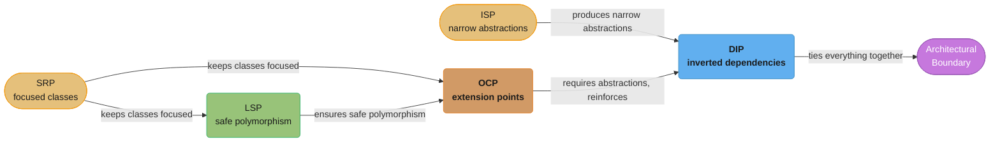

# SOLID Principles - Master Overview

SOLID is an acronym for five object-oriented design principles introduced by Robert C. Martin (Uncle Bob). These principles form the foundation of maintainable, scalable, and testable software design. They are not rigid rules but guidelines that help you reason about design decisions.

---

## Intuition

> **One-line analogy**: SOLID principles are the load-bearing walls of software design — violate them and your codebase's structure slowly collapses under the weight of change.

**Mental model**: Each SOLID principle addresses a specific failure mode. SRP: a class that does too much breaks for too many reasons. OCP: modifying working code to add features introduces regressions. LSP: a subclass that breaks parent contracts silently corrupts call sites. ISP: a fat interface forces clients to depend on methods they never use. DIP: high-level policy coupled to low-level detail makes the system rigid. Together they push toward small, focused, interchangeable pieces that evolve independently.

**Why it matters**: SOLID violations are the root cause of most codebases that become hard to change. They make the difference between a codebase that welcomes new features and one that makes every change feel dangerous.

**Key insight**: SOLID principles are most useful as diagnostic tools during code review. When a change is unexpectedly hard, ask which principle is being violated — the answer usually points directly at the refactoring needed.

---

## The Five Principles at a Glance

| Principle | Full Name | One-Line Summary | Key Question |
|---|---|---|---|
| **S** | Single Responsibility Principle | A class should have only one reason to change | "What is this class responsible for?" |
| **O** | Open/Closed Principle | Open for extension, closed for modification | "Can I add behavior without touching existing code?" |
| **L** | Liskov Substitution Principle | Subtypes must be substitutable for their base types | "Can I swap this subclass in anywhere the parent is used?" |
| **I** | Interface Segregation Principle | No client should depend on methods it does not use | "Does this interface force anyone to implement irrelevant methods?" |
| **D** | Dependency Inversion Principle | Depend on abstractions, not concretions | "Does high-level policy depend on low-level detail?" |

---

## Why SOLID Matters

Without SOLID principles, codebases tend toward:
- **Rigidity**: A single change requires modifications in many places
- **Fragility**: Changing one thing breaks seemingly unrelated parts
- **Immobility**: Code cannot be reused because it is tightly coupled
- **Viscosity**: The right design is harder to implement than the wrong one
- **Needless complexity**: Abstractions added speculatively with no current benefit

SOLID principles directly counteract each of these symptoms.

---

## The Principles in Detail

### S - Single Responsibility Principle (SRP)

**Definition:** A class should have one, and only one, reason to change.

**Core idea:** A "reason to change" maps to a stakeholder or actor whose requirements drive that change. If a class serves two different actors, changes for one actor risk breaking behavior for the other.

**Files:** [SingleResponsibility.md](SingleResponsibility.md)

---

### O - Open/Closed Principle (OCP)

**Definition:** Software entities should be open for extension but closed for modification.

**Core idea:** You should be able to add new behavior to a system without altering existing, tested code. Typically achieved through polymorphism, composition, and well-defined abstractions.

**Files:** [OpenClosed.md](OpenClosed.md)

---

### L - Liskov Substitution Principle (LSP)

**Definition:** Objects of a superclass should be replaceable with objects of its subclasses without altering the correctness of the program.

**Core idea:** Inheritance should model "is-a" in the behavioral sense, not just the structural sense. A subclass must honor the contract of its parent — including preconditions, postconditions, and invariants.

**Files:** [LiskovSubstitution.md](LiskovSubstitution.md)

---

### I - Interface Segregation Principle (ISP)

**Definition:** No client should be forced to depend on methods it does not use.

**Core idea:** Fat interfaces create tight coupling between unrelated clients. Splitting interfaces into role-specific contracts keeps clients decoupled and makes implementations focused.

**Files:** [InterfaceSegregation.md](InterfaceSegregation.md)

---

### D - Dependency Inversion Principle (DIP)

**Definition:** High-level modules should not depend on low-level modules. Both should depend on abstractions. Abstractions should not depend on details; details should depend on abstractions.

**Core idea:** The direction of dependency should be inverted from what intuition suggests. Business logic should not depend on database drivers or HTTP libraries — it should depend on interfaces, and the infrastructure should depend on those same interfaces.

**Files:** [DependencyInversion.md](DependencyInversion.md)

---

## How the Principles Relate to Each Other

The five principles form a dependency chain rather than five isolated rules: SRP and ISP lay the foundation, LSP keeps polymorphism safe for OCP to build on, and OCP's abstractions feed into DIP — the architectural boundary that ties the whole chain together.



- **SRP + ISP** together prevent God objects and bloated interfaces
- **OCP + LSP** together make inheritance and polymorphism safe and extensible
- **DIP** is the architectural expression of OCP — it injects the right abstraction at the right boundary

---

## Common Anti-Patterns Each Principle Addresses

| Anti-Pattern | Violated Principle(s) |
|---|---|
| God Class / God Object | SRP |
| Long switch/if-else chains on type | OCP |
| Subclass that throws `UnsupportedOperationException` | LSP |
| Fat/God Interface | ISP |
| `new ConcreteService()` inside business logic | DIP |
| Test setup requiring real databases | DIP |
| Changing a utility class breaks unrelated features | SRP, OCP |

---

## Learning Path

Recommended order for understanding and internalizing SOLID:

1. **Start with SRP** — It is the most intuitive and sets the mindset for focused responsibilities.
2. **Move to ISP** — ISP is essentially SRP applied to interfaces; having read SRP, ISP clicks immediately.
3. **Study DIP** — Once you understand narrow interfaces (ISP), DIP shows you how to wire them.
4. **Then OCP** — OCP is the payoff of DIP. When dependencies are inverted, extension without modification becomes natural.
5. **Finish with LSP** — LSP is the most subtle. It requires understanding inheritance contracts, Liskov's formal definition, and behavioral subtyping.

---

## Code Examples

A single Java file demonstrating all five principles with before/after examples:

**File:** [SolidExamples.java](./SolidExamples.java)

---

## Quick Reference: Code Smell Checklist

Ask these questions during code review:

- [ ] Does this class have more than one reason to change? (SRP)
- [ ] Would adding a new type require me to edit this class? (OCP)
- [ ] Does any subclass throw `UnsupportedOperationException` or weaken a contract? (LSP)
- [ ] Does any class implement an interface method it does not need? (ISP)
- [ ] Does any high-level class instantiate a low-level class with `new`? (DIP)
- [ ] Are tests coupled to concrete implementations instead of interfaces? (DIP)

---

## 12. Interview Q&As

Questions are ordered by interview frequency: traps and gotchas first, then internal mechanics, then edge cases.

**Q: Explain SRP and give a class that violates it. How do you fix it?**
SRP: a class should have only one reason to change — meaning it serves one stakeholder. A `UserService` class that both persists users to a database AND sends a welcome email violates SRP: a change in the email template forces a recompile/redeploy of the persistence code, and a database schema change risks breaking the email path. Fix: extract `UserRepository` for persistence and `EmailService` for notification. The `UserService` orchestrates them without owning either concern.

**Q: What is a "reason to change" in SRP? Is it "one method" or "one class"?**
A "reason to change" maps to a stakeholder or actor whose requirements drive that change — not to a method count. A class with 20 methods that all serve the same business domain (e.g., all manipulate `Order` state for the order management team) satisfies SRP. A class with 2 methods that serve two different stakeholders (finance and logistics) violates SRP. Uncle Bob's test: "For whom does this class change?" If the answer is two different groups of people, split the class.

**Q: How does OCP work without modifying existing code? Show a concrete Java example.**
OCP: open for extension, closed for modification. Payment processing: instead of `if (type == CREDIT_CARD) { ... } else if (type == PAYPAL) { ... }`, define `interface PaymentProcessor { void process(Payment p); }`. Add `CreditCardProcessor` and `PayPalProcessor` as implementations. Adding Bitcoin support means adding `BitcoinProcessor` — the existing `PaymentService` is never touched. The abstraction (interface) is the extension point; the if-else chain is the closed-for-extension design.

**Q: Square extends Rectangle: why does this violate LSP? Show the broken code.**
LSP: subtypes must be substitutable for their base type without altering correctness. Rectangle has `setWidth(int)` and `setHeight(int)` as independent operations. Square must keep width == height, so overriding `setWidth` to also set height changes the postcondition. Broken:
```java
Rectangle r = new Square();
r.setWidth(5);
r.setHeight(4);
assert r.area() == 20; // FAILS: Square sets both to 4, area = 16
```
Fix: don't model Square as a subtype of Rectangle. Model them as separate implementations of a `Shape` interface, or use a factory that returns the right shape for the dimensions.

**Q: What is ISP and how does it prevent the "fat interface" problem?**
ISP: no client should depend on methods it does not use. A `Animal` interface with `eat()`, `fly()`, `swim()`, and `run()` forces `Dog` to implement `fly()` by throwing `UnsupportedOperationException`. Fix: split into `Flyable`, `Swimmable`, `Runnable` interfaces. `Dog` implements `Swimmable` and `Runnable`. `Bird` implements `Flyable`. Each class depends only on the methods it actually uses. Benefit: adding `Drone implements Flyable` never forces a change to `Dog`, `Fish`, or any unrelated class.

**Q: How does DIP differ from Dependency Injection? Which is the principle and which is the pattern?**
DIP is the principle: high-level modules should not depend on low-level modules; both should depend on abstractions. Dependency Injection is a pattern that implements DIP: instead of the class creating its own dependency (`new JpaUserRepository()`), the dependency is passed in (injected) from outside. Spring's `@Autowired` is a DI mechanism. You can follow DIP without a DI framework (pass dependencies via constructor); you can use a DI framework without following DIP (inject concrete classes instead of interfaces). DIP is the goal; DI is the most common way to achieve it.

**Q: Give a Spring example of DIP in action.**
`UserService` depends on `UserRepository` (an interface from Spring Data), not on `JpaUserRepository` (the concrete JPA implementation). Spring injects the concrete impl at runtime. In tests, inject `InMemoryUserRepository` instead — no changes to `UserService`. The high-level policy (`UserService`) is isolated from the low-level detail (JPA, database). Adding a MongoDB-backed `MongoUserRepository` requires zero changes to `UserService`. This is DIP enforced by the Spring container.

**Q: Which SOLID principle is violated when you add `if (type == CREDIT_CARD)` to handle a new payment type?**
OCP. The existing `PaymentService.process()` method must be modified every time a new payment type is added. After 10 payment types, the method has 10 branches, each requiring a regression test, and all sharing the risk of a bug in one branch breaking the others. The correct design: `PaymentProcessor` interface + one class per payment type. Adding a new type adds a new class; `PaymentService` is never touched.

**Q: Which SOLID principle is most commonly violated in legacy codebases, and why?**
SRP, because it's the most gradual violation. A class starts with one responsibility. A developer adds "just a small change" that introduces a second responsibility. Another adds a third. After 3 years, the class has 50 methods serving 6 different stakeholders. No single change felt wrong at the time. Detection: a class with more than one reason to appear in a sprint's JIRA tickets is likely violating SRP.

**Q: Can SOLID be over-applied? Give a concrete example of too much SOLID.**
Yes. Extracting every single method into its own class in the name of SRP produces a "class-per-function" antipattern: 200 single-method classes that are harder to navigate than 10 well-organized classes with 20 methods each. Similarly, creating an interface for every concrete class even when there's only one implementation (and always will be one) adds indirection without value. The test: "Does this abstraction make the code easier to change or test?" If no, it's unnecessary complexity. SOLID is a diagnostic tool, not a scoring system.

**Q: How do the five SOLID principles relate to testability?**
SRP: small, focused classes are easy to test in isolation. OCP: extension via interface means you can inject test doubles without changing production code. LSP: if subtypes are substitutable, tests written against the base type work for all subtypes. ISP: narrow interfaces make test setup minimal — mock only the methods the class actually uses. DIP: inject dependencies via constructor, and tests can pass fakes/mocks instead of real infrastructure. Together: SOLID principles are the single biggest enabler of unit testing in object-oriented code.

**Q: What is the most subtle SOLID violation to detect in code review?**
LSP violations are the hardest to detect because they don't show up as a structural error — the code compiles and often passes unit tests. A subclass that weakens a postcondition (returns a narrower set of values than the parent promises), strengthens a precondition (requires more than the parent accepts), or throws an exception the parent never throws — all violate LSP silently. They cause failures at call sites that use polymorphism, which are often far from the class definition. Clue: a test that passes for the parent type but fails when you substitute the subclass.

---

## Recommended Further Reading

- *Clean Code* — Robert C. Martin
- *Agile Software Development: Principles, Patterns, and Practices* — Robert C. Martin
- *Design Patterns: Elements of Reusable Object-Oriented Software* — Gang of Four
- *Growing Object-Oriented Software Guided by Tests* — Freeman & Pryce

---

## Interview Preparation Summary

SOLID questions appear in virtually every senior/staff-level Java/backend interview. Key tactics:

1. **Give a definition**, then immediately back it with a concrete code example
2. **Mention the symptom** the principle cures (not just the principle itself)
3. **State a real-world analogy** — interviewers remember candidates who can explain abstractions in plain language
4. **Discuss tradeoffs** — knowing when NOT to apply a principle shows senior-level judgment
5. **Connect to design patterns** — Strategy (OCP), Factory/DI (DIP), Adapter (LSP), Role interfaces (ISP)
