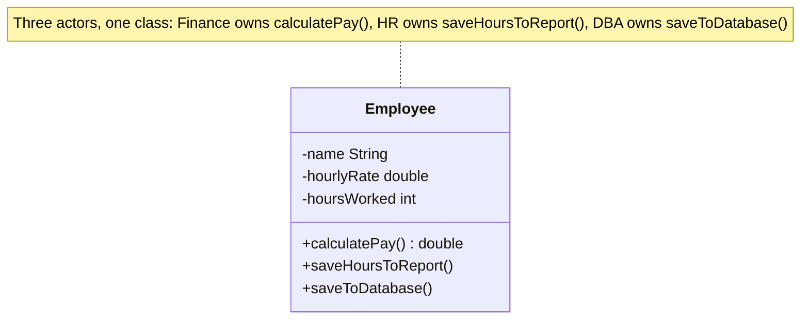
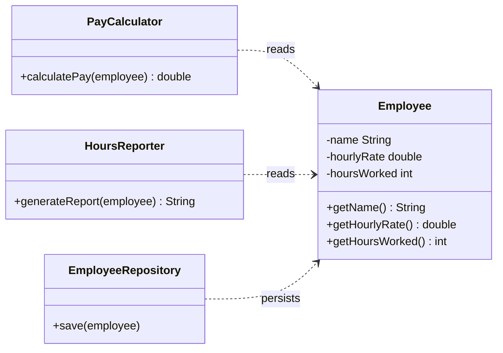

# Single Responsibility Principle (SRP)

**Part of the SOLID series** | [Back to Overview](README.md)

---

## Definition and Intent

> "A class should have one, and only one, reason to change."
> — Robert C. Martin

The more precise formulation from Martin's later writing:

> "A module should be responsible to one, and only one, actor."

An **actor** is a group of stakeholders whose requirements drive changes to the module. "One reason to change" is equivalent to "one actor." If your `UserService` is changed both when the HR department asks for a new report format AND when the authentication team changes the login flow, it has two reasons to change — it violates SRP.

**Intent:** Isolate the code that can change for different reasons so that a change for one actor cannot accidentally break code used by another actor.

---

## Intuition

> **One-line analogy**: SRP is like a good job description — a barista makes coffee, not manages payroll. When roles are mixed, changes to one responsibility break the other.

**Mental model**: Every class has a "reason to change" — some stakeholder whose requirements drive modifications. SRP says each class should serve exactly one stakeholder group. If your `UserService` changes when HR updates reporting requirements AND when security updates authentication — it has two stakeholders, two reasons to change, SRP is violated.

**Why it matters**: Classes that violate SRP become the "god objects" of your codebase — pulled in many directions, impossible to test independently, and constantly surprising you when a change in one area breaks something in another. SRP is the root of maintainability.

**Key insight**: "One responsibility" doesn't mean "one method" — it means one cohesive concern for one stakeholder. A class can have 20 methods if they all serve the same purpose. The test: "If this class changes, who needs to know?"

---

## What SRP Is NOT

A common misconception: SRP does not mean "a class should do only one thing" in a trivial sense. A class can have many methods as long as they all serve the same actor. SRP is about **cohesion toward a single purpose from a single stakeholder's perspective**, not about minimizing method count.

Another misconception: SRP does not mean one public method per class. Over-splitting leads to class explosion — an equally real problem.

---

## Problem It Solves

### Violation Example

```java
// BAD: This class has three distinct reasons to change:
// 1. Finance team changes the salary calculation rules
// 2. HR team changes how hours are saved/reported
// 3. DBA team changes the DB schema or persistence strategy
public class Employee {
    private String name;
    private double hourlyRate;
    private int hoursWorked;

    // REASON TO CHANGE #1: Finance changes pay calculation rules
    public double calculatePay() {
        // Overtime logic dictated by Finance department
        if (hoursWorked > 40) {
            return (40 * hourlyRate) + ((hoursWorked - 40) * hourlyRate * 1.5);
        }
        return hoursWorked * hourlyRate;
    }

    // REASON TO CHANGE #2: HR changes how work hours are recorded/reported
    public void saveHoursToReport() {
        // HR wants this formatted in a specific way
        System.out.println(name + ": " + hoursWorked + " hours");
    }

    // REASON TO CHANGE #3: DBA changes schema or persistence layer
    public void saveToDatabase() {
        // Direct DB logic embedded in the domain model
        System.out.println("INSERT INTO employees VALUES ('" + name + "', " + hoursWorked + ")");
    }
}
```

**What goes wrong:**
- Finance asks to change overtime calculation — you touch `calculatePay()`, and risk breaking `saveToDatabase()` in the same commit
- DBA changes the schema — you change `saveToDatabase()`, and might accidentally conflict with an in-flight Finance change
- Unit testing `calculatePay()` requires the class to be instantiable with all DB concerns too



**Class diagram — the violation.** One `Employee` class carries all three method groups, so a change requested by Finance, HR, or DBA touches the same class as the other two — exactly the "more than one reason to change" SRP forbids.

### Solution: Refactored Code

```java
// GOOD: Each class has exactly one actor driving its changes

// Actor: Finance department
public class PayCalculator {
    public double calculatePay(Employee employee) {
        if (employee.getHoursWorked() > 40) {
            return (40 * employee.getHourlyRate())
                + ((employee.getHoursWorked() - 40) * employee.getHourlyRate() * 1.5);
        }
        return employee.getHoursWorked() * employee.getHourlyRate();
    }
}

// Actor: HR department
public class HoursReporter {
    public String generateReport(Employee employee) {
        return employee.getName() + ": " + employee.getHoursWorked() + " hours";
    }
}

// Actor: DBA / Infrastructure team
public class EmployeeRepository {
    public void save(Employee employee) {
        // persistence logic lives here, isolated from domain rules
        System.out.println("INSERT INTO employees VALUES ('"
            + employee.getName() + "', " + employee.getHoursWorked() + ")");
    }
}

// Pure domain model — no reason to change except when the data structure of an employee changes
public class Employee {
    private String name;
    private double hourlyRate;
    private int hoursWorked;

    public Employee(String name, double hourlyRate, int hoursWorked) {
        this.name = name;
        this.hourlyRate = hourlyRate;
        this.hoursWorked = hoursWorked;
    }

    public String getName() { return name; }
    public double getHourlyRate() { return hourlyRate; }
    public int getHoursWorked() { return hoursWorked; }
}
```

Now each change is isolated. Finance changing pay rules only touches `PayCalculator`. Schema changes only touch `EmployeeRepository`. You can unit test `PayCalculator` in total isolation.



**Class diagram — the SRP-compliant fix.** `Employee` is now a pure data holder with no reason to change except its own shape; `PayCalculator` (Finance), `HoursReporter` (HR), and `EmployeeRepository` (DBA) each depend on `Employee` transiently but own exactly one actor's logic — each class now has exactly one reason to change.

---

## Real-World Analogies

**Restaurant analogy:** A kitchen has a head chef, a pastry chef, and a sous chef. Each is responsible for a distinct domain. If the pastry chef changes the dessert menu, it does not affect the sous chef's sauces. Contrast this with one person doing all cooking, cleaning, and accounting — any change in accounting could interrupt the cooking.

**Newspaper analogy:** An article has a single author. If multiple reporters co-author an article on different topics, editing one reporter's section risks accidentally changing the other's content. Single authorship = single responsibility.

**Government department analogy:** The Department of Finance and the Department of Health exist separately. Changes to tax law do not require the Health minister to sign off. SRP is organizational structure applied to code.

---

## Common Violations in Enterprise Code

1. **Service classes that do everything:**
   ```java
   // Violation: UserService handles auth, profile, notifications, and DB
   public class UserService {
       public void login(String username, String password) { ... }
       public void updateProfile(UserDTO dto) { ... }
       public void sendWelcomeEmail(User user) { ... }
       public void saveUser(User user) { ... }
       public List<User> getAllUsersForReport() { ... }
   }
   ```

2. **Domain objects with persistence logic** (Active Record pattern taken too far):
   ```java
   public class Order {
       public void save() { /* SQL here */ }
       public void calculateTotal() { /* business rule */ }
       public void sendConfirmationEmail() { /* email concern */ }
   }
   ```

3. **Utility/Helper classes becoming garbage collectors:**
   ```java
   public class Utils {
       public static String formatDate(...) { ... }
       public static void sendEmail(...) { ... }
       public static double calculateTax(...) { ... }
       public static boolean isValidCreditCard(...) { ... }
   }
   ```

4. **Controllers that contain business logic:**
   ```java
   @PostMapping("/checkout")
   public ResponseEntity checkout(@RequestBody OrderRequest request) {
       // validates, calculates, persists, and sends email — all here
   }
   ```

---

## How to Identify SRP Violations

Ask yourself:
- "If I describe what this class does, do I need the word 'and'?" — if yes, it probably has more than one responsibility
- "Who would ask me to change this class?" — if multiple departments/teams come to mind, SRP is violated
- "Can I unit test one responsibility without pulling in the other?" — if not, they are entangled

---

## How to Refactor Toward SRP

1. **List all the reasons the class might change** — write them as comments at the top
2. **Group methods by the reason they would change** — each group is a candidate for its own class
3. **Extract each group** into a focused class with a clear name
4. **Wire them together** in a coordinator/facade if needed, keeping the coordinator thin
5. **Write focused unit tests** for each extracted class

---

## Pros and Cons of Strict Adherence

### Pros
- Classes are smaller, easier to understand at a glance
- Changes are isolated, reducing the blast radius of a modification
- Testing is simpler — each class has a narrow, mockable contract
- Parallel development is easier — different actors' classes can be worked on independently
- Code reuse improves — a focused `PayCalculator` is reusable; a monolithic `Employee` is not

### Cons
- Class count increases — can feel like over-engineering on small projects
- Navigating a highly decomposed codebase requires more file jumps
- Premature SRP application to a domain you do not fully understand can result in wrong splits
- Indirection increases — a feature may now span 3-5 classes instead of 1

---

## Tradeoffs: When Is It OK to Bend the Rule?

- **Prototypes and scripts:** For throwaway code, SRP overhead is not worth it
- **Very small domain models:** If `Address` has `validate()` that is only ever called by one actor and is three lines, extracting it is needless ceremony
- **Functional decomposition alternatives:** In functional/procedural styles, pure functions naturally achieve SRP without class splitting
- **Active Record in simple CRUD apps:** Rails-style Active Record bundles persistence with the model. For apps where the persistence concern IS the only concern, this can be pragmatic

---

## Relationship to Other Principles

| Principle | Relationship |
|---|---|
| OCP | SRP makes classes small enough that OCP extension points are easy to find and safe to add |
| LSP | Classes with a single responsibility are easier to subclass safely — the contract is clear |
| ISP | SRP applied to interfaces produces ISP naturally: one interface per actor |
| DIP | Once responsibilities are separated, dependency injection is much simpler |

---

## Cross-Perspective: HLD Connections

**HLD View — Where SRP Appears in Distributed Systems**

- **Microservices** — SRP at system scale: each service owns exactly one bounded context (User Service, Order Service, Payment Service). A service that handles both user auth and order management is a God Service — the HLD equivalent of an SRP violation.
- **Single-purpose Lambda functions** — Serverless functions follow SRP by design: one function, one trigger, one responsibility. Bundling multiple concerns into one Lambda creates deployment and scaling coupling.
- **CQRS read/write separation** — Separating the write model (command handlers) from the read model (query projections) is SRP applied to service responsibilities: writes optimize for consistency; reads optimize for query performance.
- **Diagnostic signal**: if your service's deployment frequency is driven by unrelated teams' changes, it probably has too many responsibilities — an SRP violation at the service level.

---

## Interview Questions and Answers

**Q: What is the Single Responsibility Principle?**

A: A class should have only one reason to change, meaning it should be responsible to a single actor or stakeholder. If two different teams' requirements can cause a class to change, it has multiple responsibilities and should be split.

---

**Q: How is "one reason to change" different from "one method"?**

A: They are not the same. A class can have many methods — all of them contributing to one actor's concerns — and still comply with SRP. The question is not about method count but about whether multiple independent stakeholders drive changes to the class.

---

**Q: Can you give an example of an SRP violation you have encountered?**

A: A common real-world example is a `UserService` that handles authentication, profile management, email notifications, and database persistence. Changing the email template requires touching the same class as changing the login algorithm. Extracting `EmailNotificationService`, `UserRepository`, and `AuthService` gives each its own reason to change.

---

**Q: Does SRP lead to too many small classes?**

A: It can if applied mechanically. The goal is cohesion toward a single actor, not minimizing class size. A `PayCalculator` with five private helper methods all serving Finance is fine. Over-splitting into one-method classes is "class explosion" and is just as harmful. SRP is a judgment call guided by "who changes this, and for what reason?"

---

**Q: How does SRP relate to the concept of cohesion?**

A: SRP is the formal articulation of high cohesion. High cohesion means the methods and data of a class are strongly related and serve a unified purpose. SRP adds precision by anchoring that purpose to a real-world actor, making it actionable during design.

---

**Interview Tip:** When answering SRP questions, always anchor your answer in the "actor" framing (not just "does one thing"). Interviewers who know SRP well look for the actor/stakeholder framing — it signals you have read the source, not just a surface-level summary.
