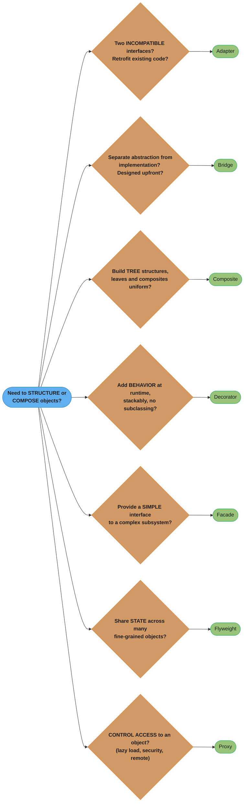
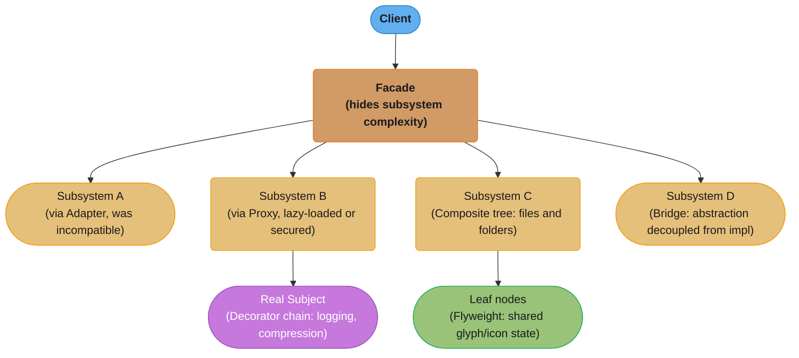

# Structural Patterns

Structural patterns deal with object composition — how classes and objects are combined to form larger, more capable structures. They answer the question: "How do these pieces fit together?"

---

## 1. Concept Overview

Seven patterns; each solves a different structural problem.

| Pattern | Directory | One-Line Purpose |
|---------|-----------|-----------------|
| Adapter | [adapter/](adapter/) | Convert an incompatible interface into the one the client expects |
| Bridge | [bridge/](bridge/) | Separate abstraction from implementation so both can vary independently |
| Composite | [composite/](composite/) | Treat individual objects and tree compositions uniformly via a shared interface |
| Decorator | [decorator/](decorator/) | Attach additional responsibilities to an object dynamically at runtime without subclassing |
| Facade | [facade/](facade/) | Provide a single simplified interface to a complex subsystem of many components |
| Flyweight | [flyweight/](flyweight/) | Share common intrinsic state across many fine-grained objects to reduce memory |
| Proxy | [proxy/](proxy/) | Control access to an object — add lazy loading, security checks, logging, or remote forwarding |

---

## 2. Intuition

Structural patterns are the architecture of a building — the load-bearing walls (Composite), the ventilation ducts that adapt incompatible systems (Adapter), the lobby that hides backstage complexity (Facade), and the security desk that controls access (Proxy).

**Mental model:** Structural patterns answer "how do these pieces fit together?" They differ in whether they retrofit an existing system (Adapter), design a new structure (Bridge), add behavior at runtime (Decorator), control access (Proxy), simplify (Facade), compose trees (Composite), or share state (Flyweight).

Key distinction: these patterns operate at the structural level — the relationships between classes and objects — not at the behavioral level (how objects communicate) or the creational level (how objects are made).

---

## 3. Patterns at a Glance — Full Table

| Pattern | Link | Intent | Classic Java Example | Key Pitfall |
|---------|------|--------|---------------------|-------------|
| Adapter | [adapter/](adapter/) | Convert one interface to another | `InputStreamReader` wrapping `InputStream`; `Arrays.asList()` | Class adapter requires multiple inheritance (use object adapter in Java) |
| Bridge | [bridge/](bridge/) | Separate abstraction from implementation so both can vary independently | JDBC: `java.sql.Driver` (abstraction) + vendor driver (implementation) | Often mistaken for Adapter — Bridge is designed upfront; Adapter retrofits |
| Composite | [composite/](composite/) | Treat individual objects and compositions uniformly via a tree | `java.awt.Container` + `Component`; `javax.faces.component.UIComponent` | Leaf-specific operations (e.g., `add()`) don't make sense on leaves; breaks type safety |
| Decorator | [decorator/](decorator/) | Attach additional responsibilities to an object dynamically | `BufferedReader(new InputStreamReader(socket.getInputStream()))` | Deep stacking makes debugging hard; ordering of decorators affects behavior |
| Facade | [facade/](facade/) | Provide a simplified interface to a complex subsystem | `javax.faces.context.FacesContext`; Spring's `JdbcTemplate` | Facade can become a God Class if it exposes too much; doesn't prevent direct subsystem access |
| Flyweight | [flyweight/](flyweight/) | Share common state across many fine-grained objects | `Integer.valueOf()` cache (-128 to 127); `String.intern()`; `Character` cache | Intrinsic/extrinsic state boundary must be clear; thread-safety of shared state required |
| Proxy | [proxy/](proxy/) | Control access to an object — add lazy loading, logging, security, remote access | Spring AOP (JDK dynamic proxy / CGLIB); `java.lang.reflect.Proxy` | Proxy and subject must share the same interface; CGLIB breaks for final classes |

---

## 4. Decision Flowchart

Each branch asks the deciding question for one of the seven patterns; the leaf it lands on names the pattern to reach for.

---

## 5. Commonly Confused Pairs

| Confusion | How to Resolve |
|-----------|---------------|
| Decorator vs Proxy | Same structure (wrapper), different intent. Decorator adds behavior the client requests — they know the wrapper is there. Proxy controls access transparently — the client doesn't know it's talking to a proxy. Decorator enhances; Proxy controls. |
| Adapter vs Bridge | Adapter retrofits: it makes an existing class work with an incompatible interface — the incompatibility existed before. Bridge is designed upfront: you separate abstraction from implementation proactively to prevent class-hierarchy explosion. |
| Adapter vs Facade | Adapter converts ONE interface to another (1:1). Facade wraps MANY interfaces behind ONE simplified interface (N:1). Facade adds no new behavior; it just delegates. |
| Facade vs Mediator | Both simplify communication, but Facade is one-directional (client to facade to subsystem). Mediator is bidirectional (colleagues communicate through the mediator). Facade subsystem objects don't know the facade exists; Mediator colleagues know the mediator. |
| Composite vs Decorator | Both use recursive composition. Composite's purpose is tree structure (part-whole hierarchy). Decorator's purpose is behavior extension. A Composite can contain many children; a Decorator wraps exactly one component. |

---

## 6. Spring and Java Library Mapping

| Pattern | Spring / Java Library Usage |
|---------|---------------------------|
| Proxy | Spring AOP: JDK `java.lang.reflect.Proxy` (interface-based), CGLIB (class-based). Spring `@Transactional`, `@Async`, `@Cacheable` all work via proxy. |
| Decorator | Java I/O: `InputStream` to `FilterInputStream` to `BufferedInputStream` to `GZIPInputStream` is a Decorator chain. |
| Adapter | `HandlerAdapter` in Spring MVC adapts different handler types (Controller, HttpRequestHandler, Servlet) to a single interface. |
| Facade | `JdbcTemplate` is a Facade over JDBC (handles connection, statement, exception translation). `SLF4J` is a Facade over logging implementations. |
| Flyweight | `Integer.valueOf(n)` for -128 to 127 returns cached instances. `String.intern()` returns the pool instance. `Charset.forName()` caches Charset instances. |
| Composite | Spring's `CompositePropertySource`, `CompositeCacheManager`, and `CompositeHealthIndicator` all use Composite to treat collections of components as a single component. |
| Bridge | JDBC is the canonical Java Bridge: `DriverManager` is the abstraction; vendor-specific `Driver` implementations are the implementations. |

---

## 7. Pattern Interaction Map

Structural patterns often appear together in real systems:

Example: A document rendering system uses Composite (document tree), Flyweight (character glyphs), Decorator (bold/italic wrappers), Facade (one `render()` entry point), and Proxy (lazy image loading). All seven patterns can coexist in a single system.

Common pairings seen in production codebases:

| Pairing | Where It Appears |
|---------|-----------------|
| Proxy + Decorator | Spring AOP wraps a bean (Proxy) that is already wrapped by a security Decorator |
| Composite + Flyweight | GUI component trees where leaf nodes (e.g., text characters) share glyph objects |
| Facade + Adapter | An API gateway (Facade) that integrates legacy services (Adapter) behind a REST surface |
| Bridge + Factory | A factory selects the concrete implementation at runtime, decoupled from the abstraction via Bridge |
| Decorator + Template Method | A template method defines the algorithm skeleton; Decorators add cross-cutting steps around it |

---

## 8. Cross-References

| Pattern | See Also |
|---------|---------|
| Proxy | `../../spring/spring_proxies/` — JDK dynamic proxy vs CGLIB mechanics in depth |
| Decorator | `../../java/java8_features/` — `Function.andThen()` / `Function.compose()` as functional Decorator |
| Adapter | `../../backend/microservices_fundamentals/` — anti-corruption layer as distributed Adapter |
| Facade | `../../hld/microservices/` — API Gateway is a system-level Facade |
| Flyweight | `../../java/collections_internals/` — `Integer` cache, `String` pool implementation details |
| Composite | `../../java/java_streams/` — Stream pipeline as composable Composite-like structure |

---

## 9. Learning Path

Recommended study order — each module builds context for the next:

1. **Adapter** — most practically needed; easy to understand; start here
2. **Facade** — extremely common; understand after Adapter; see how N:1 differs from 1:1
3. **Proxy** — builds on interface concept; critical for Spring understanding
4. **Decorator** — builds on Proxy concept; Java I/O makes it concrete
5. **Composite** — tree structures; needs understanding of recursive design
6. **Bridge** — most abstract; study after Decorator/Adapter to see the upfront-vs-retrofit contrast
7. **Flyweight** — most specialized; study when memory optimization is a concern

**Interview preparation priority** (time-boxed to one week):

| Day | Focus | Why |
|-----|-------|-----|
| Day 1 | Adapter + Facade | Highest frequency; practical daily use |
| Day 2 | Proxy (JDK + CGLIB) | Spring internals; `@Transactional` self-invocation trap |
| Day 3 | Decorator | Java I/O chain; compare to Proxy |
| Day 4 | Composite | Tree recursion; Composite vs Decorator |
| Day 5 | Bridge + Flyweight | Class explosion; memory optimization |
| Day 6–7 | Confused-pairs drill | Adapter/Bridge, Decorator/Proxy, Facade/Mediator |

---

## 10. Memory Footprint and Performance Characteristics

Most structural patterns have negligible runtime overhead — the cost of one extra method dispatch per call. Flyweight is the exception: it trades CPU (factory lookup on every object creation) for memory (reusing shared instances). Proxy with CGLIB has a slightly higher overhead than JDK dynamic proxy due to bytecode generation at startup (one-time cost, not per-call).

| Pattern | Startup Cost | Per-Call Cost | Memory Impact |
|---------|-------------|--------------|--------------|
| Adapter | None | One delegation | Tiny (one extra reference) |
| Bridge | None | One delegation | One extra reference per abstraction |
| Composite | None | Recursive traversal proportional to tree depth | Tree nodes + children lists |
| Decorator | None | One delegation per layer | One wrapper object per decorator |
| Facade | None | None (just delegation) | Negligible |
| Flyweight | Cache population | Factory map lookup (O(1) typical) | Large saving (shared intrinsic state) |
| Proxy (JDK) | Interface proxy generation | Reflection overhead (~5–10 ns) | One proxy object per bean |
| Proxy (CGLIB) | Bytecode generation | Near-zero (direct dispatch) | One subclass per proxied type |

---

## 11. Technologies and Tools

| Pattern | Java Standard Library | Spring Framework | Third-Party |
|---------|----------------------|-----------------|-------------|
| Adapter | `java.io.InputStreamReader`, `Arrays.asList()`, `Collections.unmodifiableList()` | `HandlerAdapter`, `MessageConverter` | MapStruct (DTO adapters) |
| Bridge | JDBC (`java.sql.Driver`), `java.util.logging.Handler` | N/A — architectural choice | N/A |
| Composite | `java.awt.Container`, `javax.faces.component.UIComponent` | `CompositePropertySource`, `CompositeCacheManager` | Apache Commons Configuration |
| Decorator | `java.io.*` streams, `java.util.Collections.synchronized*` | `BeanDefinitionDecorator` | Lombok `@Delegate` |
| Facade | `javax.faces.context.FacesContext` | `JdbcTemplate`, `RestTemplate`, `RedisTemplate` | SLF4J |
| Flyweight | `Integer.valueOf()`, `String.intern()`, `Boolean.valueOf()` | `SimpleTypeConverter` cache | Guava `Interners` |
| Proxy | `java.lang.reflect.Proxy`, RMI stubs | Spring AOP, `@Transactional`, `@Cacheable` | ByteBuddy, Javassist, Mockito |

---

## 12. Interview Q&As

Q&As are ordered by interview frequency: gotchas and traps first, then internal mechanics, then edge cases.

---

**Q: Decorator vs Proxy: they have exactly the same structure — what distinguishes them?**
Proxy controls access to the real object transparently: the client doesn't know or care it's talking to a proxy; the proxy decides whether and how to forward the call (lazy init, security check, remote forwarding). Decorator adds behavior the client explicitly requests: the client constructs the decorator stack itself (`new BufferedReader(new FileReader(path))`). Intent is the difference: Proxy = access control; Decorator = behavior extension. In Spring, `@Transactional` adds a transaction Proxy the client is unaware of; wrapping an `OutputStream` in a `GZIPOutputStream` is a Decorator the caller chose.

---

**Q: Adapter vs Bridge: one retrofits, the other is designed upfront — why does it matter?**
If you design an Adapter, it means you already have two incompatible things and you're gluing them together. The existence of an Adapter is often a sign of an architectural seam between legacy and new code. Bridge requires upfront foresight: you recognize that an abstraction (e.g., "rendering") will have multiple implementations (e.g., OpenGL, DirectX) and you architect the hierarchy to avoid N×M subclasses. Adapter = reactive; Bridge = proactive. In practice, most developers reach for Adapter far more often than Bridge.

---

**Q: How does Spring AOP implement the Proxy pattern? What are the two mechanisms?**
Spring creates a proxy around the target bean at startup. If the target implements an interface, Spring uses `java.lang.reflect.Proxy` (JDK dynamic proxy) — the proxy implements the same interface and delegates all calls. If the target does NOT implement an interface (or if `proxyTargetClass=true` is set), Spring uses CGLIB to subclass the target class and override methods. This is why `@Transactional` on a `final` method silently fails with CGLIB — final methods can't be overridden, so the proxy can't intercept them. Fix: declare all proxied methods on an interface, or remove `final`.

---

**Q: What is the difference between Facade and Adapter?**
Adapter converts one existing interface to another (1:1, fixing an incompatibility). Facade creates a new, simplified interface over multiple subsystem components (N:1, reducing complexity). Adapter doesn't add or remove functionality. Facade hides parts of the subsystem and may combine multiple operations into one call. `Arrays.asList()` is an Adapter (converts array to List). `JdbcTemplate` is a Facade (hides Connection, PreparedStatement, ResultSet, exception handling behind simple `query()` and `update()` methods).

---

**Q: Composite: how do you handle leaf-specific operations like `add()` on a leaf node?**
Two approaches: (a) Declare `add()`/`remove()` on the Component interface and throw `UnsupportedOperationException` from Leaf — maximizes transparency (client uses Component uniformly) at the cost of safety (compiler won't catch the call). (b) Declare `add()`/`remove()` only on Composite — maximizes safety (compiler prevents the call on Leaf) at the cost of transparency (client must downcast to Composite to add children). GoF calls these "transparency" vs "safety" designs. In practice: use option (b) (safety) when leaf/composite distinction is meaningful to clients, and option (a) only when the uniform interface is critical.

---

**Q: Flyweight: what is the intrinsic/extrinsic state distinction and why does it matter?**
Intrinsic state is shared — it doesn't vary between instances and can be stored in the Flyweight (e.g., a character's glyph bitmap, a bullet sprite image). Extrinsic state is context-specific — it varies per use and must be passed by the client (e.g., the character's position on screen, the bullet's current velocity). The Flyweight only stores intrinsic state; extrinsic state is passed in on each operation. This distinction matters because: (a) shared state must be immutable (thread-safe by design); (b) if you accidentally put extrinsic state into the Flyweight, the shared object reflects one context's state and corrupts all others.

---

**Q: When does a Decorator stack become a maintenance problem?**
When: (a) stack depth is deep (5+ decorators = debugging a `NullPointerException` requires unwrapping every layer), (b) decorator ordering has undocumented semantic constraints (e.g., `GZIPOutputStream` must wrap before `BufferedOutputStream`, not after), (c) decorators are added conditionally at runtime with no visibility. Fix: document the canonical stack order, make ordering constraints part of a factory method or builder, and avoid deep stacks by merging related concerns into one decorator.

---

**Q: What is the "self-invocation problem" with Spring Proxy, and how do you fix it?**
When a Spring bean calls one of its own `@Transactional` methods directly (`this.someMethod()`), it calls the real object, not the proxy — so the transaction advice never runs. This is because the proxy wraps the bean externally; internal calls bypass it. Fix options: (a) inject the bean into itself (`@Autowired MyService self` — works but looks odd), (b) fetch the proxy from `ApplicationContext` at call time, (c) extract the method to a separate bean, (d) use AspectJ weaving instead of proxy-based AOP (which applies advice at the bytecode level, not the proxy level).

---

**Q: How does Java's `Integer.valueOf()` implement the Flyweight pattern?**
`Integer.valueOf(n)` caches `Integer` instances for values -128 to 127 (configurable up to a JVM flag maximum). Calls with values in this range return the same cached instance; calls outside the range create a new instance each time. This is the Flyweight: the `Integer` objects in the cache are the shared flyweights (intrinsic state = the integer value). The extrinsic state is the calling context — the same `Integer(42)` instance is returned to every caller who asks for 42. Pitfall: `Integer a = 200; Integer b = 200; a == b` is `false` (outside cache range); `Integer a = 100; Integer b = 100; a == b` is `true`. Always use `.equals()`, not `==`, for Integer comparison.

---

**Q: How does the Bridge pattern prevent class-hierarchy explosion?**
Without Bridge: N abstractions x M implementations = N×M subclasses. Example: `Shape` with `Circle`, `Square`, `Triangle` (3) x `OpenGL`, `DirectX`, `Metal` (3) = 9 concrete classes. With Bridge: Shape has a reference to a `Renderer` (the implementation). `Circle`, `Square`, `Triangle` extend `Shape` (3 classes). `OpenGL`, `DirectX`, `Metal` implement `Renderer` (3 classes). Total: 6 classes, not 9. For 5 shapes x 5 renderers: 25 classes without Bridge; 10 with Bridge. The saving grows quadratically.

---

**Q: What is a remote proxy, and how does it relate to Java RMI?**
A remote proxy represents an object that lives in a different JVM or address space. The proxy exposes the same interface as the real object; method calls on the proxy are serialized, transmitted to the remote JVM, executed on the real object, and the result is serialized back. Java RMI (`java.rmi.Remote`) is the classic implementation: a stub (proxy) on the client side implements the remote interface; the skeleton on the server side unwraps calls. Modern equivalents: gRPC stubs, Feign clients, and Spring's `@FeignClient` are all remote proxies at the HTTP/protobuf level.

---

**Q: When is Facade the wrong pattern to reach for?**
When the subsystem needs to remain fully accessible to some clients. Facade simplifies for the common case but doesn't prevent direct access — so you end up with two APIs (the facade and the raw subsystem). If different clients need different subsets of the subsystem, a Facade that tries to serve all of them becomes a God Class. Alternative: use distinct Facades for distinct client types (a `CustomerFacade` vs `AdminFacade`), or use Adapter per client type to present exactly the right interface.

---

**Q: Object adapter vs class adapter in Java — which do you use and why?**
Java doesn't support multiple inheritance of classes, so the GoF class adapter (which inherits from both the target interface and the adaptee class simultaneously) isn't possible. Java uses object adapter: the adapter holds a reference to an adaptee instance and delegates calls. Benefit of object adapter: you can adapt an object of any subclass of adaptee (not just one specific class). Benefit of class adapter (where available, e.g., C++): direct method access without delegation overhead. In Java, always use object adapter.

---

**Q: How does `JdbcTemplate` implement Facade, and what complexity does it hide?**
`JdbcTemplate.query(sql, mapper)` hides: acquiring a connection from the pool, creating a `PreparedStatement`, setting parameters, executing the query, iterating the `ResultSet`, mapping each row, closing the `ResultSet`, closing the statement, releasing the connection back to the pool, and translating `SQLException` to Spring's `DataAccessException` hierarchy. Without `JdbcTemplate`, each operation requires 10–15 lines of boilerplate with try-with-resources nesting. The facade reduces this to 1–3 lines. The subsystem (JDBC API) remains directly accessible for edge cases that need it.

---

**Q: Composite: can a Composite contain other Composites? Show the design.**
Yes — that's the point. A `FileSystem` Composite: `FileSystemComponent` is the interface with `getName()`, `getSize()`, `print()`. `File` is a Leaf implementing it. `Directory` is a Composite holding `List<FileSystemComponent>` — it can contain both `File` and other `Directory` objects recursively. `getSize()` on a `Directory` sums `getSize()` across all children recursively. This models the part-whole hierarchy. In Spring: `CompositeCacheManager` holds a `List<CacheManager>`, each of which might itself be a `CompositeCacheManager`.

---

**Q: Which structural patterns are most commonly tested in senior-level interviews, and why?**
Proxy (Spring AOP mechanics and the self-invocation trap), Decorator vs Proxy (same structure, different intent — a classic gotcha), and Adapter vs Bridge (retrofit vs upfront design) appear most frequently because they require understanding both the pattern mechanics and real-world framework implementations. Flyweight appears in performance-focused interviews (Java memory model, caching). Composite appears when tree structures or recursive algorithms are discussed. Facade and Adapter are often used as warm-up questions before the harder ones.

---

## 13. Best Practices

- **Adapter**: prefer object adapter over class adapter in Java — it supports adaptee subclass substitution and doesn't depend on language features Java lacks (multiple class inheritance).
- **Bridge**: introduce Bridge early in design, not as a refactor — adding it later when N×M subclasses already exist is painful. Use when you can see two independent dimensions of variation.
- **Composite**: decide the transparency vs safety tradeoff explicitly and document it — don't let it be an accident. Prefer safety (option b) unless the uniform API is a hard requirement.
- **Decorator**: define a canonical decorator order in a factory method. Never let callers construct arbitrary stacks — ordering bugs are silent and hard to reproduce.
- **Facade**: keep the Facade thin. If it starts accumulating business logic, it has become a service layer, not a Facade. One Facade per client archetype, not one Facade for all.
- **Flyweight**: make intrinsic state immutable (`final` fields). Use a `ConcurrentHashMap` as the factory cache for thread safety. Profile before applying — premature Flyweight adds complexity without measurable gain.
- **Proxy**: always use an interface-based proxy where possible (JDK dynamic proxy). Reserve CGLIB for cases where the target has no interface. Document all proxied methods and test them through the Spring context, not via `new`, to catch self-invocation and final-method failures early.
