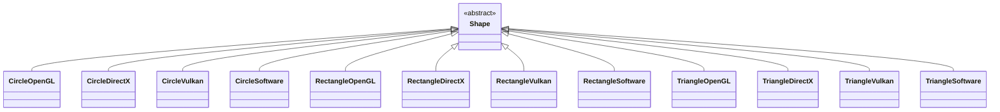
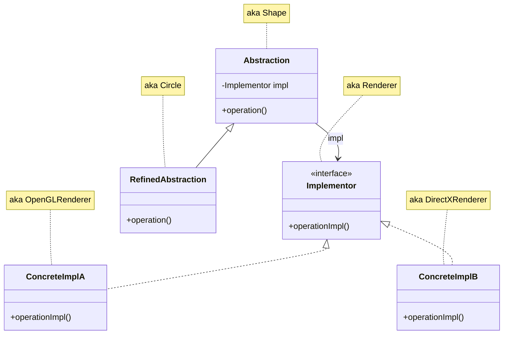
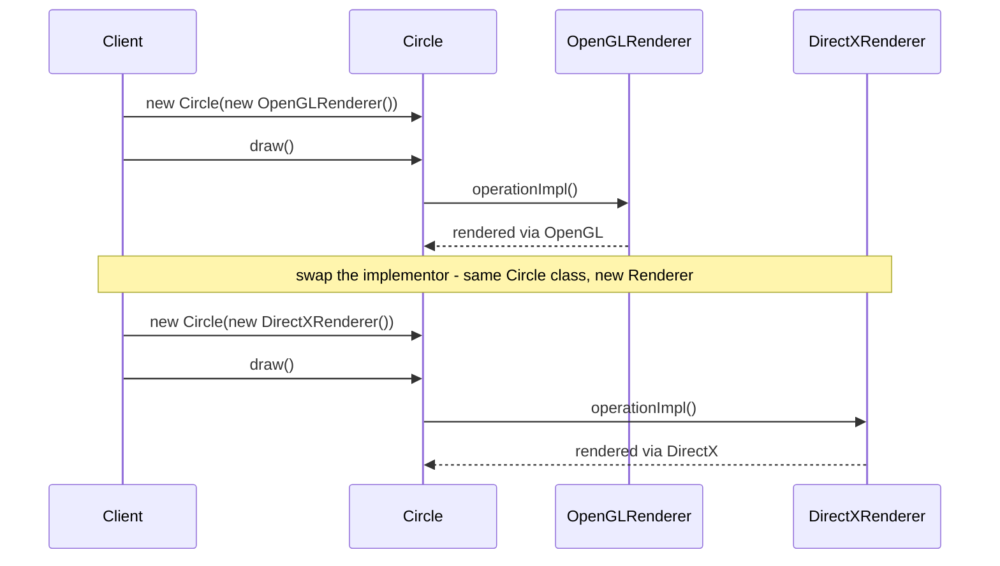
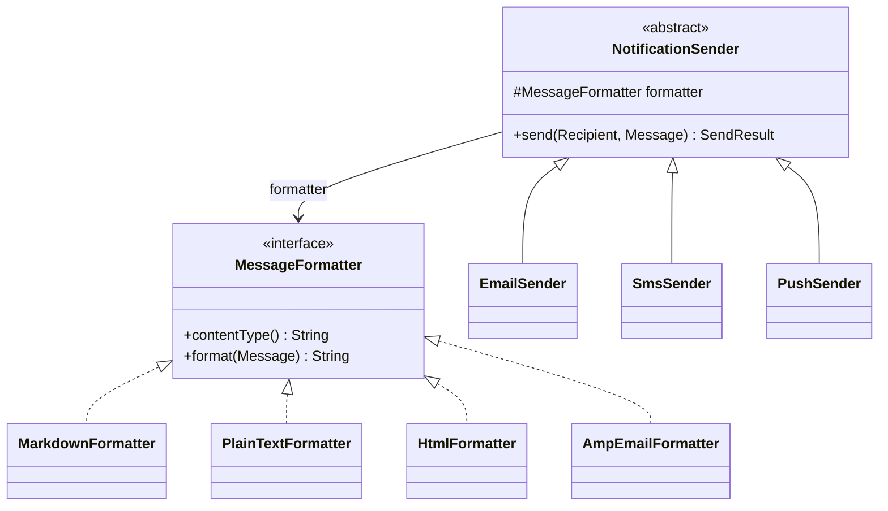
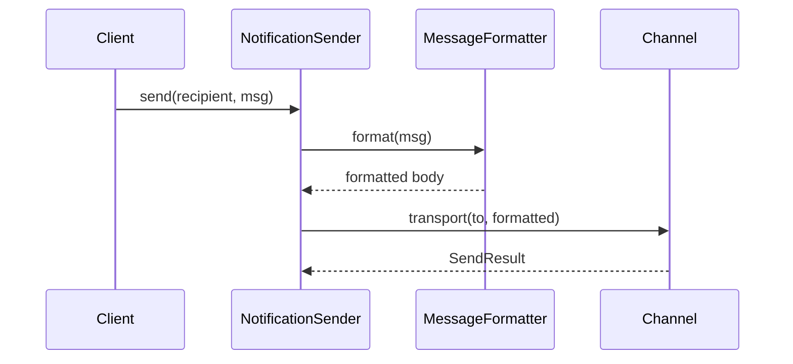
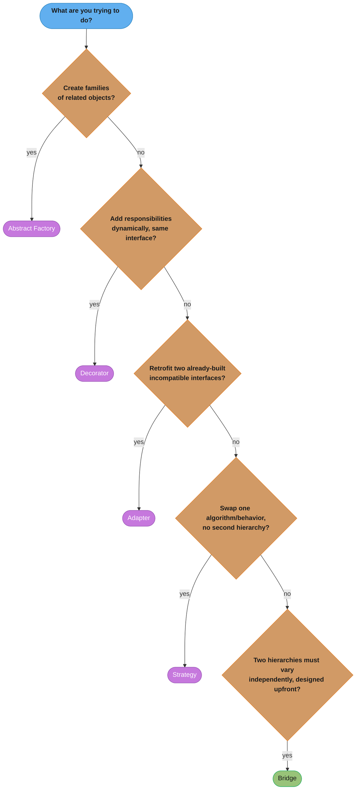

# Bridge Pattern

## 1. Pattern Name & Category

**Pattern:** Bridge
**Category:** Structural
**GoF Classification:** Structural Design Pattern (Gang of Four, "Design Patterns: Elements of Reusable Object-Oriented Software", 1994)

---

## 2. Intent

Decouple an abstraction from its implementation so that the two can vary independently, preventing a Cartesian explosion of subclasses when both abstraction and implementation need to evolve.

---

## Intuition

> **One-line analogy**: Bridge is like a universal remote control — the remote (abstraction) works with any TV brand (implementation) because they're connected by a standard IR protocol (bridge), not hardwired together.

**Mental model**: Without Bridge, adding a new shape type (Circle, Square) and a new rendering backend (OpenGL, DirectX) leads to a Cartesian product explosion: CircleOpenGL, CircleDirectX, SquareOpenGL, SquareDirectX. With Bridge, you have Shape (abstraction hierarchy: Circle, Square) and Renderer (implementation hierarchy: OpenGL, DirectX) — each can grow independently. Shape holds a reference to Renderer and delegates rendering; the two hierarchies evolve without exponential class proliferation.

**Why it matters**: Bridge is the pattern that prevents "class explosion" when you have two orthogonal dimensions of variation. It appears in cross-platform applications (UI code vs. platform-specific rendering), messaging systems (message types vs. transport protocols), and database drivers (SQL query builder vs. database-specific connection).

**Key insight**: Bridge works by replacing inheritance with composition. Instead of `CircleOpenGLRenderer` (inheritance), you have `Circle` with a `renderer` field (composition). The implementation can even be changed at runtime — swap the renderer without changing the shape.

---

## 3. Problem Statement

### The Core Problem
You have a class that needs to vary along two independent dimensions. Using inheritance to handle both leads to an exponential growth in the number of subclasses. Each new variant in either dimension requires new subclasses for every variant in the other dimension.

### Scenario: Cross-Platform UI Rendering
You are building a UI framework that needs to support:
- **Shapes:** Circle, Rectangle, Triangle (and more shapes coming)
- **Rendering engines:** OpenGL, DirectX, Vulkan, Software (and more platforms coming)

With plain inheritance:


*All 12 shape x renderer combinations fan out from a single `Shape` base — the "Cartesian explosion" plain inheritance produces.*

With 3 shapes and 4 renderers, you already need 12 subclasses. Add one new renderer and you need 3 new classes. Add one new shape and you need 4 new classes. This is the "class explosion" problem.

Additionally:
- Adding a new rendering backend requires modifying the shape hierarchy.
- Platform-specific rendering code is tangled with shape logic.
- Unit testing shapes requires a real rendering backend.
- You cannot mix and match at runtime (e.g., switch from OpenGL to Vulkan without changing the shape).

---

## 4. Solution

Split the class hierarchy into two separate hierarchies connected by composition:

1. **Abstraction hierarchy** — Shapes (`Circle`, `Rectangle`) that define the high-level operations.
2. **Implementation hierarchy** — Renderers (`OpenGLRenderer`, `DirectXRenderer`) that provide the low-level operations.

The abstraction holds a reference (the "bridge") to an implementation object. When a shape needs to render, it delegates to the renderer it was given. Neither hierarchy knows the concrete details of the other.

Now:
- 3 shapes + 4 renderers = **7 classes** instead of 12.
- Adding a new renderer requires 1 new class, not 3.
- Adding a new shape requires 1 new class, not 4.
- Shapes and renderers can vary and be composed at runtime.

---

## 5. UML Structure



*`Abstraction.operation()` delegates to `this.impl.operationImpl()` — the one call that crosses from the Abstraction hierarchy into the Implementor hierarchy.*

**The "Bridge" is the reference from Abstraction to Implementor.**

---

## 6. How It Works

**Step-by-step mechanics:**

1. **Define Implementor interface** — contains the primitive operations that implementations provide (e.g., `drawCircle(x, y, radius)`, `drawLine(x1, y1, x2, y2)`).
2. **Create Concrete Implementors** — `OpenGLRenderer`, `DirectXRenderer` each implement the primitives using their specific APIs.
3. **Define Abstraction** — `Shape` holds a reference to an `Implementor`. Its high-level `draw()` method calls the implementor's primitives.
4. **Create Refined Abstractions** — `Circle` and `Rectangle` override `draw()` to call the correct sequence of primitive implementor calls.
5. **Client wires them together** — `Circle circle = new Circle(new OpenGLRenderer())`. At runtime, `circle.draw()` delegates to OpenGL. Swap the renderer and the same `Circle` renders with DirectX.



*The class diagram in Section 5 is static; this sequence shows the runtime half — `draw()` always resolves to `this.impl.operationImpl()`, so re-pointing `impl` at construction time is enough to retarget every call without touching `Circle`.*

The abstraction and implementation can now change independently. The only coupling point is the `Implementor` interface.

---

## 7. Key Components

| Component | Role | Description |
|-----------|------|-------------|
| **Abstraction** | High-level control layer | Defines the interface used by clients; holds a reference to Implementor |
| **Refined Abstraction** | Extended abstraction | Extends Abstraction with more specific variants (Circle, Rectangle) |
| **Implementor** | Low-level interface | Declares primitive operations that concrete implementations must provide |
| **Concrete Implementor** | Platform-specific implementation | Provides platform-specific implementation of Implementor operations |

**The Bridge** is literally the reference from Abstraction to Implementor — a composition relationship that replaces inheritance.

---

## 8. When to Use

- **Two independent dimensions of variation** — when a class can vary along two axes that should both be extensible independently.
- **Avoiding class explosion** — when the number of subclasses would grow as the product of two sets of variants.
- **Runtime implementation switching** — when you want to switch implementations at runtime without changing client code.
- **Platform independence** — when abstracting over platform-specific code (rendering, file I/O, networking).
- **Hiding implementation details** — when implementation details should not be exposed to client code (only the abstraction is in the public API).
- **Parallel class hierarchies** — when you have two separate hierarchies where objects in one refer to objects in the other.

### Concrete Examples
- UI frameworks (shapes + renderers)
- JDBC: `Connection` abstraction + vendor-specific drivers
- Logging: log level abstraction + appender implementations
- Remote procedure calls: client stub + transport layer

---

## 9. When NOT to Use

- **Single implementation** — if there's only one implementation now and no plans for more, Bridge adds unnecessary complexity.
- **Simple cases** — if the inheritance hierarchy is shallow and not growing, Bridge is over-engineering.
- **When abstraction and implementation are tightly coupled** — if the abstract operations are so specific to one implementation that the Implementor interface becomes artificial.
- **When Adapter suffices** — if you just need to make an existing class work with an existing interface, use Adapter instead.
- **Performance-critical hot paths** — the extra indirection of delegation adds overhead that may matter in tight loops.

---

## 10. Pros

- **Eliminates class explosion** — m abstractions × n implementations = m + n classes instead of m × n.
- **Open/Closed Principle** — extend both hierarchies independently without modifying existing code.
- **Runtime flexibility** — swap the implementation at runtime (e.g., use software renderer during tests, GPU renderer in production).
- **Single Responsibility** — abstraction focuses on high-level logic; implementation focuses on low-level details.
- **Improved testability** — test abstractions with mock implementations; test implementations independently.
- **Hides implementation details** — clients only see the abstraction layer, not the platform specifics.
- **Encapsulation of platform differences** — all platform-specific code is contained in Concrete Implementors.

---

## 11. Cons

- **Increased design complexity** — two hierarchies instead of one; requires upfront design to split correctly.
- **Indirection overhead** — every high-level call delegates to a low-level call; slight performance cost.
- **Harder to understand** — the split between abstraction and implementation is not always obvious to new readers.
- **Requires good interface design** — the Implementor interface must be stable; changing it breaks all implementations.
- **May be premature** — if only one implementation ever exists, the Bridge pattern is unnecessary overhead.
- **Initialization complexity** — the client must know which concrete implementation to inject, or a factory is needed.

---

## 12. Tradeoffs

| You Gain | You Lose |
|----------|----------|
| Independent variation of two hierarchies | Additional complexity of maintaining two parallel hierarchies |
| Runtime implementation switching | One more level of indirection per call |
| Elimination of class explosion | Requires stable Implementor interface design upfront |
| Better testability | Less obvious code structure; steeper learning curve |
| Platform independence | Client must wire abstraction + implementation (or use DI) |

---

## 13. Common Pitfalls

1. **Confusing Bridge with Adapter:** Bridge is designed upfront for independent variation; Adapter is applied retroactively to make incompatible interfaces work.
2. **Leaking implementation details:** Defining `Implementor` methods that are too specific to one platform makes it hard to implement for other platforms.
3. **Under-designing the Implementor interface:** If the primitives in `Implementor` are too coarse, Refined Abstractions can't use them effectively; if too fine, the abstraction layer becomes thin and useless.
4. **Forgetting to delegate:** Refined Abstractions sometimes duplicate logic instead of delegating to the Implementor, defeating the purpose.
5. **Single implementation forever:** Building a Bridge when only one implementation will ever exist wastes design effort.
6. **Not using DI:** Hard-coding the concrete implementor inside the abstraction defeats the purpose; always inject it.
7. **Mutating the implementation reference:** Switching implementations mid-operation in a non-thread-safe way can cause race conditions.

---

## 14. Real-World Usage

### Production Anchor: Multi-Channel Notification System

A B2C product sends 2M notifications/day across Email, SMS, and Push (FCM/APNs). Each channel can carry the message in Markdown, Plain text, or HTML — and the product team adds a new channel (WhatsApp) and a new format (AMP-Email) every quarter. Naive class explosion would yield 3 channels × 3 formats = 9 classes today, scaling to 4×4 = 16 next quarter, then 5×5 = 25. Bridge separates `NotificationSender` (channel — the abstraction) from `MessageFormatter` (format — the implementor). Adding WhatsApp adds 1 class. Adding AMP-Email adds 1 class. The two axes vary independently. Latency budget per notification: 50ms p99 (composition is in-process; channel I/O dominates). Throughput: 25 notifications/sec sustained, 500/sec burst during product launches.



*The channel axis (`NotificationSender` subclasses) and the format axis (`MessageFormatter` subclasses) vary independently — the `formatter` field is the bridge; adding WhatsApp or AMP-Email is one new leaf class, never a cross-product of both.*



*One `send()` call crosses the bridge exactly once, at `formatter.format()`, before reaching the channel-specific transport (SES for Email, SNS for SMS, FCM for Push) — matching the ~200ns indirection cost cited below.*

```java
// Implementor — the "format" axis
public interface MessageFormatter {
    String contentType();
    String format(Message msg);
}

public final class HtmlFormatter implements MessageFormatter {
    public String contentType() { return "text/html"; }
    public String format(Message m) {
        return "<html><body><h1>" + escape(m.title()) + "</h1><p>"
             + renderBody(m.body()) + "</p></body></html>";
    }
}

public final class MarkdownFormatter implements MessageFormatter {
    private final Parser parser = Parser.builder().build();
    private final HtmlRenderer renderer = HtmlRenderer.builder().build();
    public String contentType() { return "text/markdown"; }
    public String format(Message m) {
        return renderer.render(parser.parse("# " + m.title() + "\n\n" + m.body()));
    }
}
```

```java
// Abstraction — the "channel" axis; holds a reference to the implementor
public abstract class NotificationSender {
    protected final MessageFormatter formatter;            // <-- the bridge
    protected NotificationSender(MessageFormatter formatter) {
        this.formatter = Objects.requireNonNull(formatter);
    }
    public abstract SendResult send(Recipient r, Message m);
}

public final class EmailSender extends NotificationSender {
    private final SesClient ses;
    public EmailSender(MessageFormatter f, SesClient ses) { super(f); this.ses = ses; }
    @Override public SendResult send(Recipient r, Message m) {
        String body = formatter.format(m);
        SendEmailRequest req = SendEmailRequest.builder()
            .destination(d -> d.toAddresses(r.email()))
            .message(msg -> msg.subject(s -> s.data(m.title()))
                               .body(b -> bodyFor(b, formatter.contentType(), body)))
            .source("noreply@example.com").build();
        return new SendResult(ses.sendEmail(req).messageId());
    }
    private void bodyFor(Body.Builder b, String ct, String body) {
        if (ct.startsWith("text/html")) b.html(c -> c.data(body));
        else b.text(c -> c.data(body));
    }
}

public final class SmsSender extends NotificationSender {
    private final SnsClient sns;
    public SmsSender(MessageFormatter f, SnsClient sns) { super(f); this.sns = sns; }
    @Override public SendResult send(Recipient r, Message m) {
        // SMS strips formatting; even if format is HTML, transport is plaintext
        String body = formatter.format(m).replaceAll("<[^>]+>", "");
        return new SendResult(sns.publish(p -> p.phoneNumber(r.phone()).message(body)).messageId());
    }
}
```

```java
// Wiring — any channel composes with any formatter at construction time
@Configuration
class NotificationConfig {
    @Bean EmailSender htmlEmail(SesClient ses) { return new EmailSender(new HtmlFormatter(), ses); }
    @Bean EmailSender mdEmail(SesClient ses)   { return new EmailSender(new MarkdownFormatter(), ses); }
    @Bean SmsSender plainSms(SnsClient sns)    { return new SmsSender(new PlainTextFormatter(), sns); }

    @Bean NotificationRouter router(List<NotificationSender> senders) {
        return new NotificationRouter(senders);   // routes by recipient preference
    }
}
```

### Famous Codebase Usages

- **JDBC**: `java.sql.Connection`/`Statement`/`ResultSet` are the abstractions. Each vendor ships a driver (MySQL `com.mysql.cj.jdbc.ConnectionImpl`, PostgreSQL `org.postgresql.jdbc.PgConnection`) as the concrete implementor. Your app code never references the driver class.
- **AWT peers**: `java.awt.Button` (abstraction) delegates rendering to `java.awt.peer.ButtonPeer` (implementor) — Windows uses `WButtonPeer`, macOS uses `LWButtonPeer`. Removed in JDK 9+ but a textbook bridge example.
- **SLF4J**: `org.slf4j.Logger` is the abstraction; `ch.qos.logback.classic.Logger`, `org.apache.logging.log4j.spi.ExtendedLogger` are implementors. Swap the backend by changing the runtime jar — application code unchanged.
- **Spring `PlatformTransactionManager`**: abstraction; `DataSourceTransactionManager`, `JpaTransactionManager`, `JtaTransactionManager` are concrete implementors. Application code uses `@Transactional`; the implementor is chosen at configuration time.
- **Spring `ResourceLoader`** with `ClassPathResource`, `FileSystemResource`, `UrlResource`, `ServletContextResource`.

### Anti-patterns

**1. Class explosion via inheritance instead of Bridge**
```java
// BROKEN — N channels × M formats = N*M classes
class EmailMarkdownSender { ... }
class EmailHtmlSender    { ... }
class EmailPlainSender   { ... }
class SmsMarkdownSender  { ... }     // ...and 5 more, growing quadratically
// Adding "WhatsApp" + "AMP-Email" requires writing 9 new classes.

// FIX — Bridge: N + M classes; composition picks the combination
NotificationSender s = new EmailSender(new MarkdownFormatter(), ses);
NotificationSender w = new WhatsAppSender(new HtmlFormatter(), waClient);  // new channel: 1 class
```

**2. Bridge where one axis has only one implementation**
```java
// BROKEN — only Logback will ever be the backend, but we "designed" a Bridge "for flexibility"
public abstract class MyLogger {
    protected final LogbackBackend backend;     // only one impl, ever
    ...
}
// Adds indirection, ceremony, and a layer to debug for zero benefit.
// FIX — use Bridge only when both axes are known to vary; otherwise call the concrete class directly.
public final class MyLogger {
    private final LogbackBackend backend;       // direct dependency, simpler
}
```

**3. Abstraction casting Implementor to its concrete type**
```java
// BROKEN — abstraction reaches into implementor specifics, defeating the bridge
public abstract class NotificationSender {
    protected final MessageFormatter formatter;
    public SendResult send(Recipient r, Message m) {
        if (formatter instanceof HtmlFormatter html) {
            html.injectTrackingPixel(m);        // <- abstraction now knows HtmlFormatter
        }
        ...
    }
}
// Now adding a new formatter that also wants tracking requires editing the abstraction.

// FIX — extend the Implementor interface; abstraction calls only interface methods
public interface MessageFormatter {
    String format(Message msg);
    default Message preProcess(Message m) { return m; }   // hook formatters can override
}
public final class HtmlFormatter implements MessageFormatter {
    @Override public Message preProcess(Message m) { return m.withTrackingPixel(); }
}
// Abstraction:  Message processed = formatter.preProcess(m); String body = formatter.format(processed);
```

### Performance and Correctness Numbers

- In-process composition cost: ~200ns per `send()` call for the indirection (one extra virtual dispatch on the formatter). Channel I/O (SES, SNS, FCM) is 20-200ms — bridge overhead is invisible.
- Memory: each `(channel, formatter)` combination is one object pair (~64 bytes). Pre-Bridge, 9 subclasses meant 9 class metadata entries (~3KB each in metaspace); post-Bridge, 3 + 3 = 6 classes.
- Adding WhatsApp + AMP-Email post-Bridge: 2 new classes, ~150 LoC each, 4 hours from PR to production. Pre-Bridge equivalent: 9 new combination classes, ~500 LoC each, with cross-cutting test churn.

### Migration Story

The team started with `EmailHtmlSender`, `EmailPlainSender`, `SmsPlainSender` — three classes, no abstraction. When `PushHtmlSender` and `PushMarkdownSender` were proposed, the senior engineer flagged the 3×3 trajectory. The refactor extracted `MessageFormatter` from the body-construction code in each existing sender (about 80 LoC each), introduced `NotificationSender` as the abstract base, and converted the three existing classes to take a formatter parameter. Total refactor: 2 days, 100% test coverage maintained. The WhatsApp + AMP-Email additions the next quarter were trivial — confirming the Bridge had paid for itself within one release cycle.

---

## 15. Comparison with Similar Patterns

| Pattern | Intent | Key Difference |
|---------|--------|----------------|
| **Bridge** | Decouple abstraction from implementation for independent variation | Both sides are designed to vary; chosen upfront |
| **Adapter** | Make incompatible interfaces work together | Applied retroactively; only one side changes |
| **Strategy** | Define a family of algorithms and make them interchangeable | The "implementation" is a behavior/algorithm, not a platform; no abstraction hierarchy |
| **Abstract Factory** | Create families of related objects | Focus is on object creation, not structural composition |
| **Decorator** | Add responsibilities to objects dynamically | Same interface throughout; stacks behaviors |

**Bridge vs. Strategy:** Both use composition to delegate to an interface. The difference is intent: Strategy is about swapping algorithms/behaviors; Bridge is about platform independence and preventing class explosion across two dimensions.

**Bridge vs. Adapter:** Bridge is designed proactively; Adapter is applied reactively. Bridge has two parallel hierarchies; Adapter translates between two existing incompatible interfaces.



*A quick elimination path through the five patterns in the table above — most interview confusion sits at the last branch (Strategy vs. Bridge), which is why both comparison paragraphs above exist.*

---

## 16. Interview Tips

### Common Questions

**Q: What problem does the Bridge pattern solve?**
A: It solves the class explosion problem when a class needs to vary along two independent dimensions. Instead of creating m×n subclasses, you create m+n classes by separating the two dimensions into separate hierarchies connected by composition.

**Q: How does Bridge differ from Adapter?**
A: Bridge is designed upfront with the intent of making two hierarchies vary independently. Adapter is applied retroactively to make two existing incompatible interfaces work together. Bridge prevents a problem; Adapter fixes one.

**Q: How does Bridge differ from Strategy?**
A: Both use composition to delegate to an interface. Bridge structures the abstraction into a hierarchy (Circle, Rectangle) that delegates to an implementation hierarchy (renderers). Strategy focuses on a single behavioral dimension (algorithms) with no abstraction hierarchy on the calling side.

**Q: Give a real-world example of Bridge in the Java ecosystem.**
A: JDBC is the canonical example. `java.sql.Connection` and `Statement` are abstractions. Each database vendor supplies a driver (Concrete Implementor). Application code uses the abstraction; the JDBC driver is the bridge to the actual database engine.

**Q: When would you choose Bridge over inheritance?**
A: When you have two dimensions of variation that need to grow independently. If shapes and renderers both need to scale, inheriting creates m×n classes; Bridge creates m+n.

**Q: Walk through a concrete number showing the class explosion Bridge avoids.**
A: Suppose you have 4 shape types (Circle, Square, Triangle, Hexagon) and 3 rendering engines (Vector, Raster, OpenGL). With single inheritance encoding both dimensions, you need a subclass per combination — `VectorCircle`, `RasterCircle`, `OpenGLCircle`, `VectorSquare`, and so on, which is 4×3 = 12 classes, and adding a 4th engine jumps that to 16. With Bridge, you write 4 shape classes that each hold a `Renderer` reference plus 3 renderer implementations — 4+3 = 7 classes, and a 4th engine only adds 1 class (4+4=8). The savings compound multiplicatively as either dimension grows, which is the core economic argument for Bridge. In an interview, lead with this multiplication-vs-addition framing — it is the single most memorable justification for the pattern.

**Q: What is the "Pluggable Implementation" idiom and how does it relate to Bridge?**
A: Pluggable Implementation is Bridge applied at the platform/SDK level so that an abstraction can swap its backing implementation at runtime or via configuration, without recompiling client code. JDBC drivers are the textbook case — `DriverManager.getConnection(url)` returns a `Connection` whose concrete implementor (MySQL, Postgres, Oracle driver) is selected purely by the JDBC URL/classpath, and historically AWT's peer-based windowing toolkit used the same idea: `java.awt.Button` (abstraction) delegated to a native `ButtonPeer` implementation chosen per operating system (Windows, Motif, Mac). The defining trait is that the implementor is resolved through a registry or factory rather than being hardcoded, which is what makes the implementation "pluggable" rather than merely "delegated." When you see a system where you can drop in a new vendor/driver/backend by adding a JAR or config entry with zero code changes to the abstraction, that is Pluggable Implementation — i.e., Bridge plus a discovery mechanism.

**Q: How do you evolve the implementor hierarchy without breaking clients of the abstraction hierarchy?**
A: Keep the `Implementor` interface as the only contract the `Abstraction` depends on, and add new concrete implementors as new classes that implement that existing interface — clients calling methods on `Shape` never need to know a new `Renderer` was added. The danger is changing the `Implementor` interface itself (e.g., adding a new method to `Renderer`): every existing concrete implementor must now implement it, which is the same fragility as adding a method to any widely-implemented interface. Mitigations include adding default methods (Java 8+) to the `Implementor` interface so old implementors keep compiling, or introducing a new `Renderer2` interface and having the abstraction check for it via `instanceof`/optional capability detection. The practical guidance is to design the implementor interface around stable, low-level primitives (e.g., `drawLine`, `drawCircle`, `fillPolygon`) so it rarely needs to change — new high-level shape behavior should be composable from those primitives in the abstraction layer, not require new implementor methods.

**Q: What are the downsides of using Bridge for a simple, single-dimension problem?**
A: Bridge adds a layer of indirection — every call from the abstraction to the implementor is a virtual dispatch through an interface, plus you now maintain two class hierarchies and a wiring mechanism (constructor injection, factory, or DI container) instead of one. For a class that genuinely varies along only one axis (say, just shape type, with no alternate rendering engines ever planned), this is pure overhead: more files, more indirection to trace during debugging, and a steeper learning curve for new team members reading the code. The pattern pays for itself only when the second dimension of variation is real or highly likely — applying it speculatively is a YAGNI violation. The practical guidance is to start with a simple class hierarchy and refactor toward Bridge only when a second independent dimension actually materializes (e.g., "we now need to support a second database vendor"), which is also an easier refactor than retrofitting an over-engineered Bridge back down to a simple hierarchy.

**Q: Does the Abstraction always hold exactly one Implementor, and can that reference change at runtime?**
A: Yes to both — the Abstraction typically holds a single reference to an `Implementor` (often via constructor injection or a setter), and because it is a plain object reference rather than a compile-time type, it can be reassigned at runtime to swap behavior dynamically. For example, a `RemoteControl` (abstraction) holding a `Device` (implementor) reference could be re-pointed from a `TV` to a `Radio` implementor without the `RemoteControl` class changing at all — this is the same "swap the strategy object" mechanism Strategy uses, but here it is one half of two parallel hierarchies rather than a single behavioral axis. A common gotcha is conflating "the implementor can change" with "the abstraction subclass can change" — switching abstraction subclasses (e.g., from `Circle` to `Square`) requires creating a new object, while switching implementors on the same abstraction instance is a simple field reassignment. When designing the Abstraction's constructor, accept the `Implementor` interface type (not a concrete class) so any current or future implementor can be injected.

### What Interviewers Look For
- Clear articulation of the "class explosion" problem
- Understanding of composition over inheritance
- Ability to distinguish from Adapter and Strategy
- Real-world example (JDBC is ideal)
- Awareness of when NOT to use it (premature optimization)

---

## Cross-Perspective: HLD Connections

**HLD View — Where Bridge Appears in Distributed Systems**

- **Multi-database support** — Abstract `QueryEngine` (the abstraction) from `MySQLEngine`, `PostgresEngine`, `CassandraEngine` (the implementations). New query types (analytics, transactional) and new databases can be added independently — the classic Bridge motivation.
- **Multi-cloud storage** — Abstract `FileStorage` operations (`upload`, `download`, `delete`) from `S3Storage`, `GCSStorage`, `AzureBlobStorage` implementations. A new feature (versioning) is added to the abstraction without touching storage drivers; a new cloud is added without touching file operation logic.
- **Notification system** — Abstract notification types (OrderConfirmation, ShipmentAlert, PasswordReset) from delivery channels (Email, SMS, Push). Adding a new notification type or a new channel are independent dimensions that would explode with inheritance.
- **Metrics system** — Abstract metric types (Counter, Gauge, Histogram) from backends (Prometheus, Datadog, CloudWatch). New metric types and new backends evolve independently.

---

## 17. Best Practices

1. **Design the Implementor interface carefully** — it should be stable; changing it breaks all concrete implementations.
2. **Keep abstractions coarse, implementors fine** — abstraction provides the high-level semantic API; implementors provide primitive operations.
3. **Use dependency injection** — always inject the implementor into the abstraction via constructor; never create it inside.
4. **Consider using a factory or builder** — to wire the correct abstraction + implementation pair for each use case.
5. **Name clearly** — `XxxImpl` for implementors or use domain-specific names like `OpenGLRenderer`, `JdbcDriver`.
6. **Keep both hierarchies independently testable** — test abstractions with mock implementors; test implementors against the interface contract.
7. **Identify the split early** — the pattern requires upfront design; retrofitting it onto an existing class explosion is painful.
8. **Don't split artificially** — only split when there are genuinely two independent dimensions; forced splits lead to awkward APIs.
9. **Document the contract** — the Implementor interface is a contract between two teams; document preconditions, postconditions, and threading requirements.
10. **Combine with Abstract Factory** — use a factory to create the right Concrete Implementor for the current platform/environment.
