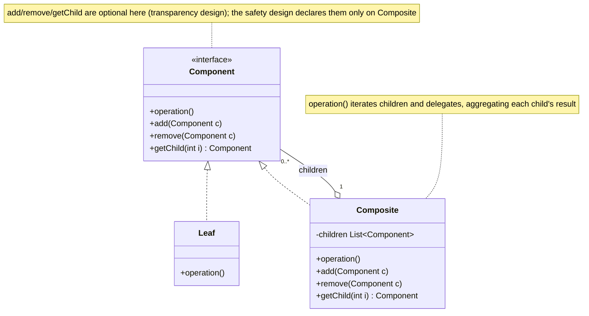
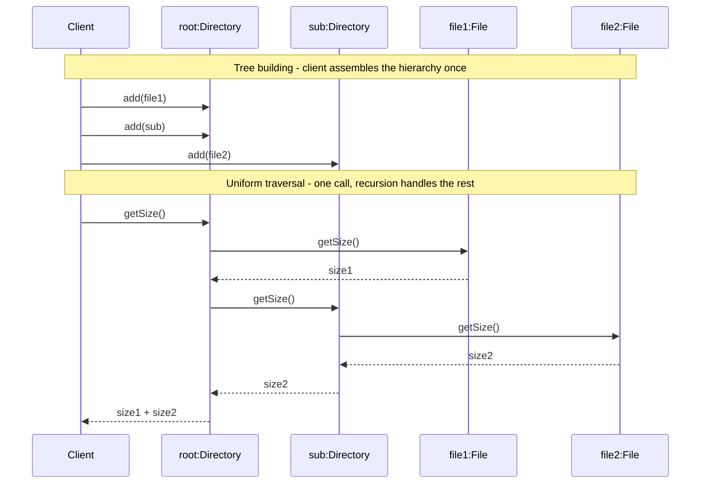
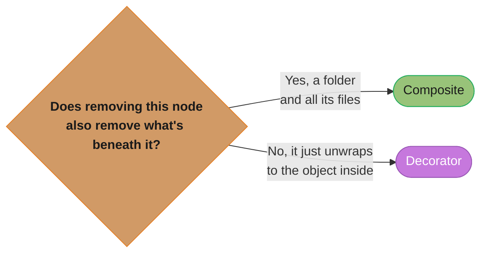

# Composite Pattern
## 1. Pattern Name & Category

**Pattern:** Composite
**Category:** Structural
**GoF Classification:** Structural Design Pattern (Gang of Four, "Design Patterns: Elements of Reusable Object-Oriented Software", 1994)

---

## 2. Intent

Compose objects into tree structures to represent part-whole hierarchies. Composite lets clients treat individual objects (leaves) and compositions of objects (composites) uniformly through a common interface.

---

## Intuition

> **One-line analogy**: Composite is like a file system — folders contain files and other folders, and you can "open" anything (whether it's a file or a folder full of files) with the same interface.

**Mental model**: When you have a tree structure where leaves and containers should be treated identically, Composite is the answer. File system: `FileSystemItem.open()` works on both `File` (leaf) and `Directory` (composite containing more FileSystemItems). UI widgets: a `Panel` contains `Buttons` and other `Panels` — both respond to `render()`. You traverse and operate on the whole tree without knowing whether any node is a leaf or container.

**Why it matters**: Composite eliminates conditional logic that checks "is this a leaf or a container?" The uniform interface lets you write recursive tree algorithms once (not separately for leaves and containers). It's the pattern behind XML/HTML DOM, organization hierarchies, arithmetic expression trees, and GUI component trees.

**Key insight**: The power of Composite lies in client code simplicity — algorithms (calculate total price, render UI, count files) are written once and work on the entire tree. The complexity of managing the tree is contained within the Composite nodes, not scattered across client code.

---

## 3. Problem Statement

### The Core Problem
You need to work with a tree-structured hierarchy where some nodes are simple objects (leaves) and others are containers that hold more objects. Client code must handle both types, leading to repetitive `instanceof` checks and branching logic that becomes increasingly complex as the hierarchy grows.

### Scenario: File System Tree
You are building a file system browser. The structure is:
- **Files** — leaf nodes with a name and size.
- **Directories** — containers that hold files and other directories.

Operations you need:
- `getSize()` — for a file, return its size; for a directory, sum the sizes of all contents recursively.
- `display(indent)` — print the tree with proper indentation.
- `delete()` — delete a file, or delete a directory and all its contents.
- `search(name)` — find a file or directory by name.

Without Composite, client code looks like:
```java
if (item instanceof File) {
    size += ((File) item).getSize();
} else if (item instanceof Directory) {
    for (FileSystemItem child : ((Directory) item).getChildren()) {
        // recursive logic duplicated everywhere
    }
}
```

This `instanceof` proliferation:
- Violates Open/Closed Principle — every new node type requires updates everywhere.
- Duplicates recursive traversal logic across multiple methods.
- Makes it impossible to treat trees and leaves uniformly.
- Breaks when you add new composites (e.g., `Archive`, `SymLink`).

---

## 4. Solution

Define a **Component interface** that both leaves and composites implement. The interface declares all operations that make sense for both (e.g., `getSize()`, `display()`, `getName()`).

- **Leaf** implements the interface directly.
- **Composite** implements the interface by delegating to its children and aggregating/combining the results.

Now client code works entirely through the Component interface. A `Directory` and a `File` are both `FileSystemItem`s. When you call `item.getSize()`, you don't care what `item` is — the polymorphism handles it.

---

## 5. UML Structure



*Component is the shared interface — in a file system, `Leaf` is `File` and `Composite` is `Directory`. Both implement `operation()` (realization arrows), and a `Composite` holds 0..* `Component` children, so the same call recurses transparently whether `item` is a single file or a directory full of them.*

**Two design choices for the Component interface:**

1. **Transparency:** Declare `add/remove/getChild` in Component — clients treat everything uniformly but leaves must provide dummy implementations.
2. **Safety:** Only declare `add/remove/getChild` in Composite — no dummy implementations but clients must downcast to call tree operations.

GoF prefers transparency; most modern implementations prefer safety.

---

## 6. How It Works

**Step-by-step mechanics:**

1. **Client calls `operation()`** on a `Component` reference (could be Leaf or Composite).
2. **If it's a Leaf:** The operation is handled directly (e.g., `File.getSize()` returns the file's own size).
3. **If it's a Composite:** The operation iterates over all children and calls `operation()` on each, then combines the results (e.g., `Directory.getSize()` sums sizes from all children).
4. **Recursion happens naturally** — a child `Composite` (subdirectory) will in turn iterate its own children, and so on down the tree.
5. **Base cases are Leaves** — no children to iterate; recursion terminates.
6. **Tree building:** Client calls `composite.add(leaf)` and `composite.add(anotherComposite)` to build the tree.
7. **Client is oblivious** — once the tree is built, the client calls `root.operation()` and the tree handles traversal internally.



*The client builds the tree once via `add()`, then issues a single `getSize()` call on `root`; recursion — not client code — walks into `sub` and back out, summing leaf sizes as results bubble up (steps 1-7 above in action).*

---

## 7. Key Components

| Component | Role | Description |
|-----------|------|-------------|
| **Component** | Common interface | Declares interface for all objects in the composition (both leaves and composites) |
| **Leaf** | Individual node | Represents a leaf node with no children; implements Component directly |
| **Composite** | Container node | Stores child Components; implements Component by delegating to children |
| **Client** | Tree consumer | Works only through the Component interface; unaware of leaf vs. composite distinction |

---

## 8. When to Use

- **Tree-structured data** — whenever your domain has a natural part-whole hierarchy (file systems, org charts, menus, DOM trees, bill of materials).
- **Uniform treatment** — when clients should be able to treat individual objects and compositions the same way.
- **Recursive operations** — when operations naturally propagate down a tree (calculate total price, render a UI tree, print an org chart).
- **Dynamic hierarchies** — when the tree structure is not known at compile time and can change at runtime.
- **Adding new leaf/composite types** — when you expect the type of nodes to grow without changing client traversal logic.

### Concrete Examples
- File system (files and directories)
- GUI component trees (panels containing buttons containing icons)
- XML/HTML DOM traversal
- Organization hierarchy (employees and managers)
- Menu systems (menu items and submenus)
- Expression trees in compilers/calculators
- Bill of materials in manufacturing

---

## 9. When NOT to Use

- **Flat structures** — if your data has no hierarchy, Composite adds unnecessary complexity.
- **Type-specific operations matter** — if clients genuinely need to behave very differently for leaves vs. composites, forcing a common interface is awkward.
- **Performance-critical aggregation** — recursive traversal can be slow on very deep or very wide trees; consider caching or a different data structure.
- **When hierarchy is fixed and known** — if the tree never changes and has only 2-3 known types, a simpler design may be clearer.
- **When add/remove/getChild on leaves is unacceptable** — if the "transparency" design requires leaves to throw `UnsupportedOperationException`, this can lead to surprises; use "safety" design or a different pattern.

---

## 10. Pros

- **Uniformity** — clients treat leaves and composites identically through the Component interface.
- **Open/Closed Principle** — add new Component types (new leaf or composite) without changing existing client code.
- **Simplifies client code** — eliminates `instanceof` checks and recursive traversal boilerplate in client code.
- **Natural recursive structure** — mirrors the recursive nature of tree data naturally.
- **Flexible tree building** — composites and leaves can be assembled in any combination at runtime.
- **Easy traversal** — tree-walking algorithms are encapsulated inside the composite, not scattered across clients.
- **Scalability** — works with arbitrarily deep and wide trees without code changes.

---

## 11. Cons

- **Over-generalization** — if leaves and composites need very different interfaces, forcing them under one Component is awkward.
- **Type safety loss** — with the transparency design, leaves must implement `add/remove` and throw runtime exceptions.
- **Hard to restrict structure** — it's difficult to enforce constraints like "a directory can only have files, not other directories" because everything is a Component.
- **Performance** — deep recursive traversal can be slow; no built-in caching.
- **Circular reference risk** — adding a composite as a child of itself (directly or transitively) causes infinite recursion.
- **Design complexity** — finding the right balance between transparency and safety requires careful interface design.

---

## 12. Tradeoffs

| You Gain | You Lose |
|----------|----------|
| Uniform client code (no instanceof) | Type safety — leaves must stub out child management methods |
| Easy addition of new node types | Harder to add constraints on which nodes can be children of which |
| Natural recursive algorithm support | Potential runtime exceptions from "unsupported" operations on leaves |
| Clean tree construction API | Circular reference bugs if tree is not built carefully |
| Scalability across arbitrary tree depths | Performance on very deep trees without caching |

---

## 13. Common Pitfalls

1. **Circular trees:** Adding a composite as its own descendant causes infinite recursion. Always validate when adding children.
2. **Transparency vs. safety confusion:** Implementing `add/remove` on Leaf and having it throw `UnsupportedOperationException` surprises callers. Document this clearly or use the safety variant.
3. **Caching not considered:** `getSize()` on the root of a huge tree recalculates from scratch on every call. Cache aggregated values when the tree is static.
4. **Forgetting the parent reference:** Some traversals (like `delete`) need to know a node's parent; forgetting to maintain a `parent` reference makes these operations impossible.
5. **Thread safety:** Modifying a composite's child list while another thread is traversing it causes `ConcurrentModificationException`. Use synchronization or immutable trees.
6. **Overloading the Component interface:** Adding too many operations to Component forces every Leaf to implement irrelevant methods.
7. **Not protecting against null children:** `composite.add(null)` leads to `NullPointerException` deep in recursive traversal; validate inputs.

---

## 14. Real-World Usage

### Production Anchor: Gradle-Style Build Task Graph

*Worked scenario, not a report on Gradle itself.* The system below is a representative
monorepo build tool modelled on Gradle's task-graph design; every number in it (node
counts, budgets, timings, hit rates) is an illustrative figure for this one hypothetical
setup, chosen so the tradeoffs are concrete. Treat them as a worked example to reason
against, not as published benchmarks for any real build tool.

A monorepo build tool executes a task DAG of ~10,000 nodes (compile units, test groups, doc generation, packaging). `BuildTask` is the leaf (a single executable unit), `TaskGroup` is the composite (an aggregation that runs children in dependency order). `execute()` recurses the tree. Target: full graph traversal and scheduling decision in < 50ms; total build time bound by leaf execution, not by orchestration. Cache hit ratio of leaf outputs averages 92%, so most invocations skip work — but the composite must still walk every node to compute up-to-date status. Cycle detection is mandatory: a misconfigured `compileMain -> compileTest -> compileMain` cycle must be reported, not stack-overflow.

```
                 root: TaskGroup("build")
                 /          |          \
                /           |           \
         compile          test         package
        (TaskGroup)    (TaskGroup)    (TaskGroup)
         /     \         /    \           |
       javac  kotlinc  unit  integ      jar
       (Leaf)  (Leaf)  (Leaf)(Leaf)    (Leaf)

   execute() on root -> DFS post-order -> leaves run first,
   composites wait for children, results bubble up.
```

```java
// Component — common interface for leaves and composites
public sealed interface BuildTask permits LeafTask, TaskGroup {
    String name();
    TaskResult execute(BuildContext ctx);
    Set<BuildTask> dependencies();        // for DAG scheduling
}

// Leaf — atomic unit of work
public record LeafTask(String name, Action action, Set<BuildTask> dependencies)
        implements BuildTask {
    public TaskResult execute(BuildContext ctx) {
        if (ctx.cache().isUpToDate(this)) return TaskResult.cached(name);
        long start = System.nanoTime();
        try {
            action.run(ctx);
            ctx.cache().recordSuccess(this);
            return TaskResult.success(name, System.nanoTime() - start);
        } catch (Exception e) {
            return TaskResult.failure(name, e);
        }
    }
}
```

```java
// Composite — holds children; recursively executes
public final class TaskGroup implements BuildTask {
    private final String name;
    private final List<BuildTask> children = new ArrayList<>();
    private final Set<BuildTask> dependencies;

    public TaskGroup(String name, Set<BuildTask> dependencies) {
        this.name = Objects.requireNonNull(name);
        this.dependencies = Set.copyOf(dependencies);
    }

    public void add(BuildTask child) {
        Objects.requireNonNull(child, "child must not be null");
        children.add(child);
    }
    public void remove(BuildTask child) { children.remove(child); }
    public String name() { return name; }
    public Set<BuildTask> dependencies() { return dependencies; }

    @Override
    public TaskResult execute(BuildContext ctx) {
        // Anti-pattern fix #3: cycle detection via visited set
        return executeSafe(ctx, new HashSet<>());
    }

    private TaskResult executeSafe(BuildContext ctx, Set<BuildTask> visiting) {
        if (!visiting.add(this)) {
            throw new IllegalStateException("Cycle detected at task: " + name);
        }
        try {
            List<TaskResult> child = new ArrayList<>(children.size());
            for (BuildTask c : children) {
                TaskResult r = (c instanceof TaskGroup g)
                        ? g.executeSafe(ctx, visiting)
                        : c.execute(ctx);
                child.add(r);
                if (r.failed() && ctx.failFast()) break;
            }
            return TaskResult.aggregate(name, child);
        } finally {
            visiting.remove(this);
        }
    }
}
```

```java
// Building the graph and running it
TaskGroup root = new TaskGroup("build", Set.of());
TaskGroup compile = new TaskGroup("compile", Set.of());
compile.add(new LeafTask("javac", new JavacAction(srcDir), Set.of()));
compile.add(new LeafTask("kotlinc", new KotlincAction(srcDir), Set.of()));
TaskGroup test = new TaskGroup("test", Set.of(compile));
test.add(new LeafTask("unit", new JUnitAction("unit"), Set.of()));
test.add(new LeafTask("integration", new JUnitAction("integ"), Set.of()));
root.add(compile); root.add(test);
root.add(new LeafTask("jar", new JarAction(), Set.of(compile, test)));

TaskResult result = root.execute(new BuildContext(cache, /*failFast*/ true));
```

### Famous Codebase Usages

- **`java.io.File`** — `isDirectory()`/`listFiles()` form a Composite (File can be a leaf or a directory composite).
- **`javax.swing.JComponent`** — `Container.add(Component)` defines the composite; every Swing widget participates. The component tree is walked for layout, painting, and event dispatch.
- **`org.w3c.dom.Node`** — the XML/HTML DOM. `Node.getChildNodes()` returns children; `Element`, `Text`, `Attr` are nodes. Browser engines walk this tree for rendering and querySelector.
- **`jakarta.faces.component.UIComponent`** — Jakarta Faces (formerly JSF; the package moved from `javax.faces` to `jakarta.faces` in Jakarta EE 9) component tree, walked during the Faces lifecycle phases.
- **Spring `org.springframework.core.env.CompositePropertySource`** — aggregates multiple `PropertySource`s; `getProperty(name)` walks children in order.
- **Spring `org.springframework.web.filter.CompositeFilter`** — chains servlet filters; behaves as a single `Filter`.
- **Spring `org.springframework.cache.support.CompositeCacheManager`** — delegates to multiple `CacheManager`s in order.
- **Android `View` / `ViewGroup`** — same pattern as Swing for mobile UIs.
- **javac AST** — every node in `com.sun.source.tree.Tree` is a composite (BinaryTree has left/right; BlockTree has a list of statements).

### Anti-patterns

**1. Type-unsafe children collection**
```java
// BROKEN — children typed as Object; runtime ClassCastException waiting to happen
public class TaskGroup {
    private final List<Object> children = new ArrayList<>();
    public void add(Object child) { children.add(child); }
    public void executeAll(BuildContext ctx) {
        for (Object o : children) ((BuildTask) o).execute(ctx);   // CCE if someone added a String
    }
}
// FIX — generic Component interface
public final class TaskGroup implements BuildTask {
    private final List<BuildTask> children = new ArrayList<>();
    public void add(BuildTask child) { children.add(Objects.requireNonNull(child)); }
}
```

**2. Leaf implementing `add`/`remove` and throwing at runtime**
```java
// BROKEN — uniformity at the cost of compile-time safety
public interface BuildTask {
    void add(BuildTask child);             // leaves must implement this
    void remove(BuildTask child);
    TaskResult execute(BuildContext ctx);
}
public class LeafTask implements BuildTask {
    public void add(BuildTask c)    { throw new UnsupportedOperationException(); }
    public void remove(BuildTask c) { throw new UnsupportedOperationException(); }
}
// Callers can't distinguish leaf from composite until runtime; bugs surface as UOE in production.

// FIX — separate interfaces; only Composite has add/remove (safety over uniformity)
public sealed interface BuildTask permits LeafTask, TaskGroup { TaskResult execute(BuildContext ctx); }
public final class TaskGroup implements BuildTask {           // add/remove live here
    public void add(BuildTask c) { children.add(c); }
    public void remove(BuildTask c) { children.remove(c); }
}
// Now `task.add(...)` is a compile error if `task` is not known to be a TaskGroup — exactly what we want.
```

**3. Infinite recursion from a cycle**
```java
// BROKEN — no cycle detection; user misconfigures A -> B -> A
public TaskResult execute(BuildContext ctx) {
    for (BuildTask c : children) c.execute(ctx);    // stack overflow if cycle exists
    return TaskResult.aggregate(name, ...);
}
// Symptom: StackOverflowError thousands of frames deep, the trace a repeating cycle, no useful diagnostic.

// FIX — track visited nodes; raise a clear error on cycle
private TaskResult executeSafe(BuildContext ctx, Set<BuildTask> visiting) {
    if (!visiting.add(this)) throw new IllegalStateException("Cycle at task: " + name);
    try {
        for (BuildTask c : children) {
            if (c instanceof TaskGroup g) g.executeSafe(ctx, visiting); else c.execute(ctx);
        }
        return TaskResult.aggregate(name, ...);
    } finally { visiting.remove(this); }
}
```

### Performance and Correctness Numbers

**Illustrative measurements, one stated setup.** The figures below are what this specific
hypothetical build tool measured on one machine — a 2023 laptop (8-core x86-64, 32GB RAM,
NVMe SSD), JDK 21, single JVM, warm page cache, 10,000-node graph. They are here to make
the orders of magnitude concrete, not as universal constants: they are not published
benchmarks, they are not vendor numbers, and they will not reproduce on your hardware,
JDK, or graph shape. Measure your own tree before quoting any of them.

- 10k-node graph traversal with cycle detection: 38ms p99 in that setup — under its 50ms budget. The algorithmic claim behind it is the durable part: `HashSet<BuildTask>` membership is **O(1) average** (O(n) worst case if hashes collide badly), so the visited-set check adds a constant factor rather than another traversal.
- Cache check per leaf: ~4µs in that setup (mtime + content hash lookup in a memory-mapped index). The 92% hit rate is this scenario's observed ratio, so ~9,200 of 10,000 leaves returned `cached` — a healthy incremental build, not a figure any build tool guarantees.
- Memory footprint of the graph in that setup: on the order of 80 bytes per `LeafTask` (object header + refs, 64-bit HotSpot with compressed oops) plus child-list overhead in groups; 10k nodes landed around 1.5MB heap. Exact per-object size is JVM- and layout-dependent — verify with JOL rather than assuming.
- Cycle errors name the offending task (`Cycle detected at task: compileMain`) instead of blowing the stack — that is exactly what `executeSafe` above throws. Reconstructing the full path costs one more field (pass an ordered `Deque` alongside the visited `Set`). The durable claim is qualitative: a named task is diagnosable in seconds, a bare `StackOverflowError` is not.

### Migration Story

The build tool originally had a flat `List<Task>` executed sequentially. As the monorepo grew past 200 modules, users wanted task grouping for parallel execution and selective re-runs (`./build compile:javac`). The team introduced `BuildTask` as the component, kept the old `Task` as `LeafTask`, and added `TaskGroup`. The transition shipped behind a feature flag (`--graph-mode`); flat-mode remained for one release. After cycle detection caught three production-blocking misconfigurations in the first week (which the flat mode had hidden by silently re-running tasks), `--graph-mode` became the default. The sealed-interface refactor (replacing the throwing-leaf anti-pattern) came a year later when the team upgraded to JDK 17.

---

## 15. Comparison with Similar Patterns

| Pattern | Intent | Key Difference |
|---------|--------|----------------|
| **Composite** | Represent part-whole hierarchies uniformly | Specifically for tree structures; operations propagate down the tree |
| **Decorator** | Add responsibilities to objects | Wraps a single object (chain, not tree); doesn't represent hierarchy |
| **Iterator** | Traverse a collection | Traversal mechanism only; doesn't define the structure |
| **Visitor** | Separate algorithm from structure | Used to add operations to a Composite tree without modifying it |
| **Chain of Responsibility** | Pass a request along a chain | Linear chain, not a tree; focus on who handles the request |

**Composite + Visitor** is a very common combination: Composite defines the tree structure; Visitor adds operations to traverse and process the tree without modifying the node classes.

**Composite vs. Decorator:** Both use recursive composition, but Composite builds trees (children can be many) while Decorator wraps a single object to add behavior.



*The practical tell from the interview Q&A: deleting a Composite node cascades to everything beneath it in the tree, while "removing" a Decorator just unwraps back to the single object it was wrapping — that asymmetry is the fastest way to tell the two apart under interview pressure.*

---

## 16. Interview Questions with Answers

### Common Questions

**Q: What problem does Composite solve?**
**Short:** Composite lets clients treat individual objects and compositions of objects uniformly, eliminating instanceof checks.

A: Composite eliminates the need for clients to distinguish between leaf and composite nodes in a tree structure. Without it, client code is full of `instanceof` checks and duplicated recursive traversal logic. Composite makes individual objects and compositions of objects interchangeable through a common interface.

**Q: What's the difference between transparency and safety in Composite?**
**Short:** Transparency puts add/remove on the Component interface for uniformity; safety restricts them to Composite for type safety.

A: In the transparency design, `add/remove/getChild` are declared on the Component interface — clients can treat everything uniformly but Leaf must implement these methods (usually throwing `UnsupportedOperationException`). In the safety design, these methods are only on Composite — no dummy implementations, but clients must downcast to use tree operations. Transparency is more uniform; safety is more type-safe.

**Q: How does Composite work with the Visitor pattern?**
**Short:** Composite defines the tree structure; Visitor adds new operations on it without modifying any node class.

A: Composite defines the tree structure. Visitor separates operations on that tree from the node classes. You add a new operation by writing a new Visitor rather than modifying every node class. The Composite tree calls `visitor.visit(this)` on each node; the Visitor implements different logic for each node type.

**Q: Give a real-world example of the Composite pattern.**
**Short:** Swing's Component/Container hierarchy is Composite, with JPanel acting as composite and JButton behaving as a leaf.

A: The Swing GUI framework plays every Composite role: `java.awt.Component` is the Component role (an abstract class, not an interface), and `java.awt.Container` is the Composite that holds child Components. `JPanel` and `JFrame` are the composites you actually nest; `JButton`, `JLabel`, `JTextField` behave as leaves in practice. One caveat worth stating in an interview: because `javax.swing.JComponent` extends `Container`, every Swing widget is *technically* a container that could hold children — Swing chose full transparency, so "leaf" here is a usage convention, not a type distinction. You can call `getPreferredSize()` on a `JPanel` and its layout manager recursively asks all children for their sizes — without knowing whether it is talking to a leaf-style widget or another nested container.

**Q: What are the risks of circular references in Composite?**
**Short:** A composite that accidentally contains itself causes infinite recursion during any tree traversal.

A: If a composite is accidentally added as a child of itself (directly or indirectly), any traversal becomes infinite recursion. Prevention strategies include: maintaining parent references and checking for cycles on `add()`, or making composites immutable after construction.

**Q: How does Composite differ from Decorator, given both involve recursive wrapping?**
**Short:** Composite models a part-whole tree with many children; Decorator wraps exactly one component to add behavior.

A: Composite models a part-whole tree where a node can have zero, one, or many children of the same `Component` type, and operations are defined to aggregate results from those children — the focus is the tree structure. Decorator wraps exactly one component to layer additional behavior onto it, with no notion of "multiple children" or hierarchy — the focus is behavior augmentation. A practical tell: if removing a node should also remove everything beneath it in a meaningful tree (a folder and its files), that's Composite; if "removing" a wrapper should just unwrap to reveal the single object underneath (stripping a `BufferedInputStream` to get the raw `FileInputStream`), that's Decorator. The two are sometimes combined — e.g., a composite tree whose individual nodes are themselves decorated — but conflating them in an interview answer (calling Decorator "a composite with one child") is a common mistake to avoid.

**Q: How do you avoid stack overflow when running recursive operations on very deep Composite trees?**
**Short:** Deep recursive tree operations can overflow the stack; convert them to an iterative traversal using an explicit Deque.

A: The naive recursive implementation of `getSize()`, `render()`, or any tree-wide operation calls itself once per level of depth, so a tree thousands of levels deep can exhaust the JVM's default thread stack (platform-dependent; commonly around 512KB-1MB on 64-bit HotSpot, and settable with `-Xss`) and throw `StackOverflowError`. The fix is to convert the recursion to an explicit iterative traversal using an auxiliary `Deque` as a stack (or `Queue` for BFS), pushing children onto it instead of making nested calls — this trades stack frames for heap-allocated collection entries, which scale far beyond the default stack size. Another option is increasing the thread's stack size via `-Xss` or the `Thread(ThreadGroup, Runnable, String, long stackSize)` constructor, but that is a band-aid that doesn't bound memory usage. In practice, most real-world composite trees (file systems, UI trees, org charts) are shallow enough (tens of levels) that recursion is fine — but flag the iterative alternative if the interviewer probes "what if the tree is 10,000 levels deep."

**Q: How would you implement and use Composite for a file system, concretely?**
**Short:** A FileSystemNode interface with File as Leaf and Directory as Composite lets getSize() recurse uniformly over the tree.

A: Define a `FileSystemNode` interface with methods like `getSize()` and `print(String indent)`. `File` (Leaf) implements `getSize()` by returning its own byte count and `print()` by printing its name. `Directory` (Composite) holds a `List<FileSystemNode>` of children; its `getSize()` sums `child.getSize()` over all children (recursively triggering the same logic on sub-directories), and its `print()` prints its own name then calls `print(indent + "  ")` on each child. The client computing total disk usage calls `root.getSize()` once and never needs to know whether `root` is a single file or a deeply nested directory tree — that uniform-interface property is the entire payoff. This is also the most commonly asked "implement Composite live" interview prompt, so being able to write this `File`/`Directory`/`FileSystemNode` trio from memory, including the constructor and `add()` method on `Directory`, is high-value preparation.

**Q: Can you cache or memoize aggregate results (like `getSize()`) in a Composite tree, and what's the catch?**
**Short:** Yes, but caching getSize() requires invalidating the cache up every ancestor whenever any descendant changes.

A: Yes — a `Directory` can cache its computed total size in a field and return the cached value on subsequent calls, which turns an O(n) recursive walk into O(1) for repeated queries. The catch is cache invalidation: any mutation anywhere in the subtree (adding/removing/resizing a file at any depth) must invalidate the cached size not just on the immediate parent but on every ancestor up to the root, which requires each node to hold a parent reference and propagate an "invalidate" call upward on every structural change. This is a classic correctness-vs-performance tradeoff — the bug pattern to watch for is updating a deeply nested file's size and forgetting that three levels of ancestor directories now have stale cached totals. The practical guidance is to only add caching once profiling shows the recursive walk is a real bottleneck, and to centralize invalidation logic (e.g., in a single `markDirty()` method called from every mutating operation) rather than scattering manual cache-clears.

**Q: If you need to add a brand-new operation to every node type in a Composite tree, what are your options and tradeoffs?**
**Short:** Add a method to Component and every subclass, or use Visitor to add operations without touching the node classes.

A: Option one is adding a new abstract method to the `Component` interface and implementing it in every `Leaf` and `Composite` subclass — simple, but it means every future operation requires touching every node class, violating Open/Closed. Option two is the Visitor pattern: define a `Visitor` interface with a `visit` method per concrete node type, give `Component` an `accept(Visitor)` method that each node implements by calling back `visitor.visitFile(this)` / `visitor.visitDirectory(this)`, and then new operations are added as new `Visitor` implementations with zero changes to the node classes. The Visitor approach has its own tradeoff — adding a new node *type* (not operation) now requires updating every existing Visitor implementation, so it inverts which axis is "open" for extension. The practical guidance: if new operations are added frequently but the set of node types is stable (typical for file systems — File and Directory rarely gain siblings), prefer Visitor; if new node types are added frequently but operations are stable, prefer the direct-method approach.

**Q: Should a child hold a reference to its parent?**
**Short:** Only if you need upward navigation, because a parent pointer is a second invariant that every add and remove must maintain in step.
A: Only when the tree genuinely needs upward navigation — computing a full path, bubbling an event to ancestors, or removing a node given only the node. The cost is that the structure now has two sources of truth, so every mutation must update both sides atomically, and the usual bug is a `remove` that clears the child from the parent's list but leaves the child's stale parent pointer, producing a node that reports an ancestor which no longer contains it. Parent pointers also introduce reference cycles, which break naive serialization, make recursive `equals` and `toString` loop, and confuse deep-copy code that does not track visited nodes. Encapsulate the invariant by making `add` and `remove` on the composite the only mutators and setting the pointer there, never letting callers assign it, and default to omitting parent pointers until a use case demands one.

**Q: What goes wrong if you implement recursive equals and hashCode on a Composite?**
**Short:** Both become O(n) over the whole subtree, and mutating any descendant changes the hash of every ancestor already stored in a hash set.
A: Two things. Cost: comparing or hashing a composite walks its entire subtree, so putting nodes in a `HashSet` or using them as map keys turns cheap operations into full traversals, and comparing two large trees that differ only at the last leaf pays for everything before it. Correctness: a mutable composite's hash changes when any descendant changes, so a node added to a hash-based collection and then modified is effectively lost — it hashes to a different bucket and `contains` returns false for an object that is physically in the set. The safe defaults are to leave `equals` and `hashCode` as identity-based for mutable nodes, which is what Swing components do, and to implement deep structural equality only on immutable trees where the value cannot change after construction. If you need "are these two trees the same shape", offer it as a named method such as `structurallyEquals` rather than overloading `equals`.

**Q: How do you stop a Composite from accepting the wrong kind of child?**
**Short:** Validate in add at runtime, or parameterize the composite by the child type, since a transparent Component interface cannot express the rule.
A: The transparent design gives every node the same type, so nothing prevents adding a `Row` to a `Paragraph` — you have to add the rule yourself. Runtime validation in `add`, throwing `IllegalArgumentException` when the child type is not permitted, is the common answer and works with any hierarchy, at the cost of failing at run time rather than compile time. Generics get you further when the constraint is uniform, with `Composite<T extends Component>` holding `List<T>` so a `Table` accepts only `Row`, though it fragments the uniform interface that made Composite attractive and gets awkward once a container legitimately mixes child types. Sealed interfaces plus exhaustive switches give a third option for closed hierarchies, letting you check permitted combinations centrally. Choose runtime checks for open, plugin-style trees and types for closed, well-known structures, and either way put the rule in one place rather than in every caller.

**Q: What breaks if the same node appears under two parents?**
**Short:** The structure is a DAG rather than a tree, so aggregate operations double-count shared nodes and any parent pointer can only name one owner.
A: Aggregation stops being correct: a `getSize()` that recurses counts a shared subtree once per path, so a file linked into two directories is billed twice, and the totals disagree with reality in a way that is very hard to spot. Parent pointers cannot represent it at all, since a node has one field and two owners. Deletion becomes ambiguous, because removing the node from one parent should not destroy it while it is still referenced by another, which is reference counting in disguise. If sharing is intentional, say so and change the operations: carry an identity-based visited set through the traversal so each node contributes once, and treat removal as unlinking rather than deleting. If it is unintentional, reject it in `add` by checking that the child has no parent, which is exactly what Swing does by removing a component from its previous container before adding it elsewhere.

**Q: What changes when the Composite tree is stored in a database rather than in memory?**
**Short:** Every recursive traversal becomes N+1 queries unless you load the subtree in one query using a recursive CTE or a materialized path.
A: The pattern's signature move — recursing into children — turns into one query per node, so computing a folder's total size on a 10,000-node tree issues 10,000 round trips and takes seconds instead of milliseconds. The usual storage models each trade differently: an adjacency list of parent-id columns is trivial to write and terrible to read recursively unless you use a recursive common table expression to fetch the whole subtree in one statement; a materialized path column storing the ancestor chain makes subtree reads a single prefix query but makes moving a subtree an update of every descendant; and nested sets make reads fast and writes expensive. Whichever you choose, load the subtree eagerly into in-memory composites, run the pattern over that, and treat the aggregate as a cached value with explicit invalidation, since recomputing it per request is the same N+1 by another name.

### What Interviewers Look For
- Clear understanding of the part-whole hierarchy problem
- Transparency vs. safety tradeoff
- Real example (Swing component tree, file system, DOM)
- Awareness of Composite + Visitor combination
- Circular reference awareness

---

## Cross-Perspective: HLD Connections

**HLD View — Where Composite Appears in Distributed Systems**

- **Infrastructure hierarchy** — Cloud resources form natural composites: a VPC contains subnets, which contain security groups, which contain EC2 instances. Infrastructure-as-Code tools (Terraform, CDK) model this as a Composite tree where `apply()` on the root recursively provisions all children.
- **Object storage hierarchy** — S3-style storage: Bucket → Folder → Object. Operations like `getSize()` or `listRecursive()` on any node naturally recurse into children — Composite enables uniform treatment of buckets and objects.
- **Distributed config trees** — Hierarchical configuration (Kubernetes ConfigMaps, Consul key-value trees) is a Composite: leaf nodes hold values; composite nodes aggregate them. A request to a parent path recursively returns all descendant values.
- **Health check aggregation** — A composite health check aggregates `UP`/`DOWN` from multiple sub-checks (database, cache, external API, disk space). `isHealthy()` on the root returns `true` only if all children are healthy — uniform recursion at any level of nesting.

---

## 17. Best Practices

1. **Decide on transparency vs. safety early** — it affects your entire Component interface design.
2. **Validate `add()` inputs** — check for null and for cycles before adding a child.
3. **Maintain parent references if needed** — if operations like `delete` need to modify the parent, add a `parent` field to Component.
4. **Cache aggregated results** — if `getSize()` or similar aggregation is expensive, cache the result in the composite and invalidate on structural changes.
5. **Use the safety variant in public APIs** — throwing `UnsupportedOperationException` from Leaf is surprising; expose `add/remove` only on Composite in public APIs.
6. **Combine with Visitor for new operations** — instead of adding methods to Component/Leaf/Composite, use Visitor to add new tree traversal algorithms.
7. **Use Iterator for traversal** — provide an `Iterator<Component>` to allow clients to traverse children without depending on the Composite's internal list type.
8. **Protect the child list** — return an unmodifiable view from `getChildren()` to prevent external mutation.
9. **Consider using the Builder pattern** — building complex composite trees via a fluent Builder is more readable than many `add()` calls.
10. **Thread safety** — if trees are shared across threads, make modifications synchronized or use a copy-on-write strategy.

---

## 18. Technologies and Tools

| Technology | What it gives you | When to reach for it |
|-----------|-------------------|---------------------|
| `java.awt.Container` / `Component` and JavaFX `Parent` / `Node` | The GUI archetype: a container is itself a component, so layout and painting recurse uniformly | Naming the classic example; also any custom UI tree |
| Spring `CompositeCacheManager`, `CompositeHealthContributor`, `CompositePropertySource` | Framework composites that let several backends answer as one, with a defined resolution order | Layered caches, aggregated health endpoints, multi-source configuration |
| Micrometer `CompositeMeterRegistry` | One registry that fans every metric out to several real registries | Exporting metrics to two backends during a migration |
| Jackson `JsonNode` (`ObjectNode`, `ArrayNode`, and the `ValueNode` leaves) | A ready-made composite over JSON with uniform traversal | Structural operations on arbitrary JSON |
| `java.nio.file.Path` + `Files.walkFileTree` | The filesystem as a composite, traversed by a visitor with pruning via `FileVisitResult` | Directory trees — composite and visitor together |
| `java.util.Collections.unmodifiableList` on the children list | Enforcing that the tree is only mutated through the composite's own API | Preventing callers from bypassing invariants by editing the child list directly |
| Neo4j or a recursive CTE in PostgreSQL (`WITH RECURSIVE`) | Persisting and querying deep hierarchies without N+1 round trips per level | The tree lives in a database and is traversed by query, not by object graph |

Two decisions define a composite and both should be explicit. The **transparency versus safety** choice: putting `add(child)` on the shared `Component` interface gives uniform treatment but forces leaves to throw `UnsupportedOperationException`, while keeping it on `Composite` is type-safe but makes callers test the node type. And **depth**: uniform recursion is elegant until a user-supplied or cyclic structure arrives, so bound the depth and detect cycles — an unguarded recursive `render()` on a deep tree is a `StackOverflowError` in production, not a theoretical concern.
