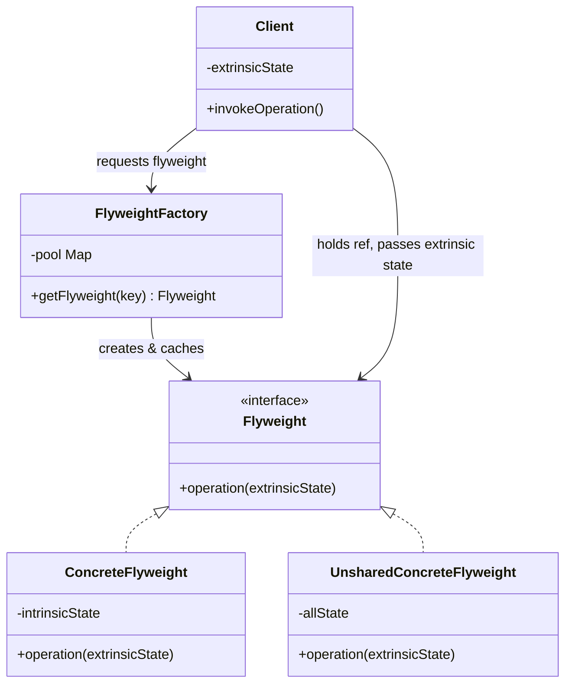
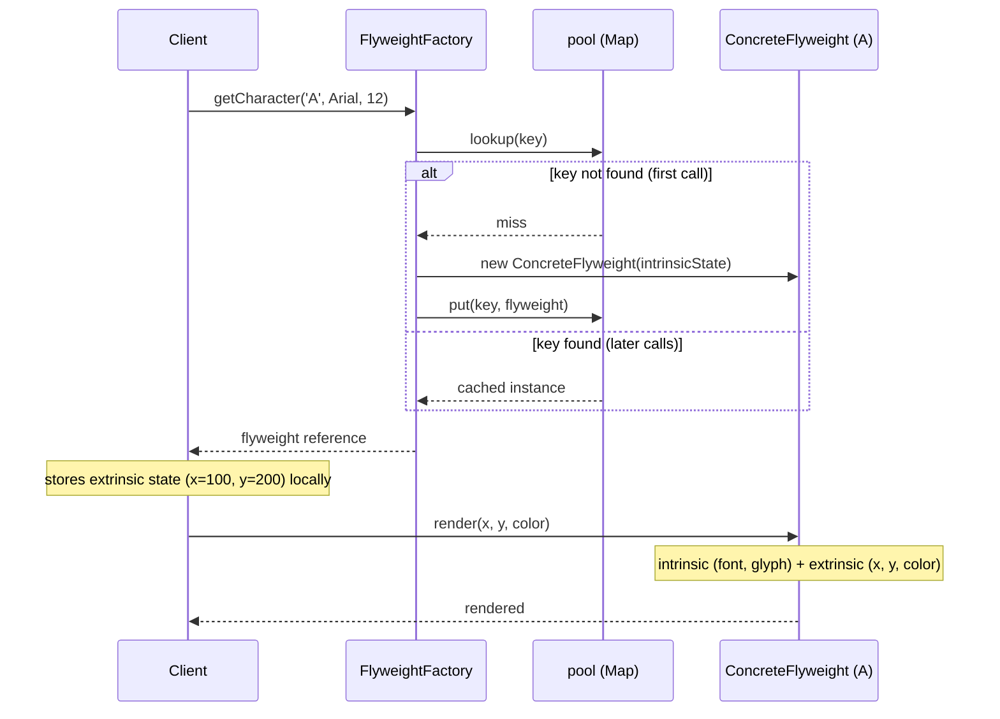

# Flyweight Pattern

## 1. Pattern Name & Category

**Pattern:** Flyweight
**Category:** Structural (GoF)
**GoF Classification:** Structural Design Pattern — Chapter 4 of "Design Patterns: Elements of Reusable Object-Oriented Software" by Gamma, Helm, Johnson, Vlissides.

---

## 2. Intent

Use sharing to support a large number of fine-grained objects efficiently, by separating intrinsic (shared, immutable) state from extrinsic (context-specific) state.

---

## Intuition

> **One-line analogy**: Flyweight is like font rendering — you don't create a new "A" character object for every "A" in a 100-page document. Instead, you share one "A" object (shared intrinsic state: shape, style) and only remember its position in each document (extrinsic state: context-specific).

**Mental model**: When you have a huge number of similar objects, most of their state is identical across instances. Flyweight separates the state into intrinsic (shared, immutable — stored in the Flyweight) and extrinsic (unique per instance — passed in at use time). You maintain a pool (factory) of Flyweight instances; clients look up or create one and pass the extrinsic state at call time.

**Why it matters**: Flyweight can reduce memory usage dramatically for object-heavy scenarios — game engines (millions of tree/particle objects), text editors (millions of character objects), browsers (many DOM nodes sharing style data). Without it, 1M similar objects = 1M × object_size memory; with Flyweight, potentially 1M × extrinsic_data_size + few × intrinsic_data_size.

**Key insight**: Flyweight trades code complexity (you must separate state into intrinsic/extrinsic) for memory efficiency. Only apply it when you actually have massive numbers of similar objects AND memory is a bottleneck — don't apply it prematurely.

---

## 3. Problem Statement

### The Problem
Some applications require a very large number of objects — potentially millions. Creating a distinct object for each unit of data causes severe memory pressure. If many of these objects share the same core data, maintaining separate copies is wasteful. The challenge is: how do you support a large number of granular objects without running out of memory?

### Scenario
Consider a text editor rendering a 500-page document. Each character on the screen is an object with properties like:
- **Character code** (e.g., 'A', 'b', '3') — same across all 'A's in the document
- **Font family** (e.g., "Arial") — same for all characters in a paragraph
- **Font size** (e.g., 12pt) — same for a section
- **Position on screen** (x, y) — unique per character instance
- **Color** — may vary

A 500-page document might have 1,500,000 characters. If each character is a full object carrying font, size, and color data, this becomes hundreds of MB just for character objects. However, the font/size/style data is *repeated* across millions of characters — it does not need to be stored per-character.

---

## 4. Solution

Split the character object's state into two categories:
- **Intrinsic state**: Data that is shared and immutable — character code, font family, font size, style. Store this *once* in a shared Flyweight object.
- **Extrinsic state**: Data that is context-specific — position (x, y), color override. This is *not* stored in the Flyweight; it is passed in by the client at render time.

A **FlyweightFactory** manages a pool of Flyweight objects keyed by their intrinsic state. When a client requests a character, the factory returns the existing shared Flyweight if it exists, or creates and caches a new one. The client holds a reference to the shared Flyweight plus stores its own extrinsic state separately. Memory for common character types is allocated only once regardless of how many times they appear.

---

## 5. UML Structure



The `FlyweightFactory` is the single gatekeeper to `Flyweight` instances — `ConcreteFlyweight` and `UnsharedConcreteFlyweight` both realize the `Flyweight` interface, while `Client` holds a shared reference and supplies extrinsic state on every call instead of storing it inside the flyweight.

---

## 6. How It Works — Step-by-Step

1. **Client requests a Flyweight** from the FlyweightFactory, providing the intrinsic state key (e.g., `factory.getCharacter('A', "Arial", 12)`).
2. **Factory checks its pool** (a HashMap): if a Flyweight with that key exists, it returns the cached instance.
3. **If not found**, the factory creates a new ConcreteFlyweight, stores it in the pool, and returns it.
4. **Client stores extrinsic state** (e.g., position x=100, y=200) in its own data structure (e.g., a list of character positions).
5. **When rendering**, the client calls `flyweight.render(x, y, color)` — passing extrinsic state as parameters.
6. **The Flyweight uses its intrinsic state** (font, character code) combined with the passed extrinsic state to perform the operation.
7. The same ConcreteFlyweight instance handles thousands of render calls for the character 'A' — one object, many contexts.

The class diagram in §5 shows *what* the roles are; the sequence below shows *when* they talk to each other — two successive calls to `getCharacter('A', Arial, 12)`, the first a pool miss (create + cache) and the second a pool hit (instant reuse):



Only the first request for a given intrinsic-state key pays the creation cost; every later call for the same key — even from a different position on the page — is a pool hit that returns the identical shared `ConcreteFlyweight`.

---

## 7. Key Components

| Role | Description |
|------|-------------|
| **Flyweight (interface/abstract)** | Declares the interface through which Flyweights can receive and act on extrinsic state. |
| **ConcreteFlyweight** | Implements Flyweight, stores intrinsic state. Must be shareable — must not maintain extrinsic state. |
| **UnsharedConcreteFlyweight** | Not all Flyweights need to be shared. Some may hold combined state and not participate in sharing (optional). |
| **FlyweightFactory** | Creates and manages the pool of Flyweight objects. Ensures flyweights are shared correctly. Returns existing instances or creates new ones. |
| **Client** | Maintains references to Flyweights, computes or stores extrinsic state, and passes it to Flyweights when invoking operations. |

---

## 8. When to Use

Use Flyweight when **ALL** of the following are true:
- The application uses a **large number** of objects (thousands to millions).
- **Storage costs are high** due to the sheer quantity of objects.
- **Most object state can be made extrinsic** (moved outside the object and passed in).
- **Many groups of objects share the same intrinsic state** and can be replaced by a smaller set of shared objects.
- The application does not depend on object identity — two flyweights with the same intrinsic state are interchangeable.

### Examples
- Text editors rendering characters
- Game engines rendering trees, particles, bullets, enemies of the same type
- GUI frameworks managing icons, cursors, or repeated UI components
- Network applications managing connection objects or protocol state
- Database connection pools (a form of flyweight for connections)

---

## 9. When NOT to Use

- **When objects have mostly unique state**: If every object has fundamentally different intrinsic data, there is nothing to share — the pattern adds complexity without benefit.
- **When object count is small**: The factory overhead (hashing, lookups) outweighs savings for small numbers of objects.
- **When object identity matters**: If clients need to distinguish between two 'A' characters (e.g., for selection or mutation), sharing breaks the model.
- **When extrinsic state is expensive to pass**: If extrinsic state is large or complex, passing it on every method call offsets the memory savings.
- **When mutability is required**: Flyweights should be immutable (intrinsic state must not change). If objects need to change their core state, flyweight is inappropriate.

---

## 10. Pros

- **Dramatic memory reduction**: Sharing objects that would otherwise be duplicated millions of times can reduce memory by orders of magnitude.
- **Improved performance for large datasets**: Fewer object allocations means less GC pressure and better cache locality.
- **Centralized intrinsic state management**: The factory becomes the single source of truth for shared state.
- **Transparent to clients**: Clients interact with flyweights via a standard interface and may not even know sharing is happening.
- **Scales well**: Memory consumption grows with the number of *unique* intrinsic states, not total object count.
- **Works well with Factory and Pool patterns**: Combines naturally with object pools for lifecycle management.

---

## 11. Cons

- **Increased complexity**: The separation of intrinsic/extrinsic state complicates the design and is non-obvious to developers unfamiliar with the pattern.
- **Extrinsic state management burden**: The client must track and pass extrinsic state on every call — this responsibility is shifted to the caller.
- **Immutability requirement**: Flyweights must be immutable, which can be restrictive in domains where objects naturally need to change.
- **Factory overhead**: The FlyweightFactory adds a lookup cost (hash map get) on every object request.
- **Debugging difficulty**: Because objects are shared, it is harder to associate a flyweight with a specific context during debugging.
- **Concurrency concerns**: Shared mutable state in flyweights (even accidentally) creates race conditions in multi-threaded environments.

---

## 12. Tradeoffs

| You Gain | You Lose |
|----------|----------|
| Massive memory savings for large object counts | Code complexity — intrinsic/extrinsic separation is not obvious |
| Reduced GC pressure | Extrinsic state management is now the client's responsibility |
| Ability to support millions of objects | Shared objects cannot carry mutable per-instance state |
| Centralized shared data (single source of truth) | Debugging is harder — one object serves many contexts |
| Better CPU cache performance | Factory lookup overhead on every object retrieval |

---

## 13. Common Pitfalls

1. **Storing extrinsic state inside the Flyweight**: This breaks sharing — each "shared" object ends up holding context-specific data and you cannot share it. Always pass extrinsic state as method parameters.
2. **Making Flyweights mutable**: If a client modifies a flyweight (e.g., changes font size), it accidentally affects every other client sharing that flyweight. Enforce immutability with `final` fields and no setters.
3. **Forgetting to use the factory**: Clients that `new` their own Flyweights bypass sharing entirely — the pattern provides zero benefit. Always go through the FlyweightFactory.
4. **Not synchronizing the factory in concurrent environments**: The factory's pool (HashMap) must be thread-safe. Use `ConcurrentHashMap` or synchronize the `getFlyweight` method.
5. **Over-applying the pattern**: Using Flyweight for small object counts adds complexity with no benefit. Profile memory usage first to confirm the problem exists.
6. **Confusing Flyweight with Singleton**: Singleton ensures one instance globally. Flyweight ensures one instance *per unique intrinsic state* — there can be many flyweight instances, just not duplicated ones.

---

## 14. Real-World Usage

### Production Anchor: Text Rendering Engine for a Game UI

A 2D game renders chat, HUD, and dialogue text — up to 10M on-screen character instances per frame at 60 FPS (16ms frame budget). Naive approach: each character is an object holding font face, bitmap, advance width, kerning table — about 2KB per glyph. 10M × 2KB = 20GB. Impossible.

Flyweight approach: `GlyphData` (font face + codepoint + bitmap + metrics) is shared. The font has 256 unique codepoints used in this scene; 256 × 2KB = 512KB total. Each on-screen character is a tiny `GlyphInstance(glyph, x, y, color)` of ~24 bytes. Total: 10M × 24 = 240MB for instances + 512KB for glyphs. 80x memory reduction. JLS §5.1.7 mandates the analogous behavior for `Integer.valueOf(127)` returning a cached instance.

**The idea behind it.** Stated as a formula, Flyweight replaces `N × S_total` with
`U × S_intrinsic + N × S_extrinsic` — "pay for the heavy shared part once per *distinct* value
instead of once per *instance*." The saving is driven entirely by the ratio `N / U`: the more
instances collapse onto the same few distinct values, the closer total memory falls to just the
per-instance extrinsic bytes.

| Symbol | What it is |
|--------|-----------|
| `N` | Total object instances live at once — 10M on-screen characters here |
| `U` | Number of *distinct* intrinsic values — 256 unique codepoints in this scene |
| `S_intrinsic` | Bytes of shareable, immutable state per distinct value — 2KB of glyph bitmap/metrics |
| `S_extrinsic` | Bytes of per-instance state that cannot be shared — 24 bytes of `(x, y, color)` |
| `N / U` | Sharing factor — how many instances reuse each flyweight; the whole source of the win |

**Walk one example.** The 10M-character frame from above, both ways:

```
given   N           = 10,000,000 instances
        U           =        256 distinct glyphs
        S_intrinsic =      2,048 bytes  (2 KB per glyph)
        S_extrinsic =         24 bytes  (x, y, color)

naive       N x S_total = 10,000,000 x 2,048      = 20,480,000,000 B = 20.48 GB
flyweight   U x S_intrinsic =    256 x 2,048      =        524,288 B =  0.52 MB
          + N x S_extrinsic = 10,000,000 x 24     =    240,000,000 B =    240 MB
                                            total =    240,524,288 B = 240.5 MB

reduction   20,480,000,000 / 240,524,288                             = 85.1x

sharing factor  N / U = 10,000,000 / 256                             = 39,062 instances/glyph
```

Result: 20.48GB collapses to 240.5MB — the difference between an OOM kill and a frame that fits
in RAM. Notice that the shared glyph table is only 0.52MB of the 240.5MB total: past a sharing
factor this large, essentially *all* remaining memory is extrinsic state, so further shrinking
`S_intrinsic` buys nothing and shrinking `S_extrinsic` buys everything.

This is also why the sharing factor, not the object count, decides whether Flyweight pays. If
those 10M characters used 10M distinct glyphs (`N / U = 1`), the formula degenerates to
`N × (S_intrinsic + S_extrinsic)` — strictly *worse* than the naive version by the extra
indirection and the factory's hash lookups.

```
   Intrinsic (shared, immutable)              Extrinsic (per-instance, passed in)
   ----------------------------                ----------------------------------
        GlyphData                                     GlyphInstance
   +---------------------+   <-- referenced by --+   +-----------------+
   | codepoint: 'A'      |                       |   | glyph: ref -----+--> shared
   | bitmap: byte[2048]  |                       |   | x, y: float     |
   | advance: 12.5       |                       |   | color: int      |
   | kerningTable: ...   |                       |   +-----------------+
   +---------------------+                       |
                                                 |   ...(10M instances)
              Factory (cache)                    |
   +-------------------------------+             |
   | ConcurrentHashMap<Key,Glyph>  |  computeIfAbsent
   +-------------------------------+
```

```java
// Intrinsic state — shared, immutable Flyweight
public final class GlyphData {
    private final char codepoint;
    private final FontFace font;
    private final byte[] bitmap;            // 2KB pre-rendered glyph
    private final float advance;
    private final Map<Character, Float> kerning;     // immutable

    GlyphData(char cp, FontFace font, byte[] bitmap, float advance,
              Map<Character, Float> kerning) {
        this.codepoint = cp;
        this.font = Objects.requireNonNull(font);
        this.bitmap = bitmap;                        // never exposed mutably
        this.advance = advance;
        this.kerning = Map.copyOf(kerning);
    }

    // Anti-pattern fix #1: render() takes extrinsic state as PARAMETERS,
    // does NOT store position or color in the shared object.
    public void render(GraphicsContext g, float x, float y, int rgba) {
        g.drawBitmap(bitmap, x, y, rgba);
    }
    public float advance() { return advance; }
}
```

```java
// Thread-safe factory — anti-pattern fix #2: ConcurrentHashMap + computeIfAbsent
public final class GlyphFactory {
    private final ConcurrentMap<Key, GlyphData> cache = new ConcurrentHashMap<>();
    private final GlyphRasterizer rasterizer;          // expensive: ~5ms per glyph

    public GlyphFactory(GlyphRasterizer r) { this.rasterizer = r; }

    public GlyphData get(FontFace font, char codepoint) {
        // computeIfAbsent guarantees the rasterizer runs AT MOST ONCE per key,
        // even under heavy parallel access from multiple render threads.
        return cache.computeIfAbsent(new Key(font, codepoint),
                k -> rasterizer.rasterize(k.font, k.codepoint));
    }

    public int size() { return cache.size(); }

    private record Key(FontFace font, char codepoint) {}
}

// BROKEN equivalent for contrast:
// if (!cache.containsKey(key)) cache.put(key, new GlyphData(...));   // TOCTOU race
// Two threads can both see the key absent, both rasterize (5ms x 2 = 10ms wasted CPU),
// and both create distinct GlyphData objects — silently defeating the Flyweight.
```

```java
// Hot path — render loop frame, 16ms budget
public final class TextRenderer {
    private final GlyphFactory factory;

    public void renderText(String text, FontFace font, float startX, float baselineY,
                           int rgba, GraphicsContext g) {
        float x = startX;
        char prev = 0;
        for (int i = 0; i < text.length(); i++) {
            char c = text.charAt(i);
            GlyphData glyph = factory.get(font, c);              // O(1) cache hit
            if (prev != 0) x += glyph.kerningOffset(prev);
            glyph.render(g, x, baselineY, rgba);                  // extrinsic state passed in
            x += glyph.advance();
            prev = c;
        }
    }
}
```

### Famous Codebase Usages

- **`Integer.valueOf(int)`** — JLS §5.1.7 mandates caching for -128..127 (boundary can be raised via `-Djava.lang.Integer.IntegerCache.high=1023`). `Integer a = 127; Integer b = 127; a == b` is true; for 128, false. This is the canonical built-in Flyweight.
- **`String.intern()`** — the JVM string pool. All string literals are auto-interned at class load; programmatic interning via `s.intern()`. Backing store is a native hash table in the JVM.
- **`Boolean.valueOf(boolean)`** — only ever returns `Boolean.TRUE` or `Boolean.FALSE`; two instances total in the JVM.
- **`Byte.valueOf`, `Short.valueOf`, `Character.valueOf`, `Long.valueOf`** — caches over standard ranges (-128..127 for Byte/Short/Long; 0..127 for Character).
- **Enum constants** — each enum value is effectively a Flyweight; `Color.RED == Color.RED` always, no matter how often referenced.
- **`java.util.regex.Pattern.compile(regex)`** — applications typically cache compiled patterns (the JDK caches a small number internally for `String.matches`-style helpers).
- **AWT `java.awt.Font`** — `Font.getFont(attrs)` returns a shared instance for matching attributes.
- **Game engines** (Unity sprite atlases, Unreal texture references) — texture/mesh resources shared across thousands of entities; per-entity state holds only transform + tint.

### Anti-patterns

**1. Storing extrinsic state inside the Flyweight**
```java
// BROKEN — position becomes part of the "shared" object; sharing destroyed
public final class GlyphData {
    private final byte[] bitmap;
    public float x, y;                              // <-- extrinsic stored intrinsically
    public int color;
    public void render(GraphicsContext g) { g.drawBitmap(bitmap, x, y, color); }
}
// Now each character needs its own GlyphData (because x/y differ); 10M × 2KB = 20GB. Back to square one.

// FIX — keep Flyweight immutable; pass extrinsic state as parameters
public final class GlyphData {
    private final byte[] bitmap;
    public void render(GraphicsContext g, float x, float y, int color) {
        g.drawBitmap(bitmap, x, y, color);          // extrinsic = arguments
    }
}
```

**2. Non-thread-safe factory**
```java
// BROKEN — TOCTOU race; rasterizer runs twice, defeating Flyweight
public GlyphData get(FontFace font, char cp) {
    Key key = new Key(font, cp);
    if (!cache.containsKey(key)) {                  // check
        GlyphData g = rasterizer.rasterize(font, cp); // ~5ms
        cache.put(key, g);                          // put — but another thread already put a different instance
    }
    return cache.get(key);
}
// Under 4 render threads doing first-frame glyph loads, you can see 200+ duplicate rasterizations.
// Wasted CPU: ~1 second of work at startup.

// FIX — ConcurrentHashMap.computeIfAbsent guarantees at-most-once compute per key
return cache.computeIfAbsent(key, k -> rasterizer.rasterize(k.font, k.codepoint));
```

**3. Applying Flyweight where objects aren't actually shared**
```java
// BROKEN — "Flyweight" for user sessions, each of which has unique state
public final class SessionFlyweight {
    private static final Map<UUID, SessionFlyweight> cache = new ConcurrentHashMap<>();
    public static SessionFlyweight get(UUID id) {
        return cache.computeIfAbsent(id, k -> new SessionFlyweight(k));
    }
    // Sessions are never reused — the "cache" just grows forever. This is a memory leak masquerading as Flyweight.
}

// FIX — Flyweight is for *intrinsic, shared, immutable* state. Sessions are extrinsic and unique;
// just allocate them normally and rely on eviction (LRU cache or session timeout).
public final class Session {
    private final UUID id; private final Instant createdAt; /* extrinsic per-user state */
}
// Use Caffeine: Caffeine.newBuilder().maximumSize(100_000).expireAfterAccess(30, MINUTES).build();
```

### Performance and Correctness Numbers

- Memory: 10M character instances × 24 bytes (GlyphInstance) + 256 shared glyphs × 2KB = 240MB + 0.5MB. Without Flyweight: ~20GB. 80x reduction; the difference between "fits in RAM" and "OOM kill".
- Glyph rasterization: 5ms per glyph; under a 4-thread render warmup, naive code rasterizes each glyph 1-4 times. `computeIfAbsent` reduces this to exactly once — saving ~1s of wall-clock startup time for a 256-glyph font.
- Frame render time with Flyweight: cache hit lookup ~30ns; rendering 1000 characters/frame stays well within the 16ms (60 FPS) budget — actual render time ~2.4ms.
- `Integer.valueOf` cache hit ratio in typical autoboxing-heavy code (loop counters, small ints): >95%. Disabling the cache (`IntegerCache.high=-1`) measurably increases GC pressure in benchmarks.

### Migration Story

The initial renderer allocated a fresh `Glyph` object per character per frame — 600k allocations/second triggered minor GCs every 200ms, causing visible frame-time spikes (jitter from 16ms baseline to 80ms during GC). Profiling with Java Flight Recorder showed `Glyph.<init>` as the #1 allocation site. The team split intrinsic/extrinsic state (GlyphData vs GlyphInstance), introduced the `ConcurrentHashMap`-backed factory, and saw allocation rate fall from 600k/s to ~1k/s for in-game text. GC pauses disappeared from the frame-time histogram. The factory cache size stabilized at ~400 entries (covering the multilingual UI), confirming the upper bound was a function of distinct codepoints, not user activity.

---

## 15. Comparison with Similar Patterns

| Pattern | Purpose | Key Difference |
|---------|---------|----------------|
| **Singleton** | Ensures one global instance | Flyweight has one instance *per unique state*; Singleton has one global instance regardless |
| **Prototype** | Creates objects by cloning | Prototype *creates copies*; Flyweight *shares* the same instance across contexts |
| **Object Pool** | Reuses expensive objects | Pool manages object lifecycle (checkout/return); Flyweight focuses on sharing read-only intrinsic state |
| **Proxy** | Controls access to one object | Proxy wraps *one* object for access control; Flyweight manages a *pool of shared* objects |
| **Composite** | Composes objects into trees | Composite structures hierarchy; Flyweight optimizes memory for large numbers of leaf nodes — often used together |

---

## 16. Interview Tips

**Q: Explain the Flyweight pattern with a real example.**
A: Use Java's `Integer.valueOf()` cache — it is concrete, well-known, and perfectly illustrates intrinsic state (the int value) that is shared. Then explain the text editor scenario for depth.

**Q: What is intrinsic vs extrinsic state?**
A: Intrinsic state is stored inside the flyweight — it is context-independent and shared. Extrinsic state is context-dependent — it changes with each use and is passed to the flyweight by the client. This separation is the core insight of the pattern.

**Q: How does Flyweight differ from Singleton?**
A: Singleton ensures ONE instance total. Flyweight ensures ONE instance per unique intrinsic state — there can be many flyweight types but no duplicates within a type.

**Q: What are the risks of using Flyweight?**
A: Extrinsic state management complexity, immutability constraints, factory thread safety, and the risk of accidentally storing extrinsic state inside the flyweight.

**Q: Is Java's String pool a Flyweight?**
A: Yes — it is a great example. String literals with the same value share the same object in the string pool. `"hello" == "hello"` is true because they are the same flyweight instance.

**Q: What happens if you accidentally put mutable or extrinsic state into a shared Flyweight?**
A: It causes silent data corruption shared across every context that references the flyweight, because one client's "private" change becomes visible to all others. For example, if `GlyphData` exposed a mutable `public int color` field and the render loop set `glyph.color = rgba` before calling `render()`, two threads rendering different colored characters that map to the same glyph would race — one thread's color overwrite would bleed into the other's output, and the bug would only appear under concurrent rendering, making it hard to reproduce. The practical guidance is to never give a flyweight a setter or a non-final field for anything that varies per use; if a value varies per call, it must be a method parameter, not a field.

**Q: How does Flyweight differ from object pooling — aren't they both about saving memory by reusing objects?**
A: They share the goal of reducing object overhead but use opposite mechanisms — Flyweight shares *immutable* objects concurrently across many contexts, while an object pool *reuses* mutable objects one at a time via checkout/return. A `ConcurrentHashMap<Key, GlyphData>` flyweight cache returns the *same* `GlyphData` instance to thousands of callers simultaneously, and none of them ever "give it back" because there's nothing to return — it's permanently shared. A connection pool (e.g., HikariCP), by contrast, hands out a `Connection` to exactly one caller at a time; that caller mutates it (executes queries, sets autocommit) and must return it to the pool before another caller can use it. The practical guidance is: reach for Flyweight when the shared data is read-only and reach for pooling when the object has expensive-to-construct state that must be exclusively owned during use.

**Q: Why are concurrent factory caches typically built with `ConcurrentHashMap.computeIfAbsent` instead of `synchronized` blocks or `HashMap` with manual locking?**
A: Because `computeIfAbsent` provides an atomic check-then-create operation that guarantees the expensive creation logic (e.g., glyph rasterization, regex compilation) runs at most once per key even under heavy concurrent access, without holding a coarse lock across the whole map for the duration of every lookup. A naive `if (!cache.containsKey(key)) cache.put(key, create())` is a classic TOCTOU (time-of-check-to-time-of-use) race — multiple threads can pass the check simultaneously and each perform the expensive creation, producing duplicate flyweight instances that defeat the entire pattern. `ConcurrentHashMap.computeIfAbsent` uses per-bucket locking internally (since Java 8), so unrelated keys don't contend at all, and the mapping function for a given key is guaranteed to execute only once. The practical guidance is to make `computeIfAbsent`'s mapping function side-effect-free and fast-failing, since the map holds an internal lock for that bucket while it runs — a slow or blocking mapping function can stall other threads requesting the same key.

**Q: Give concrete numbers for Java's built-in Flyweight caches — what's the default range and how can it be tuned?**
A: `Integer.valueOf(int)` caches boxed integers from -128 to 127 by default (256 instances total), as mandated by JLS §5.1.7, and `Character.valueOf` caches 0-127; the upper bound for `Integer` can be raised with the JVM flag `-Djava.lang.Integer.IntegerCache.high=1023` for workloads with many small positive integers (e.g., HTTP status-code-like values or array indices). Outside this range, every autoboxing operation (`Integer i = 200;`) allocates a fresh `Integer` object, which is why `Integer.valueOf(127) == Integer.valueOf(127)` is `true` but `Integer.valueOf(128) == Integer.valueOf(128)` is `false` — a classic interview trap when comparing boxed integers with `==` instead of `.equals()`. The practical guidance is to never rely on `==` for boxed numeric comparison regardless of cache range, since the cache is an implementation optimization, not a language guarantee for values outside -128..127.

**Q: When does applying Flyweight add complexity without real benefit?**
A: When the object count is small (hundreds, not hundreds of thousands or millions) or when intrinsic state is mostly unique across instances, the factory's lookup/hashing overhead and the intrinsic/extrinsic separation cost more in code complexity than the memory saved. For example, building a `ConcurrentHashMap`-backed flyweight factory for 50 configuration objects that are each only created once at startup adds an indirection layer, a cache-key design problem, and immutability constraints — for a memory saving measured in kilobytes. The practical guidance is to profile actual memory usage first (e.g., with JFR or a heap dump) and confirm that duplicated objects are a measurable fraction of heap before introducing Flyweight; if the savings would be under 1MB or the object count is under ~10,000, plain `new` is simpler and just as correct.

---

## Cross-Perspective: HLD Connections

**HLD View — Where Flyweight Appears in Distributed Systems**

- **Connection pooling** — A connection pool is a Flyweight registry: physical DB connections (heavy, shared state) are pooled; callers borrow and return them. The intrinsic state (driver config, credentials) is shared; the extrinsic state (current transaction) is per-caller.
- **Compiled regex caching** — API gateways and validation services compile regex patterns once and cache them as Flyweights. Re-compiling on every request would waste CPU; sharing the compiled pattern across threads is safe because `Pattern` is immutable.
- **Shared config objects** — Stateless microservices share a single immutable `AppConfig` Flyweight across all request-handling threads. No per-request config copy is needed; thread safety comes from immutability.
- **HTTP thread pool** — Worker threads in a thread pool are Flyweights: the pool maintains a fixed set of threads (shared, expensive objects); request context (the extrinsic state) is passed in per task, not stored on the thread.

---

## 17. Best Practices

1. **Make Flyweights strictly immutable**: Use `final` fields for all intrinsic state. Provide no setters. This guarantees thread safety and safe sharing.
2. **Always use the FlyweightFactory**: Never allow direct instantiation of Flyweights. Make constructors package-private or private and enforce factory access.
3. **Use thread-safe collections in the factory**: `ConcurrentHashMap` or `computeIfAbsent` for lock-free creation of new flyweights in concurrent environments.
4. **Clearly separate intrinsic and extrinsic state in documentation**: Comment which fields are intrinsic (stored) vs which are extrinsic (passed as parameters). This prevents future developers from accidentally adding extrinsic fields.
5. **Profile before applying**: Only apply Flyweight after measuring a real memory problem. Premature optimization with Flyweight adds significant complexity.
6. **Consider using records (Java 16+)**: Java records are immutable by design and work excellently as flyweights. Their structural equality also aids key-based caching.
7. **Design the extrinsic state API carefully**: Passing 10 parameters as extrinsic state to every method call is unwieldy. Consider grouping extrinsic state into a context/render-context object.
