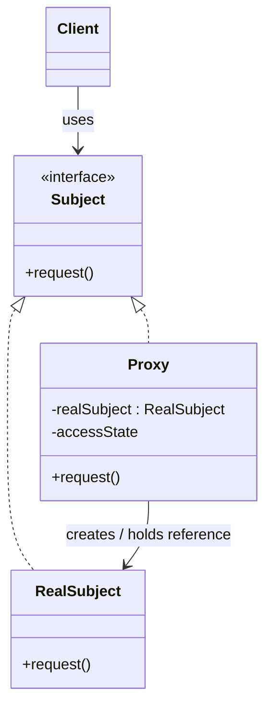
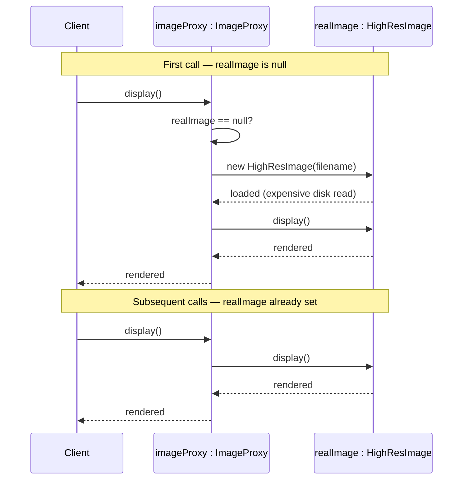
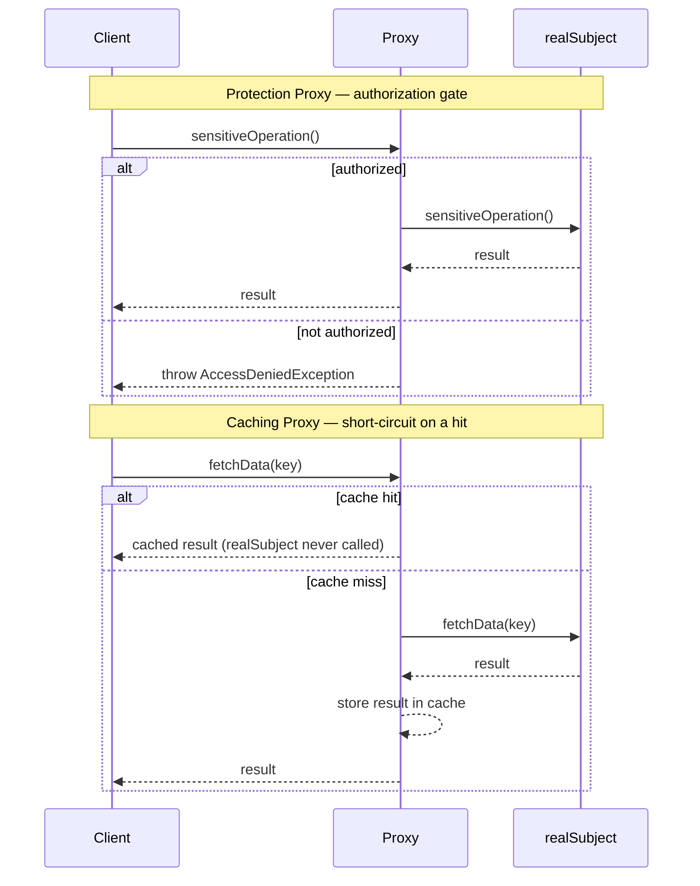
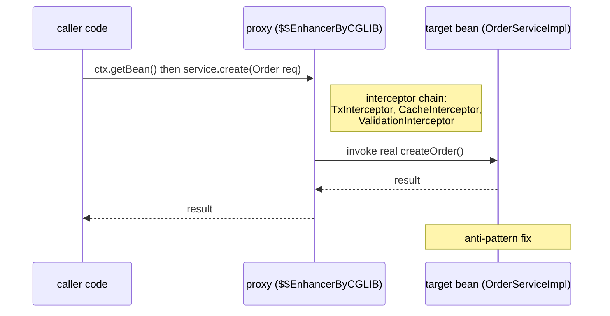

# Proxy Pattern

## 1. Pattern Name & Category

**Pattern:** Proxy
**Category:** Structural (GoF)
**GoF Classification:** Structural Design Pattern — Chapter 4 of "Design Patterns: Elements of Reusable Object-Oriented Software" by Gamma, Helm, Johnson, Vlissides.

---

## 2. Intent

Provide a surrogate or placeholder for another object to control access to it — adding behavior such as lazy initialization, access control, logging, caching, or remote communication without the real object or client knowing.

---

## Intuition

> **One-line analogy**: A Proxy is like a secretary who intercepts calls to the boss — screening callers, scheduling, or handling simple requests without disturbing the boss. The caller thinks they're talking to the boss; the secretary controls access.

**Mental model**: You want to control access to an object — delay creation until needed (virtual proxy), check permissions before delegating (protection proxy), log or cache calls (smart proxy), or communicate with remote objects (remote proxy). The Proxy implements the same interface as the real object, so clients don't know they're using a proxy. All control logic lives in the proxy.

**Why it matters**: Proxies are ubiquitous in frameworks — Spring's `@Transactional` and `@Cacheable` use dynamic proxies; Hibernate's lazy loading uses proxies to defer database queries; React's virtual DOM is a proxy for the real DOM. Understanding proxies explains how many "magic" framework features work.

**Key insight**: Proxy and Decorator are structurally identical (both wrap and delegate), but their intent differs. Proxy controls access to the real subject; Decorator adds new behavior. A proxy always has a reference to the real object it controls; a Decorator may be composed without knowing the final component.

---

## 3. Problem Statement

### The Problem
Sometimes you need to control access to an object because:
- The object is **expensive to create** and should be instantiated lazily.
- The object is on a **remote server** and network calls need to be abstracted.
- Access to the object needs to be **restricted** based on permissions.
- You need to **log, cache, or count** access without modifying the real object.
- The object's interface needs to be preserved while **adding pre/post-processing**.

Directly modifying the target object to add these concerns violates the Single Responsibility Principle and Open/Closed Principle.

### Scenario
Your application loads high-resolution images for display. Each image is 5–10 MB and takes 2 seconds to load from disk. The user opens a document with 50 embedded images. Loading all 50 images on startup takes 100 seconds and uses 500 MB of memory, but the user may only view 3 images during the session. The real `HighResImage` object is too expensive to create eagerly — but you still need an object to represent each image in the document's image list.

---

## 4. Solution

Create a **Proxy** class that implements the same interface as the real object (`Image`). The proxy holds a reference to the real object but starts with it uninitialized. When the client first accesses a method that requires the real object (e.g., `display()`), the proxy instantiates the real object and delegates the call. For subsequent calls, the real object is already loaded. The client holds a reference to `Image` — it cannot tell whether it has a proxy or the real object.

---

## 5. UML Structure



Client, RealSubject, and Proxy all program to the same `Subject` interface — Proxy realizes it exactly like RealSubject does, but internally holds a reference to (and can lazily create) the RealSubject it wraps, mediating every call before optionally delegating to it.

**Proxy Types Structural Variants:**

```
Virtual Proxy:   Proxy creates RealSubject lazily on first call
Remote Proxy:    Proxy handles network communication to a remote RealSubject
Protection Proxy: Proxy checks permissions before forwarding
Caching Proxy:   Proxy stores results and returns cache on repeated calls
Logging Proxy:   Proxy logs before/after delegating
Smart Reference: Proxy performs ref-counting, locking, or loading
```

---

## 6. How It Works — Step-by-Step

### Virtual Proxy (Lazy Loading)
1. Client is given an `ImageProxy` that implements `Image`. The real `HighResImage` is NOT loaded yet.
2. `imageProxy.display()` is called.
3. Proxy checks: is `realImage == null`? Yes — proxy creates `new HighResImage(filename)` (expensive load happens here, on demand).
4. Proxy calls `realImage.display()` and returns the result.
5. On subsequent calls to `display()`, `realImage != null`, so the proxy skips creation and delegates directly.



The first `display()` call pays the creation cost once — the proxy checks `realImage == null`, constructs the real object, then delegates. Every later call finds `realImage` already set and skips straight to delegation, which is the entire lazy-loading mechanic in one picture.

### Protection Proxy (Access Control)
1. Client calls `proxy.sensitiveOperation()`.
2. Proxy checks the caller's role/permissions.
3. If authorized: delegates to `realSubject.sensitiveOperation()`.
4. If not authorized: throws `AccessDeniedException` or returns an error — `realSubject` is never touched.

### Caching Proxy
1. Client calls `proxy.fetchData(key)`.
2. Proxy checks its internal cache for `key`.
3. Cache hit: return cached result immediately — `realSubject` is never called.
4. Cache miss: delegate to `realSubject.fetchData(key)`, store result in cache, return.



The two mechanics are easy to confuse but branch on different things: a Protection Proxy is a gate that can reject a call before `realSubject` is ever touched, while a Caching Proxy is a wrapper that short-circuits on a hit but still delegates (and remembers the result) on a miss.

---

## 7. Key Components

| Role | Description |
|------|-------------|
| **Subject (interface/abstract)** | The common interface implemented by both RealSubject and Proxy. The client programs to this interface. |
| **RealSubject** | The actual object doing the work. May be expensive, remote, or sensitive. |
| **Proxy** | Implements Subject. Holds a reference to RealSubject. Controls access, adds behavior, and delegates to RealSubject. |
| **Client** | Uses the Subject interface. Is unaware of whether it holds a Proxy or RealSubject. |

---

## 8. When to Use

### Virtual Proxy
- Lazy loading of expensive resources (images, database connections, large files, API responses).
- Defer object creation until first access.

### Remote Proxy
- Representing an object that lives in a different process, JVM, or server (RMI, gRPC stubs, REST client wrappers).

### Protection Proxy
- Implementing access control without modifying the real object (RBAC, authentication checks).
- Different clients need different levels of access to the same service.

### Caching Proxy
- Caching results of expensive operations without modifying the real object.
- Memoization at the access layer.

### Logging / Monitoring Proxy
- Adding observability (logging, metrics, tracing) to an existing service without touching its code.
- AOP (Aspect-Oriented Programming) proxies for cross-cutting concerns.

### Smart Reference
- Adding reference counting, lock management, or copy-on-write semantics.

---

## 9. When NOT to Use

- **When direct access is fine**: If the object is cheap, always available, and access control is not needed, a proxy just adds indirection with no benefit.
- **When you can modify the class**: If you control the source code and can add the needed behavior directly (without violating SRP), do that instead.
- **When performance is critical in a tight loop**: Each proxy call adds a method dispatch. In hot paths with millions of calls per second, this overhead may matter.
- **When it leads to proxy proliferation**: If you need 10 different proxies for the same object, consider AOP or a decorator chain instead.

---

## 10. Pros

- **Lazy initialization**: Expensive objects are created only when needed, saving startup time and memory.
- **Access control without modifying the real object**: Security/authorization logic lives in the proxy, keeping RealSubject clean.
- **Transparent to clients**: Clients use the same interface regardless of whether they have a proxy or real object.
- **Open/Closed Principle**: New behavior (caching, logging) is added via a new proxy class without modifying existing code.
- **Single Responsibility**: Access control, caching, and logging concerns are separated from the real object's domain logic.
- **Remote access abstraction**: Remote proxies hide the complexity of network communication from clients.
- **Testability**: Proxy interface makes it easy to swap real objects with test doubles.

---

## 11. Cons

- **Increased number of classes**: Each proxied interface requires a new Proxy class — this proliferates in large codebases.
- **Response time latency**: The extra indirection adds latency. For remote proxies, the overhead can be significant (network serialization).
- **Complexity**: The pattern is simple in concept but can become complex when proxies are chained or when the Subject interface is large.
- **Interface explosion**: If the Subject has many methods, the Proxy must implement (and delegate) all of them — even if it only cares about one.
- **Dynamic proxy maintenance**: When methods are added to the Subject interface, all Proxies must be updated.
- **Debugging difficulty**: Stack traces pass through the proxy layer, which can obscure where logic actually executes.

---

## 12. Tradeoffs

| You Gain | You Lose |
|----------|----------|
| Lazy/controlled access to expensive objects | Additional indirection on every call |
| Separation of cross-cutting concerns | More classes to maintain |
| Access control without modifying RealSubject | All interface methods must be delegated |
| Transparent caching/logging/monitoring | Harder to debug — stack traces include proxy frames |
| Remote access abstraction | Network latency cost for remote proxies |

---

## 13. Common Pitfalls

1. **Proxy does not implement the full Subject interface**: If the client casts to a specific method not in the interface, the illusion breaks. Always implement every method of the Subject interface.
2. **Circular initialization in Virtual Proxy**: The proxy creates the real object inside a method called during construction. Ensure lazy initialization only triggers on actual use, not during proxy creation.
3. **Not handling thread safety in lazy initialization**: `if (realObject == null) { realObject = new ... }` is a data race in multi-threaded code. Use double-checked locking with `volatile` or `AtomicReference`.
4. **Caching Proxy returning stale data**: A caching proxy must have a cache invalidation strategy. Without it, clients see stale results indefinitely.
5. **Protection Proxy checking wrong context**: Security checks must happen at the right level. Checking permissions in the proxy but not in the real object means direct-access bypasses the check entirely.
6. **Confusing Proxy with Decorator**: The proxy controls access to a specific real object; the Decorator adds new behavior and can wrap objects of any compatible type. Proxy focuses on access control and delegation; Decorator focuses on behavioral extension.

---

## 14. Real-World Usage

### Production Anchor: Spring AOP + Hibernate Lazy Loading

A typical Spring Boot service runs at ~20k `@Transactional` method invocations/sec across `OrderService`, `PaymentService`, `InventoryService`. Each call passes through a CGLIB-generated proxy that opens (or joins) a database transaction, executes the target method, then commits or rolls back. Per-call proxy overhead measured with JMH: ~1µs (one method-handle invocation + thread-local lookup for transaction state) — amortized below noise vs. typical 5-20ms DB query times. Bytecode generation cost is paid once per proxied class at startup (~5ms per class; ~150 classes ~ 750ms added to startup).

In parallel, Hibernate wraps every `@ManyToOne(fetch = LAZY)` association in a `HibernateProxy` (Javassist or ByteBuddy). `order.getCustomer()` returns the proxy immediately; the database is hit only when a field is touched (`customer.getName()`).



The caller obtains the CGLIB proxy via `ctx.getBean()`; the proxy runs its interceptor chain (transaction, cache, validation) before invoking the real `OrderServiceImpl` method. A self-invocation like `this.cachedMethod()` from inside the bean never reaches the proxy, so none of those interceptors run — the anti-pattern detailed later in this section.

```java
// Custom dynamic Protection Proxy via JDK Proxy
public interface DocumentService {
    Document read(String id);
    void write(String id, Document doc);
}

public final class RealDocumentService implements DocumentService {
    private final DocumentRepository repo;
    public RealDocumentService(DocumentRepository r) { this.repo = r; }
    public Document read(String id)              { return repo.find(id); }
    public void write(String id, Document doc)   { repo.save(id, doc); }
}

public final class AccessControlProxyFactory {
    public static DocumentService wrap(DocumentService target, AuthService auth) {
        return (DocumentService) Proxy.newProxyInstance(
            DocumentService.class.getClassLoader(),
            new Class<?>[]{ DocumentService.class },
            (proxy, method, args) -> {
                User u = AuthContext.current()
                    .orElseThrow(() -> new SecurityException("no auth context"));
                String permission = method.getName().equals("read") ? "DOC_READ" : "DOC_WRITE";
                if (!auth.hasPermission(u, permission, (String) args[0])) {
                    throw new AccessDeniedException(u + " lacks " + permission);
                }
                return method.invoke(target, args);
            });
    }
}
// Usage: DocumentService svc = AccessControlProxyFactory.wrap(real, auth);
//        svc.read("doc-42");   // proxy checks permission, then delegates
```

```java
// Virtual (lazy-loading) proxy — manually written for illustration
public final class LazyImageProxy implements Image {
    private final String path;
    private volatile Image real;            // double-checked locking with volatile (JMM-correct)

    public LazyImageProxy(String path) { this.path = path; }

    private Image load() {
        Image r = real;
        if (r == null) {
            synchronized (this) {
                r = real;
                if (r == null) real = r = new RealImage(path);   // 80ms disk load deferred
            }
        }
        return r;
    }
    @Override public void render(Canvas c) { load().render(c); }
    @Override public int width()           { return load().width(); }
    @Override public int height()          { return load().height(); }
}
```

```java
// Spring usage that triggers self-invocation bug + the fix
@Service
public class ReportService {
    @Autowired private ApplicationContext ctx;       // for the fix
    @Autowired private ReportRepository repo;

    public Report generateDaily(LocalDate d) {
        // BROKEN — self-invocation: `this.fetchExpensive` calls the raw method,
        // bypassing the @Cacheable proxy; cache is never populated.
        // List<Row> rows = this.fetchExpensive(d);

        // FIX — go through the proxy
        List<Row> rows = ctx.getBean(ReportService.class).fetchExpensive(d);
        return Report.of(d, rows);
    }

    @Cacheable(value = "rows", key = "#d")
    public List<Row> fetchExpensive(LocalDate d) {
        return repo.aggregate(d);                    // 2s query
    }
}
```

### Famous Codebase Usages

- **Spring AOP**: `org.springframework.aop.framework.JdkDynamicAopProxy` (interface-based) and `org.springframework.aop.framework.CglibAopProxy` (class-based). Activated by `@EnableTransactionManagement`, `@EnableCaching`, `@EnableAsync`. Default since Spring 4.x prefers CGLIB when targets aren't interface-based.
- **Hibernate**: `org.hibernate.proxy.HibernateProxy`, `org.hibernate.proxy.LazyInitializer`. `session.getReference(Order.class, id)` returns a proxy; `session.get(...)` returns the real entity.
- **JDK dynamic proxy**: `java.lang.reflect.Proxy.newProxyInstance(loader, interfaces, handler)`. Used by MyBatis mapper interfaces, Retrofit, OpenFeign, and JAX-WS clients.
- **RMI stubs**: `java.rmi.server.RemoteStub` (pre-JDK 5) and modern dynamic stubs — remote proxies that marshal calls over the wire.
- **gRPC stubs**: generated `*BlockingStub`/`*FutureStub` classes are remote proxies wrapping a `Channel`.
- **OpenFeign**: `feign.ReflectiveFeign` creates a JDK dynamic proxy per `@FeignClient` interface, routing methods to HTTP calls.
- **Spring Data JPA repositories**: every `JpaRepository` interface is a JDK dynamic proxy backed by `SimpleJpaRepository`.

### Anti-patterns

**1. Self-invocation bypassing the proxy**
```java
// BROKEN — common bug; @Cacheable silently does nothing
@Service public class PriceService {
    public BigDecimal totalFor(Order o) {
        BigDecimal unit = this.unitPrice(o.sku());   // <-- bypasses proxy: no caching!
        return unit.multiply(BigDecimal.valueOf(o.qty()));
    }
    @Cacheable("prices")
    public BigDecimal unitPrice(String sku) { return slowLookup(sku); }
}
// Symptom: cache stats show 0 hits forever; latency unchanged after adding @Cacheable.

// FIX A — inject self via context and call the proxy
@Service public class PriceService {
    @Autowired private ApplicationContext ctx;
    public BigDecimal totalFor(Order o) {
        BigDecimal unit = ctx.getBean(PriceService.class).unitPrice(o.sku());   // through proxy
        return unit.multiply(BigDecimal.valueOf(o.qty()));
    }
    @Cacheable("prices") public BigDecimal unitPrice(String sku) { return slowLookup(sku); }
}

// FIX B — use AopContext.currentProxy() (requires @EnableAspectJAutoProxy(exposeProxy = true))
((PriceService) AopContext.currentProxy()).unitPrice(o.sku());

// FIX C — split into two beans; cross-bean calls always go through proxies
@Service class PriceCalculator { @Autowired PriceLookup lookup; ... }
@Service class PriceLookup     { @Cacheable("prices") public BigDecimal unitPrice(String sku) {...} }
```

**2. JDK dynamic proxy on a concrete class (no interface)**
```java
// BROKEN — Proxy.newProxyInstance requires interfaces; target is a class
public class OrderService { public Order create(NewOrder n) { ... } }
OrderService proxy = (OrderService) Proxy.newProxyInstance(
    OrderService.class.getClassLoader(),
    new Class<?>[]{ OrderService.class },        // <-- not an interface
    handler);
// Runtime: java.lang.IllegalArgumentException: OrderService is not an interface

// FIX A — extract an interface
public interface OrderService { Order create(NewOrder n); }
public class OrderServiceImpl implements OrderService { ... }
OrderService proxy = (OrderService) Proxy.newProxyInstance(loader, new Class<?>[]{OrderService.class}, h);

// FIX B — use CGLIB (or in Spring: proxyTargetClass = true) to subclass the concrete class
Enhancer e = new Enhancer();
e.setSuperclass(OrderService.class);
e.setCallback(new MethodInterceptor() { ... });
OrderService proxy = (OrderService) e.create();
// Spring: @EnableTransactionManagement(proxyTargetClass = true)
```

**3. Non-serializable proxy in session replication**
```java
// BROKEN — CGLIB proxy stored in HttpSession; can't replicate across cluster nodes
@Service public class ShoppingCartService { ... }     // CGLIB-proxied bean
session.setAttribute("cart", shoppingCartService);    // fails on replication with NotSerializableException
// Failover to another Tomcat node loses the session.

// FIX — store the underlying domain object, not the proxied service
session.setAttribute("cartItems", cart.getItems());   // List<CartItem> — serializable POJO
// Reconstruct service-mediated views on the receiving node from the plain data.
// Rule of thumb: proxies are stateful infrastructure; never serialize them across processes.
```

### Performance and Correctness Numbers

- CGLIB proxy method dispatch: ~1µs per call (JMH on JDK 21). Negligible vs. 5-20ms typical DB query inside a `@Transactional` method.
- CGLIB bytecode generation: ~5ms per proxied class at startup; ~750ms total for a ~150-bean Spring service. Mitigated by AOT (Spring Boot 3 + GraalVM native image moves this to build time).
- JDK dynamic proxy dispatch: ~600ns per call — slightly faster than CGLIB but limited to interface targets.
- Hibernate lazy loading via proxy: zero DB I/O on `entity.getAssoc()`; one query on first field access. Saves N queries when N associations aren't traversed.
- Self-invocation bug found in production: a `@Cacheable` method called `this.helper()` instead of the proxied path; cache hit ratio was 0%, p99 latency was 800ms instead of the expected 12ms. Fix dropped p99 to 14ms.

### Migration Story

A monolith was being decomposed into services. The legacy `BillingFacade` had `@Transactional` on 30 methods, but a refactor moved internal helpers into the same class — and many of them called each other via `this.helper()`. After the refactor, transaction boundaries quietly broke: helpers ran outside a transaction even though they appeared annotated. Production alerts fired when a downstream DB constraint violation surfaced (an update that should have rolled back the parent transaction did not). The team fixed it in three phases: (1) emergency hotfix using `AopContext.currentProxy()` on the 6 hottest paths; (2) longer-term split of `BillingFacade` into `BillingOrchestrator` and `BillingOperations` so cross-bean calls always traverse proxies; (3) added a custom ArchUnit rule banning `this.` calls to `@Transactional`/`@Cacheable` methods within the same class. Zero recurrences in the 18 months since.

---

## 15. Comparison with Similar Patterns

| Pattern | Purpose | Key Difference |
|---------|---------|----------------|
| **Decorator** | Adds behavior to an object dynamically | Decorator adds *new functionality*; Proxy *controls access* to existing functionality. Decorator is applied to behavior; Proxy is applied to access/lifecycle. |
| **Adapter** | Converts one interface to another | Adapter changes the interface; Proxy preserves the same interface. |
| **Facade** | Simplifies access to a *subsystem* | Facade wraps many classes; Proxy wraps *one* object. |
| **Flyweight** | Shares objects to save memory | Flyweight focuses on memory optimization; Proxy focuses on access control/interception. |

---

## 16. Interview Tips

**Q: What is the Proxy pattern and what are its types?**
A: Give the one-line intent, then list the 5 types: Virtual, Remote, Protection, Caching, Logging. Give one concrete example per type. Spring AOP covers Logging/Caching/Protection; Hibernate covers Virtual; RMI/gRPC covers Remote.

**Q: How does Spring implement `@Transactional`?**
A: Spring creates a proxy (JDK dynamic proxy or CGLIB proxy) around the bean. When a `@Transactional` method is called, the proxy intercepts it, opens a transaction, delegates to the real method, and commits or rolls back based on the outcome. This is the Proxy pattern in practice.

**Q: What is the difference between Proxy and Decorator?**
A: Both wrap an object with the same interface. The key difference is intent: Proxy controls *access* (lazy init, auth, remote, caching); Decorator *adds new behavior* (additional formatting, logging in a chain). A Decorator is applied from the outside by the client to add capability; a Proxy is often transparent and managed by a framework.

**Q: How do you implement a thread-safe Virtual Proxy in Java?**
A: Use double-checked locking with a `volatile` field, or use `AtomicReference` with `compareAndSet`, or use `Supplier<T>` with lazy initialization (`Lazy<T>`).

**Q: Can you use Java's built-in dynamic proxy?**
A: Yes — `java.lang.reflect.Proxy.newProxyInstance()` creates a proxy at runtime. You provide an `InvocationHandler` that intercepts all method calls. The limitation is that it only works for interfaces, not concrete classes (use CGLIB for class-based proxies).

**Q: What is the "self-invocation" problem with Spring AOP proxies, and why does it happen?**
A: Self-invocation occurs when a method on a Spring bean calls another `@Transactional`, `@Cacheable`, or `@Async` method on `this` from within the same class, and the proxy's interception logic is silently skipped because the call never passes through the proxy object. Spring AOP proxies work by wrapping the *bean instance* — `ctx.getBean(PriceService.class)` returns the proxy, but inside `totalFor()`, `this` refers to the raw target object, so `this.unitPrice(sku)` is a plain Java method call that never reaches the `CacheInterceptor` or `TransactionInterceptor`. The symptom is that `@Cacheable` shows 0% hit rate or `@Transactional` rollback doesn't happen even though the annotation is present and correctly configured. The practical guidance is to either inject `ApplicationContext` and call `ctx.getBean(SelfType.class).method()`, enable `AopContext.currentProxy()` with `exposeProxy = true`, or — preferably — split the class so the annotated method lives on a different bean that is always called cross-bean (and therefore always through its proxy).

**Q: What's the difference between a JDK dynamic proxy and a CGLIB (or ByteBuddy) proxy?**
A: A JDK dynamic proxy (`java.lang.reflect.Proxy`) implements one or more *interfaces* at runtime and requires the target to have an interface to proxy against, whereas CGLIB/ByteBuddy generates a *subclass* of the target's concrete class at runtime, so it works even when there's no interface. JDK proxies dispatch through `InvocationHandler.invoke()` via reflection (~600ns/call); CGLIB generates real bytecode subclass methods that call a `MethodInterceptor` (~1µs/call, slightly slower due to larger generated classes but avoids reflection per-call). Spring Framework defaults to JDK proxies for beans that implement at least one interface and falls back to CGLIB for concrete classes — or you can force CGLIB everywhere with `@EnableTransactionManagement(proxyTargetClass = true)`. The practical guidance is: prefer programming to interfaces in Spring beans so JDK proxies are usable, but be aware that `final` classes and `final` methods cannot be proxied by CGLIB either (CGLIB can't override `final` methods), which is why `@Transactional` silently does nothing on a `final` method. See `../../../spring/spring_proxies/README.md` for the full JDK-vs-CGLIB mechanics.

**Q: What is `LazyInitializationException` and how does it relate to the Proxy pattern?**
A: `LazyInitializationException` is thrown by Hibernate when code tries to access a lazily-loaded association (a `HibernateProxy` standing in for the real entity) after the owning `Session`/`EntityManager` has already been closed. The proxy holds a reference to the session it was created with; calling `order.getCustomer().getName()` triggers the proxy to lazily fetch `Customer` from the database — but if the transaction/session already ended (e.g., the entity was returned from a `@Transactional` repository method and accessed later in a view layer), there's no session to query with, so the proxy throws instead of silently returning stale or null data. This is the most common Hibernate runtime exception in layered architectures ("the open session in view" anti-pattern is one workaround, though it has its own tradeoffs). The practical guidance is to either fetch eagerly with `JOIN FETCH` / `@EntityGraph` when you know the association will be needed, or access lazy associations only within the transactional boundary, or use DTO projections that don't carry lazy proxies past the service layer.

**Q: How do the four common proxy types differ in a way that's easy to confuse — give a concrete distinguishing example for each?**
A: Virtual, Remote, Protection, and Caching/Logging proxies all share the "implement Subject, hold a delegate, intercept calls" structure, but differ in *what triggers the extra work and when*. A **Virtual proxy** (e.g., `LazyImageProxy`, Hibernate's `HibernateProxy`) defers creation of an expensive object until first use — the extra work is *construction*, triggered once. A **Remote proxy** (e.g., a gRPC `BlockingStub`, an RMI stub) makes a local method call look like a network call — the extra work is *serialization + network I/O*, triggered on every call. A **Protection proxy** (e.g., the `AccessControlProxyFactory` example in this file) checks authorization before delegating — the extra work is a *permission check*, and it can short-circuit (throw) without ever touching the real subject. A **Caching/Logging proxy** (e.g., Spring's `@Cacheable` interceptor) either short-circuits with a stored result or wraps the call with before/after side effects — the extra work is *cache lookup or logging*, and unlike Protection, it usually still delegates (cache miss) or always delegates (logging). The practical guidance when asked to classify a proxy: ask "does it run once (Virtual), per network hop (Remote), as a gate that can reject (Protection), or as a wrapper that observes/short-circuits (Caching/Logging)?"

**Q: How much overhead does a proxy actually add, and when does it start to matter?**
A: For in-process proxies (JDK dynamic proxy or CGLIB), the overhead is roughly 600ns-1µs per call — dominated by an extra method dispatch (and reflection for JDK proxies) — which is negligible next to a 5-20ms database call but can become measurable in a tight loop calling a proxied method millions of times per second (e.g., a `@Cacheable`-annotated getter called inside a hot numeric loop). For remote proxies (gRPC stubs, RMI, REST clients), the overhead is dominated by serialization and network round-trip — typically 0.5-5ms even on a fast local network — which is why remote proxies should never be called in a per-element loop without batching. The practical guidance is to benchmark with JMH before assuming a proxy is "too slow" — in the vast majority of business-logic code the proxy overhead is in the noise, and the right question is usually "is this call remote or local," not "is this a proxy or not."

---

## Cross-Perspective: HLD Connections

**HLD View — Where Proxy Appears in Distributed Systems**

- **Service mesh sidecars** — Envoy and Linkerd proxies are the Proxy pattern at infrastructure scale: they intercept all inbound and outbound traffic for a service pod, adding retries, timeouts, mTLS, load balancing, and distributed tracing — completely transparent to the service code.
- **Circuit breaker** — A circuit breaker wraps service calls as a Proxy: in CLOSED state it passes through, in OPEN state it fails fast, in HALF-OPEN state it probes recovery. Resilience4j and Hystrix implement this as a proxy layer.
- **CDN edge node** — A CDN edge is a caching proxy: clients connect to the edge address; the edge either serves cached content or delegates to the origin. The URL is identical — the client has no knowledge of the proxy layer.
- **Spring AOP** — Spring's `@Transactional`, `@Cacheable`, and `@Async` annotations create JDK dynamic proxies or CGLIB subclass proxies that intercept method calls to add transaction management, caching, and async execution.

---

## 17. Best Practices

1. **Always program to the Subject interface**: Both the client and the proxy should use the interface, never the concrete class. This keeps the proxy transparent.
2. **Use Java dynamic proxies or CGLIB for large interfaces**: Manually delegating 20 methods in a proxy class is error-prone. Use `java.lang.reflect.Proxy` or AOP frameworks for interface-heavy proxies.
3. **Thread-safe lazy initialization**: Use `volatile` + double-checked locking or `AtomicReference` in virtual proxies. A non-thread-safe lazy proxy in a web application will cause race conditions.
4. **Cache invalidation strategy for caching proxies**: Always define TTL or event-based invalidation. An eternal caching proxy is a bug waiting to happen.
5. **Fail-fast in protection proxies**: Check permissions at the beginning of the method before any side effects. Never partially execute a privileged operation and then reject.
6. **Keep the proxy thin**: The proxy should add one concern (caching OR logging OR access control). Stacking multiple concerns into one proxy class violates SRP — chain multiple proxies or use AOP instead.
7. **Test the proxy and the real object independently**: Write unit tests for the RealSubject alone, and separate tests that verify the proxy's specific behavior (caching, auth) using a mock RealSubject.
