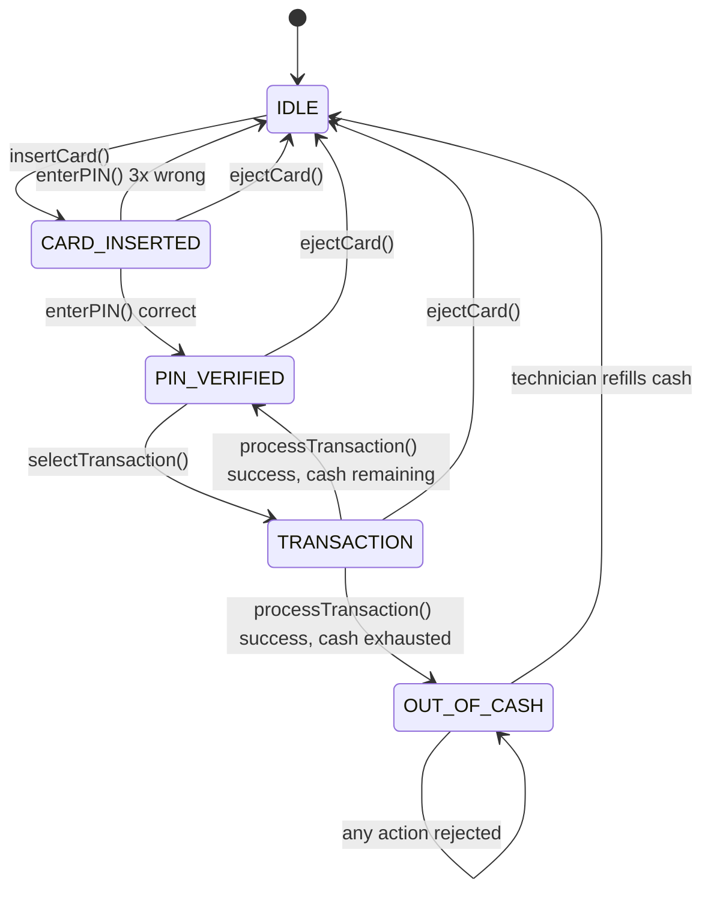
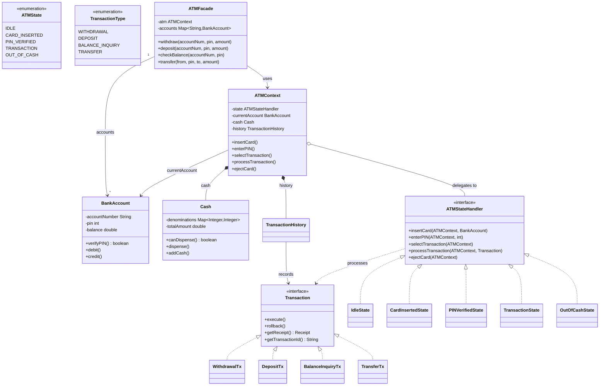
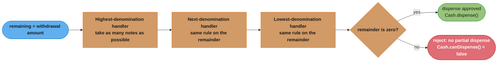
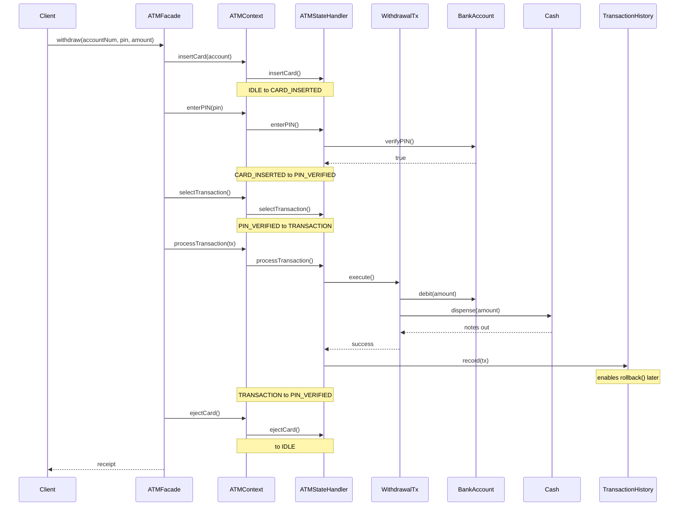

# ATM System — Low Level Design

## Intuition

> **One-line analogy**: ATM design is a state machine problem — the machine's response to every button press depends entirely on which state it's currently in, just like a traffic light ignores "go" requests when it's already green.

**Mental model**: An ATM has well-defined states (Idle → Card Inserted → PIN Verified → Transaction) and transitions between them are triggered by events (insertCard, enterPIN, selectTransaction). Without a State pattern, every operation becomes a maze of `if (state == X)` checks. With it, each state is an object that knows exactly what to do when any event fires — and invalid events are simply no-ops.

**Why it matters**: This problem exercises State pattern, Chain of Responsibility (for cash dispensing denominations), Command pattern (reversible transactions), and Observer (receipts). It's a rich pattern playground in a familiar real-world context.

**Key insight**: The cash dispensing algorithm (largest denomination first — greedy) and the lockout-after-3-failures logic are where most candidates stumble. Think through these edge cases before reaching for the keyboard.

---

## Problem Statement

Design an ATM (Automated Teller Machine) system that supports:
- Card insertion and PIN verification (with lockout after 3 failures)
- Withdrawals with denomination-aware cash dispensing
- Deposits, balance inquiries, and fund transfers
- Transaction receipts and an auditable transaction history with rollback capability
- Clean state management so invalid transitions (e.g., withdraw without a card) are silently rejected

The system must be extensible to support multi-currency ATMs, network timeouts, and card-skimming detection.

---

## State Transition Diagram (ASCII)

Five states, one absorbing state: `ejectCard()` and three wrong PIN attempts always fall back to `IDLE`, `processTransaction()` forks to `OUT_OF_CASH` the instant the cassette empties, and only a technician refill escapes `OUT_OF_CASH` — the table below is the authoritative version this diagram mirrors.

**Valid transitions summary:**

| Current State    | Action                  | Next State       |
|------------------|-------------------------|------------------|
| IDLE             | insertCard()            | CARD_INSERTED    |
| CARD_INSERTED    | enterPIN() [correct]    | PIN_VERIFIED     |
| CARD_INSERTED    | enterPIN() [3x wrong]   | IDLE             |
| CARD_INSERTED    | ejectCard()             | IDLE             |
| PIN_VERIFIED     | selectTransaction()     | TRANSACTION      |
| PIN_VERIFIED     | ejectCard()             | IDLE             |
| TRANSACTION      | processTransaction()    | PIN_VERIFIED / OUT_OF_CASH |
| TRANSACTION      | ejectCard()             | IDLE             |
| OUT_OF_CASH      | (any)                   | OUT_OF_CASH      |

---

## Class Diagram (ASCII)

State (`ATMStateHandler` + 5 handlers), Command (`Transaction` + 4 concrete transactions logged in `TransactionHistory` for rollback), and Facade (`ATMFacade`) collaborate here: the facade drives `ATMContext`, which delegates every call to whichever handler is currently active, and each concrete `Transaction` knows how to undo itself.

---

## Cash Dispensing Algorithm (Chain of Responsibility)

The Intuition section flags denomination-aware dispensing as a place candidates stumble: each denomination behaves like a handler in a chain, greedily taking as many notes as it can before passing the remainder to the next-smaller denomination.

This is exactly the `Cash.canDispense()` / `Cash.dispense()` pair from the class diagram above, made concrete: the ATM never partially dispenses, so a chain that bottoms out with a nonzero remainder must reject the whole withdrawal rather than hand over an incomplete stack of notes.

---

## Design Patterns Used

### 1. State Pattern
**Where:** `ATMStateHandler` interface + `IdleState`, `CardInsertedState`, `PINVerifiedState`, `TransactionState`, `OutOfCashState`.

**Why:** The ATM has sharply distinct phases. Instead of a giant `if/else` or `switch` on an enum, each state class encapsulates the exact behavior legal in that phase. Invalid actions print a message and do nothing — no exceptions, no enum checks scattered across the codebase.

**Key insight:** State objects hold no long-lived data (except `CardInsertedState.failedAttempts`) — they are essentially singletons per session and can be replaced by sharing instances if memory matters.

### 2. Command Pattern (with Rollback)
**Where:** `Transaction` interface + four concrete commands + `TransactionHistory`.

**Why:** Each transaction is an object that carries both its forward action (`execute()`) and its compensating action (`rollback()`). `TransactionHistory` acts as a command log, enabling:
- Full audit trail
- Single-step or bulk rollback
- Easy addition of new transaction types without modifying existing code

**Rollback note:** In a real ATM, physical cash cannot be "un-dispensed." The `rollback()` on `WithdrawalTransaction` models the account correction only; a separate reconciliation process handles the physical discrepancy.

### 3. Facade Pattern
**Where:** `ATMFacade`

**Why:** The raw ATM protocol requires 5 steps (insert → PIN → select → process → eject). The facade collapses these into single intent-expressing calls (`withdraw`, `deposit`, `transfer`, `checkBalance`), making integration tests and demos readable.

---

## Runtime Collaboration: A Withdrawal Walkthrough

The class diagram shows structure; this sequence shows the five-step protocol the Facade Pattern section describes above — insert, PIN, select, process, eject — collapsed by a single `ATMFacade.withdraw()` call, with the State pattern re-delegating at every step and the Command pattern logging the transaction for rollback.

Every `Ctx->>St` call is dispatched to whichever `ATMStateHandler` is currently installed — `IdleState`, then `CardInsertedState`, then `PINVerifiedState`, then `TransactionState` — the same field reassigned after each step, which is exactly what keeps `ATMContext` free of `if/else` state checks.

---

## Security Considerations

| Concern | Mitigation in this design |
|---|---|
| PIN exposure in logs | `verifyPIN()` returns a boolean; the PIN value is never logged or stored in any Receipt/History object |
| Brute-force PIN | `CardInsertedState` tracks `failedAttempts`; card is blocked and session cleared after 3 failures |
| Transaction limits | Add a `TransactionLimitPolicy` strategy per `BankAccount` — checked inside each concrete `Transaction.execute()` |
| Session timeout | Add a `ScheduledExecutorService` in `ATMContext`; on timeout call `ejectCard()` |
| Receipt information leakage | `Receipt` stores only the last 4 digits of the account number (`maskedAccount`) |
| Concurrent sessions | `ATMContext` is not thread-safe by design (one card at a time); add `ReentrantLock` around state transitions for concurrent access |

---

## Cross-Perspective: HLD Connections

**HLD View — Where ATM Design Scales to Distributed Systems**

- **State machine → distributed transaction state** — The ATM state machine (IDLE → CARD_INSERTED → PIN_VERIFIED → TRANSACTION) maps to distributed transaction state in payment systems (INITIATED → AUTHORIZED → CAPTURED → SETTLED). The Saga pattern coordinates these states across services.
- **Cash dispensing → limited resource allocation** — Denomination-aware cash dispensing maps to distributed resource allocation with constraints: inventory reservation systems, ticket allocation, hotel room booking all solve the "allocate limited discrete resources optimally" problem.
- **PIN lockout → distributed auth state** — The 3-attempt lockout requires shared state across ATM terminals. At HLD scale, this is stored in a distributed cache (Redis) so a user locked at one ATM is locked at all terminals — the same distributed state problem solved locally by the Singleton.
- **Transaction rollback → compensating transactions** — The ATM's rollback capability maps to the Saga pattern's compensating transactions: if cash dispenses but receipt printing fails, a compensation transaction reverses the account debit.

---

## Follow-Up Extensions

### Multi-Currency Support
- Add a `Currency` enum and a `CurrencyConverter` service.
- `Cash` becomes `Map<Currency, Map<Integer, Integer>>`.
- `BankAccount.balance` becomes `Map<Currency, Double>`.

### Card Skimming Detection
- Add a `FraudDetectionService` observer that `TransactionState.processTransaction()` notifies.
- Heuristics: transaction velocity (>N withdrawals in M minutes), geographical anomalies, amount patterns.
- On suspicion: block the card, transition to `IdleState`, alert the bank.

### Network Timeout Handling
- Wrap `Transaction.execute()` in a `CompletableFuture` with a timeout.
- On timeout: call `rollback()` to cancel any partial state change.
- Expose ATM state as `NETWORK_ERROR`; display "Please try again" message.
- Implement idempotency keys so a re-submitted transaction is not double-processed.

### Additional Patterns to Consider
- **Decorator** on `Transaction` for logging, encryption, or rate-limiting without modifying core logic.
- **Singleton** on `ATMContext` (one ATM machine per JVM process).
- **Template Method** in an abstract `AbstractTransaction` to enforce execute-then-receipt boilerplate.
