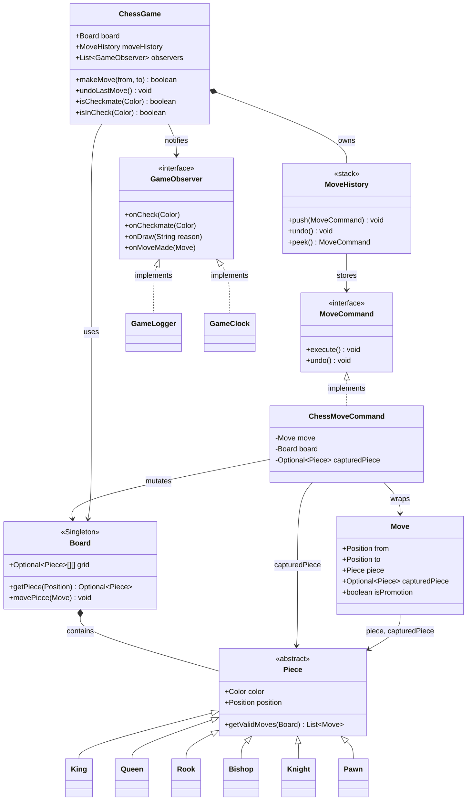
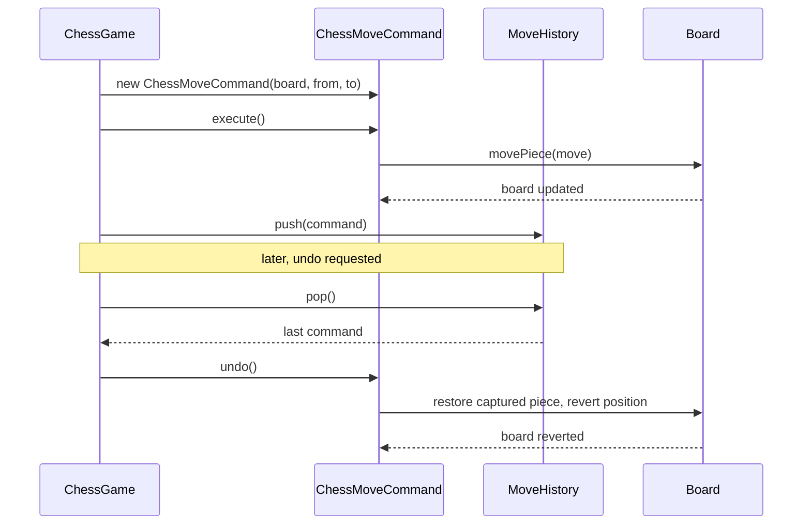
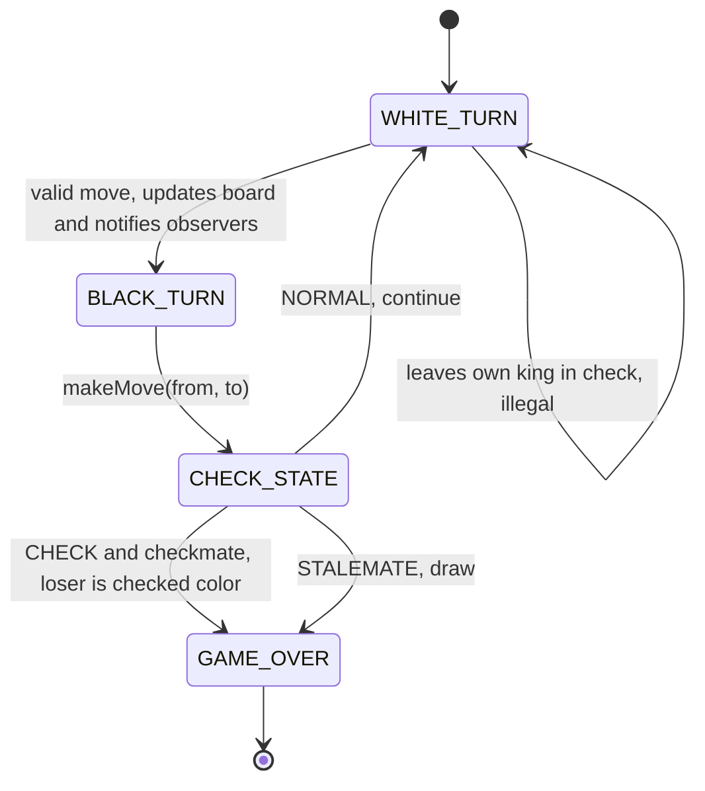

# Chess Game — Command + Observer + Singleton

## Intuition

> **One-line analogy**: Chess design is a Command pattern showcase — every move is an object that can be executed and undone, giving you a full undo stack for free.

**Mental model**: The board is a Singleton (one board per game). Each move (MoveCommand) encapsulates the source, destination, and captured piece — enough to both execute and undo the move. The move history is a stack of commands. Observers (game logger, clock, UI) react to events without being coupled to game logic. Piece subclasses (King, Queen, Rook, Bishop, Knight, Pawn) each implement their own `getValidMoves()` — the cleanest expression of polymorphism in the problem.

**Why it matters**: Chess exercises Command (undo/redo), Singleton (board), Observer (event notifications), and polymorphism (piece hierarchy) in a problem everyone understands. It's the go-to interview question for testing whether a candidate can model domain logic cleanly.

**Key insight**: The trickiest rules are special moves (castling, en passant, promotion) and check detection. In an interview, call them out explicitly and propose how you'd extend the design to support them — this signals design foresight without over-engineering upfront.

---

## Problem Statement

Design a Chess game system that:
- Manages a standard 8x8 chess board
- Supports all piece types with valid move generation
- Records move history with full undo capability
- Detects check, checkmate, and stalemate
- Notifies observers (loggers, UI, clock) of game events
- Supports time controls

---

## Class Diagram



Board is the Singleton container for every `Piece` on the grid; `MoveCommand`/`ChessMoveCommand` form the Command pattern's execute/undo contract, `MoveHistory` is the undo stack, and `GameObserver` decouples `ChessGame` from `GameLogger`/`GameClock`.

---

## Patterns Used

| Pattern | Where | Why |
|---------|-------|-----|
| **Command** | `MoveCommand`, `ChessMoveCommand`, `MoveHistory` | Encapsulates each move as an object; enables undo |
| **Observer** | `GameObserver`, `GameLogger`, `GameClock` | Notifies UI, logger, clock of events without coupling |
| **Singleton** | `Board` | Only one board per game; prevents duplicate state |

---

## Command Pattern — Undo Stack

```java
// Every move is wrapped in a Command
ChessMoveCommand move = new ChessMoveCommand(board, from, to);
move.execute();                  // applies the move
moveHistory.push(move);

// Undo: pops from stack and calls undo()
MoveCommand last = moveHistory.pop();
last.undo();                     // restores captured piece, reverts positions
```

The `undo()` in `ChessMoveCommand`:
1. Move piece back from destination to source position
2. Restore any captured piece to its original position
3. Revert pawn promotion (if applicable)
4. Update the board state



`ChessGame` drives execution through `ChessMoveCommand`, which mutates `Board` directly and is pushed onto `MoveHistory`; undo pops the same command and reverses it — the four steps listed above, made explicit as a call sequence.

---

## State Diagram: Piece Movement



Turns alternate between `WHITE_TURN` and `BLACK_TURN`; after each move the game evaluates CHECK / STALEMATE / NORMAL to decide whether to end in `GAME_OVER` or continue to the next turn.

---

## Move Validation Design

Each `Piece` subclass implements `getValidMoves(Board board)`:

```
Rook   → horizontal + vertical rays, stops at first occupied square
Bishop → diagonal rays, stops at first occupied square
Queen  → Rook + Bishop combined
Knight → L-shapes (8 possible), can jump over pieces
King   → 1 step any direction, cannot move into check
Pawn   → forward 1 (or 2 from start), captures diagonally, en passant
```

Legal move filter (applied on top of piece movement):
- A move is **legal** only if it does not leave the moving player's king in check
- Achieved by: simulate the move on a copy, then check if king is in check

---

## Check Detection

```java
boolean isInCheck(Color color) {
    Position kingPos = board.findKing(color);
    // Check if any opponent piece can attack the king's position
    return board.getAllPieces(opponent(color))
               .stream()
               .flatMap(p -> p.getValidMoves(board).stream())
               .anyMatch(move -> move.getTo().equals(kingPos));
}
```

---

## Design Decisions

**Q: Why Singleton for Board?**
A chess game has exactly one board. Using Singleton prevents multiple board instances and the consistency bugs that would cause. In tests, the Singleton is reset between games.

**Q: Why Command for moves instead of just calling methods directly?**
Command enables undo/redo without keeping a parallel copy of the board state. Each Command knows how to reverse itself. Also enables: move serialization (save/load), move replay, algebraic notation export.

**Q: Why Observer for game events?**
The game logic should not know about logging, UI updates, or clock management. Observer decouples these cross-cutting concerns. New features (move sound effects, network broadcast) add a new Observer class without touching `ChessGame`.

---

## Cross-Perspective: HLD Connections

**HLD View — Where Chess Design Scales to Distributed Systems**

- **Command + undo → CQRS + event sourcing** — The chess move history (a Command stack) maps to event sourcing at HLD scale. Every move is an immutable event; replaying the event log from any point reconstructs the board state. CQRS separates the command (make move) from the query (display current board).
- **Board Singleton → shared mutable state problem** — The Singleton board is fine for a local game. A distributed multiplayer game cannot use a local Singleton — the board state must be stored in a shared, consistent store (Redis, DynamoDB) with optimistic locking to prevent conflicting moves from concurrent players.
- **Observer → real-time game sync** — Move notifications to the logger, UI, and clock via Observer map to WebSocket push for real-time game state synchronization to both players' browsers and to spectators at HLD scale.
- **Move history → audit log** — The Command history is an audit log. At HLD scale, every game action is appended to an immutable audit log (Kafka topic, DynamoDB stream), enabling game replay, anti-cheat analysis, and undo-up-to-N-moves features.

---

## Follow-Up Extensions

1. **AI player**: `Strategy` pattern — `RandomStrategy`, `MinimaxStrategy`, `AlphaBetaStrategy`
2. **Save/Load game**: `Memento` pattern — serialize the full game state
3. **Online multiplayer**: Network proxy for remote player moves
4. **Opening book**: Pre-defined move sequences loaded from database
5. **PGN export**: Convert `MoveHistory` to Portable Game Notation
6. **Draw offers**: State machine for draw negotiation
7. **Time pressure**: `GameClock` Observer handles flag fall (time loss)

---

## Complexity

| Operation | Time Complexity |
|-----------|----------------|
| Move validation | O(P × M) where P=pieces, M=max moves per piece |
| Check detection | O(P × M) — check all opponent moves |
| Checkmate detection | O(L × P × M) where L=legal moves for all pieces |
| Undo | O(1) — pop from stack, restore state |

---

## Interview Discussion Points

- **How would you represent the board?** 2D array (8x8) with `Optional<Piece>` or nullable references. Alternatively, bitboards for performance (chess engines).
- **How do you prevent memory leaks in MoveHistory?** Cap history size or use WeakReferences if RAM is a concern.
- **How would you scale this to millions of concurrent games?** Stateless game logic, game state in Redis, horizontal scaling.
- **How do you test this system?** Unit test each piece's move generation, integration test check/checkmate detection with known positions.
