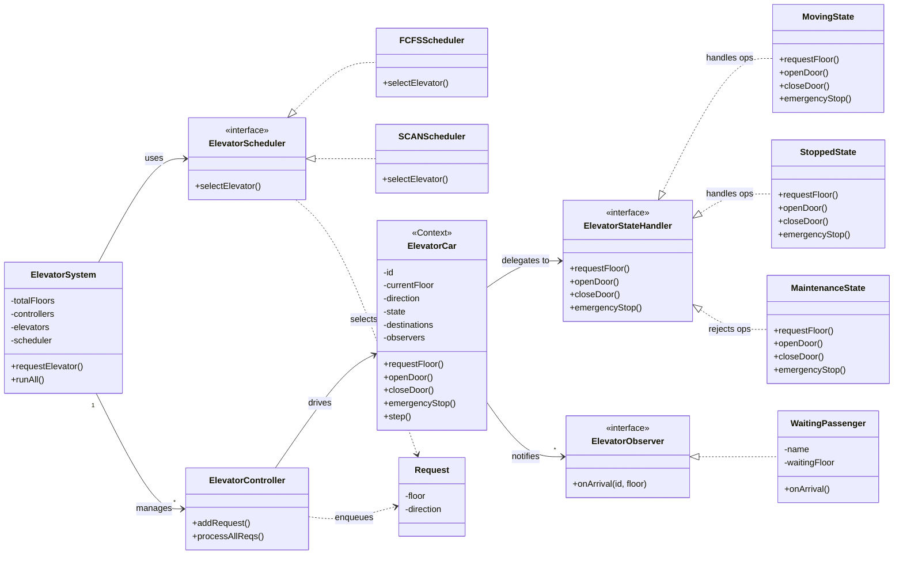
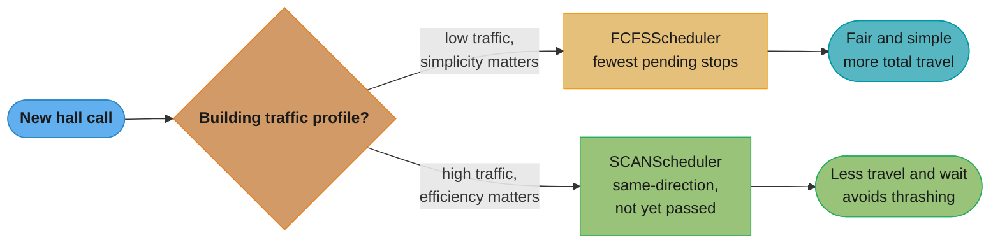
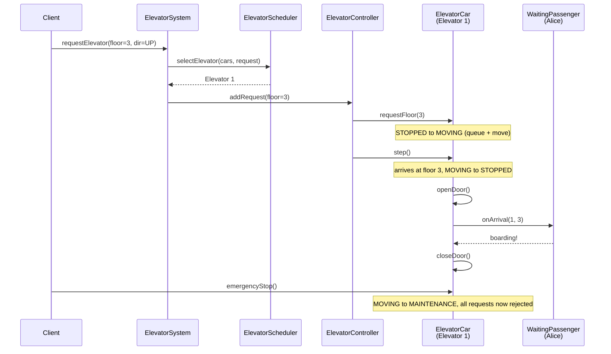
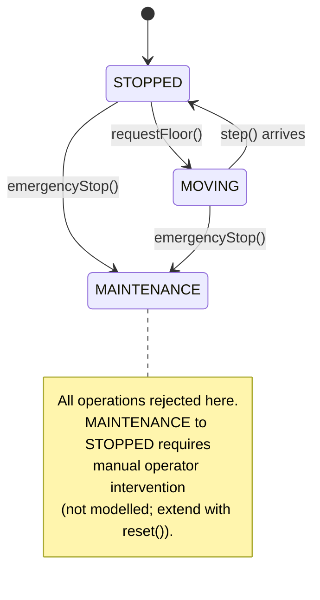

# Elevator System — Low-Level Design

## Intuition

> **One-line analogy**: Elevator design is a scheduling problem in a state machine costume — the real challenge isn't modeling the elevator, it's deciding which elevator should answer which call.

**Mental model**: Each elevator is a state machine (Stopped ↔ Moving ↔ Maintenance). Hall calls (floor buttons) and cabin calls (destination buttons) arrive as requests. The dispatcher must assign each hall call to the optimal elevator using a pluggable algorithm — FCFS (simple), SCAN (elevator algorithm — go in one direction until no more calls, then reverse), or Look (like SCAN but reverses early). The key insight is separating the elevator's own state from the scheduling strategy.

**Why it matters**: This problem exercises State pattern (elevator states), Strategy pattern (scheduling algorithms), Observer pattern (passenger notifications), and Command pattern (queued requests). It demonstrates how to combine multiple patterns coherently.

**Key insight**: The hardest design decision is the dispatch interface — `ElevatorScheduler.assignElevator(List<Elevator>, Request)`. Get this abstraction right and swapping algorithms becomes trivial. Get it wrong and every algorithm change requires touching `ElevatorCar`.

---

## Problem Statement

Design an elevator system for an N-floor building with M elevators that can:
- Accept hall calls (person at a floor pressing UP/DOWN)
- Accept cabin calls (person inside pressing a destination floor)
- Dispatch the optimal elevator using a pluggable scheduling algorithm
- Model elevator lifecycle states (moving, stopped, maintenance)
- Notify waiting passengers when their elevator arrives
- Handle emergency stops gracefully

---

## Requirements

### Functional
1. Multiple elevators operating independently in the same building
2. Two types of requests: hall call (floor + direction) and cabin call (destination floor)
3. Pluggable scheduling: FCFS and SCAN (elevator algorithm) implementations
4. State machine per elevator: STOPPED ↔ MOVING, either can → MAINTENANCE
5. Observer notifications to passengers when elevator arrives at their floor
6. Reject requests to elevators in MAINTENANCE state

### Non-Functional
- Scheduler is swappable at runtime without restarting
- States are self-contained objects — adding a new state requires no changes to `ElevatorCar`
- Each elevator processes its queue sequentially (extensible to concurrent)

---

## ASCII Class Diagram



*`ElevatorSystem` uses a swappable `ElevatorScheduler` to pick a car, then hands the request down through `ElevatorController` to the chosen `ElevatorCar`; the car delegates every state-dependent call to its current `ElevatorStateHandler` (State pattern) and fans arrivals out to every registered `ElevatorObserver` (Observer pattern).*

---

## Patterns Used

### 1. State Pattern — `ElevatorCar`
**Why**: An elevator's behaviour depends heavily on its current state. Without the State pattern, `ElevatorCar` would be riddled with `if (state == MOVING) { ... } else if (state == STOPPED) { ... }` branches in every method.

**How**: `ElevatorStateHandler` interface defines `requestFloor`, `openDoor`, `closeDoor`, `emergencyStop`. Three concrete states each implement appropriate behaviour or log a refusal:

| Operation      | STOPPED           | MOVING              | MAINTENANCE       |
|----------------|-------------------|---------------------|-------------------|
| requestFloor   | Queue + → MOVING  | Queue only          | Reject            |
| openDoor       | Open + notify     | Reject (unsafe)     | Reject (locked)   |
| closeDoor      | Close             | Already closed      | Reject (locked)   |
| emergencyStop  | → MAINTENANCE     | Stop + MAINTENANCE  | No-op             |

---

### 2. Strategy Pattern — `ElevatorScheduler`
**Why**: Different buildings need different dispatch algorithms. SCAN reduces total travel distance for high-traffic buildings; FCFS is simpler and fairer for low-traffic scenarios. The algorithm should be swappable without touching `ElevatorSystem`.

| Scheduler    | Algorithm                                                       | Best for                |
|--------------|-----------------------------------------------------------------|-------------------------|
| FCFSScheduler| Assign to elevator with fewest pending stops                    | Low traffic, simplicity |
| SCANScheduler| Prefer same-direction elevator that hasn't passed the floor yet | High traffic, efficiency|



*Same decision the "Best for" column states above, walked as a path: low-traffic buildings take the simpler FCFS branch, high-traffic buildings route to SCAN for the travel-distance win quantified in the SCAN vs FCFS scenario below.*

---

### 3. Observer Pattern — `ElevatorObserver` / `WaitingPassenger`
**Why**: Passengers waiting at a floor need to know when an elevator arrives. The elevator shouldn't depend on who is waiting.

**How**: `ElevatorCar` maintains a list of `ElevatorObserver`s. On each `openDoor()` call (from `StoppedState`), it calls `notifyObservers(currentFloor)`. Each `WaitingPassenger` checks if the arrived floor matches their waiting floor.

---

## Runtime Collaboration: Hall Call to Notification

The three patterns above are static structure; here is one hall call traced dynamically end-to-end, matching the `Sample Output` trace further down this file.



*Strategy (`ElevatorScheduler`) picks the car, State (`ElevatorCar`'s current handler) governs whether `requestFloor`/`openDoor`/`emergencyStop` are honoured at each step, and Observer (`onArrival`) fans the arrival out to `WaitingPassenger` Alice — the same three patterns from the class diagram, now shown collaborating at runtime.*

---

## State Transition Diagram



*STOPPED and MOVING cycle into each other on every `requestFloor()` queue-and-move and every arrival, but `emergencyStop()` from either one is a one-way trip into MAINTENANCE, where `ElevatorStateHandler` rejects every operation; recovery back to STOPPED is deliberately left unmodelled — extend with a `reset()` method gated by operator authentication.*

---

## SCAN vs FCFS Tradeoffs

```
Scenario: 3 elevators at floors 1, 5, 8. Request at floor 6 (UP).

FCFS: picks elevator with fewest pending stops → might pick E1 (floor 1)
      even though E2 (floor 5, moving UP) is already en route.
      Cost: 5 floors of unnecessary travel.

SCAN: detects E2 is moving UP and hasn't passed floor 6.
      Assigns to E2. Cost: 1 floor of travel.
      Result: significantly less energy and wait time.

Scenario: rush hour — many requests spread across all floors.
SCAN excels by batching same-direction stops (like a disk seek algorithm).
FCFS can cause thrashing (elevators reversing direction constantly).
```

---

## Cross-Perspective: HLD Connections

**HLD View — Where Elevator Design Scales to Distributed Systems**

- **Scheduling algorithm → distributed task scheduler** — The elevator scheduling strategy (FCFS, SCAN, Look) maps directly to distributed task scheduling (Kubernetes scheduler, AWS Batch, Celery). The core problem — assign work to the best available worker considering current load and proximity — is identical at both scales.
- **State machine per elevator → state per worker node** — Each elevator's state machine (STOPPED / MOVING / MAINTENANCE) maps to the state of a distributed worker: IDLE / PROCESSING / DRAINING / OFFLINE. The same transition logic (reject requests in MAINTENANCE) applies to worker draining during rolling deployments.
- **Observer notifications → event-driven service health** — Passenger notification when the elevator arrives maps to service health events in distributed systems: webhooks, WebSocket pushes, or SNS notifications when an asynchronous job completes.
- **Dispatcher interface → pluggable scheduler** — The `ElevatorScheduler` interface that the dispatcher uses maps to a pluggable scheduler interface in Kubernetes, allowing custom schedulers for specialized workloads (GPU, large memory, specific node pools).

---

## Follow-Up Extensions

1. **Emergency / Fire mode** — on fire alarm, all elevators ignore cabin calls, proceed to ground floor, open doors, and lock in MAINTENANCE state.

2. **Load balancing** — track passenger count (or weight sensor). Prevent elevators from accepting new hall calls above a load threshold.

3. **VIP floors** — certain floors (penthouse, executive) require keycard authentication before the cabin button is accepted. Model as a decorator around `requestFloor()`.

4. **Predictive dispatch** — use historical traffic patterns (rush hour models) to pre-position elevators before demand peaks.

5. **Concurrent requests** — use a `BlockingQueue<Request>` per elevator and a dedicated thread per `ElevatorController` for real-time simulation.

6. **Destination dispatch** — passengers enter their destination floor at the hall panel; the system groups passengers going to the same floor into one elevator, minimising stops.

---

## Sample Output

```
--- Hall calls ---
[System] Request(floor=3, dir=UP) → assigned to Elevator 1
  [Elevator 1 | STOPPED] Floor 3 added. Starting movement.
  [Elevator 1] State: STOPPED → MOVING
[System] Request(floor=7, dir=DOWN) → assigned to Elevator 2
  [Elevator 2 | STOPPED] Floor 7 added. Starting movement.

--- Processing all requests ---
[Controller] Elevator 1: processing queue
  [Elevator 1] Arrived at floor 3 (dir=UP, remaining=[6])
  [Elevator 1] State: MOVING → STOPPED
  [Elevator 1 | STOPPED] Doors opening at floor 3.
  [Passenger Alice] Elevator 1 arrived at floor 3 — boarding!
  [Elevator 1 | STOPPED] Doors closing.
...

--- Emergency stop on Elevator 1 ---
  [Elevator 1 | MOVING] EMERGENCY STOP at floor 6!
  [Elevator 1] State: MOVING → MAINTENANCE
  [Elevator 1 | MAINTENANCE] Cannot accept requests.
```
