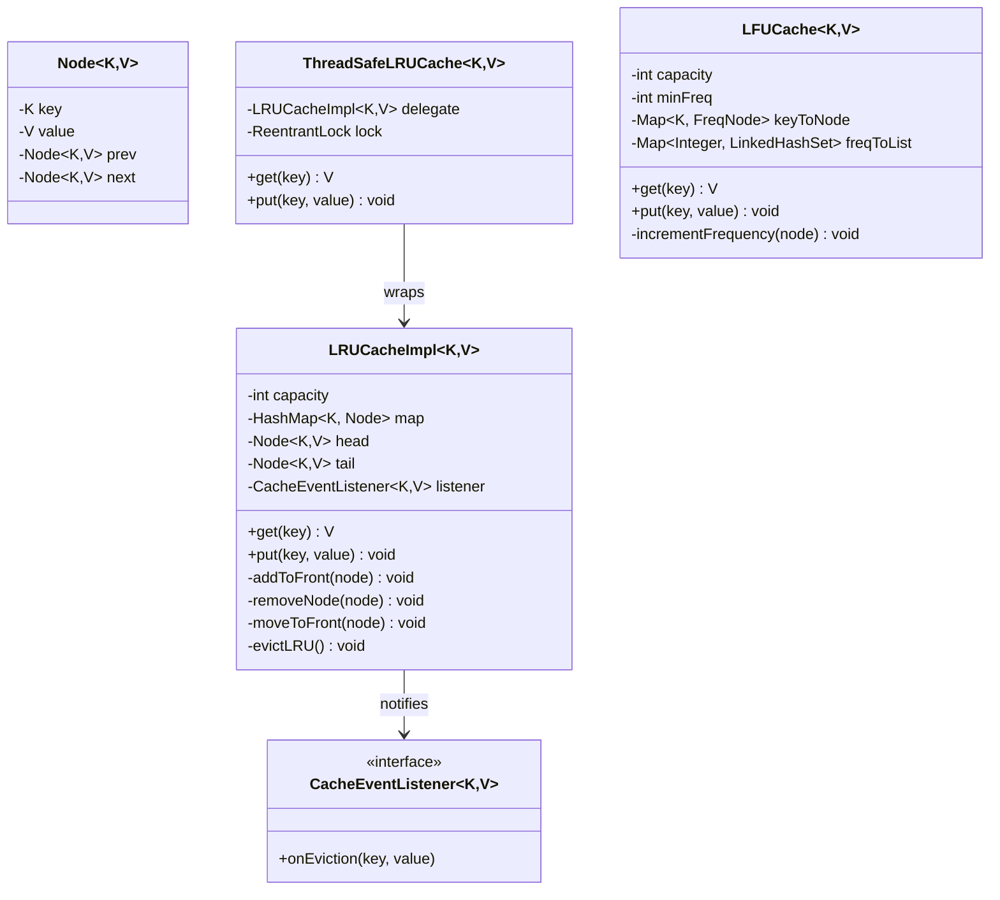
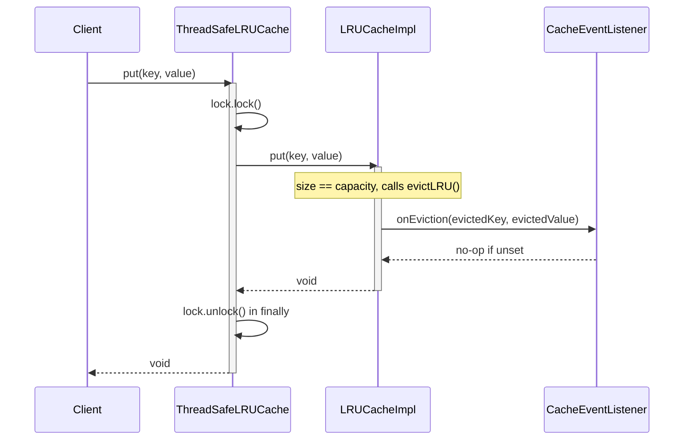
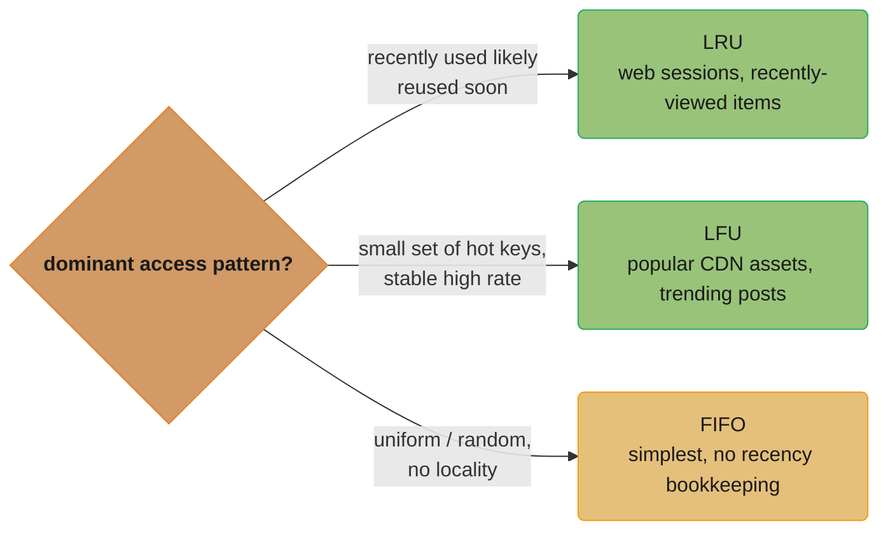
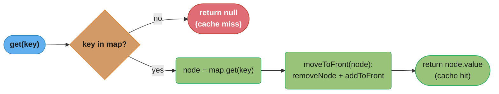
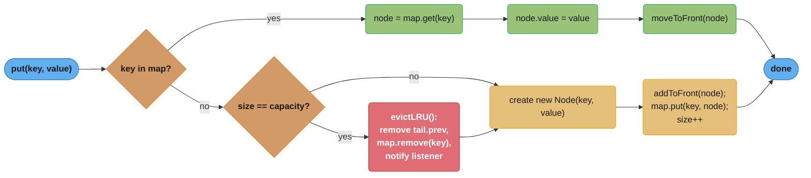

# LRU Cache — Low-Level Design

## Intuition

> **Design intuition**: LRU Cache is the canonical "data structure under pressure" interview question — implement `get(key)` and `put(key, value)` in **O(1)** time for a fixed-capacity cache, evicting the **L**east **R**ecently **U**sed entry when full. Unlike entity-heavy problems (Parking Lot, ATM), there is no sprawling class hierarchy — the entire challenge is choosing the right combination of two data structures and wiring them together correctly.

**Key insight**: Why can't a single `ArrayList` or `LinkedHashMap`-from-scratch solve this in O(1)? A `HashMap` alone gives O(1) lookup but has no notion of order — you can't tell which key was used least recently without an O(n) scan. A plain array/`ArrayList` gives ordering but moving an element to the "most recently used" position requires shifting elements — O(n). A **singly-linked list** gives O(1) insertion at the head, but removing an arbitrary node still requires O(n) traversal to find its predecessor. The fix is a **doubly-linked list** (each node holds `prev` and `next`), combined with a `HashMap<K, Node<K,V>>` that maps each key directly to its node. The HashMap gives O(1) *lookup*; the doubly-linked list's `prev`/`next` pointers give O(1) *removal and re-insertion* — together they give O(1) `get` and `put`. Sentinel `head`/`tail` nodes eliminate null-checks at the list boundaries.

---

## Problem Statement

Design an in-memory cache with a fixed capacity that:
- Stores key-value pairs of generic types `<K, V>`
- Supports `get(key)` — returns the value and marks the key as most recently used, or returns "not found" if absent
- Supports `put(key, value)` — inserts or updates a value and marks it as most recently used
- When the cache is full and a new key is inserted, evicts the **least recently used** entry automatically
- Both operations run in **O(1)** average time, including the eviction
- Optionally supports **thread-safe** access for concurrent readers/writers
- For comparison, also implement an **LFU (Least Frequently Used)** variant — same interface, different eviction policy, useful for workloads with stable "hot keys" rather than recency-based access patterns

---

## Requirements

### Functional
1. `get(K key)` — O(1) lookup; returns the value or a "miss" indicator; promotes the key to most-recently-used (MRU)
2. `put(K key, V value)` — O(1) insert/update; promotes the key to MRU; if a new key arrives at full capacity, evict the LRU entry first
3. Recency must be updated on **both** `get` and `put` — any access counts as "use"
4. Capacity is fixed at construction time and cannot be exceeded
5. Optional: notify listeners when an entry is evicted (for metrics/logging)

### Non-Functional
1. O(1) time for `get`, `put`, and eviction — no scans, no sorting
2. Generic `<K, V>` — works for any key/value types (subject to `equals`/`hashCode` correctness)
3. Thread-safety must be **opt-in** via composition, not baked into the core class (so single-threaded callers pay no locking overhead)
4. Memory overhead bounded by O(capacity) — exactly `capacity` nodes plus `capacity` HashMap entries, never more

---

## ASCII Class Diagram



`LRUCacheImpl` pairs a `HashMap` (O(1) lookup) with a doubly-linked list of `Node` sentinels (O(1) reorder/evict), and optionally notifies a `CacheEventListener` on eviction. `ThreadSafeLRUCache` decorates it with a `ReentrantLock` around `get`/`put`, released in a `finally` block; `LFUCache` is a separate, unrelated implementation with its own frequency-bucket fields — it shares no code or interface with `LRUCacheImpl`.

**Doubly-linked list layout** — the list order *is* the recency order, so no separate timestamp or counter is needed:

```
head <-> [MRU] <-> ... <-> [LRU] <-> tail
 ^                                    ^
 |                                    |
most recently used    least recently used
  (evicted last)          (evicted first)
```

`head` holds the most-recently-used node (evicted last); `tail` holds the least-recently-used node (evicted first) — every `get`/`put` relinks the accessed node to sit just after `head`.

---

## Patterns Used

This problem is fundamentally a **data structure** problem, not a pattern catalogue — the core `LRUCacheImpl<K,V>` is a hand-rolled algorithm (HashMap + doubly-linked list), not a GoF pattern. (It is named `LRUCacheImpl` in code only because the top-level demo class is itself called `LRUCache` — Java forbids two top-level types with the same name in one file.) Two patterns earn their place honestly around the edges:

### 1. Decorator — `ThreadSafeLRUCache<K,V>` wraps `LRUCacheImpl<K,V>`
**Why**: Most callers (single-threaded contexts, unit tests) don't need locking, and locking every `get`/`put` would add unconditional overhead. We also don't want two near-duplicate implementations of the eviction logic — one of which would inevitably drift out of sync with the other.

**How**: `ThreadSafeLRUCache<K,V>` holds a reference to a plain `LRUCacheImpl<K,V>` (composition, not inheritance) and a `ReentrantLock`. Every `get`/`put` acquires the lock, delegates to the wrapped cache, then releases the lock in a `finally` block. The core cache class is never modified — this is the Open/Closed Principle in action: new behavior (thread safety) added without touching existing, tested code.

---

### 2. Observer — `CacheEventListener<K,V>` for eviction notifications
**Why**: Production caches are routinely instrumented — metrics dashboards track eviction rate to size capacity correctly, and some systems need to know when a value is evicted so they can flush it to a slower backing store (write-back caching). Hard-coding `System.out.println` or a metrics call inside `evictLRU()` would couple the cache to a specific monitoring system.

**How**: `LRUCacheImpl<K,V>` optionally holds a single `CacheEventListener<K,V>` (set via constructor or setter). When `evictLRU()` runs, it calls `listener.onEviction(key, value)` before removing the node. The listener is a no-op by default (`null`-checked), so callers who don't care pay zero cost.

**Runtime collaboration** — a `put` that both requires locking (Decorator) and triggers an eviction (Observer) in one call:



The lock is held for the entire delegated `put` — including the eviction and notification — and released in a `finally` block so it unlocks even if `put` throws; `onEviction` fires synchronously before `put` returns, so a write-back listener can safely assume the evicted value is still valid at notification time.

---

### Why not Strategy / Template Method for eviction policy?
A `Strategy`-based `EvictionPolicy` interface (pluggable LRU/LFU/FIFO inside one `Cache<K,V>` class) is tempting, but it is **not** what this exercise demonstrates honestly: LRU's O(1) guarantee depends on the doubly-linked list being the *primary* data structure, while LFU's O(1) guarantee depends on frequency buckets being primary. Forcing both behind one `EvictionPolicy.onAccess(node)` interface either (a) leaks the internal node representation across the abstraction boundary, or (b) forces a common, slower data structure (e.g., a sorted structure, O(log n)). For interview purposes, presenting `LRUCache` and `LFUCache` as **two separate, complete implementations** that share an informal interface (`get`/`put`) is more honest about the real tradeoff — and is exactly how production libraries (Caffeine, Guava) treat them: different eviction algorithms are different cache builders, not interchangeable strategy objects on one engine.

---

## Design Decisions & Tradeoffs

| Decision | Alternative | Reason chosen |
|----------|-------------|---------------|
| Hand-rolled `HashMap` + doubly-linked list | Java's built-in `LinkedHashMap` with `removeEldestEntry` override | `LinkedHashMap` solves this in ~15 lines and is production-correct — but interviewers want to see the manual pointer manipulation that proves you understand *why* it's O(1) |
| Sentinel `head`/`tail` nodes (dummy, never hold real data) | Track `head`/`tail` as nullable references with null-checks everywhere | Sentinels eliminate ~6 special-case branches (empty list, single node, removing head/tail) — every `addToFront`/`removeNode` call is unconditional pointer surgery |
| `HashMap<K, Node<K,V>>` (map to node references) | `HashMap<K, V>` + separate list, scan list to find node by key | O(1) vs O(n) — without a direct node reference, "move this key to MRU" requires an O(n) search through the list |
| LRU eviction (recency-based) | LFU (frequency-based) / FIFO (insertion-order) | **LRU** fits workloads with *temporal locality* — recently-used data is likely to be reused soon (web sessions, recently-viewed products). **LFU** fits workloads with a small set of "hot keys" accessed at a stable high rate regardless of recency (popular CDN assets, trending posts) — a single burst of unrelated accesses won't evict the hot key under LFU but would under LRU. **FIFO** is simplest (no recency tracking at all) — acceptable when access patterns are uniform/random and the eviction-quality difference doesn't justify the bookkeeping cost |
| `ReentrantLock` around a plain `LRUCache` (Decorator) | `synchronized` methods on `LRUCache` directly | `ReentrantLock` supports `tryLock()` with timeout (fail fast under contention), is `Decorator`-friendly (wraps without modifying), and avoids paying lock overhead for single-threaded callers. `synchronized` is simpler but bakes locking into the core class permanently |
| `ReentrantLock` / `synchronized` (pessimistic) | Lock-free CAS-based structures (e.g., `ConcurrentHashMap` + atomic pointer swaps) | CAS-based doubly-linked lists are notoriously hard to get correct (ABA problem, concurrent removal races) and rarely worth it — `ConcurrentLinkedHashMap`-style designs (used by Guava/Caffeine) instead use **striped locks** or amortize recency tracking via a sampled/approximate LRU, trading strict ordering for throughput |

**Choosing an eviction policy** — the access-pattern question the LRU-vs-LFU-vs-FIFO row above answers visually:



A single burst of unrelated accesses evicts the wrong key under LRU if the real hot set is frequency-based (and vice versa) — picking the axis that matches the workload's actual locality is the interview-defensible answer, not a default reach for LRU.

---

## State / Flow

### `get(key)`



A cache hit (green) relinks the node to just after `head` in O(1) before returning; a cache miss (red) returns immediately with no list mutation — recency is updated on every hit, never on a miss.

### `put(key, value)`



The **update** branch (green) never touches capacity or eviction; the **insert** branch forks again on `size == capacity`, evicting the LRU tail (red) only when the cache is actually full before constructing and registering the new node (gold).

---

## Sample Output

```
========================================
   LRU Cache — LLD Demo
========================================

--- LRUCache (capacity = 3) ---
put(1, "A")  -> cache: [1=A]
put(2, "B")  -> cache: [2=B, 1=A]
put(3, "C")  -> cache: [3=C, 2=B, 1=A]
get(1)       -> "A"   | cache: [1=A, 3=C, 2=B]
             -> EVICTED key=2 (value=B)
put(4, "D")  -> cache: [4=D, 1=A, 3=C]
get(2)       -> null (miss, was evicted)
get(3)       -> "C"   | cache: [3=C, 4=D, 1=A]

--- ThreadSafeLRUCache (capacity = 2, 4 threads) ---
[thread] put(10, "X")
[thread] put(20, "Y")
[thread] get(10) -> "X"
[listener] EVICTED key=20 (value=Y)
[thread] put(30, "Z")
Final state: [30=Z, 10=X]   (no corruption under concurrent access)

--- LFUCache (capacity = 3) ---
put(1, "A")  -> freq{1=[1]}
put(2, "B")  -> freq{1=[1, 2]}
put(3, "C")  -> freq{1=[1, 2, 3]}
get(1)       -> "A"  | freq{1=[2, 3], 2=[1]}
get(1)       -> "A"  | freq{1=[2, 3], 3=[1]}
             -> EVICTED key=2 (value=B, was least frequently used)
put(4, "D")  -> freq{1=[3, 4], 3=[1]}

--- LRU vs LFU contrast ---
Same access pattern, different eviction:
  LRU  would evict key=3 (least *recently* used)
  LFU  evicted  key=2 (least *frequently* used)

========================================
              Demo complete
========================================
```

---

## Cross-Perspective: HLD Connections

**HLD View — Where LRU Cache Design Scales to Distributed Systems**

- **In-process LRU -> distributed cache eviction** — This exact node + map structure is the building block inside Redis's and Memcached's per-shard memory managers. At HLD scale, exact LRU becomes too expensive (maintaining a strict doubly-linked list across millions of keys means every `GET` triggers a write to update recency) — so Redis uses **approximated LRU**: it samples a small set of keys and evicts the oldest among the sample. See `../../hld/caching/README.md` for eviction policies (LRU, LFU, random, TTL) at the distributed-cache layer.
- **Cache-aside / read-through patterns** — The `get`-miss-then-`put` pattern in this LLD maps directly to the cache-aside pattern at HLD scale: application checks cache, on miss reads from the database and populates the cache. See `../../database/database_caching_patterns/README.md` for read-through, write-through, and write-back variants applied to database-backed caches.
- **CDN edge-cache eviction** — CDN edge nodes run LRU/LFU-style eviction on cached assets (images, video segments) with capacity measured in disk space rather than entry count — the same "evict least-valuable item to make room" logic, just with variable-sized entries instead of fixed-size nodes.
- **Cache stampede / thundering herd** — A related production concern: when a hot key is evicted (or expires) under high concurrent load, many requests simultaneously miss the cache and hit the backing store at once, potentially overwhelming it. Mitigations (request coalescing, probabilistic early expiration, locks on cache-fill) are covered in `../../hld/caching/README.md`.

---

## Follow-Up Extensions

1. **LFU with O(1) operations** — already implemented in `LFUCache<K,V>` below using a frequency-to-key-list map plus a `minFreq` pointer; the classic LeetCode 460 approach.

2. **LRU-K** — instead of evicting based on the single most-recent access, track the timestamp of the *K-th* most recent access per key (e.g., LRU-2). This prevents a single one-off access from artificially promoting a rarely-used key to MRU — used in database buffer pool management (e.g., PostgreSQL's variant).

3. **TTL-based expiry combined with LRU** — each `Node<K,V>` gains an `expiresAt` timestamp; `get` checks expiry before returning (lazy expiration) and a background sweep thread can proactively evict expired entries even if capacity isn't reached (active expiration), mirroring Redis's hybrid lazy + active expiry.

4. **Write-back vs write-through cache** — write-through writes to the backing store synchronously on every `put` (simple, consistent, slower); write-back buffers writes in the cache and flushes to the backing store asynchronously or on eviction (faster, risk of data loss on crash) — the `CacheEventListener.onEviction` hook is exactly where a write-back flush would be triggered.

5. **Distributed LRU cache coordination** — when the cache is sharded across multiple nodes (consistent hashing to pick the shard per key), each shard runs its own local LRU independently. Global LRU ordering across shards is generally not maintained — instead, each shard's capacity is sized proportionally, and cross-node consistency (if needed) is handled via invalidation messages (pub/sub) rather than a shared linked list.
