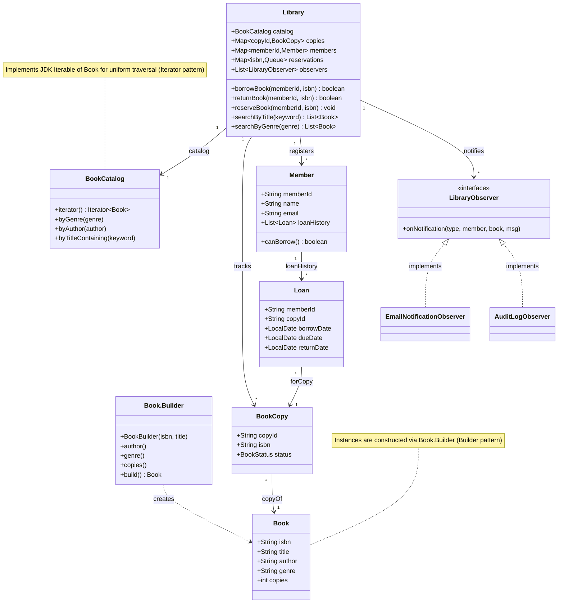
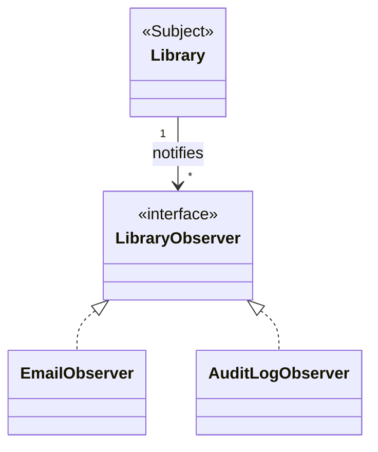
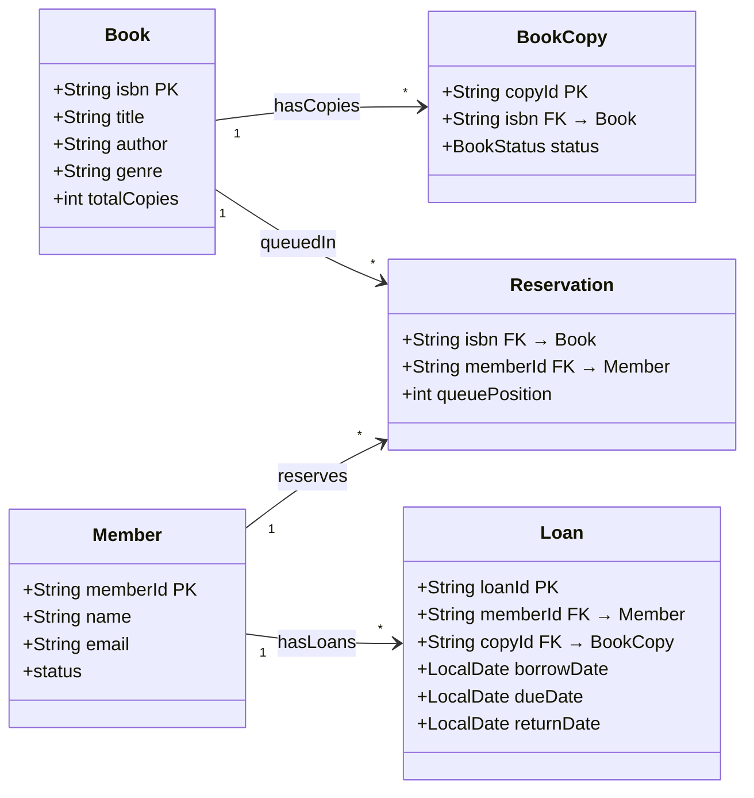
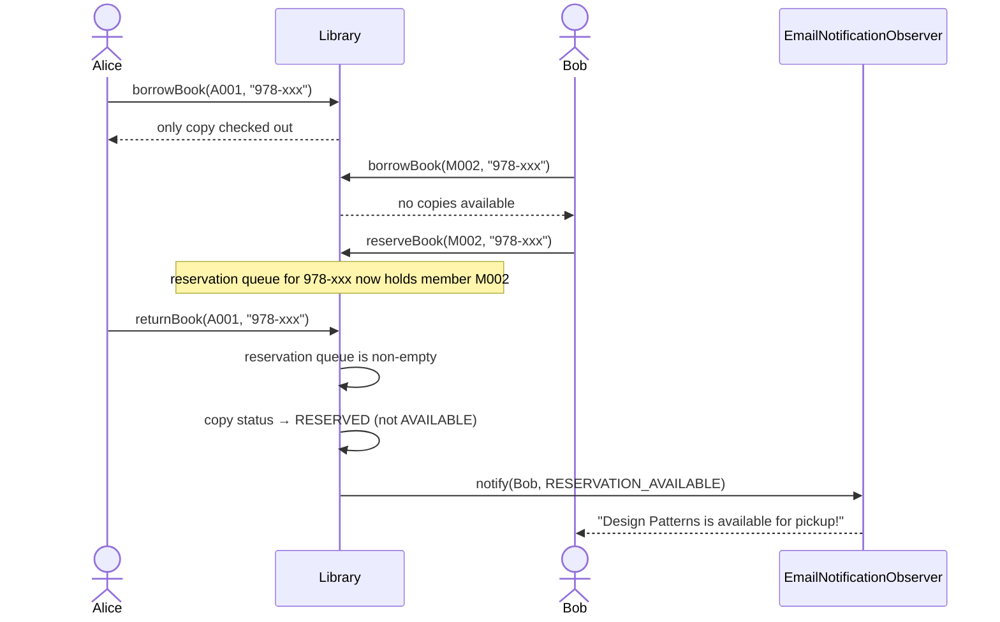
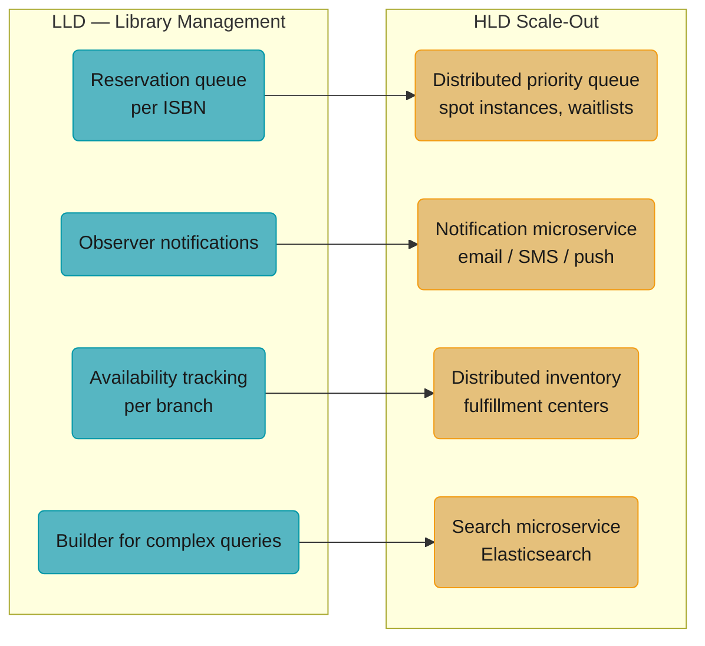

# Library Management System — Builder + Iterator + Observer

## Intuition

> **One-line analogy**: Library Management is a Builder + Iterator + Observer problem — complex objects are constructed step-by-step, collections are traversed uniformly, and members are notified automatically when their reserved book becomes available.

**Mental model**: A `Book` has many optional attributes (ISBN, authors, genres, edition, language) — a classic Builder candidate. The catalog must support diverse search queries (by title, author, genre, availability) — an Iterator over filtered views. When a book is returned and a reservation queue is waiting, observers fire automatically to notify the next in line — Observer in its most natural form.

**Why it matters**: Library Management combines three patterns that individually feel abstract but together model a real workflow elegantly. It also introduces the concept of a reservation queue, which requires careful ordering and notification logic.

**Key insight**: The borrowing flow has multiple failure modes: book not found, no available copies, member limit exceeded, member suspended. Model these as explicit return types or exceptions — not silent boolean returns — so callers can distinguish and respond to each case.

---

## Problem Statement

Design a Library Management System that:
- Catalogs books with rich metadata (ISBN, title, author, genre, copies)
- Allows members to search, borrow, and return books
- Manages reservations when books are unavailable
- Notifies members of due dates, returns, and reservations
- Tracks borrow history for all members

---

## Class Diagram



`Library` composes `BookCatalog`, the per-copy inventory, members, and the observer list; `Book.Builder` constructs `Book` (Builder), `BookCatalog` implements `Iterable<Book>` for uniform traversal (Iterator), and `LibraryObserver` is realized by `EmailNotificationObserver`/`AuditLogObserver` (Observer). `Library.reservations` maps each ISBN to a FIFO queue of waiting member IDs (see Key Design Decisions below).

---

## Patterns Used

### 1. Builder Pattern — `Book`

The `Book` class has 2 required and 6 optional fields. Without Builder:
```java
// Constructor hell — which param is which?
Book b = new Book("978-xxx", "Title", "Author", 2008, "Genre", 3, "Publisher", "English");
```

With Builder:
```java
Book book = new Book.Builder("978-xxx", "Effective Java") // required
    .author("Joshua Bloch")
    .publicationYear(2018)
    .genre("Programming")
    .copies(3)
    .build();
```

Benefits: readable, validated at build time, optional fields have defaults.

### 2. Iterator Pattern — `BookCatalog`

`BookCatalog` implements `Iterable<Book>` and exposes filtering iterators:
```java
// Client uses iterator — doesn't know about internal List
Iterator<Book> programmingBooks = catalog.byGenre("Programming");
while (programmingBooks.hasNext()) {
    Book b = programmingBooks.next();
    // process...
}
```

This decouples the catalog's internal structure from clients. The catalog could switch from `ArrayList` to a database-backed store without changing client code.

### 3. Observer Pattern — Notifications



`Library` (the Subject) depends only on the `LibraryObserver` interface, never on a concrete implementation — new channels like SMS or push notifications just add another realization, with zero changes to `Library`.

Events published:
- `BORROW_CONFIRMED` — when book is checked out
- `RETURN_CONFIRMED` — when book is returned
- `RESERVATION_AVAILABLE` — when a reserved book becomes available
- `OVERDUE` — when due date passes (triggered by batch job)

New notification channels (SMS, push notification) just implement `LibraryObserver` — no changes to `Library`.

---

## Data Model



The persistence layer mirrors the class model with explicit keys: `Book` is 1-to-many with `BookCopy` (one row per physical copy), `Member` is 1-to-many with `Loan` (full borrow history), and `Reservation` joins `Book`/`Member` per ISBN queue position. `BookCopy.status` cycles AVAILABLE, BORROWED, RESERVED, LOST; `Loan.returnDate` stays null while a loan is active.

---

## Key Design Decisions

**Q: Why `Queue<String>` for reservations instead of `List`?**
FIFO ordering — first member to reserve gets first pick when a copy becomes available. Queue's `poll()` naturally gives the next in line.

**Q: Why `Loan` object instead of just tracking borrowDate in `BookCopy`?**
A Loan is a domain concept with its own lifecycle (borrow → return → overdue). It enables loan history, fine calculation, and report generation. Single Responsibility.

**Q: How is the reservation notification triggered?**
In `returnBook()` — when a copy is returned, the library immediately checks the reservation queue. If non-empty, it marks the copy as RESERVED and notifies the first waiter. This is event-driven (better than a cron job polling).

---

## Reservation Flow



Two members converge on the same single-copy title: Bob's reservation queues behind Alice's active loan, and `Library.returnBook()` — instead of flipping the copy back to AVAILABLE — marks it RESERVED and pushes an Observer notification straight to Bob, an event-driven alternative to polling a cron job.

---

## Cross-Perspective: HLD Connections

**HLD View — Where Library Management Scales to Distributed Systems**

- **Reservation queue → distributed priority queue** — The book reservation queue maps to distributed task scheduling and resource reservation: medical appointment systems, cloud spot instance queuing, event ticket waitlists. The core problem — queue waiters, notify on availability, handle expiry — is identical at both scales.
- **Observer notifications → notification microservice** — Due-date reminders, return notifications, and reservation availability alerts map to a dedicated notification microservice at HLD scale: it subscribes to library domain events (BookReturned, OverdueBook) and dispatches email/SMS/push via appropriate channels.
- **Availability tracking → distributed inventory** — Tracking available copies across a library network (multiple branches) is a distributed inventory management problem — the same challenge as e-commerce stock management across fulfillment centers. Consistency requirements determine whether you need strong or eventual consistency.
- **Builder for complex queries → search microservice** — Complex catalog search (by title, author, genre, availability, language) at scale becomes a dedicated search service backed by Elasticsearch, with the Builder pattern used to construct search queries from multiple optional filters.



Each Library Management mechanic has a direct distributed-systems analogue — the same "queue waiters, notify on availability" shape recurs at both scales, just with different infrastructure underneath.

---

## Follow-Up Extensions

1. **Fine calculation**: `Loan.calculateFine()` — strategy pattern for different fine rates
2. **Digital books**: `DigitalBook extends Book` with unlimited copies, download links
3. **Multi-branch support**: Each branch has its own inventory; inter-branch borrowing
4. **Barcode scanning**: `copyId` maps to physical barcode
5. **Renewal**: Extend due date if no reservations pending
6. **Reading lists**: Members maintain wish lists
7. **Book recommendations**: Observer pattern collects borrow events for collaborative filtering
