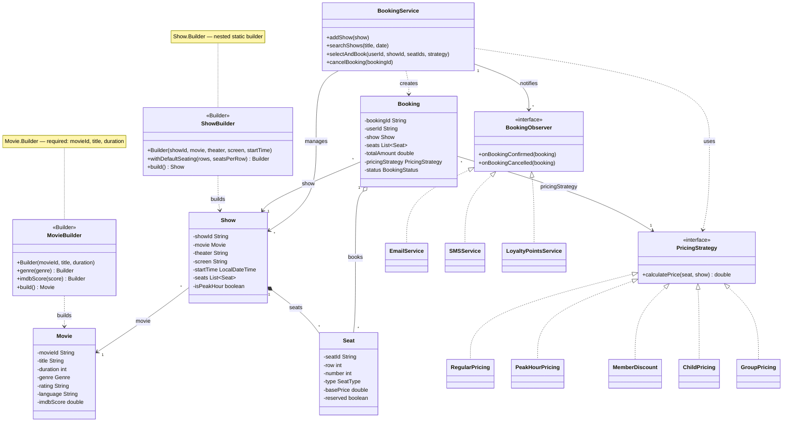
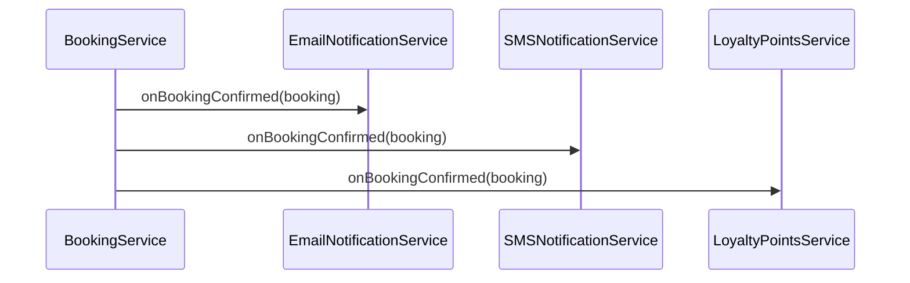
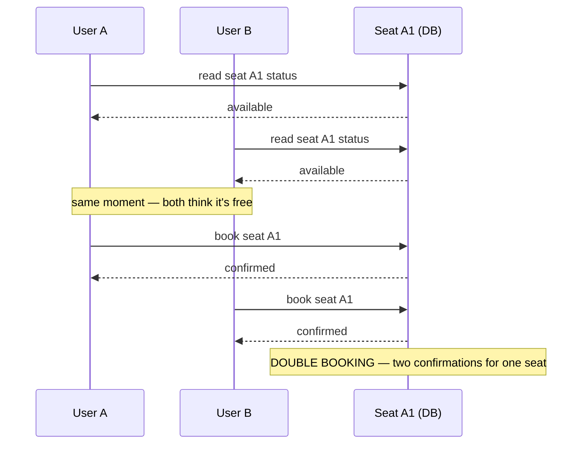
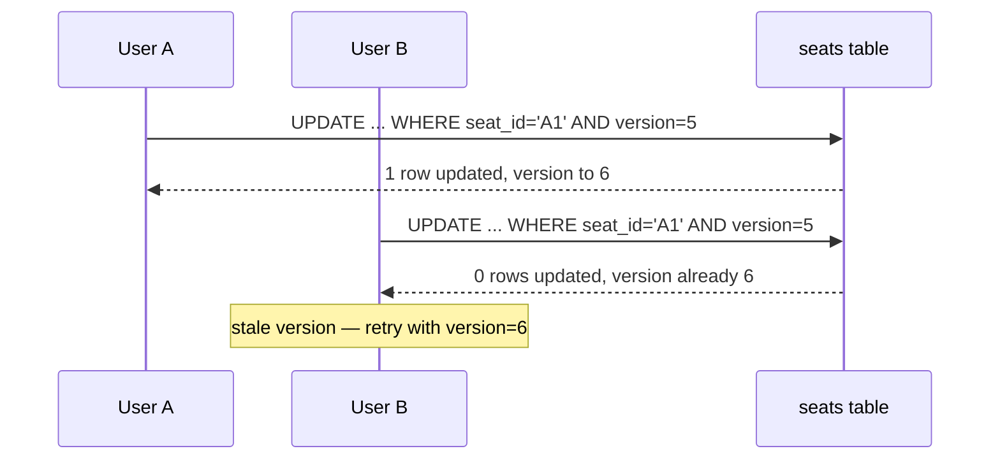
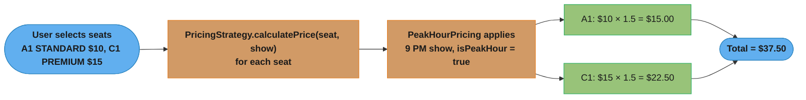

# Online Booking System — Builder + Strategy + Observer

## Intuition

> **One-line analogy**: Online Booking is a concurrency problem dressed as a design problem — the interesting challenge isn't the class hierarchy, it's preventing two users from booking the same seat simultaneously at scale.

**Mental model**: The functional model is straightforward: Show → Seats → Booking → Payment. The real design challenge is the seat reservation race condition. At BookMyShow scale (1M+ bookings/day), two users can click the same seat in milliseconds. The solution is a short-lived pessimistic lock (optimistic locking with version checks, or a `reserved` flag + TTL) that holds the seat while the user completes payment. Dynamic pricing (Strategy pattern) then applies multipliers based on seat type, show time, and membership tier.

**Why it matters**: This problem combines Builder (complex Movie/Show construction), Strategy (pricing algorithms), Observer (email/SMS/loyalty notifications), and concurrency thinking — making it a comprehensive interview problem that tests both patterns and distributed systems instincts.

**Key insight**: The most common interview miss is ignoring seat lock expiry. Model the reservation as a time-bounded lock: if payment isn't completed within N minutes, the seat is released. This also requires a cleanup mechanism (scheduler or TTL).

---

## Problem Statement

Design a movie ticket booking system that handles:
- 1M+ bookings/day (BookMyShow, Fandango scale)
- Concurrent seat selection without double-booking
- Dynamic pricing based on time, membership, group size
- Multi-channel notifications (email, SMS, loyalty points)

---

## Class Diagram



Movie/Show are assembled via nested Builders (required fields enforced in the constructor, optional fields via fluent setters); `PricingStrategy` and `BookingObserver` are the two interfaces realized by five pricing algorithms and three notification channels respectively — swapping either in requires zero changes to `BookingService`.

---

## Patterns Used

### Builder — Movie and Show

Both `Movie` and `Show` have many optional fields. Builder makes construction readable and validates required fields.

```java
Movie movie = new Movie.Builder("M001", "Inception", 148) // required
    .genre(Genre.SCIFI)
    .director("Christopher Nolan")
    .imdbScore(8.8)
    .build();

Show show = new Show.Builder("S001", movie, "CityPlex", "Screen A", showTime)
    .withDefaultSeating(6, 8)  // 6 rows, 8 seats each
    .build();
```

### Strategy — Pricing

Pricing is a classic Strategy example — the algorithm for calculating price varies, but the interface is the same.

```java
// At booking time, client selects the strategy
PricingStrategy strategy = member.isPremium()
    ? new MemberDiscountPricing(20)
    : new PeakHourPricing();

service.selectAndBook(userId, showId, seatIds, strategy);
```

| Strategy | Logic |
|----------|-------|
| `RegularPricing` | Base price |
| `PeakHourPricing` | 1.5× on evenings/weekends |
| `MemberDiscountPricing` | configurable % off |
| `ChildPricing` | max $7 flat |
| `GroupPricing` | 20% off for 10+ people |

### Observer — Notifications



Adding a new channel (push notification, WhatsApp) = add one class + register it. No changes to `BookingService`.

---

## Concurrency Challenge: Double-Booking Prevention

The hardest problem in booking systems is concurrent seat selection.

### The Race Condition:


Both reads land in the same race window before either write commits, so both bookings appear to succeed — this is exactly why the fix below needs an atomic check-and-set instead of a read-then-write.

### Solutions:

**1. Optimistic Locking (recommended for most systems)**
```sql
UPDATE seats SET reserved = true, version = version + 1
WHERE seat_id = 'A1' AND reserved = false AND version = :expectedVersion
-- If 0 rows updated → someone else got it first → retry
```

This resolves the exact UserA/UserB race shown above: both transactions read the same `version`, but only the first `UPDATE` to commit advances it — the second's `WHERE version = :expectedVersion` then matches zero rows instead of silently overwriting.



UserB's compare-and-set fails cleanly instead of double-booking; the retry re-reads the seat at `version = 6` and, if it is now reserved, surfaces `SeatAlreadyTakenException` to the caller.

**2. Pessimistic Locking**
```sql
SELECT * FROM seats WHERE seat_id = 'A1' FOR UPDATE;
-- Locks the row, others must wait
```

**3. Redis Distributed Lock**
```java
String key = "seat_lock:" + seatId;
boolean locked = redis.setNX(key, userId, 10, TimeUnit.SECONDS);
if (!locked) throw new SeatAlreadyTakenException();
// ... proceed with booking
```

**4. Database Transaction with Isolation Level**
```java
@Transactional(isolation = Isolation.SERIALIZABLE)
public Booking selectAndBook(...) { ... }
```

The current implementation uses in-memory synchronization suitable for single-instance; production needs option 1 or 3.

---

## Pricing Calculation Flow



Each seat's `calculatePrice` runs independently through the same `PeakHourPricing` strategy (9 PM show triggers the 1.5× multiplier), then the per-seat results sum to the booking's `totalAmount`.

---

## Database Schema

```sql
CREATE TABLE movies (
    movie_id VARCHAR PRIMARY KEY,
    title VARCHAR NOT NULL,
    duration_minutes INT,
    genre VARCHAR,
    rating VARCHAR
);

CREATE TABLE shows (
    show_id VARCHAR PRIMARY KEY,
    movie_id VARCHAR REFERENCES movies(movie_id),
    theater VARCHAR,
    screen VARCHAR,
    start_time TIMESTAMP NOT NULL,
    is_peak_hour BOOLEAN
);

CREATE TABLE seats (
    seat_id VARCHAR,
    show_id VARCHAR REFERENCES shows(show_id),
    row_label VARCHAR,
    seat_number INT,
    seat_type VARCHAR,  -- STANDARD, PREMIUM, VIP
    base_price DECIMAL,
    reserved BOOLEAN DEFAULT false,
    version INT DEFAULT 0,  -- for optimistic locking
    PRIMARY KEY (seat_id, show_id)
);

CREATE TABLE bookings (
    booking_id VARCHAR PRIMARY KEY,
    user_id VARCHAR,
    show_id VARCHAR REFERENCES shows(show_id),
    total_amount DECIMAL,
    pricing_strategy VARCHAR,
    status VARCHAR,
    booked_at TIMESTAMP
);

CREATE TABLE booking_seats (
    booking_id VARCHAR REFERENCES bookings(booking_id),
    seat_id VARCHAR,
    price_paid DECIMAL,
    PRIMARY KEY (booking_id, seat_id)
);
```

---

## Scale Estimates (BookMyShow India scale)

- 5M bookings/day → ~60 bookings/sec average, ~300/sec peak
- 10K shows/day, 200 seats/show → 2M seat records/day
- Caching: show catalog (Redis, TTL 1hr), seat availability (Redis, TTL 5min)
- Sharding by show_id for seats table

---

## Cross-Perspective: HLD Connections

**HLD View — Where Online Booking Scales to Distributed Systems**

- **Seat lock → distributed lock** — The temporary seat reservation during checkout is a distributed locking problem. At scale (BookMyShow: 1M+ bookings/day), the lock is implemented via Redis SETNX with a TTL: if payment isn't completed within 10 minutes, the lock expires and the seat is released. A cleanup job handles expired locks as backup.
- **Double-booking prevention → optimistic locking** — Two users clicking the same seat simultaneously requires either pessimistic locking (SETNX) or optimistic locking (version field in the database, reject on CAS failure). At high concurrency, optimistic locking with conflict detection and user-facing retry is more scalable.
- **Dynamic pricing → pricing microservice** — Pricing logic (peak hours, membership tier, group discount, demand surge) becomes a dedicated pricing service with its own data store at HLD scale. The Strategy pattern structures the pricing algorithms internally within the pricing service.
- **Notification fan-out → event-driven** — Post-booking notifications (email receipt, SMS confirmation, loyalty points update) are decoupled from the booking flow via a message queue. The booking service publishes `BookingConfirmed`; email, SMS, and loyalty services consume it independently — Observer at infrastructure scale.

---

## Follow-Up Extensions

1. **Waitlist**: Queue of users waiting for cancellations
2. **Dynamic pricing**: ML model adjusting prices based on real-time demand
3. **Food & beverage**: Add-ons using Decorator pattern
4. **Seat recommendation**: Suggest best available seats based on preference
5. **Multi-city rollout**: Tenant-aware sharding by city
6. **Corporate bookings**: Bulk booking with invoice generation
