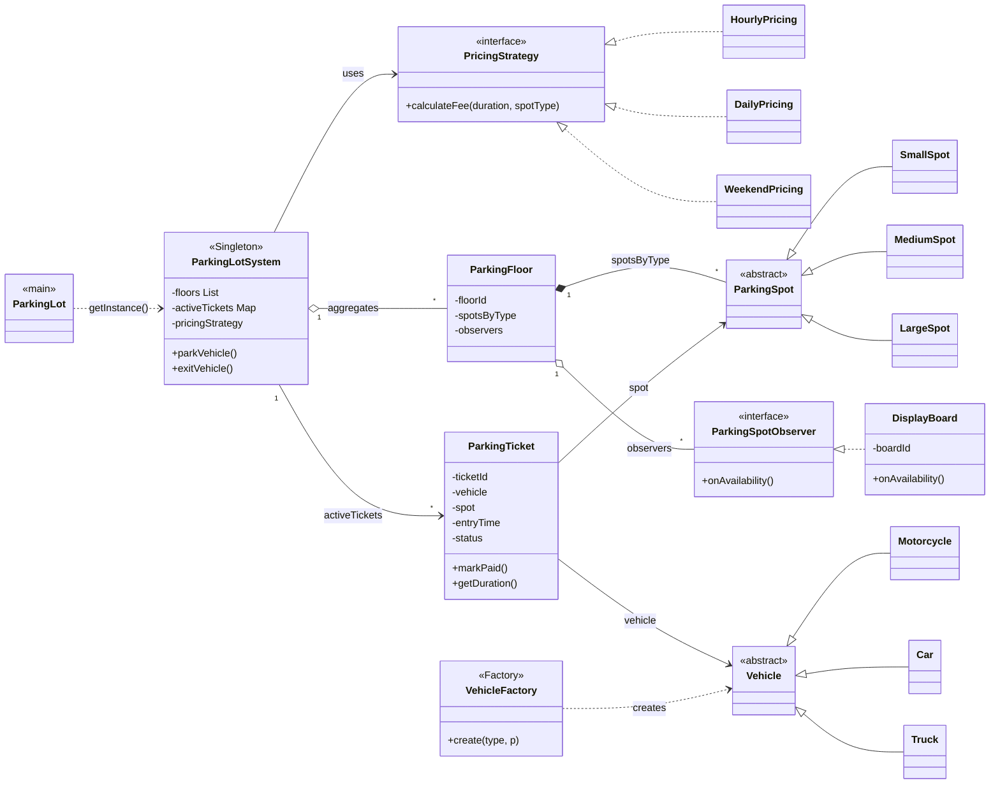
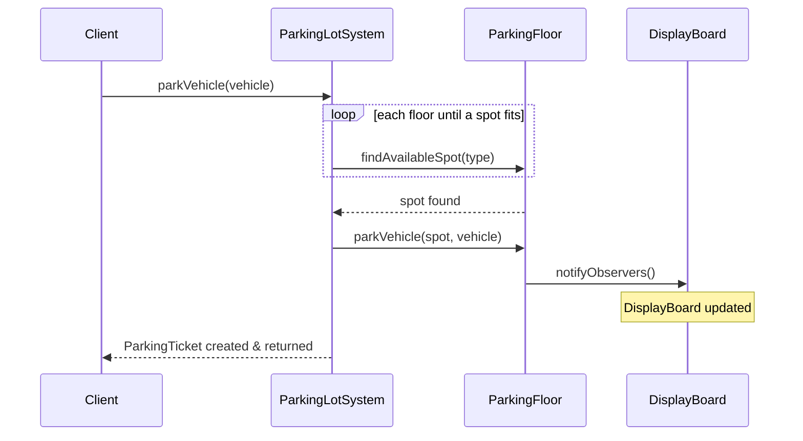
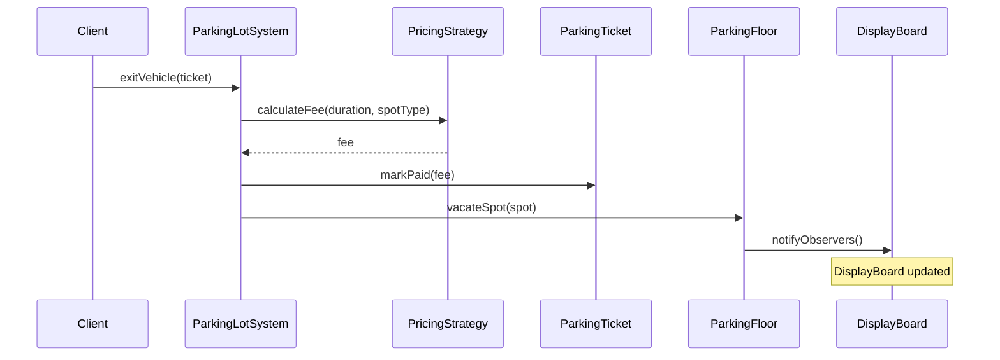

# Parking Lot — Low-Level Design

## Intuition

> **Design intuition**: Parking Lot is the classic LLD interview problem — it teaches entity modeling (Vehicle, Spot, Ticket), state machine (spot: Available → Occupied → Available), Strategy pattern (pricing: hourly vs. flat), Observer (display boards notified on changes), and Singleton (one lot instance).

**Key insight**: The hardest design decision is the "find nearest available spot" algorithm — do you store spots in a sorted structure (TreeMap by floor + spot number), or scan linearly? For interview purposes, the class structure matters more than the algorithm. Focus on getting entities, relationships, and pattern applications right.

---

## Problem Statement

Design a parking lot system that can:
- Support multiple vehicle types (Motorcycle, Car, Truck) with different space requirements
- Manage multiple floors, each with a mix of Small / Medium / Large spots
- Issue tickets on entry and calculate fees on exit
- Support pluggable pricing models (hourly, daily, weekend flat-rate)
- Notify display boards (and other observers) whenever spot availability changes
- Allow only one global lot instance (single entry point for operations)

---

## Requirements

### Functional
1. Park a vehicle — find the nearest available, correctly-sized spot
2. Exit a vehicle — calculate fee, free the spot, update displays
3. Query availability — how many spots of each type remain per floor
4. Pluggable pricing — swap pricing algorithms without touching core logic
5. Real-time display updates whenever a vehicle parks or exits

### Non-Functional
- Thread-safe singleton for the lot instance
- O(1) spot lookup per type per floor (grouping by ParkingSpotType)
- Easy to add new vehicle types or pricing models without modifying existing classes

---

## ASCII Class Diagram



*`ParkingLotSystem` is the Singleton coordinator: it aggregates `ParkingFloor`s, delegates fee math to a swappable `PricingStrategy` (Strategy pattern), and each floor fans availability changes out to its `ParkingSpotObserver`s such as `DisplayBoard` (Observer pattern); `VehicleFactory` centralises which `Vehicle` subclass gets constructed (Factory pattern).*

---

## Patterns Used

### 1. Singleton — `ParkingLotSystem`
**Why**: There is exactly one physical parking lot. All entry/exit operations must go through a single coordinating instance to prevent race conditions and ensure consistent ticket counters.

**How**: Private constructor + `getInstance()` with `synchronized` keyword for thread safety.

---

### 2. Strategy — `PricingStrategy`
**Why**: Pricing rules change frequently (peak hours, weekends, monthly passes). Encoding them in if/else inside the lot would make the class brittle and hard to test.

**How**: `PricingStrategy` interface with `calculateFee(Duration, ParkingSpotType)`. The lot holds a reference that can be swapped at runtime via `setPricingStrategy()`.

| Implementation  | Algorithm                                   |
|-----------------|---------------------------------------------|
| HourlyPricing   | ceil(minutes/60) × rate-per-spot-type       |
| DailyPricing    | ceil(hours/24) × daily-rate-per-spot-type   |
| WeekendPricing  | flat fee per entry, independent of duration |

---

### 3. Observer — `ParkingSpotObserver` / `DisplayBoard`
**Why**: Multiple external systems (physical boards, mobile apps, reservation engines) need to react when availability changes. Hard-coding these calls inside `ParkingFloor` would create tight coupling.

**How**: `ParkingFloor` maintains a list of `ParkingSpotObserver`s. After every `parkVehicle` or `vacateSpot`, it calls `onAvailabilityChanged(floorId, type, count)` on each observer.

---

### 4. Factory — `VehicleFactory`
**Why**: Callers should not need to know which concrete Vehicle subclass to instantiate. The factory centralises the mapping from `VehicleType` enum to subclass, making it easy to add new types.

---

## Design Decisions & Tradeoffs

| Decision | Alternative | Reason chosen |
|----------|-------------|---------------|
| Spots grouped by type in a `Map<ParkingSpotType, List<ParkingSpot>>` | Single flat list | O(n/k) vs O(n) lookup; avoids scanning wrong-sized spots |
| Floor-level observer notifications | Lot-level notifications | Observers receive the specific floor and type — actionable info |
| Ticket stores a direct reference to `ParkingSpot` | Store only spotId | Simpler; spot reference valid for the lifetime of the ticket |
| `requiredSpotType()` on Vehicle | Mapping table in the lot | Encapsulation — vehicle knows its own requirements |
| Synchronized `getInstance` | Double-checked locking | Simpler; startup is not on the hot path |

---

## State / Flow

**Park flow:**



*`parkVehicle` loops floors until `findAvailableSpot` succeeds, delegates the actual placement to `ParkingFloor`, and lets the floor fan the change out to its `DisplayBoard` observers (Observer pattern) before returning the new `ParkingTicket`.*

**Exit flow:**



*`exitVehicle` delegates fee math to the currently-configured `PricingStrategy` (Strategy pattern — swappable without touching this method), settles the `ParkingTicket`, then vacates the spot and re-notifies observers.*

---

## Sample Output

```
========================================
   Parking Lot System — LLD Demo
========================================

--- Parking vehicles ---
  [Board-ENTRY] Floor F1  | SMALL    available: 1
  [Board-APP]   Floor F1  | SMALL    available: 1
[Lot] MOTORCYCLE(MBC-001) parked → spot S1-01 on F1 | TKT-1001
  [Board-ENTRY] Floor F1  | MEDIUM   available: 1
  [Board-APP]   Floor F1  | MEDIUM   available: 1
[Lot] CAR(CAR-101) parked → spot M1-01 on F1 | TKT-1002
...

--- Exiting vehicles (Hourly pricing) ---
[Lot] MOTORCYCLE(MBC-001) exited | Duration: 0h 0m | Fee: $2.00
[Lot] CAR(CAR-101) exited | Duration: 0h 0m | Fee: $3.50

--- Switching to Weekend flat pricing ---
[Lot] CAR(CAR-202) exited | Duration: 0h 0m | Fee: $12.00
[Lot] TRUCK(TRK-999) exited | Duration: 0h 0m | Fee: $18.00

--- Double-exit attempt (expected error) ---
Caught: Ticket TKT-1001 is not active.
```

---

## Cross-Perspective: HLD Connections

**HLD View — Where Parking Lot Design Scales to Distributed Systems**

- **Slot allocation → resource reservation** — Parking spot assignment maps directly to distributed resource allocation: cloud VM slots, database connection slots, appointment booking systems. The core challenge (find available slot, reserve atomically, release on completion) is identical at both scales.
- **Observer → real-time dashboards** — Display boards notified via Observer map to WebSocket/SSE push for real-time availability dashboards in mobile apps. At HLD scale, the display board is a notification service publishing to subscribed clients.
- **Pricing Strategy → rate card service** — The pluggable pricing strategy becomes a dedicated pricing microservice at HLD scale. Dynamic pricing (demand-based, time-of-day, event-based) is served via API so pricing changes don't require redeploying the parking system.
- **Thread safety → distributed locking** — The `synchronized` block on spot assignment becomes a distributed lock (Redis SETNX with TTL) at HLD scale, preventing two users at different service instances from booking the same spot simultaneously.

---

## Follow-Up Extensions

1. **Reservations** — add a `Reservation` entity; reserve a spot for a time window before the vehicle arrives. Requires a scheduler to expire stale reservations.

2. **Online booking & payment** — integrate a `PaymentGateway` interface (Strategy) with implementations for credit card, UPI, wallet. Issue digital receipts.

3. **EV charging stations** — add a `ChargingSpot extends LargeSpot` with `chargerType` (Level 2 / DC Fast). Track charging sessions and billing separately.

4. **Dynamic pricing** — introduce a `DemandBasedPricingDecorator` that wraps any `PricingStrategy` and applies a multiplier based on current occupancy percentage.

5. **Multi-level concurrency** — use `ReentrantLock` per floor or `ConcurrentHashMap` for ticket storage to support high-throughput concurrent arrivals.

6. **Accessibility spots** — add `AccessibleSpot` subtype; enforce that only registered accessible vehicles can use them.
